# Godot Engine 3D 角色控制器深度分析

## 1. 概述

Godot 的 3D 角色控制器以 `CharacterBody3D` 为核心，提供 `move_and_slide()` 碰撞滑动逻辑，但**不包含**内置的第一人称/第三人称控制器模板。与 UE 的 `ACharacter` + `UCharacterMovementComponent` 全功能框架相比，Godot 采用**极简核心 + 用户拼装**的设计哲学，移动、动画、相机三者松耦合，需用户在 GDScript/C# 中手动串联。

## 2. 检索过程

1. `scene/3d/physics/character_body_3d.h` → CharacterBody3D 完整类定义，MotionMode 枚举，CollisionState 联合体
2. `scene/3d/physics/character_body_3d.cpp` → `move_and_slide()` / `_move_and_slide_grounded()` / `_move_and_slide_floating()` 完整实现
3. `scene/3d/physics/physics_body_3d.h` → PhysicsBody3D，`move_and_collide()` 底层接口
4. `scene/3d/physics/collision_object_3d.h` → CollisionObject3D，ShapeData 结构
5. `scene/3d/camera_3d.h` → Camera3D，投影类型、frustum、cull_mask
6. `scene/3d/physics/spring_arm_3d.h` → SpringArm3D，第三人称相机弹簧臂
7. `scene/animation/animation_tree.h` → AnimationTree + AnimationNode 体系
8. `scene/animation/animation_node_state_machine.h` → AnimationNodeStateMachine + Transition
9. 全项目搜索 "fps_controller" / "first_person" / "third_person" / "character_controller" → **无内置控制器模板**

## 3. 核心类层次

### 3.1 CharacterBody3D 继承体系

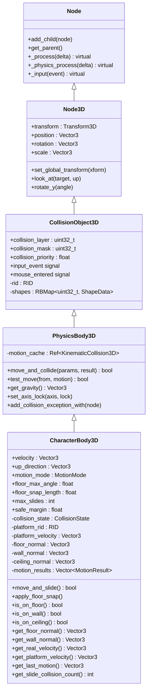

### 3.2 MotionMode 枚举与 CollisionState

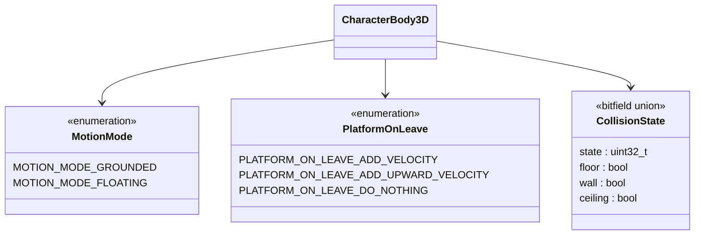

### 3.3 Camera3D 体系

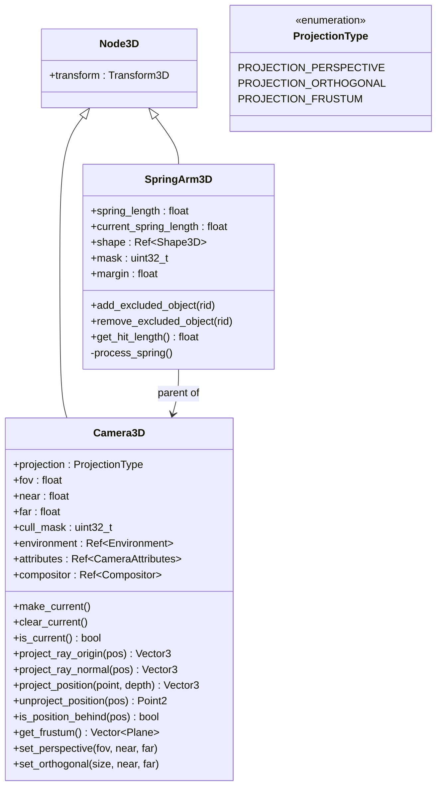

### 3.4 动画系统集成

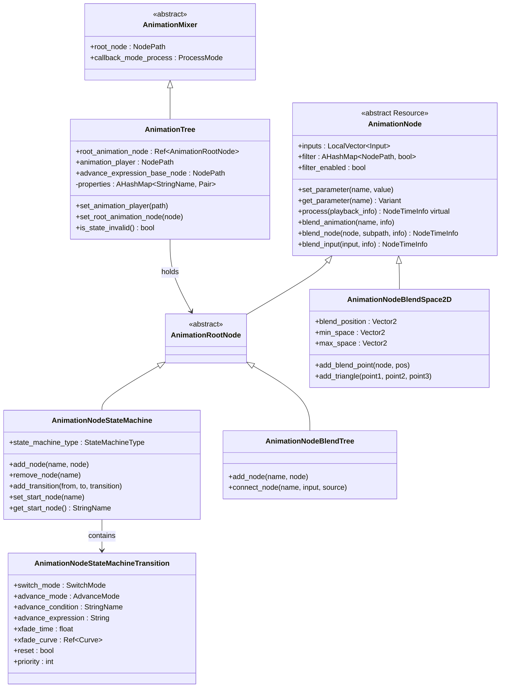

## 4. move_and_slide 详解

### 4.1 Grounded 模式流程

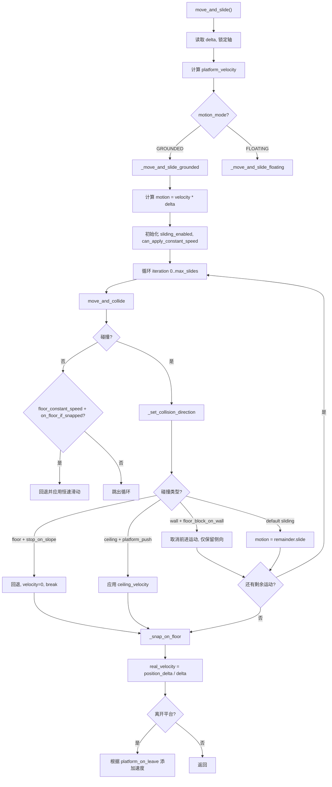

### 4.2 Floor Snap 机制

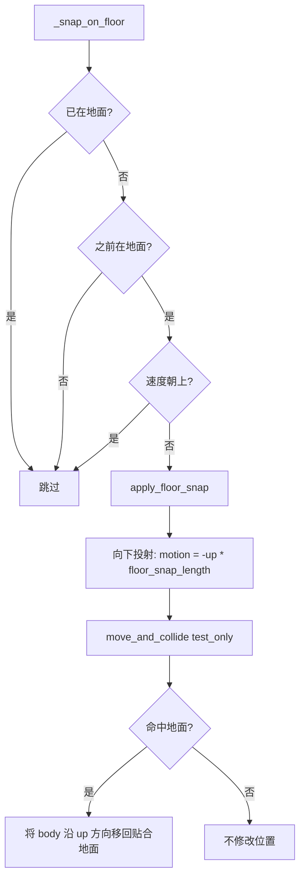

### 4.3 Floating 模式

```
_move_and_slide_floating(delta):
    简化版滑动，不区分 floor/wall/ceiling
    适用于飞行/游泳/零重力场景
    循环 max_slides 次:
        move_and_collide(motion)
        if 碰撞: motion = remainder.slide(wall_normal)
        if 无碰撞或 motion ≈ 0: break
```

## 5. 第一人称控制器

### 5.1 典型节点结构

```
CharacterBody3D (FPSController)
├── CollisionShape3D (CapsuleShape3D)
├── Node3D (Head) ← 相机挂载点
│   └── Camera3D
└── MeshInstance3D (可选: 第一人称手臂)
```

### 5.2 FPS 控制器流程

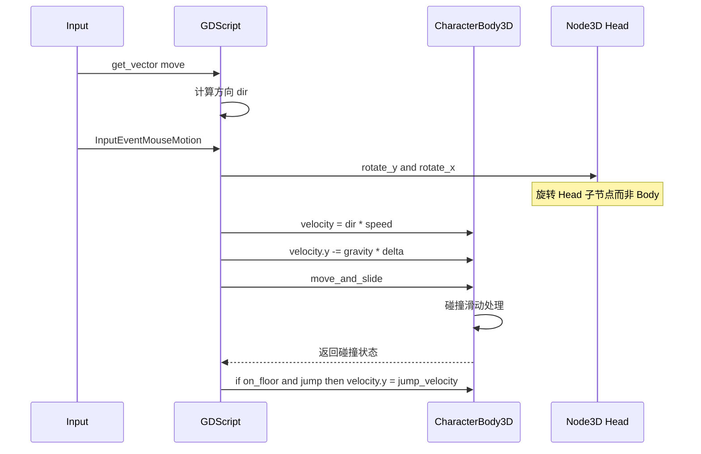

### 5.3 FPS 关键代码模式

```gdscript
extends CharacterBody3D

@export var speed := 5.0
@export var jump_velocity := 4.5
@export var mouse_sensitivity := 0.002
@export var gravity_multiplier := 1.0

@onready var head: Node3D = $Head
@onready var camera: Camera3D = $Head/Camera3D

var gravity: float = ProjectSettings.get_setting("physics/3d/default_gravity")

func _ready() -> void:
    Input.set_mouse_mode(Input.MOUSE_MODE_CAPTURED)

func _unhandled_input(event: InputEvent) -> void:
    if event is InputEventMouseMotion:
        rotate_y(-event.relative.x * mouse_sensitivity)
        head.rotate_x(-event.relative.y * mouse_sensitivity)
        head.rotation.x = clamp(head.rotation.x, deg_to_rad(-89), deg_to_rad(89))

func _physics_process(delta: float) -> void:
    var input_dir := Input.get_vector("move_left", "move_right", "move_forward", "move_back")
    var direction := (transform.basis * Vector3(input_dir.x, 0, input_dir.y)).normalized()

    if not is_on_floor():
        velocity.y -= gravity * gravity_multiplier * delta

    if is_on_floor() and Input.is_action_just_pressed("jump"):
        velocity.y = jump_velocity

    if direction:
        velocity.x = direction.x * speed
        velocity.z = direction.z * speed
    else:
        velocity.x = move_toward(velocity.x, 0, speed)
        velocity.z = move_toward(velocity.z, 0, speed)

    move_and_slide()
```

## 6. 第三人称控制器

### 6.1 典型节点结构

```
CharacterBody3D (TPSController)
├── CollisionShape3D (CapsuleShape3D)
├── Node3D (ModelPivot) ← 角色模型 + 动画
│   └── Skeleton3D + MeshInstance3D
├── SpringArm3D ← 相机弹簧臂
│   └── Camera3D
└── AnimationTree
    └── (引用) AnimationPlayer
```

### 6.2 TPS 控制器流程

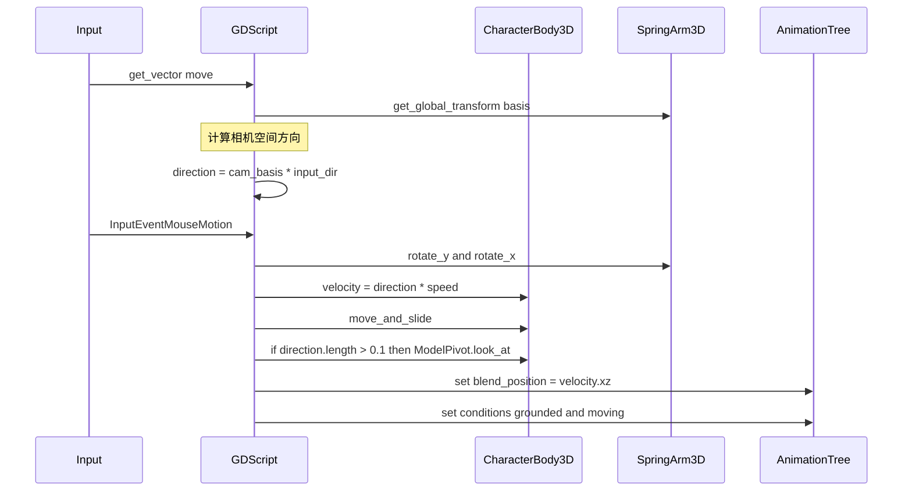

### 6.3 SpringArm3D 工作机制

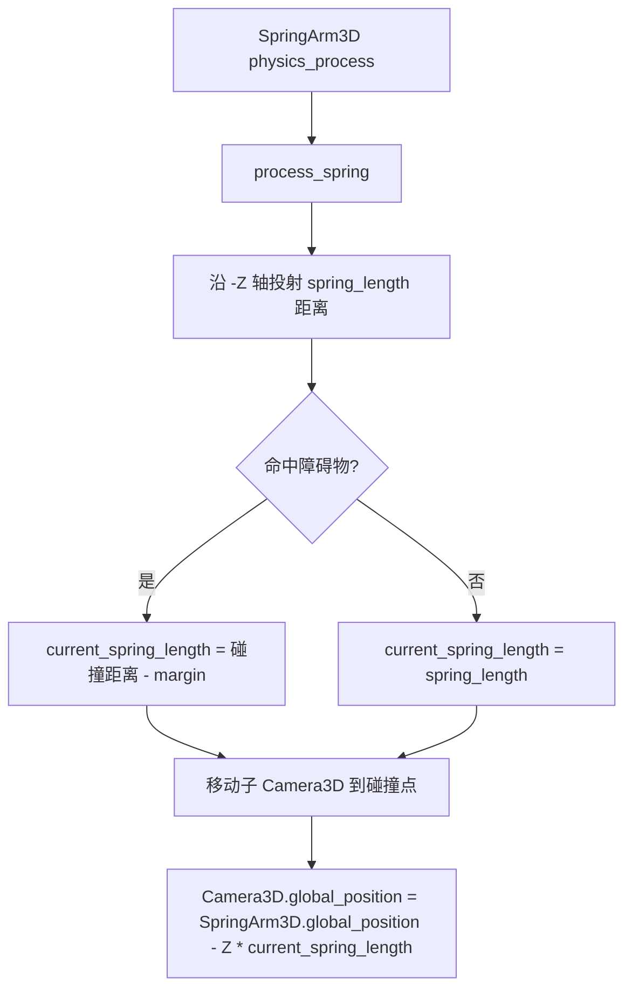

### 6.4 TPS 关键代码模式

```gdscript
extends CharacterBody3D

@export var speed := 5.0
@export var jump_velocity := 4.5
@export var mouse_sensitivity := 0.002

@onready var spring_arm: SpringArm3D = $SpringArm3D
@onready var model: Node3D = $ModelPivot
@onready var anim_tree: AnimationTree = $AnimationTree

var gravity: float = ProjectSettings.get_setting("physics/3d/default_gravity")

func _ready() -> void:
    Input.set_mouse_mode(Input.MOUSE_MODE_CAPTURED)

func _unhandled_input(event: InputEvent) -> void:
    if event is InputEventMouseMotion:
        spring_arm.rotate_y(-event.relative.x * mouse_sensitivity)
        spring_arm.rotation.x = clamp(spring_arm.rotation.x - event.relative.y * mouse_sensitivity, deg_to_rad(-60), deg_to_rad(30))

func _physics_process(delta: float) -> void:
    var input_dir := Input.get_vector("move_left", "move_right", "move_forward", "move_back")
    var cam_basis := spring_arm.global_transform.basis
    var direction := (cam_basis * Vector3(input_dir.x, 0, input_dir.y)).normalized()
    direction.y = 0
    direction = direction.normalized()

    if not is_on_floor():
        velocity.y -= gravity * delta

    if is_on_floor() and Input.is_action_just_pressed("jump"):
        velocity.y = jump_velocity

    if direction:
        velocity.x = direction.x * speed
        velocity.z = direction.z * speed
        model.look_at(global_position + direction)
    else:
        velocity.x = move_toward(velocity.x, 0, speed)
        velocity.z = move_toward(velocity.z, 0, speed)

    # 动画驱动
    var velocity_xz := Vector2(velocity.x, velocity.z).length()
    anim_tree.set("parameters/MoveBlend/blend_position", Vector2(input_dir.x, -input_dir.y))
    anim_tree.set("parameters/conditions/grounded", is_on_floor())
    anim_tree.set("parameters/conditions/moving", velocity_xz > 0.5)

    move_and_slide()
```

## 7. 动画与移动的集成

### 7.1 AnimationTree 参数驱动流程

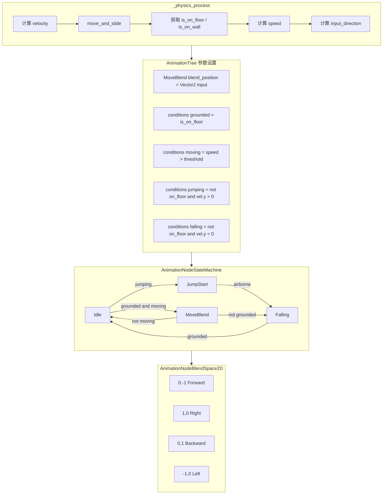

### 7.2 Root Motion 集成

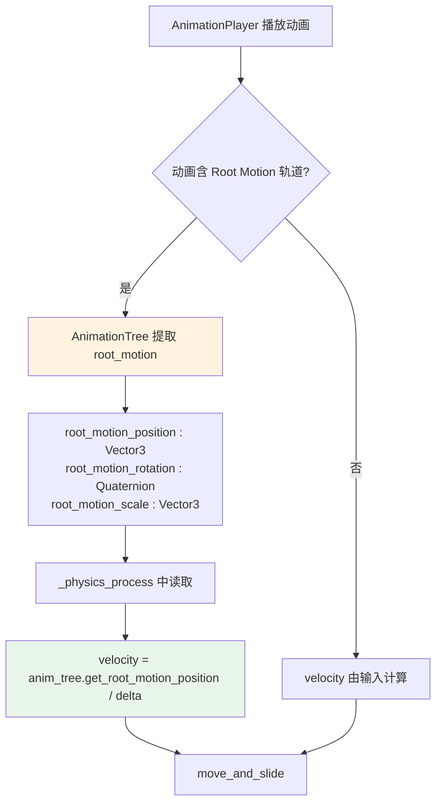

**Root Motion API**：
```gdscript
# AnimationTree 中启用 Root Motion
func _physics_process(delta):
    var root_motion_pos := anim_tree.get_root_motion_position()
    var root_motion_rot := anim_tree.get_root_motion_rotation()

    velocity = root_motion_pos / delta
    if root_motion_rot:
        global_transform.basis = global_transform.basis * Basis(root_motion_rot)

    velocity.y -= gravity * delta
    move_and_slide()
```

## 8. 与 Unreal Engine 对比

### 8.1 架构对比

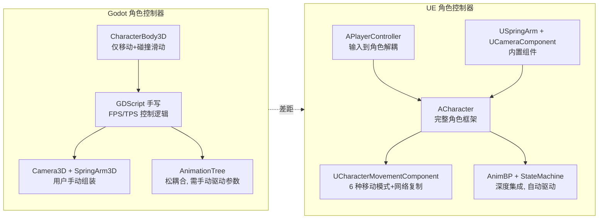

### 8.2 详细功能对比

| 功能 | Godot | UE | 差距 |
|------|-------|-----|------|
| **移动基础** | CharacterBody3D.move_and_slide | UCharacterMovementComponent | Godot 仅碰撞滑动，UE 有完整移动框架 |
| **移动模式** | 2 种 Grounded/Floating | 6 种 Walk/Fall/Fly/Swim/Custom/NavWalk | 🔴 严重缺失 |
| **地面检测** | floor_max_angle + floor_snap_length | WalkableFloorAngle + floor sweep | 🟡 功能相似 |
| **斜坡处理** | floor_stop_on_slope, floor_constant_speed | 根据角度自动调整 | 🟡 功能相似 |
| **台阶步进** | 无 | StepUp / StepDown 自动处理 | 🔴 缺失 |
| **平台跟随** | platform_velocity + platform_on_leave | BasedMovement + BasedRotation | 🟡 功能相似 |
| **墙壁滑动** | wall_min_slide_angle, floor_block_on_wall | 自动处理 | 🟡 功能相似 |
| **网络复制** | 无内置 | Server-authoritative 复制 | 🔴 严重缺失 |
| **NavMesh 集成** | 无内置移动集成 | NavWalk 模式 | 🔴 缺失 |
| **Root Motion** | AnimationTree.get_root_motion_position | RootMotionFromEverything | 🟡 功能相似 |
| **动画驱动移动** | 手动脚本驱动 | AnimBP 自动驱动 CharacterMovement | 🟡 松耦合 vs 深耦合 |
| **相机系统** | Camera3D + SpringArm3D 手动组装 | SpringArm + Camera 内置组件 | 🟡 功能相似但需更多手动工作 |
| **第一人称** | 无内置模板，需手写 | FPS Template 项目模板 | 🔴 缺失模板 |
| **第三人称** | 无内置模板，需手写 | TPS Template 项目模板 | 🔴 缺失模板 |
| **IK 集成** | 无内置 | AnimBP 内置 FootIK/HandIK | 🔴 缺失 |
| **Montage 系统** | 无 | AnimMontage 动作动画系统 | 🔴 缺失 |
| **瞄准偏移** | 手动修改 AnimationTree blend_position | AimOffset 节点 | 🟡 可模拟但无专用工具 |
| **角色物理交互** | 无内置 | PushForce/RVO Avoidance | 🔴 缺失 |
| **镜头抖动** | 无内置 | CameraShake 系统 | 🔴 缺失 |
| **死亡/重生** | 无内置 | Possess/Unpossess 机制 | 🔴 缺失 |
| **观战模式** | 无内置 | SpectatorPawn | 🔴 缺失 |

### 8.3 UE UCharacterMovementComponent 核心功能

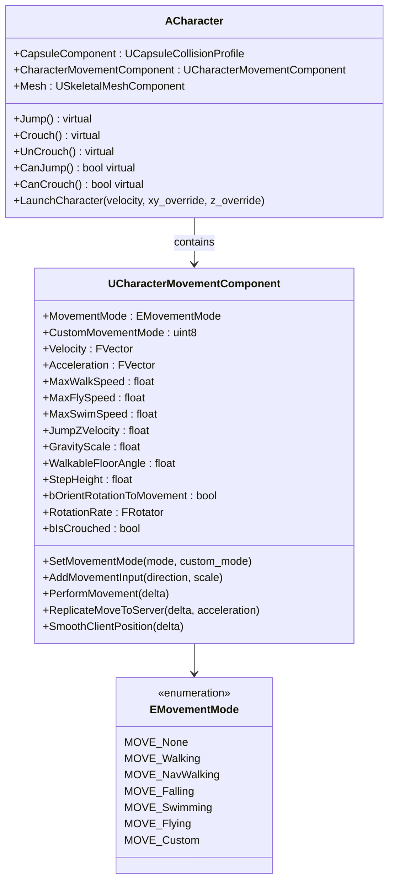

### 8.4 UE 动画-移动深度集成

```mermaid
flowchart TD
    subgraph UEIntegration["UE 动画-移动集成"]
        A["UCharacterMovementComponent.Velocity"] --> B["AnimBP Update Animation"]
        B --> C["计算 Speed, Direction, bIsInAir, bIsCrouching"]
        C --> D["驱动 StateMachine 状态转换"]
        D --> E["Idle to MoveBlendSpace to Jump to Land"]
        E --> F["BlendSpace 根据 Speed/Direction 混合动画"]
        F --> G{"Root Motion?"}
        G -->|是| H["Extract Root Motion then Apply to CharacterMovement"]
        G -->|否| I["普通动画播放"]
        H --> I

        J["AnimMontage 播放"] --> K["Ability System 触发"]
        K --> L["Montage 期间可锁定移动/旋转"]
        L --> M["Montage Root Motion to CharacterMovement"]
    end

    subgraph GodotIntegration["Godot 动画-移动集成"]
        N["GDScript _physics_process"] --> O["手动计算 velocity"]
        O --> P["move_and_slide"]
        P --> Q["手动设置 AnimationTree 参数"]
        Q --> R["AnimationTree StateMachine 转换"]
        R --> S["BlendSpace2D 混合"]
        S --> T{"Root Motion?"}
        T -->|是| U["get_root_motion_position then 手动应用"]
        T -->|否| V["普通播放"]
    end

    style UEIntegration fill:#e3f2fd
    style GodotIntegration fill:#fff3e0
```

## 9. 缺失功能详细分析

### 9.1 移动模式状态机（严重缺失）

```
Godot 仅提供 2 种 MotionMode (Grounded / Floating)
UE 提供 6 种内置移动模式 + 自定义模式

缺失的移动模式：
├── MOVE_Swimming    — 水中游泳（浮力、水阻、水面检测）
├── MOVE_Flying      — 自由飞行（需完整飞行物理）
├── MOVE_NavWalking  — NavMesh 导航行走（AI 角色）
├── MOVE_Climbing    — 攀爬（梯子、墙壁）
├── MOVE_Crouching   — 蹲伏（碰撞体高度变化）
└── MOVE_Sliding     — 滑铲（碰撞体降低 + 速度维持）

当前 Godot 需要用户在 _physics_process 中
手动切换不同移动逻辑（if/elif 链）
```

### 9.2 台阶步进（严重缺失）

```
UE 自动处理：
  StepHeight = 45.0f
  → 碰撞到低障碍物时自动"迈步"上去
  → StepDown 自动贴合地面
  → StepUp / StepDown 由 CharacterMovementComponent 内部处理

Godot 无此功能：
  → 碰撞到台阶会停住
  → 需要用户手动实现：
     1. 检测碰撞点高度 < step_height
     2. 向上移动 step_height
     3. 尝试 move_and_collide
     4. 失败则回退
  → 实现复杂且容易出 bug
```

### 9.3 网络复制（严重缺失）

```
UE 的网络移动架构：
  ACharacter
  ├── Server: PerformMovement() → 保存移动状态
  ├── Client: ReplicateMoveToServer() → 发送移动输入
  ├── Server: ServerMoveResult() → 确认/纠正
  └── Client: ClientAdjustPosition() → 平滑修正

Godot 无内置网络移动复制：
  → 需要手动实现：
     1. RPC 发送位置/速度
     2. 客户端预测
     3. 服务器纠正
     4. 插值平滑
  → multiplayer_synchronizer 仅做简单同步
  → 无预测-回滚框架
```

### 9.4 动画 Montage 系统（严重缺失）

```
UE AnimMontage：
  ├── 分段播放（Section）
  ├── 根运动提取
  ├── 通知（AnimNotify）触发游戏逻辑
  ├── 混合出入控制
  ├── 蒙太奇期间锁定移动
  └── 多层 Montage 混合

Godot 无 Montage：
  → AnimationPlayer.play() + queue() 是最接近的功能
  → 无法在动画中间触发逻辑（需 AnimationPlayer.call_method_track）
  → 无法在动画期间锁定移动（需手动 flag）
  → 无分段播放（需多个 Animation + StateMachine 模拟）
```

### 9.5 IK 系统（严重缺失）

```
UE 内置 IK：
  ├── TwoBoneIK（手脚骨骼对齐地面/目标）
  ├── FABRIK（全身 IK 链）
  ├── CCD IK（头部注视等）
  └── FootPlacement（自动脚部贴合地形）

Godot 无内置 IK：
  → Skeleton3D 有 bone.pose 而无 IK solver
  → 需 GDExtension 自实现或用 look_at + 数学计算
  → 社区有 IK 插件但不成熟
```

### 9.6 相机系统增强（中等缺失）

```
缺失功能：
├── CameraShake — 镜头抖动（爆炸、受伤、冲刺）
├── CameraLensEffect — 镜头效果（景深、运动模糊）
├── CameraImpulse — 冲量响应（后坐力、击中反馈）
├── CameraModeTransition — 第一/第三人称切换过渡
├── ViewmodelCamera — 第一人称武器/手臂渲染分层
└── CameraCollisionPadding — 相机碰撞时更智能的偏移
```

### 9.7 缺失功能严重度总览

| 功能 | 严重度 | 实现难度 | 影响范围 |
|------|--------|---------|---------|
| **移动模式状态机** | 🔴 严重 | 高 | 所有类型角色 |
| **台阶步进** | 🔴 严重 | 中 | 地面角色移动体验 |
| **网络复制** | 🔴 严重 | 极高 | 多人游戏 |
| **Montage 系统** | 🔴 严重 | 高 | 动作游戏 |
| **IK 系统** | 🔴 严重 | 高 | 角色动画质量 |
| **内置控制器模板** | 🟡 中等 | 低 | 新手入门 |
| **相机增强** | 🟡 中等 | 中 | 视觉体验 |
| **角色物理交互** | 🟡 中等 | 中 | 物理丰富度 |
| **镜头抖动** | 🟢 轻微 | 低 | 视觉反馈 |
| **观战模式** | 🟢 轻微 | 低 | 多人游戏 |

## 10. Godot 角色控制器成熟度评级

```
Godot 角色控制器成熟度：★★☆☆☆ (2/5)

对比：
- UE ACharacter + CMC： ★★★★★ (5/5)
- Unity CharacterController：★★★☆☆ (3/5)
- Unity Kinematic Character Controller (资产)：★★★★☆ (4/5)
- Godot CharacterBody3D：  ★★☆☆☆ (2/5)
```

### 10.1 Godot 的强项

1. **move_and_slide() 简洁有效**：Grounded/Floating 两种模式覆盖基本需求
2. **碰撞滑动算法成熟**：max_slides、slope 处理、wall slide 均经过社区打磨
3. **SpringArm3D 轻量**：弹簧臂相机方案简单直接
4. **AnimationTree 灵活**：状态机 + BlendSpace + Root Motion 支持良好
5. **GDScript 快速原型**：100 行即可实现基础 FPS/TPS 控制器
6. **平台跟随**：platform_velocity 和 platform_on_leave 功能完整

### 10.2 Godot 的弱点

1. **无移动模式状态机**：Walking/Falling/Swimming/Flying/Climbing 需手动 if/elif
2. **无台阶步进**：碰到低矮台阶会卡住
3. **无网络复制**：多人游戏移动同步需完全自建
4. **无 Montage**：动作动画播放缺乏专业工具
5. **无 IK 系统**：脚部贴合地形等高级动画无法实现
6. **无内置模板**：新手需从零手写 FPS/TPS 控制器
7. **松耦合**：移动-动画-相机需大量胶水代码串联

## 11. 关键源码索引

| 类别 | 路径 |
|------|------|
| CharacterBody3D | `scene/3d/physics/character_body_3d.h` / `character_body_3d.cpp` |
| PhysicsBody3D | `scene/3d/physics/physics_body_3d.h` |
| CollisionObject3D | `scene/3d/physics/collision_object_3d.h` |
| KinematicCollision3D | `scene/3d/physics/kinematic_collision_3d.h` |
| Camera3D | `scene/3d/camera_3d.h` / `camera_3d.cpp` |
| SpringArm3D | `scene/3d/physics/spring_arm_3d.h` / `spring_arm_3d.cpp` |
| RayCast3D | `scene/3d/physics/ray_cast_3d.h` |
| ShapeCast3D | `scene/3d/physics/shape_cast_3d.h` |
| AnimationTree | `scene/animation/animation_tree.h` / `animation_tree.cpp` |
| AnimationPlayer | `scene/animation/animation_player.h` |
| AnimationNodeStateMachine | `scene/animation/animation_node_state_machine.h` |
| AnimationNodeBlendSpace2D | `scene/animation/animation_blend_space_2d.h` |
| AnimationNodeBlendSpace1D | `scene/animation/animation_blend_space_1d.h` |
| AnimationNodeBlendTree | `scene/animation/animation_blend_tree.h` |
| Node3D | `scene/3d/node_3d.h` |
| PhysicsServer3D | `servers/physics_3d/physics_server_3d.h` |
