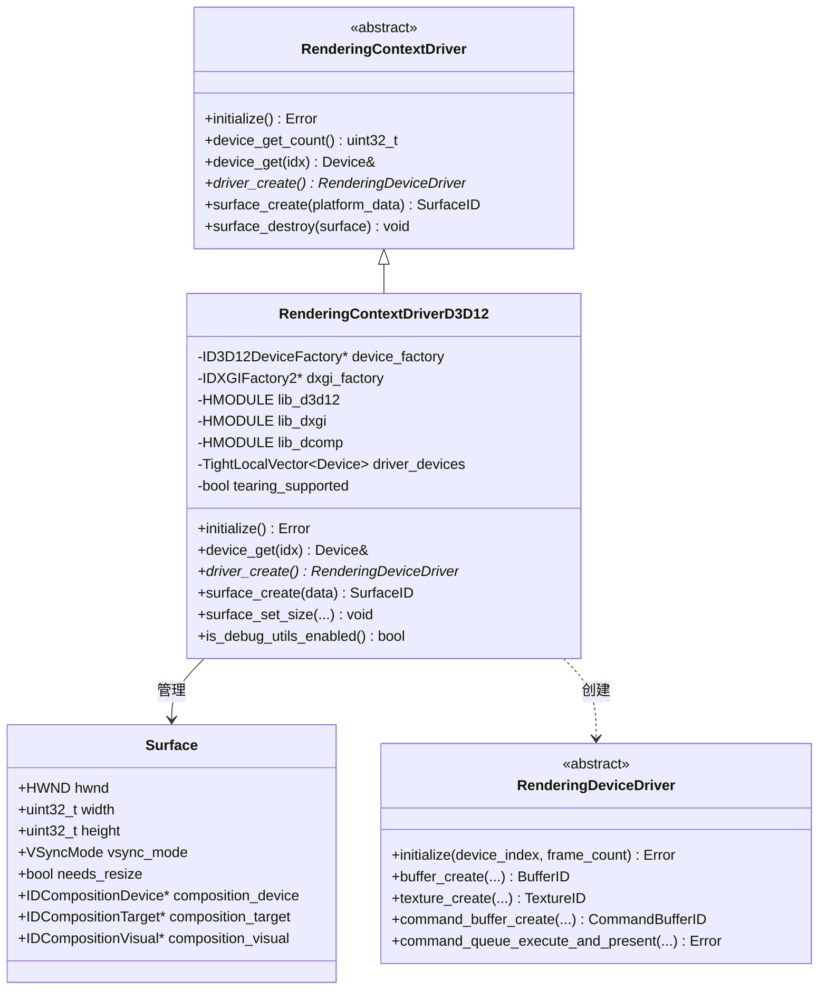
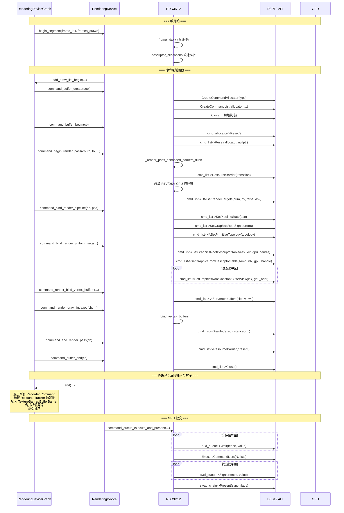
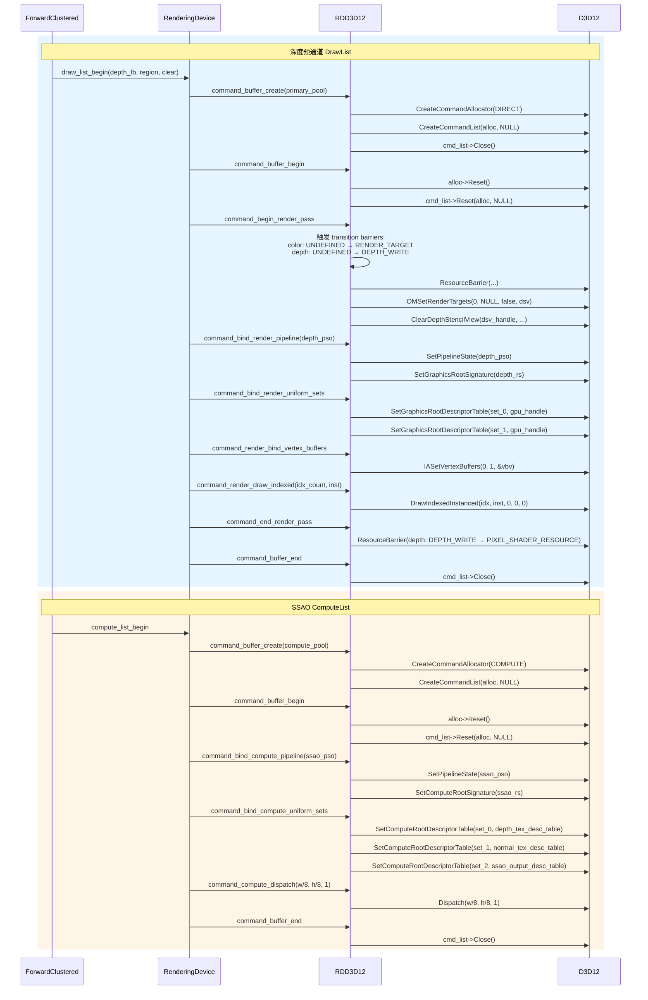
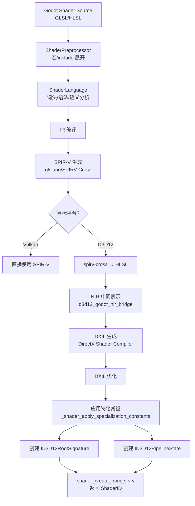

# Godot Engine D3D12 渲染驱动封装深度分析

## 1. 概述

Godot 引擎通过 **抽象渲染设备驱动（RenderingDeviceDriver, RDD）** 层将底层图形 API 隔离开来，D3D12 驱动（`drivers/d3d12/`）是该抽象层的一个具体实现。它位于 Godot 渲染栈的最底层，负责将 RDD 的统一接口翻译为 Microsoft Direct3D 12 API 调用。

```
┌──────────────────────────────────────────────────────────────┐
│  场景层 (Node3D, MeshInstance3D, Light3D, ...)                │
├──────────────────────────────────────────────────────────────┤
│  RenderingServer 统一 API                                    │
├──────────────────────────────────────────────────────────────┤
│  RenderingServerDefault 调度层                              │
├──────────────────────────────────────────────────────────────┤
│  RenderingDevice (RD) 高层封装                              │
├──────────────────────────────────────────────────────────────┤
│  RenderingDeviceGraph (RDG) 命令图                          │
├──────────────────────────────────────────────────────────────┤
│  RenderingDeviceDriver (RDD) 抽象接口  ← 【D3D12 驱动层】    │
├──────────────────────────────────────────────────────────────┤
│  RenderingContextDriver   ← 【D3D12 上下文驱动】             │
├──────────────────────────────────────────────────────────────┤
│  Direct3D 12  /  DXGI  /  D3D12MA                           │
└──────────────────────────────────────────────────────────────┘
```

## 2. 文件结构

```
drivers/d3d12/
├── rendering_device_driver_d3d12.h       # D3D12 设备驱动（资源 + 命令）
├── rendering_device_driver_d3d12.cpp     # D3D12 设备驱动实现
├── rendering_context_driver_d3d12.h      # D3D12 上下文驱动（设备/交换链）
├── rendering_context_driver_d3d12.cpp
├── rendering_shader_container_d3d12.h    # DXIL 着色器容器
├── rendering_shader_container_d3d12.cpp
├── d3d12_hooks.h / .cpp                  # D3D12 调试钩子
├── d3d12_godot_nir_bridge.h              # SPIR-V → NIR → DXIL 桥接
└── dxil_hash.h / .cpp                    # DXIL 字节码哈希
```

## 3. RDD 抽象接口与 D3D12 实现概览

### 3.1 抽象接口（`rendering_device_driver.h`）

`RenderingDeviceDriver` 是所有图形 API 后端必须实现的接口。核心 ID 类型通过 `DEFINE_ID` 宏定义：

```cpp
DEFINE_ID(Buffer);
DEFINE_ID(Texture);
DEFINE_ID(Sampler);
DEFINE_ID(VertexFormat);
DEFINE_ID(CommandQueue);
DEFINE_ID(CommandQueueFamily);
DEFINE_ID(CommandPool);
DEFINE_ID(CommandBuffer);
DEFINE_ID(SwapChain);
DEFINE_ID(Framebuffer);
DEFINE_ID(Shader);
DEFINE_ID(UniformSet);
DEFINE_ID(Pipeline);
DEFINE_ID(RenderPass);
DEFINE_ID(QueryPool);
DEFINE_ID(Fence);
DEFINE_ID(Semaphore);
```

这些 ID 在 D3D12 实现中是对**资源结构体指针的包装**（通过 `uint64_t` 强转），实现 O(1) 资源查找。

### 3.2 关键抽象方法分类

| 类别 | 关键方法 |
|------|----------|
| 资源创建 | `buffer_create`, `texture_create`, `framebuffer_create`, `shader_create_from_spirv` / `from_container`, `uniform_set_create`, `render_pipeline_create`, `compute_pipeline_create` |
| 资源释放 | `buffer_free`, `texture_free`, `framebuffer_free`, `shader_free`, `pipeline_free`, `uniform_set_free` |
| 命令录制 | `command_buffer_begin`, `command_buffer_end`, `command_begin_render_pass`, `command_end_render_pass`, `command_bind_render_pipeline`, `command_bind_render_uniform_sets`, `command_render_draw`, `command_render_draw_indexed`, `command_bind_compute_pipeline`, `command_compute_dispatch` |
| 传输/屏障 | `command_clear_buffer`, `command_copy_buffer`, `command_copy_texture`, `command_resolve_texture`, `barrier` |
| 同步 | `command_queue_execute_and_present`, `fence_*(...)`, `semaphore_*(...)` |

## 4. 整体类图

### 4.1 Context 层类图



### 4.2 Driver 层核心类图

```mermaid
classDiagram
    class RenderingDeviceDriver {
        <<abstract>>
        +initialize(device_index, frame_count) Error
        +buffer_create(...) BufferID
        +texture_create(...) TextureID
        +command_buffer_create(...) CommandBufferID
        +command_queue_execute_and_present(...) Error
    }

    class RenderingDeviceDriverD3D12 {
        -RenderingContextDriverD3D12* context_driver
        -ComPtr~IDXGIAdapter~ adapter
        -ComPtr~ID3D12Device~ device
        -ComPtr~D3D12MA::Allocator~ allocator
        -DeviceLimits device_limits
        -Capabilities device_capabilities
        -D3D12MA::Allocation 内存分配
        -DescriptorHeap resource_descriptor_heap
        -DescriptorHeap sampler_descriptor_heap
        -CPUDescriptorHeapPool rtv_descriptor_heap_pool
        -CPUDescriptorHeapPool dsv_descriptor_heap_pool
        -PagedAllocator~VersatileResource~ resources_allocator
        -TightLocalVector~FrameInfo~ frames
        +initialize(...) Error
        +buffer_create(...) BufferID
        +texture_create(...) TextureID
        +command_buffer_create(...) CommandBufferID
        +command_queue_execute_and_present(...) Error
    }

    class ResourceInfo {
        +ID3D12Resource* resource
        +ComPtr~ID3D12Resource~ owned_resource
        +ComPtr~D3D12MA::Allocation~ allocation
        +States* states_ptr
        +class States
    }

    class BufferInfo {
        +D3D12_GPU_VIRTUAL_ADDRESS gpu_virtual_address
        +DataFormat texel_format
        +uint64_t size
        +flags.is_dynamic
    }

    class TextureInfo {
        +DataFormat format
        +CD3DX12_RESOURCE_DESC desc
        +uint32_t base_layer/layers/base_mip/mipmaps
        +D3D12_SHADER_RESOURCE_VIEW_DESC srv
        +D3D12_UNORDERED_ACCESS_VIEW_DESC uav
        +TextureInfo* main_texture
    }

    class CommandBufferInfo {
        +ComPtr~ID3D12CommandAllocator~ cmd_allocator
        +ComPtr~ID3D12GraphicsCommandList~ cmd_list
        +ID3D12PipelineState* graphics_pso
        +ID3D12PipelineState* compute_pso
        +uint32_t graphics_root_signature_crc
        +uint32_t compute_root_signature_crc
        +RenderPassState render_pass_state
        +bool descriptor_heaps_set
        +HashMap barriers
        +LocalVector~D3D12_RESOURCE_BARRIER~ res_barriers
        +Allocation uav_alloc/rtv_alloc/dsv_alloc
    }

    class CommandPoolInfo {
        +CommandQueueFamilyID queue_family
        +CommandBufferType buffer_type
        +SelfList~CommandBufferInfo~::List command_buffers
    }

    class FramebufferInfo {
        +bool is_screen
        +Size2i size
        +TightLocalVector~uint32_t~ attachments_handle_inds
        +Allocation rtv_alloc/dsv_alloc
        +TightLocalVector~TextureID~ attachments
    }

    class ShaderInfo {
        +uint32_t dxil_push_constant_size
        +bool is_compute
        +UniformSet[] sets
        +HashMap~Stage,Vector~uint8_t~~ stages_bytecode
        +ComPtr~ID3D12RootSignature~ root_signature
        +uint32_t root_signature_crc
    }

    class UniformSetInfo {
        +DescriptorHeap::Allocation resource_descriptor_heap_alloc
        +SamplerDescriptorHeapAllocation* sampler_descriptor_heap_alloc
        +TightLocalVector~DynamicBuffer~ dynamic_buffers
        +TightLocalVector~StateRequirement~ resource_states
    }

    class PipelineInfo {
        +ComPtr~ID3D12PipelineState~ pso
        +const ShaderInfo* shader_info
        +RenderPipelineInfo render_info
    }

    class RenderPassInfo {
        +TightLocalVector~Attachment~ attachments
        +TightLocalVector~Subpass~ subpasses
        +uint32_t view_count
        +uint32_t max_supported_sample_count
    }

    class SwapChain {
        +ComPtr~IDXGISwapChain3~ d3d_swap_chain
        +SurfaceID surface
        +UINT present_flags
        +RenderPassID render_pass
        +TightLocalVector~ID3D12Resource*~ render_targets
        +TightLocalVector~TextureInfo~ render_targets_info
        +TightLocalVector~FramebufferID~ framebuffers
    }

    RenderingDeviceDriver <|-- RenderingDeviceDriverD3D12
    RenderingDeviceDriverD3D12 --> ResourceInfo
    ResourceInfo <|-- BufferInfo
    ResourceInfo <|-- TextureInfo
    RenderingDeviceDriverD3D12 --> CommandBufferInfo
    RenderingDeviceDriverD3D12 --> CommandPoolInfo
    RenderingDeviceDriverD3D12 --> FramebufferInfo
    RenderingDeviceDriverD3D12 --> ShaderInfo
    RenderingDeviceDriverD3D12 --> UniformSetInfo
    RenderingDeviceDriverD3D12 --> PipelineInfo
    RenderingDeviceDriverD3D12 --> RenderPassInfo
    RenderingDeviceDriverD3D12 --> SwapChain
```



### 4.3 描述符堆管理类图

```mermaid
classDiagram
    class DescriptorHeap {
        +ComPtr~ID3D12DescriptorHeap~ heap
        +D3D12_CPU_DESCRIPTOR_HANDLE cpu_handle
        +D3D12_GPU_DESCRIPTOR_HANDLE gpu_handle
        +uint32_t increment_size
        +ComPtr~D3D12MA::VirtualBlock~ virtual_block
        +initialize(device, type, count, shader_visible) Error
        +allocate(count) Allocation
        +free(allocation) void
    }

    class DescriptorHeapAllocation {
        +uint64_t virtual_alloc_handle
        +D3D12_CPU_DESCRIPTOR_HANDLE cpu_handle
        +D3D12_GPU_DESCRIPTOR_HANDLE gpu_handle
    }

    class CPUDescriptorHeapPool {
        +BinaryMutex mutex
        +LocalVector~DescriptorHeap~ heaps
        +D3D12_DESCRIPTOR_HEAP_TYPE type
        +uint32_t increment_size
        +initialize(device, type) void
        +allocate(count, device) Allocation
        +free(allocation) void
    }

    class CPUDescriptorHeapPoolAllocation {
        +uint32_t heap_index
        +uint64_t virtual_alloc_handle
        +D3D12_CPU_DESCRIPTOR_HANDLE cpu_handle
    }

    DescriptorHeap +-- DescriptorHeapAllocation
    CPUDescriptorHeapPool +-- CPUDescriptorHeapPoolAllocation
    CPUDescriptorHeapPool --> DescriptorHeap : 包含多个

    class ResourceClass {
        <<enumeration>>
        RES_CLASS_INVALID
        RES_CLASS_CBV
        RES_CLASS_SRV
        RES_CLASS_UAV
        RES_CLASS_SAMPLER
    }

    class BoundUniform {
        +uint32_t binding
        +Vector~ID~ ids
        +UniformType type
    }

    class UniformBindingInfo {
        +uint32_t stages
        +ResourceClass res_class
        +UniformType type
        +uint32_t length
        +bool writable
        +uint32_t resource_descriptor_offset
        +uint32_t sampler_descriptor_offset
        +uint32_t root_param_idx
    }
```

## 5. 关键资源封装详解

### 5.1 Buffer 封装

```cpp
struct BufferInfo : public ResourceInfo {
    D3D12_GPU_VIRTUAL_ADDRESS gpu_virtual_address;  // GPU 虚拟地址
    DataFormat texel_format;
    uint64_t size;
    struct { bool is_dynamic : 1; } flags;
};
```

**`ResourceInfo` 基类**：

```cpp
struct ResourceInfo {
    ID3D12Resource *resource = nullptr;             // 共享资源指针
    struct {
        ComPtr<ID3D12Resource> resource;             // 拥有资源
        ComPtr<D3D12MA::Allocation> allocation;     // D3D12MA 分配
        States states;                              // 子资源状态跟踪
    } owner_info;
    States *states_ptr;                             // 状态指针（own/borrowed）
};
```

**D3D12 Buffer 创建流程**：

```
buffer_create(size, usage, alloc_type, frames)
    │
    ├── 1. 转换 BufferUsageBits → D3D12_RESOURCE_FLAGS
    │     STORAGE_BIT     → D3D12_RESOURCE_FLAG_ALLOW_UNORDERED_ACCESS
    │     其他             → D3D12_RESOURCE_FLAG_NONE
    │
    ├── 2. 选择堆属性
    │     alloc_type=CPU  → {TYPE_UPLOAD, CPU_PAGE_PROPERTY_WRITE_COMBINE, MEMORY_POOL_L0}
    │     alloc_type=GPU  → {TYPE_DEFAULT, CPU_PAGE_PROPERTY_UNKNOWN, MEMORY_POOL_UNKNOWN}
    │
    ├── 3. 设置初始资源状态
    │     UPLOAD          → D3D12_RESOURCE_STATE_GENERIC_READ
    │     其他            → D3D12_RESOURCE_STATE_COMMON
    │
    ├── 4. 通过 D3D12MA 分配
    │     allocator->CreateResource(heap_props, desc, state, ...)
    │
    ├── 5. 获取 GPU 虚拟地址
    │     resource->GetGPUVirtualAddress()
    │
    └── 6. 返回 BufferID(BufferInfo*)
```

### 5.2 Texture 封装

```cpp
struct TextureInfo : public ResourceInfo {
    DataFormat format;
    CD3DX12_RESOURCE_DESC desc;                                // 完整资源描述
    uint32_t base_layer, layers, base_mip, mipmaps;
    struct {
        D3D12_SHADER_RESOURCE_VIEW_DESC srv;                    // 着色器资源视图
        D3D12_UNORDERED_ACCESS_VIEW_DESC uav;                   // UAV 描述
    } view_descs;
    TextureInfo *main_texture;                                 // 共享纹理的原始纹理
};
```

**纹理创建核心逻辑**：

```
texture_create(format, view)
    │
    ├── 1. DataFormat → DXGI_FORMAT 转换
    │     使用 RD_TO_D3D12_FORMAT[] 静态表（含 family/general/dsv 三种格式）
    │
    ├── 2. 构造 D3D12_RESOURCE_DESC
    │     D3D12_RESOURCE_DIMENSION_TEXTURE2D
    │     D3D12_RESOURCE_DESC1 { Dimension, Alignment, Width, Height, ...
    │                              DepthOrArraySize, MipLevels, Format,
    │                              SampleDesc, Layout, Flags }
    │
    ├── 3. 通过 D3D12MA 创建 ID3D12Resource
    │
    ├── 4. 缓存 SRV/UAV 视图描述（懒创建）
    │     texture_create_view 触发时：
    │       srv = { Format, ViewDimension, Shader4ComponentMapping }
    │
    └── 5. 处理格式重解释（reinterpretation）
        同一内存可被多种 DXGI_FORMAT 视图化
```

### 5.3 Shader 与 Root Signature 封装

```cpp
struct ShaderInfo {
    uint32_t dxil_push_constant_size;
    bool is_compute;
    
    struct UniformBindingInfo {
        uint32_t stages;                    // 哪些着色阶段使用
        ResourceClass res_class;            // CBV/SRV/UAV/SAMPLER
        UniformType type;
        uint32_t length;                    // 数组长度
        bool writable;
        uint32_t resource_descriptor_offset;// 资源描述符偏移
        uint32_t sampler_descriptor_offset; // 采样器描述符偏移
        uint32_t root_param_idx;            // 根参数索引
    };
    
    struct UniformSet {
        TightLocalVector<UniformBindingInfo> bindings;
        uint32_t resource_root_param_idx;   // 资源描述符表根参数索引
        uint32_t resource_descriptor_count;
        uint32_t sampler_root_param_idx;    // 采样器描述符表根参数索引
        uint32_t sampler_descriptor_count;
    };
    
    TightLocalVector<UniformSet> sets;
    HashMap<ShaderStage, Vector<uint8_t>> stages_bytecode;  // DXIL 字节码
    
    ComPtr<ID3D12RootSignature> root_signature;
    uint32_t root_signature_crc;
};
```

**着色器转换管线**：

```
GLSL/HLSL 源码
    ↓ ShaderPreprocessor (macro/include 展开)
预处理后代码
    ↓ ShaderLanguage (词法/语法/语义分析)
GLSL IR
    ↓ SPIR-V Compiler (glslang/跨编译器)
SPIR-V 字节码
    ↓ SPIRV-Cross
HLSL/DXIL 字节码
    ↓ DXIL 优化 + 特化常量应用
最终 DXIL
    ↓ D3D12 验证
ID3D12PipelineState
```

### 5.4 Pipeline 封装

```cpp
struct PipelineInfo {
    ComPtr<ID3D12PipelineState> pso;       // D3D12 管线状态对象
    const ShaderInfo *shader_info;         // 关联着色器（用于根签名）
    RenderPipelineInfo render_info;        // 动态状态参数
};

struct RenderPipelineInfo {
    const VertexFormatInfo *vf_info;
    struct {
        D3D12_PRIMITIVE_TOPOLOGY primitive_topology;
        Color blend_constant;
        float depth_bounds_min, depth_bounds_max;
        uint32_t stencil_reference;
    } dyn_params;
};
```

**PSO 创建**：

```
render_pipeline_create(shader, vf, primitive, raster, ms, ds, blend, ...)
    │
    ├── 1. 构造 D3D12_GRAPHICS_PIPELINE_STATE_DESC
    │     ├── pRootSignature = shader->root_signature
    │     ├── VS/PS/DS/HS/GS/AS/MS = 各阶段 DXIL
    │     ├── BlendState = blend_desc
    │     ├── SampleMask = max
    │     ├── RasterizerState = raster_desc
    │     ├── DepthStencilState = ds_desc
    │     ├── InputLayout = vertex_format_desc
    │     ├── PrimitiveTopologyType = primitive
    │     ├── NumRenderTargets = color_attachments
    │     ├── RTVFormats[] = 颜色附件格式
    │     ├── DSVFormat = 深度格式
    │     └── SampleDesc = { count, quality }
    │
    ├── 2. 应用特化常量（修改 DXIL 字节码）
    │     _shader_apply_specialization_constants(...)
    │
    ├── 3. 创建 PSO
    │     device->CreateGraphicsPipelineState(&desc, IID_PPV_ARGS(pso))
    │
    └── 4. 缓存到 pipeline_cache（可选）
```

### 5.5 UniformSet 封装

```cpp
struct UniformSetInfo {
    DescriptorHeap::Allocation resource_descriptor_heap_alloc;
    SamplerDescriptorHeapAllocation *sampler_descriptor_heap_alloc;
    
    struct DynamicBuffer {
        BufferDynamicInfo const *info;
        uint32_t binding;
    };
    TightLocalVector<DynamicBuffer> dynamic_buffers;
    
    struct StateRequirement {
        ResourceInfo *resource;
        bool is_buffer;
        D3D12_RESOURCE_STATES states;     // 期望的资源状态
        uint64_t shader_uniform_idx_mask;
    };
    TightLocalVector<StateRequirement> resource_states;
};
```

**UniformSet 创建 → D3D12 描述符表**：

```
uniform_set_create(uniforms, shader, set_idx, linear_pool)
    │
    ├── 1. 获取 ShaderInfo::UniformSet 信息
    │     包含每个 binding 的 res_class / root_param_idx
    │
    ├── 2. 为 Resource 类绑定（CBV/SRV/UAV）创建描述符
    │     if (linear_pool) 使用 resource_descriptor_heap
    │     else 使用 resource_descriptor_heap_pool
    │
    │     for each binding in set:
    │         创建 CBV → ID3D12Device::CreateConstantBufferView
    │         创建 SRV → ID3D12Device::CreateShaderResourceView
    │         创建 UAV → ID3D12Device::CreateUnorderedAccessView
    │
    ├── 3. 为 Sampler 绑定创建采样器描述符
    │     from sampler_descriptor_heap
    │     CreateSampler(sampler_desc, dest)
    │
    ├── 4. 记录动态缓冲区引用（per-frame 偏移）
    │     uniform_set_info->dynamic_buffers
    │
    └── 5. 计算所需资源状态（用于屏障插入）
        resource_states[]
```

## 6. 命令录制与执行时序

### 6.1 完整帧渲染时序图



### 6.2 命令录制细节时序



## 7. RenderPass 与 Framebuffer 转换

### 7.1 RDD 抽象 vs D3D12 实际

**关键洞察**：D3D12 与 Vulkan 在 RenderPass 模型上有显著差异。

| Vulkan | D3D12 |
|--------|-------|
| `vkBeginRenderPass(...)` 显式开始 RenderPass | `OMSetRenderTargets(...)` 隐式绑定渲染目标 |
| `vkEndRenderPass()` 显式结束 | 没有独立 API，通过 PSO 切换结束 |
| RenderPass 定义子通道、附件依赖 | 通过 PSO 描述符与 RTV 切换实现 |
| 必须保持 RenderPass 内状态稳定 | D3D12 更灵活，但要求显式管理 |

### 7.2 D3D12 `command_begin_render_pass` 实现

```cpp
void RenderingDeviceDriverD3D12::command_begin_render_pass(
        CommandBufferID p_cmd_buffer,
        RenderPassID p_render_pass,
        FramebufferID p_framebuffer,
        CommandBufferType p_cmd_buffer_type,
        const Rect2i &p_rect,
        VectorView<RenderPassClearValue> p_clear_values) {
    
    CommandBufferInfo *cmd_buf_info = (CommandBufferInfo *)p_cmd_buffer.id;
    const FramebufferInfo *fb_info = (const FramebufferInfo *)p_framebuffer.id;
    const RenderPassInfo *pass_info = (const RenderPassInfo *)p_render_pass.id;
    
    // 1. 增强屏障刷新（如果支持 Enhanced Barriers）
    if (barrier_capabilities.enhanced_barriers_supported) {
        _render_pass_enhanced_barriers_flush(p_cmd_buffer);
    }
    
    // 2. 插入纹理 Layout 转换屏障（Enhanced Barriers 模式）
    //    例如：UNDEFINED → RENDER_TARGET
    //    常规模式：状态转换通过 ResourceInfo::States 跟踪
    
    // 3. 获取颜色附件的 RTV 句柄
    LocalVector<D3D12_CPU_DESCRIPTOR_HANDLE> rtv_handles;
    for (uint32_t i = 0; i < pass_info->attachments.size(); i++) {
        if (subpass.color_references.contains(i)) {
            TextureID tex_id = fb_info->attachments[i];
            TextureInfo *tex_info = (TextureInfo *)tex_id.id;
            uint32_t rtv_idx = fb_info->attachments_handle_inds[i];
            D3D12_CPU_DESCRIPTOR_HANDLE rtv = rtv_descriptor_heap_pool.heaps[rtv_idx].cpu_handle;
            rtv_handles.push_back(rtv);
        }
    }
    
    // 4. 获取深度附件的 DSV 句柄
    D3D12_CPU_DESCRIPTOR_HANDLE dsv_handle;
    if (subpass.depth_attachment != UNUSED_ATTACHMENT) {
        dsv_handle = dsv_descriptor_heap_pool.heaps[...].cpu_handle;
    }
    
    // 5. 调用 D3D12 API 绑定渲染目标
    cmd_buf_info->cmd_list->OMSetRenderTargets(
        rtv_handles.size(), rtv_handles.ptr(), false,
        dsv_handle.ptr ? &dsv_handle : nullptr);
    
    // 6. 设置视口与裁剪
    cmd_buf_info->cmd_list->RSSetViewports(1, &viewport);
    cmd_buf_info->cmd_list->RSSetScissorRects(1, &scissor);
    
    // 7. 清除附件（如果需要）
    for (uint32_t i = 0; i < p_clear_values.size(); i++) {
        if (clear_op == ATTACHMENT_OPERATION_CLEAR) {
            if (is_depth) ClearDepthStencilView(...)
            else ClearRenderTargetView(...)
        }
    }
    
    // 8. 记录 RenderPass 状态供后续 PSO 验证
    cmd_buf_info->render_pass_state.current_subpass = 0;
    cmd_buf_info->render_pass_state.fb_info = fb_info;
    cmd_buf_info->render_pass_state.pass_info = pass_info;
}
```

## 8. 资源屏障处理

### 8.1 屏障批处理机制

```cpp
struct BarrierRequest {
    static const uint32_t MAX_GROUPS = 4;
    static const uint32_t MAX_SUBRESOURCES = 4096;
    ID3D12Resource *dx_resource = nullptr;
    uint8_t subres_mask_qwords = 0;
    uint8_t planes = 0;
    struct Group {
        D3D12_RESOURCE_STATES states = {};
        uint64_t subres_mask[MAX_SUBRESOURCES / 64] = {};  // 位图
    } groups[MAX_GROUPS];
    uint8_t groups_count = 0;
};

struct CommandBufferInfo {
    // ...
    HashMap<ResourceInfo::States *, BarrierRequest> res_barriers_requests;
    LocalVector<D3D12_RESOURCE_BARRIER> res_barriers;
    uint32_t res_barriers_count = 0;
    uint32_t res_barriers_batch = 0;
};
```

**屏障流程**：

```
_resource_transition_batch(cb, resource, subres, planes, new_state)
    │
    ├── 1. 获取 resource->states
    │
    ├── 2. 查找/创建 BarrierRequest
    │     key = states_ptr
    │     value = BarrierRequest
    │
    ├── 3. 按目标状态分组（最多 4 组）
    │     group.states = target_state
    │     group.subres_mask[subres/64] |= (1 << subres%64)
    │
    ├── 4. 记录子资源位图
    │
    └── 5. 标记命令缓冲区有未刷新屏障

_resource_transitions_flush(cb)
    │
    ├── 1. 遍历 res_barriers_requests
    │
    ├── 2. 对每个请求生成 D3D12_RESOURCE_BARRIER
    │     for each group in request:
    │         if (group != current_state)
    │             barriers.push_back({
    │                 Type = D3D12_RESOURCE_BARRIER_TYPE_TRANSITION,
    │                 Transition = {
    │                     pResource = dx_resource,
    │                     Subresource = subresource,
    │                     StateBefore = current,
    │                     StateAfter = target
    │                 }
    │             })
    │
    ├── 3. 批量提交到命令列表
    │     cmd_list->ResourceBarrier(barrier_count, barriers)
    │
    └── 4. 清空待刷新屏障
```

### 8.2 Enhanced Barriers 支持

D3D12 Enhanced Barriers（`D3D12_FEATURE_D3D12_ENHANCED_BARRIERS`）是 D3D12 的新屏障模型：

```cpp
struct BarrierCapabilities {
    bool enhanced_barriers_supported = false;
};

void _render_pass_enhanced_barriers_flush(CommandBufferID p_cmd_buffer) {
    // Enhanced Barriers 使用 D3D12_TEXTURE_BARRIER
    // 描述：
    //   - LayoutBefore / LayoutAfter
    //   - SyncBefore / SyncAfter
    //   - AccessBefore / AccessAfter
    //   - Subresources
    
    for (auto &barrier : pending_enhanced_barriers) {
        D3D12_BARRIER_GROUP group = { Type = ENHANCED_BARRIER_GROUP_TYPE_TEXTURE_BARRIER };
        cmd_list->Barrier(1, &group);
    }
}
```

**Enhanced Barriers vs Legacy Barriers**：

| 特性 | Legacy | Enhanced |
|------|--------|----------|
| 同步模型 | 隐式（state transition） | 显式（sync points） |
| 多队列支持 | 受限 | 完整 |
| 一致性 | 驱动自动推导 | 显式声明 |
| 性能 | 部分情况有冗余 | 精确控制 |

## 9. 描述符堆管理

### 9.1 描述符类型

```
┌──────────────────────────────────────────────────────────────┐
│  资源描述符 (D3D12_DESCRIPTOR_HEAP_TYPE_CBV_SRV_UAV)         │
│  - CBV (Constant Buffer View)                               │
│  - SRV (Shader Resource View)                               │
│  - UAV (Unordered Access View)                              │
│  Shader Visible: 是（GPU 可见）                              │
├──────────────────────────────────────────────────────────────┤
│  采样器描述符 (D3D12_DESCRIPTOR_HEAP_TYPE_SAMPLER)           │
│  - 采样器对象                                                 │
│  Shader Visible: 是                                          │
├──────────────────────────────────────────────────────────────┤
│  RTV 描述符 (D3D12_DESCRIPTOR_HEAP_TYPE_RTV)                 │
│  - Render Target View                                       │
│  Shader Visible: 否                                          │
├──────────────────────────────────────────────────────────────┤
│  DSV 描述符 (D3D12_DESCRIPTOR_HEAP_TYPE_DSV)                 │
│  - Depth Stencil View                                       │
│  Shader Visible: 否                                          │
└──────────────────────────────────────────────────────────────┘
```

### 9.2 描述符分配

```cpp
struct DescriptorHeap {
    ComPtr<ID3D12DescriptorHeap> heap;
    D3D12_CPU_DESCRIPTOR_HANDLE cpu_handle;
    D3D12_GPU_DESCRIPTOR_HANDLE gpu_handle;
    uint32_t increment_size;
    ComPtr<D3D12MA::VirtualBlock> virtual_block;  // 虚拟块，子分配
    
    Error initialize(ID3D12Device *p_device, D3D12_DESCRIPTOR_HEAP_TYPE p_type,
                    uint32_t p_num_descriptors, bool p_shader_visible);
    Error allocate(uint32_t p_descriptor_count, Allocation &r_allocation);
    void free(const Allocation &p_allocation);
};

// CPU 描述符堆池（处理 IHV 限制）
struct CPUDescriptorHeapPool {
    BinaryMutex mutex;
    LocalVector<DescriptorHeap> heaps;
    D3D12_DESCRIPTOR_HEAP_TYPE type;
    
    Error allocate(uint32_t p_descriptor_count, ID3D12Device *p_device, Allocation &r_allocation);
};
```

**为什么需要池？** 部分 IHV 厂商对描述符堆数量有上限限制（如某些驱动只允许 64 个堆），所以需要复用堆。

## 10. 着色器转换完整流程

### 10.1 流程图



### 10.2 SPIR-V → DXIL 关键点

```cpp
// 在 ShaderInfo::stages_bytecode 中存储的是 DXIL
HashMap<ShaderStage, Vector<uint8_t>> stages_bytecode;

// shader_create_from_spirv 内部
// 1. 使用 SPIRV-Cross 反编译为 HLSL
// 2. 编译 HLSL → DXIL
// 3. 反射 DXIL 提取 binding 信息
// 4. 构造 RootSignature
// 5. 存储到 ShaderInfo
```

**RootSignature 设计**：

```
D3D12 Root Signature (256 dword 上限)
├── Slot 0: [0..N1)      → Push Constants (CBV, small root constants)
├── Slot 1: Resource Descriptor Table (CBV/SRV/UAV, 多个 binding)
├── Slot 2: Sampler Descriptor Table (多个 binding)
└── Root Constants / Root 32bit Constants
```

**绑定映射**：

```
GLSL: layout(set=0, binding=0) uniform sampler2D my_tex
↓
DXIL: [Resource(s)] register(t0, space0)
↓
RootSignature:
  DescriptorTable (CBV_SRV_UAV) at root_param_idx:
    Range(t0, numDescriptors=1, flags=DESCRIPTORS_VOLATILE)
```

## 11. 命令提交与同步

### 11.1 队列与同步对象

```cpp
struct CommandQueueInfo {
    ComPtr<ID3D12CommandQueue> d3d_queue;
    // ...
};

struct FenceInfo {
    ComPtr<ID3D12Fence> d3d_fence;
    uint64_t fence_value = 0;
};

struct SemaphoreInfo {
    ComPtr<ID3D12Fence> d3d_fence;  // D3D12 没有真正的 Semaphore，复用 Fence
    uint64_t fence_value = 0;
};
```

**D3D12 信号机制**：

```cpp
Error RenderingDeviceDriverD3D12::command_queue_execute_and_present(
        CommandQueueID p_cmd_queue,
        VectorView<SemaphoreID> p_wait_semaphores,
        VectorView<CommandBufferID> p_cmd_buffers,
        VectorView<SemaphoreID> p_cmd_semaphores,
        FenceID p_cmd_fence,
        VectorView<SwapChainID> p_swap_chains) {
    
    CommandQueueInfo *command_queue = (CommandQueueInfo *)p_cmd_queue.id;
    
    // 1. 等待前置信号量（转换为 Wait 调用）
    for (auto &sem_id : p_wait_semaphores) {
        SemaphoreInfo *sem = (SemaphoreInfo *)sem_id.id;
        command_queue->d3d_queue->Wait(sem->d3d_fence.Get(), sem->fence_value);
    }
    
    // 2. 收集命令列表
    thread_local LocalVector<ID3D12CommandList *> command_lists;
    for (auto &cb_id : p_cmd_buffers) {
        CommandBufferInfo *cb = (CommandBufferInfo *)cb_id.id;
        command_lists.push_back(cb->cmd_list.Get());
    }
    
    // 3. 提交到 GPU 队列
    command_queue->d3d_queue->ExecuteCommandLists(command_lists.size(), command_lists.ptr());
    
    // 4. 发出完成信号量
    for (auto &sem_id : p_cmd_semaphores) {
        SemaphoreInfo *sem = (SemaphoreInfo *)sem_id.id;
        sem->fence_value++;
        command_queue->d3d_queue->Signal(sem->d3d_fence.Get(), sem->fence_value);
    }
    
    // 5. 发出完成 Fence
    if (p_cmd_fence) {
        FenceInfo *fence = (FenceInfo *)p_cmd_fence.id;
        fence->fence_value++;
        command_queue->d3d_queue->Signal(fence->d3d_fence.Get(), fence->fence_value);
    }
    
    // 6. 呈现到屏幕
    for (auto &sc_id : p_swap_chains) {
        SwapChain *sc = (SwapChain *)sc_id.id;
        sc->d3d_swap_chain->Present(sc->sync_interval, sc->present_flags);
    }
    
    return OK;
}
```

### 11.2 双缓冲/三缓冲

```cpp
struct FrameInfo {
    LocalVector<DescriptorHeap::Allocation> descriptor_allocations;
    uint32_t descriptor_allocation_count = 0;
};
TightLocalVector<FrameInfo> frames;
uint32_t frame_idx = 0;

void begin_segment(uint32_t p_frame_index, uint32_t p_frames_drawn) {
    frame_idx = p_frame_index;
    frames_drawn = p_frames_drawn;
    segment_begun = true;
}

void end_segment() {
    if (!segment_begun) return;
    // 重置帧资源
    for (auto &alloc : frames[frame_idx].descriptor_allocations) {
        // 不立即释放，等待 frame_count 帧后复用
    }
    segment_begun = false;
}
```

## 12. Secondary Command Buffer 机制

### 12.1 概念对应

| RDD 概念 | D3D12 对应 |
|----------|-----------|
| PRIMARY CommandBuffer | `ID3D12CommandList` (DIRECT) |
| SECONDARY CommandBuffer | `ID3D12CommandList` (BUNDLE) |
| `command_buffer_execute_secondary` | `cmd_list->ExecuteBundle(...)` |

### 12.2 Bundle 使用流程

```
[Frame Recording]
    │
    ├── 主 CommandList (DIRECT)
    │   ├── begin_render_pass
    │   ├── bind_pipeline
    │   ├── ExecuteBundle(shadow_bundle)
    │   │   └── Bundle 内：渲染所有阴影投射体
    │   ├── bind_pipeline (主场景)
    │   ├── ExecuteBundle(opaque_bundle)
    │   │   └── Bundle 内：渲染所有不透明体
    │   ├── ExecuteBundle(transparent_bundle)
    │   │   └── Bundle 内：渲染所有透明体
    │   └── end_render_pass
    │
    └── 提交 ExecuteCommandLists
```

**Bundle 的优势**：
1. 可在多线程中预先录制
2. 可在不同帧间重用（若场景变化不大）
3. 减少命令列表切换开销

## 13. 内存管理：D3D12MA 集成

### 13.1 D3D12MA (D3D12 Memory Allocator)

```cpp
namespace D3D12MA {
    class Allocation;  // 单独的 GPU 资源分配
    class Allocator;   // 全局分配器
    class VirtualBlock;// 描述符虚拟分配
};
```

**D3D12MA 封装的优势**：

| 特性 | 原生 D3D12 | D3D12MA |
|------|-----------|---------|
| 子分配 | 不支持 | 支持（同类型堆内分配多个资源） |
| 碎片管理 | 手动 | 自动 |
| 预算跟踪 | 无 | 有 |
| 跨适配器 | 手动 | 简化 |

**初始化**：

```cpp
Error RenderingDeviceDriverD3D12::_initialize_allocator() {
    D3D12MA::ALLOCATOR_DESC desc = {};
    desc.Flags = D3D12MA::ALLOCATOR_FLAG_DEFAULT_POOLS_NOT_ZEROED;
    desc.pDevice = device.Get();
    desc.pAdapter = adapter.Get();
    
    HRESULT hr = D3D12MA::CreateAllocator(&desc, allocator.GetAddressOf());
    return SUCCEEDED(hr) ? OK : FAILED;
}
```

## 14. 与其他驱动的对比

### 14.1 三驱动实现差异

| 特性 | D3D12 | Vulkan | Metal |
|------|-------|--------|-------|
| 描述符/绑定 | Descriptor Heap + Root Sig | Descriptor Sets | Argument Buffers |
| 渲染通道 | OMSetRenderTargets (隐式) | vkBeginRenderPass (显式) | RenderCommandEncoder |
| 内存管理 | D3D12MA | VMA | MTLHeap |
| 着色器 | DXIL (HLSL 编译) | SPIR-V (glslang) | MSL (SPIRV-Cross) |
| 屏障 | ResourceBarrier / Enhanced | PipelineBarrier / VK_KHR_synchronization2 | MTLBlitCommandEncoder |
| PSO | GraphicsPipelineState | Pipeline (含 layout) | RenderPipelineState |

### 14.2 抽象层设计巧妙之处

```cpp
// RDD 接口在所有平台上都是相同的：
RID framebuffer = rd->framebuffer_create(textures);
PipelineID pso = rd->render_pipeline_create(shader, ...);
rd->command_begin_render_pass(cb, rp, fb, ...);

// 但 D3D12 内部用 OMSetRenderTargets 实现
// 而 Vulkan 内部用 vkBeginRenderPass 实现
// 上层调用完全不需要关心
```

## 15. 关键源码索引

| 文件 | 关键内容 |
|------|----------|
| `drivers/d3d12/rendering_device_driver_d3d12.h` | D3D12 驱动类、BufferInfo/TextureInfo/CommandBufferInfo 等结构体 |
| `drivers/d3d12/rendering_device_driver_d3d12.cpp` | 资源创建、命令录制、屏障、提交实现 |
| `drivers/d3d12/rendering_context_driver_d3d12.h` | D3D12 上下文驱动（设备/交换链） |
| `drivers/d3d12/rendering_context_driver_d3d12.cpp` | ID3D12Device、IDXGISwapChain 创建 |
| `drivers/d3d12/rendering_shader_container_d3d12.h` | DXIL 着色器容器 |
| `servers/rendering/rendering_device_driver.h` | RDD 抽象接口（DEFINE_ID、虚函数声明） |
| `servers/rendering/rendering_device_graph.h` | RDG 命令图（调用 RDD 命令的源头） |

## 16. 总结：D3D12 封装的层次

```
┌────────────────────────────────────────────────────────────┐
│ Layer 1: Godot RDD 抽象接口                                │
│   - 统一 ID 类型 (BufferID/TextureID/...)                 │
│   - 虚函数定义 (create_*/command_*)                       │
├────────────────────────────────────────────────────────────┤
│ Layer 2: D3D12 资源包装结构体                              │
│   - BufferInfo、TextureInfo、ShaderInfo、PipelineInfo     │
│   - 通过继承 ResourceInfo 共享 D3D12Resource 引用         │
│   - 通过 PagedAllocator 统一管理所有 ID 指向的对象         │
├────────────────────────────────────────────────────────────┤
│ Layer 3: D3D12 描述符管理                                  │
│   - DescriptorHeap / CPUDescriptorHeapPool                │
│   - CBV / SRV / UAV / Sampler / RTV / DSV                 │
│   - 配合 D3D12MA 虚拟块做子分配                            │
├────────────────────────────────────────────────────────────┤
│ Layer 4: D3D12 命令录制与执行                              │
│   - CommandAllocator / CommandList 包装                    │
│   - 屏障批处理 (BarrierRequest + ResourceBarrier 批)       │
│   - Enhanced Barriers 模式（如果硬件支持）                │
├────────────────────────────────────────────────────────────┤
│ Layer 5: D3D12 原生 API                                    │
│   - ID3D12Device、ID3D12CommandQueue、IDXGISwapChain3     │
│   - D3D12MA、DXIL、DirectX Shader Compiler                │
└────────────────────────────────────────────────────────────┘
```

通过这套分层架构，Godot 引擎成功地将 D3D12 的复杂性封装在 `drivers/d3d12/` 中，上层 RD/RDG/RDD 抽象层无需关心平台差异，实现了真正跨平台的统一渲染管线。
