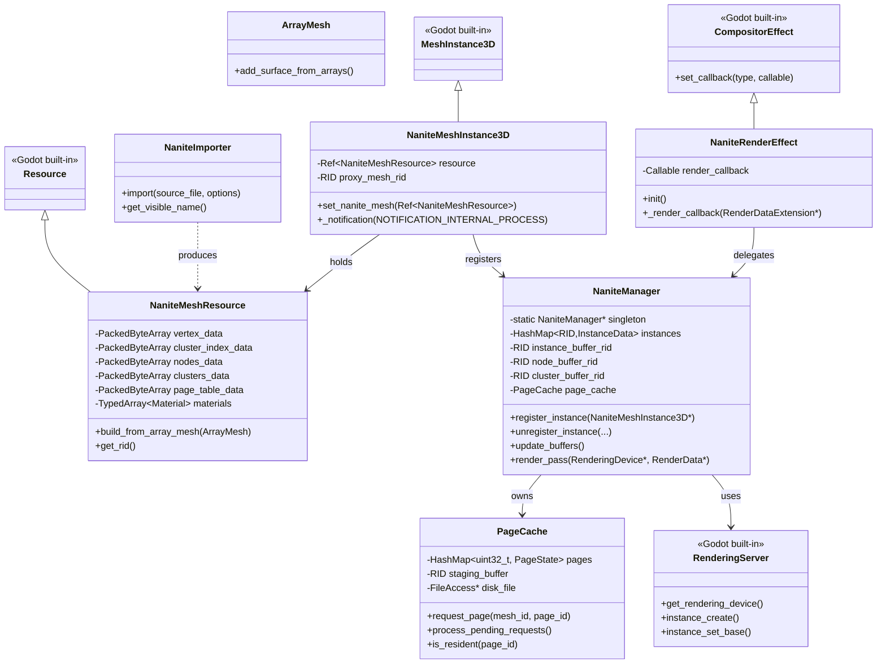
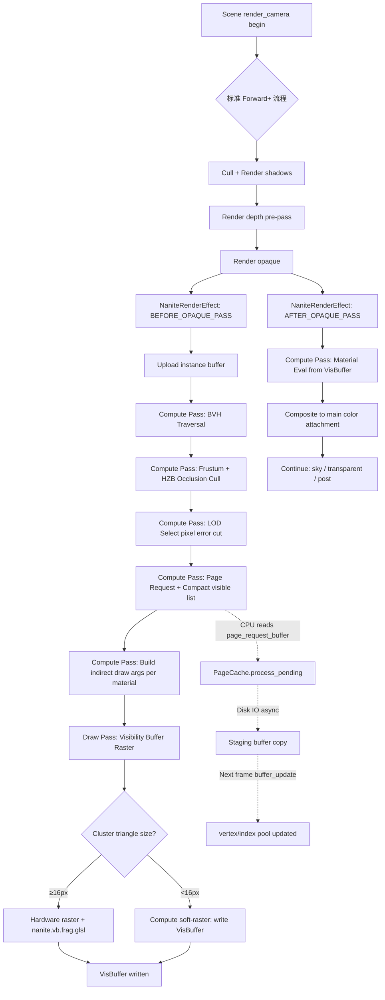
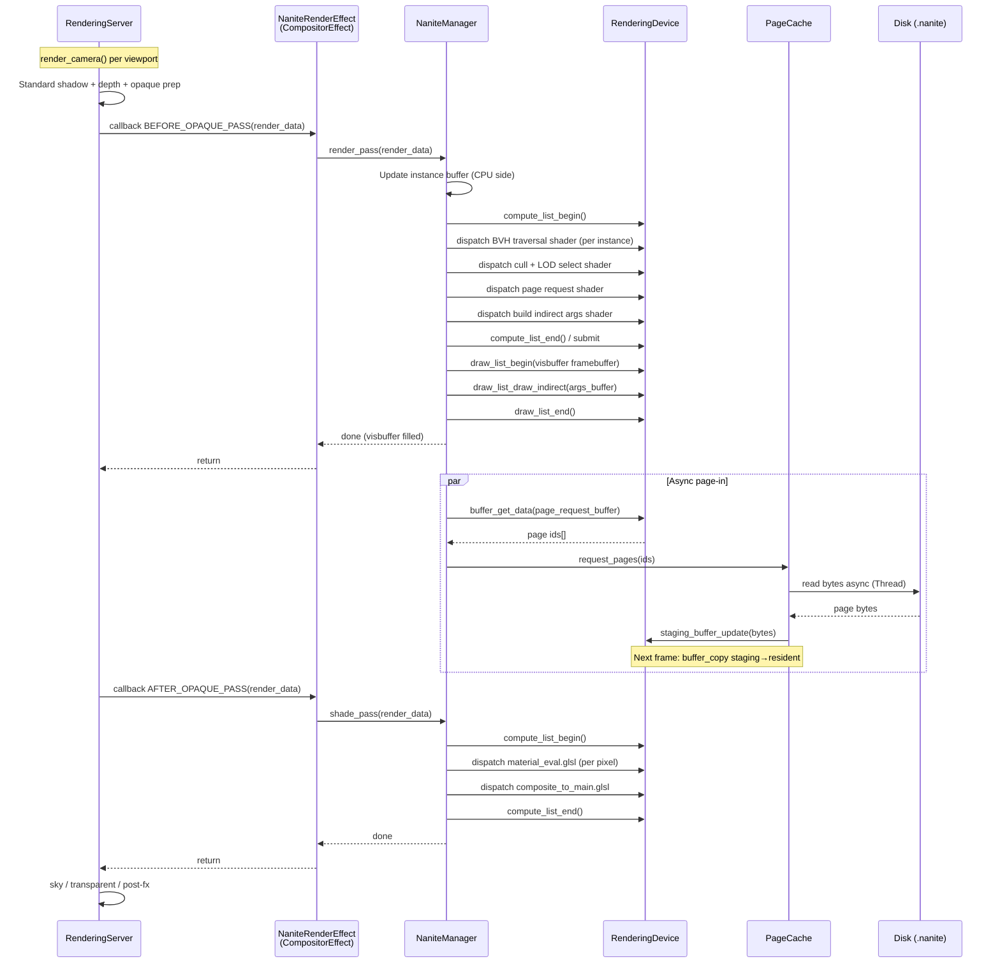
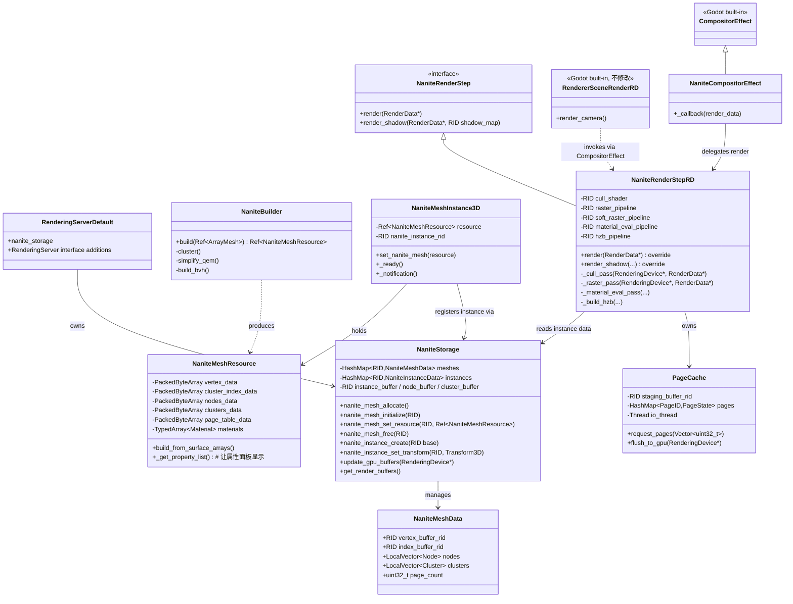
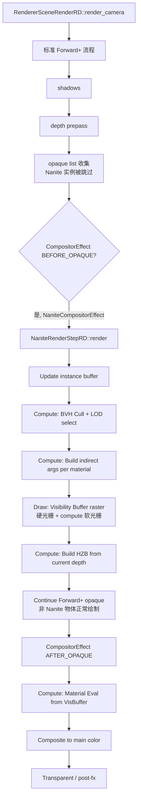
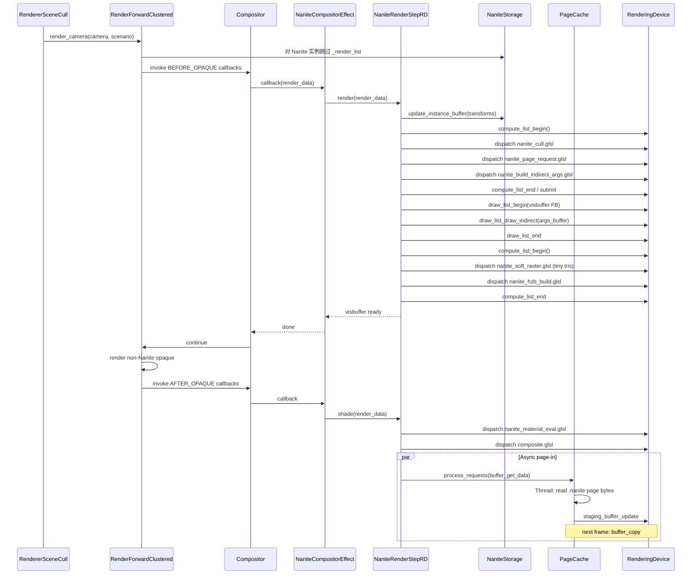
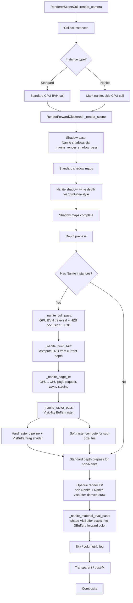
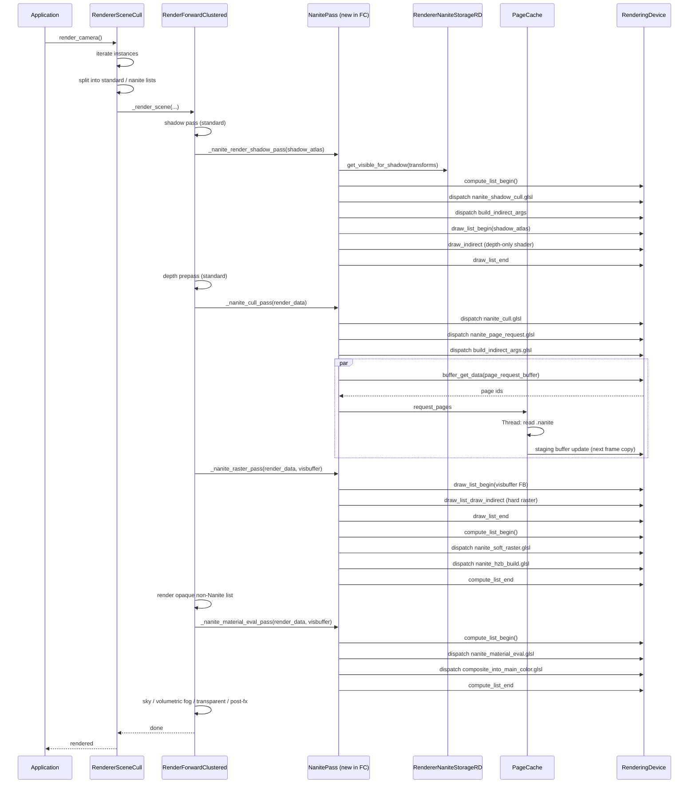

# 基于 Godot 引擎实现 Nanite 虚拟化几何系统 — 三套方案设计

> 目标:
> 1. **离线模块**:对 Mesh 构建层次化 Meshlet 簇 + BVH 树,记录到资源中供运行时使用;
> 2. **运行时 GPU**:遍历 BVH 树,执行视锥/遮挡剔除、LOD 选择(动态按需从磁盘加载到 GPU),输出可见且平滑的簇列表进行显示。

本文档基于 Godot 4.x 源码(`servers/rendering/`)与 Nanite 公开技术资料(Brian Karis SIGGRAPH 2021、UCSD CSE 272 笔记)综合调研后输出三套方案。

---

## 目录

1. [调研与原理基础](#1-调研与原理基础)
2. [共同的核心数据结构与算法](#2-共同的核心数据结构与算法)
3. [方案一:GDExtension(不改引擎源码)](#3-方案一gdextension不改引擎源码)
4. [方案二:独立 C++ Module](#4-方案二独立-c-module)
5. [方案三:深度引擎改造](#5-方案三深度引擎改造)
6. [三方案横向对比与推荐实施路径](#6-三方案横向对比与推荐实施路径)

---

## 1. 调研与原理基础

### 1.1 调研过程

| 步骤 | 检索关键词 | 关键结论 |
|---|---|---|
| 1 | Godot 4 RenderingDevice RD renderer forward plus architecture | Godot 现代渲染器全部基于 `RenderingDevice` 抽象(Vulkan/D3D12/Metal),Forward+/Mobile 共用此抽象;Compatibility 走 OpenGL,无 Compute Shader。**任何 Nanite 实现都应优先支持 Forward+/Mobile**。 |
| 2 | Nanite hierarchical meshlet BVH cluster software rasterization | Nanite 离线构建 128 tri/cluster,逐层 simplify+cluster 形成 BVH;运行时 GPU 遍历 BVH 做视锥/HZB 遮挡剔除,按屏幕像素误差选 LOD cut,小三角走软光栅化写 Visibility Buffer(R32G32_UINT),最后基于 VisBuffer 解码顶点并着色。 |
| 3 | Godot GDExtension rendering custom render pipeline RenderDataExtension | Godot 4.x 提供 `CompositorEffect`(通过 `RenderingMethod::compositor_effect_*` 注册)+ `RenderDataExtension`/`RenderSceneBuffersExtension` 作为 GDExtension 注入渲染的官方入口;同时 `RenderingServer.get_rendering_device()` 可在 GDExtension 中直接拿到 `RenderingDevice` 完整 API,可发起 compute list / draw list / indirect draw。 |
| 4 | Godot RenderingServer RD storage mesh surface ArrayMesh | Mesh 在 `RendererMeshStorage` 中以 `SurfaceData`(vertex/attribute/skin/index 三个 RD buffer + format)存储,GDExtension 可通过 `mesh_get_surface()` 拿到原始顶点数据用于离线构建。 |
| 5 | Godot 源码 `servers/rendering/storage/render_data_extension.h`、`rendering_method.h`、`storage/mesh_storage.h` | 确认扩展点 API 表面:`RenderingMethod::render_camera()` 是每相机渲染入口;`CompositorEffect` 的 callback 类型(`RSE::CompositorEffectCallbackType`)决定了注入时机;`RenderingDevice` 暴露 `compute_list_begin/draw_list_begin/draw_list_end` 等用于自主组织 pass。 |

### 1.2 Godot 4.x 渲染架构关键点(与方案相关)

```
┌────────────────────────────────────────────────────────────┐
│ RenderingServer (servers/rendering/rendering_server.h)    │
│  - 唯一对外 API,所有渲染操作经由 RID 引用                  │
└──────────────┬─────────────────────────────────────────────┘
               │
   ┌───────────┴────────────┐
   │ RendererSceneCull      │  CPU 端 BVH/八叉树剔除 + 实例更新
   │ (renderer_scene_cull.h)│  - instance_set_base / instance_set_transform
   └───────────┬────────────┘
               │ 调用
   ┌───────────┴────────────────────────────┐
   │ RenderingMethod (rendering_method.h)   │  抽象接口
   │  - render_camera()                     │
   │  - scenario_*/instance_*              │
   └───────────┬────────────────────────────┘
               │ 实现
   ┌───────────┴────────────────────────────┐
   │ RenderForwardClustered / Mobile        │  RD 渲染方法
   │  - _render_scene()                     │
   │  - _render_materials() / _render_shadows()│
   └───────────┬────────────────────────────┘
               │ 调用
   ┌───────────┴────────────────────────────┐
   │ RenderingDevice (rendering_device.h)   │  跨平台 GPU 抽象
   │  - compute_list_begin/end              │
   │  - draw_list_begin/end                 │
   │  - buffer_create / texture_create      │
   │  - draw_list_draw / compute_list_dispatch │
   └────────────────────────────────────────┘
```

关键扩展点(全部在三套方案中被复用或改写):

| 扩展点 | 文件 | 能力 |
|---|---|---|
| `CompositorEffect` | `scene/resources/compositor.h` + `rendering_method.h` | 在渲染管线的特定 callback 点注入自定义 Callable;GDExtension 可继承并注册。**方案一/二的核心入口**。 |
| `RenderDataExtension` | `servers/rendering/storage/render_data_extension.h` | 让扩展读取 camera/projection/environment 等。 |
| `RenderingServer.get_rendering_device()` | `servers/rendering/rendering_device.h` | 在扩展代码中拿到 `RenderingDevice*` 直接发起 compute/raster pass。 |
| `RendererMeshStorage::mesh_get_surface()` | `servers/rendering/storage/mesh_storage.h` | 离线构建时获取 Mesh 原始 SurfaceData。 |
| `RenderingMethod::render_camera()` | `rendering_method.h` | 每相机渲染入口,**方案三的核心修改点**。 |
| `RendererSceneCull` | `renderer_scene_cull.h` | CPU 端剔除与实例组织,**方案三的修改点**(让 Nanite 实例跳过 CPU 剔除)。 |

### 1.3 Nanite 核心原理速览

1. **离线 Cluster + BVH 构建**:
   - 三角形 → 切成 128 tri 的 cluster(最小化簇间共享边以减少 crack)
   - 自底向上:每 4 个 cluster 合并成一组 → simplify 到 50% → 再切成 2 个新 cluster → 形成父节点
   - 每个内部节点存储简化误差(几何误差),用于运行时计算屏幕投影误差
   - 形成 DAG(有向无环图,共享 cluster),但简化实现常用树
2. **运行时 GPU 流水线**:
   - `Culling Pass`:GPU 遍历 BVH,视锥剔除 + HZB 遮挡剔除(两遍:第一遍用上一帧 HZB + 上一帧可见集合,第二遍用本帧刚生成的 HZB 补漏)
   - `LOD Selection`:`error_proj = error * screen_scale`,`error_proj <= threshold` 则该节点处于"cut"上(其父节点误差过大,需要它)
   - `Page-in`:可见 cluster 若不在 GPU page cache,通过原子计数器把 page request 写入回读 buffer,CPU 异步从磁盘加载到 staging buffer,下一帧 `buffer_copy` 到 GPU resident buffer
   - `Rasterize`:大三角走硬件光栅,小三角(< 16px)走 compute shader 软光栅,输出 Visibility Buffer(每像素 8 字节:cluster id + triangle id + depth)
   - `Material Eval`:从 VisBuffer 加载 3 个顶点,执行材质着色,写入 G-Buffer/颜色 buffer,与 deferred shading 集成

---

## 2. 共同的核心数据结构与算法

三套方案共用以下数据结构与算法,只是其宿主不同(扩展 / 模块 / 引擎核心)。

### 2.1 离线数据结构

```cpp
// 单个 Cluster(叶子,128 三角形)
struct NaniteCluster {
    uint32_t vertex_offset;        // 在 mesh vertex pool 中的偏移
    uint32_t vertex_count;          // 通常 ≤ 128
    uint32_t index_offset;         // 在 cluster index buffer 中的偏移
    uint32_t triangle_count;       // ≤ 128
    AABB     bounds;                // 簇世界 AABB(精度足够支持 BVH 速剔除)
    float    error;                // 简化误差(从子节点继承)
    uint32_t material_index;       // 材质槽
    uint32_t page_id;               // 所属磁盘 page(用于流式加载)
};

// BVH 内部节点(LOD 节点)
struct NaniteClusterNode {
    AABB     bounds;
    float    error;                 // 此节点代表的简化版本的最大误差
    uint32_t left_child;             // 0xFFFFFFFF 表示叶子
    uint32_t right_child;
    uint32_t first_cluster;          // 叶子:指向 cluster 数组;内部:无效
    uint32_t cluster_count;
    uint32_t page_id;                // 内部节点同样关联一个 page
};

// 整个 Mesh 的 Nanite 资源
class NaniteMeshResource : public Resource {
    GDCLASS(NaniteMeshResource, Resource);
public:
    // —— 元数据 ——
    AABB       mesh_bounds;
    uint32_t   cluster_count;
    uint32_t   node_count;
    uint32_t   page_count;
    uint32_t   max_lod_depth;

    // —— 序列化的几何数据(写盘 .res)——
    PackedByteArray  vertex_data;       // 顶点池子(全 LOD 共享,vertex offset 区分)
    PackedByteArray  cluster_index_data;
    PackedByteArray  nodes_data;       // NaniteClusterNode[]
    PackedByteArray  clusters_data;    // NaniteCluster[]
    PackedByteArray  page_table_data;  // 每页在 .nanite 文件中的字节偏移

    TypedArray<Material> materials;    // 材质槽

    // —— 运行时附属(不参与序列化)——
    // 由 NaniteManager 在 load 时构建
    // ...
};
```

### 2.2 运行时 GPU 缓冲布局

| Buffer | 用途 | 大小 |
|---|---|---|
| `instance_buffer` | 每实例 transform + mesh_id + aabb | `sizeof(InstanceData) * instance_count` |
| `node_buffer` | BVH 节点数组(SSBO,所有 mesh 共享) | sum over meshes |
| `cluster_buffer` | Cluster 元数据(同上) | sum over meshes |
| `vertex_pool` | 顶点数据(page-granular resident) | 动态增长 |
| `index_pool` | 索引数据(同上) | 动态增长 |
| `visible_cluster_buffer` | 剔除后输出可见 cluster 列表 | atomic counter + compact |
| `page_request_buffer` | GPU→CPU 反馈:缺失 page 列表 | 256 个槽(环形) |
| `indirect_args_buffer` | 间接绘制参数(按材质分组) | material_count |
| `visibility_buffer` | 每像素 Cluster/Triangle ID + Depth | W×H × R32G32_UINT |
| `hzb_buffer` | Mipmap 层级深度金字塔(遮挡剔除) | log2(max(W,H)) mips |

### 2.3 核心算法伪代码

```
// === 离线 BuildPipeline ===
function build_nanite(mesh):
    clusters = initial_cluster(mesh, max_tris=128)   # 图划分,最小化跨簇边
    tree = []
    while len(clusters) > 1:
        groups = group(clusters, group_size=4)         # 图划分
        new_clusters = []
        for g in groups:
            simplified = simplify(g, target=0.5)       # QEM 简化
            children = split(simplified, max_tris=128)  # 再聚类
            parent_node.bounds = union(children.bounds)
            parent_node.error = max(children.error, simplification_error)
            parent_node.children = children
            tree.append(parent_node)
            new_clusters.append(parent_node)
        clusters = new_clusters
    return tree, vertex_pool, cluster_meta

# === 运行时 GPU pipeline (compute shader) ===
# Pass 1: Cull + LOD select (per-instance, parallelize over nodes)
for node in tree.traverse_iterative():
    if not frustum_cull(node.bounds): continue
    if hzb_occlusion_cull(node.bounds, prev_frame_hzb): continue
    proj_err = node.error * projected_screen_scale(node.bounds)
    if proj_err <= threshold:
        emit_to_visible(node.first_cluster, node.cluster_count)
    else:
        traverse_children(node)
# Pass 2: Page-in (compute)
for cluster in visible_list:
    if not is_resident(cluster.page_id):
        page_request_buffer.append(cluster.page_id)   # CPU 异步处理
    else:
        indirect_args[cluster.material_index].instance_count++
# Pass 3: Rasterize visibility buffer (软+硬混合)
rasterize_visible_clusters_into_visbuffer(visible_list)
# Pass 4: Material eval
for pixel in framebuffer:
    cid, tid, depth = visbuffer[pixel]
    v0, v1, v2 = load_triangle(cid, tid)
    bary = compute_barycentric(pixel, v0, v1, v2)
    material = cluster_material[cid]
    color = material_shade(material, bary, derivatives)
    output_color[pixel] = color
```

---

## 3. 方案一:GDExtension(不改引擎源码)

**核心思想**:把 Nanite 当成 Godot 的"插件"。所有渲染通过 `CompositorEffect` 注入到 Forward+ 现有管线之间,完全使用 `RenderingDevice` 自主发起 compute/draw pass。Mesh 通过 `ArrayMesh` 走常规导入流程触发构建,但**实际不显示原始 Mesh**(visible=false),只显示由 CompositorEffect 渲染的 Nanite 几何。

### 3.1 类图



### 3.2 Godot 引擎流程修改入口

GDExtension 不能修改引擎源码,但可通过以下注册入口接入:

| 入口 | 注册方式 | 作用 |
|---|---|---|
| `ClassDB::register_class<NaniteMeshResource>()` | `GDExtension::library_init` | 注册自定义资源类型,可在编辑器中创建/序列化 |
| `ClassDB::register_class<NaniteImporter>()` + `add_import_plugin` | `EditorPlugin` | 在 Mesh 导入时自动构建 Nanite 资源 |
| `ClassDB::register_class<NaniteRenderEffect>()` | GDExtension | 注册 `CompositorEffect` 子类 |
| `ClassDB::register_class<NaniteMeshInstance3D>()` | GDExtension | 自定义节点,挂载 Nanite 资源 |
| `Compositor.compositor_effects = [NaniteRenderEffect.new()]` | 编辑器/项目设置 | 把 effect 装入环境的 Compositor |
| `RenderingServer.get_rendering_device()` | 运行时 | 拿到 RD 直接发起 GPU pass |

**关键 callback 类型**(`RSE::CompositorEffectCallbackType`,见 `rendering_method.h`):

- `COMPOSITOR_EFFECT_CALLBACK_BEFORE_OPAQUE_PASS` — 我们的 culling + visibility buffer raster 主入口
- `COMPOSITOR_EFFECT_CALLBACK_AFTER_OPAQUE_PASS` — 把 visibility buffer shading 结果合并到主 color buffer
- `COMPOSITOR_EFFECT_CALLBACK_AFTER_SHADOWS_PASS` — 生成 Nanite 阴影几何(可选)

### 3.3 渲染管线流程



### 3.4 时序图 — 单帧渲染



### 3.5 关键代码骨架

```cpp
// nanite_render_effect.cpp (GDExtension)
void NaniteRenderEffect::_bind_methods() {
    ClassDB::bind_method(D_METHOD("_render_callback", "render_data"), &NaniteRenderEffect::_render_callback);
}

void NaniteRenderEffect::init() {
    // 注入到 BEFORE_OPAQUE_PASS 与 AFTER_OPAQUE_PASS
    set_callback(RSE::COMPOSITOR_EFFECT_CALLBACK_BEFORE_OPAQUE_PASS,
                 Callable(this, StringName("_render_callback")));
    set_callback(RSE::COMPOSITOR_EFFECT_CALLBACK_AFTER_OPAQUE_PASS,
                 Callable(this, StringName("_render_callback")));
}

void NaniteRenderEffect::_render_callback(const Ref<RenderDataExtension> &p_render_data) {
    RenderingDevice *rd = RenderingServer::get_singleton()->get_rendering_device();
    NaniteManager *mgr = NaniteManager::singleton;

    auto cb_type = get_active_callback_type();
    if (cb_type == RSE::COMPOSITOR_EFFECT_CALLBACK_BEFORE_OPAQUE_PASS) {
        mgr->cull_and_raster_pass(rd, p_render_data);   // 填充 visibility buffer
    } else if (cb_type == RSE::COMPOSITOR_EFFECT_CALLBACK_AFTER_OPAQUE_PASS) {
        mgr->material_eval_and_composite_pass(rd, p_render_data);
    }
}
```

```glsl
// nanite_cull.glsl (compute) - BVH 遍历 + 剔除 + LOD 选择
#[compute]
#version 450
layout(local_size_x = 64) in;
layout(set=0,binding=0,std430) buffer Instances { InstanceData d[]; } instances;
layout(set=0,binding=1,std430) readonly buffer Nodes { Node n[]; } nodes;
layout(set=0,binding=2,std430) readonly buffer Clusters { Cluster c[]; } clusters;
layout(set=0,binding=3,std430) writeonly buffer VisibleList { uint idx[]; } visible;
layout(set=0,binding=4,std430) buffer Counter { uint count; } counter;
layout(set=0,binding=5) uniform CameraData { mat4 view_proj; vec3 cam_pos; float error_threshold; };
layout(set=0,binding=6) uniform sampler2D hzb_prev;

void main() {
    uint inst_id = gl_GlobalInvocationID.x;
    if (inst_id >= instance_count) return;
    InstanceData inst = instances.d[inst_id];

    // 栈式 BVH 遍历
    uint stack[32]; int sp = 0;
    stack[sp++] = inst.root_node;
    while (sp > 0) {
        uint n = stack[--sp];
        Node node = nodes.n[n];
        AABB world_aabb = transform_aabb(node.bounds, inst.transform);
        if (!frustum_visible(world_aabb)) continue;
        if (hzb_occluded(world_aabb, hzb_prev)) continue;

        float screen_scale = projected_screen_scale(world_aabb, view_proj);
        if (node.error * screen_scale <= error_threshold) {
            // 命中 cut,写入可见 cluster 列表
            for (uint i = 0; i < node.cluster_count; i++) {
                uint slot = atomicAdd(counter.count, 1);
                visible.idx[slot] = node.first_cluster + i;
            }
        } else if (node.left_child != 0xFFFFFFFF) {
            stack[sp++] = node.left_child;
            stack[sp++] = node.right_child;
        }
    }
}
```

### 3.6 优缺点

**优点**:
- **零引擎改动**,可独立分发(.so/.dll + .gdextension 文件),兼容官方构建;
- 适合快速原型验证,无需维护引擎 fork;
- `CompositorEffect` 是官方扩展点,稳定性较好。

**缺点**:
- **性能开销**:每帧通过 Callable 跨边界调用、SSBO 资源不能与引擎共享、可见性结果只能通过 framebuffer 复制回流;
- **无法接管 Godot 原生材质系统**:必须实现自己的材质管线,StandardMaterial3D 需要采样到自己的着色器;
- **阴影/GI 集成困难**:引擎的 shadow pass 不会调用 CompositorEffect;需要把 Nanite 几何单独写一遍深度到 shadow map;
- **GDExtension 二进制平台兼容**:需要为每个平台编译;
- **磁盘流式加载**:`FileAccess` 不能在 compute shader 内发起,只能环形 buffer + CPU 中转;
- **可见性跳过主渲染**:BEFORE_OPAQUE_PASS 之后场景中 Nanite 实例的"代理 mesh"还得显式 hide,否则会被引擎当作普通 mesh 渲染。

---

## 4. 方案二:独立 C++ Module

**核心思想**:作为 `modules/nanite/` 编译进引擎。比 GDExtension 强的是:可访问引擎私有头、可在 ClassDB 注册新 server 类型、可在 `RenderingServerDefault` 中添加新方法、`Importer`/`EditorInspectorPlugin` 直接用 C++ 写、能与现有 MeshStorage 共享 RD buffer。

仍然**不修改** Forward+ 渲染方法本体,而是通过以下两种手段之一接入:
- (a) 与方案一一样,通过 `CompositorEffect` 注入,但用 C++ 直接调用;
- (b) **新增 `NaniteSceneRenderStep` 并在 `RendererSceneCull::render_camera` 调用链中插入**(此为模块可做到、GDExtension 做不到的边界)。

### 4.1 模块布局

```
modules/nanite/
├── SCsub
├── config.py
├── register_types.cpp             # 模块入口:register_nanite_types()
├── nanite_storage.h/.cpp         # NaniteStorage 单例(类比 MeshStorage)
├── nanite_resource.h/.cpp        # NaniteMeshResource (Resource)
├── nanite_importer.h/.cpp        # EditorResourceImporter + import plugin
├── nanite_mesh_instance_3d.h/.cpp# 节点
├── nanite_render_step.h/.cpp     # 渲染步骤(注册到 scene render)
├── nanite_compositor_effect.h/.cpp
├── nanite_manager.h/.cpp         # 运行时管理
├── page_cache.h/.cpp             # 流式加载
├── offline/
│   ├── mesh_clusterer.h/.cpp     # 切 128 tri cluster
│   ├── mesh_simplifier.h/.cpp    # QEM 简化
│   └── nanite_builder.h/.cpp     # 主流程
├── shaders/
│   ├── nanite_cull.glsl
│   ├── nanite_raster.vert.glsl
│   ├── nanite_raster.frag.glsl  # 输出 visibility buffer
│   ├── nanite_soft_raster.glsl  # compute 软光栅
│   ├── nanite_material_eval.glsl
│   └── nanite_hzb_build.glsl
└── editor/
    └── nanite_editor_plugin.h/.cpp
```

### 4.2 类图



### 4.3 Godot 引擎流程修改入口

模块对引擎的"修改"通过以下方式(均不需要改引擎源码,而是在模块里追加):

| 入口 | 实现方式 | 作用 |
|---|---|---|
| `register_nanite_types()` | `register_types.cpp` 中 `ClassDB::register_class<>()` 各类型;`RendererStorageNanite` 添加到 `RS` | 类型注册 |
| 扩展 `RenderingServer` | 在 `RenderingServerDefault` 之外注册 `NaniteServer`(独立 Object),提供 `nanite_mesh_create/set_resource/instance_create` 等 | 新增 server,与 `RenderingServer` 平级 |
| `EditorPlugin` | `NaniteEditorPlugin`:`add_import_plugin`、`add_inspector_plugin` | 编辑器集成 |
| `Compositor` 默认 effect | 启动时若检测到 Nanite 资源,自动把 `NaniteCompositorEffect` 装入环境 Compositor | 自动激活渲染步骤 |
| `RendererSceneCull` 友元/钩子 | 通过新增 `instance_set_nanite(RID, bool)` 方法标记实例,Nanite 实例跳过 `RenderForwardClustered::_render_list` 的标准绘制 | 让原生渲染不重复绘制 Nanite |

**关键点**:`RenderingServerDefault` 是 Godot 中所有 server 的聚合体。模块可以在 `register_types.cpp` 中:

```cpp
// modules/nanite/register_types.cpp
void register_nanite_types() {
    ClassDB::register_class<NaniteMeshResource>();
    ClassDB::register_class<NaniteMeshInstance3D>();
    ClassDB::register_class<NaniteCompositorEffect>();

    // 注册独立 server
    NaniteServer::create_singleton();
    // 通过 RenderingServer 暴露
    RenderingServer::get_singleton()->_set_nanite_storage(NaniteServer::get_singleton()->get_storage());

    // 注册导入器
    if (Engine::get_singleton()->is_editor_hint()) {
        EditorNode::add_editor_plugin(memnew(NaniteEditorPlugin));
    }
}
```

### 4.4 渲染管线流程(同方案一,但走 C++ 直调)



### 4.5 时序图



### 4.6 优缺点

**优点**:
- 比 GDExtension 性能更高(零跨语言边界);
- 可与 `MeshStorage` 共享 RD buffer(节省一份顶点池);
- 可注册独立 server,API 更自然(`RS::nanite_*`);
- 编辑器插件原生 C++,可定制 Inspector、importer、gizmo;
- 不维护引擎 fork,升级时只需重新编译模块。

**缺点**:
- 仍不能改 Forward+ 内部 pass 组织(只能"插入前后");
- Nanite 阴影仍需自己实现(可在 `_render_shadow` 中自己写深度);
- 透明物体、特效shader 仍走 Godot 标准;
- 模块虽不修改源码,但需要重新编译引擎,意味着分发的二进制含模块。

---

## 5. 方案三:深度引擎改造

**核心思想**:把 Nanite 提升为引擎一等公民。在 `RenderingServer` / `RenderingMethod` / `RendererSceneCull` 中原生支持 Nanite mesh,Forward+ / Mobile 渲染方法内部新增 Nanite pass,与材质/阴影/GI 完全打通。

### 5.1 引擎源码改动清单

| 文件 | 改动 | 用途 |
|---|---|---|
| `servers/rendering/rendering_server.h/.cpp` | 新增 `nanite_*` 系列方法、新 RID 类型 | API 入口 |
| `servers/rendering/rendering_server_default.h/.cpp` | 把 `NaniteStorage` 纳入,转发调用 | 默认 server |
| `servers/rendering/storage/nanite_storage.h`(新) | 接口定义 | 新增 storage 抽象 |
| `servers/rendering/renderer_rd/storage_rd/nanite_storage_rd.h/.cpp`(新) | RD 实现 | 实现 |
| `servers/rendering/rendering_method.h` | 新增 `nanite_*` 虚函数 + 在 `render_camera` 中插入 Nanite pass 调用 | 抽象层 |
| `servers/rendering/renderer_rd/forward_clustered/render_forward_clustered.h/.cpp` | 新增 `_nanite_cull_pass`、`_nanite_raster_pass`、`_nanite_material_eval_pass` 方法,在 `_render_scene` 中按位序调用 | 真正的渲染管线改造 |
| `servers/rendering/renderer_rd/forward_clustered/scene_shader_forward_clustered.h/.cpp` | 新增 `NaniteShader` 子结构 | 着色器组织 |
| `servers/rendering/renderer_scene_cull.h/.cpp` | Nanite 实例跳过标准 cull,转交 GPU-driven 流水线;`instance_set_nanite(RID,bool)` | 剔除路径改造 |
| `scene/resources/mesh.h/.cpp` | 新增 `Mesh::SURFACE_NANITE` surface 类型 | Mesh 类型扩展 |
| `scene/resources/nanite_mesh.h/.cpp`(新) | `NaniteMesh` Resource | 新资源 |
| `scene/3d/mesh_instance_3d.h/.cpp` | 新增 `set_nanite_mesh()` + 自动创建 Nanite instance | 节点集成 |
| `scene/resources/importer_mesh.h/.cpp` | 导入时若 mesh 面数 > 阈值自动构建 Nanite | 自动构建 |
| `servers/rendering/renderer_rd/storage_rd/mesh_storage.h/.cpp` | `mesh_add_surface` 支持 `SURFACE_NANITE`,直接拿 Nanite resource | storage 兼容 |

### 5.2 类图(改动以红色标注)

```mermaid
classDiagram
    class RenderingServer {
        <<改动:新增 nanite_* 方法>>
        +nanite_mesh_create()
        +nanite_mesh_set_resource(RID, Ref~NaniteMesh~)
        +nanite_instance_create(RID base)
        +nanite_instance_set_transform(RID, Transform3D)
        +nanite_set_pixel_error_threshold(float)
    }
    class RenderingServerDefault {
        +RendererNaniteStorage* nanite_storage
    }
    class RendererNaniteStorage {
        <<interface>>
        +nanite_mesh_allocate()
        +nanite_instance_create()
        +update_buffers(RenderingDevice*)
    }
    class RendererNaniteStorageRD {
        +RID node_buffer / cluster_buffer / vertex_pool / index_pool
        +RID instance_buffer
        +HashMap~RID,NaniteMeshData~
        +HashMap~RID,NaniteInstance~
        +PageCache page_cache
    }
    class RenderingMethod {
        <<改动:新增虚函数>>
        +nanite_render_cull_pass(RenderData*)
        +nanite_render_raster_pass(RenderData*, RID visbuffer)
        +nanite_render_material_eval_pass(RenderData*, RID visbuffer)
        +nanite_render_shadow_pass(...)
    }
    class RenderForwardClustered {
        <<改动:实现 Nanite pass>>
        -_nanite_cull_pass(...)
        -_nanite_raster_pass(...)
        -_nanite_material_eval_pass(...)
        -_nanite_build_hzb(...)
        +_render_scene(...) # 在固定位置插入 Nanite pass 调用
    }
    class RendererSceneCull {
        <<改动:Nanite 实例分流>>
        -_instance_filter_nanite(...)
        +instance_set_nanite(RID,bool)
    }
    class Mesh {
        <<改动:新增 SURFACE_NANITE>>
        +enum SurfaceType { SURFACE_STANDARD, SURFACE_NANITE }
    }
    class NaniteMesh {
        <<新资源>>
        -PackedByteArray vertex_data
        -PackedByteArray cluster_index_data
        -PackedByteArray nodes_data
        -PackedByteArray clusters_data
        -PackedByteArray page_table_data
        +build_from_arrays(PackedArrays)
    }
    class MeshInstance3D {
        <<改动>>
        +set_nanite_mesh(Ref~NaniteMesh~)
        -RID nanite_instance
    }
    class MeshStorageRD {
        <<改动>>
        +mesh_add_surface(SURFACE_NANITE, Ref~NaniteMesh~)
    }
    class PageCache {
        +request_pages(...)
        +flush_to_gpu(RenderingDevice*)
    }

    RenderingServer --> RenderingServerDefault : impl
    RenderingServerDefault --> RendererNaniteStorage : owns
    RendererNaniteStorage <|-- RendererNaniteStorageRD
    RenderingMethod <|-- RenderForwardClustered
    RenderingMethod --> RendererNaniteStorage : uses
    RenderForwardClustered --> PageCache
    RendererNaniteStorageRD --> PageCache
    Mesh <|-- NaniteMesh : SURFACE_NANITE
    MeshInstance3D --> NaniteMesh : optional
    MeshStorageRD --> RendererNaniteStorageRD : delegates for nanite surfaces
```

### 5.3 渲染管线流程 — 重构后



### 5.4 时序图



### 5.5 关键代码片段

#### `render_forward_clustered.h` 新增声明

```cpp
class RenderForwardClustered : public RendererSceneRenderRD {
    // ... existing members ...

    // ===== Nanite (新增) =====
    struct NaniteShader {
        RD::PipelineID cull_pipeline;
        RD::PipelineID page_request_pipeline;
        RD::PipelineID build_indirect_args_pipeline;
        RD::PipelineID soft_raster_pipeline;
        RD::PipelineID hzb_build_pipeline;
        RD::PipelineID material_eval_pipeline;
        RD::PipelineID composite_pipeline;
        RD::PipelineID shadow_cull_pipeline;
        // uniform sets, etc.
    } nanite_shader;

    RID nanite_visbuffer;             // R32G32_UINT, W×H
    RID nanite_hzb;                   // mipmap pyramid
    RID nanite_visible_cluster_buffer;
    RID nanite_indirect_args_buffer;
    RID nanite_page_request_buffer;

    void _nanite_cull_pass(RenderDataRD *p_render_data);
    void _nanite_raster_pass(RenderDataRD *p_render_data);
    void _nanite_material_eval_pass(RenderDataRD *p_render_data);
    void _nanite_render_shadow_pass(RenderDataRD *p_render_data, RID p_shadow_atlas);
    void _nanite_build_hzb(RenderDataRD *p_render_data);
    void _nanite_process_page_requests(); // 提交到 PageCache
};
```

#### `_render_scene` 改造(简化示意)

```cpp
void RenderForwardClustered::_render_scene(RenderDataRD *p_render_data, ...) {
    // 1. Standard shadow pass
    _render_shadows(p_render_data, ...);

    // 2. NEW: Nanite shadow pass
    if (p_render_data->has_nanite_instances) {
        _nanite_render_shadow_pass(p_render_data, p_shadow_atlas);
    }

    // 3. Standard depth prepass
    if (depth_prepass) {
        _render_depth_prepass(p_render_data, ...);
    }

    // 4. NEW: Nanite cull + raster (writes visibility buffer)
    if (p_render_data->has_nanite_instances) {
        _nanite_cull_pass(p_render_data);
        _nanite_process_page_requests();
        _nanite_raster_pass(p_render_data);
        _nanite_build_hzb(p_render_data);
    }

    // 5. Standard opaque list (non-Nanite)
    _renderOpaqueForward(p_render_data, ...);

    // 6. NEW: Nanite material evaluation
    if (p_render_data->has_nanite_instances) {
        _nanite_material_eval_pass(p_render_data);
    }

    // 7. sky / transparent / post-fx (unchanged)
    _render_sky(...);
    _render_transparent(...);
    _render_postfx(...);
}
```

#### `renderer_scene_cull.cpp` 改造

```cpp
void RendererSceneCull::_instance_initialize(RID p_instance) {
    // ... existing ...
    instance->nanite = false;  // 新增字段
}

void RendererSceneCull::instance_set_nanite(RID p_instance, bool p_enabled) {
    Instance *instance = instance_owner.get_or_null(p_instance);
    ERR_FAIL_NULL(instance);
    instance->nanite = p_enabled;
}

// 在 _render_camera 中分流:
void RendererSceneCull::_render_camera(...) {
    // 收集实例时分流
    LocalVector<Instance*, Alloca> standard_instances;
    LocalVector<Instance*, Alloca> nanite_instances;
    for (Instance *inst : visible_instances) {
        if (inst->nanite) nanite_instances.push_back(inst);
        else standard_instances.push_back(inst);
    }
    // Nanite:跳过标准 cull,直接打包 transform + mesh_id 到 GPU buffer
    RSG::nanite_storage->update_instances(nanite_instances);
    // Standard:走原来的 BVH cull
    _cull_standard_instances(standard_instances, ...);

    rendering_method->render_camera(..., /* has_nanite = */ !nanite_instances.empty());
}
```

### 5.6 优缺点

**优点**:
- 与 Godot 完全打通:StandardMaterial3D、阴影、GI、SSR、SSAO、VoxelGI、LightmapGI 全部直接可用;
- 性能最优:无跨边界开销,buffer/texture 全引擎共享,可与 cluster lighting 的 light grid 复用;
- 编辑器无缝集成:Inspector / Gizmo / Importer 全部原生;
- 可借力 Forward+ 的 cluster lighting,把 Nanite 输出的 G-Buffer 与 forward+ 着色一致。

**缺点**:
- 维护 fork:跟随上游升级成本高,需 rebase;
- 代码审查门槛高:渲染核心改动需谨慎;
- 推广困难:需说服社区接受才能进入主干(否则永久 fork)。

---

## 6. 三方案横向对比与推荐实施路径

### 6.1 对比表

| 维度 | 方案一:GDExtension | 方案二:C++ Module | 方案三:深度改造 |
|---|---|---|---|
| 引擎改动 | 无 | 仅添加新文件 | 大量修改核心文件 |
| 分发 | 单独 .so/.dll + .gdextension | 重新编译引擎 | 维护 fork |
| 性能 | 跨语言边界,中 | 原生 C++,高 | 最高,无边界 |
| 阴影/GI 集成 | 需自实现,困难 | 需自实现,中等 | 完全打通 |
| 材质系统 | 自定义材质管线 | 自定义,但可复用 StandardMaterial 数据 | 直接复用 StandardMaterial3D |
| 编辑器集成 | EditorPlugin,可用 | EditorPlugin,更顺 | 原生 Inspector/Gizmo |
| 升级跟随 | 容易(只跟 API 表面) | 中(随 module 重新编译) | 困难(rebase fork) |
| 实现工作量 | 中 | 中-高 | 高 |
| 上游合并可能 | 不可(纯扩展) | 可能(若作为可选 module) | 需提案 + PR review |
| 适合场景 | 原型验证 / 商业插件 | 生产部署 / 跨项目复用 | 长期演进 / 引擎团队 |

### 6.2 推荐实施路径

```mermaid
flowchart LR
    P1[阶段一:GDExtension 原型<br/>验证离线 BVH+cluster 构建<br/>验证 visibility buffer 软光栅<br/>验证 HZB 遮挡剔除]
    P2[阶段二:迁移到 C++ Module<br/>补全材质集成<br/>补全阴影路径<br/>补全 page cache 流式]
    P3[阶段三:深度改造 / 上游提案<br/>Forward+ 内置 Nanite pass<br/>StandardMaterial3D 直接消费<br/>提交 godot-proposals]

    P1 --> P2 --> P3
    P1 -. 可独立交付 .→ D1[商业插件分发]
    P2 -. 可独立交付 .→ D2[企业 fork + module]
    P3 -. 上游合并 .→ D3[Godot 官方 Nanite]
```

**实施建议**:
1. **先做方案一**:用最小代码量验证算法正确性(离线 cluster/BVH + 运行时 cull + VisBuffer),用 stress test mesh 验证渲染结果;
2. **过渡到方案二**:把 GDExtension 实现平移到 module,补全材质/阴影路径;此阶段已可投入生产;
3. **选择性进入方案三**:若长期目标是为 Godot 社区提供 Nanite 能力,以 module 起步、积累用户后开 `godot-proposals` 提案,推进核心集成。

### 6.3 关键风险与对策

| 风险 | 影响 | 对策 |
|---|---|---|
| Godot 的 `CompositorEffect` API 仍较新,行为在不同版本间可能变化 | 方案一/二 callback 行为漂移 | 锁定 4.x LTS 版本,抽象 callback 层 |
| 软光栅化在低端 GPU 上 compute 占用大 | 移动端不可用 | 提供像素阈值回退到硬光栅;移动端默认关闭 |
| 磁盘流式加载抖动 | 视野快速移动时画面跳变 | 多帧预读 + 优先级队列(基于像素预算) |
| 多材质/multi-surface mesh 索引混乱 | 间接绘制 args 分组错误 | 离线阶段为每个 cluster 记录 `material_index` |
| GDExtension 跨平台编译复杂 | 分发困难 | 使用 prebuilt + github actions 多平台矩阵 |
| Fork 升级冲突 | 长期维护成本高 | 把改动尽量集中在新增文件,核心文件改动用 patch 描述 |

---

## 附录 A:核心 RD Shader 概览

| Shader | 类型 | 输入 | 输出 |
|---|---|---|---|
| `nanite_cull.glsl` | compute(64) | instance/node/cluster buffers, prev HZB, view-proj | visible_cluster_buffer + counter |
| `nanite_page_request.glsl` | compute(1) | visible_cluster_buffer, page residency texture | page_request_buffer |
| `nanite_build_indirect_args.glsl` | compute(64) | visible_cluster_buffer | indirect_args_buffer (per material) |
| `nanite_raster.vert/.frag.glsl` | graphics | vertex_pool, index_pool, cluster_buffer | visbuffer (R32G32_UINT) |
| `nanite_soft_raster.glsl` | compute(8x8) | visible_cluster_buffer (small tris subset) | visbuffer |
| `nanite_hzb_build.glsl` | compute(8x8) | depth buffer | hzb mipmap pyramid |
| `nanite_material_eval.glsl` | compute(8x8) | visbuffer, vertex_pool, materials, G-buffer | shaded color per pixel |
| `nanite_composite.glsl` | compute(8x8) | shaded color | main color attachment |
| `nanite_shadow_cull.glsl` | compute(64) | instance/node buffers, light view-proj | indirect draw args for shadow depth |

## 附录 B:资源文件格式(序列化)

`*.nanite` 文件(二进制,配合 `.res` 索引):

```
NANM  (magic, 4 bytes)
uint32 version
uint32 vertex_count, uint32 vertex_stride
uint32 cluster_count, uint32 node_count
uint32 page_count, uint32 page_size
[vertex data]
[cluster index data]
[cluster metadata array]
[node array]
[page table: per page {file_offset, byte_size, mesh_id, page_id}]
```

`NaniteMeshResource`(`.res`):仅记录元信息 + 指向 `.nanite` 文件的路径,真正几何数据走磁盘流式。这样大 mesh 不会撑爆 `.res`。

## 附录 C:参考与致谢

- Brian Karis, *A Deep Dive into Nanite Virtualized Geometry*, SIGGRAPH 2021.
- Tzu-Mao Li, *Nanite*, UCSD CSE 272 Lecture Notes, Wi 2022.
- Godot Engine 内部渲染架构文档:`docs/contributing/development/core_and_modules/internal_rendering_architecture.rst`。
- Godot 源码 `servers/rendering/storage/render_data_extension.h`、`rendering_method.h`、`storage/mesh_storage.h`。
