# Godot Engine 引擎循环与线程模型深度分析

## 1. 概述

Godot 引擎采用**主线程串行 + 服务器可选多线程**的架构。核心帧循环在主线程上串行执行，但物理服务器和渲染服务器可配置为独立线程运行，通过 `CommandQueueMT` 命令队列与主线程同步。动画、脚本、输入均在主线程上执行。

## 2. 检索过程

1. `main/main.cpp:4835-5058` → `Main::iteration()` 完整帧循环实现
2. `core/os/main_loop.h` → `MainLoop` 抽象接口（5 个虚方法）
3. `scene/main/scene_tree.h:85-350` → `SceneTree` 继承 `MainLoop`，ProcessGroup 多线程处理
4. `scene/main/scene_tree.cpp:628-1300` → `physics_process()`/`process()`/`_process_group()`/`_process_groups_thread()`
5. `servers/physics_3d/physics_server_3d_wrap_mt.h` → `PhysicsServer3DWrapMT`，`create_thread` 标志
6. `servers/physics_3d/physics_server_3d_wrap_mt.cpp` → 线程创建、`_thread_loop()`、`sync()`/`step()`
7. `servers/rendering/rendering_server_default.h:77-82` → `CommandQueueMT`、`create_thread`、`server_thread`
8. `servers/rendering/rendering_server_default.cpp:269-467` → `init()`/`sync()`/`draw()` 多线程逻辑
9. `servers/server_wrap_mt_common.h` → `FUNC*` 宏，命令队列 push/flush/sync 模式
10. `core/object/worker_thread_pool.h` → `WorkerThreadPool` 线程池
11. `core/templates/command_queue_mt.h` → `CommandQueueMT` 命令队列实现

## 3. 核心类层次

### 3.1 MainLoop 接口与 SceneTree

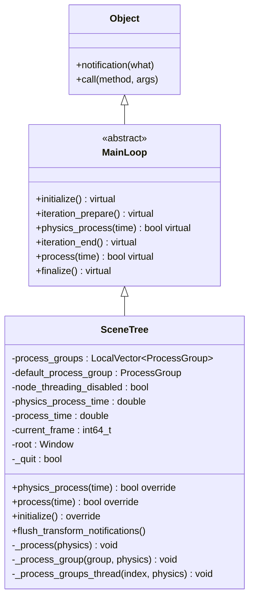

### 3.2 ServerWrapMT 线程包装体系

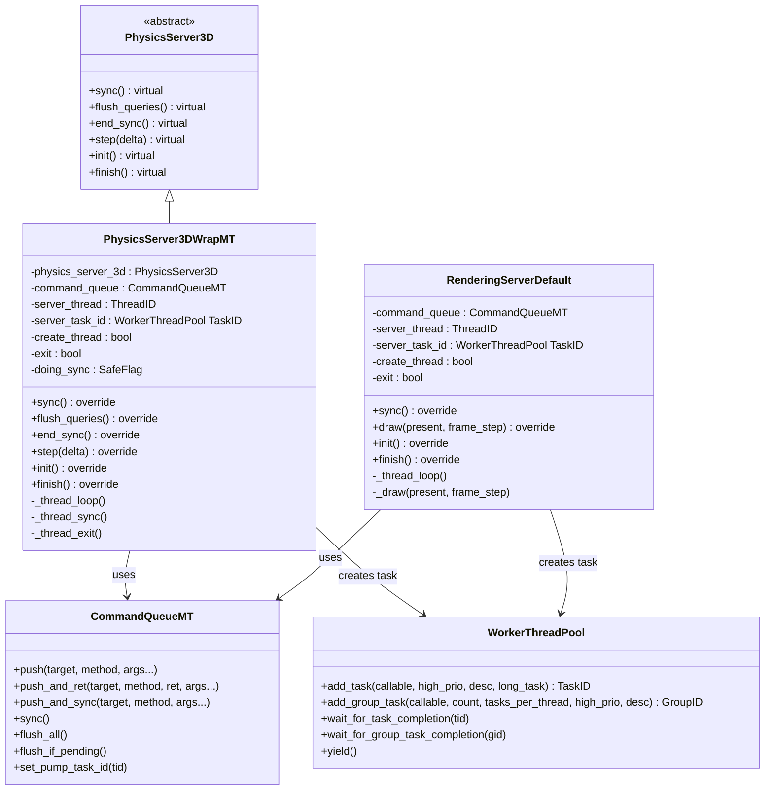

### 3.3 ProcessGroup 多线程处理

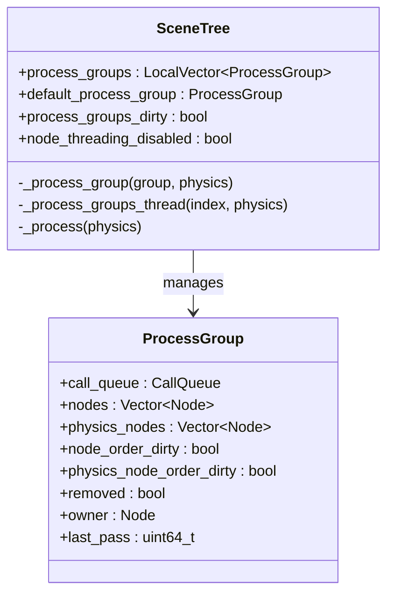

## 4. 完整帧循环详解

### 4.1 Main::iteration() 流程

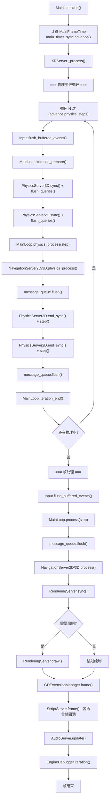

### 4.2 帧时序图

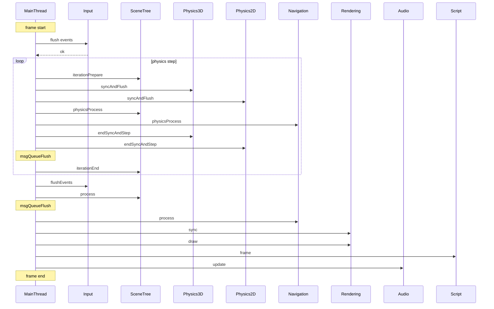

## 5. 多线程模型详解

### 5.1 线程架构总览

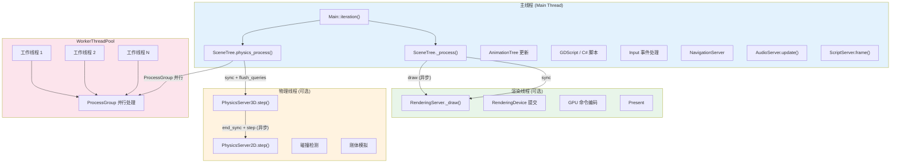

### 5.2 CommandQueueMT 同步机制

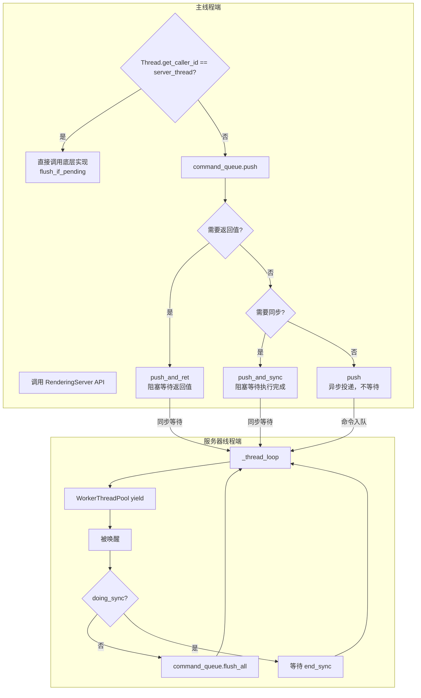

### 5.3 物理服务器线程模型

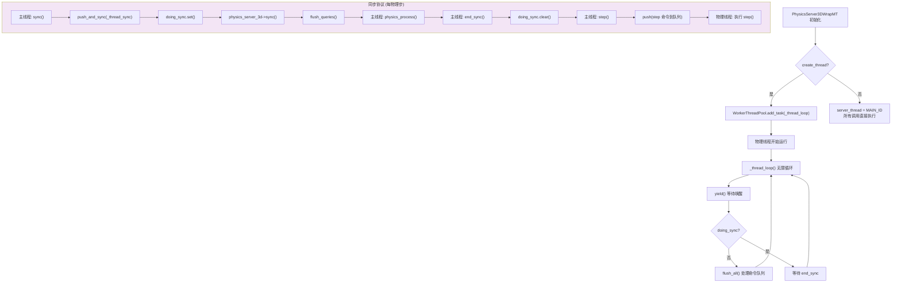

### 5.4 渲染服务器线程模型

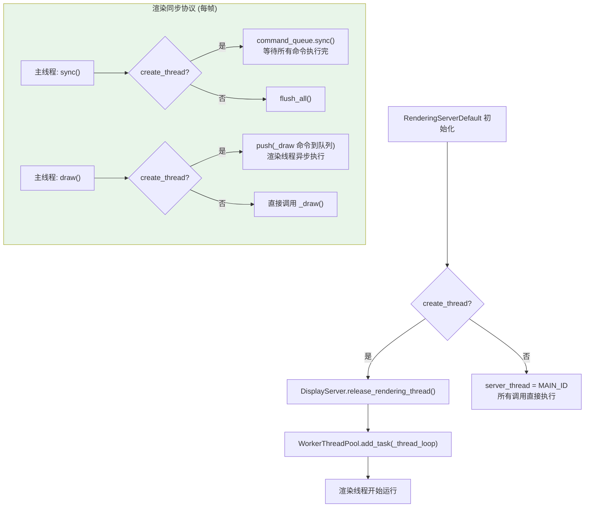

### 5.5 create_thread 决策

```
PhysicsServer3DWrapMT 构造:
  PhysicsServer3DWrapMT(PhysicsServer3D *p_contained, bool p_create_thread)

RenderingServerDefault 构造:
  RenderingServerDefault(bool p_create_thread)

决策因素:
  ┌─────────────────────────────────────────────────────┐
  │  PhysicsServer3D:                                    │
  │  ├── 默认: create_thread = true (桌面平台)           │
  │  ├── 移动端: create_thread = false                   │
  │  └── 由 PhysicsServer3DManager 根据平台决定          │
  │                                                      │
  │  RenderingServerDefault:                             │
  │  ├── 默认: create_thread = true (桌面平台)           │
  │  ├── 移动端/Web: create_thread = false               │
  │  └── 由 DisplayServer 和项目设置决定                 │
  └─────────────────────────────────────────────────────┘
```

## 6. 各子系统线程归属

### 6.1 详细线程归属表

| 子系统 | 默认线程 | 可否独立线程 | 同步机制 |
|--------|---------|-------------|---------|
| **脚本 (_process)** | 主线程 | 否 | N/A |
| **脚本 (_physics_process)** | 主线程 | 否 | N/A |
| **输入 (Input)** | 主线程 | 否 | N/A |
| **动画 (AnimationTree)** | 主线程 | 否 | N/A |
| **物理 (PhysicsServer3D)** | 可选独立线程 | 是 | sync/end_sync/step 命令队列 |
| **物理 (PhysicsServer2D)** | 可选独立线程 | 是 | sync/end_sync/step 命令队列 |
| **渲染 (RenderingServer)** | 可选独立线程 | 是 | sync/draw 命令队列 |
| **导航 (NavigationServer)** | 主线程 | 否 | N/A |
| **音频 (AudioServer)** | 主线程调用 | 内部有音频线程 | 音频驱动内部线程 |
| **XR (XRServer)** | 主线程 | 否 | N/A |
| **MessageQueue** | 主线程 flush | 否 | flush() 在帧边界执行 |
| **ProcessGroup** | WorkerThreadPool | 可选并行 | add_group_task 并行分发 |

### 6.2 线程交互时序

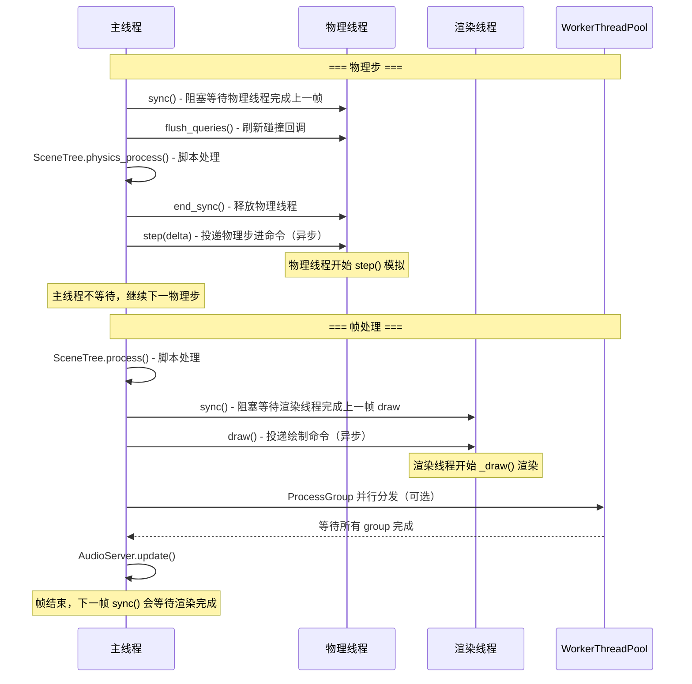

## 7. SceneTree 的 ProcessGroup 多线程

### 7.1 ProcessGroup 并行处理流程

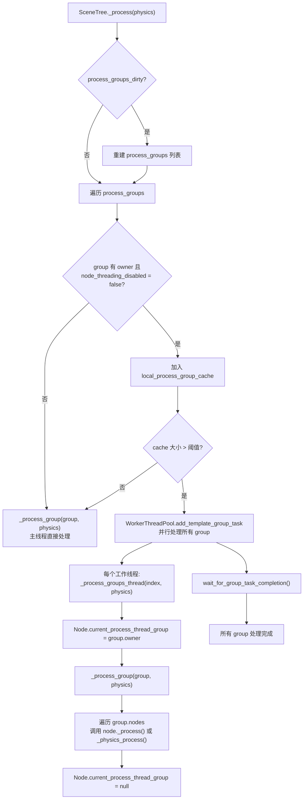

### 7.2 ProcessGroup 线程安全

```
ProcessGroup 并行处理的前提条件:
1. Node 设置了 process_thread_group 属性 (owner != null)
2. node_threading_disabled == false (全局开关)
3. 同一 ProcessGroup 内的节点在同一个工作线程执行
4. 跨 ProcessGroup 的节点在不同工作线程执行
5. default_process_group 始终在主线程执行
6. call_queue 用于跨 ProcessGroup 的延迟调用

限制:
- 同一 ProcessGroup 内仍是串行执行
- 不同 ProcessGroup 之间可并行
- GUI/Control 节点通常在 default_process_group（主线程）
- call_deferred() 通过 CallQueue 跨线程安全通信
```

## 8. 物理时间步进机制

### 8.1 MainTimerSync

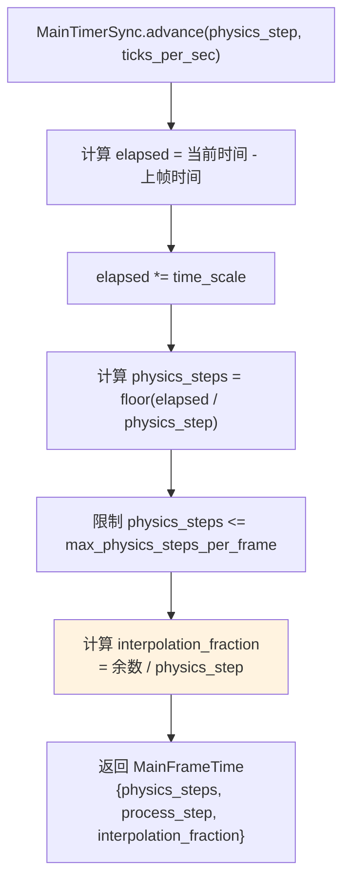

### 8.2 固定时间步 vs 变量时间步

```
物理步 (固定时间步):
  ├── physics_step = 1.0 / physics_ticks_per_second (默认 60 Hz)
  ├── 每帧可能执行 0-8 次物理步
  ├── 用于: PhysicsServer.step(), SceneTree._physics_process()
  └── delta 值恒定 = physics_step

帧步 (变量时间步):
  ├── process_step = 帧间隔时间
  ├── 每帧执行 1 次
  ├── 用于: SceneTree._process(), AnimationTree 更新, RenderingServer.draw()
  └── delta 值可变 = 实际帧时间
```

## 9. MessageQueue 跨线程通信

### 9.1 MessageQueue 工作机制

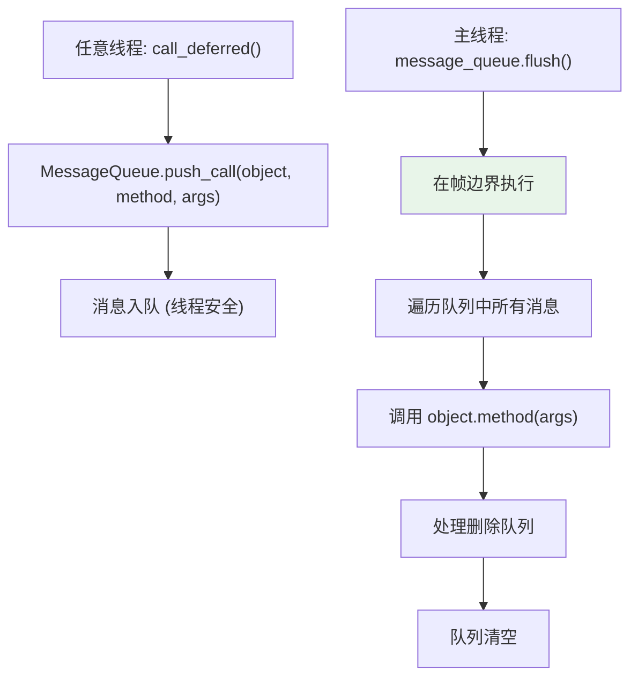

### 9.2 三种跨线程通信机制对比

| 机制 | 用途 | 线程安全 | 阻塞 | 使用场景 |
|------|------|---------|------|---------|
| **CommandQueueMT** | Server API 调用 | 是 | push_and_ret/ push_and_sync 阻塞，push 不阻塞 | 物理/渲染服务器线程通信 |
| **MessageQueue** | 通用延迟调用 | 是 | 否 | call_deferred(), 帧边界执行 |
| **CallQueue (ProcessGroup)** | 跨 ProcessGroup 通信 | 是 | 否 | ProcessGroup 内 call_deferred |

## 10. 与 UE 的线程模型对比

### 10.1 架构对比

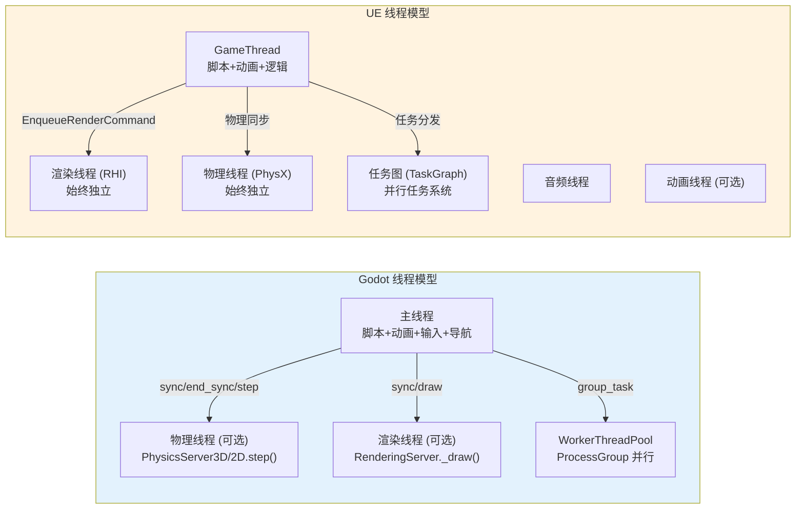

### 10.2 详细对比

| 维度 | Godot | UE |
|------|-------|-----|
| **渲染线程** | 可选（桌面默认开启） | 始终独立运行 |
| **物理线程** | 可选（桌面默认开启） | 始终独立运行（PhysX） |
| **动画线程** | 无（主线程串行） | 可选（动画评估可卸载） |
| **脚本线程** | 无（主线程串行） | 无（GameThread 串行） |
| **并行框架** | WorkerThreadPool + ProcessGroup | TaskGraph + ParallelFor |
| **同步方式** | CommandQueueMT push/sync | EnqueueRenderCommand + FRenderCommandFence |
| **帧同步粒度** | 粗粒度（sync/draw 两步） | 细粒度（Fence + 逐资源同步） |
| **跨线程通信** | CommandQueueMT + MessageQueue | TQueue + EnqueueRenderCommand |
| **音频** | AudioServer 内部线程 | 独立音频线程 |
| **网络** | 主线程 | 主线程 + 可选 IO 线程 |
| **资源加载** | 主线程 + WorkerThreadPool | 异步加载线程池 |

## 11. Godot 线程模型的关键限制

### 11.1 动画在主线程

```
问题:
  AnimationTree 在 SceneTree._process() 中更新
  → 复杂骨骼动画占用主线程时间
  → 无法与渲染/物理并行

UE 对比:
  动画评估可在工作线程执行（通过 TaskGraph）
  动画驱动的 Root Motion 通过 FAnimTickFunction 调度

影响:
  角色密集场景（如 100+ 带 AnimationTree 的角色）
  动画更新成为主线程瓶颈
```

### 11.2 脚本无并行

```
问题:
  GDScript / C# _process() 和 _physics_process() 均在主线程
  ProcessGroup 并行仅限不同 group 之间
  同一 group 内的节点仍串行执行

UE 对比:
  UE 的 GameThread 也是串行执行脚本
  但 UE 有更完善的多线程任务系统
  可在 C++ 中创建异步任务

影响:
  脚本密集型游戏（如策略游戏、大量 AI）
  主线程成为瓶颈
```

### 11.3 渲染同步粒度粗

```
问题:
  RenderingServer.sync() 等待整个上一帧渲染完成
  没有逐资源/逐 Pass 的细粒度同步
  主线程在 sync() 处阻塞等待

UE 对比:
  UE 使用 FRenderCommandFence 细粒度同步
  可以逐资源检查是否可安全修改
  渲染线程始终运行，不等主线程

影响:
  主线程在 sync() 处可能卡顿
  特别是 GPU 密集场景
```

### 11.4 缺失的功能

| 功能 | 说明 | 严重度 |
|------|------|--------|
| **动画并行评估** | AnimationTree 无法在工作线程执行 | 🟡 中等 |
| **细粒度渲染同步** | 无 Fence/信号量机制，sync 粒度粗 | 🟡 中等 |
| **异步资源流式加载** | 无后台线程资源流式加载 | 🟡 中等 |
| **任务图系统** | 无依赖关系的任务调度图 | 🔴 严重 |
| **帧间流水线** | 无多帧流水线（主线程和渲染线程无法真正重叠） | 🟡 中等 |

## 12. 关键源码索引

| 类别 | 路径 |
|------|------|
| 主循环入口 | `main/main.cpp` (Main::iteration, L4835-L5060) |
| MainLoop 接口 | `core/os/main_loop.h` |
| SceneTree | `scene/main/scene_tree.h` / `scene_tree.cpp` |
| ProcessGroup | `scene/main/scene_tree.h` (L96-L105) |
| PhysicsServer3DWrapMT | `servers/physics_3d/physics_server_3d_wrap_mt.h` / `.cpp` |
| PhysicsServer2DWrapMT | `servers/physics_2d/physics_server_2d_wrap_mt.h` / `.cpp` |
| RenderingServerDefault | `servers/rendering/rendering_server_default.h` / `.cpp` |
| CommandQueueMT | `core/templates/command_queue_mt.h` / `.cpp` |
| ServerWrapMT 宏 | `servers/server_wrap_mt_common.h` |
| WorkerThreadPool | `core/object/worker_thread_pool.h` / `.cpp` |
| MessageQueue | `core/object/message_queue.h` / `.cpp` |
| MainTimerSync | `core/os/main_timer_sync.h` / `.cpp` |
