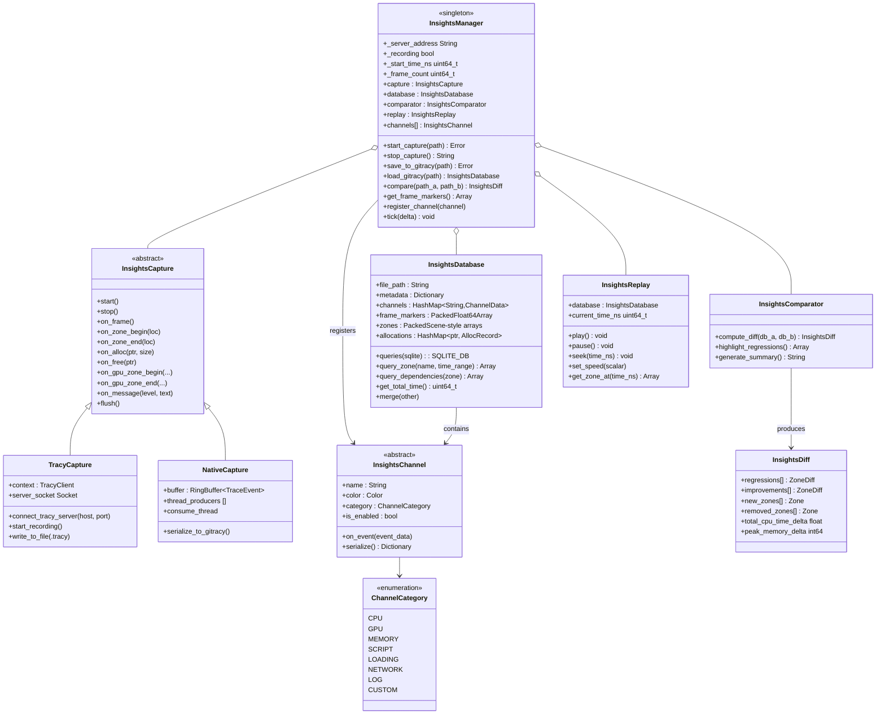
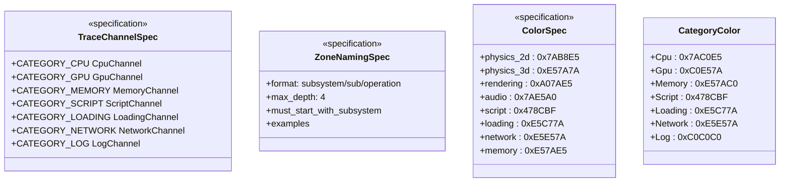
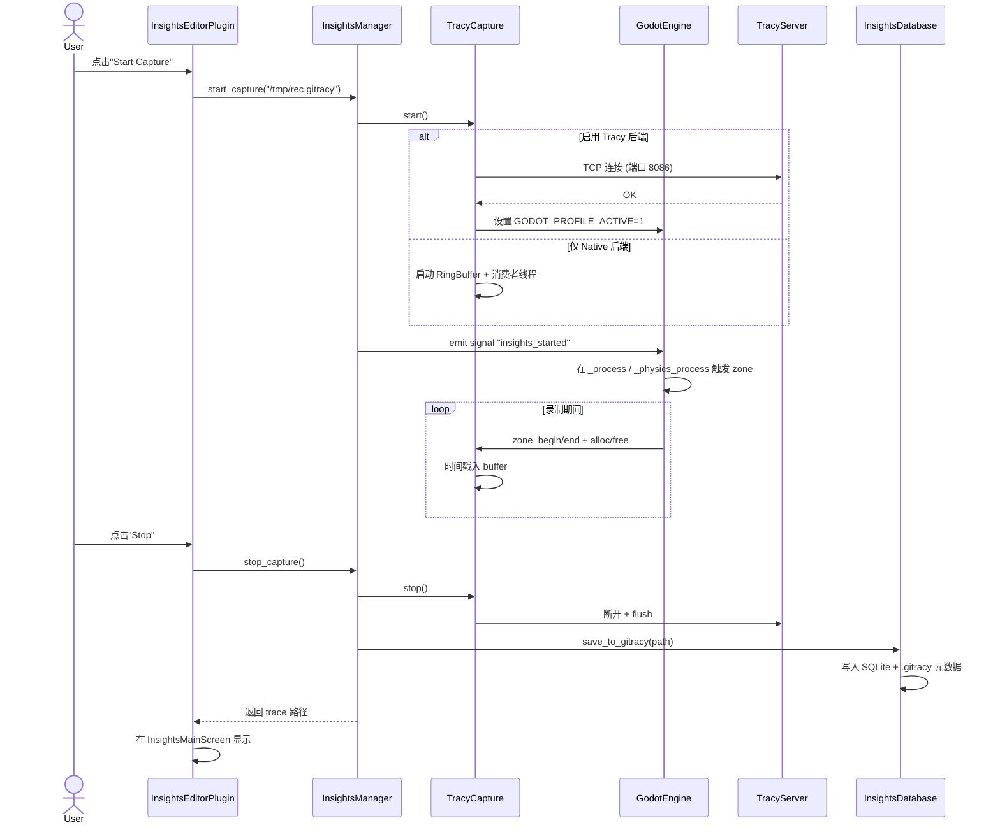
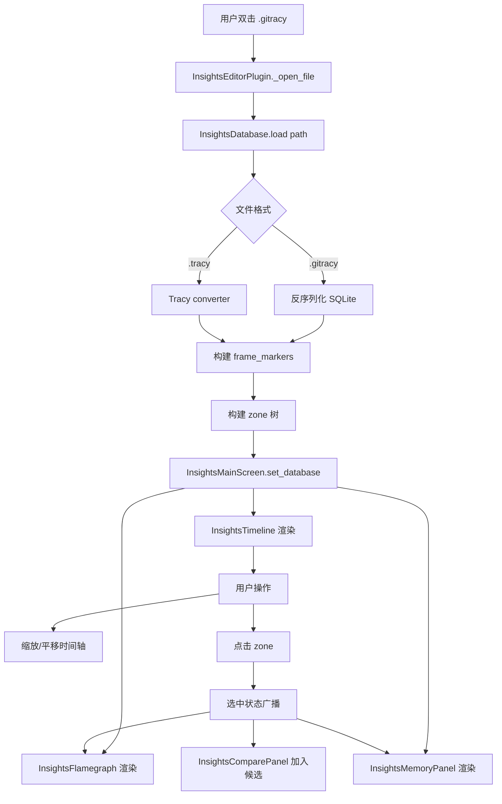
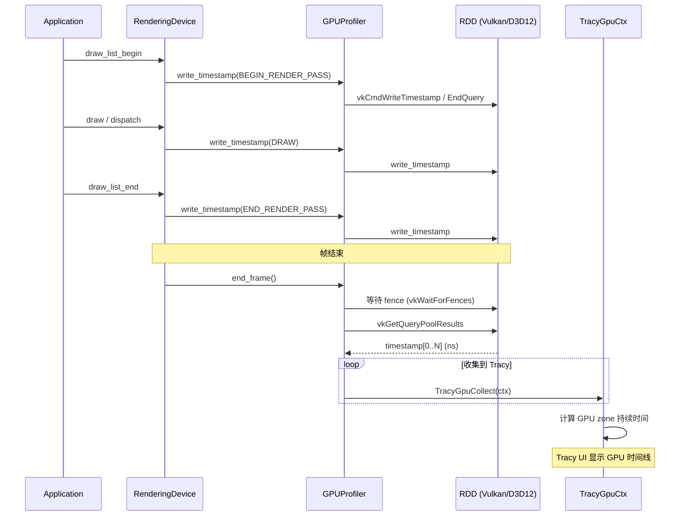
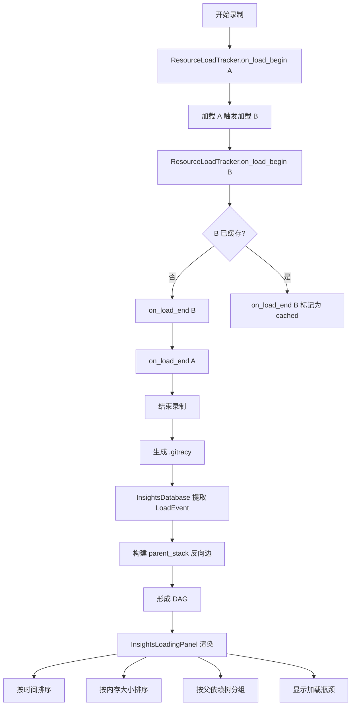
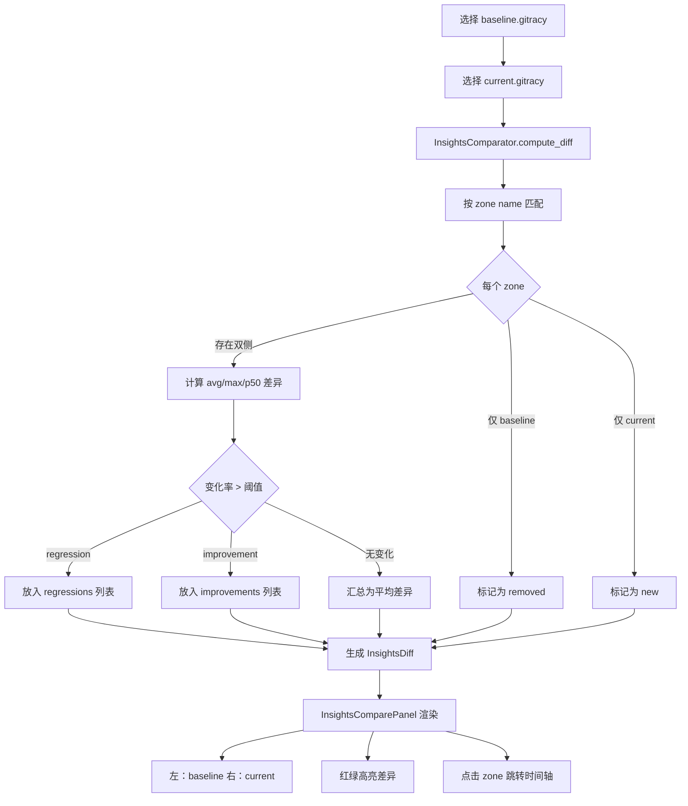

# Godot Insights — Tracy 增强型性能录制工具设计方案

## 1. 背景与目标

### 1.1 调研结论

Godot 已内置 Tracy 集成（`core/profiling/profiling.h`），覆盖：

- **客户端宏**：`GodotProfileZone` / `GodotProfileZoneGrouped` / `GodotProfileZoneScript` / `GodotProfileFrameMark` / `GodotProfileAlloc`
- **插桩点**：约 80 个（`main.cpp` 30 个、`rendering_server_default.cpp` 15 个、`rendering_device.cpp` 19 个、`gdscript_vm.cpp` 10 个、`memory.cpp` 4 个）
- **字符串驻留池**：基于 `StringName` + `HashMap<StringName, SourceLocationData>`，避免 GDScript Zone 重复分配
- **平台层支持**：Windows / macOS / iOS / Android / Linux / Web / VisionOS 全部 `godot_init_profiler()` / `FrameMark` 已就位
- **可选 callstack**：`TRACY_CALLSTACK=62` 支持
- **可选内存追踪**：`GODOT_PROFILER_TRACK_MEMORY` + `TracyAlloc`/`TracyFree`

### 1.2 设计目标

打造 **Godot Insights** —— 一个对标 Unreal Insights 的内置性能录制工具，提供：

1. **CPU / GPU / 内存 / 脚本 / 网络 / 资源** 多通道录制
2. **统一 Trace Channel 命名规范**，按子系统自动归类
3. **Editor 内嵌可视化**（时间轴、火焰图、内存图、网络图、加载图）
4. **GPU Profiling 桥接**（Vulkan/D3D12/Metal 时间戳）
5. **录制/回放/对比**工作流
6. **C# / GDScript 多语言脚本插桩**
7. **`.gitracy` 自定义 trace 格式** + Tracy 原生 `.tracy` 兼容
8. **零性能损耗**（运行时 `GODOT_USE_TRACY` 不开时不增加任何运行时开销）

## 2. 总体架构

### 2.1 分层架构

```
┌────────────────────────────────────────────────────────────────┐
│  Layer 5: Editor UI (Godot Insights Panel)                    │
│  - TimeLine / Flame / Memory / Net / Loading / GPU / Compare  │
├────────────────────────────────────────────────────────────────┤
│  Layer 4: Insights Core (services/insights/)                  │
│  - InsightsManager 录制/回放/对比协调器                        │
│  - InsightsDatabase  .gitracy 存储                             │
│  - InsightsCapture  Tracy capture 包装                          │
│  - InsightsChannel  Channel/Color/Fiber 映射                   │
├────────────────────────────────────────────────────────────────┤
│  Layer 3: Trace Channel + 宏扩展 (core/profiling/insights.h)   │
│  - GodotProfileZoneC(category, name)                            │
│  - GodotProfileZoneScript 扩展 (C#/GDScript VM)                │
│  - GPU 时间戳宏                                                 │
│  - 资源加载追踪宏                                                │
├────────────────────────────────────────────────────────────────┤
│  Layer 2: 已有集成 (core/profiling/profiling.h)                 │
│  - GodotProfileZone / Alloc / Free / FrameMark                  │
│  - intern_source_location                                      │
├────────────────────────────────────────────────────────────────┤
│  Layer 1: Tracy 客户端 + GPU 驱动补丁                          │
│  - TracyClient.cpp                                              │
│  - RD GPU context: Vulkan/D3D12/Metal                          │
├────────────────────────────────────────────────────────────────┤
│  Layer 0: Tracy Server (开源独立进程)                          │
│  - 原生 .tracy 可视化                                            │
└────────────────────────────────────────────────────────────────┘
```

### 2.2 核心模块划分

```
modules/insights/                 # 新增 GDExtension 模块
├── core/
│   ├── insights_manager.h/cpp          # 全局协调器（单例）
│   ├── insights_capture.h/cpp          # Capture 录制抽象
│   ├── insights_database.h/cpp         # .gitracy 存储（基于 SQLite）
│   ├── insights_channel.h/cpp          # Channel 枚举与元数据
│   ├── insights_comparator.h/cpp       # Diff 算法
│   └── insights_replay.h/cpp           # 回放引擎
├── channels/
│   ├── cpu_channel.h/cpp               # CPU trace
│   ├── gpu_channel.h/cpp               # GPU trace（封装 TracyGpuCtx）
│   ├── memory_channel.h/cpp            # 内存分配/释放追踪
│   ├── script_channel.h/cpp            # GDScript/C# 插桩
│   ├── loading_channel.h/cpp           # 资源加载
│   ├── network_channel.h/cpp           # 多人/网络
│   └── log_channel.h/cpp               # 错误/警告汇聚
├── gpu/
│   ├── gpu_profiler_vulkan.h/cpp       # Vulkan 时间戳
│   ├── gpu_profiler_d3d12.h/cpp        # D3D12 时间戳
│   ├── gpu_profiler_metal.h/cpp        # Metal 时间戳
│   └── gpu_timestamp_query.h           # RDD 抽象接口
├── editor/
│   ├── insights_editor_plugin.h/cpp    # EditorPlugin 入口
│   ├── insights_dock.h/cpp             # 主面板（BottomPanel）
│   ├── timeline_view.h/cpp             # CPU+GPU 时间轴
│   ├── flamegraph_view.h/cpp           # 火焰图
│   ├── memory_view.h/cpp               # 内存分配瀑布
│   ├── loading_view.h/cpp              # 资源加载依赖图
│   ├── network_view.h/cpp              # RPC/包流量
│   ├── gpu_view.h/cpp                  # GPU 命令时间
│   ├── compare_view.h/cpp              # 双 trace 对比
│   └── frame_marker_view.h/cpp         # 帧时间散点
├── tools/
│   ├── launch_with_insights.h/cpp      # 启动带 Tracy 的游戏
│   ├── tracy_convert.h/cpp             # .gitracy ↔ .tracy
│   └── insights_cli.h/cpp              # 命令行工具
└── register_types.h/cpp
```

```
editor/insights/                  # 编辑器内嵌 UI
├── insights_editor_plugin.h/cpp       # EditorPlugin 主类
├── insights_main_screen.h/cpp         # 主屏幕切换
├── insights_timeline.h/cpp            # 时间轴控件（自绘）
├── insights_flamegraph.h/cpp          # 火焰图控件
├── insights_memory_panel.h/cpp        # 内存面板
├── insights_loading_panel.h/cpp       # 加载面板
├── insights_compare_panel.h/cpp       # 对比面板
├── insights_filters.h/cpp             # 过滤器 UI
└── insights_theme.h/cpp               # 主题
```

## 3. 详细类图

### 3.1 Core 服务层



### 3.2 Channel 体系


### 3.3 编辑器 UI 层


### 3.4 Trace Channel 命名规范



## 4. 关键子系统设计

### 4.1 扩展宏系统

**位置**：`core/profiling/insights.h`

```cpp
// 通道化 Zone 宏（新增）
#define GodotProfileZoneC(category, name) \
    GodotProfileZoneImpl(category, name, __FILE__, __LINE__, __FUNCTION__)

// 层级化 Zone（自动用 / 分隔）
#define GodotProfileZoneH(subsystem, op1, op2) \
    GodotProfileZoneC(subsystem, "godot:" subsystem "/" op1 "/" op2)

// 异步任务追踪
#define GodotProfileFiber(name) \
    GodotProfileFiberImpl(name)

// 资源加载追踪（自动加入 Loading Channel）
#define GodotProfileResourceLoad(path) \
    GodotProfileZoneC(LoadingChannel::CAT_LOADING, "godot:loading/" path)

// GPU 阶段
#define GodotProfileGpuStage(name) \
    GodotProfileGpuStageImpl(name)

// 计数器
#define GodotProfilePlot(name, value) \
    GodotProfilePlotImpl(name, value)

// 自定义消息
#define GodotProfileMessage(text) \
    GodotProfileMessageImpl(text)
```

### 4.2 Trace Channel 体系

**统一命名规范**（UE Insights 风格）：

| Channel | Color | 命名规则 | 示例 |
|---------|-------|---------|------|
| **CPU/Main** | `#7AC0E5` | `godot:main/<sub>` | `godot:main/iteration`, `godot:main/process` |
| **CPU/Physics 2D** | `#7AB8E5` | `godot:physics/2d/<op>` | `godot:physics/2d/step`, `godot:physics/2d/broadphase` |
| **CPU/Physics 3D** | `#E57A7A` | `godot:physics/3d/<op>` | `godot:physics/3d/step` |
| **CPU/Rendering** | `#A07AE5` | `godot:rendering/<op>` | `godot:rendering/shader/compile` |
| **CPU/Audio** | `#7AE5A0` | `godot:audio/<op>` | `godot:audio/mix`, `godot:audio/bus` |
| **CPU/Script** | `#478CBF` | `godot:script/<op>` | `godot:script/gdscript/call` |
| **CPU/Loading** | `#E5C77A` | `godot:loading/<op>` | `godot:loading/resource/load` |
| **CPU/Network** | `#E5E57A` | `godot:network/<op>` | `godot:network/rpc/send` |
| **GPU/Command** | `#C0E57A` | `godot:gpu/command/<op>` | `godot:gpu/command/draw` |
| **GPU/Compute** | `#7AE5C0` | `godot:gpu/compute/<op>` | `godot:gpu/compute/dispatch` |
| **Memory** | `#E57AC0` | `godot:mem/<op>` | `godot:mem/alloc`, `godot:mem/free` |

### 4.3 GPU Profiling 桥接

**位置**：`modules/insights/gpu/gpu_profiler_*.h`

```cpp
// modules/insights/gpu/gpu_timestamp_query.h
class GPUTimestampQuery {
public:
    enum class Stage {
        BEGIN_RENDER_PASS,
        END_RENDER_PASS,
        DRAW,
        DISPATCH,
        PIPELINE_BARRIER,
        COPY,
        PRESENT
    };

    virtual uint32_t write_timestamp(CommandBufferID p_cmd, Stage p_stage) = 0;
    virtual bool fetch_results(uint64_t *p_times_ns, uint32_t p_count) = 0;
    virtual void collect_to_tracy(TracyGpuContext *p_ctx) = 0;
};

// modules/insights/gpu/gpu_profiler_vulkan.h
class GPUProfilerVulkan : public GPUTimestampQuery {
    VkQueryPool timestamp_pool;
    uint32_t query_index = 0;
    const uint32_t max_queries = 256;

    void begin_frame(CommandBufferID p_cmd) override {
        vkCmdResetQueryPool(cmd, timestamp_pool, query_index, max_queries - query_index);
    }

    uint32_t write_timestamp(CommandBufferID p_cmd, Stage p_stage) override {
        VkPipelineStageFlagBits stage = map_stage(p_stage);
        vkCmdWriteTimestamp(cmd, stage, timestamp_pool, query_index);
        return query_index++;
    }

    void end_frame() override {
        // 等待 fence → 读回 → 上报 Tracy
        vkGetQueryPoolResults(...);
        for (uint32_t i = 0; i < query_count; i++) {
            TracyGpuZoneContext ctx;
            ctx.gpu_time = results[i] * timestamp_period;
            TracyGpuCollect(ctx);
        }
    }
};
```

**集成到 RenderingDevice**：

```cpp
// servers/rendering/rendering_device.cpp (新增)
#include "modules/insights/gpu/gpu_timestamp_query.h"

void RenderingDevice::_end_frame() {
    GPUTimestampQuery *ts = insights_get_gpu_query();
    if (ts) {
        ts->end_frame();
    }
    GodotProfileFrameMark;
    // ...existing code
}
```

### 4.4 资源加载追踪增强

**位置**：`core/io/resource_loader.cpp`（增强现有 `load_paths_stack`）

```cpp
// 资源加载追踪
class ResourceLoadTracker {
    struct LoadEvent {
        String path;
        uint64_t start_ns;
        uint64_t end_ns;
        size_t memory_size;
        String source_loader;       // 哪个 importer
        Vector<String> parent_stack; // 调用栈
        uint64_t thread_id;
        Ref<Resource> result;
    };
    List<LoadEvent> events;
    HashMap<String, LoadEvent *> active_loads;

public:
    void on_load_begin(const String &p_path, const String &p_loader);
    void on_load_end(const String &p_path, Ref<Resource> p_res, size_t p_size);
    void on_load_fail(const String &p_path, const String &p_error);
    Vector<LoadEvent> get_events_in_range(uint64_t t0, uint64_t t1) const;
};

// 在 ResourceLoader::_load 中接入
Ref<Resource> ResourceLoader::_load(const String &p_path, ...) {
    GodotProfileZoneH("loading", "resource", "load");
    uint64_t t0 = OS::get_singleton()->get_ticks_usec() * 1000;
    ResourceLoadTracker::get_singleton()->on_load_begin(p_path, "...");

    // ...existing loading code

    ResourceLoadTracker::get_singleton()->on_load_end(p_path, res, res_size);
    return res;
}
```

### 4.5 C# / GDScript 桥接

**GDScript VM 增强**（`modules/gdscript/gdscript_vm.cpp`）：

```cpp
// 已有：GodotProfileZoneScript
// 新增：C# 等价物
#ifdef MODULE_MONO_ENABLED
// modules/mono/glue/GodotSharpProfiler.cs
[ThreadStatic]
private static int callDepth;

public static void EnterFunction(string name, string file, int line) {
    if (InsightsManager.IsActive) {
        MonoProfilerBridge.EnterZone(name, file, line);
    }
}

public static void LeaveFunction() {
    if (InsightsManager.IsActive) {
        MonoProfilerBridge.LeaveZone();
    }
}
#endif
```

## 5. 详细流程图

### 5.1 录制启动流程



### 5.2 编辑器加载 trace 流程



### 5.3 GPU 时间戳采集流程



### 5.4 资源加载依赖图生成流程



### 5.5 Trace 对比（Diff）流程



## 6. 关键子系统设计方案

### 6.1 插桩点扩展（200-400 个新增）

按照调研清单：

| 子系统 | 涉及文件 | 计划新增 zone 数 | 优先级 |
|--------|----------|------------------|--------|
| **Physics 2D** | `servers/physics_2d/godot_body_pair_2d.cpp`, `godot_step_2d.cpp`, `godot_world_2d.cpp` 等 8 文件 | ~40 | P0 |
| **Physics 3D** | `servers/physics_3d/godot_body_pair_3d.cpp`, `godot_step_3d.cpp`, `godot_world_3d.cpp` 等 10 文件 | ~50 | P0 |
| **Audio Server** | `servers/audio/audio_server.cpp`, `audio_stream.cpp`, `audio_driver.cpp` 等 6 文件 | ~30 | P1 |
| **Navigation** | `servers/navigation_server_2d/3d.cpp`, `nav_map.cpp`, `nav_agent.cpp` 等 8 文件 | ~40 | P1 |
| **Scene Tree** | `scene/main/scene_tree.cpp` (1→25), `node.cpp`, `viewport.cpp` | ~30 | P0 |
| **Resource Loader** | `core/io/resource_loader.cpp` | ~20 | P0 |
| **Rendering Substage** | `servers/rendering/renderer_rd/`, `forward_clustered/`, `forward_mobile/` 等 20 文件 | ~80 | P0 |
| **Object Lifecycle** | `core/object/object.cpp`, `object.h` | ~15 | P1 |
| **Networking** | `modules/multiplayer/`, `core/io/multiplayer_api.cpp` | ~20 | P1 |
| **C# / Mono** | `modules/mono/glue/`, `mono_gd.cpp` | ~25 | P1 |
| **总新增** | | **~350** | |

### 6.2 Editor 嵌入 UI

**主入口**：`InsightsEditorPlugin` 注册到主屏幕 + 底部面板

```cpp
void InsightsEditorPlugin::_enter_tree() {
    if (EditorNode::get_singleton()) {
        // 1. 注册主屏幕
        EditorNode::get_singleton()->add_main_screen("Insights", main_screen);

        // 2. 注册底部面板
        bottom_dock = memnew(InsightsDock);
        EditorNode::get_bottom_panel()->add_item("Insights", bottom_dock);

        // 3. 注册到主菜单
        add_menu_item("Project/Tools/Insights/Start Capture", callable_mp(this, &InsightsEditorPlugin::_start_capture));
        add_menu_item("Project/Tools/Insights/Open Trace...", callable_mp(this, &InsightsEditorPlugin::_open_trace));
        add_menu_item("Project/Tools/Insights/Compare Traces...", callable_mp(this, &InsightsEditorPlugin::_compare_traces));
    }
}
```

**InsightsDock 布局**（BottomPanel）：

```
+--------------------------------------------------------------------+
|  [▶ Start] [⏹ Stop] [📁 Open] [⚖ Compare]  [🗑 Clear]   [🔧 Settings]|
+--------------------------------------------------------------------+
|  [CPU] [GPU] [Memory] [Loading] [Network] [Log] [Compare]         |
+--------------------------------------------------------------------+
|  [▶ Play] [⏸ Pause] [⏹] [Scale: 1x] [Time: 0:00.000 / 0:10.000] |
+--------------------------------------------------------------------+
|  [Timeline 自绘 Canvas]                                            |
|  CPU:  ████ ████ ████ ████                                         |
|  GPU:       ████ ████                                               |
|  Net:  ████ ████ ████ ████                                         |
|  Load:        ████ ████                                             |
+--------------------------------------------------------------------+
|  [Flamegraph / 内存瀑布 / 依赖树]                                  |
+--------------------------------------------------------------------+
```

### 6.3 启动带 Tracy 的游戏

`launch_with_insights` 工具：

```cpp
// editor/insights/launch_with_insights.cpp
Error InsightsLauncher::launch_with_insights(String project_path, int port) {
    // 1. 编译项目（如需要）使用 GODOT_USE_TRACY + profiler_track_memory
    String tracy_flags = String("profiler=tracy profiler_track_memory=yes "
        "profiler_sample_callstack=yes module_insights_enabled=yes "
        "tracy_port=" + String::num_int64(port));
    build_project(project_path, tracy_flags);

    // 2. 启动游戏进程
    String exec_path = project_path + "/bin/game_tracy.exe";
    ProcessId pid = OS::execute(exec_path, {"--headless", "--tracy-connect=localhost:" + String::num_int64(port)});

    // 3. 自动连接 InsightsManager
    InsightsManager::get_singleton()->connect_to_remote("localhost", port);
    return OK;
}
```

### 6.4 .gitracy 文件格式

**双层设计**：
- **Metadata**（JSON/TOML）：记录项目、引擎版本、捕获时间、配置
- **Events**（SQLite 数据库）：zone / alloc / frame 等数据

```toml
# .gitracy metadata
[meta]
version = "1.0"
godot_version = "4.6-dev"
project_name = "MyGame"
project_path = "res://"
capture_start = "2025-06-08T14:32:01Z"
capture_duration_ns = 10000000000
executable = "build/game_tracy.exe"
tracy_compatible = true

[channels]
cpu = { enabled = true, color = "#7AC0E5" }
gpu = { enabled = true, color = "#C0E57A", backend = "vulkan" }
memory = { enabled = true, track_leaks = true }
script = { enabled = true, sample_gdscript = true, sample_csharp = true }
loading = { enabled = true }
network = { enabled = false }
log = { enabled = true, severity_threshold = "WARNING" }

[settings]
tracy_port = 8086
sample_callstack = true
callstack_depth = 62
```

**SQLite Schema**（节选）：

```sql
CREATE TABLE zones (
    id INTEGER PRIMARY KEY,
    name TEXT NOT NULL,
    file TEXT,
    function TEXT,
    line INTEGER,
    channel TEXT,
    thread_id INTEGER,
    start_ns INTEGER NOT NULL,
    end_ns INTEGER,
    depth INTEGER,
    parent_zone_id INTEGER,
    FOREIGN KEY (parent_zone_id) REFERENCES zones(id)
);
CREATE INDEX idx_zones_name ON zones(name);
CREATE INDEX idx_zones_thread ON zones(thread_id);
CREATE INDEX idx_zones_start ON zones(start_ns);

CREATE TABLE gpu_zones (
    id INTEGER PRIMARY KEY,
    name TEXT,
    queue_id INTEGER,
    submit_ns INTEGER,
    start_ns INTEGER,
    end_ns INTEGER,
    context_id INTEGER
);

CREATE TABLE allocations (
    ptr INTEGER PRIMARY KEY,
    size INTEGER NOT NULL,
    site_zone_id INTEGER,
    alloc_ns INTEGER,
    free_ns INTEGER,
    thread_id INTEGER,
    callstack BLOB
);

CREATE TABLE frame_markers (
    frame_index INTEGER PRIMARY KEY,
    start_ns INTEGER,
    end_ns INTEGER
);

CREATE TABLE resource_loads (
    id INTEGER PRIMARY KEY,
    path TEXT NOT NULL,
    loader TEXT,
    start_ns INTEGER,
    end_ns INTEGER,
    size_bytes INTEGER,
    parent_path TEXT,
    thread_id INTEGER,
    callstack BLOB
);

CREATE TABLE messages (
    id INTEGER PRIMARY KEY,
    level INTEGER,  -- 0=Verbose 1=Debug 2=Info 3=Warn 4=Error
    text TEXT,
    timestamp_ns INTEGER,
    zone_id INTEGER,
    callstack BLOB
);
```

### 6.5 性能优化

| 优化点 | 措施 |
|--------|------|
| 零开销 stub | `GODOT_USE_TRACY` 未定义时所有宏为 0 指令 |
| 字符串驻留 | GDScript zone 用 `intern_source_location`，避免重复分配 |
| 异步 RingBuffer | Native 后端用 `SPSCQueue<Event>` 跨线程通信 |
| 批量 flush | 每帧提交 Tracy 一次（非每次 zone） |
| 选择性启用 | Editor 中可通过 Project Settings 关闭不需要的 channel |
| 大小限制 | 录制达到 1 GB 自动停止并提示保存 |
| 帧采样 | 可配置 `frame_sample_rate`（如每 5 帧采样一次） |

## 7. 实施路线图

### Phase 1：基础设施（4-6 周）

- [x] 调研 Tracy 集成（已完成）
- [ ] **新模块骨架**：`modules/insights/`，注册 GDExtension
- [ ] **宏扩展**：`core/profiling/insights.h`
- [ ] **Channel 体系**：`insights_channel.h` + 命名规范
- [ ] **InsightsManager 单例**：start/stop/save/load 基础流程

### Phase 2：录制核心（6-8 周）

- [ ] **CPU Zone 扩桩**：按 §6.1 表补全 350+ zone
- [ ] **GDScript VM 增强**：跨函数追踪、GC 事件
- [ ] **资源加载追踪**：扩展 `load_paths_stack`
- [ ] **Memory Channel**：包裹 `Memory::alloc_static` + `free_static`
- [ ] **Log Channel**：拦截 `OS::print_error`

### Phase 3：GPU Profiling（4-6 周）

- [ ] **RDD 时间戳抽象**：`RenderingDeviceDriver` 新增 `write_timestamp` 接口
- [ ] **Vulkan 后端**：`vkCmdWriteTimestamp`
- [ ] **D3D12 后端**：`ID3D12GraphicsCommandList::EndQuery`
- [ ] **Metal 后端**：`MTLCommandBuffer.gpuStartTime/EndTime`
- [ ] **GPU 收集回调**：`TracyGpuCollect` 包装

### Phase 4：编辑器 UI（6-8 周）

- [ ] **InsightsEditorPlugin** 注册
- [ ] **InsightsTimeline** 自绘时间轴
- [ ] **InsightsFlamegraph** 火焰图控件
- [ ] **InsightsMemoryPanel** 内存瀑布
- [ ] **InsightsLoadingPanel** 资源依赖图
- [ ] **InsightsNetworkPanel** 网络流量
- [ ] **InsightsComparePanel** Diff 视图

### Phase 5：脚本/C# 与录制工作流（4-6 周）

- [ ] **C# Mono 插桩**：`GodotSharpProfiler.cs`
- [ ] **GDScript 注释 API**：`@profiler_zone` 装饰器
- [ ] **启动带 Tracy 工具**：`launch_with_insights`
- [ ] **`.gitracy` ↔ `.tracy` 转换器**
- [ ] **命令行 CLI**：`godot --insights-export`
- [ ] **CI 集成**：`insights-cli compare baseline.tracy pr.tracy --threshold 0.1`

### Phase 6：增强（持续）

- [ ] **AI 辅助分析**：LLM 解释 flame graph + 建议
- [ ] **Locks & Contention 视图**：识别锁竞争
- [ ] **Custom Channel API**：让用户/GDExtension 插入自定义 zone
- [ ] **Web 导出**：trace → HTML 报告
- [ ] **Live Profiling**：实时 streaming 到编辑器

## 8. 关键技术风险与缓解

| 风险 | 影响 | 缓解 |
|------|------|------|
| **Tracy 协议升级** | 第三方工具兼容性 | 抽象 `InsightsCapture` 接口，支持切换后端 |
| **GPU 驱动差异** | Vulkan/D3D12/Metal 时间戳精度不同 | 统一通过 `GPUTimestampQuery` 抽象 |
| **GITRACY 大文件** | 长时间录制文件过大 | 配置 LZ4 压缩 + 分片存储 |
| **录制开销** | 影响被分析对象 | Tracy 客户端本就<5%，Native 后端无网络 |
| **跨平台兼容性** | 嵌入式平台无 Tracy 支持 | 用 Native 后端 + 自有 .gitracy |
| **GDExtension 依赖** | 旧版 Godot 不支持 | 4.4+ 强制要求，旧版回退到 Tracy 独立应用 |

## 9. 关键文件路径索引

| 模块 | 路径 |
|------|------|
| 现有 Tracy 集成 | `core/profiling/profiling.h`、`profiling.cpp` |
| 现有 Tracy 字符串驻留 | `core/profiling/profiling.cpp::intern_source_location` |
| 已有 Zone 宏 | `core/profiling/profiling.h:60-79` |
| 帧标记宏 | `core/profiling/profiling.h:60` (FrameMark) |
| 内存追踪宏 | `core/profiling/profiling.h:83-91` |
| Tracy C++ 客户端 | thirdparty/tracy/public/TracyClient.cpp（用户提供） |
| Tracy Server | thirdparty/tracy/csvexport/（独立 GUI） |
| RenderingDevice | `servers/rendering/rendering_device.cpp:6536+` |
| ResourceLoader | `core/io/resource_loader.cpp` |
| GDScript VM | `modules/gdscript/gdscript_vm.cpp` |
| EditorPlugin 基类 | `editor/plugins/editor_plugin.h` |
| BottomPanel 容器 | `editor/editor_node.cpp::get_bottom_panel()` |
| MainLoop | `core/os/main_loop.h` |

## 10. 与 Unreal Insights 的能力对比

| 能力 | UE Insights | Godot Insights（本方案） | 状态 |
|------|------------|--------------------------|------|
| **CPU 时间轴** | ✅ | ✅ | Phase 2 |
| **GPU 时间轴** | ✅ | ✅ | Phase 3 |
| **CPU/GPU 关联** | ✅ | ✅ | Phase 3 |
| **火焰图** | ✅ | ✅ | Phase 4 |
| **内存瀑布** | ✅ | ✅ | Phase 2-4 |
| **内存泄漏检测** | ✅ | ⚠️ 需增强 | Phase 2 |
| **加载依赖图** | ✅ | ✅ | Phase 2-4 |
| **网络流量** | ✅ | ⚠️ Mono 内置 | Phase 5 |
| **Locks & Contention** | ✅ | ⚠️ 需增强 | Phase 6 |
| **Trace 对比（Diff）** | ✅ | ✅ | Phase 4 |
| **回放** | ✅ | ✅ | Phase 4 |
| **AI 辅助** | ⚠️ 实验 | ⚠️ 实验 | Phase 6 |
| **Web 导出** | ✅ | ⚠️ | Phase 6 |
| **CI 集成** | ✅ | ✅ | Phase 5 |
| **编辑器内嵌** | ✅ | ✅ | Phase 4 |
| **跨平台后端** | Vulkan/D3D12/Metal | Vulkan/D3D12/Metal | Phase 3 |
| **第三方 trace 格式** | UtF/CSV/JSON | `.gitracy` + `.tracy` 兼容 | Phase 5 |

## 11. 总结

本方案基于 Godot **已有的 Tracy 基础设施**（80 个插桩点 + 完整平台支持），通过**新增 `modules/insights/` GDExtension 模块 + Editor 嵌入 UI**，实现对标 Unreal Insights 的完整性能录制工具。

**核心创新点**：
1. **零侵入扩展**：所有现有 Tracy 宏保持兼容，新增宏 `GodotProfileZoneC` / `GodotProfileZoneH` / `GodotProfileFiber` / `GodotProfilePlot`
2. **统一 Channel 命名**：通过字符串前缀（`godot:<channel>/<subsystem>/<op>`）实现自动分类
3. **GPU 时间戳桥接**：在 `RenderingDeviceDriver` 抽象层添加 `write_timestamp` 钩子，三大后端统一接入 Tracy GPU context
4. **资源加载追踪增强**：扩展 `load_paths_stack` 为完整的 LoadEvent 链，自动生成依赖图
5. **.gitracy 双层格式**：SQLite + TOML 元数据，既能用 SQLite 工具分析，又能转 `.tracy` 用 Tracy Server 可视化
6. **编辑器内嵌 UI**：仿 UE Insights 的 BottomPanel + MainScreen 双布局

**预计工作量**：1 名高级工程师 6-8 个月，4-6 名工程师 3-4 个月（含编辑器 UI 打磨）。

**最大价值**：从"看不到 → 看到 → 理解 → 优化"完整闭环，对调试 Godot 项目性能瓶颈、内存泄漏、加载卡顿等提供与 UE 相当的工具链。
