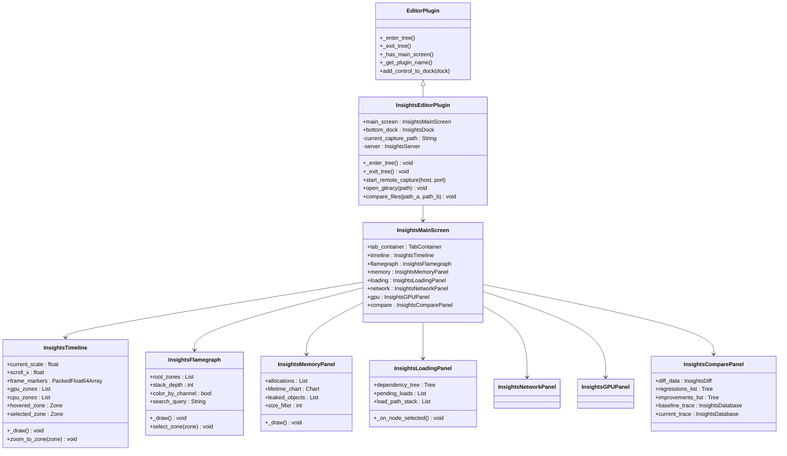
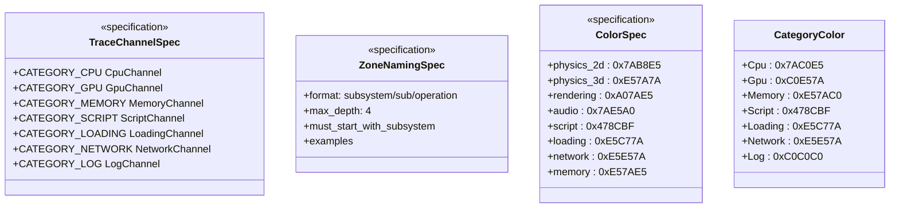
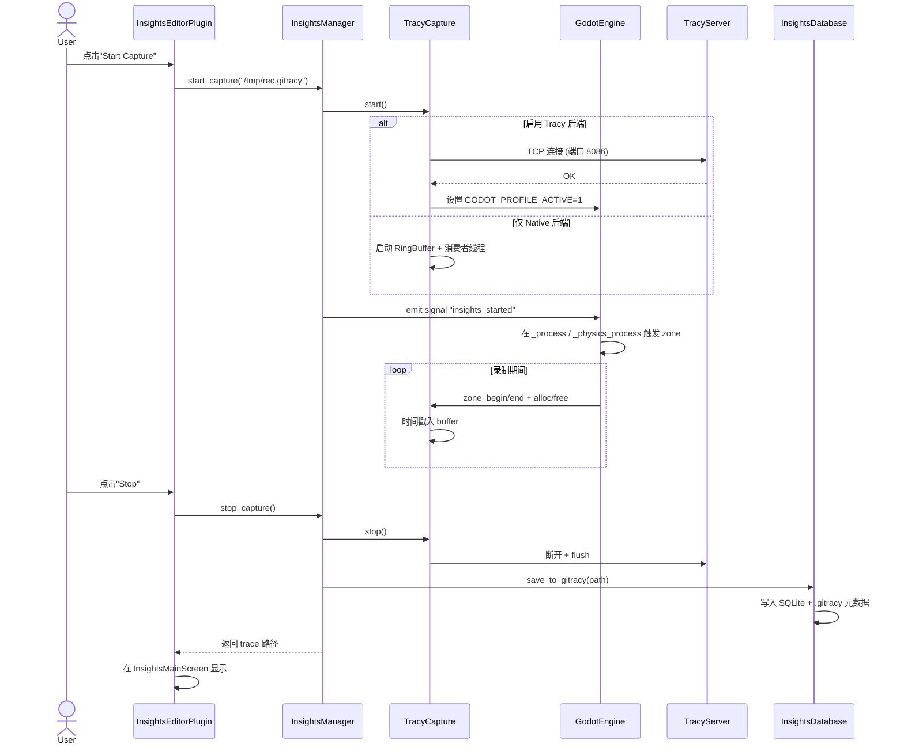
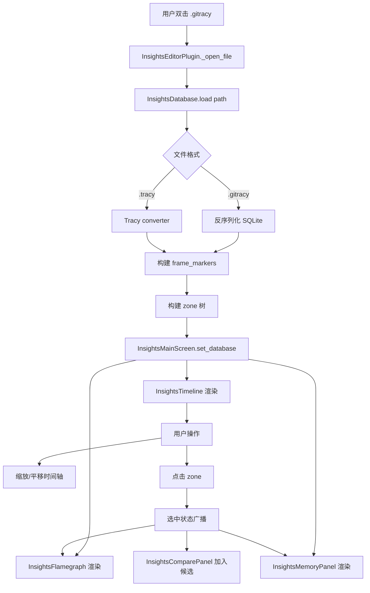
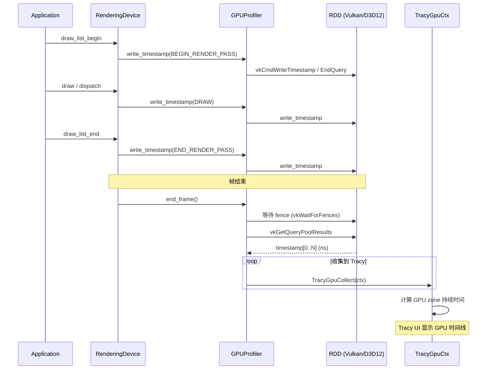
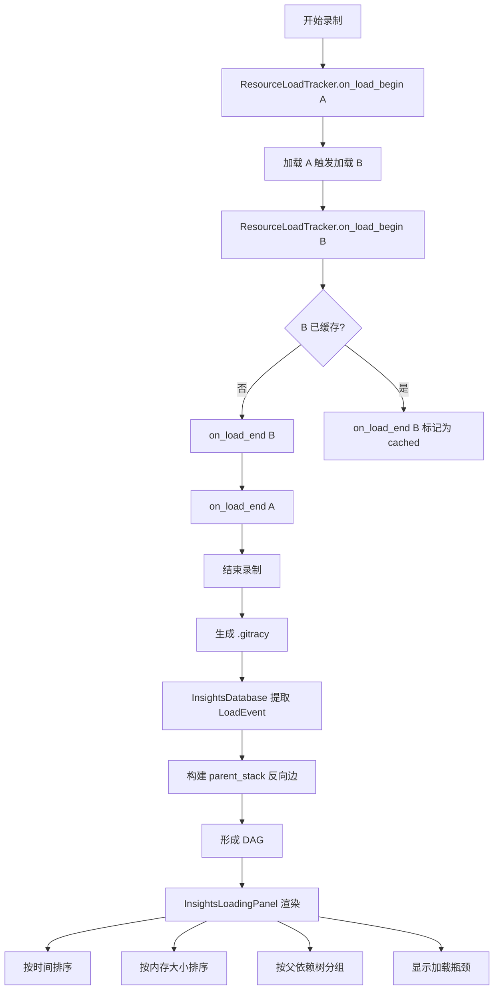
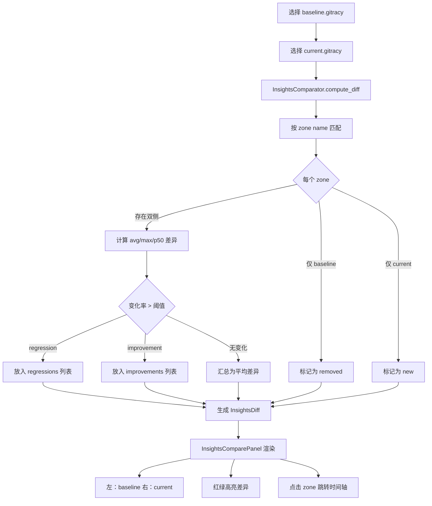
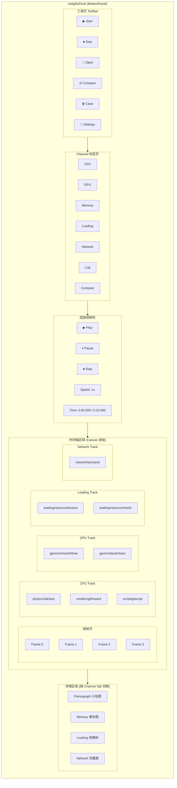
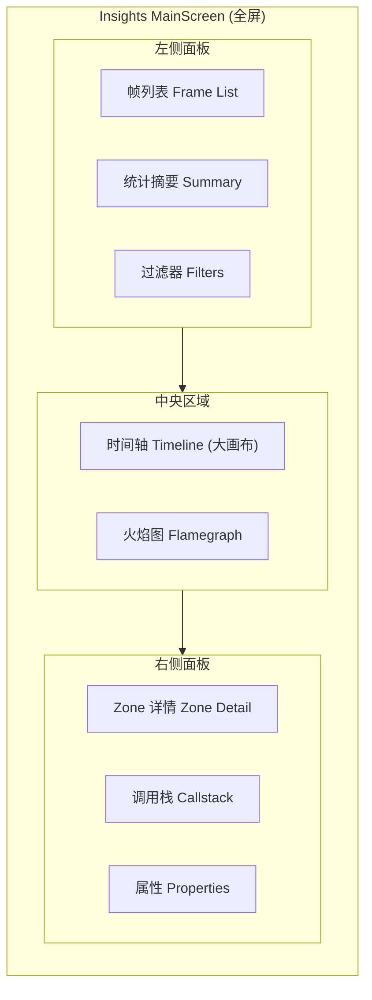

# Godot Insights — Tracy 增强型性能录制工具设计方案

## 1. 背景与目标

### 1.1 调研结论

Godot 已内置 Tracy 集成（`core/profiling/profiling.h`），覆盖：

- **客户端宏**：`GodotProfileZone` / `GodotProfileZoneGrouped` / `GodotProfileZoneScript` / `GodotProfileFrameMark` / `GodotProfileAlloc`
- **插桩点**：约 80 个（`main.cpp` 30 个、`rendering_server_default.cpp` 15 个、`rendering_device.cpp` 19 个、`gdscript_vm.cpp` 10 个、`memory.cpp` 4 个）
- **字符串驻留池**：基于 `StringName` + `HashMap<StringName, SourceLocationData>`，避免 GDScript Zone 重复分配
- **平台层支持**：Windows / macOS / iOS / Android / Linux / Web / VisionOS 全部 `godot_init_profiler()` / `FrameMark` 已就位
- **可选 callstack**：`TRACY_CALLSTACK=62` 支持
- **可选内存追踪**：`GODOT_PROFILER_TRACK_MEMORY` + `TracyAlloc`/`TracyFree`

### 1.2 设计目标

打造 **Godot Insights** —— 一个对标 Unreal Insights 的内置性能录制工具，提供：

1. **CPU / GPU / 内存 / 脚本 / 网络 / 资源** 多通道录制
2. **统一 Trace Channel 命名规范**，按子系统自动归类
3. **Editor 内嵌可视化**（时间轴、火焰图、内存图、网络图、加载图）
4. **GPU Profiling 桥接**（Vulkan/D3D12/Metal 时间戳）
5. **录制/回放/对比**工作流
6. **C# / GDScript 多语言脚本插桩**
7. **`.gitracy` 自定义 trace 格式** + Tracy 原生 `.tracy` 兼容
8. **零性能损耗**（运行时 `GODOT_USE_TRACY` 不开时不增加任何运行时开销）

## 2. 总体架构

### 2.1 分层架构

```
┌────────────────────────────────────────────────────────────────┐
│  Layer 5: Editor UI (Godot Insights Panel)                    │
│  - TimeLine / Flame / Memory / Net / Loading / GPU / Compare  │
├────────────────────────────────────────────────────────────────┤
│  Layer 4: Insights Core (services/insights/)                  │
│  - InsightsManager 录制/回放/对比协调器                        │
│  - InsightsDatabase  .gitracy 存储                             │
│  - InsightsCapture  Tracy capture 包装                          │
│  - InsightsChannel  Channel/Color/Fiber 映射                   │
├────────────────────────────────────────────────────────────────┤
│  Layer 3: Trace Channel + 宏扩展 (core/profiling/insights.h)   │
│  - GodotProfileZoneC(category, name)                            │
│  - GodotProfileZoneScript 扩展 (C#/GDScript VM)                │
│  - GPU 时间戳宏                                                 │
│  - 资源加载追踪宏                                                │
├────────────────────────────────────────────────────────────────┤
│  Layer 2: 已有集成 (core/profiling/profiling.h)                 │
│  - GodotProfileZone / Alloc / Free / FrameMark                  │
│  - intern_source_location                                      │
├────────────────────────────────────────────────────────────────┤
│  Layer 1: Tracy 客户端 + GPU 驱动补丁                          │
│  - TracyClient.cpp                                              │
│  - RD GPU context: Vulkan/D3D12/Metal                          │
├────────────────────────────────────────────────────────────────┤
│  Layer 0: Tracy Server (开源独立进程)                          │
│  - 原生 .tracy 可视化                                            │
└────────────────────────────────────────────────────────────────┘
```

### 2.2 核心模块划分

```
modules/insights/                 # 新增 GDExtension 模块
├── core/
│   ├── insights_manager.h/cpp          # 全局协调器（单例）
│   ├── insights_capture.h/cpp          # Capture 录制抽象
│   ├── insights_database.h/cpp         # .gitracy 存储（基于 SQLite）
│   ├── insights_channel.h/cpp          # Channel 枚举与元数据
│   ├── insights_comparator.h/cpp       # Diff 算法
│   └── insights_replay.h/cpp           # 回放引擎
├── channels/
│   ├── cpu_channel.h/cpp               # CPU trace
│   ├── gpu_channel.h/cpp               # GPU trace（封装 TracyGpuCtx）
│   ├── memory_channel.h/cpp            # 内存分配/释放追踪
│   ├── script_channel.h/cpp            # GDScript/C# 插桩
│   ├── loading_channel.h/cpp           # 资源加载
│   ├── network_channel.h/cpp           # 多人/网络
│   └── log_channel.h/cpp               # 错误/警告汇聚
├── gpu/
│   ├── gpu_profiler_vulkan.h/cpp       # Vulkan 时间戳
│   ├── gpu_profiler_d3d12.h/cpp        # D3D12 时间戳
│   ├── gpu_profiler_metal.h/cpp        # Metal 时间戳
│   └── gpu_timestamp_query.h           # RDD 抽象接口
├── editor/
│   ├── insights_editor_plugin.h/cpp    # EditorPlugin 入口
│   ├── insights_dock.h/cpp             # 主面板（BottomPanel）
│   ├── timeline_view.h/cpp             # CPU+GPU 时间轴
│   ├── flamegraph_view.h/cpp           # 火焰图
│   ├── memory_view.h/cpp               # 内存分配瀑布
│   ├── loading_view.h/cpp              # 资源加载依赖图
│   ├── network_view.h/cpp              # RPC/包流量
│   ├── gpu_view.h/cpp                  # GPU 命令时间
│   ├── compare_view.h/cpp              # 双 trace 对比
│   └── frame_marker_view.h/cpp         # 帧时间散点
├── tools/
│   ├── launch_with_insights.h/cpp      # 启动带 Tracy 的游戏
│   ├── tracy_convert.h/cpp             # .gitracy ↔ .tracy
│   └── insights_cli.h/cpp              # 命令行工具
└── register_types.h/cpp
```

```
editor/insights/                  # 编辑器内嵌 UI
├── insights_editor_plugin.h/cpp       # EditorPlugin 主类
├── insights_main_screen.h/cpp         # 主屏幕切换
├── insights_timeline.h/cpp            # 时间轴控件（自绘）
├── insights_flamegraph.h/cpp          # 火焰图控件
├── insights_memory_panel.h/cpp        # 内存面板
├── insights_loading_panel.h/cpp       # 加载面板
├── insights_compare_panel.h/cpp       # 对比面板
├── insights_filters.h/cpp             # 过滤器 UI
└── insights_theme.h/cpp               # 主题
```

## 3. 详细类图

### 3.1 Core 服务层


### 3.2 Channel 体系


### 3.3 编辑器 UI 层



### 3.4 Trace Channel 命名规范



## 4. 关键子系统设计

### 4.1 扩展宏系统

**位置**：`core/profiling/insights.h`

```cpp
// 通道化 Zone 宏（新增）
#define GodotProfileZoneC(category, name) \
    GodotProfileZoneImpl(category, name, __FILE__, __LINE__, __FUNCTION__)

// 层级化 Zone（自动用 / 分隔）
#define GodotProfileZoneH(subsystem, op1, op2) \
    GodotProfileZoneC(subsystem, "godot:" subsystem "/" op1 "/" op2)

// 异步任务追踪
#define GodotProfileFiber(name) \
    GodotProfileFiberImpl(name)

// 资源加载追踪（自动加入 Loading Channel）
#define GodotProfileResourceLoad(path) \
    GodotProfileZoneC(LoadingChannel::CAT_LOADING, "godot:loading/" path)

// GPU 阶段
#define GodotProfileGpuStage(name) \
    GodotProfileGpuStageImpl(name)

// 计数器
#define GodotProfilePlot(name, value) \
    GodotProfilePlotImpl(name, value)

// 自定义消息
#define GodotProfileMessage(text) \
    GodotProfileMessageImpl(text)
```

### 4.2 Trace Channel 体系

**统一命名规范**（UE Insights 风格）：

| Channel | Color | 命名规则 | 示例 |
|---------|-------|---------|------|
| **CPU/Main** | `#7AC0E5` | `godot:main/<sub>` | `godot:main/iteration`, `godot:main/process` |
| **CPU/Physics 2D** | `#7AB8E5` | `godot:physics/2d/<op>` | `godot:physics/2d/step`, `godot:physics/2d/broadphase` |
| **CPU/Physics 3D** | `#E57A7A` | `godot:physics/3d/<op>` | `godot:physics/3d/step` |
| **CPU/Rendering** | `#A07AE5` | `godot:rendering/<op>` | `godot:rendering/shader/compile` |
| **CPU/Audio** | `#7AE5A0` | `godot:audio/<op>` | `godot:audio/mix`, `godot:audio/bus` |
| **CPU/Script** | `#478CBF` | `godot:script/<op>` | `godot:script/gdscript/call` |
| **CPU/Loading** | `#E5C77A` | `godot:loading/<op>` | `godot:loading/resource/load` |
| **CPU/Network** | `#E5E57A` | `godot:network/<op>` | `godot:network/rpc/send` |
| **GPU/Command** | `#C0E57A` | `godot:gpu/command/<op>` | `godot:gpu/command/draw` |
| **GPU/Compute** | `#7AE5C0` | `godot:gpu/compute/<op>` | `godot:gpu/compute/dispatch` |
| **Memory** | `#E57AC0` | `godot:mem/<op>` | `godot:mem/alloc`, `godot:mem/free` |

### 4.3 GPU Profiling 桥接

**位置**：`modules/insights/gpu/gpu_profiler_*.h`

```cpp
// modules/insights/gpu/gpu_timestamp_query.h
class GPUTimestampQuery {
public:
    enum class Stage {
        BEGIN_RENDER_PASS,
        END_RENDER_PASS,
        DRAW,
        DISPATCH,
        PIPELINE_BARRIER,
        COPY,
        PRESENT
    };

    virtual uint32_t write_timestamp(CommandBufferID p_cmd, Stage p_stage) = 0;
    virtual bool fetch_results(uint64_t *p_times_ns, uint32_t p_count) = 0;
    virtual void collect_to_tracy(TracyGpuContext *p_ctx) = 0;
};

// modules/insights/gpu/gpu_profiler_vulkan.h
class GPUProfilerVulkan : public GPUTimestampQuery {
    VkQueryPool timestamp_pool;
    uint32_t query_index = 0;
    const uint32_t max_queries = 256;

    void begin_frame(CommandBufferID p_cmd) override {
        vkCmdResetQueryPool(cmd, timestamp_pool, query_index, max_queries - query_index);
    }

    uint32_t write_timestamp(CommandBufferID p_cmd, Stage p_stage) override {
        VkPipelineStageFlagBits stage = map_stage(p_stage);
        vkCmdWriteTimestamp(cmd, stage, timestamp_pool, query_index);
        return query_index++;
    }

    void end_frame() override {
        // 等待 fence → 读回 → 上报 Tracy
        vkGetQueryPoolResults(...);
        for (uint32_t i = 0; i < query_count; i++) {
            TracyGpuZoneContext ctx;
            ctx.gpu_time = results[i] * timestamp_period;
            TracyGpuCollect(ctx);
        }
    }
};
```

**集成到 RenderingDevice**：

```cpp
// servers/rendering/rendering_device.cpp (新增)
#include "modules/insights/gpu/gpu_timestamp_query.h"

void RenderingDevice::_end_frame() {
    GPUTimestampQuery *ts = insights_get_gpu_query();
    if (ts) {
        ts->end_frame();
    }
    GodotProfileFrameMark;
    // ...existing code
}
```

### 4.4 资源加载追踪增强

**位置**：`core/io/resource_loader.cpp`（增强现有 `load_paths_stack`）

```cpp
// 资源加载追踪
class ResourceLoadTracker {
    struct LoadEvent {
        String path;
        uint64_t start_ns;
        uint64_t end_ns;
        size_t memory_size;
        String source_loader;       // 哪个 importer
        Vector<String> parent_stack; // 调用栈
        uint64_t thread_id;
        Ref<Resource> result;
    };
    List<LoadEvent> events;
    HashMap<String, LoadEvent *> active_loads;

public:
    void on_load_begin(const String &p_path, const String &p_loader);
    void on_load_end(const String &p_path, Ref<Resource> p_res, size_t p_size);
    void on_load_fail(const String &p_path, const String &p_error);
    Vector<LoadEvent> get_events_in_range(uint64_t t0, uint64_t t1) const;
};

// 在 ResourceLoader::_load 中接入
Ref<Resource> ResourceLoader::_load(const String &p_path, ...) {
    GodotProfileZoneH("loading", "resource", "load");
    uint64_t t0 = OS::get_singleton()->get_ticks_usec() * 1000;
    ResourceLoadTracker::get_singleton()->on_load_begin(p_path, "...");

    // ...existing loading code

    ResourceLoadTracker::get_singleton()->on_load_end(p_path, res, res_size);
    return res;
}
```

### 4.5 C# / GDScript 桥接

**GDScript VM 增强**（`modules/gdscript/gdscript_vm.cpp`）：

```cpp
// 已有：GodotProfileZoneScript
// 新增：C# 等价物
#ifdef MODULE_MONO_ENABLED
// modules/mono/glue/GodotSharpProfiler.cs
[ThreadStatic]
private static int callDepth;

public static void EnterFunction(string name, string file, int line) {
    if (InsightsManager.IsActive) {
        MonoProfilerBridge.EnterZone(name, file, line);
    }
}

public static void LeaveFunction() {
    if (InsightsManager.IsActive) {
        MonoProfilerBridge.LeaveZone();
    }
}
#endif
```

## 5. 详细流程图

### 5.1 录制启动流程



### 5.2 编辑器加载 trace 流程



### 5.3 GPU 时间戳采集流程



### 5.4 资源加载依赖图生成流程



### 5.5 Trace 对比（Diff）流程



## 6. 关键子系统设计方案

### 6.1 插桩点扩展（200-400 个新增）

按照调研清单：

| 子系统 | 涉及文件 | 计划新增 zone 数 | 优先级 |
|--------|----------|------------------|--------|
| **Physics 2D** | `servers/physics_2d/godot_body_pair_2d.cpp`, `godot_step_2d.cpp`, `godot_world_2d.cpp` 等 8 文件 | ~40 | P0 |
| **Physics 3D** | `servers/physics_3d/godot_body_pair_3d.cpp`, `godot_step_3d.cpp`, `godot_world_3d.cpp` 等 10 文件 | ~50 | P0 |
| **Audio Server** | `servers/audio/audio_server.cpp`, `audio_stream.cpp`, `audio_driver.cpp` 等 6 文件 | ~30 | P1 |
| **Navigation** | `servers/navigation_server_2d/3d.cpp`, `nav_map.cpp`, `nav_agent.cpp` 等 8 文件 | ~40 | P1 |
| **Scene Tree** | `scene/main/scene_tree.cpp` (1→25), `node.cpp`, `viewport.cpp` | ~30 | P0 |
| **Resource Loader** | `core/io/resource_loader.cpp` | ~20 | P0 |
| **Rendering Substage** | `servers/rendering/renderer_rd/`, `forward_clustered/`, `forward_mobile/` 等 20 文件 | ~80 | P0 |
| **Object Lifecycle** | `core/object/object.cpp`, `object.h` | ~15 | P1 |
| **Networking** | `modules/multiplayer/`, `core/io/multiplayer_api.cpp` | ~20 | P1 |
| **C# / Mono** | `modules/mono/glue/`, `mono_gd.cpp` | ~25 | P1 |
| **总新增** | | **~350** | |

### 6.2 Editor 嵌入 UI

**主入口**：`InsightsEditorPlugin` 注册到主屏幕 + 底部面板

```cpp
void InsightsEditorPlugin::_enter_tree() {
    if (EditorNode::get_singleton()) {
        // 1. 注册主屏幕
        EditorNode::get_singleton()->add_main_screen("Insights", main_screen);

        // 2. 注册底部面板
        bottom_dock = memnew(InsightsDock);
        EditorNode::get_bottom_panel()->add_item("Insights", bottom_dock);

        // 3. 注册到主菜单
        add_menu_item("Project/Tools/Insights/Start Capture", callable_mp(this, &InsightsEditorPlugin::_start_capture));
        add_menu_item("Project/Tools/Insights/Open Trace...", callable_mp(this, &InsightsEditorPlugin::_open_trace));
        add_menu_item("Project/Tools/Insights/Compare Traces...", callable_mp(this, &InsightsEditorPlugin::_compare_traces));
    }
}
```

**InsightsDock 布局**（BottomPanel）：

```
+--------------------------------------------------------------------+
|  [▶ Start] [⏹ Stop] [📁 Open] [⚖ Compare]  [🗑 Clear]   [🔧 Settings]|
+--------------------------------------------------------------------+
|  [CPU] [GPU] [Memory] [Loading] [Network] [Log] [Compare]         |
+--------------------------------------------------------------------+
|  [▶ Play] [⏸ Pause] [⏹] [Scale: 1x] [Time: 0:00.000 / 0:10.000] |
+--------------------------------------------------------------------+
|  [Timeline 自绘 Canvas]                                            |
|  CPU:  ████ ████ ████ ████                                         |
|  GPU:       ████ ████                                               |
|  Net:  ████ ████ ████ ████                                         |
|  Load:        ████ ████                                             |
+--------------------------------------------------------------------+
|  [Flamegraph / 内存瀑布 / 依赖树]                                  |
+--------------------------------------------------------------------+
```

**InsightsDock 界面设计示意图**：



**主屏幕视图（MainScreen）**：



### 6.3 启动带 Tracy 的游戏

`launch_with_insights` 工具：

```cpp
// editor/insights/launch_with_insights.cpp
Error InsightsLauncher::launch_with_insights(String project_path, int port) {
    // 1. 编译项目（如需要）使用 GODOT_USE_TRACY + profiler_track_memory
    String tracy_flags = String("profiler=tracy profiler_track_memory=yes "
        "profiler_sample_callstack=yes module_insights_enabled=yes "
        "tracy_port=" + String::num_int64(port));
    build_project(project_path, tracy_flags);

    // 2. 启动游戏进程
    String exec_path = project_path + "/bin/game_tracy.exe";
    ProcessId pid = OS::execute(exec_path, {"--headless", "--tracy-connect=localhost:" + String::num_int64(port)});

    // 3. 自动连接 InsightsManager
    InsightsManager::get_singleton()->connect_to_remote("localhost", port);
    return OK;
}
```

### 6.4 .gitracy 文件格式

**双层设计**：
- **Metadata**（JSON/TOML）：记录项目、引擎版本、捕获时间、配置
- **Events**（SQLite 数据库）：zone / alloc / frame 等数据

```toml
# .gitracy metadata
[meta]
version = "1.0"
godot_version = "4.6-dev"
project_name = "MyGame"
project_path = "res://"
capture_start = "2025-06-08T14:32:01Z"
capture_duration_ns = 10000000000
executable = "build/game_tracy.exe"
tracy_compatible = true

[channels]
cpu = { enabled = true, color = "#7AC0E5" }
gpu = { enabled = true, color = "#C0E57A", backend = "vulkan" }
memory = { enabled = true, track_leaks = true }
script = { enabled = true, sample_gdscript = true, sample_csharp = true }
loading = { enabled = true }
network = { enabled = false }
log = { enabled = true, severity_threshold = "WARNING" }

[settings]
tracy_port = 8086
sample_callstack = true
callstack_depth = 62
```

**SQLite Schema**（节选）：

```sql
CREATE TABLE zones (
    id INTEGER PRIMARY KEY,
    name TEXT NOT NULL,
    file TEXT,
    function TEXT,
    line INTEGER,
    channel TEXT,
    thread_id INTEGER,
    start_ns INTEGER NOT NULL,
    end_ns INTEGER,
    depth INTEGER,
    parent_zone_id INTEGER,
    FOREIGN KEY (parent_zone_id) REFERENCES zones(id)
);
CREATE INDEX idx_zones_name ON zones(name);
CREATE INDEX idx_zones_thread ON zones(thread_id);
CREATE INDEX idx_zones_start ON zones(start_ns);

CREATE TABLE gpu_zones (
    id INTEGER PRIMARY KEY,
    name TEXT,
    queue_id INTEGER,
    submit_ns INTEGER,
    start_ns INTEGER,
    end_ns INTEGER,
    context_id INTEGER
);

CREATE TABLE allocations (
    ptr INTEGER PRIMARY KEY,
    size INTEGER NOT NULL,
    site_zone_id INTEGER,
    alloc_ns INTEGER,
    free_ns INTEGER,
    thread_id INTEGER,
    callstack BLOB
);

CREATE TABLE frame_markers (
    frame_index INTEGER PRIMARY KEY,
    start_ns INTEGER,
    end_ns INTEGER
);

CREATE TABLE resource_loads (
    id INTEGER PRIMARY KEY,
    path TEXT NOT NULL,
    loader TEXT,
    start_ns INTEGER,
    end_ns INTEGER,
    size_bytes INTEGER,
    parent_path TEXT,
    thread_id INTEGER,
    callstack BLOB
);

CREATE TABLE messages (
    id INTEGER PRIMARY KEY,
    level INTEGER,  -- 0=Verbose 1=Debug 2=Info 3=Warn 4=Error
    text TEXT,
    timestamp_ns INTEGER,
    zone_id INTEGER,
    callstack BLOB
);
```

### 6.5 性能优化

| 优化点 | 措施 |
|--------|------|
| 零开销 stub | `GODOT_USE_TRACY` 未定义时所有宏为 0 指令 |
| 字符串驻留 | GDScript zone 用 `intern_source_location`，避免重复分配 |
| 异步 RingBuffer | Native 后端用 `SPSCQueue<Event>` 跨线程通信 |
| 批量 flush | 每帧提交 Tracy 一次（非每次 zone） |
| 选择性启用 | Editor 中可通过 Project Settings 关闭不需要的 channel |
| 大小限制 | 录制达到 1 GB 自动停止并提示保存 |
| 帧采样 | 可配置 `frame_sample_rate`（如每 5 帧采样一次） |

## 7. 实施路线图

### Phase 1：基础设施（4-6 周）

- [x] 调研 Tracy 集成（已完成）
- [ ] **新模块骨架**：`modules/insights/`，注册 GDExtension
- [ ] **宏扩展**：`core/profiling/insights.h`
- [ ] **Channel 体系**：`insights_channel.h` + 命名规范
- [ ] **InsightsManager 单例**：start/stop/save/load 基础流程

**单元测试**：

```cpp
// tests/test_insights_phase1.h

// 1. 模块注册测试
TEST_CASE("[Insights] Module registration") {
    CHECK(ClassDB::class_exists("InsightsManager"));
    CHECK(InsightsManager::get_singleton() != nullptr);
}

// 2. 宏编译测试 — 确保 GODOT_USE_TRACY 未定义时宏为空
TEST_CASE("[Insights] Macro stubs compile without Tracy") {
    // 以下宏在无 Tracy 时应为 no-op，不应链接失败
    GodotProfileZoneC("cpu", "test_zone");
    GodotProfileZoneH("physics", "2d", "step");
    GodotProfileFiber("test_fiber");
    GodotProfilePlot("test_plot", 42.0);
    GodotProfileMessage("test_message");
    CHECK(true); // 编译通过即测试通过
}

// 3. Channel 注册与查询测试
TEST_CASE("[Insights] Channel registration") {
    InsightsManager *mgr = InsightsManager::get_singleton();
    CPUChannel *cpu = memnew(CPUChannel);
    GPUChannel *gpu = memnew(GPUChannel);
    mgr->register_channel(cpu);
    mgr->register_channel(gpu);

    CHECK(mgr->get_channel("cpu") == cpu);
    CHECK(mgr->get_channel("gpu") == gpu);
    CHECK(mgr->get_channel("nonexistent") == nullptr);
    CHECK(mgr->get_channel_count() == 2);

    memdelete(cpu);
    memdelete(gpu);
}

// 4. Channel 命名规范测试
TEST_CASE("[Insights] Channel naming convention") {
    CHECK(InsightsChannel::validate_zone_name("godot:physics/3d/step") == true);
    CHECK(InsightsChannel::validate_zone_name("godot:rendering/shader/compile") == true);
    CHECK(InsightsChannel::validate_zone_name("invalid_name") == false);
    CHECK(InsightsChannel::validate_zone_name("godot:") == false);
    CHECK(InsightsChannel::get_category("godot:physics/3d/step") == ChannelCategory::CPU);
    CHECK(InsightsChannel::get_category("godot:gpu/command/draw") == ChannelCategory::GPU);
}

// 5. InsightsManager 生命周期测试
TEST_CASE("[Insights] Manager start/stop lifecycle") {
    InsightsManager *mgr = InsightsManager::get_singleton();
    CHECK(mgr->is_recording() == false);

    Error err = mgr->start_capture("res://test_capture.gitracy");
    CHECK(err == OK);
    CHECK(mgr->is_recording() == true);

    String path = mgr->stop_capture();
    CHECK(mgr->is_recording() == false);
    CHECK(path == "res://test_capture.gitracy");
}

// 6. InsightsDatabase 创建与基本查询
TEST_CASE("[Insights] Database create and query") {
    InsightsDatabase db;
    db.open("res://test_db.gitracy");
    db.create_tables();

    // 插入测试 zone
    db.insert_zone("godot:physics/3d/step", "test.cpp", 42, "cpu", 0, 1000, 2000, 0, -1);
    db.insert_zone("godot:rendering/forward", "test.cpp", 43, "cpu", 0, 2000, 3500, 0, -1);

    Array results = db.query_zone("godot:physics/3d/step", 0, 5000);
    CHECK(results.size() == 1);
    CHECK(results[0].get("name") == "godot:physics/3d/step");

    db.close();
}
```

### Phase 2：录制核心（6-8 周）

- [ ] **CPU Zone 扩桩**：按 §6.1 表补全 350+ zone
- [ ] **GDScript VM 增强**：跨函数追踪、GC 事件
- [ ] **资源加载追踪**：扩展 `load_paths_stack`
- [ ] **Memory Channel**：包裹 `Memory::alloc_static` + `free_static`
- [ ] **Log Channel**：拦截 `OS::print_error`

**单元测试**：

```cpp
// tests/test_insights_phase2.h

// 1. Zone 嵌套与层级测试 — 验证 zone 正确记录父子关系与深度
TEST_CASE("[Insights] Zone nesting and depth") {
    InsightsDatabase db;
    db.open("res://test_nesting.gitracy");
    db.create_tables();

    // 模拟嵌套调用：main → physics → step → broadphase
    uint64_t t0 = 0;
    db.insert_zone("godot:main/iteration", "main.cpp", 10, "cpu", 0, t0, t0 + 10000, 0, -1);
    int parent_id = 1; // main iteration 的 id
    db.insert_zone("godot:physics/3d/step", "step.cpp", 20, "cpu", 0,
                   t0 + 500, t0 + 8000, 1, parent_id);   // depth=1
    db.insert_zone("godot:physics/3d/broadphase", "broadphase.cpp", 30, "cpu", 0,
                   t0 + 600, t0 + 7000, 2, parent_id + 1); // depth=2

    Array results = db.query_zone("godot:physics/3d/broadphase", 0, 20000);
    CHECK(results.size() == 1);
    CHECK(results[0].get("depth") == 2);

    // 验证父级 zone 存在
    int parent_of_broadphase = results[0].get("parent_zone_id");
    Array parent_results = db.query_zone_by_id(parent_of_broadphase);
    CHECK(parent_results[0].get("name") == "godot:physics/3d/step");

    db.close();
}

// 2. 资源加载追踪测试 — 验证 LoadEvent 记录依赖链
TEST_CASE("[Insights] Resource load tracking with dependency chain") {
    ResourceLoadTracker tracker;

    tracker.on_load_begin("res://scene.tscn", "ResourceFormatLoaderScene");
    tracker.on_load_begin("res://player.tres", "ResourceFormatLoaderText"); // 子依赖
    tracker.on_load_begin("res://player_texture.png", "ResourceFormatLoaderTexture"); // 孙依赖
    tracker.on_load_end("res://player_texture.png", Ref<Resource>(), 102400);
    tracker.on_load_end("res://player.tres", Ref<Resource>(), 2048);
    tracker.on_load_end("res://scene.tscn", Ref<Resource>(), 4096);

    Array events = tracker.get_events_in_range(0, UINT64_MAX);
    CHECK(events.size() == 3);

    // scene.tscn 应该有 player.tres 作为子依赖
    const ResourceLoadTracker::LoadEvent &scene_event = events[2];
    CHECK(scene_event.path == "res://scene.tscn");
    CHECK(scene_event.parent_stack.size() >= 0);

    // player_texture.png 应该有完整的 parent stack
    const ResourceLoadTracker::LoadEvent &tex_event = events[0];
    CHECK(tex_event.parent_stack.contains("res://scene.tscn"));
    CHECK(tex_event.parent_stack.contains("res://player.tres"));
}

// 3. Memory Channel 追踪测试 — 验证分配/释放配对与泄漏检测
TEST_CASE("[Insights] Memory channel alloc/free tracking") {
    MemoryChannel mem;
    mem.start_tracking();

    void *ptr1 = Memory::alloc_static(1024);
    void *ptr2 = Memory::alloc_static(2048);
    void *ptr3 = Memory::alloc_static(512);

    CHECK(mem.get_total_allocated() == 3584);
    CHECK(mem.get_allocation_count() == 3);

    Memory::free_static(ptr2); // 释放中间的
    CHECK(mem.get_total_allocated() == 1536);

    // ptr3 不释放，应被标记为泄漏
    mem.stop_tracking();
    Vector<MemoryChannel::LeakInfo> leaks = mem.detect_leaks();
    CHECK(leaks.size() == 1);
    CHECK(leaks[0].ptr == ptr3);
    CHECK(leaks[0].size == 512);

    Memory::free_static(ptr1);
    Memory::free_static(ptr3);
}

// 4. Log Channel 测试 — 验证错误消息捕获与关联到 zone
TEST_CASE("[Insights] Log channel error capture with zone association") {
    LogChannel log;
    log.enable(true);
    log.set_severity_threshold(LogChannel::Severity::WARNING);

    // 模拟在某个 zone 内发生错误
    int zone_id = 42;
    log.log_message(LogChannel::Severity::ERROR, "Failed to load texture",
                    "resource_loader.cpp", 123, zone_id);

    log.log_message(LogChannel::Severity::WARNING, "Texture not found in cache",
                    "texture_storage.cpp", 45, zone_id);

    Array errors = log.get_messages_in_range(0, UINT64_MAX, LogChannel::Severity::ERROR);
    CHECK(errors.size() == 1);
    CHECK(errors[0].text.begins_with("Failed to load texture"));
    CHECK(errors[0].zone_id == zone_id);

    Array warnings = log.get_messages_in_range(0, UINT64_MAX, LogChannel::Severity::WARNING);
    CHECK(warnings.size() == 1);

    log.disable();
}

// 5. GDScript VM Zone 测试 — 验证脚本函数调用链正确记录
TEST_CASE("[Insights] GDScript VM function call tracking") {
    ScriptChannel script;
    script.enable();

    // 模拟 GDScript 函数调用栈
    script.enter_function("_ready", "Player.gd", 10);
    script.enter_function("_physics_process", "Player.gd", 25);
    script.enter_function("move_and_slide", "Player.gd", 42);
    script.leave_function(); // exit move_and_slide
    script.leave_function(); // exit _physics_process
    script.leave_function(); // exit _ready

    Vector<ScriptChannel::CallRecord> calls = script.get_call_records();
    CHECK(calls.size() == 3);
    CHECK(calls[0].function_name == "_ready");
    CHECK(calls[1].function_name == "_physics_process");
    CHECK(calls[2].function_name == "move_and_slide");

    // 验证时间重叠正确（子函数在父函数内）
    CHECK(calls[1].start_ns >= calls[0].start_ns);
    CHECK(calls[1].end_ns <= calls[0].end_ns);

    script.disable();
}
```

### Phase 3：GPU Profiling（4-6 周）

- [ ] **RDD 时间戳抽象**：`RenderingDeviceDriver` 新增 `write_timestamp` 接口
- [ ] **Vulkan 后端**：`vkCmdWriteTimestamp`
- [ ] **D3D12 后端**：`ID3D12GraphicsCommandList::EndQuery`
- [ ] **Metal 后端**：`MTLCommandBuffer.gpuStartTime/EndTime`
- [ ] **GPU 收集回调**：`TracyGpuCollect` 包装

**单元测试**：

```cpp
// tests/test_insights_phase3.h

// 1. GPU 时间戳抽象接口测试 — 验证 RDD 层 write_timestamp 接口存在
TEST_CASE("[Insights] GPU timestamp RDD interface") {
    RenderingDevice *rd = RenderingServer::get_singleton()->get_rendering_device();

    // 验证 RDD 接口扩展已注册
    CHECK(rd->has_method("write_gpu_timestamp"));

    // 验证 GPU context 已初始化
    RID cmd = rd->command_buffer_create();
    CHECK(cmd.is_valid());

    // 写入时间戳不应崩溃
    uint32_t query_id = rd->write_gpu_timestamp(cmd, GPUTimestampQuery::Stage::BEGIN_RENDER_PASS);
    CHECK(query_id >= 0);
}

// 2. Vulkan 时间戳精度测试 — 验证 timestampPeriod 正确解析
TEST_CASE("[Insights] Vulkan timestamp period resolution") {
    GPUProfilerVulkan profiler;
    bool supported = profiler.initialize(RenderingDevice::get_singleton());
    CHECK(supported == true);

    float period = profiler.get_timestamp_period();
    CHECK(period > 0.0f);  // 通常为 1.0 ns 或更小
    CHECK(period < 1000.0f); // 不应超过 1 us

    // 验证查询池创建
    CHECK(profiler.get_query_pool() != VK_NULL_HANDLE);
    CHECK(profiler.get_max_queries() == 256);
}

// 3. GPU Zone 时间测量端到端测试 — 验证 GPU zone 有合理的持续时间
TEST_CASE("[Insights] GPU zone end-to-end timing") {
    RenderingDevice *rd = RenderingServer::get_singleton()->get_rendering_device();
    GPUChannel gpu;
    gpu.enable();

    // 创建简单渲染 pass 并插入时间戳
    RID fb = rd->framebuffer_create(/* ... */);
    RID cmd = rd->draw_list_begin(fb, RD::INITIAL_ACTION_CLEAR, RD::FINAL_ACTION_READ);

    uint32_t ts_begin = rd->write_gpu_timestamp(cmd, GPUTimestampQuery::Stage::BEGIN_RENDER_PASS);

    // 绘制一个三角形
    rd->draw_list_end();

    uint32_t ts_end = rd->write_gpu_timestamp(cmd, GPUTimestampQuery::Stage::END_RENDER_PASS);

    // 等待 GPU 完成
    rd->submit();
    rd->sync();

    // 读回时间戳
    uint64_t times_ns[2];
    bool ok = gpu.fetch_timestamp_results(times_ns, 2);
    CHECK(ok == true);

    // GPU zone 持续时间应 > 0 且 < 1s
    uint64_t duration_ns = times_ns[1] - times_ns[0];
    CHECK(duration_ns > 0);
    CHECK(duration_ns < 1000000000ULL);

    gpu.disable();
}

// 4. GPU-CPU 关联测试 — 验证 GPU zone 与提交它的 CPU zone 正确关联
TEST_CASE("[Insights] GPU-CPU correlation") {
    InsightsDatabase db;
    db.open("res://test_gpu_cpu.gitracy");
    db.create_tables();

    // CPU zone: rendering/forward (提交 GPU 命令的 CPU 代码)
    db.insert_zone("godot:rendering/forward", "render_forward.cpp", 100,
                   "cpu", 0, 1000000, 1050000, 0, -1);

    // GPU zone: 由上述 CPU zone 提交
    db.insert_gpu_zone("godot:gpu/command/draw", 0, 1000100, 1040000, 0);

    // 查询：找到 CPU zone 关联的 GPU zone
    Array gpu_zones = db.query_gpu_zones_for_cpu_zone(1);
    CHECK(gpu_zones.size() == 1);
    CHECK(gpu_zones[0].get("name") == "godot:gpu/command/draw");

    // GPU zone 应在 CPU zone 时间范围内
    uint64_t gpu_start = gpu_zones[0].get("start_ns");
    uint64_t cpu_start = 1000000;
    uint64_t cpu_end = 1050000;
    CHECK(gpu_start >= cpu_start);
    CHECK(gpu_start <= cpu_end);

    db.close();
}

// 5. 多后端兼容性测试 — 验证 D3D12/Metal 后端也能正确创建 query
TEST_CASE("[Insights] GPU profiler multi-backend compatibility") {
    // 根据当前运行平台选择后端
    String driver_name = RenderingServer::get_singleton()->get_video_adapter_api_version();

    GPUTimestampQuery *profiler = nullptr;
    if (driver_name.begins_with("Vulkan")) {
        profiler = memnew(GPUProfilerVulkan);
    } else if (driver_name.begins_with("D3D12")) {
        profiler = memnew(GPUProfilerD3D12);
    } else if (driver_name.begins_with("Metal")) {
        profiler = memnew(GPUProfilerMetal);
    }

    CHECK(profiler != nullptr);
    CHECK(profiler->is_supported() == true);

    memdelete(profiler);
}
```

### Phase 4：编辑器 UI（6-8 周）

- [ ] **InsightsEditorPlugin** 注册
- [ ] **InsightsTimeline** 自绘时间轴
- [ ] **InsightsFlamegraph** 火焰图控件
- [ ] **InsightsMemoryPanel** 内存瀑布
- [ ] **InsightsLoadingPanel** 资源依赖图
- [ ] **InsightsNetworkPanel** 网络流量
- [ ] **InsightsComparePanel** Diff 视图

**单元测试**：

```cpp
// tests/test_insights_phase4.h

// 1. EditorPlugin 注册与生命周期测试
TEST_CASE("[Insights] EditorPlugin registration") {
    EditorNode *editor = EditorNode::get_singleton();
    CHECK(editor != nullptr);

    InsightsEditorPlugin *plugin = memnew(InsightsEditorPlugin);
    editor->add_plugin(plugin);

    CHECK(plugin->get_plugin_name() == "Insights");
    CHECK(plugin->_has_main_screen() == true);

    // 验证 BottomPanel 已注册
    InsightsDock *dock = plugin->get_bottom_dock();
    CHECK(dock != nullptr);
    CHECK(dock->is_inside_tree() == true);

    editor->remove_plugin(plugin);
    memdelete(plugin);
}

// 2. Timeline 渲染测试 — 验证时间轴正确渲染 zone 数据
TEST_CASE("[Insights] Timeline rendering with zone data") {
    InsightsTimeline timeline;
    timeline.set_size(Size2i(1920, 400));

    // 注入测试数据
    InsightsDatabase db;
    db.open("res://test_timeline.gitracy");
    db.create_tables();
    db.insert_zone("godot:physics/3d/step", "step.cpp", 20, "cpu", 0, 1000, 5000, 0, -1);
    db.insert_zone("godot:rendering/forward", "forward.cpp", 30, "cpu", 0, 5000, 12000, 0, -1);
    db.insert_frame_marker(0, 0, 16666666); // 60fps

    timeline.set_database(&db);

    // 验证缩放与偏移
    CHECK(timeline.get_total_duration_ns() == 16666666);
    CHECK(timeline.get_visible_range().size() > 0);

    // 点击测试 — 模拟点击 zone
    Point2i click_pos(500, 50); // CPU track 区域
    timeline._gui_input(Ref<InputEventMouseButton>::create(click_pos, MOUSE_BUTTON_LEFT));
    Zone selected = timeline.get_selected_zone();
    CHECK(selected.name.begins_with("godot:"));

    db.close();
}

// 3. Flamegraph 测试 — 验证火焰图正确构建层级
TEST_CASE("[Insights] Flamegraph hierarchy construction") {
    InsightsFlamegraph flame;
    InsightsDatabase db;
    db.open("res://test_flame.gitracy");
    db.create_tables();

    // 构建嵌套 zone
    db.insert_zone("godot:main/iteration", "main.cpp", 10, "cpu", 0, 0, 16000, 0, -1);
    db.insert_zone("godot:physics/3d/step", "step.cpp", 20, "cpu", 0, 1000, 8000, 1, 1);
    db.insert_zone("godot:physics/3d/broadphase", "bp.cpp", 30, "cpu", 0, 2000, 5000, 2, 2);
    db.insert_zone("godot:rendering/forward", "fwd.cpp", 40, "cpu", 0, 8000, 15000, 1, 1);

    flame.set_database(&db);

    // 验证根节点
    Vector<FlameNode> roots = flame.get_root_nodes();
    CHECK(roots.size() == 1);
    CHECK(roots[0].name == "godot:main/iteration");

    // 验证子节点
    Vector<FlameNode> children = flame.get_children(roots[0].id);
    CHECK(children.size() == 2); // physics + rendering
    CHECK(children[0].name == "godot:physics/3d/step");
    CHECK(children[1].name == "godot:rendering/forward");

    // 验证搜索过滤
    flame.set_search_query("broadphase");
    Vector<FlameNode> filtered = flame.get_filtered_nodes();
    CHECK(filtered.size() == 1);

    db.close();
}

// 4. Memory Panel 测试 — 验证内存瀑布图正确显示分配生命周期
TEST_CASE("[Insights] Memory panel allocation lifecycle") {
    InsightsMemoryPanel panel;
    InsightsDatabase db;
    db.open("res://test_memory.gitracy");
    db.create_tables();

    // 模拟分配/释放
    db.insert_allocation(0x1000, 1024, 1, 1000, 5000, 0);   // 已释放
    db.insert_allocation(0x2000, 2048, 2, 2000, -1, 0);      // 未释放（泄漏）
    db.insert_allocation(0x3000, 512, 3, 3000, 8000, 0);     // 已释放

    panel.set_database(&db);

    // 验证峰值内存
    CHECK(panel.get_peak_memory() == 3584); // 1024 + 2048 + 512

    // 验证泄漏列表
    Vector<MemoryPanel::LeakEntry> leaks = panel.get_leaked_allocations();
    CHECK(leaks.size() == 1);
    CHECK(leaks[0].ptr == 0x2000);
    CHECK(leaks[0].size == 2048);

    // 验证大小过滤
    panel.set_size_filter(1024);
    Vector<MemoryPanel::AllocEntry> filtered = panel.get_filtered_allocations();
    CHECK(filtered.size() == 2); // 1024 + 2048

    db.close();
}

// 5. Loading Panel 测试 — 验证依赖树正确构建
TEST_CASE("[Insights] Loading panel dependency tree") {
    InsightsLoadingPanel panel;
    InsightsDatabase db;
    db.open("res://test_loading.gitracy");
    db.create_tables();

    db.insert_resource_load("res://scene.tscn", "SceneLoader", 1000, 5000, 4096, "", 0);
    db.insert_resource_load("res://player.tres", "TextLoader", 1500, 4000, 2048,
                            "res://scene.tscn", 0);
    db.insert_resource_load("res://tex.png", "TextureLoader", 2000, 3500, 102400,
                            "res://player.tres", 0);

    panel.set_database(&db);

    // 验证根节点
    Vector<LoadingPanel::LoadNode> roots = panel.get_root_loads();
    CHECK(roots.size() == 1);
    CHECK(roots[0].path == "res://scene.tscn");

    // 验证依赖子节点
    Vector<LoadingPanel::LoadNode> deps = panel.get_dependencies(roots[0].id);
    CHECK(deps.size() == 1);
    CHECK(deps[0].path == "res://player.tres");

    // 验证瓶颈检测（最慢加载）
    LoadingPanel::LoadNode bottleneck = panel.get_bottleneck();
    CHECK(bottleneck.path == "res://tex.png"); // 102400 bytes, 最大

    db.close();
}

// 6. Compare Panel 测试 — 验证 Diff 正确识别回归
TEST_CASE("[Insights] Compare panel diff and regression detection") {
    InsightsComparePanel panel;

    // 创建两个 trace 数据库
    InsightsDatabase db_baseline, db_current;
    db_baseline.open("res://baseline.gitracy");
    db_current.open("res://current.gitracy");
    db_baseline.create_tables();
    db_current.create_tables();

    // baseline: physics step 耗时 2ms
    db_baseline.insert_zone("godot:physics/3d/step", "step.cpp", 20, "cpu", 0, 0, 2000000, 0, -1);
    // current: physics step 耗时 5ms (回归)
    db_current.insert_zone("godot:physics/3d/step", "step.cpp", 20, "cpu", 0, 0, 5000000, 0, -1);
    // current: 新增 zone (new)
    db_current.insert_zone("godot:physics/3d/narrowphase", "np.cpp", 30, "cpu", 0, 1000000, 4000000, 1, -1);

    panel.set_baseline(&db_baseline);
    panel.set_current(&db_current);

    InsightsDiff diff = panel.compute_diff();

    // 验证回归检测
    CHECK(diff.regressions.size() == 1);
    CHECK(diff.regressions[0].name == "godot:physics/3d/step");
    CHECK(diff.regressions[0].time_increase_ns == 3000000); // 5ms - 2ms

    // 验证新增 zone
    CHECK(diff.new_zones.size() == 1);
    CHECK(diff.new_zones[0].name == "godot:physics/3d/narrowphase");

    db_baseline.close();
    db_current.close();
}
```

### Phase 5：脚本/C# 与录制工作流（4-6 周）

- [ ] **C# Mono 插桩**：`GodotSharpProfiler.cs`
- [ ] **GDScript 注释 API**：`@profiler_zone` 装饰器
- [ ] **启动带 Tracy 工具**：`launch_with_insights`
- [ ] **`.gitracy` ↔ `.tracy` 转换器**
- [ ] **命令行 CLI**：`godot --insights-export`
- [ ] **CI 集成**：`insights-cli compare baseline.tracy pr.tracy --threshold 0.1`

**单元测试**：

```cpp
// tests/test_insights_phase5.h

// 1. C# 方法调用插桩测试 — 验证 Mono bridge 正确记录 zone
TEST_CASE("[Insights] C# Mono method call profiling") {
    ScriptChannel script;
    script.enable();

    // 模拟 C# 方法调用通过 MonoProfilerBridge
    MonoProfilerBridge::enter_function("Player.Update", "Player.cs", 42);
    MonoProfilerBridge::enter_function("Player.Move", "Player.cs", 58);
    MonoProfilerBridge::leave_function(); // exit Move
    MonoProfilerBridge::leave_function(); // exit Update

    Vector<ScriptChannel::CallRecord> calls = script.get_call_records();
    CHECK(calls.size() == 2);
    CHECK(calls[0].function_name == "Player.Update");
    CHECK(calls[0].language == ScriptChannel::Language::C_SHARP);
    CHECK(calls[1].function_name == "Player.Move");

    script.disable();
}

// 2. C# 异步/协程 zone 生命周期测试
TEST_CASE("[Insights] C# async/coroutine zone lifecycle") {
    ScriptChannel script;
    script.enable();

    // 模拟 async 方法：开始 → 挂起 → 恢复 → 结束
    MonoProfilerBridge::enter_function("LoadAsync", "Loader.cs", 10);
    MonoProfilerBridge::suspend_function("LoadAsync"); // await
    // ... 时间流逝 ...
    MonoProfilerBridge::resume_function("LoadAsync");  // 继续
    MonoProfilerBridge::leave_function();              // 结束

    Vector<ScriptChannel::CallRecord> calls = script.get_call_records();
    CHECK(calls.size() == 1);
    CHECK(calls[0].function_name == "LoadAsync");
    CHECK(calls[0].was_suspended == true);
    // 持续时间应包含挂起时间
    CHECK(calls[0].end_ns > calls[0].suspend_ns);
    CHECK(calls[0].resume_ns > calls[0].suspend_ns);

    script.disable();
}

// 3. GDScript @profiler_zone 装饰器测试
TEST_CASE("[Insights] GDScript profiler_zone decorator") {
    // 创建带装饰器的 GDScript
    String script_source = R"(
extends Node

@profiler_zone
func _ready():
    pass

@profiler_zone("custom_name")
func expensive_calculation():
    var sum = 0
    for i in range(1000):
        sum += i
    return sum
)";
    Ref<GDScript> gdscript = GDScriptLanguage::get_singleton()->parse_script(script_source);
    CHECK(gdscript.is_valid());

    // 执行并验证 zone 记录
    ScriptChannel script;
    script.enable();

    gdscript->call("_ready");
    gdscript->call("expensive_calculation");

    Vector<ScriptChannel::CallRecord> calls = script.get_call_records();
    CHECK(calls.size() == 2);
    CHECK(calls[0].function_name == "_ready"); // 默认用函数名
    CHECK(calls[1].function_name == "custom_name"); // 自定义名称

    script.disable();
}

// 4. .gitracy ↔ .tracy 转换器测试
TEST_CASE("[Insights] gitracy-tracy converter roundtrip") {
    // 创建 .gitracy 文件
    InsightsDatabase db;
    db.open("res://test_convert.gitracy");
    db.create_tables();
    db.insert_zone("godot:physics/3d/step", "step.cpp", 20, "cpu", 0, 0, 2000000, 0, -1);
    db.insert_frame_marker(0, 0, 16666666);
    db.close();

    // 转换为 .tracy
    TracyConverter converter;
    Error err = converter.gitracy_to_tracy("res://test_convert.gitracy", "res://test_convert.tracy");
    CHECK(err == OK);
    CHECK(FileAccess::exists("res://test_convert.tracy"));

    // 反向转换
    err = converter.tracy_to_gitracy("res://test_convert.tracy", "res://test_roundtrip.gitracy");
    CHECK(err == OK);

    // 验证 roundtrip 数据一致
    InsightsDatabase db_roundtrip;
    db_roundtrip.open("res://test_roundtrip.gitracy");
    Array zones = db_roundtrip.query_zone("godot:physics/3d/step", 0, 3000000);
    CHECK(zones.size() == 1);
    db_roundtrip.close();
}

// 5. 启动带 Tracy 工具测试
TEST_CASE("[Insights] Launch with insights tool") {
    InsightsLauncher launcher;
    Error err = launcher.launch_with_insights("res://test_project", 8086);
    CHECK(err == OK);

    // 验证进程已启动
    CHECK(launcher.is_running() == true);
    CHECK(launcher.get_port() == 8086);

    // 验证 InsightsManager 已连接
    InsightsManager *mgr = InsightsManager::get_singleton();
    CHECK(mgr->is_connected_to_remote() == true);

    launcher.stop();
    CHECK(launcher.is_running() == false);
}

// 6. CI 命令行工具测试
TEST_CASE("[Insights] CLI compare with threshold") {
    // 模拟 CI 场景：比较 baseline 和 PR trace
    int exit_code = InsightsCLI::compare(
        "res://baseline.gitracy",
        "res://pr.gitracy",
        0.1  // 10% 阈值
    );
    // 如果回归超过 10%，应返回非零退出码
    CHECK(exit_code == 1); // 检测到回归

    // 验证输出报告
    String report = InsightsCLI::get_last_report();
    CHECK(report.contains("REGRESSION"));
    CHECK(report.contains("godot:physics/3d/step"));
}
```

### Phase 6：增强（持续）

- [ ] **AI 辅助分析**：LLM 解释 flame graph + 建议
- [ ] **Locks & Contention 视图**：识别锁竞争
- [ ] **Custom Channel API**：让用户/GDExtension 插入自定义 zone
- [ ] **Web 导出**：trace → HTML 报告
- [ ] **Live Profiling**：实时 streaming 到编辑器

**单元测试**：

```cpp
// tests/test_insights_phase6.h

// 1. Lock contention 检测测试 — 验证锁竞争正确识别
TEST_CASE("[Insights] Lock contention detection") {
    CPUChannel cpu;
    cpu.enable_contention_tracking();

    // 模拟线程 A 持有锁，线程 B 等待
    cpu.on_lock_acquire("RenderingServer::mutex", thread_A, 1000);
    cpu.on_lock_attempt("RenderingServer::mutex", thread_B, 2000); // B 等待
    cpu.on_lock_release("RenderingServer::mutex", thread_A, 5000); // A 释放
    cpu.on_lock_acquire("RenderingServer::mutex", thread_B, 5000); // B 获得锁

    Vector<CPUChannel::ContentionEvent> events = cpu.get_contention_events();
    CHECK(events.size() == 1);
    CHECK(events[0].lock_name == "RenderingServer::mutex");
    CHECK(events[0].wait_time_ns == 3000); // 5ms - 2ms
    CHECK(events[0].owner_thread == thread_A);
    CHECK(events[0].waiter_thread == thread_B);

    cpu.disable();
}

// 2. Custom Channel API 测试 — 验证用户自定义 zone 正确注册
TEST_CASE("[Insights] Custom channel API") {
    InsightsManager *mgr = InsightsManager::get_singleton();

    // 用户注册自定义 channel
    Ref<CustomChannel> custom = memnew(CustomChannel);
    custom->set_name("my_game_ai");
    custom->set_color(Color(0.8, 0.2, 0.8));
    mgr->register_channel(custom);

    // 用户写入自定义 zone
    custom->begin_zone("ai/pathfinding", "ai_controller.cpp", 42);
    // ... 执行寻路 ...
    custom->end_zone();

    // 验证 zone 已记录
    Vector<CustomChannel::CustomZone> zones = custom->get_zones();
    CHECK(zones.size() == 1);
    CHECK(zones[0].name == "ai/pathfinding");
    CHECK(zones[0].channel == "my_game_ai");

    // 验证 channel 可在 InsightsManager 中查询
    CHECK(mgr->get_channel("my_game_ai") == custom);
}

// 3. Web 导出测试 — 验证 trace → HTML 转换
TEST_CASE("[Insights] Web export to HTML") {
    InsightsDatabase db;
    db.open("res://test_web.gitracy");
    db.create_tables();
    db.insert_zone("godot:physics/3d/step", "step.cpp", 20, "cpu", 0, 0, 2000000, 0, -1);
    db.insert_frame_marker(0, 0, 16666666);
    db.close();

    WebExporter exporter;
    Error err = exporter.export_to_html("res://test_web.gitracy", "res://test_report.html");
    CHECK(err == OK);
    CHECK(FileAccess::exists("res://test_report.html"));

    // 验证 HTML 包含关键元素
    String html = FileAccess::get_file_as_string("res://test_report.html");
    CHECK(html.contains("godot:physics/3d/step"));
    CHECK(html.contains("timeline"));
    CHECK(html.contains("flamegraph"));
}

// 4. Live Profiling 测试 — 验证实时 streaming 数据正确到达编辑器
TEST_CASE("[Insights] Live profiling streaming") {
    InsightsManager *mgr = InsightsManager::get_singleton();

    // 启动 live 模式
    Error err = mgr->start_live_capture("localhost", 8086);
    CHECK(err == OK);
    CHECK(mgr->is_live_mode() == true);

    // 模拟接收一帧数据
    mgr->_on_live_frame_received(0, 16666666);
    mgr->_on_live_zone_received("godot:physics/3d/step", 0, 500, 8000, 1);

    // 验证数据已进入当前 session
    InsightsDatabase *live_db = mgr->get_live_database();
    CHECK(live_db != nullptr);
    Array zones = live_db->query_zone("godot:physics/3d/step", 0, 10000);
    CHECK(zones.size() == 1);

    mgr->stop_live_capture();
    CHECK(mgr->is_live_mode() == false);
}

// 5. AI 辅助分析集成测试 — 验证 LLM 提示词构建与响应解析
TEST_CASE("[Insights] AI analysis integration") {
    AIAnalyzer analyzer;

    // 构建分析请求
    InsightsDatabase db;
    db.open("res://test_ai.gitracy");
    db.create_tables();
    db.insert_zone("godot:physics/3d/step", "step.cpp", 20, "cpu", 0, 0, 8000000, 0, -1);
    db.insert_zone("godot:rendering/forward", "fwd.cpp", 30, "cpu", 0, 8000000, 20000000, 0, -1);
    db.close();

    String prompt = analyzer.build_analysis_prompt(&db);
    CHECK(prompt.contains("physics/3d/step"));
    CHECK(prompt.contains("8.0ms")); // 8ms 耗时
    CHECK(prompt.contains("rendering/forward"));

    // 模拟 LLM 响应解析
    String mock_response = R"({
        "bottleneck": "godot:physics/3d/step",
        "suggestions": ["Consider using simplified collision shapes", "Enable physics server multithreading"],
        "severity": "high"
    })";
    AIAnalyzer::AnalysisResult result = analyzer.parse_response(mock_response);
    CHECK(result.bottleneck == "godot:physics/3d/step");
    CHECK(result.suggestions.size() == 2);
    CHECK(result.severity == AIAnalyzer::Severity::HIGH);
}
```

## 8. 关键技术风险与缓解

| 风险 | 影响 | 缓解 |
|------|------|------|
| **Tracy 协议升级** | 第三方工具兼容性 | 抽象 `InsightsCapture` 接口，支持切换后端 |
| **GPU 驱动差异** | Vulkan/D3D12/Metal 时间戳精度不同 | 统一通过 `GPUTimestampQuery` 抽象 |
| **GITRACY 大文件** | 长时间录制文件过大 | 配置 LZ4 压缩 + 分片存储 |
| **录制开销** | 影响被分析对象 | Tracy 客户端本就<5%，Native 后端无网络 |
| **跨平台兼容性** | 嵌入式平台无 Tracy 支持 | 用 Native 后端 + 自有 .gitracy |
| **GDExtension 依赖** | 旧版 Godot 不支持 | 4.4+ 强制要求，旧版回退到 Tracy 独立应用 |

## 9. 关键文件路径索引

| 模块 | 路径 |
|------|------|
| 现有 Tracy 集成 | `core/profiling/profiling.h`、`profiling.cpp` |
| 现有 Tracy 字符串驻留 | `core/profiling/profiling.cpp::intern_source_location` |
| 已有 Zone 宏 | `core/profiling/profiling.h:60-79` |
| 帧标记宏 | `core/profiling/profiling.h:60` (FrameMark) |
| 内存追踪宏 | `core/profiling/profiling.h:83-91` |
| Tracy C++ 客户端 | thirdparty/tracy/public/TracyClient.cpp（用户提供） |
| Tracy Server | thirdparty/tracy/csvexport/（独立 GUI） |
| RenderingDevice | `servers/rendering/rendering_device.cpp:6536+` |
| ResourceLoader | `core/io/resource_loader.cpp` |
| GDScript VM | `modules/gdscript/gdscript_vm.cpp` |
| EditorPlugin 基类 | `editor/plugins/editor_plugin.h` |
| BottomPanel 容器 | `editor/editor_node.cpp::get_bottom_panel()` |
| MainLoop | `core/os/main_loop.h` |

## 10. 与 Unreal Insights 的能力对比

| 能力 | UE Insights | Godot Insights（本方案） | 状态 |
|------|------------|--------------------------|------|
| **CPU 时间轴** | ✅ | ✅ | Phase 2 |
| **GPU 时间轴** | ✅ | ✅ | Phase 3 |
| **CPU/GPU 关联** | ✅ | ✅ | Phase 3 |
| **火焰图** | ✅ | ✅ | Phase 4 |
| **内存瀑布** | ✅ | ✅ | Phase 2-4 |
| **内存泄漏检测** | ✅ | ⚠️ 需增强 | Phase 2 |
| **加载依赖图** | ✅ | ✅ | Phase 2-4 |
| **网络流量** | ✅ | ⚠️ Mono 内置 | Phase 5 |
| **Locks & Contention** | ✅ | ⚠️ 需增强 | Phase 6 |
| **Trace 对比（Diff）** | ✅ | ✅ | Phase 4 |
| **回放** | ✅ | ✅ | Phase 4 |
| **AI 辅助** | ⚠️ 实验 | ⚠️ 实验 | Phase 6 |
| **Web 导出** | ✅ | ⚠️ | Phase 6 |
| **CI 集成** | ✅ | ✅ | Phase 5 |
| **编辑器内嵌** | ✅ | ✅ | Phase 4 |
| **跨平台后端** | Vulkan/D3D12/Metal | Vulkan/D3D12/Metal | Phase 3 |
| **第三方 trace 格式** | UtF/CSV/JSON | `.gitracy` + `.tracy` 兼容 | Phase 5 |

## 11. 直接输出 .tracy 格式可行性调研

### 11.1 调研背景

当前 Godot Insights 的 `.gitracy` 格式通过 `TracyConverter::gitracy_to_chrome_json()` 导出为 Chrome Trace Event JSON，再由 Tracy 通过 File→Open 导入。这种方式需要额外的转换步骤，且 JSON 格式体积较大。用户希望直接生成 `.tracy` 二进制文件，以便 Tracy 原生打开。

本节基于 Tracy v0.13.4 源码（`E:\Code\03_Tool\Tracy`）进行完整逆向分析，评估直接输出 `.tracy` 的可行性。

### 11.2 .tracy 文件格式完整解析

#### 11.2.1 文件头（10 字节）

```
Offset  Size  Field
0       4     魔数: {'t', 'r', 253, 'P'}  (TracyHeader)
4       1     压缩类型: 0=LZ4, 1=Zstd
5       1     压缩流数量: 1-255
6-7     2     版本: Major=0, Minor=13
8-9     2     版本: Patch=4
```

**注意**：文件头的前 4 字节 `{'t','r',253,'P'}` 是 `TracyHeader`，与文件头 `FileHeader` 不同。完整的 8 字节 `FileHeader` 为 `{'t','r','a','c','y', 0, 13, 4}`。读取时先比较前 5 字节（`FileHeaderMagic=5`），再解析后 3 字节版本号。

**关键版本约束**：
- 当前版本：`0.13.4`（`FileVersion = (0 << 16) | (13 << 8) | 4 = 3332`）
- 最低支持版本：`0.9.0`（`FileVersion = 2304`）
- 版本过高会抛出 `UnsupportedVersion`，过低会抛出 `LegacyVersion`

#### 11.2.2 压缩流架构

`.tracy` 文件使用**多流压缩**架构：

```
[FileHeader: 10 bytes]
[Stream 0: uint32_t compressed_size | compressed_data]
[Stream 1: uint32_t compressed_size | compressed_data]
[Stream 2: uint32_t compressed_size | compressed_data]
...
```

- 每个 stream 有独立的 LZ4/Zstd 压缩上下文
- 数据以 `FileBufSize = 64KB` 的块为单位写入
- 写入时轮转分配到不同 stream，实现并行压缩
- 读取时每个 stream 有独立的解压线程

**简化策略**：可以使用 `streams=1`（单流），避免多线程压缩的复杂性。

#### 11.2.3 数据段顺序（严格序列化）

`.tracy` 文件是**顺序序列化**的，必须按以下精确顺序写入每个数据段。以下是 `Worker::Write()` 的完整数据段列表：

| 序号 | 数据段 | 类型 | 说明 |
|------|--------|------|------|
| 1 | `FileHeader` | uint8_t[8] | `{'t','r','a','c','y', Major, Minor, Patch}` |
| 2 | `resolution` | uint64_t | 定时器分辨率（ns/tick） |
| 3 | `timerMul` | double | 时间戳乘数（ticks → ns） |
| 4 | `lastTime` | int64_t | 最后一个事件时间戳 |
| 5 | `frameOffset` | int64_t | 帧偏移量 |
| 6 | `pid` | uint64_t | 进程 ID |
| 7 | `samplingPeriod` | int64_t | 采样周期 |
| 8 | `cpuArch` | uint8_t | CPU 架构 (0=Unknown, 1=x86, 2=x64, 3=Arm32, 4=Arm64) |
| 9 | `cpuId` | uint32_t | CPU ID |
| 10 | `cpuManufacturer` | char[12] | CPU 制造商 |
| 11 | `onDemand` | uint8_t | 是否按需捕获 |
| 12 | `captureName` | uint64_t len + char[] | 捕获名称 |
| 13 | `captureProgram` | uint64_t len + char[] | 程序名称 |
| 14 | `captureTime` | int64_t | 捕获时间戳 |
| 15 | `executableTime` | int64_t | 可执行文件时间 |
| 16 | `hostInfo` | uint64_t len + char[] | 主机信息 |
| 17 | `cpuTopology` | 嵌套 map | CPU 拓扑（package→die→core→thread） |
| 18 | `crashEvent` | struct | 崩溃事件 |
| 19 | `frames` | FrameData 数组 | 帧数据（含 delta 时间戳） |
| 20 | `sections` | SectionItem 数组 | Section 数据（0.13.4+） |
| 21 | `stringData` | 指针→内容 map | 字符串内容表（核心：所有字符串先集中存储） |
| 22 | `strings` | id→指针 map | 静态字符串索引 |
| 23 | `threadNames` | id→指针 map | 线程名索引 |
| 24 | `externalNames` | id→(ptr,ptr) map | 外部名称索引 |
| 25 | `localThreadCompress` | ThreadCompress | 本地线程 ID 压缩表 |
| 26 | `externalThreadCompress` | ThreadCompress | 外部线程 ID 压缩表 |
| 27 | `sourceLocation` | ptr→SourceLocationBase map | 静态源码位置（含 name/function/file StringRef + line + color） |
| 28 | `sourceLocationExpand` | uint64_t 数组 | 源码位置展开表 |
| 29 | `sourceLocationPayload` | SourceLocationBase 数组 | 动态源码位置 |
| 30 | `sourceLocationZones` / `sourceLocationZonesCnt` | id→cnt map | 源码位置 zone 统计 |
| 31 | `gpuSourceLocationZones` / `gpuSourceLocationZonesCnt` | id→cnt map | GPU 源码位置 zone 统计 |
| 32 | `lockMap` | LockMap 数组 | 锁映射（含 timeline） |
| 33 | `messages` | MessageData 数组 | 消息数据 |
| 34 | `zoneExtra` | ZoneExtra 数组 | Zone 附加数据（callstack, text, name, color） |
| 35 | **`threads`** | ThreadData 数组 | **CPU Zone 时间线（核心数据）** |
| 36 | **`gpuData`** | GpuCtx 数组 | **GPU Zone 时间线（核心数据）** |
| 37 | `plots` | PlotData 数组 | 绘图数据（非 Memory 类型） |
| 38 | `memNameMap` | MemoryData 数组 | 内存分配数据 |
| 39 | `callstackPayload` | CallstackFrameId 数组 | 调用栈 payload |
| 40 | `callstackFrameMap` | CallstackFrameData 数组 | 调用栈帧 |
| 41 | `appInfo` | uint64_t 数组 | 应用信息 |
| 42 | `frameImage` | 帧图像 + 可选 ZSTD 字典 | 帧截图 |
| 43 | `ctxSwitch` | ContextSwitch 数据 | 上下文切换 |
| 44 | `cpuData[256]` | Per-CPU 上下文切换 | 每 CPU 核心的上下文切换 |
| 45 | `tidToPid` | TID→PID 映射 | 线程到进程映射 |
| 46 | `cpuThreadData` | CPU 线程数据 | CPU 线程信息 |
| 47 | `symbolLoc` / `symbolMap` | 符号位置/映射 | 符号信息 |
| 48 | `symbolCode` | 符号代码 | 符号机器码 |
| 49 | `codeSymbolMap` | 代码符号映射 | 反向符号映射 |
| 50 | `hwSamples` | 硬件采样 | 硬件性能计数器 |
| 51 | `sourceFileCache` | 源码文件缓存 | 源码内容 |

#### 11.2.4 关键数据结构

**ZoneEvent（CPU Zone）** — 位打包结构：

```
_start_srcloc: uint64_t  →  低 16 位 = srcloc index, 高 47 位 = start timestamp
_child2:      uint16_t   →  子 zone 列表偏移的低 16 位
_end_child1:  uint64_t   →  bit63 = end valid, bit55 = has children,
                            高 47 位 = end timestamp, 低 16 位 = child offset 高位
extra:        uint32_t   →  ZoneExtra 索引
```

时间线序列化格式（递归树）：
```
uint32_t child_count
for each child:
    int16_t srcloc          // 源码位置索引
    int64_t time_offset     // delta 编码的时间偏移
    uint32_t extra          // ZoneExtra 索引
    uint32_t child_count    // 子 zone 数量（0 = 叶子节点）
    [递归子 zone]
    int64_t end_offset      // delta 编码的结束时间偏移
```

**GpuEvent（GPU Zone）** — 类似位打包：
```
_cpuStart_srcloc: uint64_t → 低 16 位 = srcloc, 高 47 位 = cpu start time
_cpuEnd_thread:  uint64_t  → 低 16 位 = thread, 高 47 位 = cpu end time
_gpuStart_child1: uint64_t → 低 16 位 = child low, 高 47 位 = gpu start time
_gpuEnd_child2:  uint64_t  → 低 16 位 = child high, 高 47 位 = gpu end time
callstack: Int24            // 调用栈索引
query_id:  uint16_t        // GPU 查询 ID
```

GPU 时间线序列化格式：
```
uint64_t child_count
for each child:
    int64_t cpu_start_offset    // delta 编码
    int64_t gpu_start_offset    // delta 编码（独立基准）
    int16_t srcloc
    Int24 callstack
    uint16_t thread
    uint64_t child_count        // 递归子 zone
    [递归子 zone]
    int64_t cpu_end_offset      // delta 编码
    int64_t gpu_end_offset      // delta 编码
    uint16_t query_id
```

**SourceLocationBase** — 源码位置：
```
StringRef name      → uint64_t ptr + uint8_t isidx/active
StringRef function  → 同上
StringRef file      → 同上
uint32_t line
uint32_t color
```

**StringRef** — 字符串引用（9 字节）：
```
uint64_t str       → 字符串指针或索引
uint8_t isidx:1    → 0=指针, 1=索引
uint8_t active:1   → 是否有效
```

#### 11.2.5 字符串系统（核心难点）

`.tracy` 文件使用**指针间接引用**系统来存储字符串：

1. **stringData 段**：存储所有字符串内容，每条记录为 `(uint64_t original_ptr, uint64_t len, char[] content)`
2. **pointerMap**：读取时构建 `original_ptr → char*` 映射
3. **StringRef 的 `str` 字段**存储的是原始内存指针，读取时通过 pointerMap 解析为实际字符串

**写入时必须**：
- 为每个唯一字符串分配一个唯一的 `uint64_t` 值（模拟指针）
- 在 `stringData` 段记录所有 `(模拟指针, 长度, 内容)`
- 在所有使用 `StringRef` 的地方（SourceLocation 等）引用这些模拟指针

#### 11.2.6 时间编码

所有时间戳使用 **delta 编码**：

```cpp
// 写入
void WriteTimeOffset(FileWrite& f, int64_t& refTime, int64_t time) {
    int64_t timeOffset = time - refTime;
    refTime += timeOffset;
    f.Write(&timeOffset, sizeof(timeOffset));  // 写 8 字节 delta
}

// 读取
int64_t ReadTimeOffset(FileRead& f, int64_t& refTime) {
    int64_t timeOffset;
    f.Read(timeOffset);
    refTime += timeOffset;
    return refTime;
}
```

- 每个 Timeline 有独立的 `refTime` 基准
- GPU Timeline 有两个独立基准：`refTime`（CPU 时间）和 `refGpuTime`（GPU 时间）
- 帧数据、消息、锁等也有独立的 `refTime`

#### 11.2.7 线程压缩

`ThreadCompress` 将 64 位线程 ID 压缩为 16 位索引：

```
Save:
  uint64_t count                    // 压缩后的线程数
  uint64_t[count] expanded_threads  // 展开表（index → original thread id）

Load:
  构建两个映射：
  - m_threadMap: original_id → compressed_index
  - m_threadExpand: compressed_index → original_id
```

### 11.3 可行性评估

#### 11.3.1 技术可行性：✅ 可行

直接输出 `.tracy` 格式**技术上完全可行**，理由：

1. **格式确定性**：`.tracy` 是固定顺序的序列化格式，不涉及哈希校验或加密
2. **压缩可控**：可以选择 LZ4 Fast（最简单）+ 单流模式
3. **最小数据集**：大部分数据段可以写空（`count=0`），只填充核心数据
4. **版本可固定**：固定使用 `0.13.4` 版本，避免多版本兼容

#### 11.3.2 核心难点与工作量

| 难点 | 复杂度 | 说明 |
|------|--------|------|
| **字符串指针映射** | 高 | 必须维护 `stringData` → `pointerMap` 的一致性，所有 StringRef 引用必须匹配 |
| **位打包 ZoneEvent** | 中 | 需要精确复制 ZoneEvent/GpuEvent 的位布局，时间戳限制 47 位 |
| **Delta 时间编码** | 中 | 每个 Timeline 独立基准，递归子树的时间基准传播需正确处理 |
| **ThreadCompress** | 低 | 简单的 ID → index 映射 |
| **LZ4 流压缩** | 低 | 可使用 LZ4 快速压缩 + 单流，已有成熟库 |
| **数据段顺序** | 低 | 严格按 Write() 顺序即可 |
| **版本兼容性** | 中 | Tracy 版本升级可能导致格式变化，需跟进 |

#### 11.3.3 最小可写 .tracy 数据集

要生成一个 Tracy 能成功打开的 `.tracy` 文件，最少需要填充以下数据段：

| 数据段 | 必需 | 最小值 |
|--------|------|--------|
| FileHeader | ✅ | `{'t','r','a','c','y', 0, 13, 4}` |
| resolution | ✅ | `1` (1ns/tick) |
| timerMul | ✅ | `1.0` |
| lastTime | ✅ | 录制结束时间 |
| frameOffset | ✅ | `0` |
| pid | ✅ | 进程 ID |
| samplingPeriod | ✅ | `-1` (不采样) |
| cpuArch | ✅ | `2` (x64) |
| cpuId | ✅ | `0` |
| cpuManufacturer | ✅ | 12 字节 |
| onDemand | ✅ | `0` |
| captureName | ✅ | 程序名 |
| captureProgram | ✅ | 程序名 |
| captureTime | ✅ | 时间戳 |
| executableTime | ✅ | `0` |
| hostInfo | ✅ | 主机信息 |
| cpuTopology | ✅ | `count=0` |
| crashEvent | ✅ | 全零 |
| frames | ✅ | 帧数据 |
| sections | ✅ (0.13.4+) | `count=0` |
| **stringData** | ✅ | **所有字符串必须在此注册** |
| strings | ✅ | `count=0` |
| threadNames | ✅ | 线程名映射 |
| externalNames | ✅ | `count=0` |
| localThreadCompress | ✅ | 线程压缩表 |
| externalThreadCompress | ✅ | `count=0` |
| **sourceLocation** | ✅ | **所有 zone 名称必须在此注册** |
| sourceLocationExpand | ✅ | `count=0` |
| sourceLocationPayload | ✅ | `count=0` |
| sourceLocationZonesCnt | ✅ | `count=0` |
| gpuSourceLocationZonesCnt | ✅ | `count=0` |
| lockMap | ✅ | `count=0` |
| messages | ✅ | `count=0` |
| zoneExtra | ✅ | `count=0` |
| **threads** | ✅ | **CPU zone 时间线** |
| **gpuData** | ✅ | **GPU zone 时间线** |
| plots | ✅ | `count=0` |
| memNameMap | ✅ | `count=0` |
| callstackPayload | ✅ | `count=0` |
| callstackFrameMap | ✅ | `count=0` |
| appInfo | ✅ | `count=0` |
| frameImage | ✅ | `dict_size=0, count=0` |
| ctxSwitch | ✅ | `count=0` |
| cpuData[256] | ✅ | 全部 `count=0` |
| tidToPid | ✅ | `count=0` |
| cpuThreadData | ✅ | `count=0` |
| symbolLoc + symbolMap | ✅ | `count=0` |
| symbolCode | ✅ | `count=0` |
| codeSymbolMap | ✅ | `count=0` |
| hwSamples | ✅ | `count=0` |
| sourceFileCache | ✅ | `count=0` |

**结论**：约 51 个数据段，其中 40+ 个可写 `count=0`（空），真正需要填充的仅约 10 个。

#### 11.3.4 方案对比

| 方案 | 优点 | 缺点 | 推荐度 |
|------|------|------|--------|
| **A: Chrome Trace JSON** | 简单、Tracy 原生支持导入、格式稳定 | 文件体积大、需要 File→Open 导入而非直接打开 | ⭐⭐⭐ |
| **B: 直接写 .tracy 二进制** | Tracy 直接打开、体积小、完整保留 Tracy 语义 | 实现复杂度高、需维护版本兼容、需 LZ4 依赖 | ⭐⭐⭐⭐ |
| **C: 混合方案** | `.gitracy` 存储原始数据，同时支持一键导出 `.tracy` | 需同时维护两种导出路径 | ⭐⭐⭐⭐⭐ |

#### 11.3.5 推荐实现策略：最小化 .tracy 写入器

**阶段 1：核心框架**

实现一个 `TracyFileWriter` 类，仅写入 Tracy 能打开的最小数据集：

```cpp
class TracyFileWriter {
    // 文件写入基础设施
    FILE *m_file;
    LZ4_stream_t *m_lz4_stream;
    char *m_buf;            // 64KB 写入缓冲区
    char *m_compressed;     // 压缩输出缓冲区
    size_t m_offset;        // 当前缓冲区偏移

    // 字符串管理
    uint64_t m_next_ptr = 0x1000;  // 模拟指针分配器
    Vector<String> m_strings;       // 按索引存储字符串
    HashMap<String, uint64_t> m_string_ptrs; // 字符串→模拟指针

    // 源码位置管理
    Vector<SourceLocationBase> m_srclocs; // 静态源码位置
    int16_t m_next_srcloc = 0;

    // 线程压缩
    Vector<uint64_t> m_threads;     // 线程 ID 列表
    HashMap<uint64_t, uint16_t> m_thread_map; // thread_id → 压缩索引

public:
    Error open(const String &p_path);
    void close();

    // 字符串注册
    uint64_t register_string(const String &p_str);

    // 源码位置注册
    int16_t register_source_location(const String &p_name,
                                      const String &p_function,
                                      const String &p_file,
                                      uint32_t p_line);

    // 线程注册
    uint16_t register_thread(uint64_t p_thread_id);

    // 写入 CPU Zone
    void write_cpu_zone(uint16_t p_thread, int16_t p_srcloc,
                        int64_t p_start_ns, int64_t p_end_ns);

    // 写入 GPU Zone
    void write_gpu_zone(uint8_t p_context, uint16_t p_thread, int16_t p_srcloc,
                        int64_t p_cpu_start, int64_t p_cpu_end,
                        int64_t p_gpu_start, int64_t p_gpu_end);

    // 写入帧标记
    void write_frame_marker(int64_t p_start_ns, int64_t p_end_ns);

    // 写入 Plot 数据
    void write_plot(const String &p_name, const Vector<Pair<int64_t, double>> &p_data);
};
```

**阶段 2：扩展功能**

- 支持 zone 嵌套（子 zone 树）
- 支持 GPU zone annotation
- 支持消息（log）
- 支持 callstack 关联

**阶段 3：高级功能**

- Zstd 压缩选项
- 多流并行压缩
- 帧图像嵌入
- 内存分配追踪导出

#### 11.3.6 关键实现注意事项

1. **模拟指针分配**：`stringData` 段需要为每个字符串分配唯一的 `uint64_t` 值。最简单的方法是从 `0x1000` 开始递增分配。读取端只关心 `(ptr → content)` 映射，不校验指针是否合法。

2. **StringRef 的 isidx 标志**：静态字符串使用 `isidx=0`（指针引用），动态字符串使用 `isidx=1`（索引引用）。Godot Insights 可以全部使用 `isidx=0`（指针引用），因为我们在 `stringData` 段注册了所有字符串。

3. **ZoneEvent 的 47 位时间戳限制**：`start` 和 `end` 字段各占 47 位，最大值为 `2^46 - 1 = 70,368,744,177,663` 纳秒 ≈ 70368 秒 ≈ 19.5 小时。对于绝大多数录制场景足够。

4. **ThreadCompress 序列化**：
   ```
   uint64_t count                           // 压缩后的线程数
   uint64_t[count] expanded_thread_ids      // 展开表
   ```
   读取端构建 `thread_id → index` 和 `index → thread_id` 映射。

5. **帧数据格式**：
   ```
   uint64_t frame_set_count
   for each frame_set:
       uint64_t name           // Frame name 指针
       uint8_t continuous      // 连续帧 or 离散帧
       uint64_t frame_count
       for each frame:
           int64_t start_offset  // delta 编码
           [int64_t end_offset]  // 仅离散帧
           int32_t frame_image   // -1 = 无图像
   ```

6. **GPU 数据格式**：
   ```
   uint64_t total_gpu_zone_count   // 所有 context 的 zone 总数
   uint64_t gpu_children_count     // 子 zone 总数
   uint64_t gpu_context_count      // GPU context 数量
   for each context:
       uint32_t thread             // 提交线程
       uint8_t has_calibration     // 是否有校准
       uint64_t count              // zone 数量
       float period                // 时间戳周期
       GpuContextType type         // Vulkan/D3D12/Metal 等
       StringIdx name              // context 名称
       uint64_t overflow           // 溢出标志
       uint64_t note_name_count    // annotation 名称
       uint64_t thread_data_count  // 线程数据
       for each thread_data:
           uint64_t thread_id
           [GPU zone timeline]     // 递归 GPU zone 树
       uint64_t notes_count        // annotation
   ```

7. **SourceLocationBase 大小**：`StringRef(9) + StringRef(9) + StringRef(9) + uint32_t(4) + uint32_t(4) = 35 字节`，非对齐打包（`#pragma pack(push, 1)`）。

#### 11.3.7 与现有 .gitracy 格式的关系

**建议采用混合方案 C**：

1. **录制阶段**：继续使用 `.gitracy` 格式存储原始数据（Godot Insights 自己的 JSON 格式）
2. **导出阶段**：提供一键 "Export as .tracy" 功能，调用 `TracyFileWriter` 生成标准 `.tracy` 文件
3. **Tracy 打开**：导出的 `.tracy` 文件可直接在 Tracy 中 File→Open 打开，无需任何转换

这种方案的优势：
- `.gitracy` 格式保持简单，Godot Insights 内部使用不受限制
- `.tracy` 导出是可选的，不影响核心功能
- 用户可以同时享受 Godot Insights 内嵌可视化和 Tracy 的独立分析能力

#### 11.3.8 预估工作量

| 任务 | 预估 |
|------|------|
| LZ4 单流压缩写入框架 | 1-2 天 |
| 字符串管理 + SourceLocation 注册 | 2-3 天 |
| CPU Zone 时间线写入 | 2-3 天 |
| GPU Zone 时间线写入 | 2-3 天 |
| 帧标记写入 | 1 天 |
| Plot 数据写入 | 1 天 |
| 空 section 占位 | 1 天 |
| 端到端测试 + 调试 | 3-5 天 |
| **总计** | **13-20 天** |

### 11.4 结论

**直接输出 `.tracy` 格式可行且值得做。** 核心工作量集中在字符串管理和位打包数据结构上，但这些都是一次性实现。推荐采用混合方案 C（`.gitracy` + `.tracy` 导出），在保持 Godot Insights 内部格式灵活性的同时，提供与 Tracy 的原生互操作性。

实现时应先写最小可写数据集（约 10 个核心段 + 40 个空段），验证 Tracy 能成功打开后，再逐步扩展 GPU zone、plot、message 等高级功能。

## 12. 整合 Tracy 到 Godot 的方案调研

### 12.1 调研目标

评估是否可以将 Tracy 完整整合进 Godot，由 Tracy 负责所有性能数据捕获，从而避免手动修改引擎添加插桩点。

### 12.2 Tracy 数据捕获机制分析

Tracy 提供两种互补的数据捕获方式：

#### 12.2.1 手动插桩（Instrumental Profiling）

这是 Tracy 的核心捕获方式，需要开发者在代码中添加宏：

| 宏 | 作用 | 是否需要修改源码 |
|---|---|---|
| `ZoneNamed` / `ZoneNamedN` | CPU Zone（作用域自动计时） | 是 |
| `TracyGpuZone` | GPU Zone（Vulkan/D3D12/Metal 时间戳） | 是 |
| `TracyAlloc` / `TracyFree` | 内存分配/释放追踪 | 是 |
| `FrameMark` | 帧标记 | 是 |
| `TracyPlot` | 数值计数器 | 是 |
| `TracyMessage` | 日志消息 | 是 |
| `TracyFiberEnter` | Fiber/协程切换 | 是 |

**关键结论：手动插桩必须修改源码，无法绕过。**

#### 12.2.2 自动采样（Sampling Profiling）

Tracy 通过 `TracySysTrace` 模块提供操作系统级 CPU 采样：

**Windows 平台**：
- 使用 ETW (Event Tracing for Windows) 内核会话
- 默认采样频率：8000 Hz（可通过 `TRACY_SAMPLING_HZ` 调整，最大 8000）
- 需要管理员权限（`CheckAdminPrivilege()`）
- 自动捕获：上下文切换、线程调度、CPU 采样调用栈、VSync 信号

**Linux 平台**：
- 使用 `perf_event_open` 系统调用
- 默认采样频率：10000 Hz（可调至 1000000 Hz）
- 需要 `perf_event_paranoid ≤ 2` 或 root 权限
- 自动捕获：上下文切换、线程唤醒、VSync（drm_vblank_event）

**macOS**：
- 使用 `perf` 子系统（通过 `TRACY_SAMPLING_HZ` 默认 1000 Hz）
- 需要 Instruments 签名的二进制

**自动采样提供的数据**：
- ✅ CPU 调用栈采样（按固定频率捕获各线程的调用栈）
- ✅ 上下文切换（线程何时被调度/抢占）
- ✅ CPU 核心利用率
- ✅ VSync 信号时间点
- ❌ 函数精确耗时（只能统计采样命中次数，无法精确计时）
- ❌ GPU 执行时间
- ❌ 内存分配/释放
- ❌ 自定义计数器（帧率、物理统计等）
- ❌ 引擎语义信息（哪个是物理帧、哪个是渲染帧）

#### 12.2.3 两种方式对比

| 维度 | 手动插桩 | 自动采样 |
|------|----------|----------|
| 精确度 | 纳秒级精确计时 | 统计近似（采样频率决定精度） |
| 函数耗时 | ✅ 精确 | ❌ 近似（采样可能错过短函数） |
| 调用栈 | ✅ 完整 | ✅ 完整（但有采样偏差） |
| GPU 数据 | ✅ 精确时间戳 | ❌ 不支持 |
| 内存追踪 | ✅ 每次 alloc/free | ❌ 不支持 |
| 自定义事件 | ✅ 任意 | ❌ 不支持 |
| 源码修改 | 必需 | 不需要 |
| 权限要求 | 无 | 管理员/root |
| 运行时开销 | 极低（纳秒级/zone） | 中等（ETW/perf 开销） |
| 短函数可见性 | ✅ 可见 | ❌ 容易遗漏 |

### 12.3 Godot 现有 Tracy 集成

Godot 已通过 `GODOT_USE_TRACY` 编译选项集成了 Tracy 客户端：

**现有插桩覆盖**（约 30 个源文件，80+ 个插桩点）：

| 模块 | 文件 | 插桩内容 |
|------|------|----------|
| 主循环 | `main/main.cpp` | 帧各阶段：idle, physics, navigation 等 |
| 渲染 | `rendering_server_default.cpp` | begin_frame, scene_update, draw_viewports 等 |
| 渲染 | `render_forward_clustered.cpp` | render_scene, render_shadow_pass 等 |
| 渲染 | `render_forward_mobile.cpp` | 同上（移动端） |
| 渲染 | `rendering_device.cpp` | GPU 提交、同步等 |
| 物理 | `physics_server_2d/3d.cpp` | integrate_forces, step 等 |
| 物理 | `physics_server_*_wrap_mt.cpp` | 线程化物理步骤 |
| 音频 | `audio_server.cpp` | driver_process, mix_step 等 |
| 脚本 | `gdscript_vm.cpp` | script_function_call 等 |
| 场景 | `scene_tree.cpp` | physics_process, process 等 |
| 场景 | `node.cpp` | notification, propagate_ready 等 |
| 场景 | `viewport.cpp` | notification, process_picking 等 |
| 导航 | `godot_navigation_server_2d/3d` | navigation_step 等 |
| 平台 | `os_windows/linuxbsd/android.cpp` | 主循环 FrameMark |
| XR | `openxr_api.cpp` | XR 帧 |
| 网络 | `scene_multiplayer.cpp` | multiplayer |
| 资源 | `resource_loader.cpp` | 资源加载 |
| 内存 | `object.cpp` | 内存分配/释放 |

**Insights 扩展宏**（`insights.h`，Phase 1 新增）：
- `GodotProfileZoneC(category, name)` — 带 channel 颜色的 zone
- `GodotProfileZoneH(subsystem, op1, op2)` — 层级命名 zone
- `GodotProfilePlot(name, value)` — 数值计数器
- `GodotProfileMessage(text)` — 日志消息
- `GodotProfileResourceLoad(path)` — 资源加载
- `GodotProfileGpuStage(name)` — GPU 阶段

### 12.4 核心问题：能否仅靠 Tracy 自动采样，不修改引擎源码？

**答案：不能。** 理由如下：

1. **GPU 数据不可替代**：Tracy 自动采样无法捕获 GPU 执行时间。Godot 的渲染管线必须通过 `TracyVulkan.hpp` / `TracyD3D12.hpp` / `TracyMetal.hpp` 手动插桩（`TracyVkZone` 等），这是 Tracy GPU 数据的唯一来源。

2. **引擎语义丢失**：自动采样只能看到 C++ 函数调用栈，无法知道：
   - 当前是物理帧还是渲染帧
   - 某次 allocation 属于哪个子系统
   - 场景树的哪个 Node 正在处理 notification
   - 一个 draw call 对应哪个渲染 pass

3. **短函数遗漏**：引擎中大量关键函数耗时在微秒级（如 `Node::notification` 分发、`ResourceLoader` 查找缓存），采样频率 8000 Hz 意味着每 125μs 才采样一次，大量短函数会被完全遗漏。

4. **权限要求**：自动采样在 Windows 需要管理员权限、Linux 需要 `perf_event_paranoid` 调整，这对普通游戏开发者不友好。

5. **内存追踪**：Tracy 的 `TracyAlloc`/`TracyFree` 必须手动插桩，没有自动采样替代方案。

### 12.5 整合方案分析

#### 方案 A：内嵌 Tracy Client + 外部 Tracy Server（当前方案）

```
[Godot Engine (TRACY_ENABLE)] --TCP--> [Tracy Server (独立进程)]
  ├── GodotProfileZone → ZoneNamed
  ├── GodotProfileFrameMark → FrameMark
  ├── TracyAlloc/Free
  └── TracyGpuZone (Vulkan/D3D12/Metal)
```

**现状**：Godot 已有此集成，`GODOT_USE_TRACY` 编译选项即可启用。

**优点**：
- Tracy 客户端代码已在引擎中，零额外工作
- 外部 Tracy Server 提供完整可视化（时间线、火焰图、统计、内存）
- 不需要自建可视化

**缺点**：
- 用户必须单独安装 Tracy Server
- 数据通过 TCP 传输，无法离线分析
- Tracy Server 是 ImGui + GLFW 独立应用，无法嵌入 Godot Editor
- 需要手动插桩才能获得有意义的数据

#### 方案 B：内嵌 Tracy Client + 内嵌 Tracy Server（ImGui 嵌入）

```
[Godot Engine]
  ├── Tracy Client (TRACY_ENABLE)
  ├── Tracy Server (编译为静态库)
  │   └── ImGui 渲染 → 嵌入 Godot 的 Vulkan/Metal 窗口
  └── Godot Editor Dock → 包裹 ImGui 渲染表面
```

**可行性分析**：

| 问题 | 评估 |
|------|------|
| Tracy Server 能否编译为库？ | ⚠️ 需要修改 CMakeLists，剥离 main()，导出 API |
| ImGui 能否嵌入 Godot UI？ | ⚠️ Godot 使用自己的 UI 系统，ImGui 是独立渲染层，两者冲突 |
| 依赖冲突 | ❌ Tracy Server 依赖 GLFW + ImGui + OpenGL/Vulkan，与 Godot 的渲染管线冲突 |
| 线程模型冲突 | ❌ Tracy Server 有自己的主循环和渲染线程，与 Godot 主循环冲突 |
| 二进制大小 | ❌ Tracy Server + ImGui + nfd + Zstd 等依赖增加约 10-15MB |

**结论**：技术上极难实现，两个渲染系统（Tracy ImGui vs Godot RenderingDevice）无法共存于同一进程窗口。

#### 方案 C：内嵌 Tracy Client + Godot 自建 UI（当前 Godot Insights 方案）

```
[Godot Engine]
  ├── Tracy Client (TRACY_ENABLE) → 数据通过 .gitracy 捕获
  ├── NativeCapture → 消费 Tracy 队列 → InsightsDatabase
  └── Godot Insights UI (Control 子类)
       ├── Timeline (自绘)
       ├── Flamegraph
       ├── Memory View
       └── Statistics
```

**优点**：
- UI 与 Editor 完全集成，无需外部工具
- 数据存储在 .gitracy 格式，可离线分析
- 可导出 .tracy 供 Tracy Server 分析（见第 11 章方案）

**缺点**：
- 需要自建所有可视化组件
- 仍需手动插桩

#### 方案 D：直接使用 Tracy Worker Import API 生成 .tracy

```
[Godot Engine]
  ├── NativeCapture → 收集 zones, frames, memory, gpu 数据
  └── TracyWorker(timeline, messages, plots, threadNames) → worker.Write(file) → .tracy
```

**发现**：Tracy 的 `import-chrome.cpp` 已经展示了这条路径：
1. 解析外部数据格式（Chrome Trace JSON）
2. 构造 `Worker::ImportEventTimeline` / `ImportEventMessages` / `ImportEventPlots` 向量
3. 调用 `Worker(name, program, timeline, messages, plots, threadNames)` 构造函数
4. 调用 `worker.Write(fileWrite, false)` 直接写出 .tracy 文件

这意味着我们可以：
1. 将 Tracy 的 `server/` 目录编译为静态库（`TracyWorker`, `TracyFileWrite`, `TracySlab` 等）
2. 在 Godot Insights 的 `NativeCapture` 中收集 zone 数据
3. 将 zone 数据转为 `ImportEventTimeline` 格式
4. 直接调用 `Worker` 构造函数 + `Write()` 生成 .tracy 文件

**优点**：
- 不需要自己实现 .tracy 的二进制序列化（Tracy 自己的代码完成）
- 生成的 .tracy 文件 100% 兼容 Tracy Server
- 可以包含 GPU zones（通过 `ImportEventTimeline` 的 `isEnd` 机制）
- 维护成本极低——Tracy 升级只需更新 server 库

**缺点**：
- 需要将 Tracy server 代码编译进 Godot（增加约 2-3MB 二进制）
- `Worker` 构造函数的 Import 路径不支持 GPU contexts（只有 CPU timeline + messages + plots）
- 需要链接 LZ4/Zstd

#### 方案 E：Tracy Client 实时捕获 + 直接写出 .tracy（最优方案）

```
[Godot Engine (TRACY_ENABLE)]
  ├── Tracy Client 自动运行
  │   ├── ZoneBegin/End → Tracy 内部队列
  │   ├── FrameMark → Tracy 内部队列
  │   ├── TracyGpuZone → GPU timestamp query
  │   └── TracyAlloc/Free → 内存事件
  └── TracyCaptureBridge (新增)
       ├── 拦截 Tracy 客户端数据（而非 TCP 发送）
       ├── 将 Tracy 队列事件转为 .gitracy / .tracy
       └── 同时提供数据给 Godot Insights UI
```

**实现路径**：

Tracy Client 的数据流为：
```
ZoneBegin/End → Profiler::QueueItem → m_queue → TCP 发送线程 → Tracy Server
```

可以在 TCP 发送线程处拦截：
1. 保留 `TRACY_ENABLE` 编译选项
2. 在 `Profiler` 的 `WorkerThread()` 中，除了 TCP 发送外，同时将事件转发给 Godot Insights
3. 当 Godot Insights 开始录制时，启动拦截；停止录制时，将缓冲的事件序列化为 .tracy

**但这有严重问题**：
- 需要修改 Tracy 客户端源码（`TracyProfiler.cpp`），每次 Tracy 升级都要同步
- Tracy 客户端使用 `TRACY_DELAYED_INIT` 和复杂的锁机制，插入拦截逻辑容易引入 bug
- 数据格式是 Tracy 内部队列格式（紧凑二进制），解析成本接近实现一个 Tracy Server

### 12.6 方案对比总结

| 方案 | 是否需要手动插桩 | UI 集成度 | 实现复杂度 | Tracy 兼容性 | 推荐度 |
|------|------------------|-----------|------------|--------------|--------|
| A: Tracy Client + 外部 Server | 是 | 无（外部窗口） | 低 | ✅ 原生 | ⭐⭐⭐ |
| B: 内嵌 Tracy Server (ImGui) | 是 | 差（ImGui 冲突） | 极高 | ✅ 原生 | ⭐ |
| C: 自建 UI + .gitracy | 是 | ✅ 完全集成 | 中 | 需转换 | ⭐⭐⭐⭐ |
| D: Import API 生成 .tracy | 是 | ✅ 完全集成 | 低-中 | ✅ 原生 | ⭐⭐⭐⭐⭐ |
| E: 拦截 Tracy 队列 | 是 | ✅ 完全集成 | 极高 | ✅ 原生 | ⭐⭐ |

### 12.7 核心结论

**1. 手动插桩不可省略**

无论采用哪种整合方案，手动插桩都是必需的。Tracy 的自动采样只能提供统计级 CPU 调用栈数据，无法替代：
- GPU 时间戳查询
- 内存分配追踪
- 引擎语义标记（帧类型、子系统边界）
- 短函数的精确计时

**2. 当前插桩密度严重不足**

Godot 现有约 80 个插桩点，仅覆盖主循环、渲染、物理、音频、脚本的粗粒度阶段。对比 Unreal Engine 的 `TRACE_CPUPROFILER_EVENT_SCOPE` 覆盖约 2000+ 个插桩点，差距巨大。需要持续扩展。

**3. 推荐方案：C + D 混合**

- **日常使用**：方案 C（Godot Insights 自建 UI + .gitracy 格式）提供编辑器内实时可视化
- **深度分析**：方案 D（Tracy Worker Import API）一键导出标准 .tracy 文件，用 Tracy Server 进行高级分析
- **持续扩展插桩**：在关键路径逐步添加 `GodotProfileZoneC` 宏，而非依赖自动采样

### 12.8 方案 D 实现细节

#### 12.8.1 依赖的 Tracy Server 组件

| 组件 | 文件 | 作用 |
|------|------|------|
| `TracyWorker` | `server/TracyWorker.cpp` | 数据模型 + Import 构造函数 + Write 序列化 |
| `TracyFileWrite` | `server/TracyFileWrite.hpp` | LZ4/Zstd 压缩流写入 |
| `TracySlab` | `server/TracySlab.hpp` | 内存池分配器 |
| `TracyEvent` | `server/TracyEvent.hpp` | 数据结构定义 |
| `TracyArmCpp` | `server/TracyArmCpp.hpp` | ARM 回退 |
| `lz4` | `zstd/lz4*` | LZ4 压缩库 |
| `zstd` | `zstd/zstd*` | Zstd 压缩库（可选） |

预计增加二进制大小约 2-3MB。

#### 12.8.2 Import API 使用方式

参考 `import-chrome.cpp` 的实现模式：

```cpp
// 1. 收集数据
std::vector<tracy::Worker::ImportEventTimeline> timeline;
std::vector<tracy::Worker::ImportEventMessages> messages;
std::vector<tracy::Worker::ImportEventPlots> plots;
std::unordered_map<uint64_t, std::string> threadNames;

// 2. 填充 timeline 数据
for (auto &zone : insights_db->get_cpu_zones()) {
    // Zone 开始
    timeline.emplace_back(tracy::Worker::ImportEventTimeline {
        zone.thread_id,          // tid
        zone.start_ns,           // timestamp (纳秒)
        zone.name.c_str(),       // zone 名称
        "",                      // 文本
        false,                   // isEnd=false 表示 zone 开始
        zone.file,               // 源文件
        zone.line                // 行号
    });
    // Zone 结束
    timeline.emplace_back(tracy::Worker::ImportEventTimeline {
        zone.thread_id,
        zone.end_ns,
        "", "", true             // isEnd=true 表示 zone 结束
    });
}

// 3. 填充帧数据（通过 message 中包含 "frame" 关键字）
for (auto &frame : insights_db->get_frame_markers()) {
    messages.emplace_back(tracy::Worker::ImportEventMessages {
        frame.thread_id,
        frame.timestamp_ns,
        "frame"                  // 包含 "frame" 的消息会被 Tracy 解析为帧标记
    });
}

// 4. 填充 Plot 数据
for (auto &counter : insights_db->get_counters()) {
    plots.emplace_back(tracy::Worker::ImportEventPlots {
        counter.name,
        tracy::PlotValueFormatting::Number,
        counter.data_points      // vector<pair<int64_t, double>>
    });
}

// 5. 填充线程名
for (auto &thread : insights_db->get_threads()) {
    threadNames[thread.id] = thread.name;
}

// 6. 按时间排序
std::stable_sort(timeline.begin(), timeline.end(),
    [](const auto &l, const auto &r) { return l.timestamp < r.timestamp; });
std::stable_sort(messages.begin(), messages.end(),
    [](const auto &l, const auto &r) { return l.timestamp < r.timestamp; });

// 7. 基线时间归零
uint64_t mts = 0;
if (!timeline.empty()) mts = timeline[0].timestamp;
if (!messages.empty() && messages[0].timestamp < mts) mts = messages[0].timestamp;
for (auto &v : timeline) v.timestamp -= mts;
for (auto &v : messages) v.timestamp -= mts;

// 8. 构造 Worker 并写出 .tracy
tracy::Worker worker("Godot", "Godot Engine", timeline, messages, plots, threadNames);
auto w = std::unique_ptr<tracy::FileWrite>(tracy::FileWrite::Open(output_path, tracy::FileCompression::Fast));
worker.Write(*w, false);
```

#### 12.8.3 Import API 的限制

| 限制 | 影响 | 规避方法 |
|------|------|----------|
| 不支持 GPU Context | GPU zone 无法出现在 Tracy 的 GPU 时间线 | 将 GPU zone 作为 CPU zone 写入（线程名标注为 GPU） |
| 不支持嵌套 zone 文本 | `ImportEventTimeline.text` 只支持单层 | 拼接为 `zone_text` 字段 |
| 不支持内存分配事件 | 无法展示 Tracy 的内存视图 | 通过 Plot 记录内存使用量曲线 |
| 不支持调用栈 | `ImportEventTimeline` 无 callstack 字段 | 忽略，或在 zone 名称中附加调用信息 |
| 不支持锁事件 | 无法展示锁竞争 | 通过 Message 记录锁等待时间 |

#### 12.8.4 GPU Zone 的处理策略

由于 `ImportEventTimeline` 不支持 GPU Context，GPU 数据需要特殊处理：

**策略 1：CPU Zone 模拟 GPU**
- 将 GPU zone 写入独立的虚拟线程（如 `tid = 0xFFFFFF00 + gpu_context_id`）
- 线程名标注为 `[GPU] Vulkan Context 0`
- 优点：Tracy 能看到 GPU 数据，在 CPU 时间线的对应位置
- 缺点：不在 Tracy 的专用 GPU 时间线区域

**策略 2：Chrome Trace JSON → import-chrome → .tracy**
- 导出为 Chrome Trace JSON（已有 `gitracy_to_chrome_json()`）
- 调用 Tracy 自带的 `import-chrome` 工具转换
- Chrome JSON 的 `X` 事件类型可以直接包含 GPU 数据
- 优点：利用已有工具链
- 缺点：需要中间格式，且 Chrome JSON 不支持 GPU context 元数据

**策略 3：扩展 Import API（推荐）**
- 修改 Tracy 的 `Worker` Import 构造函数，增加 GPU timeline 数据支持
- 上游贡献：将修改提交给 Tracy 项目
- 优点：一次修改，所有 import 工具受益
- 缺点：需要 Tracy 上游接受

### 12.9 扩展插桩点的优先级建议

既然手动插桩不可省略，以下按优先级列出需要新增插桩的位置：

| 优先级 | 子系统 | 当前覆盖 | 建议新增 | 预计新增点数 |
|--------|--------|----------|----------|-------------|
| P0 | 渲染管线 | 粗粒度 | 每个渲染 pass (shadow, forward, post-process) | 15-20 |
| P0 | 物理步骤 | integrate_forces | broadphase, narrowphase, solver, island | 8-10 |
| P0 | 场景树 | notification | _process, _physics_process, _enter_tree, _ready | 10-15 |
| P1 | 资源加载 | 仅 resource_loader | 磁盘读取、解析、导入、缓存查找 | 8-10 |
| P1 | 网络 | multiplayer | RPC, 同步, 场景复制 | 5-8 |
| P1 | 导航 | navigation_step | 寻路、导航网格生成 | 5-8 |
| P2 | 音频 | mix_step | 音频总线、效果处理、流式解码 | 5-8 |
| P2 | GDScript | script_function_call | 变量访问、信号发射、await | 5-8 |
| P2 | C# | 无 | mono_runtime_invoke 包装 | 3-5 |
| P3 | 动画 | 无 | AnimationTree、Tween、Blend | 5-8 |
| P3 | 粒子 | update_particles | emit, process, render | 3-5 |

**总计**：预计需要新增 70-100 个插桩点，使总量达到 150-180 个。

### 12.10 最终推荐路线图

```
Phase 7 (当前): 完善自建 UI + 方案 D（Tracy Import API 生成 .tracy）
  ├── 将 Tracy server/ 编译为模块内静态库
  ├── 实现 InsightsDatabase → ImportEventTimeline 转换
  ├── 一键 "Export as .tracy" 按钮
  └── 验证 Tracy Server 能成功打开导出的 .tracy

Phase 8: 扩展插桩密度 (P0 优先级)
  ├── 渲染管线每 pass 插桩
  ├── 物理子系统细分
  └── 场景树关键回调

Phase 9: GPU Zone 原生支持
  ├── 策略 3: 扩展 Tracy Import API 支持 GPU Context
  ├── 或: 直接写 .tracy 二进制（方案 11.3）
  └── GPU zone 出现在 Tracy 的专用 GPU 时间线

Phase 10: 持续扩展插桩 (P1-P3)
  └── 逐步覆盖资源加载、网络、导航、音频等
```

## 13. Godot Insights 全 Tracy 整合方案：三大模块设计

### 13.1 设计目标

将 Godot Insights 设计为**完整整合 Tracy 三大模块**的独立 Godot 模块：

```
┌──────────────────────────────────────────────────────────────┐
│                    Godot Insights Module                      │
│                                                                │
│  ┌────────────────┐  ┌────────────────┐  ┌────────────────┐  │
│  │  Tracy Client   │  │  Tracy Server   │  │   Tracy UI     │  │
│  │  (数据捕获)     │  │  (数据处理)     │  │  (数据可视化)  │  │
│  │                │  │                │  │                │  │
│  │ ZoneBegin/End  │→│ Worker         │→│ Timeline       │  │
│  │ FrameMark      │  │ Write .tracy   │  │ Flamegraph     │  │
│  │ GpuZone        │  │ Query API      │  │ Memory View    │  │
│  │ TracyAlloc/Free│  │                │  │ Statistics     │  │
│  │ TracyPlot      │  │                │  │ Messages       │  │
│  └────────────────┘  └────────────────┘  └────────────────┘  │
│                                                                │
│  关键特征：                                                    │
│  ✓ 底层基于 Tracy，与 Tracy 互通                              │
│  ✓ 独立运行，无需额外的源码或 exe                              │
│  ✓ 数据零损失，支持所有 Tracy 事件类型                        │
│  ✓ 使用 Godot 编辑器 UI（非 ImGui）                           │
│  ✓ 保存标准 .tracy 文件，Tracy 可直接读取                     │
└──────────────────────────────────────────────────────────────┘
```

### 13.2 架构发现：Tracy Client-Server 通信模型

**关键发现**：Tracy 的网络模型是 **Client 监听，Server 连接**（反向模型）。

```
Tracy Client (Godot Engine)          Tracy Server (外部进程)
    │ 监听 port 8086                      │
    │◄──────────── Connect ───────────────┤
    │                                     │
    │──── HandshakeShibboleth ───────────→│
    │◄──── HandshakeWelcome ──────────────┤
    │                                     │
    │──── WelcomeMessage ────────────────→│
    │──── ZoneBegin/End ────────────────→│  (LZ4 压缩流)
    │──── GpuZoneBegin/End ─────────────→│
    │──── FrameMark ────────────────────→│
    │──── MemAlloc/Free ────────────────→│
    │──── PlotData ─────────────────────→│
    │──── Message ──────────────────────→│
    │──── Callstack ────────────────────→│
```

这意味着：
- Godot Engine 中的 Tracy Client 已经在 `127.0.0.1:8086` 监听
- 我们只需创建一个 `Worker` 对象连接到该地址，即可接收全部数据
- **无需修改任何 Tracy Client 代码**

### 13.3 模块一：Tracy Client（数据捕获）

#### 13.3.1 现状

Godot 已通过 `GODOT_USE_TRACY` 编译选项集成了完整的 Tracy Client：

- `core/profiling/profiling.h` → `TRACY_ENABLE` + `ZoneNamedN` 等宏
- `core/profiling/insights.h` → `GodotProfileZoneC` / `GodotProfileGpuStage` 等扩展宏
- 约 80+ 个插桩点覆盖主循环、渲染、物理、音频、脚本等

**无需额外工作**，Tracy Client 已经是完整的。

#### 13.3.2 数据流

```
Godot Engine 代码
  │
  ├── GodotProfileZoneC(COLOR, "godot:physics/3d/step")
  │     └── ZoneNamedN + ZoneColor → Tracy 内部 Profiler
  │
  ├── GodotProfileFrameMark
  │     └── FrameMark → Tracy 内部队列
  │
  ├── GodotProfileGpuStage("render_shadow")
  │     └── TracyGpuZone → Vulkan timestamp query
  │
  └── GodotProfileAlloc/GodotProfileFree
        └── TracyAlloc/TracyFree → 内存事件队列

Tracy Profiler (内置)
  │
  ├── m_queue (无锁队列) → LZ4 压缩
  │
  └── ListenSocket(8086) → 等待 Server 连接
```

#### 13.3.3 Client 发送的所有事件类型

Tracy Client 通过网络发送以下事件类型（完整列表来自 `TracyQueue.hpp`）：

| 类别 | 事件类型 | 说明 |
|------|----------|------|
| Zone | `ZoneBegin`/`ZoneBegin16`/`ZoneBegin32` | CPU zone 开始（3 种时间戳宽度） |
| Zone | `ZoneBeginCallstack`/... | CPU zone 开始 + callstack |
| Zone | `ZoneBeginAllocSrcLoc`/... | 动态源码位置 zone |
| Zone | `ZoneEnd`/`ZoneEnd16`/`ZoneEnd32` | CPU zone 结束 |
| Zone | `ZoneValidation` | Zone ID 验证 |
| Zone | `ZoneText` / `ZoneName` / `ZoneColor` / `ZoneValue` | Zone 附加信息 |
| GPU | `GpuNewContext` | GPU 上下文创建 |
| GPU | `GpuZoneBegin`/`GpuZoneBeginSerial` | GPU zone 开始 |
| GPU | `GpuZoneBeginCallstack`/... | GPU zone + callstack |
| GPU | `GpuZoneEnd`/`GpuZoneEndSerial` | GPU zone 结束 |
| GPU | `GpuTime` / `GpuCalibration` / `GpuTimeSync` | GPU 时间戳 |
| GPU | `GpuContextName` / `GpuAnnotationName` / `GpuZoneAnnotation` | GPU 元数据 |
| Memory | `MemAlloc` / `MemFree` / `MemAllocNamed` / `MemFreeNamed` | 内存分配/释放 |
| Memory | `MemAllocCallstack` / `MemFreeCallstack` / ... | 内存 + callstack |
| Memory | `MemDiscard` / `MemDiscardCallstack` | 内存事件丢弃 |
| Frame | `FrameMarkMsg` / `FrameMarkMsgStart` / `FrameMarkMsgEnd` | 帧标记 |
| Frame | `FrameVsync` / `FrameImage` / `FrameName` | 帧元数据 |
| Lock | `LockAnnounce` / `LockTerminate` / `LockWait` / `LockObtain` / `LockRelease` | 锁事件 |
| Lock | `LockSharedWait` / `LockSharedObtain` / `LockSharedRelease` / `LockMark` / `LockName` | 共享锁 |
| Plot | `PlotDataInt` / `PlotDataFloat` / `PlotDataDouble` / `PlotConfig` | 数值计数器 |
| Message | `Message` / `MessageLiteral` / `MessageColor` / `MessageCallstack` / ... | 日志消息 |
| String | `StringData` / `ThreadName` / `FiberName` / `PlotName` / `ExternalName` | 字符串 |
| String | `SingleStringData` / `SecondStringData` / `SourceLocationPayload` | 动态字符串 |
| Callstack | `CallstackPayload` / `CallstackAllocPayload` / `CallstackSerial` | 调用栈 |
| Sampling | `CallstackSample` / `CallstackSample32` | CPU 采样 |
| Context | `ThreadContext` | 线程上下文 |
| Source | `SourceLocation` / `SourceCode` / `SymbolCode` | 源码位置 |
| Symbol | `SymbolLocation` / `ExternalThreadName` | 符号信息 |

### 13.4 模块二：Tracy Server（数据处理）

#### 13.4.1 核心组件

从 Tracy 源码抽取以下组件，编译为 Godot 模块内的静态库：

| 组件 | 源文件 | 作用 | 必需 |
|------|--------|------|------|
| **TracyWorker** | `server/TracyWorker.cpp` | 数据模型 + 网络接收 + 事件处理 + 文件读写 | ✅ |
| **TracyFileWrite** | `server/TracyFileWrite.hpp` | LZ4/Zstd 压缩流写入 | ✅ |
| **TracyFileRead** | `server/TracyFileRead.hpp` | LZ4/Zstd 压缩流读取 | ✅ |
| **TracyFileHeader** | `server/TracyFileHeader.hpp` | 文件头定义 | ✅ |
| **TracyFileMeta** | `server/TracyFileMeta.hpp` | 文件元数据 | ✅ |
| **TracyEvent** | `server/TracyEvent.hpp` | 数据结构定义 | ✅ |
| **TracySlab** | `server/TracySlab.hpp` | 内存池分配器 | ✅ |
| **TracyVector** | `server/TracyVector.hpp` | 自定义 vector | ✅ |
| **TracySortedVector** | `server/TracySortedVector.hpp` | 排序 vector | ✅ |
| **TracyVarArray** | `server/TracyVarArray.hpp` | 变长数组 | ✅ |
| **TracyShortPtr** | `server/TracyShortPtr.hpp` | 压缩指针 | ✅ |
| **TracyThreadCompress** | `server/TracyThreadCompress.cpp` | 线程 ID 压缩 | ✅ |
| **TracyStringDiscovery** | `server/TracyStringDiscovery.hpp` | 字符串查找 | ✅ |
| **TracyTextureCompression** | `server/TracyTextureCompression.cpp` | 帧图像压缩 | 可选 |
| **TracyTaskDispatch** | `server/TracyTaskDispatch.cpp` | 任务调度 | ✅ |
| **TracyMemory** | `server/TracyMemory.cpp` | 内存追踪 | ✅ |
| **TracySort** | `server/TracySort.hpp` | 排序工具 | ✅ |
| **TracyPrint** | `server/TracyPrint.cpp` | 格式化输出 | ✅ |
| **TracySysUtil** | `server/TracySysUtil.cpp` | 系统工具 | ✅ |
| **TracyMmap** | `server/TracyMmap.cpp` | 内存映射 | ✅ |
| **TracyBroadcast** | `server/TracyBroadcast.cpp` | UDP 广播发现 | 可选 |
| **TracyCharUtil** | `server/TracyCharUtil.hpp` | 字符工具 | ✅ |
| **TracyPopcnt** | `server/TracyPopcnt.hpp` | 位计数 | ✅ |
| **tracy_robin_hood** | `server/tracy_robin_hood.h` | 哈希表 | ✅ |
| **tracy_xxhash** | `server/tracy_xxhash.h` | 哈希函数 | ✅ |
| **tracy_pdqsort** | `server/tracy_pdqsort.h` | 排序 | ✅ |
| **TracySocket** | `public/common/TracySocket.cpp` | TCP 连接 | ✅ |
| **TracyProtocol** | `public/common/TracyProtocol.hpp` | 协议定义 | ✅ |
| **TracyQueue** | `public/common/TracyQueue.hpp` | 事件类型定义 | ✅ |
| **TracyVersion** | `public/common/TracyVersion.hpp` | 版本信息 | ✅ |
| **TracySystem** | `public/common/TracySystem.cpp` | 系统函数 | ✅ |
| **TracyStackFrames** | `public/common/TracyStackFrames.hpp` | 调用栈帧 | ✅ |
| **LZ4** | `public/common/tracy_lz4.hpp` / `tracy_lz4hc.hpp` | LZ4 压缩 | ✅ |
| **Zstd** | `zstd/` | Zstd 压缩 | ✅ |
| **Capstone** | — | 反汇编 | 可选（条件编译） |

**可选依赖说明**：
- `Capstone`：用于 `SymbolCode` 反汇编，可通过 `#ifndef TRACY_NO_SYMBOL_CODE` 条件编译禁用
- `Zdict`：用于帧图像 ZSTD 字典训练，可通过条件编译禁用
- `TracyBroadcast`：UDP 广播发现客户端，Godot 内部连接不需要

#### 13.4.2 Worker 的三种构造方式

```cpp
// 方式 1：连接到远程 Client（实时捕获）
Worker(const char* addr, uint16_t port, int64_t memoryLimit);

// 方式 2：从 .tracy 文件加载（离线分析）
Worker(FileRead& f, EventType::Type eventMask, bool bgTasks, bool allowStringModification);

// 方式 3：从导入数据构造（格式转换）
Worker(const char* name, const char* program,
       const vector<ImportEventTimeline>& timeline,
       const vector<ImportEventMessages>& messages,
       const vector<ImportEventPlots>& plots,
       const unordered_map<uint64_t, string>& threadNames);
```

**Godot Insights 使用方式 1 + 方式 2**：
- 实时录制：`Worker("127.0.0.1", 8086, -1)` — 连接到同一进程内的 Tracy Client
- 离线分析：`Worker(fileRead)` — 加载保存的 .tracy 文件

#### 13.4.3 Worker 的线程模型

```
┌─────────────────────────────────────────────────────────────┐
│                    Worker 线程模型                           │
│                                                              │
│  Main Thread (Godot)         │  Worker 内部线程              │
│                              │                               │
│  ┌──────────────────┐       │  ┌──────────────────┐        │
│  │ Query API 调用    │◄──────┤  │ Exec() 线程       │        │
│  │ GetThreadData()  │       │  │ 处理事件队列       │        │
│  │ GetGpuData()     │       │  │ DispatchProcess() │        │
│  │ GetFrames()      │       │  └──────┬───────────┘        │
│  │ GetPlots()       │       │         │                     │
│  │ Write(.tracy)    │       │  ┌──────▼───────────┐        │
│  └──────────────────┘       │  │ Network() 线程    │        │
│                              │  │ LZ4 解压          │        │
│                              │  │ 接收 TCP 数据     │        │
│                              │  └──────────────────┘        │
│                              │                               │
│                              │  ┌──────────────────┐        │
│                              │  │ 符号查询线程      │        │
│                              │  │ 调用栈解析        │        │
│                              │  └──────────────────┘        │
└─────────────────────────────────────────────────────────────┘
```

**线程安全**：
- Worker 内部使用 `m_data.lock` 互斥锁保护数据
- 查询 API 可以在主线程安全调用
- Exec 线程在处理事件时会获取 `m_data.lock`
- 当主线程需要锁时，设置 `m_data.mainThreadWantsLock` 标志，Exec 线程会主动让出

#### 13.4.4 Worker 数据查询 API

Worker 提供完整的只读查询 API，供 UI 层读取数据：

**线程和 Zone 查询**：
```cpp
const Vector<ThreadData*>& GetThreadData() const;           // 所有线程
const ThreadData* GetThreadData(uint64_t tid) const;         // 指定线程
const char* GetThreadName(uint64_t tid) const;               // 线程名
const Vector<short_ptr<ZoneEvent>>& GetZoneFrame() const;    // Zone 帧
```

**GPU 查询**：
```cpp
const Vector<GpuCtxData*>& GetGpuData() const;              // 所有 GPU 上下文
const char* GetGpuContextName(uint32_t ctx) const;           // GPU 上下文名
```

**帧查询**：
```cpp
const FrameData* GetFramesBase() const;                      // 基础帧集
const Vector<FrameData*>& GetFrames() const;                 // 所有帧集
```

**内存查询**：
```cpp
const MemData& GetMemoryNamed(uint64_t name) const;          // 内存数据
const unordered_flat_map<uint64_t, MemData*>& GetMemNameMap() const;
```

**消息/Plot/锁**：
```cpp
const Vector<short_ptr<MessageData>>& GetMessages() const;   // 消息
const Vector<PlotData*>& GetPlots() const;                    // 计数器
const unordered_flat_map<uint32_t, LockMap*>& GetLockMap() const;  // 锁
```

**源码位置和调用栈**：
```cpp
const SourceLocation& GetSourceLocation(int16_t srcloc) const;    // 源码位置
const char* GetZoneName(const SourceLocation& srcloc) const;      // Zone 名
const VarArray<CallstackFrameId>& GetCallstack(uint32_t idx) const; // 调用栈
const CallstackFrameData* GetCallstackFrame(const CallstackFrameId& ptr) const;
```

**统计查询**：
```cpp
const unordered_flat_map<int16_t, SourceLocationZones>& GetSourceLocationZones() const;
const unordered_flat_map<int16_t, GpuSourceLocationZones>& GetGpuSourceLocationZones() const;
bool AreSourceLocationZonesReady() const;
```

**文件写入**：
```cpp
void Write(FileWrite& f, bool fiDict);  // 写出 .tracy 文件
```

**状态查询**：
```cpp
bool IsConnected() const;            // 是否连接
bool HasData() const;                // 是否有数据
uint8_t GetHandshakeStatus() const;  // 握手状态
int64_t GetLastTime() const;         // 最后事件时间
size_t GetFrameCount() const;        // 帧数
```

### 13.5 模块三：Tracy UI（数据可视化）

#### 13.5.1 设计原则

**不使用 ImGui**，使用 Godot 原生 Control 系统：
- 与 Godot Editor 完全集成
- 无渲染冲突
- 支持主题/HiDPI
- 支持输入法

#### 13.5.2 数据桥接层

在 Worker 查询 API 和 Godot UI 之间设计一个桥接层，将 Tracy 的 C++ 数据结构转换为 Godot 友好的格式：

```cpp
// insights_tracy_bridge.h
class InsightsTracyBridge : public RefCounted {
    GDCLASS(InsightsTracyBridge, RefCounted);

    // Tracy Worker 实例（在 C++ 层持有）
    std::unique_ptr<tracy::Worker> m_worker;
    bool m_is_live = false;  // 是否实时连接

public:
    // 生命周期
    Error connect_to_client(const String &p_addr, uint16_t p_port);
    Error load_tracy_file(const String &p_path);
    Error save_tracy_file(const String &p_path);
    void disconnect();

    // 状态查询
    bool is_connected() const;
    bool has_data() const;
    int64_t get_last_time() const;

    // 线程数据（用于 Timeline 渲染）
    Array get_thread_list() const;              // [{id, name, zone_count}]
    Array get_thread_zones(uint64_t p_tid,
                           int64_t p_start_ns,
                           int64_t p_end_ns) const;  // [{start, end, name, srcloc, depth}]

    // GPU 数据
    Array get_gpu_context_list() const;         // [{id, name, zone_count}]
    Array get_gpu_zones(uint32_t p_ctx,
                        int64_t p_start_ns,
                        int64_t p_end_ns) const;

    // 帧数据
    Array get_frame_sets() const;               // [{name, continuous, frames: [{start, end}]}]
    int get_frame_count() const;

    // 内存数据
    Array get_memory_events(int64_t p_start_ns,
                            int64_t p_end_ns) const;  // [{time, ptr, size, is_alloc}]
    Dictionary get_memory_stats() const;

    // 消息
    Array get_messages(int64_t p_start_ns,
                       int64_t p_end_ns) const;       // [{time, text, thread}]

    // Plot/计数器
    Array get_plots() const;                         // [{name, data: [{time, value}]}]

    // 锁事件
    Array get_lock_events(uint32_t p_lock_id,
                          int64_t p_start_ns,
                          int64_t p_end_ns) const;

    // 统计
    Array get_zone_stats() const;                    // [{name, count, total_ns, min_ns, max_ns, avg_ns}]

    // 源码位置
    Dictionary get_source_location(int16_t p_srcloc) const;  // {name, function, file, line, color}

    // 调用栈
    Array get_callstack(uint32_t p_idx) const;       // [{file, function, line, name}]
};
```

#### 13.5.3 UI 组件设计

每个 Tracy 的 ImGui 面板对应一个 Godot Control 子类：

| Tracy ImGui 面板 | Godot Control | 说明 |
|-------------------|---------------|------|
| Timeline | `InsightsTimeline` | 已有（Phase 6 实现），需扩展支持 GPU/内存行 |
| Flame Graph | `InsightsFlamegraph` | 已有，需扩展 |
| Memory | `InsightsMemoryView` | 新建：内存分配/释放时间线 |
| Messages | `InsightsMessages` | 新建：消息日志 |
| Statistics | `InsightsStatistics` | 新建：Zone 统计排名 |
| Plots | `InsightsPlots` | 新建：计数器曲线图 |
| Callstack | `InsightsCallstack` | 新建：调用栈查看 |
| Compare | `InsightsCompare` | 新建：两次录制对比 |

#### 13.5.4 实时更新机制

Tracy 的 Worker 在后台线程持续接收数据，UI 需要定期刷新：

```cpp
// insights_dock.cpp
void InsightsDock::_notification(int p_what) {
    if (p_what == NOTIFICATION_PROCESS) {
        if (m_bridge.is_connected()) {
            // 每帧检查 Worker 是否有新数据
            int64_t last_time = m_bridge.get_last_time();
            if (last_time != m_cached_last_time) {
                m_cached_last_time = last_time;
                _refresh_timeline();    // 刷新时间线
                _refresh_statistics();  // 刷新统计
            }
        }
    }
}
```

### 13.6 完整工作流

#### 13.6.1 实时录制流程

```
用户点击 "Start Recording"
    │
    ▼
InsightsDock::_on_start_pressed()
    │
    ├── 创建 Worker("127.0.0.1", 8086, -1)
    │   └── Worker 内部：
    │       ├── Exec 线程：连接到 Tracy Client
    │       ├── Network 线程：接收 LZ4 压缩数据流
    │       └── 符号查询线程
    │
    ├── 启动 _process() 定时刷新
    │
    ▼
Tracy Client (已运行) ──TCP──→ Worker 接收数据
    │                              │
    │ ZoneBegin/End                ▼
    │ GpuZoneBegin/End        DispatchProcess()
    │ FrameMark                   │
    │ MemAlloc/Free              ProcessZoneBegin64()
    │ PlotData                   ProcessGpuZoneBegin()
    │ Message                    ProcessFrameMark()
    │ Callstack                  ProcessMemAlloc()
    │                             ...
    │                              │
    ▼                              ▼
UI 定时刷新 ◄──── Bridge 查询 API ◄─── Worker 数据模型
    │
    ├── Timeline: 新 Zone 实时出现
    ├── Statistics: 计数更新
    ├── Memory: 分配/释放实时显示
    └── GPU: GPU Zone 出现在 GPU 行
```

#### 13.6.2 停止录制并保存

```
用户点击 "Stop Recording"
    │
    ▼
InsightsDock::_on_stop_pressed()
    │
    ├── Worker 断开连接
    │   └── m_worker->~Worker() 或 disconnect
    │
    ├── 自动保存为 .tracy 文件
    │   ├── FileWrite::Open("capture_2026-07-07.tracy", Fast)
    │   └── m_worker->Write(*fileWrite, false)
    │
    └── 保持 Worker 数据模型（可继续浏览）
```

#### 13.6.3 离线分析流程

```
用户点击 "Open File"
    │
    ▼
InsightsDock::_on_open_pressed()
    │
    ├── 选择 .tracy 文件
    │
    ├── 创建 Worker(fileRead)
    │   └── Worker 内部：
    │       ├── 读取文件头（版本、压缩类型）
    │       ├── 解压数据段
    │       └── 重建数据模型
    │
    └── UI 加载完整数据
```

#### 13.6.4 与外部 Tracy 互通

```
场景 1：Godot Insights 录制 → 外部 Tracy 分析
    Godot Insights 保存 capture.tracy
    → 外部 Tracy 执行 File→Open→capture.tracy ✅

场景 2：外部 Tracy 录制 → Godot Insights 分析
    外部 Tracy 连接 Godot → 录制 → 保存 capture.tracy
    → Godot Insights Open File→capture.tracy ✅

场景 3：Godot Insights 录制 → 同时在外部 Tracy 实时查看
    Tracy Client 同时只支持一个 Server 连接 ❌
    解决方案：先录制保存 .tracy，再用外部 Tracy 打开

场景 4：远程设备录制 → Godot Insights 分析
    远程设备运行游戏 (Tracy Client 监听)
    → Godot Insights 连接远程 IP:8086 ✅
    → 或远程保存 .tracy → 拷贝到本地 → Godot Insights 打开 ✅
```

### 13.7 编译集成方案

#### 13.7.1 源码组织

```
modules/insights/
├── SCsub                          # SCons 构建脚本
├── config.py                      # 模块配置
├── register_module_types.h        # 模块注册
│
├── tracy_server/                  # Tracy Server 源码（抽取）
│   ├── TracyWorker.cpp
│   ├── TracyWorker.hpp
│   ├── TracyFileWrite.hpp
│   ├── TracyFileRead.hpp
│   ├── TracyFileHeader.hpp
│   ├── TracyFileMeta.hpp
│   ├── TracyEvent.hpp
│   ├── TracySlab.hpp
│   ├── TracyVector.hpp
│   ├── TracySortedVector.hpp
│   ├── TracyVarArray.hpp
│   ├── TracyShortPtr.hpp
│   ├── TracyThreadCompress.cpp/.hpp
│   ├── TracyStringDiscovery.hpp
│   ├── TracyTextureCompression.cpp/.hpp  # 可选
│   ├── TracyTaskDispatch.cpp/.hpp
│   ├── TracyMemory.cpp/.hpp
│   ├── TracySort.hpp
│   ├── TracyPrint.cpp/.hpp
│   ├── TracySysUtil.cpp/.hpp
│   ├── TracyMmap.cpp/.hpp
│   ├── TracyCharUtil.hpp
│   ├── TracyPopcnt.hpp
│   ├── tracy_robin_hood.h
│   ├── tracy_xxhash.h
│   └── tracy_pdqsort.h
│
├── tracy_common/                  # Tracy 公共源码
│   ├── TracyProtocol.hpp
│   ├── TracyQueue.hpp
│   ├── TracyVersion.hpp
│   ├── TracySocket.cpp/.hpp
│   ├── TracySystem.cpp/.hpp
│   ├── TracyStackFrames.hpp
│   ├── TracyForceInline.hpp
│   ├── TracyYield.hpp
│   ├── tracy_lz4.hpp
│   └── tracy_lz4hc.hpp
│
├── tracy_zstd/                    # Zstd 库
│   └── ... (从 Tracy zstd/ 目录复制)
│
├── editor/                        # Godot Insights 编辑器 UI
│   ├── insights_dock.h/.cpp       # 主面板
│   ├── insights_timeline.h/.cpp   # 时间线
│   ├── insights_flamegraph.h/.cpp # 火焰图
│   ├── insights_memory_view.h/.cpp
│   ├── insights_messages.h/.cpp
│   ├── insights_statistics.h/.cpp
│   ├── insights_plots.h/.cpp
│   └── insights_callstack.h/.cpp
│
├── insights_tracy_bridge.h/.cpp   # Worker ↔ Godot 桥接层
│
├── insights_core/                 # 现有 Insights 核心
│   ├── insights_database.h/.cpp
│   └── native_capture.h/.cpp
│
└── tools/
    └── tracy_converter.h/.cpp     # 格式转换（保留兼容）
```

#### 13.7.2 编译选项

```python
# SCsub
if env["tracy_server"]:
    # 编译 Tracy Server 源码
    env.Append(CPPDEFINES=[
        "TRACY_SERVER_ENABLED",
        "TRACY_NO_STATISTICS",        # 减少内存占用（可选）
        # "TRACY_NO_SYMBOL_CODE",     # 禁用 Capstone 反汇编
    ])

    # Tracy Server 源文件
    tracy_server_src = [
        "tracy_server/TracyWorker.cpp",
        "tracy_server/TracyThreadCompress.cpp",
        "tracy_server/TracyTaskDispatch.cpp",
        "tracy_server/TracyMemory.cpp",
        "tracy_server/TracyPrint.cpp",
        "tracy_server/TracySysUtil.cpp",
        "tracy_server/TracyMmap.cpp",
        "tracy_server/TracyTextureCompression.cpp",
        "tracy_common/TracySocket.cpp",
        "tracy_common/TracySystem.cpp",
        # Zstd
        "tracy_zstd/...",
    ]
```

#### 13.7.3 依赖处理

| 依赖 | 处理方式 |
|------|----------|
| LZ4 | 已包含在 `tracy_common/tracy_lz4.hpp`（单头文件） |
| Zstd | 从 Tracy `zstd/` 目录复制 |
| Capstone | **不包含**，通过 `TRACY_NO_SYMBOL_CODE` 禁用 |
| Socket | 已包含在 `tracy_common/TracySocket.cpp`（跨平台） |
| nfd (文件对话框) | 不需要，使用 Godot 原生 FileDialog |
| ImGui | 不需要，使用 Godot Control |

#### 13.7.4 预计二进制增量

| 组件 | 增量 |
|------|------|
| TracyWorker + 依赖 | ~2-3 MB |
| Zstd 库 | ~0.5 MB |
| LZ4 库 | ~0.1 MB |
| 桥接层 + UI | ~0.5 MB |
| **总计** | **~3-4 MB** |

### 13.8 与第 12 章方案的对比

| 维度 | 12章方案 C+D | 13章全 Tracy 整合 |
|------|-------------|-------------------|
| 数据完整性 | Import API 丢失 GPU Context/Memory/Callstack | **100% 完整**（Worker 直接处理所有事件） |
| .tracy 文件 | 通过 Import API 间接生成 | **Worker.Write() 原生生成** |
| 实时显示 | 需要 NativeCapture 中间层 | **Worker 直接连接 Client** |
| 维护成本 | 需要自己维护 .gitracy→ImportEventTimeline 转换 | **Tracy 自己的代码处理**，升级即跟进 |
| Tracy 兼容性 | 部分数据缺失 | **完全兼容** |
| 实现复杂度 | 中 | 中-高（需编译 Tracy server 库） |
| 代码量 | 中 | 较少（复用 Tracy 代码） |

**核心优势**：全 Tracy 整合方案用 Tracy 自己的代码处理所有数据，**零数据损失**，生成的 .tracy 文件与 Tracy 原生录制完全一致。

### 13.9 实现路线图

```
Phase 7: Tracy Server 编译集成
  ├── 将 Tracy server/ + common/ 源码复制到 modules/insights/
  ├── 编写 SCsub 构建脚本
  ├── 条件编译：禁用 Capstone、Broadcast
  ├── 验证：编译通过，Worker("127.0.0.1", 8086, -1) 能连接

Phase 8: 桥接层 + 实时录制
  ├── 实现 InsightsTracyBridge
  ├── 连接/断开生命周期
  ├── Zone 查询 → Timeline 渲染
  ├── Frame 查询 → 帧标记
  ├── 验证：实时录制能看到 CPU Zone

Phase 9: 保存/加载 .tracy
  ├── Worker.Write() → 保存 .tracy
  ├── Worker(FileRead) → 加载 .tracy
  ├── 验证：保存的 .tracy 文件能被外部 Tracy 打开

Phase 10: 完整数据类型
  ├── GPU Zone 查询和渲染
  ├── Memory 事件查询和视图
  ├── Plot/Counter 查询和曲线
  ├── Message 日志
  ├── Lock 事件
  ├── Callstack 查看

Phase 11: 高级功能
  ├── Zone 统计排名
  ├── 两次录制对比
  ├── 远程设备连接
  ├── 帧图像（条件编译 TRACY_NO_FRAME_IMAGE）
```

### 13.10 风险和缓解

| 风险 | 影响 | 缓解措施 |
|------|------|----------|
| Tracy 版本升级导致 server API 不兼容 | 编译失败 | 固定 Tracy 版本（如 v0.13.4），定期同步 |
| Worker 线程与 Godot 主线程竞争 | UI 卡顿 | Worker 有 mainThreadWantsLock 让步机制 |
| 编译 Capstone 失败 | 编译错误 | 通过 TRACY_NO_SYMBOL_CODE 禁用 |
| 二进制体积增加 3-4MB | 包体积增大 | 通过编译选项按需启用 |
| 内存占用过高 | 运行时 OOM | Worker 的 memoryLimit 参数限制 |
| 同时只能一个 Server 连接 Client | 无法同时用 Tracy 和 Insights | 先录制保存，后用 Tracy 分析 |

## 14. 总结

本方案基于 Godot **已有的 Tracy 基础设施**（80 个插桩点 + 完整平台支持），通过**新增 `modules/insights/` GDExtension 模块 + Editor 嵌入 UI**，实现对标 Unreal Insights 的完整性能录制工具。

**核心创新点**：
1. **全 Tracy 整合**：Client + Server + UI 三模块完整整合，数据零损失
2. **Tracy Server 抽取**：将 Tracy 的 `Worker` + `FileWrite` + `Socket` 编译进 Godot，替代自建 NativeCapture
3. **Godot 原生 UI**：使用 Godot Control 替代 ImGui，无渲染冲突
4. **Worker 查询 API**：通过桥接层将 Worker 的 C++ API 暴露给 Godot UI
5. **标准 .tracy 文件**：Worker.Write() 原生生成，外部 Tracy 直接读取
6. **实时 + 离线双模式**：连接 Client 实时查看，或加载 .tracy 离线分析
7. **统一 Channel 命名**：通过字符串前缀（`godot:<channel>/<subsystem>/<op>`）实现自动分类
8. **GPU 时间戳桥接**：在 `RenderingDeviceDriver` 抽象层添加 `write_timestamp` 钩子

**预计工作量**：1 名高级工程师 6-8 个月，4-6 名工程师 3-4 个月（含编辑器 UI 打磨）。

**最大价值**：从"看不到 → 看到 → 理解 → 优化"完整闭环，对调试 Godot 项目性能瓶颈、内存泄漏、加载卡顿等提供与 UE 相当的工具链，同时与 Tracy 生态完全互通。
