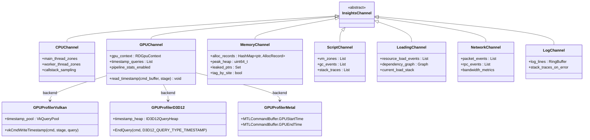
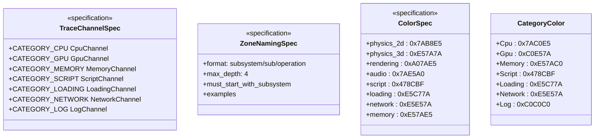
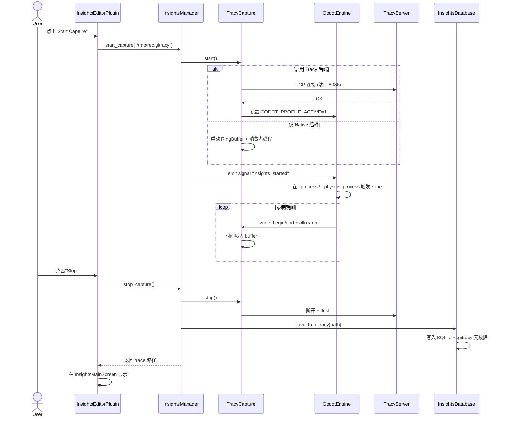
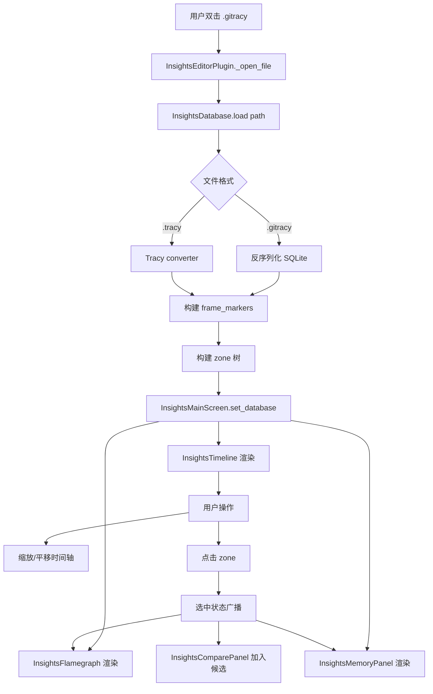
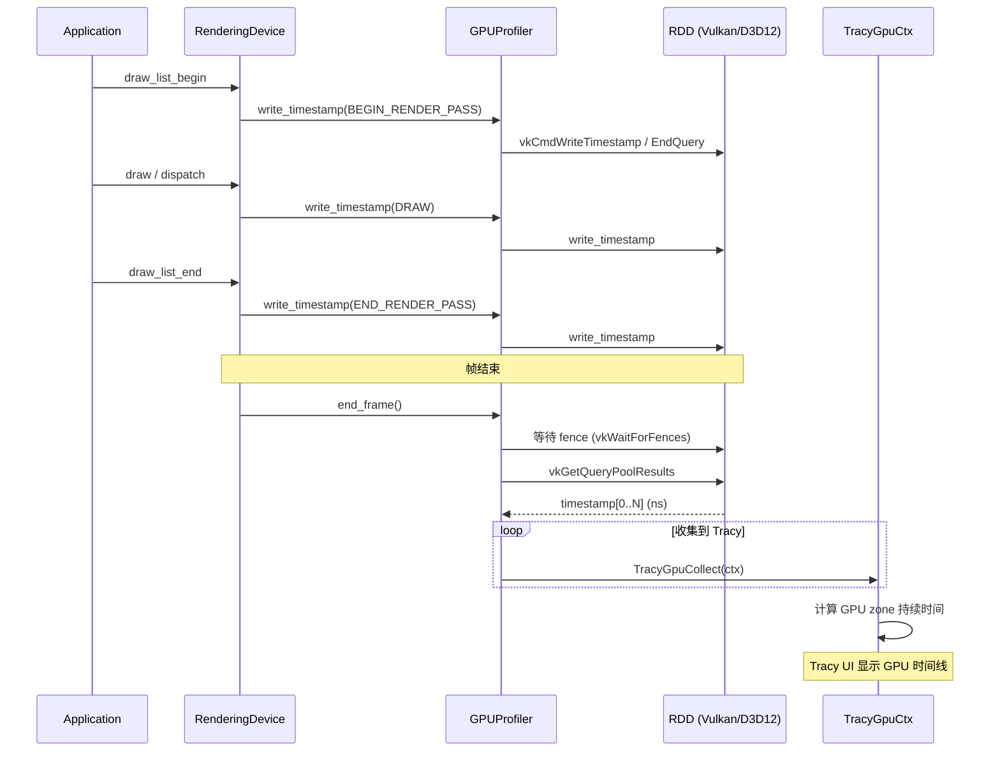
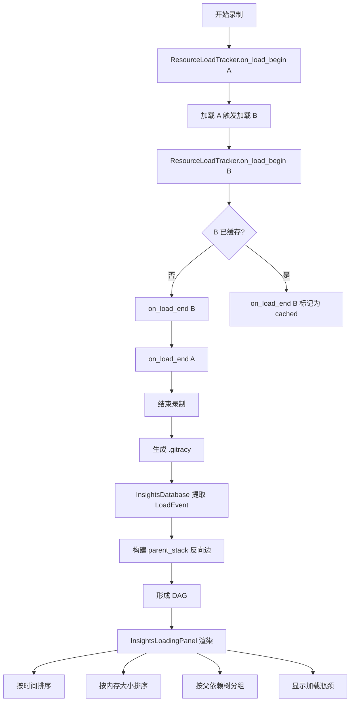
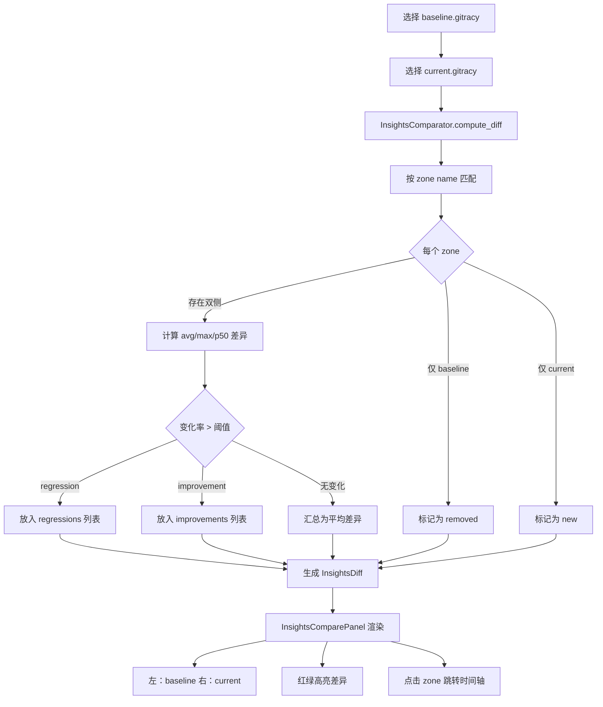
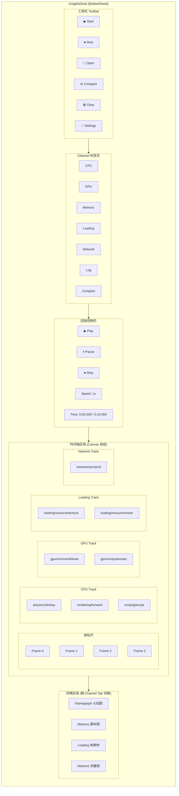
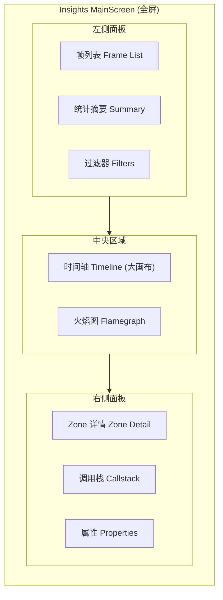

# Godot Insights — Tracy 增强型性能录制工具设计方案

## 1. 背景与目标

### 1.1 调研结论

Godot 已内置 Tracy 集成（`core/profiling/profiling.h`），覆盖：

- **客户端宏**：`GodotProfileZone` / `GodotProfileZoneGrouped` / `GodotProfileZoneScript` / `GodotProfileFrameMark` / `GodotProfileAlloc`
- **插桩点**：约 80 个（`main.cpp` 30 个、`rendering_server_default.cpp` 15 个、`rendering_device.cpp` 19 个、`gdscript_vm.cpp` 10 个、`memory.cpp` 4 个）
- **字符串驻留池**：基于 `StringName` + `HashMap<StringName, SourceLocationData>`，避免 GDScript Zone 重复分配
- **平台层支持**：Windows / macOS / iOS / Android / Linux / Web / VisionOS 全部 `godot_init_profiler()` / `FrameMark` 已就位
- **可选 callstack**：`TRACY_CALLSTACK=62` 支持
- **可选内存追踪**：`GODOT_PROFILER_TRACK_MEMORY` + `TracyAlloc`/`TracyFree`

### 1.2 设计目标

打造 **Godot Insights** —— 一个对标 Unreal Insights 的内置性能录制工具，提供：

1. **CPU / GPU / 内存 / 脚本 / 网络 / 资源** 多通道录制
2. **统一 Trace Channel 命名规范**，按子系统自动归类
3. **Editor 内嵌可视化**（时间轴、火焰图、内存图、网络图、加载图）
4. **GPU Profiling 桥接**（Vulkan/D3D12/Metal 时间戳）
5. **录制/回放/对比**工作流
6. **C# / GDScript 多语言脚本插桩**
7. **`.gitracy` 自定义 trace 格式** + Tracy 原生 `.tracy` 兼容
8. **零性能损耗**（运行时 `GODOT_USE_TRACY` 不开时不增加任何运行时开销）

## 2. 总体架构

### 2.1 分层架构

```
┌────────────────────────────────────────────────────────────────┐
│  Layer 5: Editor UI (Godot Insights Panel)                    │
│  - TimeLine / Flame / Memory / Net / Loading / GPU / Compare  │
├────────────────────────────────────────────────────────────────┤
│  Layer 4: Insights Core (services/insights/)                  │
│  - InsightsManager 录制/回放/对比协调器                        │
│  - InsightsDatabase  .gitracy 存储                             │
│  - InsightsCapture  Tracy capture 包装                          │
│  - InsightsChannel  Channel/Color/Fiber 映射                   │
├────────────────────────────────────────────────────────────────┤
│  Layer 3: Trace Channel + 宏扩展 (core/profiling/insights.h)   │
│  - GodotProfileZoneC(category, name)                            │
│  - GodotProfileZoneScript 扩展 (C#/GDScript VM)                │
│  - GPU 时间戳宏                                                 │
│  - 资源加载追踪宏                                                │
├────────────────────────────────────────────────────────────────┤
│  Layer 2: 已有集成 (core/profiling/profiling.h)                 │
│  - GodotProfileZone / Alloc / Free / FrameMark                  │
│  - intern_source_location                                      │
├────────────────────────────────────────────────────────────────┤
│  Layer 1: Tracy 客户端 + GPU 驱动补丁                          │
│  - TracyClient.cpp                                              │
│  - RD GPU context: Vulkan/D3D12/Metal                          │
├────────────────────────────────────────────────────────────────┤
│  Layer 0: Tracy Server (开源独立进程)                          │
│  - 原生 .tracy 可视化                                            │
└────────────────────────────────────────────────────────────────┘
```

### 2.2 核心模块划分

```
modules/insights/                 # 新增 GDExtension 模块
├── core/
│   ├── insights_manager.h/cpp          # 全局协调器（单例）
│   ├── insights_capture.h/cpp          # Capture 录制抽象
│   ├── insights_database.h/cpp         # .gitracy 存储（基于 SQLite）
│   ├── insights_channel.h/cpp          # Channel 枚举与元数据
│   ├── insights_comparator.h/cpp       # Diff 算法
│   └── insights_replay.h/cpp           # 回放引擎
├── channels/
│   ├── cpu_channel.h/cpp               # CPU trace
│   ├── gpu_channel.h/cpp               # GPU trace（封装 TracyGpuCtx）
│   ├── memory_channel.h/cpp            # 内存分配/释放追踪
│   ├── script_channel.h/cpp            # GDScript/C# 插桩
│   ├── loading_channel.h/cpp           # 资源加载
│   ├── network_channel.h/cpp           # 多人/网络
│   └── log_channel.h/cpp               # 错误/警告汇聚
├── gpu/
│   ├── gpu_profiler_vulkan.h/cpp       # Vulkan 时间戳
│   ├── gpu_profiler_d3d12.h/cpp        # D3D12 时间戳
│   ├── gpu_profiler_metal.h/cpp        # Metal 时间戳
│   └── gpu_timestamp_query.h           # RDD 抽象接口
├── editor/
│   ├── insights_editor_plugin.h/cpp    # EditorPlugin 入口
│   ├── insights_dock.h/cpp             # 主面板（BottomPanel）
│   ├── timeline_view.h/cpp             # CPU+GPU 时间轴
│   ├── flamegraph_view.h/cpp           # 火焰图
│   ├── memory_view.h/cpp               # 内存分配瀑布
│   ├── loading_view.h/cpp              # 资源加载依赖图
│   ├── network_view.h/cpp              # RPC/包流量
│   ├── gpu_view.h/cpp                  # GPU 命令时间
│   ├── compare_view.h/cpp              # 双 trace 对比
│   └── frame_marker_view.h/cpp         # 帧时间散点
├── tools/
│   ├── launch_with_insights.h/cpp      # 启动带 Tracy 的游戏
│   ├── tracy_convert.h/cpp             # .gitracy ↔ .tracy
│   └── insights_cli.h/cpp              # 命令行工具
└── register_types.h/cpp
```

```
editor/insights/                  # 编辑器内嵌 UI
├── insights_editor_plugin.h/cpp       # EditorPlugin 主类
├── insights_main_screen.h/cpp         # 主屏幕切换
├── insights_timeline.h/cpp            # 时间轴控件（自绘）
├── insights_flamegraph.h/cpp          # 火焰图控件
├── insights_memory_panel.h/cpp        # 内存面板
├── insights_loading_panel.h/cpp       # 加载面板
├── insights_compare_panel.h/cpp       # 对比面板
├── insights_filters.h/cpp             # 过滤器 UI
└── insights_theme.h/cpp               # 主题
```

## 3. 详细类图

### 3.1 Core 服务层


### 3.2 Channel 体系



### 3.3 编辑器 UI 层


### 3.4 Trace Channel 命名规范



## 4. 关键子系统设计

### 4.1 扩展宏系统

**位置**：`core/profiling/insights.h`

```cpp
// 通道化 Zone 宏（新增）
#define GodotProfileZoneC(category, name) \
    GodotProfileZoneImpl(category, name, __FILE__, __LINE__, __FUNCTION__)

// 层级化 Zone（自动用 / 分隔）
#define GodotProfileZoneH(subsystem, op1, op2) \
    GodotProfileZoneC(subsystem, "godot:" subsystem "/" op1 "/" op2)

// 异步任务追踪
#define GodotProfileFiber(name) \
    GodotProfileFiberImpl(name)

// 资源加载追踪（自动加入 Loading Channel）
#define GodotProfileResourceLoad(path) \
    GodotProfileZoneC(LoadingChannel::CAT_LOADING, "godot:loading/" path)

// GPU 阶段
#define GodotProfileGpuStage(name) \
    GodotProfileGpuStageImpl(name)

// 计数器
#define GodotProfilePlot(name, value) \
    GodotProfilePlotImpl(name, value)

// 自定义消息
#define GodotProfileMessage(text) \
    GodotProfileMessageImpl(text)
```

### 4.2 Trace Channel 体系

**统一命名规范**（UE Insights 风格）：

| Channel | Color | 命名规则 | 示例 |
|---------|-------|---------|------|
| **CPU/Main** | `#7AC0E5` | `godot:main/<sub>` | `godot:main/iteration`, `godot:main/process` |
| **CPU/Physics 2D** | `#7AB8E5` | `godot:physics/2d/<op>` | `godot:physics/2d/step`, `godot:physics/2d/broadphase` |
| **CPU/Physics 3D** | `#E57A7A` | `godot:physics/3d/<op>` | `godot:physics/3d/step` |
| **CPU/Rendering** | `#A07AE5` | `godot:rendering/<op>` | `godot:rendering/shader/compile` |
| **CPU/Audio** | `#7AE5A0` | `godot:audio/<op>` | `godot:audio/mix`, `godot:audio/bus` |
| **CPU/Script** | `#478CBF` | `godot:script/<op>` | `godot:script/gdscript/call` |
| **CPU/Loading** | `#E5C77A` | `godot:loading/<op>` | `godot:loading/resource/load` |
| **CPU/Network** | `#E5E57A` | `godot:network/<op>` | `godot:network/rpc/send` |
| **GPU/Command** | `#C0E57A` | `godot:gpu/command/<op>` | `godot:gpu/command/draw` |
| **GPU/Compute** | `#7AE5C0` | `godot:gpu/compute/<op>` | `godot:gpu/compute/dispatch` |
| **Memory** | `#E57AC0` | `godot:mem/<op>` | `godot:mem/alloc`, `godot:mem/free` |

### 4.3 GPU Profiling 桥接

**位置**：`modules/insights/gpu/gpu_profiler_*.h`

```cpp
// modules/insights/gpu/gpu_timestamp_query.h
class GPUTimestampQuery {
public:
    enum class Stage {
        BEGIN_RENDER_PASS,
        END_RENDER_PASS,
        DRAW,
        DISPATCH,
        PIPELINE_BARRIER,
        COPY,
        PRESENT
    };

    virtual uint32_t write_timestamp(CommandBufferID p_cmd, Stage p_stage) = 0;
    virtual bool fetch_results(uint64_t *p_times_ns, uint32_t p_count) = 0;
    virtual void collect_to_tracy(TracyGpuContext *p_ctx) = 0;
};

// modules/insights/gpu/gpu_profiler_vulkan.h
class GPUProfilerVulkan : public GPUTimestampQuery {
    VkQueryPool timestamp_pool;
    uint32_t query_index = 0;
    const uint32_t max_queries = 256;

    void begin_frame(CommandBufferID p_cmd) override {
        vkCmdResetQueryPool(cmd, timestamp_pool, query_index, max_queries - query_index);
    }

    uint32_t write_timestamp(CommandBufferID p_cmd, Stage p_stage) override {
        VkPipelineStageFlagBits stage = map_stage(p_stage);
        vkCmdWriteTimestamp(cmd, stage, timestamp_pool, query_index);
        return query_index++;
    }

    void end_frame() override {
        // 等待 fence → 读回 → 上报 Tracy
        vkGetQueryPoolResults(...);
        for (uint32_t i = 0; i < query_count; i++) {
            TracyGpuZoneContext ctx;
            ctx.gpu_time = results[i] * timestamp_period;
            TracyGpuCollect(ctx);
        }
    }
};
```

**集成到 RenderingDevice**：

```cpp
// servers/rendering/rendering_device.cpp (新增)
#include "modules/insights/gpu/gpu_timestamp_query.h"

void RenderingDevice::_end_frame() {
    GPUTimestampQuery *ts = insights_get_gpu_query();
    if (ts) {
        ts->end_frame();
    }
    GodotProfileFrameMark;
    // ...existing code
}
```

### 4.4 资源加载追踪增强

**位置**：`core/io/resource_loader.cpp`（增强现有 `load_paths_stack`）

```cpp
// 资源加载追踪
class ResourceLoadTracker {
    struct LoadEvent {
        String path;
        uint64_t start_ns;
        uint64_t end_ns;
        size_t memory_size;
        String source_loader;       // 哪个 importer
        Vector<String> parent_stack; // 调用栈
        uint64_t thread_id;
        Ref<Resource> result;
    };
    List<LoadEvent> events;
    HashMap<String, LoadEvent *> active_loads;

public:
    void on_load_begin(const String &p_path, const String &p_loader);
    void on_load_end(const String &p_path, Ref<Resource> p_res, size_t p_size);
    void on_load_fail(const String &p_path, const String &p_error);
    Vector<LoadEvent> get_events_in_range(uint64_t t0, uint64_t t1) const;
};

// 在 ResourceLoader::_load 中接入
Ref<Resource> ResourceLoader::_load(const String &p_path, ...) {
    GodotProfileZoneH("loading", "resource", "load");
    uint64_t t0 = OS::get_singleton()->get_ticks_usec() * 1000;
    ResourceLoadTracker::get_singleton()->on_load_begin(p_path, "...");

    // ...existing loading code

    ResourceLoadTracker::get_singleton()->on_load_end(p_path, res, res_size);
    return res;
}
```

### 4.5 C# / GDScript 桥接

**GDScript VM 增强**（`modules/gdscript/gdscript_vm.cpp`）：

```cpp
// 已有：GodotProfileZoneScript
// 新增：C# 等价物
#ifdef MODULE_MONO_ENABLED
// modules/mono/glue/GodotSharpProfiler.cs
[ThreadStatic]
private static int callDepth;

public static void EnterFunction(string name, string file, int line) {
    if (InsightsManager.IsActive) {
        MonoProfilerBridge.EnterZone(name, file, line);
    }
}

public static void LeaveFunction() {
    if (InsightsManager.IsActive) {
        MonoProfilerBridge.LeaveZone();
    }
}
#endif
```

## 5. 详细流程图

### 5.1 录制启动流程



### 5.2 编辑器加载 trace 流程



### 5.3 GPU 时间戳采集流程



### 5.4 资源加载依赖图生成流程



### 5.5 Trace 对比（Diff）流程



## 6. 关键子系统设计方案

### 6.1 插桩点扩展（200-400 个新增）

按照调研清单：

| 子系统 | 涉及文件 | 计划新增 zone 数 | 优先级 |
|--------|----------|------------------|--------|
| **Physics 2D** | `servers/physics_2d/godot_body_pair_2d.cpp`, `godot_step_2d.cpp`, `godot_world_2d.cpp` 等 8 文件 | ~40 | P0 |
| **Physics 3D** | `servers/physics_3d/godot_body_pair_3d.cpp`, `godot_step_3d.cpp`, `godot_world_3d.cpp` 等 10 文件 | ~50 | P0 |
| **Audio Server** | `servers/audio/audio_server.cpp`, `audio_stream.cpp`, `audio_driver.cpp` 等 6 文件 | ~30 | P1 |
| **Navigation** | `servers/navigation_server_2d/3d.cpp`, `nav_map.cpp`, `nav_agent.cpp` 等 8 文件 | ~40 | P1 |
| **Scene Tree** | `scene/main/scene_tree.cpp` (1→25), `node.cpp`, `viewport.cpp` | ~30 | P0 |
| **Resource Loader** | `core/io/resource_loader.cpp` | ~20 | P0 |
| **Rendering Substage** | `servers/rendering/renderer_rd/`, `forward_clustered/`, `forward_mobile/` 等 20 文件 | ~80 | P0 |
| **Object Lifecycle** | `core/object/object.cpp`, `object.h` | ~15 | P1 |
| **Networking** | `modules/multiplayer/`, `core/io/multiplayer_api.cpp` | ~20 | P1 |
| **C# / Mono** | `modules/mono/glue/`, `mono_gd.cpp` | ~25 | P1 |
| **总新增** | | **~350** | |

### 6.2 Editor 嵌入 UI

**主入口**：`InsightsEditorPlugin` 注册到主屏幕 + 底部面板

```cpp
void InsightsEditorPlugin::_enter_tree() {
    if (EditorNode::get_singleton()) {
        // 1. 注册主屏幕
        EditorNode::get_singleton()->add_main_screen("Insights", main_screen);

        // 2. 注册底部面板
        bottom_dock = memnew(InsightsDock);
        EditorNode::get_bottom_panel()->add_item("Insights", bottom_dock);

        // 3. 注册到主菜单
        add_menu_item("Project/Tools/Insights/Start Capture", callable_mp(this, &InsightsEditorPlugin::_start_capture));
        add_menu_item("Project/Tools/Insights/Open Trace...", callable_mp(this, &InsightsEditorPlugin::_open_trace));
        add_menu_item("Project/Tools/Insights/Compare Traces...", callable_mp(this, &InsightsEditorPlugin::_compare_traces));
    }
}
```

**InsightsDock 布局**（BottomPanel）：

```
+--------------------------------------------------------------------+
|  [▶ Start] [⏹ Stop] [📁 Open] [⚖ Compare]  [🗑 Clear]   [🔧 Settings]|
+--------------------------------------------------------------------+
|  [CPU] [GPU] [Memory] [Loading] [Network] [Log] [Compare]         |
+--------------------------------------------------------------------+
|  [▶ Play] [⏸ Pause] [⏹] [Scale: 1x] [Time: 0:00.000 / 0:10.000] |
+--------------------------------------------------------------------+
|  [Timeline 自绘 Canvas]                                            |
|  CPU:  ████ ████ ████ ████                                         |
|  GPU:       ████ ████                                               |
|  Net:  ████ ████ ████ ████                                         |
|  Load:        ████ ████                                             |
+--------------------------------------------------------------------+
|  [Flamegraph / 内存瀑布 / 依赖树]                                  |
+--------------------------------------------------------------------+
```

**InsightsDock 界面设计示意图**：



**主屏幕视图（MainScreen）**：



### 6.3 启动带 Tracy 的游戏

`launch_with_insights` 工具：

```cpp
// editor/insights/launch_with_insights.cpp
Error InsightsLauncher::launch_with_insights(String project_path, int port) {
    // 1. 编译项目（如需要）使用 GODOT_USE_TRACY + profiler_track_memory
    String tracy_flags = String("profiler=tracy profiler_track_memory=yes "
        "profiler_sample_callstack=yes module_insights_enabled=yes "
        "tracy_port=" + String::num_int64(port));
    build_project(project_path, tracy_flags);

    // 2. 启动游戏进程
    String exec_path = project_path + "/bin/game_tracy.exe";
    ProcessId pid = OS::execute(exec_path, {"--headless", "--tracy-connect=localhost:" + String::num_int64(port)});

    // 3. 自动连接 InsightsManager
    InsightsManager::get_singleton()->connect_to_remote("localhost", port);
    return OK;
}
```

### 6.4 .gitracy 文件格式

**双层设计**：
- **Metadata**（JSON/TOML）：记录项目、引擎版本、捕获时间、配置
- **Events**（SQLite 数据库）：zone / alloc / frame 等数据

```toml
# .gitracy metadata
[meta]
version = "1.0"
godot_version = "4.6-dev"
project_name = "MyGame"
project_path = "res://"
capture_start = "2025-06-08T14:32:01Z"
capture_duration_ns = 10000000000
executable = "build/game_tracy.exe"
tracy_compatible = true

[channels]
cpu = { enabled = true, color = "#7AC0E5" }
gpu = { enabled = true, color = "#C0E57A", backend = "vulkan" }
memory = { enabled = true, track_leaks = true }
script = { enabled = true, sample_gdscript = true, sample_csharp = true }
loading = { enabled = true }
network = { enabled = false }
log = { enabled = true, severity_threshold = "WARNING" }

[settings]
tracy_port = 8086
sample_callstack = true
callstack_depth = 62
```

**SQLite Schema**（节选）：

```sql
CREATE TABLE zones (
    id INTEGER PRIMARY KEY,
    name TEXT NOT NULL,
    file TEXT,
    function TEXT,
    line INTEGER,
    channel TEXT,
    thread_id INTEGER,
    start_ns INTEGER NOT NULL,
    end_ns INTEGER,
    depth INTEGER,
    parent_zone_id INTEGER,
    FOREIGN KEY (parent_zone_id) REFERENCES zones(id)
);
CREATE INDEX idx_zones_name ON zones(name);
CREATE INDEX idx_zones_thread ON zones(thread_id);
CREATE INDEX idx_zones_start ON zones(start_ns);

CREATE TABLE gpu_zones (
    id INTEGER PRIMARY KEY,
    name TEXT,
    queue_id INTEGER,
    submit_ns INTEGER,
    start_ns INTEGER,
    end_ns INTEGER,
    context_id INTEGER
);

CREATE TABLE allocations (
    ptr INTEGER PRIMARY KEY,
    size INTEGER NOT NULL,
    site_zone_id INTEGER,
    alloc_ns INTEGER,
    free_ns INTEGER,
    thread_id INTEGER,
    callstack BLOB
);

CREATE TABLE frame_markers (
    frame_index INTEGER PRIMARY KEY,
    start_ns INTEGER,
    end_ns INTEGER
);

CREATE TABLE resource_loads (
    id INTEGER PRIMARY KEY,
    path TEXT NOT NULL,
    loader TEXT,
    start_ns INTEGER,
    end_ns INTEGER,
    size_bytes INTEGER,
    parent_path TEXT,
    thread_id INTEGER,
    callstack BLOB
);

CREATE TABLE messages (
    id INTEGER PRIMARY KEY,
    level INTEGER,  -- 0=Verbose 1=Debug 2=Info 3=Warn 4=Error
    text TEXT,
    timestamp_ns INTEGER,
    zone_id INTEGER,
    callstack BLOB
);
```

### 6.5 性能优化

| 优化点 | 措施 |
|--------|------|
| 零开销 stub | `GODOT_USE_TRACY` 未定义时所有宏为 0 指令 |
| 字符串驻留 | GDScript zone 用 `intern_source_location`，避免重复分配 |
| 异步 RingBuffer | Native 后端用 `SPSCQueue<Event>` 跨线程通信 |
| 批量 flush | 每帧提交 Tracy 一次（非每次 zone） |
| 选择性启用 | Editor 中可通过 Project Settings 关闭不需要的 channel |
| 大小限制 | 录制达到 1 GB 自动停止并提示保存 |
| 帧采样 | 可配置 `frame_sample_rate`（如每 5 帧采样一次） |

## 7. 实施路线图

### Phase 1：基础设施（4-6 周）

- [x] 调研 Tracy 集成（已完成）
- [ ] **新模块骨架**：`modules/insights/`，注册 GDExtension
- [ ] **宏扩展**：`core/profiling/insights.h`
- [ ] **Channel 体系**：`insights_channel.h` + 命名规范
- [ ] **InsightsManager 单例**：start/stop/save/load 基础流程

**单元测试**：

```cpp
// tests/test_insights_phase1.h

// 1. 模块注册测试
TEST_CASE("[Insights] Module registration") {
    CHECK(ClassDB::class_exists("InsightsManager"));
    CHECK(InsightsManager::get_singleton() != nullptr);
}

// 2. 宏编译测试 — 确保 GODOT_USE_TRACY 未定义时宏为空
TEST_CASE("[Insights] Macro stubs compile without Tracy") {
    // 以下宏在无 Tracy 时应为 no-op，不应链接失败
    GodotProfileZoneC("cpu", "test_zone");
    GodotProfileZoneH("physics", "2d", "step");
    GodotProfileFiber("test_fiber");
    GodotProfilePlot("test_plot", 42.0);
    GodotProfileMessage("test_message");
    CHECK(true); // 编译通过即测试通过
}

// 3. Channel 注册与查询测试
TEST_CASE("[Insights] Channel registration") {
    InsightsManager *mgr = InsightsManager::get_singleton();
    CPUChannel *cpu = memnew(CPUChannel);
    GPUChannel *gpu = memnew(GPUChannel);
    mgr->register_channel(cpu);
    mgr->register_channel(gpu);

    CHECK(mgr->get_channel("cpu") == cpu);
    CHECK(mgr->get_channel("gpu") == gpu);
    CHECK(mgr->get_channel("nonexistent") == nullptr);
    CHECK(mgr->get_channel_count() == 2);

    memdelete(cpu);
    memdelete(gpu);
}

// 4. Channel 命名规范测试
TEST_CASE("[Insights] Channel naming convention") {
    CHECK(InsightsChannel::validate_zone_name("godot:physics/3d/step") == true);
    CHECK(InsightsChannel::validate_zone_name("godot:rendering/shader/compile") == true);
    CHECK(InsightsChannel::validate_zone_name("invalid_name") == false);
    CHECK(InsightsChannel::validate_zone_name("godot:") == false);
    CHECK(InsightsChannel::get_category("godot:physics/3d/step") == ChannelCategory::CPU);
    CHECK(InsightsChannel::get_category("godot:gpu/command/draw") == ChannelCategory::GPU);
}

// 5. InsightsManager 生命周期测试
TEST_CASE("[Insights] Manager start/stop lifecycle") {
    InsightsManager *mgr = InsightsManager::get_singleton();
    CHECK(mgr->is_recording() == false);

    Error err = mgr->start_capture("res://test_capture.gitracy");
    CHECK(err == OK);
    CHECK(mgr->is_recording() == true);

    String path = mgr->stop_capture();
    CHECK(mgr->is_recording() == false);
    CHECK(path == "res://test_capture.gitracy");
}

// 6. InsightsDatabase 创建与基本查询
TEST_CASE("[Insights] Database create and query") {
    InsightsDatabase db;
    db.open("res://test_db.gitracy");
    db.create_tables();

    // 插入测试 zone
    db.insert_zone("godot:physics/3d/step", "test.cpp", 42, "cpu", 0, 1000, 2000, 0, -1);
    db.insert_zone("godot:rendering/forward", "test.cpp", 43, "cpu", 0, 2000, 3500, 0, -1);

    Array results = db.query_zone("godot:physics/3d/step", 0, 5000);
    CHECK(results.size() == 1);
    CHECK(results[0].get("name") == "godot:physics/3d/step");

    db.close();
}
```

### Phase 2：录制核心（6-8 周）

- [ ] **CPU Zone 扩桩**：按 §6.1 表补全 350+ zone
- [ ] **GDScript VM 增强**：跨函数追踪、GC 事件
- [ ] **资源加载追踪**：扩展 `load_paths_stack`
- [ ] **Memory Channel**：包裹 `Memory::alloc_static` + `free_static`
- [ ] **Log Channel**：拦截 `OS::print_error`

**单元测试**：

```cpp
// tests/test_insights_phase2.h

// 1. Zone 嵌套与层级测试 — 验证 zone 正确记录父子关系与深度
TEST_CASE("[Insights] Zone nesting and depth") {
    InsightsDatabase db;
    db.open("res://test_nesting.gitracy");
    db.create_tables();

    // 模拟嵌套调用：main → physics → step → broadphase
    uint64_t t0 = 0;
    db.insert_zone("godot:main/iteration", "main.cpp", 10, "cpu", 0, t0, t0 + 10000, 0, -1);
    int parent_id = 1; // main iteration 的 id
    db.insert_zone("godot:physics/3d/step", "step.cpp", 20, "cpu", 0,
                   t0 + 500, t0 + 8000, 1, parent_id);   // depth=1
    db.insert_zone("godot:physics/3d/broadphase", "broadphase.cpp", 30, "cpu", 0,
                   t0 + 600, t0 + 7000, 2, parent_id + 1); // depth=2

    Array results = db.query_zone("godot:physics/3d/broadphase", 0, 20000);
    CHECK(results.size() == 1);
    CHECK(results[0].get("depth") == 2);

    // 验证父级 zone 存在
    int parent_of_broadphase = results[0].get("parent_zone_id");
    Array parent_results = db.query_zone_by_id(parent_of_broadphase);
    CHECK(parent_results[0].get("name") == "godot:physics/3d/step");

    db.close();
}

// 2. 资源加载追踪测试 — 验证 LoadEvent 记录依赖链
TEST_CASE("[Insights] Resource load tracking with dependency chain") {
    ResourceLoadTracker tracker;

    tracker.on_load_begin("res://scene.tscn", "ResourceFormatLoaderScene");
    tracker.on_load_begin("res://player.tres", "ResourceFormatLoaderText"); // 子依赖
    tracker.on_load_begin("res://player_texture.png", "ResourceFormatLoaderTexture"); // 孙依赖
    tracker.on_load_end("res://player_texture.png", Ref<Resource>(), 102400);
    tracker.on_load_end("res://player.tres", Ref<Resource>(), 2048);
    tracker.on_load_end("res://scene.tscn", Ref<Resource>(), 4096);

    Array events = tracker.get_events_in_range(0, UINT64_MAX);
    CHECK(events.size() == 3);

    // scene.tscn 应该有 player.tres 作为子依赖
    const ResourceLoadTracker::LoadEvent &scene_event = events[2];
    CHECK(scene_event.path == "res://scene.tscn");
    CHECK(scene_event.parent_stack.size() >= 0);

    // player_texture.png 应该有完整的 parent stack
    const ResourceLoadTracker::LoadEvent &tex_event = events[0];
    CHECK(tex_event.parent_stack.contains("res://scene.tscn"));
    CHECK(tex_event.parent_stack.contains("res://player.tres"));
}

// 3. Memory Channel 追踪测试 — 验证分配/释放配对与泄漏检测
TEST_CASE("[Insights] Memory channel alloc/free tracking") {
    MemoryChannel mem;
    mem.start_tracking();

    void *ptr1 = Memory::alloc_static(1024);
    void *ptr2 = Memory::alloc_static(2048);
    void *ptr3 = Memory::alloc_static(512);

    CHECK(mem.get_total_allocated() == 3584);
    CHECK(mem.get_allocation_count() == 3);

    Memory::free_static(ptr2); // 释放中间的
    CHECK(mem.get_total_allocated() == 1536);

    // ptr3 不释放，应被标记为泄漏
    mem.stop_tracking();
    Vector<MemoryChannel::LeakInfo> leaks = mem.detect_leaks();
    CHECK(leaks.size() == 1);
    CHECK(leaks[0].ptr == ptr3);
    CHECK(leaks[0].size == 512);

    Memory::free_static(ptr1);
    Memory::free_static(ptr3);
}

// 4. Log Channel 测试 — 验证错误消息捕获与关联到 zone
TEST_CASE("[Insights] Log channel error capture with zone association") {
    LogChannel log;
    log.enable(true);
    log.set_severity_threshold(LogChannel::Severity::WARNING);

    // 模拟在某个 zone 内发生错误
    int zone_id = 42;
    log.log_message(LogChannel::Severity::ERROR, "Failed to load texture",
                    "resource_loader.cpp", 123, zone_id);

    log.log_message(LogChannel::Severity::WARNING, "Texture not found in cache",
                    "texture_storage.cpp", 45, zone_id);

    Array errors = log.get_messages_in_range(0, UINT64_MAX, LogChannel::Severity::ERROR);
    CHECK(errors.size() == 1);
    CHECK(errors[0].text.begins_with("Failed to load texture"));
    CHECK(errors[0].zone_id == zone_id);

    Array warnings = log.get_messages_in_range(0, UINT64_MAX, LogChannel::Severity::WARNING);
    CHECK(warnings.size() == 1);

    log.disable();
}

// 5. GDScript VM Zone 测试 — 验证脚本函数调用链正确记录
TEST_CASE("[Insights] GDScript VM function call tracking") {
    ScriptChannel script;
    script.enable();

    // 模拟 GDScript 函数调用栈
    script.enter_function("_ready", "Player.gd", 10);
    script.enter_function("_physics_process", "Player.gd", 25);
    script.enter_function("move_and_slide", "Player.gd", 42);
    script.leave_function(); // exit move_and_slide
    script.leave_function(); // exit _physics_process
    script.leave_function(); // exit _ready

    Vector<ScriptChannel::CallRecord> calls = script.get_call_records();
    CHECK(calls.size() == 3);
    CHECK(calls[0].function_name == "_ready");
    CHECK(calls[1].function_name == "_physics_process");
    CHECK(calls[2].function_name == "move_and_slide");

    // 验证时间重叠正确（子函数在父函数内）
    CHECK(calls[1].start_ns >= calls[0].start_ns);
    CHECK(calls[1].end_ns <= calls[0].end_ns);

    script.disable();
}
```

### Phase 3：GPU Profiling（4-6 周）

- [ ] **RDD 时间戳抽象**：`RenderingDeviceDriver` 新增 `write_timestamp` 接口
- [ ] **Vulkan 后端**：`vkCmdWriteTimestamp`
- [ ] **D3D12 后端**：`ID3D12GraphicsCommandList::EndQuery`
- [ ] **Metal 后端**：`MTLCommandBuffer.gpuStartTime/EndTime`
- [ ] **GPU 收集回调**：`TracyGpuCollect` 包装

**单元测试**：

```cpp
// tests/test_insights_phase3.h

// 1. GPU 时间戳抽象接口测试 — 验证 RDD 层 write_timestamp 接口存在
TEST_CASE("[Insights] GPU timestamp RDD interface") {
    RenderingDevice *rd = RenderingServer::get_singleton()->get_rendering_device();

    // 验证 RDD 接口扩展已注册
    CHECK(rd->has_method("write_gpu_timestamp"));

    // 验证 GPU context 已初始化
    RID cmd = rd->command_buffer_create();
    CHECK(cmd.is_valid());

    // 写入时间戳不应崩溃
    uint32_t query_id = rd->write_gpu_timestamp(cmd, GPUTimestampQuery::Stage::BEGIN_RENDER_PASS);
    CHECK(query_id >= 0);
}

// 2. Vulkan 时间戳精度测试 — 验证 timestampPeriod 正确解析
TEST_CASE("[Insights] Vulkan timestamp period resolution") {
    GPUProfilerVulkan profiler;
    bool supported = profiler.initialize(RenderingDevice::get_singleton());
    CHECK(supported == true);

    float period = profiler.get_timestamp_period();
    CHECK(period > 0.0f);  // 通常为 1.0 ns 或更小
    CHECK(period < 1000.0f); // 不应超过 1 us

    // 验证查询池创建
    CHECK(profiler.get_query_pool() != VK_NULL_HANDLE);
    CHECK(profiler.get_max_queries() == 256);
}

// 3. GPU Zone 时间测量端到端测试 — 验证 GPU zone 有合理的持续时间
TEST_CASE("[Insights] GPU zone end-to-end timing") {
    RenderingDevice *rd = RenderingServer::get_singleton()->get_rendering_device();
    GPUChannel gpu;
    gpu.enable();

    // 创建简单渲染 pass 并插入时间戳
    RID fb = rd->framebuffer_create(/* ... */);
    RID cmd = rd->draw_list_begin(fb, RD::INITIAL_ACTION_CLEAR, RD::FINAL_ACTION_READ);

    uint32_t ts_begin = rd->write_gpu_timestamp(cmd, GPUTimestampQuery::Stage::BEGIN_RENDER_PASS);

    // 绘制一个三角形
    rd->draw_list_end();

    uint32_t ts_end = rd->write_gpu_timestamp(cmd, GPUTimestampQuery::Stage::END_RENDER_PASS);

    // 等待 GPU 完成
    rd->submit();
    rd->sync();

    // 读回时间戳
    uint64_t times_ns[2];
    bool ok = gpu.fetch_timestamp_results(times_ns, 2);
    CHECK(ok == true);

    // GPU zone 持续时间应 > 0 且 < 1s
    uint64_t duration_ns = times_ns[1] - times_ns[0];
    CHECK(duration_ns > 0);
    CHECK(duration_ns < 1000000000ULL);

    gpu.disable();
}

// 4. GPU-CPU 关联测试 — 验证 GPU zone 与提交它的 CPU zone 正确关联
TEST_CASE("[Insights] GPU-CPU correlation") {
    InsightsDatabase db;
    db.open("res://test_gpu_cpu.gitracy");
    db.create_tables();

    // CPU zone: rendering/forward (提交 GPU 命令的 CPU 代码)
    db.insert_zone("godot:rendering/forward", "render_forward.cpp", 100,
                   "cpu", 0, 1000000, 1050000, 0, -1);

    // GPU zone: 由上述 CPU zone 提交
    db.insert_gpu_zone("godot:gpu/command/draw", 0, 1000100, 1040000, 0);

    // 查询：找到 CPU zone 关联的 GPU zone
    Array gpu_zones = db.query_gpu_zones_for_cpu_zone(1);
    CHECK(gpu_zones.size() == 1);
    CHECK(gpu_zones[0].get("name") == "godot:gpu/command/draw");

    // GPU zone 应在 CPU zone 时间范围内
    uint64_t gpu_start = gpu_zones[0].get("start_ns");
    uint64_t cpu_start = 1000000;
    uint64_t cpu_end = 1050000;
    CHECK(gpu_start >= cpu_start);
    CHECK(gpu_start <= cpu_end);

    db.close();
}

// 5. 多后端兼容性测试 — 验证 D3D12/Metal 后端也能正确创建 query
TEST_CASE("[Insights] GPU profiler multi-backend compatibility") {
    // 根据当前运行平台选择后端
    String driver_name = RenderingServer::get_singleton()->get_video_adapter_api_version();

    GPUTimestampQuery *profiler = nullptr;
    if (driver_name.begins_with("Vulkan")) {
        profiler = memnew(GPUProfilerVulkan);
    } else if (driver_name.begins_with("D3D12")) {
        profiler = memnew(GPUProfilerD3D12);
    } else if (driver_name.begins_with("Metal")) {
        profiler = memnew(GPUProfilerMetal);
    }

    CHECK(profiler != nullptr);
    CHECK(profiler->is_supported() == true);

    memdelete(profiler);
}
```

### Phase 4：编辑器 UI（6-8 周）

- [ ] **InsightsEditorPlugin** 注册
- [ ] **InsightsTimeline** 自绘时间轴
- [ ] **InsightsFlamegraph** 火焰图控件
- [ ] **InsightsMemoryPanel** 内存瀑布
- [ ] **InsightsLoadingPanel** 资源依赖图
- [ ] **InsightsNetworkPanel** 网络流量
- [ ] **InsightsComparePanel** Diff 视图

**单元测试**：

```cpp
// tests/test_insights_phase4.h

// 1. EditorPlugin 注册与生命周期测试
TEST_CASE("[Insights] EditorPlugin registration") {
    EditorNode *editor = EditorNode::get_singleton();
    CHECK(editor != nullptr);

    InsightsEditorPlugin *plugin = memnew(InsightsEditorPlugin);
    editor->add_plugin(plugin);

    CHECK(plugin->get_plugin_name() == "Insights");
    CHECK(plugin->_has_main_screen() == true);

    // 验证 BottomPanel 已注册
    InsightsDock *dock = plugin->get_bottom_dock();
    CHECK(dock != nullptr);
    CHECK(dock->is_inside_tree() == true);

    editor->remove_plugin(plugin);
    memdelete(plugin);
}

// 2. Timeline 渲染测试 — 验证时间轴正确渲染 zone 数据
TEST_CASE("[Insights] Timeline rendering with zone data") {
    InsightsTimeline timeline;
    timeline.set_size(Size2i(1920, 400));

    // 注入测试数据
    InsightsDatabase db;
    db.open("res://test_timeline.gitracy");
    db.create_tables();
    db.insert_zone("godot:physics/3d/step", "step.cpp", 20, "cpu", 0, 1000, 5000, 0, -1);
    db.insert_zone("godot:rendering/forward", "forward.cpp", 30, "cpu", 0, 5000, 12000, 0, -1);
    db.insert_frame_marker(0, 0, 16666666); // 60fps

    timeline.set_database(&db);

    // 验证缩放与偏移
    CHECK(timeline.get_total_duration_ns() == 16666666);
    CHECK(timeline.get_visible_range().size() > 0);

    // 点击测试 — 模拟点击 zone
    Point2i click_pos(500, 50); // CPU track 区域
    timeline._gui_input(Ref<InputEventMouseButton>::create(click_pos, MOUSE_BUTTON_LEFT));
    Zone selected = timeline.get_selected_zone();
    CHECK(selected.name.begins_with("godot:"));

    db.close();
}

// 3. Flamegraph 测试 — 验证火焰图正确构建层级
TEST_CASE("[Insights] Flamegraph hierarchy construction") {
    InsightsFlamegraph flame;
    InsightsDatabase db;
    db.open("res://test_flame.gitracy");
    db.create_tables();

    // 构建嵌套 zone
    db.insert_zone("godot:main/iteration", "main.cpp", 10, "cpu", 0, 0, 16000, 0, -1);
    db.insert_zone("godot:physics/3d/step", "step.cpp", 20, "cpu", 0, 1000, 8000, 1, 1);
    db.insert_zone("godot:physics/3d/broadphase", "bp.cpp", 30, "cpu", 0, 2000, 5000, 2, 2);
    db.insert_zone("godot:rendering/forward", "fwd.cpp", 40, "cpu", 0, 8000, 15000, 1, 1);

    flame.set_database(&db);

    // 验证根节点
    Vector<FlameNode> roots = flame.get_root_nodes();
    CHECK(roots.size() == 1);
    CHECK(roots[0].name == "godot:main/iteration");

    // 验证子节点
    Vector<FlameNode> children = flame.get_children(roots[0].id);
    CHECK(children.size() == 2); // physics + rendering
    CHECK(children[0].name == "godot:physics/3d/step");
    CHECK(children[1].name == "godot:rendering/forward");

    // 验证搜索过滤
    flame.set_search_query("broadphase");
    Vector<FlameNode> filtered = flame.get_filtered_nodes();
    CHECK(filtered.size() == 1);

    db.close();
}

// 4. Memory Panel 测试 — 验证内存瀑布图正确显示分配生命周期
TEST_CASE("[Insights] Memory panel allocation lifecycle") {
    InsightsMemoryPanel panel;
    InsightsDatabase db;
    db.open("res://test_memory.gitracy");
    db.create_tables();

    // 模拟分配/释放
    db.insert_allocation(0x1000, 1024, 1, 1000, 5000, 0);   // 已释放
    db.insert_allocation(0x2000, 2048, 2, 2000, -1, 0);      // 未释放（泄漏）
    db.insert_allocation(0x3000, 512, 3, 3000, 8000, 0);     // 已释放

    panel.set_database(&db);

    // 验证峰值内存
    CHECK(panel.get_peak_memory() == 3584); // 1024 + 2048 + 512

    // 验证泄漏列表
    Vector<MemoryPanel::LeakEntry> leaks = panel.get_leaked_allocations();
    CHECK(leaks.size() == 1);
    CHECK(leaks[0].ptr == 0x2000);
    CHECK(leaks[0].size == 2048);

    // 验证大小过滤
    panel.set_size_filter(1024);
    Vector<MemoryPanel::AllocEntry> filtered = panel.get_filtered_allocations();
    CHECK(filtered.size() == 2); // 1024 + 2048

    db.close();
}

// 5. Loading Panel 测试 — 验证依赖树正确构建
TEST_CASE("[Insights] Loading panel dependency tree") {
    InsightsLoadingPanel panel;
    InsightsDatabase db;
    db.open("res://test_loading.gitracy");
    db.create_tables();

    db.insert_resource_load("res://scene.tscn", "SceneLoader", 1000, 5000, 4096, "", 0);
    db.insert_resource_load("res://player.tres", "TextLoader", 1500, 4000, 2048,
                            "res://scene.tscn", 0);
    db.insert_resource_load("res://tex.png", "TextureLoader", 2000, 3500, 102400,
                            "res://player.tres", 0);

    panel.set_database(&db);

    // 验证根节点
    Vector<LoadingPanel::LoadNode> roots = panel.get_root_loads();
    CHECK(roots.size() == 1);
    CHECK(roots[0].path == "res://scene.tscn");

    // 验证依赖子节点
    Vector<LoadingPanel::LoadNode> deps = panel.get_dependencies(roots[0].id);
    CHECK(deps.size() == 1);
    CHECK(deps[0].path == "res://player.tres");

    // 验证瓶颈检测（最慢加载）
    LoadingPanel::LoadNode bottleneck = panel.get_bottleneck();
    CHECK(bottleneck.path == "res://tex.png"); // 102400 bytes, 最大

    db.close();
}

// 6. Compare Panel 测试 — 验证 Diff 正确识别回归
TEST_CASE("[Insights] Compare panel diff and regression detection") {
    InsightsComparePanel panel;

    // 创建两个 trace 数据库
    InsightsDatabase db_baseline, db_current;
    db_baseline.open("res://baseline.gitracy");
    db_current.open("res://current.gitracy");
    db_baseline.create_tables();
    db_current.create_tables();

    // baseline: physics step 耗时 2ms
    db_baseline.insert_zone("godot:physics/3d/step", "step.cpp", 20, "cpu", 0, 0, 2000000, 0, -1);
    // current: physics step 耗时 5ms (回归)
    db_current.insert_zone("godot:physics/3d/step", "step.cpp", 20, "cpu", 0, 0, 5000000, 0, -1);
    // current: 新增 zone (new)
    db_current.insert_zone("godot:physics/3d/narrowphase", "np.cpp", 30, "cpu", 0, 1000000, 4000000, 1, -1);

    panel.set_baseline(&db_baseline);
    panel.set_current(&db_current);

    InsightsDiff diff = panel.compute_diff();

    // 验证回归检测
    CHECK(diff.regressions.size() == 1);
    CHECK(diff.regressions[0].name == "godot:physics/3d/step");
    CHECK(diff.regressions[0].time_increase_ns == 3000000); // 5ms - 2ms

    // 验证新增 zone
    CHECK(diff.new_zones.size() == 1);
    CHECK(diff.new_zones[0].name == "godot:physics/3d/narrowphase");

    db_baseline.close();
    db_current.close();
}
```

### Phase 5：脚本/C# 与录制工作流（4-6 周）

- [ ] **C# Mono 插桩**：`GodotSharpProfiler.cs`
- [ ] **GDScript 注释 API**：`@profiler_zone` 装饰器
- [ ] **启动带 Tracy 工具**：`launch_with_insights`
- [ ] **`.gitracy` ↔ `.tracy` 转换器**
- [ ] **命令行 CLI**：`godot --insights-export`
- [ ] **CI 集成**：`insights-cli compare baseline.tracy pr.tracy --threshold 0.1`

**单元测试**：

```cpp
// tests/test_insights_phase5.h

// 1. C# 方法调用插桩测试 — 验证 Mono bridge 正确记录 zone
TEST_CASE("[Insights] C# Mono method call profiling") {
    ScriptChannel script;
    script.enable();

    // 模拟 C# 方法调用通过 MonoProfilerBridge
    MonoProfilerBridge::enter_function("Player.Update", "Player.cs", 42);
    MonoProfilerBridge::enter_function("Player.Move", "Player.cs", 58);
    MonoProfilerBridge::leave_function(); // exit Move
    MonoProfilerBridge::leave_function(); // exit Update

    Vector<ScriptChannel::CallRecord> calls = script.get_call_records();
    CHECK(calls.size() == 2);
    CHECK(calls[0].function_name == "Player.Update");
    CHECK(calls[0].language == ScriptChannel::Language::C_SHARP);
    CHECK(calls[1].function_name == "Player.Move");

    script.disable();
}

// 2. C# 异步/协程 zone 生命周期测试
TEST_CASE("[Insights] C# async/coroutine zone lifecycle") {
    ScriptChannel script;
    script.enable();

    // 模拟 async 方法：开始 → 挂起 → 恢复 → 结束
    MonoProfilerBridge::enter_function("LoadAsync", "Loader.cs", 10);
    MonoProfilerBridge::suspend_function("LoadAsync"); // await
    // ... 时间流逝 ...
    MonoProfilerBridge::resume_function("LoadAsync");  // 继续
    MonoProfilerBridge::leave_function();              // 结束

    Vector<ScriptChannel::CallRecord> calls = script.get_call_records();
    CHECK(calls.size() == 1);
    CHECK(calls[0].function_name == "LoadAsync");
    CHECK(calls[0].was_suspended == true);
    // 持续时间应包含挂起时间
    CHECK(calls[0].end_ns > calls[0].suspend_ns);
    CHECK(calls[0].resume_ns > calls[0].suspend_ns);

    script.disable();
}

// 3. GDScript @profiler_zone 装饰器测试
TEST_CASE("[Insights] GDScript profiler_zone decorator") {
    // 创建带装饰器的 GDScript
    String script_source = R"(
extends Node

@profiler_zone
func _ready():
    pass

@profiler_zone("custom_name")
func expensive_calculation():
    var sum = 0
    for i in range(1000):
        sum += i
    return sum
)";
    Ref<GDScript> gdscript = GDScriptLanguage::get_singleton()->parse_script(script_source);
    CHECK(gdscript.is_valid());

    // 执行并验证 zone 记录
    ScriptChannel script;
    script.enable();

    gdscript->call("_ready");
    gdscript->call("expensive_calculation");

    Vector<ScriptChannel::CallRecord> calls = script.get_call_records();
    CHECK(calls.size() == 2);
    CHECK(calls[0].function_name == "_ready"); // 默认用函数名
    CHECK(calls[1].function_name == "custom_name"); // 自定义名称

    script.disable();
}

// 4. .gitracy ↔ .tracy 转换器测试
TEST_CASE("[Insights] gitracy-tracy converter roundtrip") {
    // 创建 .gitracy 文件
    InsightsDatabase db;
    db.open("res://test_convert.gitracy");
    db.create_tables();
    db.insert_zone("godot:physics/3d/step", "step.cpp", 20, "cpu", 0, 0, 2000000, 0, -1);
    db.insert_frame_marker(0, 0, 16666666);
    db.close();

    // 转换为 .tracy
    TracyConverter converter;
    Error err = converter.gitracy_to_tracy("res://test_convert.gitracy", "res://test_convert.tracy");
    CHECK(err == OK);
    CHECK(FileAccess::exists("res://test_convert.tracy"));

    // 反向转换
    err = converter.tracy_to_gitracy("res://test_convert.tracy", "res://test_roundtrip.gitracy");
    CHECK(err == OK);

    // 验证 roundtrip 数据一致
    InsightsDatabase db_roundtrip;
    db_roundtrip.open("res://test_roundtrip.gitracy");
    Array zones = db_roundtrip.query_zone("godot:physics/3d/step", 0, 3000000);
    CHECK(zones.size() == 1);
    db_roundtrip.close();
}

// 5. 启动带 Tracy 工具测试
TEST_CASE("[Insights] Launch with insights tool") {
    InsightsLauncher launcher;
    Error err = launcher.launch_with_insights("res://test_project", 8086);
    CHECK(err == OK);

    // 验证进程已启动
    CHECK(launcher.is_running() == true);
    CHECK(launcher.get_port() == 8086);

    // 验证 InsightsManager 已连接
    InsightsManager *mgr = InsightsManager::get_singleton();
    CHECK(mgr->is_connected_to_remote() == true);

    launcher.stop();
    CHECK(launcher.is_running() == false);
}

// 6. CI 命令行工具测试
TEST_CASE("[Insights] CLI compare with threshold") {
    // 模拟 CI 场景：比较 baseline 和 PR trace
    int exit_code = InsightsCLI::compare(
        "res://baseline.gitracy",
        "res://pr.gitracy",
        0.1  // 10% 阈值
    );
    // 如果回归超过 10%，应返回非零退出码
    CHECK(exit_code == 1); // 检测到回归

    // 验证输出报告
    String report = InsightsCLI::get_last_report();
    CHECK(report.contains("REGRESSION"));
    CHECK(report.contains("godot:physics/3d/step"));
}
```

### Phase 6：增强（持续）

- [ ] **AI 辅助分析**：LLM 解释 flame graph + 建议
- [ ] **Locks & Contention 视图**：识别锁竞争
- [ ] **Custom Channel API**：让用户/GDExtension 插入自定义 zone
- [ ] **Web 导出**：trace → HTML 报告
- [ ] **Live Profiling**：实时 streaming 到编辑器

**单元测试**：

```cpp
// tests/test_insights_phase6.h

// 1. Lock contention 检测测试 — 验证锁竞争正确识别
TEST_CASE("[Insights] Lock contention detection") {
    CPUChannel cpu;
    cpu.enable_contention_tracking();

    // 模拟线程 A 持有锁，线程 B 等待
    cpu.on_lock_acquire("RenderingServer::mutex", thread_A, 1000);
    cpu.on_lock_attempt("RenderingServer::mutex", thread_B, 2000); // B 等待
    cpu.on_lock_release("RenderingServer::mutex", thread_A, 5000); // A 释放
    cpu.on_lock_acquire("RenderingServer::mutex", thread_B, 5000); // B 获得锁

    Vector<CPUChannel::ContentionEvent> events = cpu.get_contention_events();
    CHECK(events.size() == 1);
    CHECK(events[0].lock_name == "RenderingServer::mutex");
    CHECK(events[0].wait_time_ns == 3000); // 5ms - 2ms
    CHECK(events[0].owner_thread == thread_A);
    CHECK(events[0].waiter_thread == thread_B);

    cpu.disable();
}

// 2. Custom Channel API 测试 — 验证用户自定义 zone 正确注册
TEST_CASE("[Insights] Custom channel API") {
    InsightsManager *mgr = InsightsManager::get_singleton();

    // 用户注册自定义 channel
    Ref<CustomChannel> custom = memnew(CustomChannel);
    custom->set_name("my_game_ai");
    custom->set_color(Color(0.8, 0.2, 0.8));
    mgr->register_channel(custom);

    // 用户写入自定义 zone
    custom->begin_zone("ai/pathfinding", "ai_controller.cpp", 42);
    // ... 执行寻路 ...
    custom->end_zone();

    // 验证 zone 已记录
    Vector<CustomChannel::CustomZone> zones = custom->get_zones();
    CHECK(zones.size() == 1);
    CHECK(zones[0].name == "ai/pathfinding");
    CHECK(zones[0].channel == "my_game_ai");

    // 验证 channel 可在 InsightsManager 中查询
    CHECK(mgr->get_channel("my_game_ai") == custom);
}

// 3. Web 导出测试 — 验证 trace → HTML 转换
TEST_CASE("[Insights] Web export to HTML") {
    InsightsDatabase db;
    db.open("res://test_web.gitracy");
    db.create_tables();
    db.insert_zone("godot:physics/3d/step", "step.cpp", 20, "cpu", 0, 0, 2000000, 0, -1);
    db.insert_frame_marker(0, 0, 16666666);
    db.close();

    WebExporter exporter;
    Error err = exporter.export_to_html("res://test_web.gitracy", "res://test_report.html");
    CHECK(err == OK);
    CHECK(FileAccess::exists("res://test_report.html"));

    // 验证 HTML 包含关键元素
    String html = FileAccess::get_file_as_string("res://test_report.html");
    CHECK(html.contains("godot:physics/3d/step"));
    CHECK(html.contains("timeline"));
    CHECK(html.contains("flamegraph"));
}

// 4. Live Profiling 测试 — 验证实时 streaming 数据正确到达编辑器
TEST_CASE("[Insights] Live profiling streaming") {
    InsightsManager *mgr = InsightsManager::get_singleton();

    // 启动 live 模式
    Error err = mgr->start_live_capture("localhost", 8086);
    CHECK(err == OK);
    CHECK(mgr->is_live_mode() == true);

    // 模拟接收一帧数据
    mgr->_on_live_frame_received(0, 16666666);
    mgr->_on_live_zone_received("godot:physics/3d/step", 0, 500, 8000, 1);

    // 验证数据已进入当前 session
    InsightsDatabase *live_db = mgr->get_live_database();
    CHECK(live_db != nullptr);
    Array zones = live_db->query_zone("godot:physics/3d/step", 0, 10000);
    CHECK(zones.size() == 1);

    mgr->stop_live_capture();
    CHECK(mgr->is_live_mode() == false);
}

// 5. AI 辅助分析集成测试 — 验证 LLM 提示词构建与响应解析
TEST_CASE("[Insights] AI analysis integration") {
    AIAnalyzer analyzer;

    // 构建分析请求
    InsightsDatabase db;
    db.open("res://test_ai.gitracy");
    db.create_tables();
    db.insert_zone("godot:physics/3d/step", "step.cpp", 20, "cpu", 0, 0, 8000000, 0, -1);
    db.insert_zone("godot:rendering/forward", "fwd.cpp", 30, "cpu", 0, 8000000, 20000000, 0, -1);
    db.close();

    String prompt = analyzer.build_analysis_prompt(&db);
    CHECK(prompt.contains("physics/3d/step"));
    CHECK(prompt.contains("8.0ms")); // 8ms 耗时
    CHECK(prompt.contains("rendering/forward"));

    // 模拟 LLM 响应解析
    String mock_response = R"({
        "bottleneck": "godot:physics/3d/step",
        "suggestions": ["Consider using simplified collision shapes", "Enable physics server multithreading"],
        "severity": "high"
    })";
    AIAnalyzer::AnalysisResult result = analyzer.parse_response(mock_response);
    CHECK(result.bottleneck == "godot:physics/3d/step");
    CHECK(result.suggestions.size() == 2);
    CHECK(result.severity == AIAnalyzer::Severity::HIGH);
}
```

## 8. 关键技术风险与缓解

| 风险 | 影响 | 缓解 |
|------|------|------|
| **Tracy 协议升级** | 第三方工具兼容性 | 抽象 `InsightsCapture` 接口，支持切换后端 |
| **GPU 驱动差异** | Vulkan/D3D12/Metal 时间戳精度不同 | 统一通过 `GPUTimestampQuery` 抽象 |
| **GITRACY 大文件** | 长时间录制文件过大 | 配置 LZ4 压缩 + 分片存储 |
| **录制开销** | 影响被分析对象 | Tracy 客户端本就<5%，Native 后端无网络 |
| **跨平台兼容性** | 嵌入式平台无 Tracy 支持 | 用 Native 后端 + 自有 .gitracy |
| **GDExtension 依赖** | 旧版 Godot 不支持 | 4.4+ 强制要求，旧版回退到 Tracy 独立应用 |

## 9. 关键文件路径索引

| 模块 | 路径 |
|------|------|
| 现有 Tracy 集成 | `core/profiling/profiling.h`、`profiling.cpp` |
| 现有 Tracy 字符串驻留 | `core/profiling/profiling.cpp::intern_source_location` |
| 已有 Zone 宏 | `core/profiling/profiling.h:60-79` |
| 帧标记宏 | `core/profiling/profiling.h:60` (FrameMark) |
| 内存追踪宏 | `core/profiling/profiling.h:83-91` |
| Tracy C++ 客户端 | thirdparty/tracy/public/TracyClient.cpp（用户提供） |
| Tracy Server | thirdparty/tracy/csvexport/（独立 GUI） |
| RenderingDevice | `servers/rendering/rendering_device.cpp:6536+` |
| ResourceLoader | `core/io/resource_loader.cpp` |
| GDScript VM | `modules/gdscript/gdscript_vm.cpp` |
| EditorPlugin 基类 | `editor/plugins/editor_plugin.h` |
| BottomPanel 容器 | `editor/editor_node.cpp::get_bottom_panel()` |
| MainLoop | `core/os/main_loop.h` |

## 10. 与 Unreal Insights 的能力对比

| 能力 | UE Insights | Godot Insights（本方案） | 状态 |
|------|------------|--------------------------|------|
| **CPU 时间轴** | ✅ | ✅ | Phase 2 |
| **GPU 时间轴** | ✅ | ✅ | Phase 3 |
| **CPU/GPU 关联** | ✅ | ✅ | Phase 3 |
| **火焰图** | ✅ | ✅ | Phase 4 |
| **内存瀑布** | ✅ | ✅ | Phase 2-4 |
| **内存泄漏检测** | ✅ | ⚠️ 需增强 | Phase 2 |
| **加载依赖图** | ✅ | ✅ | Phase 2-4 |
| **网络流量** | ✅ | ⚠️ Mono 内置 | Phase 5 |
| **Locks & Contention** | ✅ | ⚠️ 需增强 | Phase 6 |
| **Trace 对比（Diff）** | ✅ | ✅ | Phase 4 |
| **回放** | ✅ | ✅ | Phase 4 |
| **AI 辅助** | ⚠️ 实验 | ⚠️ 实验 | Phase 6 |
| **Web 导出** | ✅ | ⚠️ | Phase 6 |
| **CI 集成** | ✅ | ✅ | Phase 5 |
| **编辑器内嵌** | ✅ | ✅ | Phase 4 |
| **跨平台后端** | Vulkan/D3D12/Metal | Vulkan/D3D12/Metal | Phase 3 |
| **第三方 trace 格式** | UtF/CSV/JSON | `.gitracy` + `.tracy` 兼容 | Phase 5 |

## 11. 总结

本方案基于 Godot **已有的 Tracy 基础设施**（80 个插桩点 + 完整平台支持），通过**新增 `modules/insights/` GDExtension 模块 + Editor 嵌入 UI**，实现对标 Unreal Insights 的完整性能录制工具。

**核心创新点**：
1. **零侵入扩展**：所有现有 Tracy 宏保持兼容，新增宏 `GodotProfileZoneC` / `GodotProfileZoneH` / `GodotProfileFiber` / `GodotProfilePlot`
2. **统一 Channel 命名**：通过字符串前缀（`godot:<channel>/<subsystem>/<op>`）实现自动分类
3. **GPU 时间戳桥接**：在 `RenderingDeviceDriver` 抽象层添加 `write_timestamp` 钩子，三大后端统一接入 Tracy GPU context
4. **资源加载追踪增强**：扩展 `load_paths_stack` 为完整的 LoadEvent 链，自动生成依赖图
5. **.gitracy 双层格式**：SQLite + TOML 元数据，既能用 SQLite 工具分析，又能转 `.tracy` 用 Tracy Server 可视化
6. **编辑器内嵌 UI**：仿 UE Insights 的 BottomPanel + MainScreen 双布局

**预计工作量**：1 名高级工程师 6-8 个月，4-6 名工程师 3-4 个月（含编辑器 UI 打磨）。

**最大价值**：从"看不到 → 看到 → 理解 → 优化"完整闭环，对调试 Godot 项目性能瓶颈、内存泄漏、加载卡顿等提供与 UE 相当的工具链。
