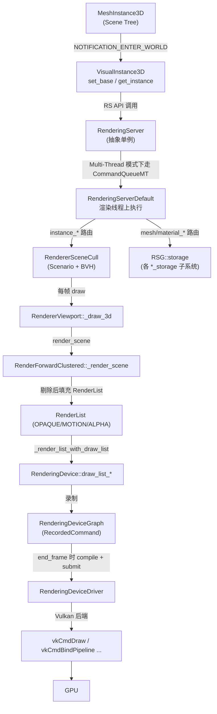
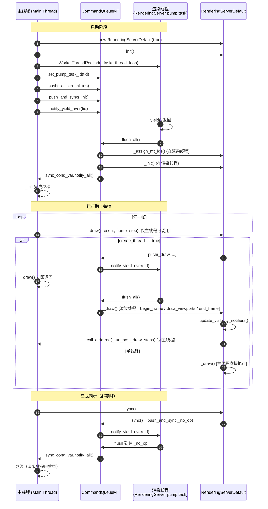
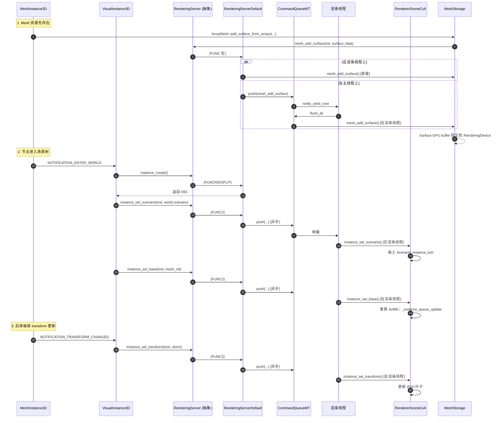
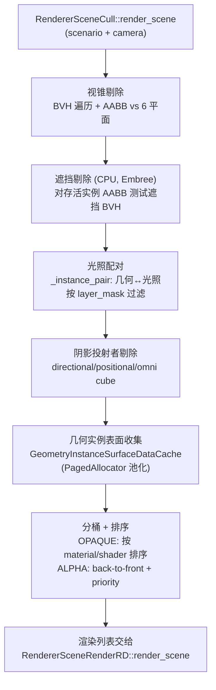
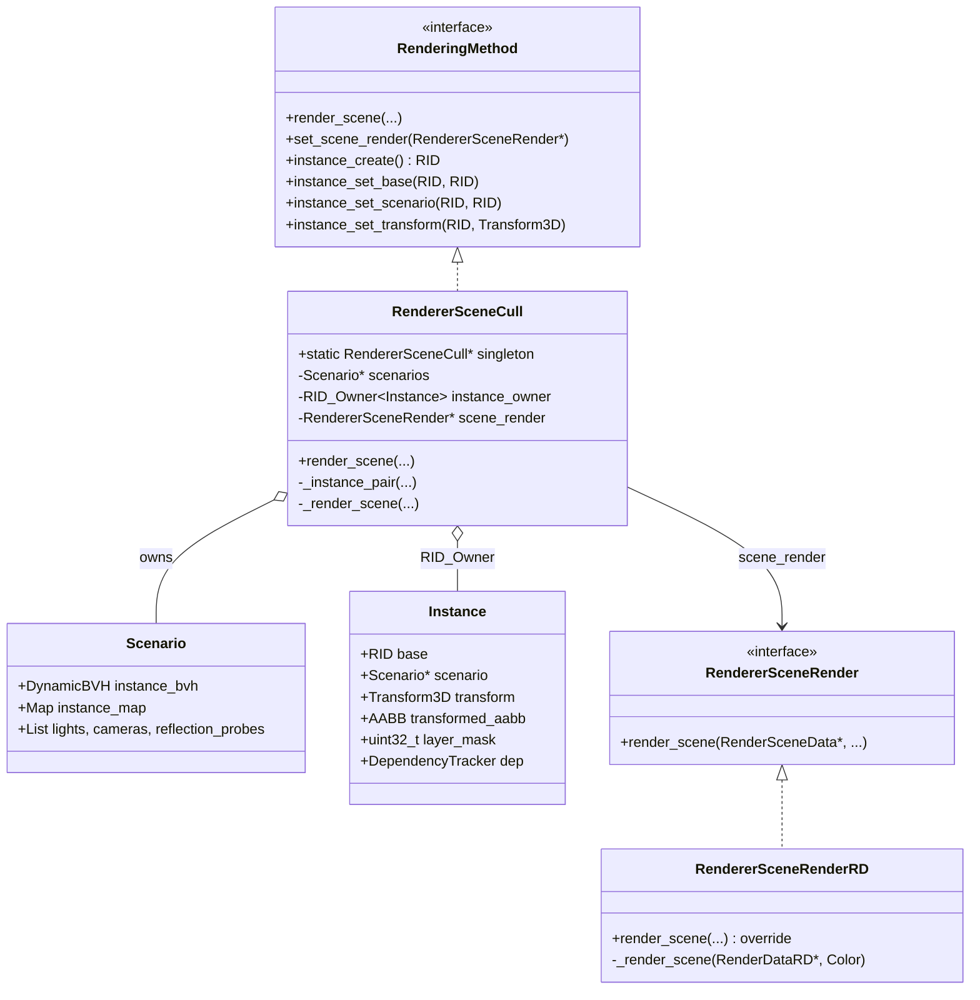
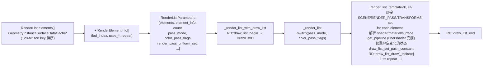
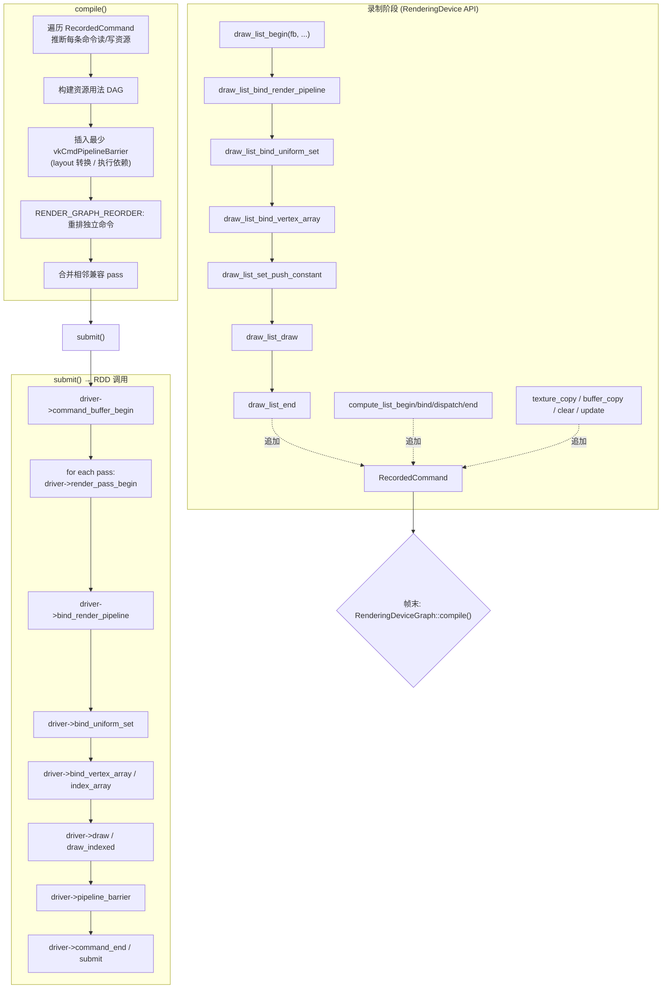
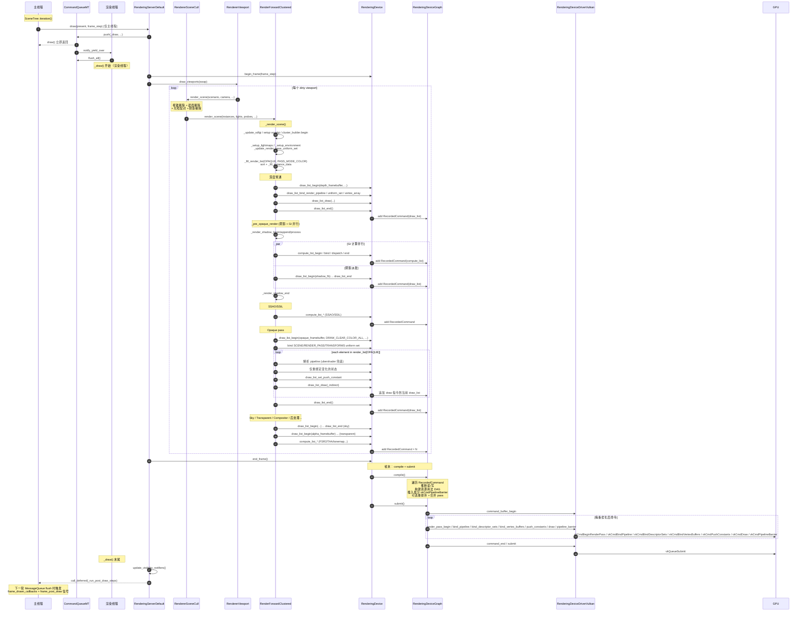

# Godot 4 渲染管线深度解析：从 MeshInstance3D 到 GPU 命令

> 本文系统解析 Godot Engine 4.x 如何将场景中的一个 3D 物体转换为最终调用底层图形 API（Vulkan / D3D12 / Metal）的渲染命令，特别关注**渲染线程为异步独立线程（Multi-Thread 模式）**时的跨线程协作机制。涉及 `RenderingServer`、`RendererSceneCull`、`RenderForwardClustered`（Forward+ 管线）、`RenderingDevice`（RD）、`RenderingDeviceGraph`（RDG）、`RenderingDeviceDriver`（RDD）等核心类型及其协作方式。

---

## 目录

- [一、思考与检索过程](#一思考与检索过程)
- [二、整体架构总览](#二整体架构总览)
- [三、渲染线程模型：同步 / 异步](#三渲染线程模型同步--异步)
- [四、阶段 1：MeshInstance3D 到 RenderingServer 的注册](#四阶段-1meshinstance3d-到-renderingserver-的注册)
- [五、阶段 2：RenderingServer 内部分发与数据存储](#五阶段-2renderingserver-内部分发与数据存储)
- [六、阶段 3：RendererSceneCull 剔除与渲染列表构建](#六阶段-3rendererscenecull-剔除与渲染列表构建)
- [七、阶段 4：Forward+ 管线 _render_scene 完整流程](#七阶段-4forward-管线-_render_scene-完整流程)
- [八、阶段 5：从 RenderList 到 RenderingDevice DrawList](#八阶段-5从-renderlist-到-renderingdevice-drawlist)
- [九、阶段 6：RenderingDeviceGraph (RDG) 编译与提交](#九阶段-6renderingdevicegraph-rdg-编译与提交)
- [十、阶段 7：RenderingDeviceDriver 到 vkCmd\* 的落地](#十阶段-7renderingdevicedriver-到-vkcmd-的落地)
- [十一、完整类图](#十一完整类图)
- [十二、端到端时序图（Multi-Thread 模式）](#十二端到端时序图multi-thread-模式)
- [十三、关键源码文件索引](#十三关键源码文件索引)
- [十四、参考资料](#十四参考资料)

---

## 一、思考与检索过程

为准确还原 Godot 4 的渲染链路，本次研究采用**并行子代理 + 直接源码核验**的策略，分四条独立线索展开检索，最后交叉比对。

### 1.1 检索线索划分

| 线索 | 目标 | 主要检索对象 |
|---|---|---|
| 线索 A | 渲染线程模型（同步/异步） | `RenderingServerDefault`、`CommandQueueMT`、`OS::RenderThreadMode`、`server_wrap_mt_common.h` 中的 `FUNC*` 宏族 |
| 线索 B | MeshInstance3D → RenderingServer 的注册路径 | `VisualInstance3D`、`RenderingServer` 抽象 API、RID 系统、`RendererSceneCull::Instance` |
| 线索 C | RenderingDevice (RD) 与 RenderingDeviceGraph (RDG) | `rendering_device.{h,cpp}`、`rendering_device_graph.{h,cpp}`、`rendering_device_driver.h`、各后端 driver |
| 线索 D | Forward+ (`RenderForwardClustered`) 渲染流程 | `render_forward_clustered.{h,cpp}`、`renderer_scene_render_rd.{h,cpp}`、`cluster_builder_rd.{h,cpp}` |

### 1.2 检索方法

1. **直接拉取官方 GitHub master 分支源码**：通过 `raw.githubusercontent.com/godotengine/godot/master/...` 拉取关键头文件与实现，逐行核验类声明、方法签名、宏定义。这是最权威的依据。
2. **官方文档**：`docs.godotengine.org` 上的 *Internal rendering architecture*、*Using servers*、*Renderers overview*、`RenderingDevice` / `RDShaderFile` 类文档。
3. **Godot 官方博客与演讲**：2024 年 *"GPU synchronization in Godot 4.3 is getting a major upgrade"*（介绍 RDG 的 DAG 重构）以及 Vulkanised 2024 Clay John 的演讲（揭示 RDG 带来约 10% 帧时间下降、60–80% 屏障减少）。
4. **DeepWiki / CodeFactor / Debian 源码镜像**：用于交叉核实行号与函数复杂度（例如 `uniform_set_create` 在 `rendering_device.cpp` L4354–4801 的复杂度块）。

### 1.3 关键澄清（研究中纠正的常见误解）

- **`OS::get_render_thread_id()` 在 Godot 4 现行 master 中不存在**。等价物是运行时比较 `Thread::get_caller_id() == RenderingServerDefault::server_thread`，对外封装为 `RenderingServer::is_on_render_thread()`。
- **"Unsafe" 与 "Safe" 在 `RenderingServerDefault` 层面都设 `create_thread = false`**——两者都在主线程渲染。"Unsafe" 已废弃；默认是 "Safe"（`RENDER_THREAD_SAFE`）。只有 "Separate"（`RENDER_SEPARATE_THREAD`）才真正启用独立渲染线程。
- **编辑器强制关闭独立渲染线程**（`main.cpp` 2768–2770）；多线程模式仅在导出项目中生效，且官方文档明确标注为"实验性"。
- **Forward+ 不是延迟渲染**，没有完整 G-Buffer。`normal_roughness` / `voxel_gi` 纹理是按需分配的"类 G-Buffer"数据，仅在 `PASS_MODE_DEPTH_NORMAL_ROUGHNESS_VOXEL_GI` 深度预通阶段写入。
- **用户问题中的 `RenderBufferDataCustom` 实际类名是 `RenderBufferCustomDataRD`**（抽象基类）；Forward+ 的具体子类是 `RenderBufferDataForwardClustered`。
- **Forward+ 中没有"活的" `_add_geometry` 方法**——唯一出现的位置（`render_forward_clustered.cpp:4410`）位于 `#if 0` 死代码内。等价逻辑是 `_geometry_instance_add_surface` / `_geometry_instance_update`。
- **Compatibility 渲染器完全绕过 RD/RDD/RDG 栈**，直接调用 OpenGL/GLES3。
- **`RenderingContextDriver` 与 `RenderingDeviceDriver` 的分工**对应 Vulkan 的 `VkInstance`/`VkPhysicalDevice`（context）与 `VkDevice`/`VkQueue`（device）；swapchain/呈现由 context 负责，资源创建与命令记录由 device 负责。

---

## 二、整体架构总览

Godot 4 的渲染系统自上而下可划分为 **6 层**。每一层都对上层隐藏下层细节，并通过 RID（资源 ID）这一值类型实现跨层引用。

```
┌──────────────────────────────────────────────────────────────┐
│  Layer 0: Scene Tree                                          │
│  MeshInstance3D / Node3D / VisualInstance3D / GeometryInstance3D │
└──────────────────────────────────────────────────────────────┘
                              │  (NOTIFICATION_ENTER_WORLD 等)
                              ▼
┌──────────────────────────────────────────────────────────────┐
│  Layer 1: RenderingServer (抽象 API 单例)                     │
│  instance_create / instance_set_base / instance_set_scenario  │
│  instance_set_transform / mesh_create / mesh_add_surface ...  │
└──────────────────────────────────────────────────────────────┘
                              │
                              ▼
┌──────────────────────────────────────────────────────────────┐
│  Layer 2: RenderingServerDefault (具体实现 + 线程分发)        │
│  ┌─────────────┐  ┌──────────────────┐  ┌─────────────────┐  │
│  │CommandQueueMT│  │ RendererViewport │  │ RendererSceneCull│ │
│  └─────────────┘  └──────────────────┘  └─────────────────┘  │
│         RSG::storage (mesh/material/light/texture 子存储)     │
└──────────────────────────────────────────────────────────────┘
                              │
                              ▼
┌──────────────────────────────────────────────────────────────┐
│  Layer 3: RendererSceneRenderRD (RD 渲染器基类)               │
│   ┌────────────────────┐    ┌────────────────────┐           │
│   │ RenderForwardCluster│    │ RenderForwardMobile │           │
│   │ (Forward+)          │    │ (Mobile)            │           │
│   └────────────────────┘    └────────────────────┘           │
└──────────────────────────────────────────────────────────────┘
                              │  draw_list_begin / draw_list_draw
                              ▼
┌──────────────────────────────────────────────────────────────┐
│  Layer 4: RenderingDevice (RD 公共 API，资源 RID 持有者)      │
│  DrawList / ComputeList / texture_create / render_pipeline... │
└──────────────────────────────────────────────────────────────┘
                              │
                              ▼
┌──────────────────────────────────────────────────────────────┐
│  Layer 5: RenderingDeviceGraph (RDG) 命令录制 + 屏障插入      │
│  RecordedCommand / BarrierGroup / compile() / submit()        │
└──────────────────────────────────────────────────────────────┘
                              │
                              ▼
┌──────────────────────────────────────────────────────────────┐
│  Layer 6: RenderingDeviceDriver (RDD) 抽象驱动接口            │
│   ┌──────────────────┐  ┌──────────────┐  ┌──────────────┐   │
│   │ DriverVulkan     │  │ DriverD3D12  │  │ DriverMetal  │   │
│   │  → vkCmd*        │  │  → ID3D12*   │  │  → MTL*      │   │
│   └──────────────────┘  └──────────────┘  └──────────────┘   │
│   RenderingContextDriver (swapchain/surface/present)          │
└──────────────────────────────────────────────────────────────┘
```

> Compatibility 渲染器（OpenGL/GLES3）从 Layer 2 直接跳到 GPU，绕过 Layer 3–6。

### 整体分层时序



---

## 三、渲染线程模型：同步 / 异步

### 3.1 三种线程模式

通过项目设置 `rendering/driver/threads/thread_model` 选择，对应 `OS::RenderThreadMode`（`core/os/os.h` L51–55）：

| 项目设置值 | 整数 | C++ 常量 | 显示名 | `create_thread` |
|---|---|---|---|---|
| 0 | `RENDER_THREAD_UNSAFE` | Unsafe（已废弃） | "Single Thread" | `false` |
| 1 | `RENDER_THREAD_SAFE` | Safe（**默认**） | "Single-Safe" | `false` |
| 2 | `RENDER_SEPARATE_THREAD` | Separate | "Multi-Thread" | `true` |

**关键事实**：`Unsafe` 与 `Safe` 在 `RenderingServerDefault` 层都设 `create_thread = false`，都把渲染跑在主线程。只有 `Separate` 才真正启用独立渲染线程。编辑器与 Project Manager 强制关闭多线程模式。

### 3.2 异步渲染线程的生命周期

`RenderingServerDefault` 的关键成员（`rendering_server_default.h` L80–85）：

```cpp
mutable CommandQueueMT command_queue;          // 跨线程命令队列
Thread::ID server_thread = Thread::MAIN_ID;    // 渲染线程 ID（默认主线程）
WorkerThreadPool::TaskID server_task_id = WorkerThreadPool::INVALID_TASK_ID;
bool exit = false;
bool create_thread = false;
```

`init()`（`rendering_server_default.cpp` L276–289）在 `create_thread == true` 时：

1. 主线程调用 `DisplayServer::release_rendering_thread()` 让出图形上下文；
2. 用 `WorkerThreadPool::add_task(..., "Rendering Server pump task", true)` 启动一个**长时低优先级任务**作为渲染线程；
3. `command_queue.set_pump_task_id(tid)`——让队列在 push 时能唤醒渲染线程；
4. `command_queue.push(this, &RenderingServerDefault::_assign_mt_ids, tid)`——在渲染线程上执行 ID 赋值；
5. `command_queue.push_and_sync(this, &RenderingServerDefault::_init)`——**主线程阻塞，直到渲染线程完成 `_init()`**。这是第一个"会合点"（rendezvous）。

渲染线程主循环 `_thread_loop()`（L415–424）：

```cpp
void RenderingServerDefault::_thread_loop() {
    DisplayServer::get_singleton()->gl_window_make_current(DisplayServerEnums::MAIN_WINDOW_ID);
    while (!exit) {
        WorkerThreadPool::get_singleton()->yield();   // 休眠，等待唤醒
        command_queue.flush_all();                    // 执行队列里所有命令
    }
    DisplayServer::get_singleton()->release_rendering_thread();
}
```

### 3.3 CommandQueueMT：命令队列机制

`CommandQueueMT`（`core/templates/command_queue_mt.h`）是一个受 `BinaryMutex` 保护的、动态增长的字节缓冲，存放**就地构造（placement-new）的 functor 命令对象**。

核心同步原语：

| 原语 | 类型 | 作用 |
|---|---|---|
| `mutex` | `BinaryMutex` | 串行化所有对 `command_mem`、`sync_head/tail` 的访问 |
| `sync_cond_var` | `ConditionVariable` | **会合点唤醒**：渲染线程处理完同步命令后 `notify_all()`，等待方在 `_wait_for_sync` 中 `wait()` |
| `pending` | `std::atomic<bool>` | 快速"队列非空"标志，`flush_if_pending()` 用 |
| `sync_head` / `sync_tail` | `uint32_t` | 已处理 / 已入队的同步命令计数；`_wait_for_sync` 据此判断自己等的命令是否完成 |
| `pump_task_id` | `WorkerThreadPool::TaskID` | 渲染线程身份，`_push_internal` 据此 `notify_yield_over` 唤醒它 |

三种 push 入口：

- `push(...)`：异步、fire-and-forget，调用方立即返回；
- `push_and_sync(...)`：同步、无返回值，调用方在 `sync_cond_var` 上阻塞直到渲染线程执行完该命令；
- `push_and_ret(...)`：同步、带回返回值，写入 `*r_ret` 后唤醒调用方。

### 3.4 `FUNC*` 宏族：每个 RS 调用如何被路由

`servers/server_wrap_mt_common.h` 提供宏，将 `RenderingServer` 的每个虚函数在 `RenderingServerDefault` 中生成为"运行时分发"实现。关键判断：

```cpp
#define ASYNC_COND_PUSH (Thread::get_caller_id() != server_thread)
```

- 若调用方**就是渲染线程**：先 `command_queue.flush_if_pending()` 排空他人塞进来的命令，再**直接同步调用**真实实现；
- 若调用方**不是渲染线程**（即主线程或 worker 线程）：将调用序列化为 `Command<T,M,...>` 塞进 `command_mem`，渲染线程稍后通过 `_flush()` 执行。

宏命名约定：

| 宏后缀 | 语义 |
|---|---|
| `FUNC<n>` | n 参，异步（fire-and-forget） |
| `FUNC<n>S` | n 参，同步（调用方阻塞，无返回值） |
| `FUNC<n>R` / `FUNC<n>RC` | n 参，同步带回返回值（RC 为 const 版） |
| `FUNCRIDSPLIT` | 创建 RID：调用方先分配 RID，再通过队列异步 `*_initialize` |
| `FUNCRIDTEX<n>` | 纹理 RID 专用变体，尊重 `can_create_resources_async()` |

DEBUG 模式下，若主线程触发 `FUNC<n>S/RC`，宏 `MAIN_THREAD_SYNC_CHECK` 会打印告警 *"Call to X causing RenderingServer synchronizations on every frame. This significantly affects performance."*——提示用户该调用每帧阻塞主线程。

### 3.5 三种"会合"机制

Godot 4 中并不存在名为 "rendezvous" 的类/方法，但通过 `CommandQueueMT` 实现了等价语义：

| 会合点 | 触发方式 | 阻塞方 |
|---|---|---|
| (a) `command_queue.sync()` | `RenderingServer::sync()` 显式调用 | 主线程阻塞直到渲染线程排空队列（push 一个 no-op 同步命令） |
| (b) `push_and_ret` / `push_and_sync` | 任何 `FUNC<n>R/S/RC` 宏 | 主线程阻塞到该具体命令执行完 |
| (c) 帧末 `_run_post_draw_steps` 经 `call_deferred` 回主线程 | `_draw()` 末尾 | 单向 hand-off，渲染线程不等主线程 |

### 3.6 渲染线程模型时序图



---

## 四、阶段 1：MeshInstance3D 到 RenderingServer 的注册

### 4.1 场景侧类层次

```
Object → Node → Node3D → VisualInstance3D → GeometryInstance3D → MeshInstance3D
```

- `VisualInstance3D`（`scene/3d/visual_instance_3d.{h,cpp}`）是"场景图结束、RenderingServer 开始"的边界。官方文档原话：*"VisualInstance3D is the node representation of the RenderingServer instance."*
- 关键方法：`set_base(RID)`（绑定资源 RID）、`get_instance() → RID`（返回由 `instance_create()` 创建的实例 RID）。

### 4.2 注册时机：通过 Node 通知

`MeshInstance3D` / `VisualInstance3D` 响应以下通知：

| 通知 | 行为 |
|---|---|
| `NOTIFICATION_ENTER_WORLD` | `RS::instance_create()` 创建实例 RID；`instance_set_scenario(inst, world3d.scenario)`；`instance_set_base(inst, mesh->get_rid())`；推送 surface override material / cast shadow / GI mode 等 |
| `NOTIFICATION_TRANSFORM_CHANGED` | `instance_set_transform(inst, get_global_transform())` |
| `NOTIFICATION_VISIBILITY_CHANGED` | `instance_set_visible(inst, is_visible_in_tree())` |
| `NOTIFICATION_EXIT_WORLD` | `RS::free_rid(inst)`（mesh RID 由 `Mesh` 资源所有，资源释放时回收） |

### 4.3 RID 系统

`RID`（`core/rid.h`）是**值类型**，本质是一个不透明 ID + owner 提示，**不是指针**。`RenderingServer` 完全不透明：调用方只持有 RID，服务器内部用 `RID_Owner<T>` 模板（`core/templates/rid_owner.h`）维护 RID → 内部对象的映射。

各存储子系统各自维护自己的 `RID_Owner`：
- `MeshStorage` 持有 `RID_Owner<Mesh>`
- `MaterialStorage` 持有 `RID_Owner<Material>`
- `LightStorage` 持有 `RID_Owner<Light>`
- `RendererSceneCull` 持有 `RID_Owner<Instance>`

生命周期约定：`*_create()` → 返回 RID → `*_set_*()` 配置 → `free_rid(RID)` 释放。

### 4.4 关键 RenderingServer API

```cpp
class RenderingServer : public Object {
public:
    virtual RID  mesh_create() = 0;
    virtual void mesh_add_surface(RID p_mesh, const SurfaceData &p_surface) = 0;
    virtual RID  instance_create() = 0;
    virtual void instance_set_base(RID p_instance, RID p_base) = 0;
    virtual void instance_set_scenario(RID p_instance, RID p_scenario) = 0;
    virtual void instance_set_transform(RID p_instance, const Transform3D &p_transform) = 0;
    virtual void draw(bool p_swap_buffers, double p_frame_step) = 0;
    ...
};
```

| 方法 | 内部路由 | 触及数据结构 |
|---|---|---|
| `mesh_create()` | `RSG::mesh_storage->mesh_allocate()` + `mesh_initialize()` | 在 `RID_Owner<Mesh>` 中新增条目 |
| `mesh_add_surface(mesh, surface)` | `RSG::mesh_storage->mesh_add_surface(...)` | 追加一个 `Mesh::Surface`（顶点/索引 buffer RID、format、material RID、AABB、primitive） |
| `instance_create()` | `RSG::scene->instance_create()` | 在 `RendererSceneCull` 的 `RID_Owner<Instance>` 中新建 `Instance` |
| `instance_set_base(inst, base)` | `RSG::scene->instance_set_base()` | 设置 `Instance::base`，重算实例 AABB，调度 BVH 重插入与依赖重新配对 |
| `instance_set_scenario(inst, scen)` | `RSG::scene->instance_set_scenario()` | 从旧 Scenario BVH 移除，插入新 `Scenario::instance_bvh` |
| `instance_set_transform(inst, xform)` | `RSG::scene->instance_set_transform()` | 更新 `Instance::transform` 与变换后 AABB，标记 dirty |

### 4.5 注册时序图



---

## 五、阶段 2：RenderingServer 内部分发与数据存储

### 5.1 RenderingServerGlobals (RSG)

`RenderingServerDefault` 不直接存数据，而是通过全局命名空间 `RSG`（`rendering_server_globals.h`）持有子系统单例：

```cpp
class RenderingServerGlobals {
public:
    static RendererCompositor *rasterizer;
    static RendererSceneRender *scene_render;     // RenderForwardClustered 等
    static RendererCanvasRender *canvas_render;
    static RenderingStorage *storage;             // 各 *_storage 子系统
    static RenderingDevice *rendering_device;
    static RendererCanvasCull *canvas;
    static RendererViewport *viewport;
    static RenderingMethod *scene;                // = RendererSceneCull
    static RendererGI *gi;
    static RendererFog *fog;
    static bool threaded;                          // = create_thread
};
```

### 5.2 内部数据结构

**`RendererSceneCull::Instance`**（`renderer_scene_cull.h`）：每个 `instance_create()` 对应一个，持有：

- `base`（资源 RID）、`scenario`（Scenario*）
- `transform`、`transformed_aabb`
- `layer_mask`、`visibility` / `visibility_parent`
- `cast_shadows`、`gi_mode`、`lightmap_*`
- `DependencyTracker`：当 mesh / material 变化时通知本实例
- 几何↔光照配对数据

**`RendererSceneCull::Scenario`**：每个 `scenario_create()` 对应一个，持有：

- `instance_bvh`（`DynamicBVH`，存放实例 AABB）
- 实例映射表
- 已注册的 light / camera / reflection_probe 列表
- 阴影投射者索引

### 5.3 `_draw()` 渲染管线（在渲染线程上执行）

`RenderingServerDefault::draw(p_present, frame_step)`（`rendering_server_default.cpp` L443）：

- 只允许主线程调用；
- Multi-Thread 模式下 `command_queue.push(this, &_draw, ...)`，**主线程立即返回**；
- 单线程模式下直接 `_draw()`。

`_draw()`（L76–213）在渲染线程上执行：

1. `RSG::rasterizer->begin_frame(frame_step)`——开始帧；
2. `XRServer::pre_render()`（XR 钩子）；
3. `RSG::scene->update()` / `RSG::canvas->update()`——场景/2D 状态更新；
4. `RSG::particles_storage->update_particles()`；
5. `RSG::scene->render_probes()`；
6. **`RSG::viewport->draw_viewports(p_swap_buffers)`**——视口实际 GPU 绘制入口；
7. `RSG::canvas_render->update()`；
8. **`RSG::rasterizer->end_frame(p_swap_buffers)`**——swap buffer 在此发生；
9. `XRServer::end_frame()`；
10. `update_visibility_notifiers()`（canvas + scene）——**仍在渲染线程**，通知场景系统物体进出视锥；
11. `_run_post_draw_steps()`——通过 `call_deferred()` 回到主线程触发 `frame_drawn_callbacks` 与 `frame_post_draw` 信号。

---

## 六、阶段 3：RendererSceneCull 剔除与渲染列表构建

### 6.1 入口：`RendererViewport::_draw_3d`

`RenderingServer::draw()` → `RSG::viewport->draw_viewports()` → 对每个 dirty viewport 调用 `_draw_3d()` → `RendererSceneCull::render_scene()`。

### 6.2 剔除流程



**Forward+ 的特殊性**：Forward+ **不需要**传统前向渲染的 per-mesh 光照配对——灯光通过 cluster buffer 在 shader 中查找。源码佐证：`renderer_scene_cull.h:1019` 注释 *"used in traditional forward, unnecessary on clustered"*，且 `RenderForwardClustered::get_max_lights_per_mesh()` 返回 0。

### 6.3 `RenderSceneData` 与 `RenderDataRD`

`RendererSceneRender::render_scene(RenderSceneData *p_render_data, ...)`（`renderer_scene_render.h:118`）接收每帧场景描述：

- `RenderSceneData`：相机 transform / projection / view count（立体/XR）/ 逆 view-proj / time / delta / 阴影 cascade 信息等；
- `RendererSceneRenderRD::render_scene()`（`renderer_scene_render_rd.cpp:1359`）构造 `RenderSceneDataRD` + `RenderDataRD`，再调虚函数 `_render_scene(&render_data, clear_color)`。

### 6.4 类关系图：剔除层



---

## 七、阶段 4：Forward+ 管线 `_render_scene` 完整流程

### 7.1 类与文件

- `RenderForwardClustered`（`servers/rendering/renderer_rd/forward_clustered/render_forward_clustered.{h,cpp}`）继承 `RendererSceneRenderRD`；
- 命名空间 `RendererSceneRenderImplementation`；
- 单例 `static RenderForwardClustered *singleton`；
- shader 搭档：`SceneShaderForwardClustered` + GLSL `scene_forward_clustered.glsl`。

关键嵌套类型：

| 类型 | 作用 |
|---|---|
| `RenderBufferDataForwardClustered` | per-viewport 缓冲数据，持有 `ClusterBuilderRD*`、SSEffectsData、按需分配的 specular / normal_roughness / voxel_gi 纹理 |
| `GeometryInstanceForwardClustered` | 继承 `RenderGeometryInstanceBase`，per-instance 渲染数据 |
| `GeometryInstanceSurfaceDataCache` | per-surface 缓存绘制数据，含 128-bit sort key |
| `RenderList` | 渲染元素列表 + 排序方法 |
| `RenderElementInfo` | 打包的 per-element 信息（lod_index、各 uses_* 标志、repeat 计数） |

枚举：

- `RenderListType { RENDER_LIST_OPAQUE, RENDER_LIST_MOTION, RENDER_LIST_ALPHA, RENDER_LIST_SECONDARY, RENDER_LIST_MAX }`
- `PassMode { PASS_MODE_COLOR, PASS_MODE_SHADOW, PASS_MODE_SHADOW_DP, PASS_MODE_DEPTH, PASS_MODE_DEPTH_NORMAL_ROUGHNESS, PASS_MODE_DEPTH_NORMAL_ROUGHNESS_VOXEL_GI, PASS_MODE_DEPTH_MATERIAL, PASS_MODE_SDF }`
- `ColorPassFlags { COLOR_PASS_FLAG_TRANSPARENT, COLOR_PASS_FLAG_SEPARATE_SPECULAR, COLOR_PASS_FLAG_MULTIVIEW, COLOR_PASS_FLAG_MOTION_VECTORS }`

### 7.2 单帧渲染步骤（`_render_scene` @ `render_forward_clustered.cpp:1704`）

```mermaid
flowchart TD
    S0["1. SDFGI 更新<br/>_update_sdfgi"]
    S1["2. VoxelGI 渲染索引 + gi.setup_voxel_gi_instances<br/>SDFGI update_cascades/pre_process_gi/update_light"]
    S2["3. ClusterBuilder.begin()<br/>lights/decals/probes 通过 setup_added_* 回调填入"]
    S3["4. VRS 更新"]
    S4["5. _setup_lightmaps / _setup_voxelgis / _setup_environment<br/>_update_render_base_uniform_set"]
    S5["6. _fill_render_list(OPAQUE, PASS_MODE_COLOR)<br/>sort_by_key (OPAQUE/MOTION)<br/>sort_by_reverse_depth_and_priority (ALPHA)<br/>_fill_instance_data"]
    S6["7. 深度预通<br/>PASS_MODE_DEPTH[_NORMAL_ROUGHNESS][_VOXEL_GI]<br/>与 _post_prepass_render GI 计算并行"]
    S7["8. MSAA 深度/normal_roughness/voxelgi 解析"]
    S8["9. Pre-opaque compositor effects"]
    S9["10. _pre_opaque_render:<br/>阴影 begin/append/process + GI process_gi 并行<br/>阴影 end 派发 draw list<br/>SSAO / SSIL / SSR 缓冲"]
    S10["11. Opaque pass<br/>PASS_MODE_COLOR via _render_list_with_draw_list"]
    S11["12. Motion pass (若 using_motion_pass)"]
    S12["13. Post-opaque compositor + 可选 MSAA resolve"]
    S13["14. VoxelGI/SDFGI probe 调试绘制"]
    S14["15. Sky pass<br/>RD::draw_list_begin → sky.draw_sky → draw_list_end"]
    S15["16. MSAA resolve (color/specular/depth)"]
    S16["17. Post-sky compositor"]
    S17["18. SSS + merge_specular"]
    S18["19. Screen/Depth backbuffer copy<br/>(供 SCREEN_TEXTURE/DEPTH_TEXTURE)"]
    S19["20. Pre-transparent compositor"]
    S20["21. Transparent pass<br/>PASS_MODE_COLOR + COLOR_PASS_FLAG_TRANSPARENT"]
    S21["22. 最终 MSAA resolve (color/depth/velocity)"]
    S22["23. 拷贝给 SSIL/SSR"]
    S23["24. Post-transparent compositor"]
    S24["25. Temporal upscale<br/>FSR2 / MetalFX Temporal / TAA"]
    S25["26. _debug_draw_cluster"]
    S26["27. Tonemap / 后处理<br/>_render_buffers_post_process_and_tonemap"]
    S27["28. _render_buffers_debug_draw + SDFGI 调试"]

    S0 --> S1 --> S2 --> S3 --> S4 --> S5 --> S6 --> S7
    S7 --> S8 --> S9 --> S10 --> S11 --> S12 --> S13 --> S14
    S14 --> S15 --> S16 --> S17 --> S18 --> S19 --> S20 --> S21
    S21 --> S22 --> S23 --> S24 --> S25 --> S26 --> S27
```



### 7.3 阴影渲染（`_render_shadows` 系列）

四个方法协作：

- `_render_shadow_begin()`（L2796）：清空 `scene_state.shadow_passes`、清空 `render_list[RENDER_LIST_SECONDARY]`；
- `_render_shadow_append(...)`（L2806）：每光源配置 `RenderSceneDataRD`、`_setup_environment`、选 `PASS_MODE_SHADOW` 或 `_SHADOW_DP`（omni cube 用 dual-paraboloid）、`_fill_render_list(SECONDARY, ..., append=true)`、`sort_by_key_range`、`_fill_instance_data`、push 一条 `SceneState::ShadowPass`；
- `_render_shadow_process()`（L2882）：flush secondary instance buffer，为每个排队阴影 pass 构建 render-pass uniform set；让 GPU 在无屏障情况下与 GI 计算并行；
- `_render_shadow_end()`（L2898）：为每个 `ShadowPass` 构建 `RenderListParameters` 指向 secondary 列表对应区段，调 `_render_list_with_draw_list`。

编排发生在 `_pre_opaque_render`（L1517）：

1. 将 `render_shadows` 拆分为 `directional_shadows` / `shadows`(positional) / `cube_shadows`(omni)；
2. cube 阴影立即渲染；
3. `_render_shadow_begin` → 顺序 append directional / positional → `_render_shadow_process`；
4. **并行**调用 `gi.process_gi(...)`；
5. `_render_shadow_end` 真正派发阴影 draw list；
6. `_process_ssao` → `_process_ssil` → SSR last-frame buffer 准备。

### 7.4 Cluster 构建（Forward+ 的"Cluster"）

- 文件：`servers/rendering/renderer_rd/cluster_builder_rd.{h,cpp}`；
- 类：`ClusterBuilderSharedDataRD`（多视口共享，含球/锥/盒几何 VBO/IBO）+ `ClusterBuilderRD`（per-viewport / per-probe）；
- 元素类型：`ELEMENT_TYPE_OMNI_LIGHT / SPOT_LIGHT / AREA_LIGHT / DECAL / REFLECTION_PROBE`；
- 默认上限 **512 个 cluster 元素**（`RendererSceneRenderRD::max_cluster_elements = 512`，可通过项目设置 *Rendering → Limits → Cluster Builder → Max Clustered Elements* 调整）；
- 几何：球（omni 与宽角度 spot）、锥（spot）、盒（reflection probe / decal / area light）。

API：`begin(view, proj, flip_y)` → `add_light(...)` / `add_box(...)` → `bake_cluster()` → `get_cluster_buffer()`。

shader：`cluster_render.glsl`（光栅化几何写 per-cell bitmask）+ `cluster_store.glsl`（打包成 3D 纹理供场景 shader 查找）+ `cluster_debug.glsl`。

### 7.5 RenderList 与排序

`RenderList` 结构（`render_forward_clustered.h:683–737`）：

```cpp
struct RenderList {
    LocalVector<GeometryInstanceSurfaceDataCache*> elements;
    LocalVector<RenderElementInfo> element_info;
    void sort_by_key();                       // OPAQUE/MOTION
    void sort_by_key_range(uint32_t from, uint32_t size);
    void sort_by_depth();                     // shadow
    void sort_by_reverse_depth_and_priority(); // ALPHA: back-to-front
    void add_element(GeometryInstanceSurfaceDataCache*);
};
RenderList render_list[RENDER_LIST_MAX];
```

**128-bit sort key**（`sort_key1`, `sort_key2`）按以下顺序打包，最小化 shader/material/geometry 重绑：

```
priority(8) | material_id_lo(24) | shader_id(32) | material_id_hi(8)
| geometry_id(32) | depth_layer(4) | surface_index(8)
| lod_index(8) | uses_softshadow(1) | uses_projector(1)
| uses_forward_gi(1) | uses_lightmap(1)
```

`_fill_render_list`（L921）流程：

1. 清空列表（OPAQUE 同时清空 MOTION + ALPHA）；
2. `_update_dirty_geometry_instances()`；
3. 对 `p_render_data->instances` 中每个 `GeometryInstanceForwardClustered*`：计算 depth / depth_layer、设置 GI 标志、遍历 `surface_caches` 链表，按 `FLAG_PASS_DEPTH/OPAQUE/ALPHA/SHADOW` 推入对应 RenderList。

`_fill_instance_data`（L806，对应"用户问题中的 `_fill_element_info`"）：遍历 `elements[]` 写入匹配的 `RenderElementInfo`，并把 `SceneState::InstanceData`（transform/AABB/uv_scale/flags/gi_offset/layer_mask/prev_transform/lightmap_uv_scale）写入 GPU `instance_buffer[p_render_list]`。**相邻相同元素会被合并（`repeat` 计数）**，`_render_list_template` 据此 `i += element_info.repeat - 1` 跳过。

---

## 八、阶段 5：从 RenderList 到 RenderingDevice DrawList

### 8.1 两层路径

**Layer 1：`_render_list_with_draw_list`**（L682）——打开 draw list、调模板、关闭：

```cpp
void RenderForwardClustered::_render_list_with_draw_list(
        RenderListParameters *p_params, RID p_framebuffer,
        BitField<RD::DrawFlags> p_draw_flags, ...) {
    RD::FramebufferFormatID fb_format = RD::get_singleton()->framebuffer_get_format(p_framebuffer);
    p_params->framebuffer_format = fb_format;
    RD::DrawListID draw_list = RD::get_singleton()->draw_list_begin(
        p_framebuffer, p_draw_flags, p_clear_color_values, ...);
    _render_list(draw_list, fb_format, p_params, 0, p_params->element_count);
    RD::get_singleton()->draw_list_end();
}
```

**Layer 2：`_render_list` → `_render_list_template<PassMode, ColorPassFlags>`**（L305）——`_render_list` 根据 `pass_mode` + `color_pass_flags` switch 到对应模板特化。模板内部：

1. **绑定三个全局 uniform set 一次**：
   - `SCENE_UNIFORM_SET`(0)：`render_base_uniform_set`
   - `RENDER_PASS_UNIFORM_SET`(1)：`p_params->render_pass_uniform_set`
   - `TRANSFORMS_UNIFORM_SET`(2)：`scene_shader.default_vec4_xform_uniform_set`
2. 遍历 `elements[i]` + `element_info[i]`：
   - 选 material uniform set / shader / mesh surface（shadow pass 用 `shader_shadow`/`surface_shadow`/`material_uniform_set_shadow`；color pass 用 `surf->shader`/`surf->material`/`surf->surface`）；
   - 解析 cull variant（`CULL_VARIANT_NORMAL/REVERSED/DOUBLE_SIDED`，`surf->owner->mirror XOR p_params->reverse_cull`）；
   - 构建 `ShaderData::PipelineKey`（primitive / version 由 PassMode 决定 / color_pass_flags / vertex_format / framebuffer_format / wireframe / ubershader / cull_mode / shader_specialization）；
   - `shader->pipeline_hash_map.get_pipeline(key, hash, ...)`，**带 ubershader 兜底**（最多 2 次：先特化，失败回退 ubershader）；
   - **仅重绑定变化的状态**（`prev_vertex_array_rd` / `prev_index_array_rd` / `prev_xforms_uniform_set` / `prev_material_uniform_set` / `prev_pipeline_hash`）：
     ```cpp
     draw_list_bind_vertex_array(draw_list, vertex_array_rd);
     draw_list_bind_index_array(draw_list, index_array_rd);
     draw_list_bind_render_pipeline(draw_list, pipeline_rd);
     draw_list_bind_uniform_set(draw_list, xforms_uniform_set, TRANSFORMS_UNIFORM_SET);
     draw_list_bind_uniform_set(draw_list, material_uniform_set, MATERIAL_UNIFORM_SET /*=3*/);
     draw_list_set_push_constant(draw_list, &push_constant, push_constant_size);
     ```
   - 派发：
     ```cpp
     RD::get_singleton()->draw_list_draw(draw_list, index_array_rd.is_valid(), instance_count);
     // 或 multimesh indirect:
     RD::get_singleton()->draw_list_draw_indirect(draw_list, index_array_rd.is_valid(), cmd_buffer_rid, offset, 1, 0);
     ```
   - 跳过合并的重复：`i += element_info.repeat - 1;`

### 8.2 RenderList → DrawList 路径图



---

## 九、阶段 6：RenderingDeviceGraph (RDG) 编译与提交

### 9.1 RenderingDevice (RD) 公共 API

- 文件：`servers/rendering/rendering_device.{h,cpp}`；
- 单例：`RenderingServer::get_rendering_device()`；
- 内部指针（`rendering_device.h` L67–91）：
  - `RenderingContextDriver *context`——OS/windowing surface、设备枚举；
  - `RenderingDeviceDriver *driver`——活跃后端；
  - `RenderingContextDriver::Device device`——选定的物理设备；
- **线程守卫**：每个录制 GPU 工作的方法都用 `ERR_RENDER_THREAD_GUARD()` 包裹——公共录制 API 仅限渲染线程调用；
- Headless 模式或 Compatibility 渲染器**不创建** RenderingDevice。

### 9.2 关键 API 分类

| 类别 | 关键方法 |
|---|---|
| 资源创建 | `texture_create[_shared/from_extension]`, `buffer_create`, `shader_create_from_spirv`, `uniform_set_create`, `render_pipeline_create`, `compute_pipeline_create`, `framebuffer_create`, `vertex_array_create`, `index_array_create`, `sampler_create` |
| Draw list（图形） | `draw_list_begin`, `draw_list_bind_render_pipeline`, `draw_list_bind_uniform_set`, `draw_list_bind_vertex_array`, `draw_list_set_push_constant`, `draw_list_draw`, `draw_list_enable_scissor`, `draw_list_disable_scissor`, `draw_list_switch_to_next_pass`, `draw_list_end` |
| Compute list | `compute_list_begin`, `compute_list_bind_compute_pipeline`, `compute_list_bind_uniform_set`, `compute_list_set_push_constant`, `compute_list_dispatch`, `compute_list_dispatch_threads`, `compute_list_add_barrier`, `compute_list_end` |
| Barrier/Copy | `barrier_create`, `buffer_copy`, `buffer_get_data`, `texture_copy`, `texture_clear`, `texture_update`, `texture_resolve_multisample` |
| 帧 | `screen_prepare_for_drawing`, `begin_frame`, `end_frame`, `submit`（驱动 RDG compile + replay） |

### 9.3 Shader 编译链

```
.glsl 文件 (带 #[compute]/#[vertex]/#[fragment] 标记)
  → RDShaderFile (rendering_device_binds.{h,cpp})
  → RDShaderSPIRV (per-stage PackedByteArray: bytecode_vertex/fragment/compute/...)
  → rd.shader_create_from_spirv(spirv) → RID
  → driver 侧: RenderingShaderContainer* (e.g. RenderingShaderContainerVulkan 包成 VkShaderModule；
                D3D12 经 d3d12_godot_nir_bridge 转 DXIL/NIR)
```

### 9.4 RenderingDeviceGraph (RDG)

- 文件：`servers/rendering/rendering_device_graph.{h,cpp}`；
- 在 **Godot 4.3** 引入（PR #84976），把命令录制改造为**有向无环图（DAG）**；
- 设计目标：让上层只关心"做什么"，由图自动插入**最少**的 pipeline/memory barrier；
- 性能收益（Vulkanised 2024 Clay John）：约 10% 帧时间下降、60–80% 屏障减少。

**核心数据结构**：

- `RecordedCommand`：一条录制命令，跟踪 `normalization_barrier_index` / `transition_barrier_index` 等资源用法索引；
- `DrawListInstruction` / `ComputeListInstruction`：通过 `_allocate_draw_list_instruction` 等就地分配；
- `BarrierGroup`（`rendering_device_graph.h:609`）：收集需一起 flush 的屏障；
- 编译开关（`rendering_device.cpp`）：`RENDER_GRAPH_REORDER` 控制自动重排序。

**资源用法追踪**：图自动推断每条命令读/写哪些 texture/buffer；对**从不更新的不可变资源**用更便宜的状态追踪——约只有 10% 资源需要全量追踪。

### 9.5 帧录制模型

1. `begin_frame` / `frame.begin()` 在渲染线程开启帧录制；
2. 渲染器（如 `RenderForwardClustered`）发出一连串 `draw_list_begin → bind_render_pipeline → bind_uniform_set → bind_vertex_array → draw_list_draw → draw_list_end`，与 `compute_list_*` 交错，外加 texture/buffer copy/clear/update；
3. **这些都不直接走 Vulkan**，而是作为 `RecordedCommand` 追加到 `RenderingDeviceGraph`；
4. 帧末 `RenderingDeviceGraph::compile()`：
   - 按提交顺序遍历每条 `RecordedCommand`；
   - 查找每条命令读/写的 texture/buffer（input attachment / sampled texture / storage buffer/image / color attachment / depth / storage）；
   - 构建**资源用法 DAG**；
   - 仅在实际需要 layout 转换或执行依赖处插入 `vkCmdPipelineBarrier`；
   - 若 `RENDER_GRAPH_REORDER` 开启，对独立命令重排序；
   - 合并相邻兼容 pass（触碰相同 attachment 的连续 pass 等）；
5. `RenderingDeviceGraph::submit()` 将优化后的命令流回放为 RDD 调用：`command_buffer_begin` → 每个 pass：`render_pass_begin` → `bind_render_pipeline` → `bind_uniform_set` → `bind_vertex_array` → `draw` → ...

### 9.6 注意：RDG vs 资源依赖图

`RenderingDevice` 内部还维护**另一个**图——**资源所有权依赖图**（不是 RDG）：

- `dependency_map`（`rendering_device.h:122-127`）：资源 RID → 依赖它的子 RID 集合；
- `reverse_dependency_map`：资源 RID → 它依赖的父 RID 集合；
- 用途：`free_rid(p_shader)` 时自动级联释放派生对象（pipeline、uniform set、shader module）。

这与每帧用于 GPU 同步的 RDG 是**两套独立机制**。

### 9.7 RDG 编译提交流程图



---

## 十、阶段 7：RenderingDeviceDriver 到 `vkCmd*` 的落地

### 10.1 RDD 抽象（4.2+ 引入）

`RenderingDeviceDriver`（`servers/rendering/rendering_device_driver.h`）是抽象驱动接口，使用**不透明 ID 类型**（`BufferID`, `TextureID`, `ShaderID`, `PipelineID`, `RenderPassID`, `FramebufferID`, `UniformSetID` 等）——**RDD 不感知 RID**，RID 是 `RenderingDevice` 的职责。

各后端实现位于 `drivers/<backend>/`：

| 后端 | Context | Device Driver | Shader Container |
|---|---|---|---|
| Vulkan | `rendering_context_driver_vulkan` | `RenderingDeviceDriverVulkan` | `RenderingShaderContainerVulkan` |
| D3D12 | `rendering_context_driver_d3d12` | `RenderingDeviceDriverD3D12` | `RenderingShaderContainerD3D12`（经 `d3d12_godot_nir_bridge` SPIR-V→DXIL/NIR） |
| Metal | `rendering_context_driver_metal` | `RenderingDeviceDriverMetal` | `RenderingShaderContainerMetal` |

Vulkan driver 还使用 **VMA (Vulkan Memory Allocator)** 管理内存，DEBUG 构建中维护一个 GPU 写入的循环 breadcrumb buffer 用于定位崩溃前最后一条命令。

### 10.2 端到端：高层 draw 到 `vkCmdDraw` 的映射

```
SceneTree / Nodes
   │
RenderingServer                          (servers/rendering_server.{h,cpp})
   │
RendererCompositor → RenderForwardClustered / RenderForwardMobile   (servers/rendering/renderer_rd/)
   │
RenderingDevice                          (servers/rendering/rendering_device.{h,cpp})  ← 公共 RD API + RID 持有
   │
RenderingDeviceGraph (RDG)               (servers/rendering/rendering_device_graph.{h,cpp})  ← 命令录制 + 屏障
   │
RenderingDeviceDriver (RDD) 抽象          (servers/rendering/rendering_device_driver.h)
   │
RenderingContextDriver + DriverVulkan    (drivers/vulkan/)
   │
vkCmd* / Vulkan loader / GPU
```

`RenderingDeviceDriverVulkan` 内部对应关系：

| RDD 调用 | Vulkan 调用 |
|---|---|
| `command_buffer_begin/end` | `vkBeginCommandBuffer` / `vkEndCommandBuffer` |
| `render_pass_begin` | `vkCmdBeginRenderPass` 或 `vkCmdBeginRendering`（dynamic rendering） |
| `bind_render_pipeline` | `vkCmdBindPipeline(VK_PIPELINE_BIND_POINT_GRAPHICS, ...)` |
| `bind_compute_pipeline` | `vkCmdBindPipeline(VK_PIPELINE_BIND_POINT_COMPUTE, ...)` |
| `bind_uniform_set` | `vkCmdBindDescriptorSets` |
| `bind_vertex_array` | `vkCmdBindVertexBuffers` |
| `bind_index_array` | `vkCmdBindIndexBuffer` |
| `set_push_constant` | `vkCmdPushConstants` |
| `draw` | `vkCmdDraw` |
| `draw_indexed` | `vkCmdDrawIndexed` |
| `dispatch` | `vkCmdDispatch` |
| `pipeline_barrier` | `vkCmdPipelineBarrier`（含 `VkImageMemoryBarrier` / `VkBufferMemoryBarrier` / `VkMemoryBarrier`） |
| `end_render_pass` | `vkCmdEndRenderPass` / `vkCmdEndRendering` |
| (queue submit 由 RenderingContextDriverVulkan) | `vkQueueSubmit` / `vkQueuePresentKHR` |

---

## 十一、完整类图

```mermaid
classDiagram
    direction TB

    %% Scene 层
    class Node3D {
        +Transform3D transform
        +set_transform(Transform3D)
    }
    class VisualInstance3D {
        +set_base(RID)
        +get_instance() RID
        +get_base() RID
    }
    class GeometryInstance3D {
        +set_material_override(RID)
        +set_cast_shadows(ShadowCasting)
        +set_gi_mode(GIMode)
    }
    class MeshInstance3D {
        +set_mesh(Ref~Mesh~)
    }
    Node3D <|-- VisualInstance3D
    VisualInstance3D <|-- GeometryInstance3D
    GeometryInstance3D <|-- MeshInstance3D

    %% RenderingServer 抽象
    class RenderingServer {
        <<abstract>>
        +mesh_create() RID
        +mesh_add_surface(RID, SurfaceData)
        +instance_create() RID
        +instance_set_base(RID, RID)
        +instance_set_scenario(RID, RID)
        +instance_set_transform(RID, Transform3D)
        +draw(bool, double)
        +sync()
        +is_on_render_thread() bool
        +call_on_render_thread(Callable)
        +get_rendering_device() RenderingDevice*
    }

    %% RenderingServerDefault
    class RenderingServerDefault {
        -CommandQueueMT command_queue
        -Thread::ID server_thread
        -bool create_thread
        +init() / finish()
        -_thread_loop()
        -_assign_mt_ids(TaskID)
        -_draw(bool, double)
        +draw(bool, double)
        +sync()
    }
    RenderingServer <|-- RenderingServerDefault

    %% CommandQueueMT
    class CommandQueueMT {
        -BinaryMutex mutex
        -LocalVector~uint8_t~ command_mem
        -ConditionVariable sync_cond_var
        -atomic~bool~ pending
        -uint32_t sync_head, sync_tail
        -TaskID pump_task_id
        +push(T*, M, Args...)
        +push_and_sync(T*, M, Args...)
        +push_and_ret(T*, M, R*, Args...)
        +flush_all() / flush_if_pending()
        +sync()
    }
    RenderingServerDefault *-- CommandQueueMT

    %% RSG 子系统
    class RendererSceneCull {
        +static singleton
        -RID_Owner~Instance~ instance_owner
        -RendererSceneRender* scene_render
        +render_scene(...)
        +instance_create() RID
        -_instance_pair(...)
    }
    class RendererViewport {
        +draw_viewports(bool)
        -_draw_3d(...)
    }
    class RenderingStorage {
        <<subsystem aggregate>>
    }
    class MeshStorage {
        +mesh_allocate() RID
        +mesh_add_surface(RID, SurfaceData)
    }
    class MaterialStorage {
        +material_allocate() RID
    }
    RenderingServerDefault ..> RendererSceneCull : RSG::scene
    RenderingServerDefault ..> RendererViewport : RSG::viewport
    RenderingServerDefault ..> RenderingStorage : RSG::storage
    RenderingStorage <|-- MeshStorage
    RenderingStorage <|-- MaterialStorage

    %% SceneRender 抽象
    class RendererSceneRender {
        <<interface>>
        +render_scene(RenderSceneData*, ...)
    }
    class RendererSceneRenderRD {
        +render_scene(...) override
        -_render_scene(RenderDataRD*, Color)
        -bokeh_dof, copy_effects, tone_mapper, gi, sky
        +max_cluster_elements = 512
    }
    class RenderForwardClustered {
        -RenderList render_list[RENDER_LIST_MAX]
        -RenderBufferDataForwardClustered* rb_data
        +_render_scene(RenderDataRD*, Color) override
        -_fill_render_list(...)
        -_render_list_with_draw_list(...)
        -_render_list_template~P,F~(...)
        -_render_shadow_begin/append/process/end()
        -_pre_opaque_render()
    }
    RendererSceneCull --> RendererSceneRender : scene_render
    RendererSceneRender <|.. RendererSceneRenderRD
    RendererSceneRenderRD <|-- RenderForwardClustered

    %% RenderList
    class RenderList {
        +LocalVector elements
        +LocalVector element_info
        +sort_by_key()
        +sort_by_reverse_depth_and_priority()
    }
    class GeometryInstanceSurfaceDataCache {
        +uint64_t sort_key1, sort_key2
        +RID shader, material, surface
        +void* owner
    }
    class RenderElementInfo {
        +uint32_t lod_index
        +bool uses_softshadow/projector/forward_gi/lightmap
        +uint32_t repeat
    }
    RenderForwardClustered *-- RenderList
    RenderList o-- GeometryInstanceSurfaceDataCache
    RenderList o-- RenderElementInfo

    %% ClusterBuilder
    class ClusterBuilderRD {
        +begin(view, proj, flip)
        +add_light(...)
        +add_box(...)
        +bake_cluster()
        +get_cluster_buffer() RID
    }
    class RenderBufferDataForwardClustered {
        +ClusterBuilderRD* cluster_builder
        +RID specular / normal_roughness / voxel_gi
        +get_color_only_fb() RID
        +get_depth_fb(type) RID
    }
    RenderForwardClustered ..> RenderBufferDataForwardClustered
    RenderBufferDataForwardClustered *-- ClusterBuilderRD

    %% RenderingDevice
    class RenderingDevice {
        +static get_singleton()
        -RenderingContextDriver* context
        -RenderingDeviceDriver* driver
        -RenderingDeviceGraph graph
        +draw_list_begin(...) DrawListID
        +draw_list_bind_render_pipeline(id, RID)
        +draw_list_bind_uniform_set(id, RID, idx)
        +draw_list_bind_vertex_array(id, RID, RID)
        +draw_list_set_push_constant(id, data, size)
        +draw_list_draw(id, bool, uint32_t)
        +draw_list_end()
        +compute_list_begin/bind/dispatch/end
        +render_pipeline_create(...)
        +uniform_set_create(...)
        +shader_create_from_spirv(...)
        +begin_frame() / end_frame()
    }
    RenderForwardClustered ..> RenderingDevice : RD::get_singleton()

    %% RDG
    class RenderingDeviceGraph {
        -LocalVector~RecordedCommand~ commands
        -BarrierGroup barrier_group
        +add_draw_list_begin/end
        +add_compute_list_begin/end
        +compile()
        +submit(RenderingDeviceDriver*)
    }
    class RecordedCommand {
        +CommandType type
        +uint32_t normalization_barrier_index
        +uint32_t transition_barrier_index
        +usage reads/writes
    }
    RenderingDevice *-- RenderingDeviceGraph
    RenderingDeviceGraph o-- RecordedCommand

    %% RDD
    class RenderingDeviceDriver {
        <<abstract>>
        +command_buffer_begin/end
        +render_pass_begin(...)
        +bind_render_pipeline(PipelineID)
        +bind_uniform_set(UniformSetID, uint32, ShaderID)
        +bind_vertex_array(...)
        +draw(...)
        +draw_indexed(...)
        +dispatch(...)
        +pipeline_barrier(...)
        +buffer_copy / texture_copy
    }
    class RenderingDeviceDriverVulkan {
        -VkDevice vk_device
        -VkCommandBuffer cmd
        -VMA allocator
    }
    class RenderingDeviceDriverD3D12 {
        -ID3D12Device* device
        -ID3D12GraphicsCommandList* cmd
    }
    class RenderingContextDriver {
        <<abstract>>
        +create_swapchain(...)
        +present(...)
    }
    RenderingDevice --> RenderingDeviceDriver : driver
    RenderingDeviceDriver <|-- RenderingDeviceDriverVulkan
    RenderingDeviceDriver <|-- RenderingDeviceDriverD3D12
    RenderingDevice --> RenderingContextDriver : context
```

---

## 十二、端到端时序图（Multi-Thread 模式）

下图描绘**一帧内**一个 MeshInstance3D 的完整旅程：从主线程发起 → 经 CommandQueueMT 进入渲染线程 → 剔除 → Forward+ 多 pass 渲染 → RDG 录制 → compile/submit → vkCmdDraw。



---

## 十三、关键源码文件索引

> 所有路径相对 Godot 仓库根目录（master 分支）。

### 渲染线程与命令队列

| 文件 | 作用 |
|---|---|
| `core/os/os.h` | `OS::RenderThreadMode` 枚举（`RENDER_THREAD_UNSAFE/SAFE/SEPARATE_THREAD`）、`is_separate_thread_rendering_enabled()` |
| `core/config/project_settings.cpp` (L1775–1779) | 注册 `rendering/driver/threads/thread_model` 属性 |
| `main/main.cpp` (L2763–2774, 3480–3484, 3528) | 读取线程模式、打印实验性告警、实例化 `RenderingServerDefault` |
| `servers/rendering/rendering_server_default.{h,cpp}` | `RenderingServerDefault` 类、`CommandQueueMT command_queue` 成员、`_thread_loop`/`_draw`/`sync`/`init`/`finish` |
| `servers/server_wrap_mt_common.h` | `FUNC<n>/S/R/RC/SC`、`FUNCRIDSPLIT`、`FUNCRIDTEX<n>` 宏族 |
| `core/templates/command_queue_mt.h` | `CommandQueueMT` 类、`push`/`push_and_sync`/`push_and_ret`/`sync`/`_flush`/`_wait_for_sync` |
| `servers/rendering/rendering_server.h` | 抽象 `RenderingServer` 接口、`is_on_render_thread`/`call_on_render_thread`/`sync`/`draw` |

### 场景与 RenderingServer 注册

| 文件 | 作用 |
|---|---|
| `scene/3d/mesh_instance_3d.{h,cpp}` | `MeshInstance3D` |
| `scene/3d/visual_instance_3d.{h,cpp}` | `VisualInstance3D`：`set_base`/`get_instance` |
| `scene/3d/geometry_instance_3d.{h,cpp}` | `GeometryInstance3D`：material override / cast shadow / GI mode |
| `core/rid.h`、`core/templates/rid_owner.h` | `RID` 值类型、`RID_Owner<T>` |
| `servers/rendering/rendering_server_globals.h` | `RSG::threaded`、`RSG::scene/viewport/canvas/storage/scene_render` |

### 剔除层

| 文件 | 作用 |
|---|---|
| `servers/rendering/renderer_scene_cull.{h,cpp}` | `RendererSceneCull`（实现 `RenderingMethod`）、`Instance`/`Scenario` 结构、`_instance_pair` |
| `servers/rendering/renderer_viewport.{h,cpp}` | `RendererViewport`、`_draw_3d` |
| `servers/rendering/renderer_scene_render.h` | `RendererSceneRender` 抽象、`RenderSceneData`、`render_scene` 签名 |

### RD 渲染器

| 文件 | 作用 |
|---|---|
| `servers/rendering/renderer_rd/renderer_scene_render_rd.{h,cpp}` | `RendererSceneRenderRD` 基类、`render_scene`（L1359）、`_render_buffers_post_process_and_tonemap`（L455） |
| `servers/rendering/renderer_rd/forward_clustered/render_forward_clustered.{h,cpp}` | `RenderForwardClustered`、`_render_scene`（L1704）、`_render_list_with_draw_list`（L682）、`_render_list_template`（L305）、`_fill_render_list`（L921）、`_fill_instance_data`（L806）、`_render_shadow_*`（L2796+）、`_pre_opaque_render`（L1517） |
| `servers/rendering/renderer_rd/forward_clustered/scene_shader_forward_clustered.{h,cpp}` | `SceneShaderForwardClustered` |
| `servers/rendering/renderer_rd/cluster_builder_rd.{h,cpp}` | `ClusterBuilderRD` / `ClusterBuilderSharedDataRD` |
| `servers/rendering/renderer_rd/storage_rd/render_scene_buffers_rd.h` | `RenderSceneBuffersRD`（命名纹理 + custom_data 容器） |
| `servers/rendering/renderer_rd/storage_rd/render_buffer_custom_data_rd.h` | `RenderBufferCustomDataRD`（抽象基类） |
| `servers/rendering/renderer_rd/shaders/cluster_render.glsl` 等 | cluster 烘焙 shader |

### RenderingDevice / RDG / RDD

| 文件 | 作用 |
|---|---|
| `servers/rendering/rendering_device.{h,cpp}` | `RenderingDevice` 类、`DrawList`/`ComputeList` API、`ERR_RENDER_THREAD_GUARD`、`dependency_map`/`reverse_dependency_map` |
| `servers/rendering/rendering_device_commons.h` | 共享枚举/类型/`DataFormat` |
| `servers/rendering/rendering_device_graph.{h,cpp}` | `RenderingDeviceGraph`（RDG）、`RecordedCommand`、`BarrierGroup`（L609）、`compile`/`submit` |
| `servers/rendering/rendering_device_driver.h` | `RenderingDeviceDriver` 抽象接口、不透明 ID 类型 |
| `servers/rendering/rendering_context_driver.h` | `RenderingContextDriver` 抽象（surface/swapchain/present） |
| `servers/rendering/rendering_device_binds.{h,cpp}` | `RDShaderFile`、`RDShaderSPIRV`、`RDUniform` |
| `drivers/vulkan/rendering_context_driver_vulkan.{h,cpp}` | `VkInstance`/`VkSurfaceKHR`/swapchain/`vkQueueSubmit`/`vkQueuePresentKHR` |
| `drivers/vulkan/rendering_device_driver_vulkan.{h,cpp}` | `RenderingDeviceDriverVulkan`、VMA、breadcrumb buffer |
| `drivers/vulkan/rendering_shader_container_vulkan.{h,cpp}` | SPIR-V → `VkShaderModule` |
| `drivers/d3d12/rendering_device_driver_d3d12.cpp` | D3D12 后端（经 `d3d12_godot_nir_bridge`） |
| `drivers/metal/rendering_device_driver_metal.h` | Metal 后端 |
| `drivers/gles3/` | Compatibility 渲染器（**不**走 RD/RDD/RDG） |

---

## 十四、参考资料

### 官方源码（GitHub master）
- https://github.com/godotengine/godot/blob/master/servers/rendering/rendering_server_default.h
- https://github.com/godotengine/godot/blob/master/servers/rendering/rendering_server_default.cpp
- https://github.com/godotengine/godot/blob/master/core/templates/command_queue_mt.h
- https://github.com/godotengine/godot/blob/master/servers/server_wrap_mt_common.h
- https://github.com/godotengine/godot/blob/master/core/os/os.h
- https://github.com/godotengine/godot/blob/master/main/main.cpp
- https://github.com/godotengine/godot/blob/master/servers/rendering/rendering_server.h
- https://github.com/godotengine/godot/blob/master/servers/rendering/renderer_scene_cull.h
- https://github.com/godotengine/godot/blob/master/servers/rendering/renderer_rd/forward_clustered/render_forward_clustered.h
- https://github.com/godotengine/godot/blob/master/servers/rendering/renderer_rd/forward_clustered/render_forward_clustered.cpp
- https://github.com/godotengine/godot/blob/master/servers/rendering/renderer_rd/renderer_scene_render_rd.h
- https://github.com/godotengine/godot/blob/master/servers/rendering/renderer_rd/cluster_builder_rd.h
- https://github.com/godotengine/godot/blob/master/servers/rendering/rendering_device.h
- https://github.com/godotengine/godot/blob/master/servers/rendering/rendering_device.cpp
- https://github.com/godotengine/godot/blob/master/servers/rendering/rendering_device_graph.h
- https://github.com/godotengine/godot/blob/master/servers/rendering/rendering_device_driver.h
- https://github.com/godotengine/godot/blob/master/drivers/vulkan/rendering_device_driver_vulkan.cpp

### 官方文档
- Internal rendering architecture: https://docs.godotengine.org/en/stable/contributing/development/core_and_modules/internal_rendering_architecture.html
- Renderers overview: https://docs.godotengine.org/en/4.x/tutorials/rendering/renderers.html
- Using servers: https://docs.godotengine.org/en/stable/tutorials/performance/using_servers.html
- Thread-safe APIs: https://docs.godotengine.org/en/latest/tutorials/performance/thread_safe_apis.html
- Compute shaders: https://docs.godotengine.org/en/latest/tutorials/shaders/compute_shaders.html
- `RenderingDevice` 类文档: https://docs.godotengine.org/en/stable/classes/class_renderingdevice.html
- `RDShaderFile` 类文档: https://docs.godotengine.org/en/stable/classes/class_rdshaderfile.html
- `RDShaderSPIRV` 类文档: https://docs.godotengine.org/en/stable/classes/class_rdshaderspirv.html

### 官方博客与演讲
- *GPU synchronization in Godot 4.3 is getting a major upgrade*（Darío Banini，2024-02，RDG 引入）: https://godotengine.org/article/rendering-acyclic-graph/
- Vulkanised 2024 — *Godot: Using Vulkan in an Open Source Game Engine*（Clay John，PDF）: https://vulkan.org/user/pages/09.events/vulkanised-2024/vulkanised-2024-clay-john-godot.pdf
- RDG 合并 PR #84976: https://github.com/godotengine/godot/pull/84976

### 第三方分析
- DeepWiki Godot 源码索引: https://deepwiki.com/godotengine/godot
- CodeFactor `rendering_device.cpp` 复杂度视图: https://www.codefactor.io/repository/github/godotengine/godot/source/master/servers/rendering/rendering_device.cpp
- Nebula3 引擎博客——渲染线程"会合"概念: https://nebulatrifid.org/?p=502
