# Godot Engine 输入模块深度分析

## 1. 概述

Godot 的输入系统位于 `core/input/`，以 `InputEvent` 为核心数据载体、`Input` 单例为状态查询入口、`InputMap` 为动作映射表，通过 `SceneTree` → `Viewport` → `Node` 分发到用户代码。它采用**扁平动作映射 + 直接轮询**模式，与 UE Enhanced Input（上下文优先级 + 触发器 + 修饰器）有显著差距。

## 2. 核心类层次

### 2.1 InputEvent 继承体系

```
Resource
└── InputEvent (基类: device, timestamp)
    ├── InputEventKey (keycode, physical_keycode, unicode, echo, pressed, key_label)
    ├── InputEventMouse (meta: position, global_position, alt/shift/ctrl/command)
    │   ├── InputEventMouseButton (button_index, factor, pressed, double_click)
    │   └── InputEventMouseMotion (relative, screen_relative, velocity, speed, pressure, tilt)
    ├── InputEventJoypad (device)
    │   ├── InputEventJoypadButton (button_index, pressure, pressed)
    │   └── InputEventJoypadMotion (axis, axis_value)
    ├── InputEventScreenTouch (index, position, pressed, double_click)
    ├── InputEventScreenDrag (index, position, relative, velocity, speed, pressure, tilt)
    ├── InputEventAction (action, strength, pressed)
    ├── InputEventGesture (position)
    │   ├── InputEventMagnifyGesture (factor)
    │   └── InputEventPanGesture (delta)
    ├── InputEventMidi (channel, message, pitch, velocity, instrument, pressure)
    └── InputEventShortcut (shortcut)
```

### 2.2 核心类图

```mermaid
classDiagram
    class InputEvent {
        <<abstract>>
        +device : int
        +timestamp : uint64_t
        +is_pressed() bool
        +is_released() bool
        +is_action(action) bool
        +is_action_type() bool
        +xformed_by(xform) InputEvent
        +action_match(event) bool
    }

    class InputEventKey {
        +keycode : Key
        +physical_keycode : Key
        +unicode : uint32_t
        +key_label : uint32_t
        +pressed : bool
        +echo : bool
        +alt/shift/ctrl/command : bool
        +get_keycode_with_modifiers() uint32_t
    }

    class InputEventMouseButton {
        +position : Vector2
        +global_position : Vector2
        +button_index : MouseButton
        +pressed : bool
        +double_click : bool
        +factor : float
        +alt/shift/ctrl/command : bool
    }

    class InputEventMouseMotion {
        +position : Vector2
        +global_position : Vector2
        +relative : Vector2
        +screen_relative : Vector2
        +velocity : Vector2
        +speed : float
        +pressure : float
        +tilt : Vector2
        +alt/shift/ctrl/command : bool
    }

    class InputEventJoypadButton {
        +button_index : JoyButton
        +pressure : float
        +pressed : bool
    }

    class InputEventJoypadMotion {
        +axis : JoyAxis
        +axis_value : float
    }

    class InputEventScreenTouch {
        +index : int
        +position : Vector2
        +pressed : bool
        +double_click : bool
    }

    class InputEventScreenDrag {
        +index : int
        +position : Vector2
        +relative : Vector2
        +velocity : Vector2
        +speed : float
        +pressure : float
        +tilt : Vector2
    }

    class InputEventAction {
        +action : StringName
        +strength : float
        +pressed : bool
    }

    class InputEventMagnifyGesture {
        +position : Vector2
        +factor : float
    }

    class InputEventPanGesture {
        +position : Vector2
        +delta : Vector2
    }

    class InputEventMidi {
        +channel : int
        +message : MIDIMessage
        +pitch : int
        +velocity : int
        +instrument : int
        +pressure : int
    }

    class InputEventShortcut {
        +shortcut : Ref~Shortcut~
    }

    InputEvent <|-- InputEventKey
    InputEvent <|-- InputEventMouseButton
    InputEvent <|-- InputEventMouseMotion
    InputEvent <|-- InputEventJoypadButton
    InputEvent <|-- InputEventJoypadMotion
    InputEvent <|-- InputEventScreenTouch
    InputEvent <|-- InputEventScreenDrag
    InputEvent <|-- InputEventAction
    InputEvent <|-- InputEventMagnifyGesture
    InputEvent <|-- InputEventPanGesture
    InputEvent <|-- InputEventMidi
    InputEvent <|-- InputEventShortcut
```

### 2.3 Input 单例类图

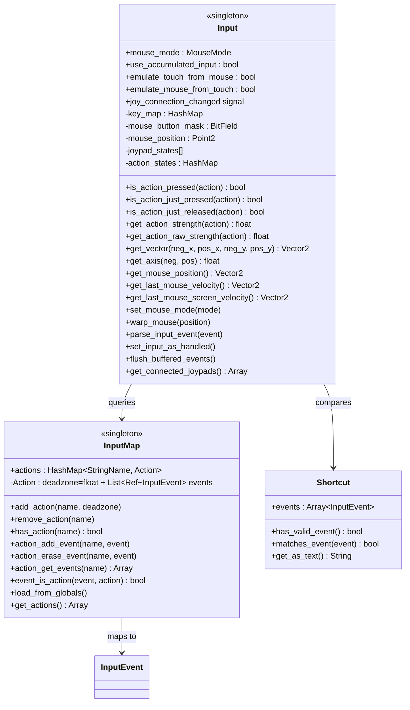

## 3. 事件传播流程

### 3.1 完整输入事件传播时序

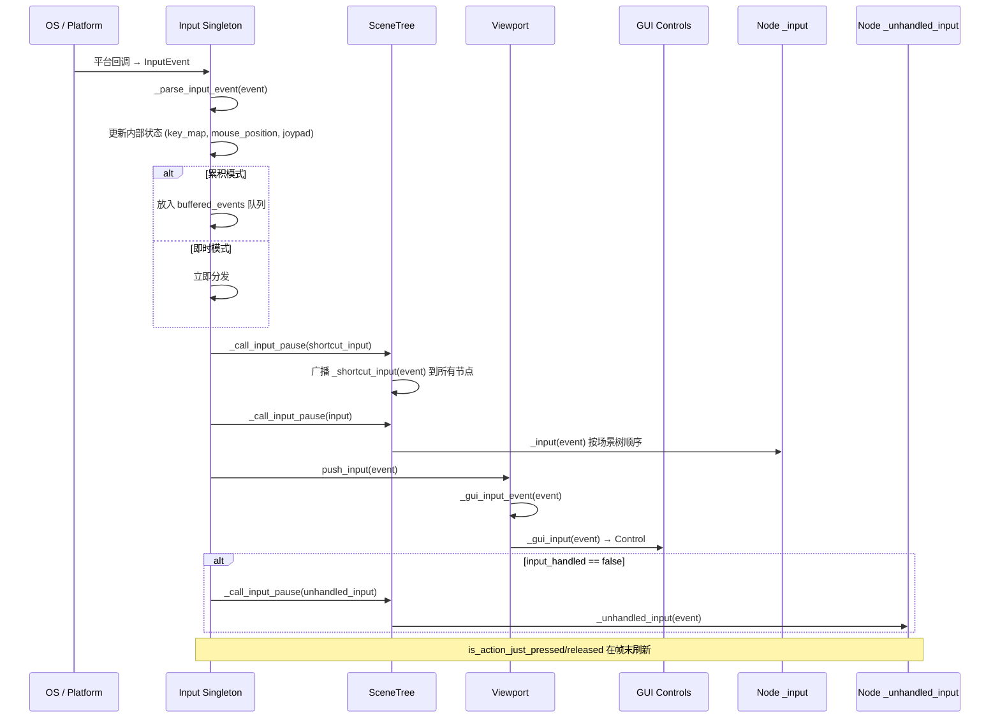

### 3.2 分发优先级

```
优先级从高到低：
1. _shortcut_input    — 快捷键（全局）
2. _input             — 节点级输入（可被拦截）
3. _gui_input         — GUI 控件输入（Viewport → Control）
4. _unhandled_input   — 未处理的输入
5. _unhandled_key_input — 未处理的键盘输入
```

### 3.3 Input 动作查询流程

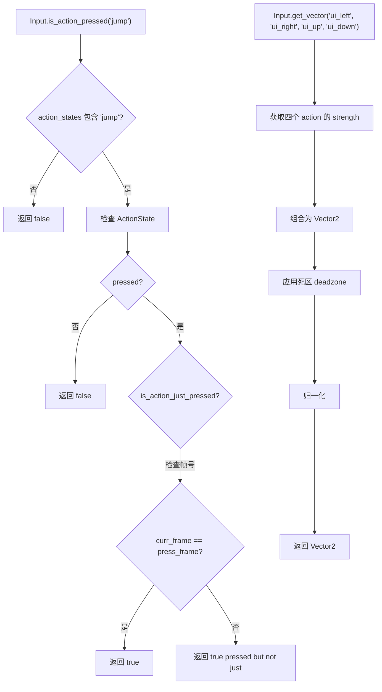

## 4. InputMap 动作映射

### 4.1 动作定义（project.godot）

```ini
[input]

move_left={
"deadzone": 0.5,
"events": [Object(InputEventKey,"resource_local_to_scene":false,"keycode":0,"physical_keycode":65,"unicode":97)]
}
move_right={
"deadzone": 0.5,
"events": [Object(InputEventKey,"physical_keycode":68)]
}
jump={
"deadzone": 0.5,
"events": [Object(InputEventKey,"physical_keycode":87),
           Object(InputEventJoypadButton,"button_index":0)]
}
```

### 4.2 事件匹配流程

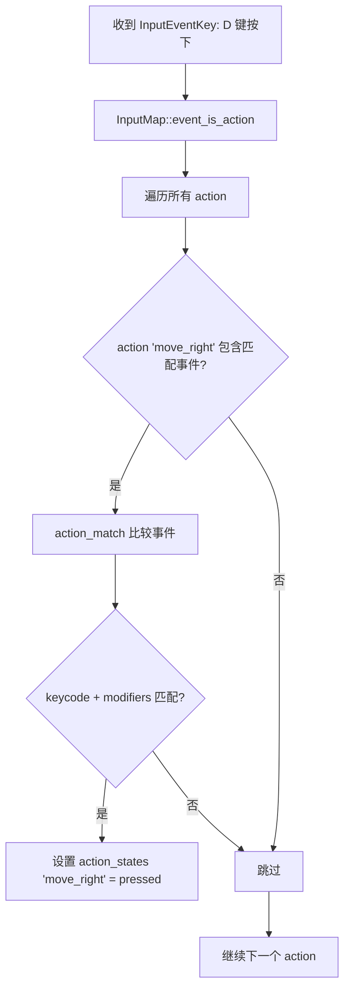

### 4.3 InputMap 的局限

| 特性 | Godot | UE Enhanced Input |
|------|-------|------------------|
| 映射层次 | 扁平 action 列表 | 多层 Context（优先级） |
| 动作类型 | 仅 bool + float strength | 强类型（Bool/Float/Vector2D） |
| 死区 | 全局 per-action | per-binding 修饰器 |
| 运行时变更 | 不支持 | 支持 push/pop Context |
| 触发器 | 无（仅 pressed/released） | Hold/Tap/Pulse/Combo 等 |
| 修饰器 | 无 | DeadZone/Swizzle/Negate/Scale |
| 组合绑定 | get_vector 手动 | Composite 自动 |
| 上下文优先 | 无 | Context 栈 + 阻塞 |
| 设备切换 | 手动 | 自动 |

## 5. 拖拽系统

### 5.1 拖拽流程

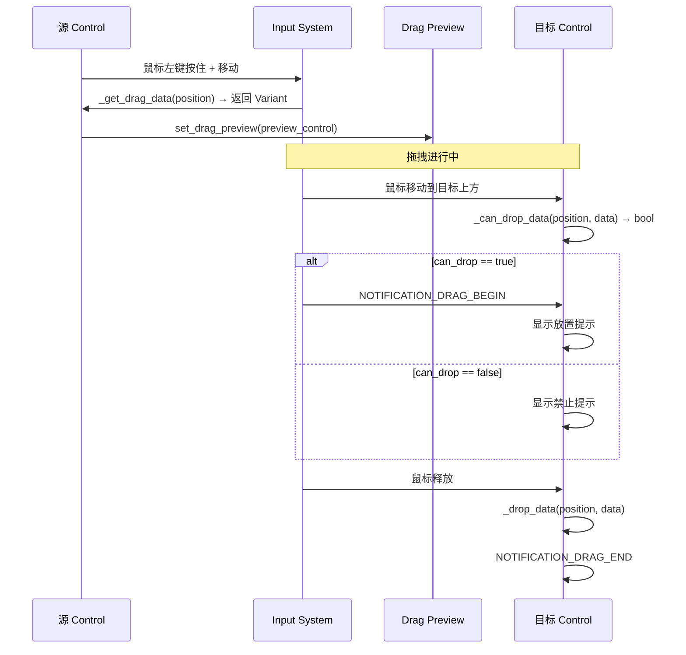

### 5.2 拖拽 API

```cpp
// Control 拖拽相关方法
virtual Variant _get_drag_data(const Point2 &p_position);  // 子类重写：返回拖拽数据
virtual bool _can_drop_data(const Point2 &p_position, const Variant &p_data);  // 是否可接受
virtual void _drop_data(const Point2 &p_position, const Variant &p_data);  // 处理放下

void force_drag(const Variant &p_data, Control *p_control);  // 强制开始拖拽
void set_drag_preview(Control *p_control);  // 设置拖拽预览
bool is_drag_successful() const;

// 通知
NOTIFICATION_DRAG_BEGIN
NOTIFICATION_DRAG_END
```

## 6. 触摸与手势

### 6.1 触摸事件类型

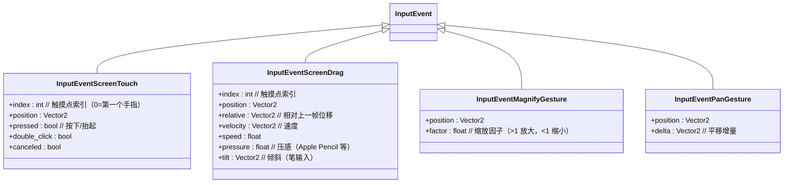

### 6.2 多点触控处理

```
手指1 按下 → InputEventScreenTouch(index=0, pressed=true)
手指2 按下 → InputEventScreenTouch(index=1, pressed=true)
手指1 移动 → InputEventScreenDrag(index=0, relative=...)
手指2 移动 → InputEventScreenDrag(index=1, relative=...)
手指1 抬起 → InputEventScreenTouch(index=0, pressed=false)
手指2 抬起 → InputEventScreenTouch(index=1, pressed=false)
```

### 6.3 鼠标-触摸互模拟

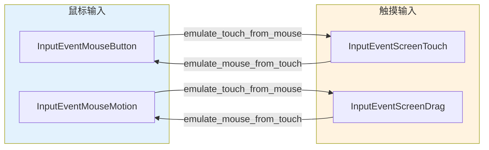

**互模拟配置**：

```gdscript
# 让鼠标模拟触摸（移动端测试用）
Input.set_emulate_touch_from_mouse(true)

# 让触摸模拟鼠标（PC 兼容用）
Input.set_emulate_mouse_from_touch(true)
```

**转换逻辑**（`input.cpp` 中 `_touch_to_mouse_event`）：
- ScreenTouch(index=0) → MouseButton(BUTTON_LEFT)
- ScreenDrag(index=0) → MouseMotion
- 仅 index=0（第一个手指）参与模拟

### 6.4 触控板手势

macOS 触控板手势直接映射为 `InputEventMagnifyGesture` 和 `InputEventPanGesture`：

```
双指缩放 → InputEventMagnifyGesture(factor=1.1)
双指平移 → InputEventPanGesture(delta=Vector2(5, 3))
```

Android/iOS 手势需要**手动识别**（通过 ScreenTouch/ScreenDrag 序列）：

```gdscript
# Godot 没有内置捏合/滑动手势识别器
# 需要手动实现：
var touches: Dictionary = {}

func _input(event: InputEvent) -> void:
    if event is InputEventScreenTouch:
        if event.pressed:
            touches[event.index] = event.position
        else:
            touches.erase(event.index)
    if event is InputEventScreenDrag:
        touches[event.index] = event.position
        if touches.size() == 2:
            _handle_pinch(touches)
```

## 7. Enhanced Input 对比分析

### 7.1 UE Enhanced Input 核心概念

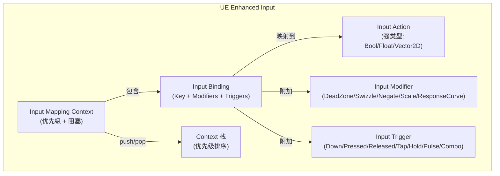

### 7.2 Godot vs UE Enhanced Input

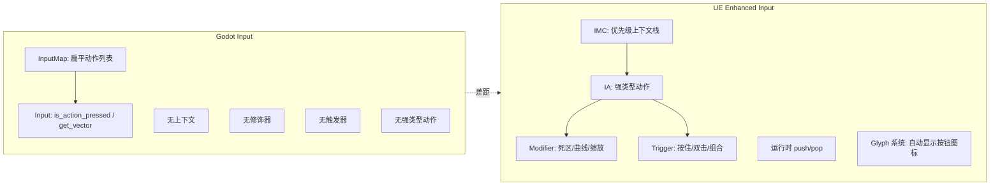

### 7.3 详细缺失功能清单

#### 7.3.1 输入映射上下文（严重缺失）

```gdscript
# 需求：不同游戏状态使用不同输入映射
# 期望（UE 风格）：
InputMappingContext.push("gameplay")    # 游戏中：WASD 移动
InputMappingContext.push("menu")        # 菜单中：WASD 选择
InputMappingContext.pop("gameplay")     # 离开菜单后恢复

# 当前 Godot：
# 所有动作始终全局生效，无法按状态切换
# 只能手动 enable/disable 每个动作的检测
```

**缺失**：
- 无 `InputMappingContext` 类
- 无上下文栈（push/pop）
- 无上下文优先级
- 无上下文间阻塞（高优先级上下文可阻止低优先级接收输入）
- 无运行时绑定变更

#### 7.3.2 输入修饰器（严重缺失）

```gdscript
# 需求：摇杆死区、响应曲线、轴反转
# 期望（UE 风格）：
move_action.add_modifier(DeadZoneModifier.new(0.25))
move_action.add_modifier(ResponseCurveModifier.new(EXPONENTIAL))
look_action.add_modifier(SwizzleModifier.new(YXZ))  # 交换 X/Y 轴
look_action.add_modifier(ScaleModifier.new(0.5))     # 灵敏度

# 当前 Godot：
# 死区仅在 InputMap 中全局定义（per-action，非 per-binding）
# 无响应曲线
# 无轴交换
# 无灵敏度缩放
# 需手动在 _process 中处理
```

**缺失**：
- 无 `InputModifier` 基类
- 无 `DeadZoneModifier`（per-binding 死区）
- 无 `ResponseCurveModifier`（输入响应曲线）
- 无 `SwizzleModifier`（轴交换/重映射）
- 无 `NegateModifier`（轴反转）
- 无 `ScaleModifier`（灵敏度缩放）
- 无 `SmoothModifier`（输入平滑/滤波）

#### 7.3.3 输入触发器（严重缺失）

```gdscript
# 需求：按住0.5秒触发"蓄力攻击"
# 期望（UE 风格）：
charge_attack.set_trigger(HoldTrigger.new(0.5))     # 按住0.5秒
charge_attack.set_trigger(TapTrigger.new(0.2))       # 短按
charge_attack.set_trigger(ComboTrigger.new([A, B]))   # A+B组合

# 当前 Godot：
# 只有 is_action_pressed / is_action_just_pressed
# 按住/长按/双击/组合键全部需要手动实现
func _process(delta):
    if Input.is_action_pressed("attack"):
        hold_time += delta
        if hold_time > 0.5:
            charge_attack()
    if Input.is_action_just_released("attack"):
        if hold_time < 0.2:
            quick_attack()
        hold_time = 0.0
```

**缺失**：
- 无 `InputTrigger` 基类
- 无 `HoldTrigger`（按住时长触发）
- 无 `TapTrigger`（短按触发）
- 无 `DoubleTapTrigger`（双击触发）
- 无 `PulseTrigger`（按住时周期性触发）
- 无 `ComboTrigger`（组合键序列触发）
- 无 `ChordedTrigger`（同时按住修饰键触发）

#### 7.3.4 强类型动作（中等缺失）

```gdscript
# 需求：动作有明确的值类型
# 期望（UE 风格）：
var jump: InputActionBool      # bool: 按下/释放
var move: InputActionVector2   # Vector2: 方向+强度
var throttle: InputActionFloat # float: 模拟量

# 当前 Godot：
# 所有动作都是 float strength + bool pressed
# Vector2 需要手动 get_vector
var move = Input.get_vector("ui_left", "ui_right", "ui_up", "ui_down")
```

**缺失**：
- 无 `InputAction<T>` 类型系统
- 无 `BoolAction` / `FloatAction` / `Vector2Action` 区分
- `get_vector` 需要手动指定四个动作名

#### 7.3.5 运行时重新绑定（中等缺失）

```gdscript
# 需求：玩家在设置菜单中重新绑定按键
# 期望：
Input.rebind_action("jump", new_key_event)

# 当前 Godot：
# InputMap.action_erase_event + action_add_event 可以修改
# 但没有标准 UI 流程支持
# 没有冲突检测
# 没有保存/加载用户绑定
```

**缺失**：
- 无标准重新绑定 UI 组件
- 无绑定冲突检测
- 无用户绑定持久化（需手动保存到 ConfigFile）
- 无多设备绑定管理（键盘 vs 手柄）

#### 7.3.6 Glyph 系统（轻微缺失）

```gdscript
# 需求：根据当前输入设备显示正确的按钮图标
# 期望（UE 风格）：
$Label.texture = InputGlyph.get_icon("jump", current_device)
# 键盘: 显示 "Space" 图标
# Xbox: 显示 "A" 按钮
# PlayStation: 显示 "✕" 按钮

# 当前 Godot：
# 没有内置 glyph 系统
# 需要手动检测 joypad 类型并加载对应图标
```

**缺失**：
- 无 `InputGlyph` 系统
- 无自动设备检测 → 图标映射
- 无平台特定图标资源

#### 7.3.7 手势识别器（严重缺失）

```gdscript
# 需求：捏合缩放、滑动手势
# 期望：
Input.add_gesture_recognizer(PinchGestureRecognizer.new())
Input.add_gesture_recognizer(SwipeGestureRecognizer.new())

signal pinch_changed(ratio: float)
signal swipe_detected(direction: Vector2)

# 当前 Godot：
# 只有 macOS 触控板的 MagnifyGesture / PanGesture
# 没有通用手势识别器
# Android/iOS 捏合和滑动需要手动实现
```

**缺失**：
- 无 `GestureRecognizer` 基类
- 无 `PinchGestureRecognizer`（捏合缩放）
- 无 `SwipeGestureRecognizer`（滑动手势）
- 无 `RotateGestureRecognizer`（旋转手势）
- 无 `LongPressGestureRecognizer`（长按手势）
- 无手势冲突仲裁机制

### 7.4 缺失功能严重度总览

| 功能 | 严重度 | 实现难度 | 影响范围 |
|------|--------|---------|---------|
| **输入映射上下文** | 🔴 严重 | 高 | 多状态游戏输入 |
| **输入修饰器** | 🔴 严重 | 中 | 手柄/触控体验 |
| **输入触发器** | 🔴 严重 | 高 | 动作游戏、组合键 |
| **手势识别器** | 🔴 严重 | 中 | 移动端 |
| **强类型动作** | 🟡 中等 | 低 | 代码清晰度 |
| **运行时重新绑定** | 🟡 中等 | 中 | 设置菜单 |
| **Glyph 系统** | 🟢 轻微 | 低 | UI 提示 |
| **输入录制/回放** | 🟢 轻微 | 中 | 测试/回放 |

### 7.5 Godot 输入成熟度评级

```
Godot Input 成熟度：★★☆☆☆ (2/5)

对比：
- UE Enhanced Input：  ★★★★★ (5/5)
- Unity Input System： ★★★★☆ (4/5)
- Qt Input System：    ★★★☆☆ (3/5)
- SDL Input：          ★★☆☆☆ (2/5)
- Godot InputMap：     ★★☆☆☆ (2/5)
```

## 8. 关键源码索引

| 类别 | 路径 |
|------|------|
| InputEvent 基类与子类 | `core/input/input_event.h` / `input_event.cpp` |
| Input 单例 | `core/input/input.h` / `input.cpp` |
| InputMap 动作映射 | `core/input/input_map.h` / `input_map.cpp` |
| Shortcut 快捷键 | `core/input/shortcut.h` |
| SceneTree 输入分发 | `scene/main/scene_tree.h` / `scene_tree.cpp` |
| Viewport GUI 输入 | `scene/main/viewport.h` / `viewport.cpp` |
| Control 拖拽 | `scene/gui/control.h` / `control.cpp` |
| Node 输入回调 | `scene/main/node.h` / `node.cpp` |
| Android 触摸处理 | `platform/android/android_input_handler.cpp` |
| iOS 触摸处理 | `platform/iphone/input.m` |
| macOS 手势 | `platform/macos/godot_button_view.m` |
| Windows 输入 | `platform/windows/display_server_windows.cpp` |

## 9. 总结

### 9.1 Godot Input 的强项

1. **InputEvent 层次清晰**：12 种事件类型覆盖键鼠/手柄/触摸/手势/MIDI
2. **Input 单例 API 简洁**：`is_action_pressed` / `get_vector` 一行查询
3. **InputMap 动作映射**：支持多设备绑定到同一动作
4. **拖拽系统完善**：Control 内建 drag-data/preview/drop 完整流程
5. **鼠标-触摸互模拟**：一套代码兼容 PC 和移动端
6. **macOS 手势支持**：MagnifyGesture / PanGesture 原生支持
7. **action strength**：支持模拟量（摇杆/压感）

### 9.2 Godot Input 的弱点

1. **无输入映射上下文**：所有动作全局生效，无法按游戏状态切换
2. **无输入修饰器**：死区/响应曲线/灵敏度需要手动处理
3. **无输入触发器**：长按/双击/组合键全部手动实现
4. **无手势识别器**：移动端捏合/滑动需要手动写
5. **无强类型动作**：get_vector 需手动指定四个动作
6. **无运行时重新绑定 UI**：按键设置菜单需自建
7. **无 Glyph 系统**：无法根据设备自动显示按钮图标
8. **无输入录制/回放**：测试和回放功能缺失

### 9.3 改进建议优先级

| 优先级 | 功能 | 理由 |
|--------|------|------|
| **P0** | 输入映射上下文 (IMC) | 多状态游戏输入管理的基础 |
| **P0** | 输入修饰器 (DeadZone/Curve/Scale) | 手柄体验的关键 |
| **P0** | 输入触发器 (Hold/Tap/Combo) | 动作游戏的核心需求 |
| **P0** | 手势识别器 (Pinch/Swipe/Rotate) | 移动端必备 |
| **P1** | 强类型动作 (Bool/Float/Vector2) | API 清晰度 |
| **P1** | 运行时重新绑定 | 设置菜单标准功能 |
| **P2** | Glyph 系统 | UI 提示体验 |
| **P2** | 输入录制/回放 | 测试和调试 |

## 10. Enhanced Input 实现方案评估

### 10.1 技术路线对比：C++ Module vs GDExtension

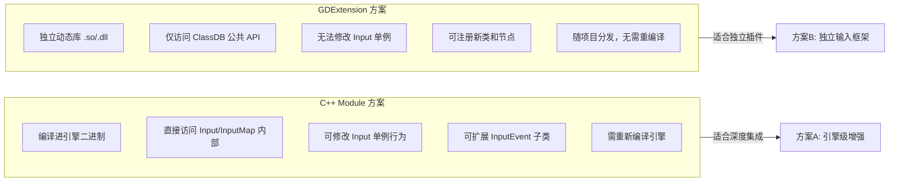

#### 10.1.1 C++ Module 方案详细评估

**优势**：

| 维度 | 说明 |
|------|------|
| **内部访问** | 可直接访问 `Input` 单例的 `action_states`、`key_map`、`mouse_button_mask` 等私有成员 |
| **修改现有类** | 可为 `Input` 添加新的虚方法（如 `push_context`/`pop_context`），为 `InputMap` 添加修饰器链 |
| **InputEvent 扩展** | 可在 `core/input/` 中新增 `InputEventEnhanced` 子类，直接参与现有事件分发链 |
| **SceneTree 集成** | 可修改 `SceneTree::_call_input_pause()` 注入上下文过滤逻辑 |
| **性能** | 直接 C++ 函数调用，零间接开销；修饰器/触发器在事件分发热路径上无虚调用 |
| **编辑器集成** | 可扩展 InputMap 编辑器面板，添加上下文编辑器、修饰器可视化配置 |
| **序列化** | 可扩展 `project.godot` 的 `[input]` 段，增加 `[input_context]` 段 |

**劣势**：

| 维度 | 说明 |
|------|------|
| **分发** | 需要自定义 Godot 构建或等待上游合并，无法通过 Asset Library 分发 |
| **维护** | 引擎升级时需合并改动，跟进 Godot 主线分支 |
| **社区门槛** | 贡献者需编译引擎，开发迭代慢 |
| **ABI 耦合** | 直接依赖引擎内部数据布局，引擎内部重构会导致 Module 失效 |

#### 10.1.2 GDExtension 方案详细评估

**优势**：

| 维度 | 说明 |
|------|------|
| **独立分发** | 通过 Asset Library 或 GitHub Release 分发，用户无需重编译引擎 |
| **版本独立** | 通过 `gdextension_interface` 的稳定 ABI 隔离，引擎小版本升级无需重编译扩展 |
| **快速迭代** | 修改后只需重编译扩展库，秒级热加载 |
| **低门槛** | 开发者只需 C++/Rust 工具链，无需编译整个引擎 |
| **项目关联** | 直接放在项目的 `addons/` 目录下，版本控制简单 |

**劣势**：

| 维度 | 说明 |
|------|------|
| **无法修改 Input 单例** | 不能拦截 `_parse_input_event()` 内部逻辑，只能在外部包装 |
| **无法扩展 InputMap** | 不能为 `InputMap::Action` 添加修饰器/触发器字段 |
| **性能开销** | GDExtension → ClassDB 调用有一次虚函数间接跳转，修饰器链每帧每动作多 2-3 次间接调用 |
| **事件拦截受限** | 无法在 `SceneTree` 分发链中注入过滤；只能在 `_input()`/`_unhandled_input()` 回调中处理 |
| **编辑器受限** | 无法扩展内置 InputMap 编辑器，需自建 Inspector 插件 |
| **双向通信** | 扩展内的动作状态需手动同步到 `Input.action_states`，否则 `is_action_pressed()` 仍读旧值 |

### 10.2 核心功能与实现路径分析

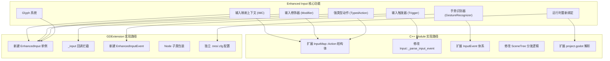

### 10.3 推荐方案：GDExtension 优先 + Module 上游化

#### 10.3.1 分阶段策略

```
Phase 1: GDExtension 独立插件（快速验证 + 社区反馈）
    ├── 实现 EnhancedInputSingleton（替代 Input 的增强查询 API）
    ├── 实现 InputMappingContext（上下文栈 + 优先级）
    ├── 实现 InputModifier 链（DeadZone/Scale/Negate/Swizzle）
    ├── 实现 InputTrigger 链（Pressed/Released/Hold/Tap/Pulse）
    ├── 实现 GestureRecognizer（Pinch/Swipe/Rotate/LongPress）
    └── 通过 _input() 回调拦截事件 → 匹补到增强系统

Phase 2: C++ Module 上游化（深度集成 + 性能优化）
    ├── 将 EnhancedInput 集成为 modules/enhanced_input/
    ├── 扩展 InputMap::Action 增加 modifiers/triggers 字段
    ├── 在 Input::_parse_input_event 中注入上下文过滤
    ├── 扩展 SceneTree 分发链支持上下文感知
    ├── 为 InputEvent 增加手势事件子类
    └── 扩展 InputMap 编辑器面板

Phase 3: 核心层合并（最终形态）
    ├── 将验证过的 API 合并进 core/input/
    ├── Input 单例原生支持上下文/修饰器/触发器
    ├── InputMap 编辑器原生支持可视化配置
    └── 废弃 Phase 1 兼容层
```

#### 10.3.2 Phase 1 架构设计（GDExtension）

```mermaid
classDiagram
    class EnhancedInput {
        <<GDExtension Singleton>>
        +push_context(context) void
        +pop_context(context) void
        +get_active_contexts() Array
        +is_action_triggered(action) bool
        +get_action_value(action) Variant
        +get_action_value_vector2(action) Vector2
        +add_gesture_recognizer(recognizer) void
        +remove_gesture_recognizer(recognizer) void
        -context_stack : Array~InputMappingContext~
        -action_cache : HashMap
        -gesture_recognizers : Array
        -_input(event) : 拦截回调
    }

    class InputMappingContext {
        <<GDExtension Resource>>
        +context_name : StringName
        +priority : int
        +blocking : bool
        +mappings : Array~InputBinding~
        +add_binding(action, binding) void
        +remove_binding(action, binding) void
        +has_action(action) bool
    }

    class InputBinding {
        <<GDExtension Resource>>
        +action : StringName
        +events : Array~InputEvent~
        +modifiers : Array~InputModifier~
        +triggers : Array~InputTrigger~
        +process_event(event) InputActionState
    }

    class InputModifier {
        <<GDExtension abstract class>>
        +modify_value(raw_value) float
        +modify_event(event) InputEvent
    }

    class DeadZoneModifier {
        +threshold : float
        +modify_value(raw_value) float
    }

    class ScaleModifier {
        +scale : float
        +modify_value(raw_value) float
    }

    class ResponseCurveModifier {
        +curve : Curve
        +modify_value(raw_value) float
    }

    class SwizzleModifier {
        +swizzle : String
        +modify_event(event) InputEvent
    }

    class NegateModifier {
        +modify_value(raw_value) float
    }

    class InputTrigger {
        <<GDExtension abstract class>>
        +process_event(event, delta) TriggerState
        +reset() void
    }

    class PressedTrigger {
        +process_event(event, delta) TriggerState
    }

    class ReleasedTrigger {
        +process_event(event, delta) TriggerState
    }

    class HoldTrigger {
        +hold_time : float
        +process_event(event, delta) TriggerState
    }

    class TapTrigger {
        +max_duration : float
        +process_event(event, delta) TriggerState
    }

    class PulseTrigger {
        +interval : float
        +process_event(event, delta) TriggerState
    }

    class ComboTrigger {
        +sequence : Array~StringName~
        +time_window : float
        +process_event(event, delta) TriggerState
    }

    class GestureRecognizer {
        <<GDExtension abstract class>>
        +recognize(events) GestureResult
        +reset() void
        +signal gesture_recognized(result)
    }

    class PinchGestureRecognizer {
        +min_distance : float
        +recognize(events) GestureResult
    }

    class SwipeGestureRecognizer {
        +min_velocity : float
        +direction_threshold : float
        +recognize(events) GestureResult
    }

    class RotateGestureRecognizer {
        +min_rotation : float
        +recognize(events) GestureResult
    }

    EnhancedInput --> InputMappingContext : manages stack
    InputMappingContext --> InputBinding : contains
    InputBinding --> InputModifier : applies chain
    InputBinding --> InputTrigger : evaluates
    InputModifier <|-- DeadZoneModifier
    InputModifier <|-- ScaleModifier
    InputModifier <|-- ResponseCurveModifier
    InputModifier <|-- SwizzleModifier
    InputModifier <|-- NegateModifier
    InputTrigger <|-- PressedTrigger
    InputTrigger <|-- ReleasedTrigger
    InputTrigger <|-- HoldTrigger
    InputTrigger <|-- TapTrigger
    InputTrigger <|-- PulseTrigger
    InputTrigger <|-- ComboTrigger
    EnhancedInput --> GestureRecognizer : manages
    GestureRecognizer <|-- PinchGestureRecognizer
    GestureRecognizer <|-- SwipeGestureRecognizer
    GestureRecognizer <|-- RotateGestureRecognizer
```

#### 10.3.3 Phase 1 事件处理流程

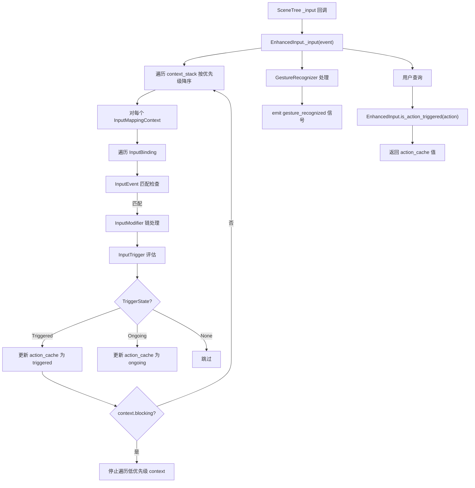

#### 10.3.4 与现有 Input 系统的桥接

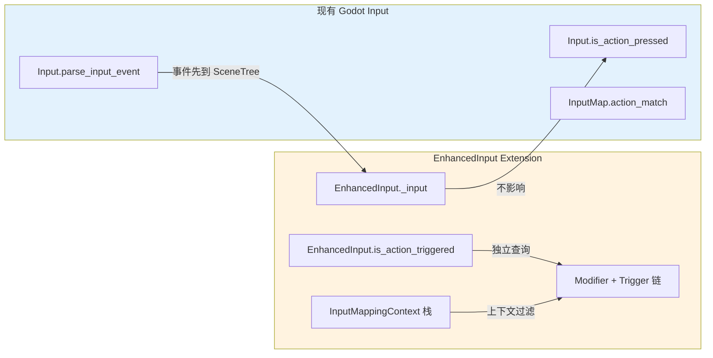

**关键桥接机制**：

1. **双轨查询**：`Input.is_action_pressed()` 仍读原有 `action_states`；`EnhancedInput.is_action_triggered()` 读增强缓存。用户按需选择。
2. **事件先经过增强系统**：在 `_input()` 回调中，EnhancedInput 先于用户代码处理事件，更新自身缓存。
3. **可选同步**：提供 `EnhancedInput.sync_to_input()` 方法，将增强动作状态写回 `Input.action_states`，使 `Input.is_action_pressed()` 也能感知上下文过滤。

#### 10.3.5 Phase 2 Module 集成要点

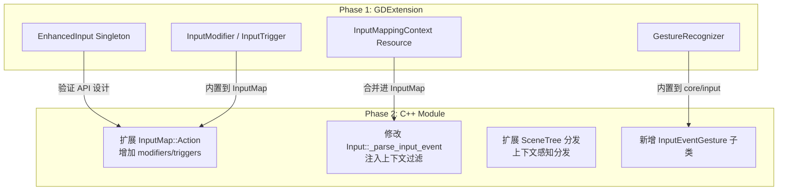

**Module 集成需要修改的核心文件**：

| 文件 | 修改内容 |
|------|---------|
| `core/input/input_map.h` | `Action` 结构体增加 `Vector<InputModifier*> modifiers`、`Vector<InputTrigger*> triggers` |
| `core/input/input_map.h` | 新增 `InputMappingContext` 类，`HashMap<StringName, InputMappingContext*> contexts` |
| `core/input/input.cpp` | `_parse_input_event()` 增加上下文过滤逻辑 |
| `core/input/input.cpp` | 新增 `push_context()`/`pop_context()` 方法 |
| `core/input/input_event.h` | 新增 `InputEventGesture` 基类和子类 |
| `scene/main/scene_tree.cpp` | `_call_input_pause()` 增加上下文感知分发 |
| `scene/main/viewport.cpp` | 手势识别器集成到 GUI 输入处理 |
| `editor/input_map_editor.cpp` | 扩展编辑器面板，支持上下文/修饰器/触发器可视化编辑 |

### 10.4 推荐结论

```
┌──────────────────────────────────────────────────────────────┐
│                    推荐策略：双阶段                            │
│                                                              │
│  Phase 1: GDExtension（推荐先行）                             │
│  ├── 目标：快速验证 API 设计 + 获取社区反馈                    │
│  ├── 理由：独立分发、低门槛、快速迭代                           │
│  ├── 适用：IMC / Modifier / Trigger / GestureRecognizer      │
│  └── 风险：无法深度集成 Input 单例，双轨查询                   │
│                                                              │
│  Phase 2: C++ Module（深度集成）                              │
│  ├── 目标：将验证过的 API 原生集成到引擎                       │
│  ├── 理由：性能最优、无间接调用、编辑器集成                     │
│  ├── 适用：扩展 InputMap / Input / SceneTree / InputEvent     │
│  └── 风险：需上游合并、维护成本                                │
│                                                              │
│  不推荐：纯 GDExtension 长期方案                              │
│  ├── 原因1：is_action_pressed() 无法感知上下文过滤             │
│  ├── 原因2：修饰器链的虚调用开销在热路径上累积                  │
│  ├── 原因3：无法扩展 InputMap 编辑器                          │
│  └── 原因4：双轨查询导致用户困惑                               │
└──────────────────────────────────────────────────────────────┘
```
