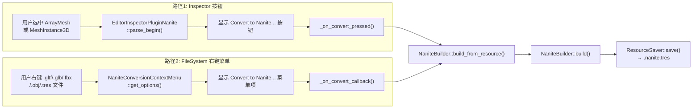
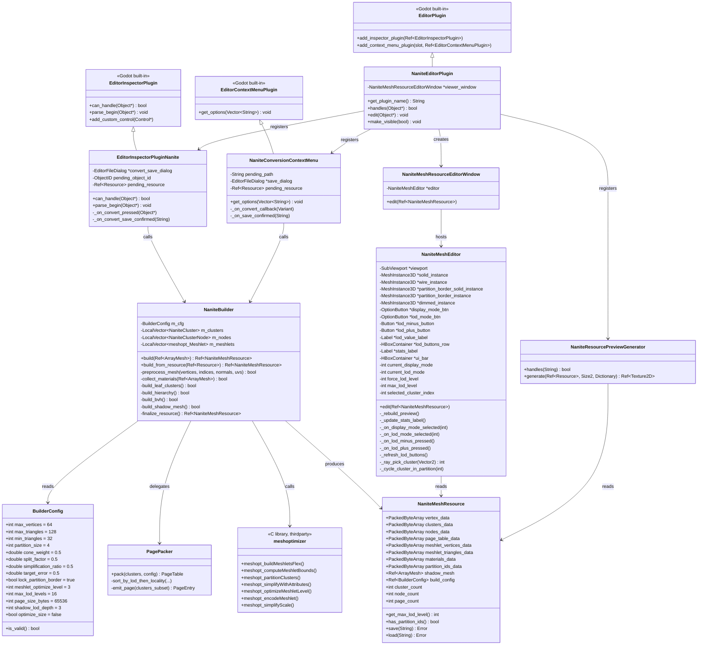
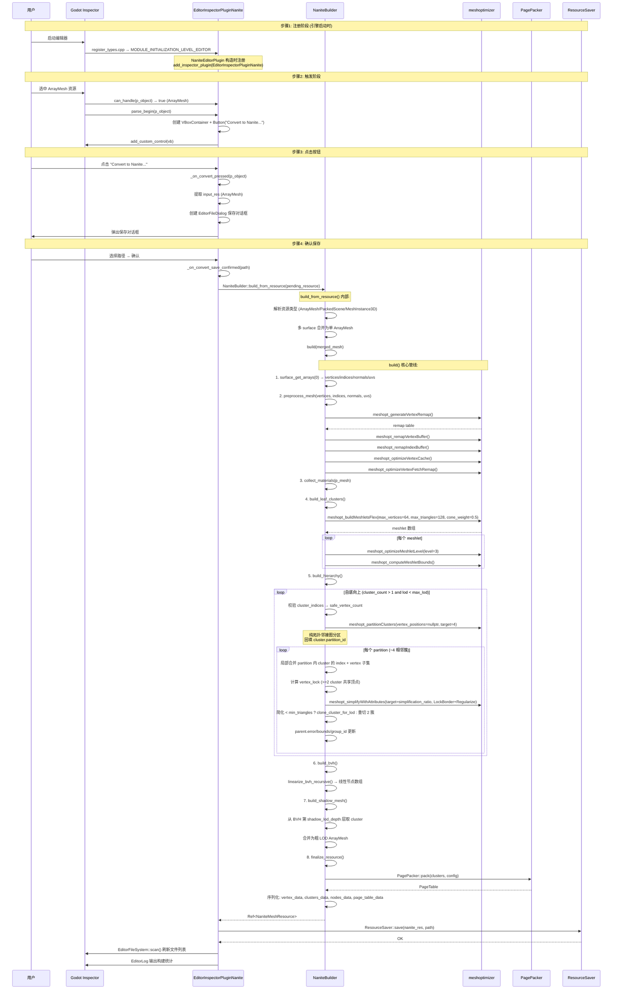
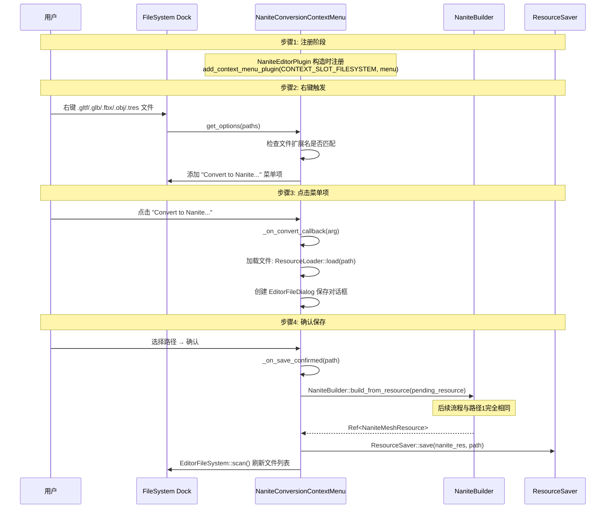
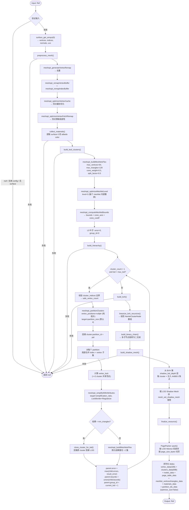
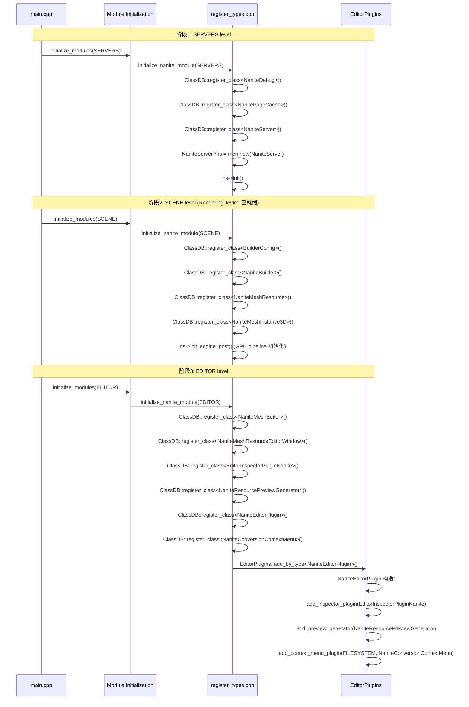

# Nanite Mesh 编辑器生成流程分析报告

> 基于 `/workspace/nanite/` 现有代码库（2026-08-03 状态，含 commit `e6b41bf` / `1a9df85` / `68ad2f1`）的源码级分析。
> 覆盖从用户触发到 NaniteMeshResource 保存到磁盘的完整调用链。

---

## 1. 概览：两条触发路径

编辑器中有两条独立路径可以触发 Nanite Mesh 生成：

| 路径 | 触发方式 | 入口 | 输入类型 |
|------|---------|------|---------|
| **Inspector Convert** | 选中 ArrayMesh / MeshInstance3D，点击 Inspector 中的 "Convert to Nanite..." 按钮 | `EditorInspectorPluginNanite::parse_begin()` | `ArrayMesh` / `MeshInstance3D` |
| **FileSystem Context Menu** | 在 FileSystem dock 中右键 `.gltf/.glb/.fbx/.obj/.tres` 文件，选择 "Convert to Nanite..." | `NaniteConversionContextMenu::get_options()` | 文件路径 → `Resource` |

两条路径最终都汇聚到 `NaniteBuilder::build_from_resource()` → `NaniteBuilder::build()`。



---

## 2. 涉及的类与职责

### 2.1 类层次总览



### 2.2 各类职责详解

| 类 | 文件 | 职责 |
|----|------|------|
| `NaniteEditorPlugin` | `nanite/editor/nanite_editor_plugin.h/cpp` | **编辑器插件入口**。注册 `EditorInspectorPluginNanite`、`NaniteConversionContextMenu`、`NaniteResourcePreviewGenerator`；处理 `.nanite.tres` 双击打开预览窗口 |
| `EditorInspectorPluginNanite` | 同上 | **Inspector 面板增强**。当用户选中 `ArrayMesh` 或 `MeshInstance3D` 时，在 Inspector 顶部添加 "Convert to Nanite..." 按钮 |
| `NaniteConversionContextMenu` | `nanite/editor/nanite_conversion_menu.h/cpp` | **FileSystem 右键菜单**。为 `.gltf/.glb/.fbx/.obj/.tres` 文件添加右键菜单项 |
| `NaniteBuilder` | `nanite/core/nanite_builder.h/cpp` | **离线构建核心**。驱动完整的 Nanite 构建管线：预处理 → 叶子聚类 → 层次化简化 → BVH 装配 → Shadow Mesh → 序列化 |
| `BuilderConfig` | `nanite/core/builder_config.h/cpp` | **构建参数**。14 个可调字段：meshlet 尺寸、partition 目标、简化比例、shadow LOD 深度、`optimize_size`（是否省略 partition_ids_data 以减小体积）等 |
| `NaniteMeshResource` | `nanite/core/nanite_resource.h/cpp` | **资源载体**。序列化后的 Nanite 数据：原始顶点池、cluster 元数据、BVH 节点、Page Table、meshlet 顶点/三角形池、材质池、`partition_ids_data`（v4）、Shadow Mesh |
| `NaniteMeshEditor` | `nanite/editor/nanite_mesh_editor.h/cpp` | **3D 预览控件**。继承 `SubViewportContainer`，在 Inspector 中渲染 3D 预览，支持 Display Mode / LOD Mode 切换 |
| `NaniteMeshResourceEditorWindow` | `nanite/editor/nanite_resource_editor_window.h/cpp` | **独立预览窗口**。双击 `.nanite.tres` 时弹出的独立窗口，内嵌 `NaniteMeshEditor` |
| `NaniteResourcePreviewGenerator` | `nanite/editor/nanite_resource_preview_gen.h/cpp` | **缩略图生成器**。为 FileSystem dock 生成 `.nanite.tres` 的缩略图 |
| `PagePacker` | `nanite/core/page_packer.h/cpp` | **Page 划分**。按 LOD + 空间局部性排序，将 cluster 划分到固定大小的 Page |
| `meshoptimizer` | `thirdparty/meshoptimizer/` | **第三方库**。提供 meshlet 构建、聚类、简化、编码等全部底层算法 |

---

## 3. 完整调用链

### 3.1 路径 1：Inspector Convert 按钮



### 3.2 路径 2：FileSystem 右键菜单



### 3.3 NaniteBuilder::build() 内部管线



---

## 4. 使用的算法

### 4.1 顶点预处理 (preprocess_mesh)

| 步骤 | 算法 | meshoptimizer API | 作用 |
|------|------|-------------------|------|
| 1 | 顶点去重 | `meshopt_generateVertexRemap()` | 合并位置/法线/UV 完全相同的顶点，减少冗余 |
| 2 | 顶点/索引重映射 | `meshopt_remapVertexBuffer()` + `meshopt_remapIndexBuffer()` | 应用 remap table，重新排列 buffer |
| 3 | 顶点缓存优化 | `meshopt_optimizeVertexCache()` | 重排三角形顺序，使顶点在 GPU 顶点缓存中的命中率最大化（Tom Forsyth 算法） |
| 4 | 顶点预取优化 | `meshopt_optimizeVertexFetchRemap()` | 重排顶点 buffer，使顶点在内存中的访问局部性最大化 |

### 4.2 叶子层聚类 (build_leaf_clusters)

| 步骤 | 算法 | 关键参数 | 作用 |
|------|------|---------|------|
| 1 | Meshlet 构建 | `meshopt_buildMeshletsFlex()` | `max_vertices=64`, `min_triangles=32`, `max_triangles=128`, `cone_weight=0.5`, `split_factor=0.5` | 将三角形按空间局部性分组为 meshlet，带法线锥权重 |
| 2 | Meshlet 内部优化 | `meshopt_optimizeMeshletLevel()` | `level=3` | 在 meshlet 内部重排三角形，改善顶点缓存局部性 |
| 3 | 包围盒计算 | `meshopt_computeMeshletBounds()` | — | 计算每个 meshlet 的 AABB + 法线锥 (cone_axis, cone_cutoff) |

### 4.3 层次化简化 (build_hierarchy)

这是一个**自底向上**的迭代过程：

```
当前层 cluster 数量 = N
while N > 1 and lod < max_lod_levels:
    ┌─ 1. 收集 cluster_indices: 拼接所有 cluster 的三角形顶点索引
    │      + cluster_index_counts: 每 cluster 的索引数 (triangle_count * 3)
    │
    ├─ 1b. 边界校验 (commit 1a9df85): 扫描 cluster_indices 找出最大顶点索引，
    │      计算 safe_vertex_count = max(vertex_count, max_index + 1)。
    │      若 safe_vertex_count != vertex_count，打印 WARNING。
    │      （meshopt_partitionClusters 内部断言 v < vertex_count，
    │       某些 mesh 会产生越界索引导致崩溃）
    │
    ├─ 2. 纯拓扑分区 (commit e6b41bf):
    │      meshopt_partitionClusters(
    │        partition_ids, cluster_indices, cluster_index_counts,
    │        cluster_count,
    │        vertex_positions = nullptr,   ← 关键：不传位置
    │        safe_vertex_count,
    │        target_partition_size = config.partition_size (默认 4))
    │      ← 纯拓扑邻接图分区，避免 meshopt 内部 mergeSpatial 破坏
    │        partition 的拓扑连通性，保证 border-vertex locking 始终有效
    │
    ├─ 2b. 回填 partition_id: 对每个源 cluster，
    │      m_clusters[hn.cluster_idx].partition_id = pid
    │      （运行时字段，最终写入 partition_ids_data blob）
    │
    ├─ 3. 对每个 partition (~4 相邻簇):
    │      合并 partition 内 cluster 的 index + vertex 子集（局部合并，非全局）
    │
    ├─ 4. 锁定边界: 计算 vertex_lock
    │      标记跨 cluster 共享边顶点（>=2 cluster 引用），防止简化时产生裂缝
    │
    ├─ 5. QEM 简化: meshopt_simplifyWithAttributes(
    │        target = 原索引数 * simplification_ratio (默认 0.5 → 50%),
    │        options = LockBorder + Regularize,
    │        vertex_lock = 锁定边界)
    │      LockBorder: 不移动锁定边界的顶点
    │      Regularize: 正则化网格，防止退化三角形
    │
    ├─ 5b. 简化 bailout: 若简化结果 < min_triangles，
    │      clone_cluster_for_lod() 克隆原 cluster 到新 LOD（仅改 group_id）
    │
    ├─ 6. 重聚类: meshopt_buildMeshletsFlex() 将简化结果重切 ~2 簇
    │
    └─ 7. 计算父节点属性:
           parent.error = max(child.errors, 简化 result_error)
           parent.bounds = AABB::union(child.bounds)
           parent.group_id = current_lod + 1
```

**关键算法——QEM 简化**：
- `meshopt_simplifyWithAttributes` 基于 Garland-Heckbert 的 Quadric Error Metrics 算法
- 每条边赋一个误差矩阵（quadric），表示合并该边对模型外观的影响
- 贪心地选择误差最小的边进行折叠，直到达到目标三角形数
- `LockBorder` 选项确保跨 group 的共享边界顶点不被移动，防止相邻 group 之间出现裂缝
- `Regularize` 选项在简化过程中添加正则化项，防止产生过于细长的退化三角形

**关键设计——纯拓扑分区**（commit `e6b41bf`）：
- 三处 `meshopt_partitionClusters` 调用（`build_hierarchy` / `build_partition_border_wire` / `build_partition_sibling_mesh`）均传 `vertex_positions = nullptr`
- meshoptimizer 内部当 `vertex_positions == nullptr` 时跳过 `mergeSpatial` 阶段，仅基于顶点共享关系（拓扑邻接图）做分区
- 原因：传入位置时 meshopt 可能将空间邻近但不共享顶点的 cluster 合并到同一 partition，破坏 partition 内部的拓扑连通性，导致 border-vertex locking 失效（锁不住真正的拓扑边界）
- 纯拓扑分区保证 partition 内 cluster 一定通过共享顶点相连，vertex_lock 才能正确识别边界顶点

### 4.4 BVH 装配 (build_bvh)

| 步骤 | 方法 | 说明 |
|------|------|------|
| 1 | `linearize_bvh_recursive()` | 递归遍历 hierarchy tree，将每个 MERGE 节点及其子节点展平为线性 `NaniteClusterNode` 数组 |
| 2 | `build_binary_chain()` | 将 MERGE 节点的多个源子节点链转为二叉树（二分叉），每个节点最多两个子节点 |

### 4.5 粗 LOD Shadow Mesh (build_shadow_mesh)

从 BVH 树的第 `config.shadow_lod_depth` 层（默认 3）提取所有 cluster 的三角形，合并为一个 `ArrayMesh`。这个 mesh 三角形数远少于原始 mesh，用于 GDExtension 阶段通过 `mesh_set_shadow_mesh()` 设置阴影代理。

### 4.6 Page 划分 (PagePacker)

| 步骤 | 说明 |
|------|------|
| 1 | 按 LOD 层级 + 空间局部性排序所有 cluster |
| 2 | 按 `config.page_size_bytes`（默认 64KB）切分为 Page |
| 3 | 每个 cluster 分配 `page_id`，输出 `PageTable` |

### 4.7 序列化 (finalize_resource)

将以下数据打包到 `NaniteMeshResource`：

| 数据 | 格式 | 说明 |
|------|------|------|
| `vertex_data` | `PackedByteArray` | 原始 stride-32 顶点数据 (pos.xyz + normal.xyz + uv.xy = 8 floats) |
| `clusters_data` | `PackedByteArray` | 所有 `NaniteCluster::serialize()` 拼接，固定 68B stride（`partition_id` 不在其中，运行时字段） |
| `nodes_data` | `PackedByteArray` | 所有 `NaniteClusterNode::serialize()` 拼接 |
| `page_table_data` | `PackedByteArray` | Page Table 的序列化二进制 |
| `meshlet_vertices_data` | `PackedByteArray` | `uint32[]` 全局顶点索引池，cluster 的 `vertex_offset/vertex_count` 索引此数组 |
| `meshlet_triangles_data` | `PackedByteArray` | `uint8[]` 微索引池，cluster 的 `triangle_offset`（字节偏移）指向此数组，每三角形 3 字节 |
| `materials_data` | `PackedByteArray` | 每材质 32B (vec4 base_color + vec4 metallic_roughness_pad) |
| `partition_ids_data` | `PackedByteArray` | `uint32[]`，每 cluster 一个 partition_id；**v4 新增**，`optimize_size=true` 时为空 |
| `shadow_mesh` | `Ref<ArrayMesh>` | 粗 LOD 阴影 mesh |
| `build_config` | `Ref<BuilderConfig>` | 构建参数回溯（仅 `.tres`，不写入 `.nanite`） |

**`.nanite` 自定义二进制格式（v4）**：

```
char[4]   magic = "NANM"
uint32    version = 4
uint32    vertex_data_size, then vertex_data bytes       (raw stride 32 B)
uint32    clusters_data_size, then clusters_data bytes    (68 B per cluster)
uint32    nodes_data_size, then nodes_data bytes
uint32    page_table_data_size, then page_table_data bytes
uint32    materials_data_size, then materials_data bytes   (v2+)
uint32    meshlet_vertices_data_size, then bytes            (v3+)
uint32    meshlet_triangles_data_size, then bytes           (v3+)
uint32    partition_ids_data_size, then bytes               (v4+)
uint32    cluster_count, node_count, page_count (trailer)
```

> `build_config` 和 `shadow_mesh` 不包含在 `.nanite` 文件中（Godot 侧元数据，如需可从源 mesh 重新构建）。

**版本历史**：v1 原始 → v2 NaniteCluster 68B + materials_data → v3 meshlet 数据分离 + raw vertex_data → **v4 新增 partition_ids_data**（`optimize_size=true` 时该 blob 为空，viewer 回退到运行时重算）。

---

## 5. 模块初始化流程



---

## 6. 预览与调试可视化

### 6.1 NaniteMeshEditor 预览控件

`NaniteMeshEditor` 继承 `SubViewportContainer`，在 Inspector 中提供 3D 预览。Stage 0 重构后采用 5 个 `MeshInstance3D` + 右上角下拉框 + 左上角统计标签的布局。

**结构**：
```
NaniteMeshEditor (SubViewportContainer)
├── SubViewport (独立 World3D)
│   ├── Camera3D (透视相机, 可缩放/平移/聚焦)
│   ├── DirectionalLight3D × 2 (双光源)
│   └── Node3D (rotation_node, 鼠标拖拽旋转)
│       ├── MeshInstance3D (solid_instance, 实体渲染)
│       ├── MeshInstance3D (wire_instance, 白色线框叠加)
│       ├── MeshInstance3D (partition_border_solid_instance, 黄色实体边界, depth-test ON)
│       ├── MeshInstance3D (partition_border_instance, 黄色虚线 overlay, depth-test OFF + stipple shader)
│       └── MeshInstance3D (dimmed_instance, 选中簇时同 partition sibling 半透明白色 0.75)
├── HBoxContainer (ui_bar, FULL_RECT + spacer 推到右上角)
│   └── VBoxContainer (右上角)
│       ├── OptionButton (display_mode_btn, 6 项)
│       ├── OptionButton (lod_mode_btn, 2 项)
│       └── HBoxContainer (lod_buttons_row, 仅 Force LOD 时显示)
│           ├── Button (lod_minus_button, "-")
│           ├── Label (lod_value_label, 当前 LOD 数字)
│           └── Button (lod_plus_button, "+")
└── Label (stats_label, 左上角 TOP_LEFT, 构建统计 + 选中 cluster 详情)
```

> Partition border 由 `partition_border_solid_instance`（depth-test ON，显示模型表面边界）和 `partition_border_instance`（stipple shader + depth-test OFF，虚线显示被遮挡边界）配对渲染同一份 `PRIMITIVE_LINES` mesh，保证外轮廓在任何视角都可见。

**Display Mode 选项**（来自 `NaniteDebug::DisplayMode` 枚举）：
| 模式 | 枚举值 | solid_instance | wire/partition_border instance |
|------|--------|---------------|--------------------------------|
| Normal | `NORMAL` | shadow_mesh + Lambert | 隐藏 |
| Normal+Wireframe | `NORMAL_WIREFRAME` | shadow_mesh + Lambert | `build_wire_from_array_mesh(shadow_mesh)` 白色线框 |
| Cluster Solid | `CLUSTER_SOLID` | `build_cluster_mesh(force_lod, true)` + per-vertex HSV | 隐藏 |
| Cluster Solid+Wireframe | `CLUSTER_SOLID_WIREFRAME` | 同上 | `build_cluster_wire_mesh(force_lod)` 白色线框 |
| Wireframe Only | `WIREFRAME_ONLY` | 隐藏 | `build_cluster_wire_mesh(force_lod)` 白色线框 |
| Cluster Solid+Partition Border | `CLUSTER_SOLID_WITH_PARTITION_BORDER` | `build_cluster_mesh(force_lod, true)` + per-vertex HSV | `build_partition_border_wire(resource, force_lod)` 黄色边界（solid + dashed 配对） |

**LOD Mode 选项**（来自 `NaniteDebug::LODMode` 枚举）：
| 模式 | 说明 |
|------|------|
| Nanite Auto | 使用 Nanite GPU 管线的自动 LOD 选择（Stage 1 才可用，Stage 0 选此项弹 WARN 并 fallback 到 Force LOD 0） |
| Force LOD Level | 强制渲染指定 LOD 层级的 cluster，通过 `[-][N][+]` 按钮行调整（范围 0..`get_max_lod_level()`） |

**Cluster 选中与虚化**（`CLUSTER_SOLID` / `CLUSTER_SOLID_WIREFRAME` / `CLUSTER_SOLID_WITH_PARTITION_BORDER` 模式）：
1. 左键点击（非拖拽，移动距离 < 5px）触发 `_ray_pick_cluster()`
2. CPU 侧 Möller-Trumbore 射线-三角形相交，遍历当前 LOD 所有 cluster 三角形
3. 命中时：`solid_instance` 仅渲染选中 cluster；`dimmed_instance` 以 `Color(1,1,1,0.75)` + `TRANSPARENCY_ALPHA` + `FLAG_DISABLE_DEPTH_TEST` + `CULL_DISABLED` 渲染虚化内容：
   - `CLUSTER_SOLID` / `CLUSTER_SOLID_WIREFRAME`：虚化当前 LOD 所有非选中 cluster
   - `CLUSTER_SOLID_WITH_PARTITION_BORDER`：仅虚化同 partition 的 sibling clusters（`build_partition_sibling_mesh()`），突出"4 簇合并"分区边界
4. ESC 清除选中，切换 LOD/DisplayMode 也清除选中

**Partition border 提取**（`build_partition_border_wire()`）：
1. 优先读取 `NaniteMeshResource::partition_ids_data`（构建时存储的准确 partition_id）
2. 若该 blob 为空（`optimize_size=true` 或 v3 文件），回退到运行时 `meshopt_partitionClusters(vertex_positions=nullptr)` 重算
3. 对每个 partition 合并所有 cluster 三角形，统计每条边（key = `min_v << 32 | max_v`）被多少三角形引用，**仅保留恰好出现 1 次的边**（partition 外轮廓边界）
4. 生成黄色 `PRIMITIVE_LINES`，由 solid + dashed 两个 instance 配对渲染

**选中 cluster 详情显示**（`_update_stats_label()`，commit `e6b41bf`）：

在 Cluster Solid 模式下选中 cluster 后，`stats_label`（左上角）追加显示：

```
--- Selected Cluster ---
Index: 42  |  LOD: 2  |  Material: 0
Verts: 64  |  Tris: 126  |  Error: 0.0023
Bounds: (1.20,3.40,5.60) Size: (0.80,0.90,1.10)
Partition ID: 7  |  Clusters in Partition: 4
```

`Partition ID` 从 `partition_ids_data` 读取（无该 blob 时显示 -1）；`Clusters in Partition` 扫描同 LOD 同 partition_id 的 cluster 数量。

**PageUp/PageDown 在同 partition 内循环切换**（`_cycle_cluster_in_partition()`，commit `e6b41bf`）：
- 仅在 `CLUSTER_SOLID_WITH_PARTITION_BORDER` 模式 + 已选中 cluster + 有 `partition_ids_data` 时生效
- 收集同 LOD + 同 partition 的所有 cluster（按全局索引排序），向前/向后循环切换选中
- 无 stored partition_ids 时打印 `[nanite-cycle] no stored partition_ids_data — cannot cycle`（meshopt 重算结果与构建时不一致，不可靠）

**注意**：Stage 0 的预览渲染**不依赖 Nanite GPU 管线**（CompositorEffect / Cull Shader / Rasterize Shader）。它从 `NaniteMeshResource` 的编码 blob 在 CPU 侧解码，构建标准 `ArrayMesh`，由 Godot 的 `MeshInstance3D` 通过常规 forward 渲染管线渲染。这意味着即使没有编译任何 Nanite bridge，预览也能正常工作。

### 6.2 双击打开独立预览窗口

当用户在 FileSystem dock 中双击 `.nanite.tres` 文件时：

```
EditorNode → 查找 handles() 返回 true 的 EditorPlugin
    → NaniteEditorPlugin::handles(NaniteMeshResource*) → true
    → NaniteEditorPlugin::edit(p_object)
        → 创建/复用 NaniteMeshResourceEditorWindow
        → viewer_window->edit(resource)
            → 内部 NaniteMeshEditor::edit(resource)
```

### 6.3 缩略图生成

`NaniteResourcePreviewGenerator` 在 FileSystem dock 中为 `.nanite.tres` 文件生成缩略图：

```
EditorResourcePreview::queue_resource_preview()
    → NaniteResourcePreviewGenerator::handles("NaniteMeshResource") → true
    → NaniteResourcePreviewGenerator::generate(resource, size, metadata)
        → 创建离屏 SubViewport + Camera3D + MeshInstance3D
        → 渲染一帧 → 截取 Texture2D 缩略图
```

---

## 7. 关键数据流

```
┌─────────────────────────────────────────────────────────────────────┐
│                        编辑器 Nanite 生成数据流                       │
├─────────────────────────────────────────────────────────────────────┤
│                                                                     │
│  输入源                                                              │
│  ┌──────────────┐  ┌──────────────┐  ┌──────────────────────┐      │
│  │ ArrayMesh    │  │ PackedScene  │  │ MeshInstance3D node  │      │
│  │ (直接选中)   │  │ (.gltf/.glb) │  │ (场景中选中)          │      │
│  └──────┬───────┘  └──────┬───────┘  └──────────┬───────────┘      │
│         │                 │                      │                   │
│         └─────────────────┼──────────────────────┘                   │
│                           ▼                                          │
│              ┌────────────────────────┐                             │
│              │ build_from_resource()  │  ← 统一入口                   │
│              │ 多 surface 合并        │                              │
│              └───────────┬────────────┘                             │
│                          ▼                                           │
│              ┌────────────────────────┐                             │
│              │ build()                │  ← 核心管线                   │
│              │ preprocess_mesh()      │    去重 + 缓存优化 (pos/nrm/uv)│
│              │ collect_materials()    │    提取 surface 0 albedo       │
│              │ build_leaf_clusters()  │    叶子 meshlet 聚类 (L0)      │
│              │ build_hierarchy()      │    纯拓扑分区 + QEM 简化       │
│              │                        │    + partition_id 回填         │
│              │ build_bvh()            │    线性 BVH 装配               │
│              │ build_shadow_mesh()    │    粗 LOD Shadow + AABB 角点   │
│              │ finalize_resource()    │    Page 划分 + 序列化 blobs    │
│              └───────────┬────────────┘                             │
│                          ▼                                           │
│              ┌────────────────────────┐                             │
│              │ NaniteMeshResource     │  ← 最终产物                   │
│              │  .vertex_data          │    顶点池 (32B stride)        │
│              │  .clusters_data        │    Cluster 元数据 (68B/个)    │
│              │  .nodes_data           │    BVH 节点                   │
│              │  .page_table_data      │    Page Table                │
│              │  .meshlet_vertices_data│    uint32[] 顶点索引池        │
│              │  .meshlet_triangles_  │    uint8[] 微索引池            │
│              │     data              │                                │
│              │  .materials_data       │    32B/材质 (v2+)              │
│              │  .partition_ids_data  │    uint32[] (v4, 可选)         │
│              │  .shadow_mesh         │    粗 LOD 阴影                │
│              │  .build_config        │    构建参数回溯 (仅 .tres)     │
│              └───────────┬────────────┘                             │
│                          ▼                                           │
│              ┌────────────────────────┐                             │
│              │ ResourceSaver::save()  │  ← 保存到磁盘                 │
│              │ → .nanite.tres         │    Godot 原生序列化            │
│              │ → .nanite (v4 二进制)  │    自定义二进制 (可选)         │
│              └────────────────────────┘                             │
│                                                                     │
└─────────────────────────────────────────────────────────────────────┘
```

---

## 8. 总结

| 维度 | 描述 |
|------|------|
| **触发方式** | Inspector 按钮 + FileSystem 右键菜单，双路径 |
| **核心算法** | meshoptimizer 全家桶：顶点去重/缓存优化、meshlet 构建、**纯拓扑分区**、QEM 简化（LockBorder + vertex_lock） |
| **构建管线** | 预处理 → 叶子聚类 → 层次化简化(自底向上, 纯拓扑分区 + partition_id 回填) → BVH 装配 → Shadow Mesh (+AABB 角点) → Page 划分 → 序列化 |
| **预览方式** | 5 个 MeshInstance3D + 右上角下拉框 + 左上角统计；CPU 侧解码 → 标准 ArrayMesh → Godot 常规 forward 渲染（不依赖 GPU Nanite 管线） |
| **预览交互** | Cluster 选中（Möller-Trumbore 射线检测）+ 虚化（同 partition sibling 白色 0.75）+ PageUp/Down 同 partition 循环切换 + 选中 cluster 详情显示 |
| **保存格式** | `.nanite.tres`（Godot 原生）+ `.nanite`（自定义二进制 v4，含 partition_ids_data blob） |
| **模块注册** | SERVERS → SCENE → EDITOR 三级初始化，编辑器插件在 EDITOR 级注册 |