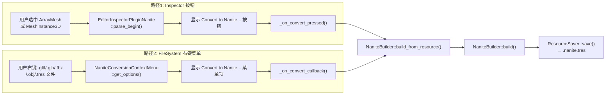
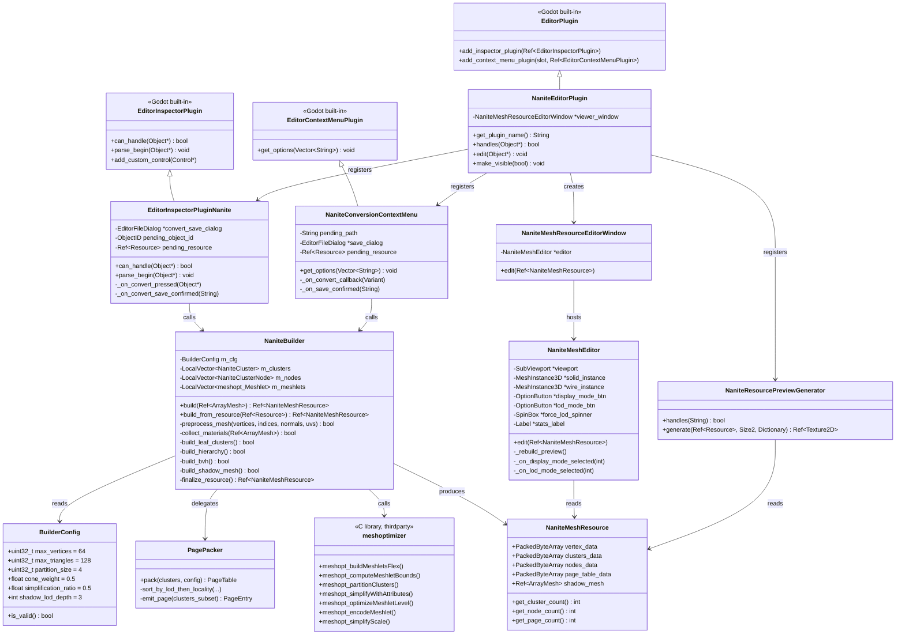
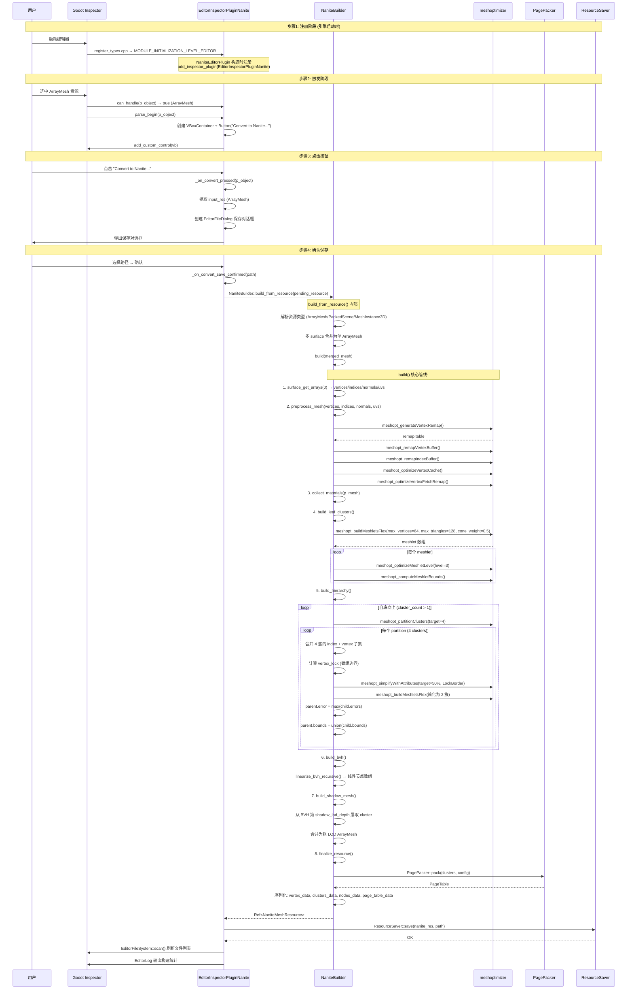
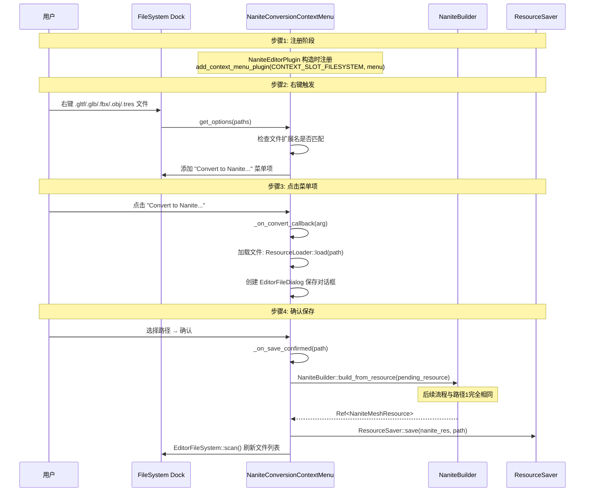
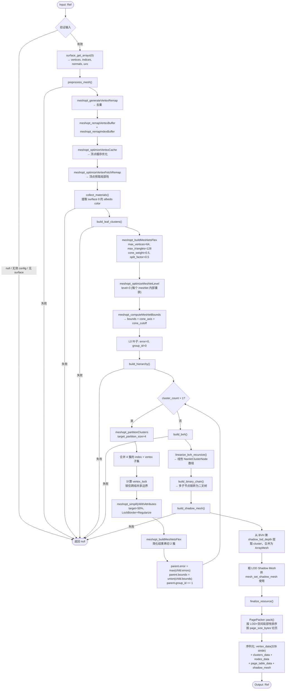
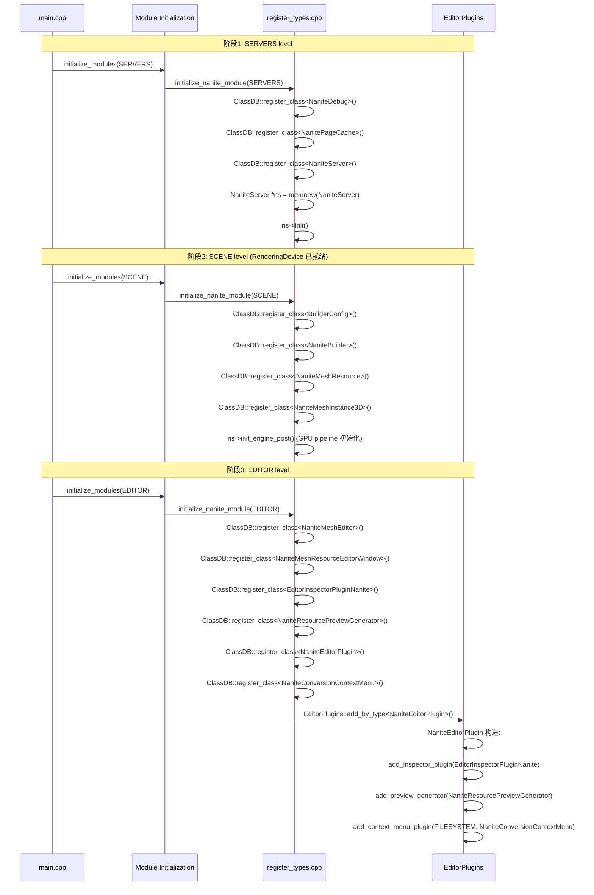

# Nanite Mesh 编辑器生成流程分析报告

> 基于 `/workspace/nanite/` 现有代码库（2026-07-29 状态）的源码级分析。
> 覆盖从用户触发到 NaniteMeshResource 保存到磁盘的完整调用链。

---

## 1. 概览：两条触发路径

编辑器中有两条独立路径可以触发 Nanite Mesh 生成：

| 路径 | 触发方式 | 入口 | 输入类型 |
|------|---------|------|---------|
| **Inspector Convert** | 选中 ArrayMesh / MeshInstance3D，点击 Inspector 中的 "Convert to Nanite..." 按钮 | `EditorInspectorPluginNanite::parse_begin()` | `ArrayMesh` / `MeshInstance3D` |
| **FileSystem Context Menu** | 在 FileSystem dock 中右键 `.gltf/.glb/.fbx/.obj/.tres` 文件，选择 "Convert to Nanite..." | `NaniteConversionContextMenu::get_options()` | 文件路径 → `Resource` |

两条路径最终都汇聚到 `NaniteBuilder::build_from_resource()` → `NaniteBuilder::build()`。



---

## 2. 涉及的类与职责

### 2.1 类层次总览



### 2.2 各类职责详解

| 类 | 文件 | 职责 |
|----|------|------|
| `NaniteEditorPlugin` | `nanite/editor/nanite_editor_plugin.h/cpp` | **编辑器插件入口**。注册 `EditorInspectorPluginNanite`、`NaniteConversionContextMenu`、`NaniteResourcePreviewGenerator`；处理 `.nanite.tres` 双击打开预览窗口 |
| `EditorInspectorPluginNanite` | 同上 | **Inspector 面板增强**。当用户选中 `ArrayMesh` 或 `MeshInstance3D` 时，在 Inspector 顶部添加 "Convert to Nanite..." 按钮 |
| `NaniteConversionContextMenu` | `nanite/editor/nanite_conversion_menu.h/cpp` | **FileSystem 右键菜单**。为 `.gltf/.glb/.fbx/.obj/.tres` 文件添加右键菜单项 |
| `NaniteBuilder` | `nanite/core/nanite_builder.h/cpp` | **离线构建核心**。驱动完整的 Nanite 构建管线：预处理 → 叶子聚类 → 层次化简化 → BVH 装配 → Shadow Mesh → 序列化 |
| `BuilderConfig` | `nanite/core/builder_config.h/cpp` | **构建参数**。可配置的构建参数：cluster 大小、简化比例、shadow LOD 深度等 |
| `NaniteMeshResource` | `nanite/core/nanite_resource.h/cpp` | **资源载体**。序列化后的 Nanite 数据：顶点池、cluster 元数据、BVH 节点、Page Table、Shadow Mesh |
| `NaniteMeshEditor` | `nanite/editor/nanite_mesh_editor.h/cpp` | **3D 预览控件**。继承 `SubViewportContainer`，在 Inspector 中渲染 3D 预览，支持 Display Mode / LOD Mode 切换 |
| `NaniteMeshResourceEditorWindow` | `nanite/editor/nanite_resource_editor_window.h/cpp` | **独立预览窗口**。双击 `.nanite.tres` 时弹出的独立窗口，内嵌 `NaniteMeshEditor` |
| `NaniteResourcePreviewGenerator` | `nanite/editor/nanite_resource_preview_gen.h/cpp` | **缩略图生成器**。为 FileSystem dock 生成 `.nanite.tres` 的缩略图 |
| `PagePacker` | `nanite/core/page_packer.h/cpp` | **Page 划分**。按 LOD + 空间局部性排序，将 cluster 划分到固定大小的 Page |
| `meshoptimizer` | `thirdparty/meshoptimizer/` | **第三方库**。提供 meshlet 构建、聚类、简化、编码等全部底层算法 |

---

## 3. 完整调用链

### 3.1 路径 1：Inspector Convert 按钮



### 3.2 路径 2：FileSystem 右键菜单



### 3.3 NaniteBuilder::build() 内部管线



---

## 4. 使用的算法

### 4.1 顶点预处理 (preprocess_mesh)

| 步骤 | 算法 | meshoptimizer API | 作用 |
|------|------|-------------------|------|
| 1 | 顶点去重 | `meshopt_generateVertexRemap()` | 合并位置/法线/UV 完全相同的顶点，减少冗余 |
| 2 | 顶点/索引重映射 | `meshopt_remapVertexBuffer()` + `meshopt_remapIndexBuffer()` | 应用 remap table，重新排列 buffer |
| 3 | 顶点缓存优化 | `meshopt_optimizeVertexCache()` | 重排三角形顺序，使顶点在 GPU 顶点缓存中的命中率最大化（Tom Forsyth 算法） |
| 4 | 顶点预取优化 | `meshopt_optimizeVertexFetchRemap()` | 重排顶点 buffer，使顶点在内存中的访问局部性最大化 |

### 4.2 叶子层聚类 (build_leaf_clusters)

| 步骤 | 算法 | 关键参数 | 作用 |
|------|------|---------|------|
| 1 | Meshlet 构建 | `meshopt_buildMeshletsFlex()` | `max_vertices=64`, `max_triangles=128`, `cone_weight=0.5` | 将三角形按空间局部性分组为 meshlet，带法线锥权重 |
| 2 | Meshlet 内部优化 | `meshopt_optimizeMeshletLevel()` | `level=3` | 在 meshlet 内部重排三角形，改善顶点缓存局部性 |
| 3 | 包围盒计算 | `meshopt_computeMeshletBounds()` | — | 计算每个 meshlet 的 AABB + 法线锥 (cone_axis, cone_cutoff) |

### 4.3 层次化简化 (build_hierarchy)

这是一个**自底向上**的迭代过程：

```
当前层 cluster 数量 = N
while N > 1:
    ┌─ 1. 分组: meshopt_partitionClusters(clusters, target_partition_size=4)
    │      将 N 个 cluster 按空间邻近性分为若干组，每组约 4 个
    │
    ├─ 2. 合并: 对每组 (partition):
    │      合并 4 个 cluster 的三角形 index + vertex 数据
    │
    ├─ 3. 锁定边界: 计算 vertex_lock
    │      标记跨分组共享边的顶点，防止简化时产生裂缝
    │
    ├─ 4. QEM 简化: meshopt_simplifyWithAttributes(target=50%, options=LockBorder+Regularize)
    │      使用二次误差度量 (Quadric Error Metrics) 简化到约 50% 三角形数
    │      LockBorder: 不移动锁定边界的顶点
    │      Regularize: 正则化网格，防止退化三角形
    │
    ├─ 5. 重聚类: meshopt_buildMeshletsFlex()
    │      将简化后的三角形重新切分为 2 个 cluster
    │
    └─ 6. 计算父节点属性:
           parent.error = max(child1.error, child2.error, ..., 简化误差)
           parent.bounds = AABB::union(child1.bounds, child2.bounds, ...)
           parent.group_id = 上一层的 group_id + 1
```

**关键算法——QEM 简化**：
- `meshopt_simplifyWithAttributes` 基于 Garland-Heckbert 的 Quadric Error Metrics 算法
- 每条边赋一个误差矩阵（quadric），表示合并该边对模型外观的影响
- 贪心地选择误差最小的边进行折叠，直到达到目标三角形数
- `LockBorder` 选项确保跨 group 的共享边界顶点不被移动，防止相邻 group 之间出现裂缝
- `Regularize` 选项在简化过程中添加正则化项，防止产生过于细长的退化三角形

### 4.4 BVH 装配 (build_bvh)

| 步骤 | 方法 | 说明 |
|------|------|------|
| 1 | `linearize_bvh_recursive()` | 递归遍历 hierarchy tree，将每个 MERGE 节点及其子节点展平为线性 `NaniteClusterNode` 数组 |
| 2 | `build_binary_chain()` | 将 MERGE 节点的多个源子节点链转为二叉树（二分叉），每个节点最多两个子节点 |

### 4.5 粗 LOD Shadow Mesh (build_shadow_mesh)

从 BVH 树的第 `config.shadow_lod_depth` 层（默认 3）提取所有 cluster 的三角形，合并为一个 `ArrayMesh`。这个 mesh 三角形数远少于原始 mesh，用于 GDExtension 阶段通过 `mesh_set_shadow_mesh()` 设置阴影代理。

### 4.6 Page 划分 (PagePacker)

| 步骤 | 说明 |
|------|------|
| 1 | 按 LOD 层级 + 空间局部性排序所有 cluster |
| 2 | 按 `config.page_size_bytes`（默认 64KB）切分为 Page |
| 3 | 每个 cluster 分配 `page_id`，输出 `PageTable` |

### 4.7 序列化 (finalize_resource)

将以下数据打包到 `NaniteMeshResource`：

| 数据 | 格式 | 说明 |
|------|------|------|
| `vertex_data` | `PackedByteArray` | 原始 stride-32 顶点数据 (pos.xyz + normal.xyz + uv.xy = 8 floats) |
| `clusters_data` | `PackedByteArray` | 所有 `NaniteCluster` 的序列化二进制 |
| `nodes_data` | `PackedByteArray` | 所有 `NaniteClusterNode` 的序列化二进制 |
| `page_table_data` | `PackedByteArray` | Page Table 的序列化二进制 |
| `shadow_mesh` | `Ref<ArrayMesh>` | 粗 LOD 阴影 mesh |

---

## 5. 模块初始化流程



---

## 6. 预览与调试可视化

### 6.1 NaniteMeshEditor 预览控件

`NaniteMeshEditor` 继承 `SubViewportContainer`，在 Inspector 中提供 3D 预览。

**结构**：
```
NaniteMeshEditor (SubViewportContainer)
├── SubViewport (独立 World3D)
│   ├── Camera3D (透视相机)
│   ├── DirectionalLight3D × 2 (双光源)
│   └── Node3D (rotation_node, 鼠标拖拽旋转)
│       ├── MeshInstance3D (solid_instance, 实体渲染)
│       └── MeshInstance3D (wire_instance, 线框叠加)
├── HBoxContainer (UI 工具栏)
│   ├── OptionButton (display_mode_btn)
│   ├── OptionButton (lod_mode_btn)
│   └── SpinBox (force_lod_spinner)
└── Label (stats_label, 构建统计)
```

**Display Mode 选项**：
| 模式 | 值 | 说明 |
|------|-----|------|
| Normal | 0 | 标准材质渲染 |
| Normal+Wireframe | 1 | 标准 + 白色线框叠加 |
| Cluster Solid | 2 | 每个 Cluster 随机颜色 |
| Cluster Solid+Wireframe | 3 | 随机颜色 + 线框 |
| Wireframe Only | 4 | 纯线框 |

**LOD Mode 选项**：
| 模式 | 说明 |
|------|------|
| Nanite Auto | 使用 Nanite GPU 管线的自动 LOD 选择（Stage 1 才可用） |
| Force LOD Level | 强制渲染指定 LOD 层级的 cluster（通过 `SpinBox` 选择） |

**注意**：Stage 0 的预览渲染**不依赖 Nanite GPU 管线**（CompositorEffect / Cull Shader / Rasterize Shader）。它从 `NaniteMeshResource` 的编码 blob 在 CPU 侧解码，构建标准 `ArrayMesh`，由 Godot 的 `MeshInstance3D` 通过常规 forward 渲染管线渲染。这意味着即使没有编译任何 Nanite bridge，预览也能正常工作。

### 6.2 双击打开独立预览窗口

当用户在 FileSystem dock 中双击 `.nanite.tres` 文件时：

```
EditorNode → 查找 handles() 返回 true 的 EditorPlugin
    → NaniteEditorPlugin::handles(NaniteMeshResource*) → true
    → NaniteEditorPlugin::edit(p_object)
        → 创建/复用 NaniteMeshResourceEditorWindow
        → viewer_window->edit(resource)
            → 内部 NaniteMeshEditor::edit(resource)
```

### 6.3 缩略图生成

`NaniteResourcePreviewGenerator` 在 FileSystem dock 中为 `.nanite.tres` 文件生成缩略图：

```
EditorResourcePreview::queue_resource_preview()
    → NaniteResourcePreviewGenerator::handles("NaniteMeshResource") → true
    → NaniteResourcePreviewGenerator::generate(resource, size, metadata)
        → 创建离屏 SubViewport + Camera3D + MeshInstance3D
        → 渲染一帧 → 截取 Texture2D 缩略图
```

---

## 7. 关键数据流

```
┌─────────────────────────────────────────────────────────────────────┐
│                        编辑器 Nanite 生成数据流                       │
├─────────────────────────────────────────────────────────────────────┤
│                                                                     │
│  输入源                                                              │
│  ┌──────────────┐  ┌──────────────┐  ┌──────────────────────┐      │
│  │ ArrayMesh    │  │ PackedScene  │  │ MeshInstance3D node  │      │
│  │ (直接选中)   │  │ (.gltf/.glb) │  │ (场景中选中)          │      │
│  └──────┬───────┘  └──────┬───────┘  └──────────┬───────────┘      │
│         │                 │                      │                   │
│         └─────────────────┼──────────────────────┘                   │
│                           ▼                                          │
│              ┌────────────────────────┐                             │
│              │ build_from_resource()  │  ← 统一入口                   │
│              │ 多 surface 合并        │                              │
│              └───────────┬────────────┘                             │
│                          ▼                                           │
│              ┌────────────────────────┐                             │
│              │ build()                │  ← 核心管线                   │
│              │ preprocess_mesh()      │    去重 + 缓存优化            │
│              │ collect_materials()    │    提取材质                    │
│              │ build_leaf_clusters()  │    叶子 meshlet 聚类           │
│              │ build_hierarchy()      │    自底向上简化                │
│              │ build_bvh()            │    线性 BVH 装配               │
│              │ build_shadow_mesh()    │    粗 LOD Shadow Mesh         │
│              │ finalize_resource()    │    Page 划分 + 序列化         │
│              └───────────┬────────────┘                             │
│                          ▼                                           │
│              ┌────────────────────────┐                             │
│              │ NaniteMeshResource     │  ← 最终产物                   │
│              │  .vertex_data          │    顶点池 (32B stride)        │
│              │  .clusters_data        │    Cluster 元数据             │
│              │  .nodes_data           │    BVH 节点                   │
│              │  .page_table_data      │    Page Table                │
│              │  .shadow_mesh          │    粗 LOD 阴影                │
│              └───────────┬────────────┘                             │
│                          ▼                                           │
│              ┌────────────────────────┐                             │
│              │ ResourceSaver::save()  │  ← 保存到磁盘                 │
│              │ → .nanite.tres         │    文本序列化                  │
│              └────────────────────────┘                             │
│                                                                     │
└─────────────────────────────────────────────────────────────────────┘
```

---

## 8. 总结

| 维度 | 描述 |
|------|------|
| **触发方式** | Inspector 按钮 + FileSystem 右键菜单，双路径 |
| **核心算法** | meshoptimizer 全家桶：顶点去重/缓存优化、meshlet 构建、QEM 简化、聚类 |
| **构建管线** | 预处理 → 叶子聚类 → 层次化简化(自底向上) → BVH 装配 → Shadow Mesh → Page 划分 → 序列化 |
| **预览方式** | CPU 侧解码 → 标准 ArrayMesh → Godot 常规 forward 渲染（不依赖 GPU Nanite 管线） |
| **保存格式** | `.nanite.tres`（Godot 文本资源格式，内嵌二进制 blob） |
| **模块注册** | SERVERS → SCENE → EDITOR 三级初始化，编辑器插件在 EDITOR 级注册 |