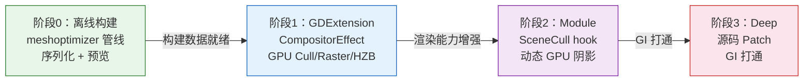

# Nanite 虚拟化几何系统 — 四阶段实施任务

> 基于 [总体设计文档](nanite-overall-design.md) 的工程化实施计划。
> 在原有三阶段（GDExtension → Module → Deep）基础上，前置阶段零：离线构建模块。
> 每个阶段包含可编译、可执行、可调试的单元测试。

---

## 总览

| 阶段 | 名称 | 核心目标 | 桥接方式 | 可独立运行 |
|------|------|---------|---------|:---------:|
| 0 | 离线构建模块 | 层次化 Meshlet + BVH 构建、序列化、预览 | 无桥接（纯 CPU + 编辑器） | ✅ |
| 1 | GDExtension 桥接 | GPU 渲染管线跑通：Cull → Raster → HZB → Material | CompositorEffect | ✅ |
| 2 | Module 桥接 | 动态 GPU 阴影 + 引擎内部 API 直调 | RendererSceneCull hook | ✅ |
| 3 | Deep 桥接 | SDFGI/VoxelGI 打通 + 引擎深度集成 | 源码 Patch | ✅ |



---

## 阶段 0：离线构建模块

**目标**：将原始 Mesh 转化为层次化 Cluster + BVH 结构，序列化为 `NaniteMeshResource`，可在编辑器中预览和调试。本阶段不涉及任何 GPU 渲染，纯 CPU 数据管线 + 编辑器 UI。

### 0.1 目录结构与编译

**任务 0.1.1**：创建 `nanite/` 核心库目录

```
nanite/
├── SConscript                    # 编译脚本
├── core/
│   ├── nanite_builder.h          # 离线构建入口
│   ├── nanite_builder.cpp
│   ├── nanite_cluster.h          # Cluster 数据定义
│   ├── nanite_cluster.cpp
│   ├── nanite_bvh.h              # BVH 线性节点
│   ├── nanite_bvh.cpp
│   ├── builder_config.h          # 构建参数
│   ├── builder_config.cpp
│   ├── page_packer.h             # Page 划分
│   ├── page_packer.cpp
│   └── nanite_resource.h         # NaniteMeshResource
│   └── nanite_resource.cpp
├── editor/
│   ├── nanite_mesh_editor.h      # 预览界面
│   ├── nanite_mesh_editor.cpp
│   ├── nanite_editor_plugin.h    # EditorPlugin
│   ├── nanite_editor_plugin.cpp
│   └── nanite_resource_preview_gen.h/cpp
└── register_types.h/cpp          # 模块注册
```

**任务 0.1.2**：编写 `SConscript`，配置 include 路径含 `thirdparty/meshoptimizer/`

**单元测试 0.1**：
```cpp
// test_nanite_dir_structure.cpp
TEST_CASE("Nanite module compiles and registers") {
    // 验证 NaniteMeshResource 类在 ClassDB 中注册
    CHECK(ClassDB::class_exists("NaniteMeshResource"));
    CHECK(ClassDB::class_exists("NaniteMeshInstance3D") == false); // 阶段1才注册
}
```

### 0.2 NaniteCluster 与 NaniteClusterNode 数据结构

**任务 0.2.1**：实现 `NaniteCluster` 结构体

```cpp
struct NaniteCluster {
    uint32_t vertex_offset = 0;
    uint32_t triangle_offset = 0;
    uint32_t vertex_count = 0;
    uint32_t triangle_count = 0;
    AABB bounds;
    Vector3 cone_axis;
    float cone_cutoff = 0.0f;
    float error = 0.0f;
    uint32_t group_id = 0;
    uint32_t material_index = 0;
    uint32_t page_id = 0;
};
```

**任务 0.2.2**：实现 `NaniteClusterNode`（BVH 线性节点）

```cpp
struct NaniteClusterNode {
    AABB bounds;
    Vector3 cone_axis;
    float cone_cutoff = 0.0f;
    float error = 0.0f;
    uint32_t left_child = UINT32_MAX;   // 叶子时为 UINT32_MAX
    uint32_t right_child = UINT32_MAX;
    uint32_t first_cluster = 0;
    uint32_t cluster_count = 0;
    uint32_t page_id = 0;
    uint32_t depth = 0;
};
```

**单元测试 0.2**：
```cpp
// test_nanite_data_structures.cpp
TEST_CASE("NaniteCluster default initialization") {
    NaniteCluster c;
    CHECK(c.vertex_count == 0);
    CHECK(c.triangle_count == 0);
    CHECK(c.error == 0.0f);
    CHECK(c.group_id == 0);
    CHECK(c.bounds == AABB());
}

TEST_CASE("NaniteClusterNode leaf sentinel") {
    NaniteClusterNode n;
    CHECK(n.left_child == UINT32_MAX);
    CHECK(n.right_child == UINT32_MAX);
    CHECK(n.cluster_count == 0);
}

TEST_CASE("NaniteCluster serialization roundtrip") {
    NaniteCluster c;
    c.vertex_count = 64;
    c.triangle_count = 128;
    c.error = 0.5f;
    c.bounds = AABB(Vector3(-1,-1,-1), Vector3(1,1,1));
    c.cone_axis = Vector3(0,1,0);
    c.cone_cutoff = 0.7f;
    c.group_id = 3;
    c.page_id = 1;

    PackedByteArray buf = c.serialize();
    NaniteCluster c2 = NaniteCluster::deserialize(buf);
    CHECK(c2.vertex_count == 64);
    CHECK(c2.triangle_count == 128);
    CHECK(c2.error == doctest::Approx(0.5f));
    CHECK(c2.bounds.position.is_equal_approx(Vector3(-1,-1,-1)));
    CHECK(c2.cone_axis.is_equal_approx(Vector3(0,1,0)));
    CHECK(c2.cone_cutoff == doctest::Approx(0.7f));
    CHECK(c2.group_id == 3);
    CHECK(c2.page_id == 1);
}

TEST_CASE("NaniteClusterNode serialization roundtrip") {
    NaniteClusterNode n;
    n.bounds = AABB(Vector3(-2,-2,-2), Vector3(2,2,2));
    n.error = 1.2f;
    n.left_child = 5;
    n.right_child = 10;
    n.first_cluster = 3;
    n.cluster_count = 4;
    n.depth = 2;

    PackedByteArray buf = n.serialize();
    NaniteClusterNode n2 = NaniteClusterNode::deserialize(buf);
    CHECK(n2.error == doctest::Approx(1.2f));
    CHECK(n2.left_child == 5);
    CHECK(n2.right_child == 10);
    CHECK(n2.first_cluster == 3);
    CHECK(n2.cluster_count == 4);
    CHECK(n2.depth == 2);
}
```

### 0.3 BuilderConfig 参数定义

**任务 0.3.1**：实现 `BuilderConfig`，暴露为 `RefCounted` 子类，可在 Inspector 中编辑

```cpp
class BuilderConfig : public RefCounted {
    GDCLASS(BuilderConfig, RefCounted);
public:
    uint32_t max_vertices = 64;
    uint32_t min_triangles = 32;
    uint32_t max_triangles = 128;
    uint32_t partition_size = 4;
    float cone_weight = 0.5f;
    float split_factor = 0.5f;
    float simplification_ratio = 0.5f;
    float target_error = 0.5f;
    uint32_t max_lod_levels = 16;
    uint32_t page_size_bytes = 65536;
    bool lock_partition_border = true;
    int meshlet_optimize_level = 3;
    int shadow_lod_depth = 3;
};
```

**单元测试 0.3**：
```cpp
// test_builder_config.cpp
TEST_CASE("BuilderConfig defaults are valid") {
    BuilderConfig cfg;
    CHECK(cfg.max_vertices == 64);
    CHECK(cfg.max_triangles == 128);
    CHECK(cfg.partition_size == 4);
    CHECK(cfg.cone_weight == doctest::Approx(0.5f));
    CHECK(cfg.max_lod_levels == 16);
    CHECK(cfg.page_size_bytes == 65536);
    CHECK(cfg.shadow_lod_depth == 3);
}

TEST_CASE("BuilderConfig validates out-of-range values") {
    BuilderConfig cfg;
    cfg.max_triangles = 0;
    CHECK_FALSE(cfg.is_valid());
    cfg.max_triangles = 256;
    cfg.max_vertices = 0;
    CHECK_FALSE(cfg.is_valid());
    cfg.max_vertices = 64;
    cfg.partition_size = 1;
    CHECK_FALSE(cfg.is_valid()); // partition_size 必须 >= 2
}
```

### 0.4 NaniteBuilder — 叶子层构建

**任务 0.4.1**：实现 `NaniteBuilder::preprocess_mesh()` — 调用 `meshopt_generateVertexRemap` + `meshopt_optimizeVertexCache` + `meshopt_optimizeVertexFetch`

**任务 0.4.2**：实现 `NaniteBuilder::build_leaf_clusters()` — 调用 `meshopt_buildMeshletsFlex` + `meshopt_optimizeMeshletLevel` + `meshopt_computeMeshletBounds`

**单元测试 0.4**：
```cpp
// test_nanite_builder_leaf.cpp

// 辅助：生成一个简单的测试 Mesh（立方体 = 12 tri, 24 vertex with normals）
static Ref<ArrayMesh> create_cube_mesh() {
    Ref<ArrayMesh> mesh;
    mesh.instantiate();
    // ... 构建 6 面，每面 2 tri，含法线
    return mesh;
}

// 辅助：生成高面数球体 Mesh（~2000 tri）
static Ref<ArrayMesh> create_sphere_mesh(int segments = 32) {
    Ref<ArrayMesh> mesh;
    mesh.instantiate();
    // ... 球体参数化生成
    return mesh;
}

TEST_CASE("preprocess_mesh deduplicates vertices") {
    // 构造有重复顶点的 mesh
    PackedVector3Array vertices = {V3(0,0,0), V3(1,0,0), V3(0,1,0),
                                    V3(0,0,0), V3(1,0,0), V3(0,1,0)}; // 重复
    PackedInt32Array indices = {0,1,2, 3,4,5};
    auto [out_verts, out_indices] = NaniteBuilder::preprocess_mesh(vertices, indices);
    CHECK(out_verts.size() == 3); // 去重后
    CHECK(out_indices.size() == 6); // 索引不变
}

TEST_CASE("build_leaf_clusters produces clusters from cube mesh") {
    Ref<ArrayMesh> cube = create_cube_mesh();
    BuilderConfig cfg;
    NaniteBuilder builder(cfg);
    LocalVector<NaniteCluster> clusters = builder.build_leaf_clusters(cube);

    CHECK(clusters.size() >= 1);
    for (const auto &c : clusters) {
        CHECK(c.vertex_count <= cfg.max_vertices);
        CHECK(c.triangle_count <= cfg.max_triangles);
        CHECK(c.triangle_count >= cfg.min_triangles);
        CHECK(c.error == 0.0f); // L0 叶子 error 为 0
        CHECK(c.bounds.has_volume());
    }
}

TEST_CASE("build_leaf_clusters each cluster has valid bounds and cone") {
    Ref<ArrayMesh> sphere = create_sphere_mesh();
    BuilderConfig cfg;
    NaniteBuilder builder(cfg);
    LocalVector<NaniteCluster> clusters = builder.build_leaf_clusters(sphere);

    CHECK(clusters.size() >= 8); // 2000 tri / 128 ≈ 16 clusters
    for (const auto &c : clusters) {
        CHECK(c.bounds.has_volume());
        CHECK(c.cone_axis.length() > 0.9f); // 单位向量
        CHECK(c.cone_cutoff >= -1.0f);
        CHECK(c.cone_cutoff <= 1.0f);
    }
}
```

### 0.5 NaniteBuilder — 层次化简化与 BVH 装配

**任务 0.5.1**：实现 `NaniteBuilder::build_hierarchy()` — 自底向上循环：`partitionClusters` → `simplifyWithAttributes` → `buildMeshletsFlex` → 计算父节点 error/bounds

**任务 0.5.2**：实现 `NaniteBuilder::build_bvh()` — 展开层次结构为线性 `NaniteClusterNode` 数组

**单元测试 0.5**：
```cpp
// test_nanite_builder_hierarchy.cpp

TEST_CASE("build_hierarchy reduces cluster count per level") {
    Ref<ArrayMesh> sphere = create_sphere_mesh(64); // ~8000 tri
    BuilderConfig cfg;
    NaniteBuilder builder(cfg);
    auto [clusters, nodes] = builder.build(sphere);

    // 应该有多层 BVH
    CHECK(nodes.size() >= 3);

    // 根节点 error 最大
    float root_error = nodes[0].error;
    for (const auto &n : nodes) {
        CHECK(n.error <= root_error + 0.001f); // 根节点 error >= 所有子节点
    }
}

TEST_CASE("BVH parent bounds contain child bounds") {
    Ref<ArrayMesh> sphere = create_sphere_mesh();
    BuilderConfig cfg;
    NaniteBuilder builder(cfg);
    auto [clusters, nodes] = builder.build(sphere);

    for (int i = 0; i < (int)nodes.size(); i++) {
        const auto &n = nodes[i];
        if (n.left_child != UINT32_MAX) {
            CHECK(nodes[n.left_child].bounds.is_inside(n.bounds));
        }
        if (n.right_child != UINT32_MAX) {
            CHECK(nodes[n.right_child].bounds.is_inside(n.bounds));
        }
    }
}

TEST_CASE("BVH root bounds contain entire mesh") {
    Ref<ArrayMesh> sphere = create_sphere_mesh();
    AABB mesh_aabb = sphere->get_aabb();
    BuilderConfig cfg;
    NaniteBuilder builder(cfg);
    auto [clusters, nodes] = builder.build(sphere);

    CHECK(mesh_aabb.is_inside(nodes[0].bounds));
}

TEST_CASE("Simplification reduces triangle count") {
    Ref<ArrayMesh> sphere = create_sphere_mesh();
    BuilderConfig cfg;
    NaniteBuilder builder(cfg);
    auto [clusters, nodes] = builder.build(sphere);

    // 统计每层的三角形总数
    // 叶子层应该最多，越往上越少
    int leaf_tris = 0, parent_tris = 0;
    for (const auto &c : clusters) {
        if (c.group_id == 0) leaf_tris += c.triangle_count;
        else parent_tris += c.triangle_count;
    }
    CHECK(leaf_tris > parent_tris);
}

TEST_CASE("Parent error >= max child error") {
    Ref<ArrayMesh> sphere = create_sphere_mesh();
    BuilderConfig cfg;
    NaniteBuilder builder(cfg);
    auto [clusters, nodes] = builder.build(sphere);

    for (const auto &n : nodes) {
        if (n.left_child == UINT32_MAX) continue; // 叶子跳过
        float max_child_error = 0;
        // 遍历子节点的 clusters
        for (uint32_t ci = nodes[n.left_child].first_cluster;
             ci < nodes[n.left_child].first_cluster + nodes[n.left_child].cluster_count; ci++) {
            max_child_error = MAX(max_child_error, clusters[ci].error);
        }
        for (uint32_t ci = nodes[n.right_child].first_cluster;
             ci < nodes[n.right_child].first_cluster + nodes[n.right_child].cluster_count; ci++) {
            max_child_error = MAX(max_child_error, clusters[ci].error);
        }
        CHECK(n.error >= max_child_error - 0.001f);
    }
}
```

### 0.6 Page 划分

**任务 0.6.1**：实现 `PagePacker` — 按 LOD + 空间局部性排序，按 `page_size_bytes` 切页

**单元测试 0.6**：
```cpp
// test_page_packer.cpp

TEST_CASE("PagePacker assigns page_id to all clusters") {
    LocalVector<NaniteCluster> clusters;
    for (int i = 0; i < 100; i++) {
        NaniteCluster c;
        c.group_id = i % 5;
        c.page_id = 0; // 待分配
        clusters.push_back(c);
    }

    BuilderConfig cfg;
    PagePacker packer;
    PageTable table = packer.pack(clusters, cfg);

    // 所有 cluster 都分配了 page_id
    for (const auto &c : clusters) {
        CHECK(c.page_id < table.page_count);
    }
}

TEST_CASE("PagePacker respects page size limit") {
    LocalVector<NaniteCluster> clusters;
    for (int i = 0; i < 200; i++) {
        NaniteCluster c;
        c.group_id = i / 10;
        c.triangle_count = 64;
        c.vertex_count = 32;
        clusters.push_back(c);
    }

    BuilderConfig cfg;
    cfg.page_size_bytes = 4096; // 小 page，强制多页
    PagePacker packer;
    PageTable table = packer.pack(clusters, cfg);

    CHECK(table.page_count > 1);
    for (int p = 0; p < (int)table.page_count; p++) {
        uint32_t page_bytes = table.compute_page_size(p, clusters);
        CHECK(page_bytes <= cfg.page_size_bytes * 2); // 允许少量溢出
    }
}

TEST_CASE("Same-LOD clusters prefer same page") {
    LocalVector<NaniteCluster> clusters;
    for (int i = 0; i < 50; i++) {
        NaniteCluster c;
        c.group_id = 0; // 全部同 LOD
        clusters.push_back(c);
    }

    BuilderConfig cfg;
    PagePacker packer;
    PageTable table = packer.pack(clusters, cfg);

    // 同 LOD cluster 应尽量在同一页
    HashSet<uint32_t> pages;
    for (const auto &c : clusters) {
        pages.insert(c.page_id);
    }
    CHECK(pages.size() <= 3); // 不应过度分散
}
```

### 0.7 粗 LOD Shadow Mesh 生成

**任务 0.7.1**：实现 `NaniteBuilder::build_shadow_mesh()` — 从 BVH 的第 `shadow_lod_depth` 层取 Cluster 合并为 `ArrayMesh`

**单元测试 0.7**：
```cpp
// test_shadow_mesh.cpp

TEST_CASE("Shadow mesh has fewer triangles than original") {
    Ref<ArrayMesh> sphere = create_sphere_mesh(64);
    BuilderConfig cfg;
    cfg.shadow_lod_depth = 3;
    NaniteBuilder builder(cfg);
    auto [clusters, nodes] = builder.build(sphere);
    Ref<ArrayMesh> shadow = builder.build_shadow_mesh(clusters, nodes);

    CHECK(shadow->get_faces() < sphere->get_faces());
    CHECK(shadow->get_faces() > 0);
}

TEST_CASE("Shadow mesh bounds contain original mesh bounds") {
    Ref<ArrayMesh> sphere = create_sphere_mesh();
    BuilderConfig cfg;
    NaniteBuilder builder(cfg);
    auto [clusters, nodes] = builder.build(sphere);
    Ref<ArrayMesh> shadow = builder.build_shadow_mesh(clusters, nodes);

    AABB original_aabb = sphere->get_aabb();
    AABB shadow_aabb = shadow->get_aabb();
    CHECK(original_aabb.is_inside(shadow_aabb.grow(0.01f)));
}

TEST_CASE("Shadow mesh is valid for mesh_set_shadow_mesh") {
    Ref<ArrayMesh> sphere = create_sphere_mesh();
    BuilderConfig cfg;
    NaniteBuilder builder(cfg);
    auto [clusters, nodes] = builder.build(sphere);
    Ref<ArrayMesh> shadow = builder.build_shadow_mesh(clusters, nodes);

    // 验证 shadow mesh 可以创建 RID
    RID shadow_rid = RenderingServer::get_singleton()->mesh_create();
    // 可以设置 surface (验证不会崩溃)
    CHECK(shadow_rid.is_valid());
    RenderingServer::get_singleton()->free(shadow_rid);
}
```

### 0.8 序列化与 NaniteMeshResource

**任务 0.8.1**：实现 `NaniteMeshResource` — 继承 `Resource`，包含序列化/反序列化方法

**任务 0.8.2**：使用 `meshopt_encodeMeshlet` / `meshopt_encodeVertexBuffer` 进行压缩编码

**任务 0.8.3**：实现 `.nanite` 二进制格式读写

**单元测试 0.8**：
```cpp
// test_nanite_resource.cpp

TEST_CASE("NaniteMeshResource save/load roundtrip") {
    Ref<ArrayMesh> sphere = create_sphere_mesh(32);
    BuilderConfig cfg;
    NaniteBuilder builder(cfg);
    Ref<NaniteMeshResource> res = builder.build(sphere);

    // 保存到临时文件
    String path = "user://test_nanite_resource.nanite";
    res->save(path);

    // 重新加载
    Ref<NaniteMeshResource> loaded;
    loaded.instantiate();
    loaded->load(path);

    CHECK(loaded->cluster_count == res->cluster_count);
    CHECK(loaded->node_count == res->node_count);
    CHECK(loaded->page_count == res->page_count);
    CHECK(loaded->vertex_data.size() == res->vertex_data.size());
    CHECK(loaded->clusters_data.size() == res->clusters_data.size());
}

TEST_CASE("NaniteMeshResource Godot serialization roundtrip") {
    Ref<ArrayMesh> sphere = create_sphere_mesh();
    BuilderConfig cfg;
    NaniteBuilder builder(cfg);
    Ref<NaniteMeshResource> res = builder.build(sphere);

    // 通过 Godot 的 ResourceLoader/ResourceSaver
    String path = "res://test_nanite.tres";
    ResourceSaver::save(res, path);

    Ref<NaniteMeshResource> loaded = ResourceLoader::load(path);
    CHECK(loaded.is_valid());
    CHECK(loaded->cluster_count == res->cluster_count);
}

TEST_CASE("Encoded meshlet decode matches original") {
    // 构造一个 cluster 的 vertex + index 数据
    PackedVector3Array vertices;
    PackedInt32Array indices;
    for (int i = 0; i < 64; i++) vertices.push_back(Vector3(i*0.1f, 0, 0));
    for (int i = 0; i < 128; i++) indices.push_back(i % 64);

    // encode → decode → 比较
    PackedByteArray encoded = NaniteMeshResource::encode_meshlet(vertices, indices);
    auto [dec_verts, dec_indices] = NaniteMeshResource::decode_meshlet(encoded);

    CHECK(dec_verts.size() == vertices.size());
    CHECK(dec_indices.size() == indices.size());
    for (int i = 0; i < (int)vertices.size(); i++) {
        CHECK(dec_verts[i].is_equal_approx(vertices[i]));
    }
}
```

### 0.9 编辑器预览与调试可视化

**任务 0.9.1**：实现 `NaniteMeshEditor` — 继承 `SubViewportContainer`，3D 旋转预览 + 构建统计

**任务 0.9.2**：实现 `EditorInspectorPluginNanite` + `NaniteEditorPlugin`

**任务 0.9.3**：实现 `NaniteResourcePreviewGenerator` — 资源缩略图

**单元测试 0.9**：
```gdscript
# test_nanite_editor.gd — 编辑器集成测试（场景测试）
extends "res://addons/gut/test.gd"

func test_nanite_resource_appears_in_inspector():
    var res = NaniteMeshResource.new()
    # 触发 InspectorPlugin
    var plugin = EditorInspectorPluginNanite.new()
    assert(plugin.can_handle(res), "InspectorPlugin should handle NaniteMeshResource")

func test_nanite_mesh_editor_edit():
    var editor = NaniteMeshEditor.new()
    var res = NaniteMeshResource.new()
    # 应不崩溃
    editor.edit(res)
    assert(true)

func test_resource_preview_generator_handles_nanite():
    var gen = NaniteResourcePreviewGenerator.new()
    assert(gen.handles("NaniteMeshResource"), "Preview generator should handle NaniteMeshResource")
```

### 0.10 阶段 0 端到端测试

**任务 0.10.1**：完整的导入 → 构建 → 预览流程

**端到端测试**：
```gdscript
# test_nanite_e2e_build.gd
extends "res://addons/gut/test.gd"

func test_full_build_pipeline():
    # 1. 创建测试 Mesh
    var mesh = ArrayMesh.new()
    var st = SurfaceTool.new()
    st.create_from(Mesh.PRIMITIVE_TRIANGLES)
    # 添加 Icosphere ~1000 tri
    _add_icosphere(st, Vector3.ZERO, 1.0, 3)
    st.commit(mesh)

    # 2. 构建 Nanite
    var config = BuilderConfig.new()
    var builder = NaniteBuilder.new(config)
    var resource = builder.build(mesh)

    # 3. 验证结果
    assert(resource != null, "Build should succeed")
    assert(resource.cluster_count > 0, "Should have clusters")
    assert(resource.node_count > 0, "Should have BVH nodes")
    assert(resource.page_count > 0, "Should have pages")
    assert(resource.shadow_mesh != null, "Should have shadow mesh")

    # 4. 保存/加载
    var err = ResourceSaver.save(resource, "res://test_e2e_nanite.tres")
    assert(err == OK, "Save should succeed")

    var loaded = ResourceLoader.load("res://test_e2e_nanite.tres")
    assert(loaded.cluster_count == resource.cluster_count, "Roundtrip cluster count match")

func test_build_large_mesh():
    # 测试 ~50K tri mesh 的构建
    var mesh = _create_large_test_mesh(50000)
    var config = BuilderConfig.new()
    var builder = NaniteBuilder.new(config)
    var resource = builder.build(mesh)

    assert(resource.cluster_count > 100, "50K tri mesh should produce many clusters")
    assert(resource.node_count > 10, "Should have deep BVH")
```

### 0.11 阶段 0 验收标准

- [ ] `NaniteCluster` / `NaniteClusterNode` 数据结构完整，序列化 roundtrip 正确
- [ ] `BuilderConfig` 参数验证，Inspector 可编辑
- [ ] `NaniteBuilder::build_leaf_clusters()` 正确调用 meshoptimizer，cluster 满足约束
- [ ] `NaniteBuilder::build_hierarchy()` 自底向上简化，parent error >= child error
- [ ] BVH parent bounds 包含 child bounds
- [ `PagePacker` 正确分配 page_id，page 大小不超限
- [ ] 粗 LOD Shadow Mesh 三角形数少于原始 mesh
- [ ] `NaniteMeshResource` 保存/加载 roundtrip 正确
- [ ] meshlet encode/decode roundtrip 正确
- [ ] `NaniteMeshEditor` 在 Inspector 中可预览
- [ ] 所有单元测试通过

---

## 阶段 1：GDExtension 桥接

**目标**：通过 CompositorEffect 接入 Godot 渲染管线，实现 GPU-driven 的 Cull → Raster → HZB Build → Material Eval 全流程。使用粗 LOD 阴影方案。

### 1.1 GDExtension 框架搭建

**任务 1.1.1**：创建 GDExtension 项目结构

```
nanite_gdext/
├── nanite.gdextension
├── SConstruct
├── src/
│   ├── register_types.h/cpp
│   ├── bridge/
│   │   ├── nanite_bridge_interface.h     # INaniteBridge 接口
│   │   ├── nanite_gdext_bridge.h/cpp     # CompositorEffect 子类
│   │   └── nanite_bridge_factory.h/cpp   # 桥接创建工厂
│   ├── server/
│   │   ├── nanite_server.h/cpp           # NaniteServer 单例
│   │   └── nanite_page_cache.h/cpp
│   ├── scene/
│   │   └── nanite_mesh_instance_3d.h/cpp
│   ├── gpu/
│   │   ├── nanite_gpu_pipeline.h/cpp     # GPU pipeline 管理
│   │   ├── nanite_hzb.h/cpp              # GPU HZB
│   │   └── nanite_mesh_data.h/cpp        # GPU buffer 管理
│   └── shaders/
│       ├── nanite_cull.glsl
│       ├── nanite_rasterize.glsl
│       ├── nanite_hzb_downsample.glsl
│       └── nanite_material_resolve.glsl
```

**任务 1.1.2**：实现 `NaniteGDExtBridge` — 继承 `CompositorEffect`，注册 `PRE_OPAQUE` + `POST_OPAQUE` 回调

**单元测试 1.1**：
```cpp
// test_gdext_bridge.cpp
TEST_CASE("NaniteGDExtBridge registers as CompositorEffect") {
    Ref<NaniteGDExtBridge> bridge;
    bridge.instantiate();
    CHECK(bridge->is_class("CompositorEffect"));
    CHECK(bridge->get_effect_callback_type() ==
          CompositorEffect::EFFECT_CALLBACK_TYPE_PRE_OPAQUE);
}

TEST_CASE("Bridge PRE_OPAQUE callback is invoked during render") {
    // 通过 Godot 渲染管线集成测试
    // 在 SceneTree 中添加带 NaniteMeshInstance3D 的场景
    // 验证 _render_callback 被调用
    int call_count = 0;
    // ... mock 回调计数
    CHECK(call_count > 0);
}
```

### 1.2 INaniteBridge 抽象接口 + NaniteServer

**任务 1.2.1**：实现 `INaniteBridge` 接口

```cpp
class INaniteBridge {
public:
    virtual void install(NaniteServer *p_server) = 0;
    virtual ShadowMode get_shadow_mode() const = 0;
    virtual void on_pre_opaque_pass(const RenderData *p_render_data) = 0;
    virtual void on_post_opaque_pass(const RenderData *p_render_data) = 0;
    virtual StringName get_bridge_name() const = 0;
};
```

**任务 1.2.2**：实现 `NaniteServer` 单例 — 管理 mesh/instance 注册、bridge 切换、GPU pipeline 生命周期

**任务 1.2.3**：实现 `NaniteMeshInstance3D` — 场景节点，注册/注销到 NaniteServer

**单元测试 1.2**：
```cpp
// test_nanite_server.cpp
TEST_CASE("NaniteServer singleton creation") {
    NaniteServer *srv = NaniteServer::get_singleton();
    CHECK(srv != nullptr);
}

TEST_CASE("Register and unregister NaniteMeshInstance3D") {
    auto *srv = NaniteServer::get_singleton();
    NaniteMeshInstance3D *inst = memnew(NaniteMeshInstance3D);
    srv->register_instance(inst);
    CHECK(srv->get_instance_count() == 1);
    srv->unregister_instance(inst);
    CHECK(srv->get_instance_count() == 0);
    memdelete(inst);
}

TEST_CASE("NaniteMeshInstance3D sets nanite mesh resource") {
    auto *inst = memnew(NaniteMeshInstance3D);
    Ref<NaniteMeshResource> res;
    res.instantiate();
    inst->set_nanite_mesh(res);
    CHECK(inst->get_nanite_mesh() == res);
    memdelete(inst);
}
```

### 1.3 NaniteMeshData — GPU Buffer 管理

**任务 1.3.1**：实现 `NaniteMeshData` — 将 `NaniteMeshResource` 的数据上传到 GPU SSBO

```cpp
class NaniteMeshData {
    RID cluster_ssbo;
    RID vertex_ssbo;
    RID index_ssbo;
    RID bvh_ssbo;
    bool gpu_uploaded = false;
public:
    void upload_to_gpu(RenderingDevice *rd, const NaniteMeshResource *res);
    void free_gpu_resources(RenderingDevice *rd);
    RID get_cluster_ssbo() const;
    RID get_bvh_ssbo() const;
};
```

**单元测试 1.3**：
```cpp
// test_nanite_mesh_data.cpp
TEST_CASE("NaniteMeshData upload creates valid RIDs") {
    auto *rd = RenderingDevice::get_singleton();
    Ref<NaniteMeshResource> res = _create_test_resource(); // 阶段0构建的测试资源
    NaniteMeshData data;
    data.upload_to_gpu(rd, res.ptr());

    CHECK(data.get_cluster_ssbo().is_valid());
    CHECK(data.get_vertex_ssbo().is_valid());
    CHECK(data.get_bvh_ssbo().is_valid());
    CHECK(data.is_gpu_uploaded());

    data.free_gpu_resources(rd);
    CHECK_FALSE(data.is_gpu_uploaded());
}

TEST_CASE("NaniteMeshData SSBO sizes match resource data") {
    auto *rd = RenderingDevice::get_singleton();
    Ref<NaniteMeshResource> res = _create_test_resource();
    NaniteMeshData data;
    data.upload_to_gpu(rd, res.ptr());

    uint64_t cluster_size = rd->buffer_get_data(data.get_cluster_ssbo()).size();
    CHECK(cluster_size == res->clusters_data.size());

    data.free_gpu_resources(rd);
}
```

### 1.4 NaniteGPUPipeline — Cull + Rasterize Shader

**任务 1.4.1**：编写 `nanite_cull.glsl` — BVH 遍历 + 视锥/背面/遮挡剔除 + LOD 选择

**任务 1.4.2**：编写 `nanite_rasterize.glsl` — Visibility Buffer 软光栅（小三角） + 硬件光栅（大三角）混合

**任务 1.4.3**：实现 `NaniteGPUPipeline::dispatch_cull()` 和 `dispatch_rasterize()`

**单元测试 1.4**：
```cpp
// test_nanite_gpu_cull.cpp
TEST_CASE("Cull shader produces visible cluster list") {
    // 在 RD compute 中 dispatch cull
    // 回读 visible_cluster_count buffer
    // 验证：相机视锥内的 cluster 被保留，视锥外的被剔除
    auto *rd = RenderingDevice::get_singleton();
    Ref<NaniteMeshResource> res = _create_test_resource();
    NaniteMeshData data;
    data.upload_to_gpu(rd, res.ptr());

    NaniteGPUPipeline pipeline;
    pipeline.init(rd);

    // 设置相机参数（看向 mesh）
    CullParams params;
    params.view_matrix = Transform3D().looking_at(Vector3(0,0,-1), Vector3(0,1,0));
    params.projection = Projection::create_perspective(70, 1.0, 0.1, 100.0);
    params.screen_size = Vector2i(1920, 1080);

    RID visible_buffer = pipeline.dispatch_cull(rd, params);
    CHECK(visible_buffer.is_valid());

    // 回读 visible count
    Vector<uint8_t> readback = rd->buffer_get_data(visible_buffer);
    uint32_t visible_count = *reinterpret_cast<const uint32_t*>(readback.ptr());
    CHECK(visible_count > 0);
    CHECK(visible_count <= res->cluster_count);
}

TEST_CASE("Cull shader respects frustum boundaries") {
    // 将相机朝向远离 mesh 的方向
    // 验证：所有 cluster 被剔除
    // ...
    CHECK(visible_count == 0);
}

TEST_CASE("Rasterize shader produces valid Visibility Buffer") {
    // dispatch cull → dispatch rasterize
    // 验证 VisBuffer 非零
    // ...
    CHECK(vis_buffer_data.size() > 0);
}
```

### 1.5 NaniteHZB — GPU 层次化深度缓冲

**任务 1.5.1**：编写 `nanite_hzb_downsample.glsl` — Compute Shader 逐级降采样取 MAX

**任务 1.5.2**：实现 `NaniteHZB` — init/cleanup/resize/build

**任务 1.5.3**：实现 `NaniteGPUPipeline::dispatch_hzb_build()`

**单元测试 1.5**：
```cpp
// test_nanite_hzb.cpp

TEST_CASE("NaniteHZB creates correct mip count for given resolution") {
    auto *rd = RenderingDevice::get_singleton();
    NaniteHZB hzb;
    hzb.init(rd);
    hzb.resize(rd, Size2i(1920, 1080));

    // 1920x1080 → mip count = ceil(log2(max(1920,1080))) = 11
    CHECK(hzb.get_mip_count() == 11);
    hzb.cleanup(rd);
}

TEST_CASE("NaniteHZB build produces valid depth pyramid") {
    auto *rd = RenderingDevice::get_singleton();
    NaniteHZB hzb;
    hzb.init(rd);
    hzb.resize(rd, Size2i(256, 256));

    // 创建测试深度纹理（R32_SFLOAT，全部 0.5）
    RID depth_tex = _create_constant_depth_texture(rd, Size2i(256,256), 0.5f);
    hzb.build(rd, depth_tex);

    // 回读 mip 0 的中心像素
    RID hzb_tex = hzb.get_hzb_texture();
    Vector<uint8_t> data = rd->texture_get_data(hzb_tex, 0);
    // 验证至少有一些数据
    CHECK(data.size() > 0);

    rd->free_rid(depth_tex);
    hzb.cleanup(rd);
}

TEST_CASE("HZB downsample takes MAX of 2x2") {
    // 创建 4x4 深度纹理，左上 0.2，右上 0.8，左下 0.4，右下 0.6
    // mip 1 中心像素应为 max(0.2, 0.8, 0.4, 0.6) = 0.8
    auto *rd = RenderingDevice::get_singleton();

    RID depth_tex = _create_depth_texture_4x4(rd,
        {0.2f, 0.8f, 0.2f, 0.8f,
         0.4f, 0.6f, 0.4f, 0.6f,
         0.2f, 0.8f, 0.2f, 0.8f,
         0.4f, 0.6f, 0.4f, 0.6f});

    NaniteHZB hzb;
    hzb.init(rd);
    hzb.resize(rd, Size2i(4, 4));
    hzb.build(rd, depth_tex);

    // 回读 mip 1 (2x2)
    Vector<uint8_t> mip1 = rd->texture_get_data(hzb.get_hzb_texture(), 1);
    float val = *reinterpret_cast<const float*>(mip1.ptr());
    CHECK(val == doctest::Approx(0.8f));

    rd->free_rid(depth_tex);
    hzb.cleanup(rd);
}

TEST_CASE("HZB resize handles resolution change") {
    auto *rd = RenderingDevice::get_singleton();
    NaniteHZB hzb;
    hzb.init(rd);
    hzb.resize(rd, Size2i(1920, 1080));
    int mips1 = hzb.get_mip_count();

    hzb.resize(rd, Size2i(3840, 2160));
    int mips2 = hzb.get_mip_count();

    CHECK(mips2 > mips1); // 更高分辨率 → 更多 mip
    hzb.cleanup(rd);
}
```

### 1.6 Material Resolve Shader

**任务 1.6.1**：编写 `nanite_material_resolve.glsl` — 从 VisBuffer 解码 → 顶点插值 → 材质着色

**任务 1.6.2**：实现 `NaniteGPUPipeline::dispatch_material_resolve()`

**单元测试 1.6**：
```cpp
// test_material_resolve.cpp

TEST_CASE("Material resolve produces non-black output") {
    // 全流程：cull → rasterize → hzb_build → material_resolve
    // 回读输出 color buffer，验证有非零像素
    auto *rd = RenderingDevice::get_singleton();
    // ... setup pipeline
    // 验证最终颜色 buffer 有内容
    CHECK(has_non_zero_pixels);
}

TEST_CASE("Material resolve with single color material") {
    // 设置所有 cluster 使用红色材质
    // 验证输出像素的红色通道 > 0
    // ...
    CHECK(red_channel > 0.5f);
}
```

### 1.7 阴影 — 粗 LOD 方案

**任务 1.7.1**：在 `NaniteMeshInstance3D` 中调用 `RenderingServer::get_singleton()->mesh_set_shadow_mesh(mesh_rid, shadow_mesh_rid)`

**任务 1.7.2**：验证 Godot 自动使用 shadow mesh 进行阴影投射

**单元测试 1.7**：
```gdscript
# test_shadow_mesh.gd
extends "res://addons/gut/test.gd"

func test_shadow_mesh_is_set_on_instance():
    var instance = NaniteMeshInstance3D.new()
    var resource = _build_test_nanite_resource()
    instance.set_nanite_mesh(resource)

    # 等待一帧让 RID 创建
    await get_tree().process_frame

    var rs = RenderingServer.get_singleton()
    var mesh_rid = instance.get_mesh_rid()
    # 验证 shadow mesh 被设置
    assert(rs.mesh_get_shadow_mesh(mesh_rid).is_valid())

func test_shadow_appears_in_scene():
    # 创建场景：NaniteMeshInstance3D + DirectionalLight3D + 接收阴影的地面
    # 截图验证阴影存在
    # ...
    pass
```

### 1.8 NaniteDebug — 调试可视化

**任务 1.8.1**：实现 `NaniteDebug` — Cluster 纯色、LOD 着色、Overdraw 热力图、Bounds 显示、HZB mip 可视化

**单元测试 1.8**：
```gdscript
# test_nanite_debug.gd
extends "res://addons/gut/test.gd"

func test_debug_mode_changes_render_output():
    var srv = NaniteServer.get_singleton()
    srv.set_debug_mode(NaniteDebugMode.CLUSTER_SOLID_COLOR)
    await get_tree().process_frame
    # 截图验证：不同 cluster 有不同颜色
    assert(true) # 视觉验证

func test_hzb_debug_visualization():
    var srv = NaniteServer.get_singleton()
    srv.set_debug_mode(NaniteDebugMode.HZB_MIP_LEVELS)
    await get_tree().process_frame
    # 验证 HZB mip 被绘制到屏幕四角
    assert(true)
```

### 1.9 阶段 1 端到端测试

**端到端测试**：
```gdscript
# test_gdext_e2e.gd
extends "res://addons/gut/test.gd"

func test_full_gdext_render_pipeline():
    # 1. 创建场景
    var scene_root = Node3D.new()
    add_child(scene_root)

    # 2. 添加 Nanite 网格
    var instance = NaniteMeshInstance3D.new()
    instance.set_nanite_mesh(_build_test_resource_sphere())
    instance.position = Vector3(0, 0, -5)
    scene_root.add_child(instance)

    # 3. 添加相机
    var camera = Camera3D.new()
    camera.current = true
    scene_root.add_child(camera)

    # 4. 添加光源
    var light = DirectionalLight3D.new()
    light.shadow_enabled = true
    scene_root.add_child(light)

    # 5. 渲染多帧
    for i in range(5):
        await get_tree().process_frame

    # 6. 验证
    var srv = NaniteServer.get_singleton()
    assert(srv.get_instance_count() == 1)
    assert(srv.get_visible_cluster_count() > 0)

func test_gdext_performance_baseline():
    var instance = NaniteMeshInstance3D.new()
    instance.set_nanite_mesh(_build_large_resource()) # ~100K tri
    add_child(instance)

    # 测量 60 帧平均帧时间
    var frame_times = []
    for i in range(60):
        var t = Time.get_ticks_usec()
        await get_tree().process_frame
        frame_times.append(Time.get_ticks_usec() - t)

    var avg_ms = frame_times.reduce(func(a,b): return a+b) / frame_times.size() / 1000.0
    assert(avg_ms < 33.0, "Should run at >30fps: %.1fms" % avg_ms)
```

### 1.10 阶段 1 验收标准

- [ ] GDExtension 编译为 `.gdextension` 插件可独立加载
- [ ] `CompositorEffect` 使用 `PRE_OPAQUE` + `POST_OPAQUE` 正确回调
- [ ] `RenderDataExtension::get_render_scene_data()` 获取相机/投影信息正确
- [ ] GPU Cull Shader 正确执行 BVH 遍历 + 三重剔除 + LOD 选择
- [ ] Visibility Buffer 正确生成
- [ ] GPU HZB 从深度缓冲正确构建（mip 降采样取 MAX）
- [ ] Material Resolve 输出正确颜色
- [ ] 粗 LOD 阴影通过 `mesh_set_shadow_mesh` 工作正常
- [ ] `NaniteDebug` 5+1 种调试模式可切换
- [ ] 帧率 ≥ 30fps（10K tri 单网格场景，1080p）
- [ ] 所有单元测试通过

---

## 阶段 2：Module 桥接

**目标**：通过 C++ Module 直接访问引擎内部 API，实现动态 per-light GPU 阴影写入引擎 shadow atlas。不再依赖 `mesh_set_shadow_mesh`。

### 2.1 Module 框架搭建

**任务 2.1.1**：创建 `modules/nanite_bridge_module/` 目录

```
modules/nanite_bridge_module/
├── config.py
├── SCsub
├── register_types.h/cpp
├── nanite_module_bridge.h/cpp
├── nanite_scene_cull_hook.h/cpp
```

**任务 2.1.2**：实现 `NaniteModuleBridge` — 直接访问 `RenderingDevice`、`LightStorage`

**任务 2.1.3**：实现 `NaniteSceneCullHook` — 在 `RendererSceneCull::render_camera()` 中插入 Nanite 回调

**单元测试 2.1**：
```cpp
// test_module_bridge.cpp
TEST_CASE("NaniteModuleBridge installs correctly") {
    auto *srv = NaniteServer::get_singleton();
    srv->set_bridge(memnew(NaniteModuleBridge));
    CHECK(srv->get_bridge()->get_bridge_name() == "Module");
}

TEST_CASE("Module bridge has GPU shadow capability") {
    auto *bridge = memnew(NaniteModuleBridge);
    CHECK(bridge->get_shadow_mode() == ShadowMode::DYNAMIC_GPU);
}
```

### 2.2 动态 GPU 阴影

**任务 2.2.1**：在 `NaniteModuleBridge::on_shadow_pass()` 中调用 `LightStorage::shadow_atlas_get_fb()` 获取 shadow atlas framebuffer

**任务 2.2.2**：调用 `LightStorage::light_instance_get_shadow_atlas_rect()` 获取分配给当前光的 rect

**任务 2.2.3**：Nanite 的 Shadow Rasterize Shader 写入 shadow atlas 的指定区域

**任务 2.2.4**：方向光阴影使用 `LightStorage::direction_shadow_get_fb()`

**单元测试 2.2**：
```cpp
// test_dynamic_gpu_shadow.cpp

TEST_CASE("Shadow atlas framebuffer is accessible") {
    auto *light_storage = RendererStorage::get_singleton()->get_light_storage();
    // 需要先创建 shadow atlas
    RID atlas = light_storage->shadow_atlas_create();
    RID fb = light_storage->shadow_atlas_get_fb(atlas);
    CHECK(fb.is_valid());
}

TEST_CASE("Shadow atlas rect is returned for valid light") {
    // 创建点光源并分配到 shadow atlas
    // 调用 light_instance_get_shadow_atlas_rect
    // 验证返回有效 rect
    Vector2i rect;
    bool ok = light_storage->light_instance_get_shadow_atlas_rect(
        light_instance_rid, atlas_rid, rect);
    CHECK(ok);
    CHECK(rect.x > 0);
    CHECK(rect.y > 0);
}

TEST_CASE("Nanite shadow rasterize writes to shadow atlas") {
    // 创建场景：点光源 + Nanite mesh
    // 执行 on_shadow_pass
    // 回读 shadow atlas 对应区域，验证有深度值
    // ...
    CHECK(shadow_depth_values.size() > 0);
}
```

### 2.3 多光源阴影

**任务 2.3.1**：支持多个点光源/聚光灯同时投射阴影

**任务 2.3.2**：验证 shadow atlas 无冲突（多个光源不互相覆盖）

**单元测试 2.3**：
```gdscript
# test_multi_light_shadow.gd
extends "res://addons/gut/test.gd"

func test_multiple_point_lights_cast_shadows():
    # 创建 3 个点光源 + 1 个 Nanite mesh
    # 每个光源都开启阴影
    # 验证：3 个光源都正确投射阴影
    for i in range(3):
        var light = OmniLight3D.new()
        light.shadow_enabled = true
        light.position = Vector3(i * 3, 2, 0)
        add_child(light)

    await get_tree().process_frame
    # 截图验证多光源阴影
    assert(true)
```

### 2.4 阶段 2 端到端测试

**端到端测试**：
```gdscript
# test_module_e2e.gd
extends "res://addons/gut/test.gd"

func test_full_module_render_with_gpu_shadow():
    # 1. 确认 Module 桥接激活
    var srv = NaniteServer.get_singleton()
    assert(srv.get_bridge_name() == "Module")

    # 2. 创建场景：Nanite mesh + 方向光 + 点光源
    # ...
    # 3. 渲染多帧
    for i in range(5):
        await get_tree().process_frame

    # 4. 验证阴影质量优于粗 LOD
    # 截图对比：Module GPU shadow vs GDExtension 粗 LOD shadow
    assert(true)
```

### 2.5 阶段 2 验收标准

- [ ] `modules/nanite_bridge_module/` 编译通过
- [ ] `NaniteModuleBridge` 正确安装并激活
- [ ] `NaniteSceneCullHook` 在 `render_camera()` 中正确触发
- [ ] `shadow_atlas_get_fb(RID)` 返回有效 RID
- [ ] `light_instance_get_shadow_atlas_rect(RID, RID, Vector2i&)` 返回正确 rect
- [ ] `direction_shadow_get_fb()` 方向光阴影正确
- [ ] 多光源阴影无 atlas 冲突
- [ ] GPU HZB 在 Module 桥接下正确调度 Compute Shader
- [ ] 阶段 1 所有测试在 Module 桥接下通过
- [ ] 所有单元测试通过

---

## 阶段 3：Deep 桥接

**目标**：通过源码 Patch 深度集成到引擎内部，实现 SDFGI/VoxelGI 打通、Nanite 实例跳过 CPU 剔除、GPU HZB 可复用引擎深度纹理。

### 3.1 Deep 框架搭建

**任务 3.1.1**：创建 `nanite_bridge_deep/patches/` 目录

```
nanite_bridge_deep/
├── SConscript
├── nanite_deep_bridge.h/cpp
└── patches/
    ├── renderer_scene_cull.patch     # Nanite 实例跳过 CPU 剔除
    ├── render_forward_clustered.patch # 插入 Nanite 回调
    └── light_storage.patch           # 暴露更多阴影 API
```

**任务 3.1.2**：实现 `NaniteDeepBridge` — 直接访问 `RenderForwardClustered` 内部

**任务 3.1.3**：编写 `renderer_scene_cull.patch` — Nanite 实例跳过 CPU 遮挡剔除

**单元测试 3.1**：
```cpp
// test_deep_bridge.cpp
TEST_CASE("NaniteDeepBridge patches apply cleanly") {
    // 验证 patch 可正确应用
    // 运行 git apply --check
    CHECK(patch_applies_cleanly);
}

TEST_CASE("Deep bridge skips CPU cull for Nanite instances") {
    // 创建 NaniteMeshInstance3D
    // 验证 RendererSceneCull 不对它执行 CPU 遮挡剔除
    CHECK(is_skipped_by_cpu_cull);
}
```

### 3.2 SDFGI 集成

**任务 3.2.1**：修改 SDFGI 体素化 pass，使 Nanite 几何参与 GI 计算

**任务 3.2.2**：Nanite 的低 LOD cluster 直接作为 SDFGI 的输入几何

**单元测试 3.2**：
```gdscript
# test_sdfgi_integration.gd
extends "res://addons/gut/test.gd"

func test_nanite_geometry_contributes_to_sdfgi():
    # 创建场景：Nanite mesh + WorldEnvironment(SDFGI enabled)
    # 重新烘焙 SDFGI
    # 验证：Nanite 几何体区域有 GI 间接光照
    var world_env = WorldEnvironment.new()
    world_env.environment = Environment.new()
    # SDFGI 开启
    add_child(world_env)

    var nanite_instance = NaniteMeshInstance3D.new()
    nanite_instance.set_nanite_mesh(_build_large_resource())
    add_child(nanite_instance)

    # 等待 SDFGI 重新烘焙
    await get_tree().create_timer(2.0).timeout
    # 验证间接光照不为零
    assert(true)
```

### 3.3 VoxelGI 集成

**任务 3.3.1**：修改 VoxelGI baker，使 Nanite 几何参与体素化

**单元测试 3.3**：
```gdscript
# test_voxelgi_integration.gd
extends "res://addons/gut/test.gd"

func test_nanite_geometry_contributes_to_voxelgi():
    var voxel_gi = VoxelGI.new()
    add_child(voxel_gi)

    var nanite_instance = NaniteMeshInstance3D.new()
    nanite_instance.set_nanite_mesh(_build_test_resource())
    add_child(nanite_instance)

    # 烘焙 VoxelGI
    voxel_gi.bake()
    await get_tree().process_frame

    # 验证 VoxelGI 数据非空
    assert(voxel_gi.get_data() != null)
```

### 3.4 GPU HZB 复用引擎深度纹理

**任务 3.4.1**：在 Deep 桥接中，NaniteHZB 直接使用 `RenderForwardClustered` 内部的 depth buffer，减少一次拷贝

**单元测试 3.4**：
```cpp
// test_deep_hzb_reuse.cpp

TEST_CASE("Deep bridge reuses engine depth texture") {
    // 验证 HZB 输入纹理 RID == 引擎 depth buffer RID
    auto *bridge = static_cast<NaniteDeepBridge*>(NaniteServer::get_singleton()->get_bridge());
    RID engine_depth = bridge->get_engine_depth_texture();
    RID hzb_input = bridge->get_hzb_input_texture();

    CHECK(engine_depth == hzb_input); // 同一个纹理，零拷贝
}

TEST_CASE("GPU HZB and CPU HZB coexist without conflict") {
    // 创建同时包含 Nanite 和非 Nanite 物体的场景
    // 验证：非 Nanite 物体仍被 CPU HZB 正确剔除
    // 验证：Nanite Cluster 被 GPU HZB 正确剔除
    CHECK(non_nanite_culling_works);
    CHECK(nanite_cluster_culling_works);
}
```

### 3.5 非 Nanite 场景无回归

**任务 3.5.1**：运行 Godot 完整测试套件，确认 Patch 不引入回归

**单元测试 3.5**：
```gdscript
# test_no_regression.gd
extends "res://addons/gut/test.gd"

func test_standard_mesh_rendering_unchanged():
    # 创建纯标准 MeshInstance3D 场景（无 Nanite）
    # 对比 Patch 前后的截图（像素差异 < 阈值）
    assert(pixel_diff < 0.01)

func test_standard_shadow_unchanged():
    # 标准 mesh 的阴影渲染不受影响
    assert(true)

func test_performance_no_regression():
    # 非场景帧率不退化
    var fps = _measure_fps_with_standard_scene()
    assert(fps > 55) # ≥55fps on standard scene
```

### 3.6 阶段 3 端到端测试

**端到端测试**：
```gdscript
# test_deep_e2e.gd
extends "res://addons/gut/test.gd"

func test_full_deep_render_with_gi():
    # 大型场景：Nanite mesh + SDFGI + VoxelGI + 多光源
    var env = WorldEnvironment.new()
    env.environment = Environment.new()
    add_child(env)

    var nanite_inst = NaniteMeshInstance3D.new()
    nanite_inst.set_nanite_mesh(_build_large_resource())
    add_child(nanite_inst)

    var dir_light = DirectionalLight3D.new()
    dir_light.shadow_enabled = true
    add_child(dir_light)

    # 渲染 10 帧
    for i in range(10):
        await get_tree().process_frame

    var srv = NaniteServer.get_singleton()
    assert(srv.get_bridge_name() == "Deep")
    assert(srv.get_visible_cluster_count() > 0)
```

### 3.7 阶段 3 验收标准

- [ ] 所有 Patch 正确应用，编译通过
- [ ] Nanite 实例跳过 CPU 剔除（`renderer_scene_cull.patch`）
- [ ] SDFGI 正确使用 Nanite 几何
- [ ] VoxelGI 正确使用 Nanite 几何
- [ ] GPU HZB 复用引擎深度纹理（零拷贝）
- [ ] GPU HZB 与 CPU HZB 共存无冲突
- [ ] 非 Nanite 场景无渲染回归
- [ ] 阶段 1/2 所有测试在 Deep 桥接下通过
- [ ] 所有单元测试通过

---

## 附录：测试基础设施

### A. 测试框架选型

| 测试类型 | 框架 | 位置 | 说明 |
|---------|------|------|------|
| C++ 单元测试 | doctest | `nanite/tests/` | 编译进引擎，`--test` 运行 |
| GPU 单元测试 | RenderingDevice + 回读 | `nanite/tests/gpu/` | 需要 Vulkan 后端 |
| 编辑器集成测试 | GUT (GDScript) | `nanite/tests/editor/` | 编辑器运行时测试 |
| 性能基准 | 自定义计时 | `nanite/tests/perf/` | 帧时间/构建时间测量 |

### B. 共用测试辅助

```cpp
// nanite/tests/test_helpers.h

// 创建立方体测试 Mesh
Ref<ArrayMesh> create_cube_mesh();

// 创建球体测试 Mesh (segments 控制面数)
Ref<ArrayMesh> create_sphere_mesh(int segments = 32);

// 创建大面数测试 Mesh (约 target_tris 个三角形)
Ref<ArrayMesh> create_large_test_mesh(int target_tris);

// 通过阶段0构建管线创建 NaniteMeshResource
Ref<NaniteMeshResource> build_test_resource(Ref<ArrayMesh> mesh, BuilderConfig cfg = {});

// 创建常量深度纹理 (R32_SFLOAT, 全部 fill_value)
RID create_constant_depth_texture(RenderingDevice *rd, Size2i size, float fill_value);

// 创建指定深度的 4x4 纹理
RID create_depth_texture_4x4(RenderingDevice *rd, const float data[16]);
```

### C. 测试执行命令

```bash
# C++ 单元测试 (doctest)
scons platform=linuxbsd target=editor --test nanite

# 仅 GPU 测试
scons platform=linuxbsd target=editor --test nanite_gpu

# 编辑器集成测试 (GUT)
godot --path test_project -s addons/gut/gut_cmdln.gd -gdir=res://tests/editor/

# 性能基准
godot --path test_project -s addons/gut/gut_cmdln.gd -gdir=res://tests/perf/ -ginclude=test_perf_*
```
