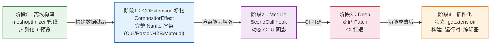

# Nanite 虚拟化几何系统 — 五阶段实施任务

> 基于 [总体设计文档](nanite-overall-design.md) 的工程化实施计划。
> 在原有三阶段（GDExtension → Module → Deep）基础上，前置阶段零：离线构建模块；后置阶段四：GDExtension 插件化。
> 每个阶段包含可编译、可执行、可调试的单元测试。

---

## 总览

| 阶段 | 名称 | 核心目标 | 桥接方式 | 可独立运行 |
|------|------|---------|---------|:---------:|
| 0 | 离线构建模块 | 层次化 Meshlet + BVH 构建、序列化、预览 | 无桥接（纯 CPU + 编辑器） | ✅ |
| 1 | GDExtension 桥接 | **完整实现 Nanite 渲染**：Cull（BVH + 视锥/背面/HZB 遮挡 + LOD）→ Rasterize（meshlet 解码 + 三角软光栅 + VisBuffer）→ HZB Build → Material Resolve（barycentric + Lambert） | CompositorEffect | ✅ |
| 2 | Module 桥接 | 动态 GPU 阴影 + 引擎内部 API 直调 | RendererSceneCull hook | ✅ |
| 3 | Deep 桥接 | SDFGI/VoxelGI 打通 + 引擎深度集成 | 源码 Patch | ✅ |
| 4 | GDExtension 插件化 | 将全部 Nanite 代码（构建 + 运行时 + 编辑器扩展）打包为独立 GDExtension 插件 | GDExtension (CompositorEffect + EditorPlugin) | ✅ |



---

## 阶段 0：离线构建模块

**目标**：将原始 Mesh 转化为层次化 Cluster + BVH 结构，序列化为 `NaniteMeshResource`，可在编辑器中预览和调试。本阶段不涉及任何 GPU 渲染，纯 CPU 数据管线 + 编辑器 UI。

### 0.1 目录结构与编译

**任务 0.1.1**：创建 `nanite/` 核心库目录

```
nanite/
├── SConscript                    # 编译脚本
├── core/
│   ├── nanite_builder.h          # 离线构建入口
│   ├── nanite_builder.cpp
│   ├── nanite_cluster.h          # Cluster 数据定义
│   ├── nanite_cluster.cpp
│   ├── nanite_bvh.h              # BVH 线性节点
│   ├── nanite_bvh.cpp
│   ├── builder_config.h          # 构建参数
│   ├── builder_config.cpp
│   ├── page_packer.h             # Page 划分
│   ├── page_packer.cpp
│   └── nanite_resource.h         # NaniteMeshResource
│   └── nanite_resource.cpp
├── editor/
│   ├── nanite_mesh_editor.h      # 预览界面
│   ├── nanite_mesh_editor.cpp
│   ├── nanite_editor_plugin.h    # EditorPlugin
│   ├── nanite_editor_plugin.cpp
│   └── nanite_resource_preview_gen.h/cpp
└── register_types.h/cpp          # 模块注册
```

**任务 0.1.2**：编写 `SConscript`，配置 include 路径含 `thirdparty/meshoptimizer/`

**单元测试 0.1**：
```cpp
// test_nanite_dir_structure.cpp
TEST_CASE("Nanite module compiles and registers") {
    // 验证 NaniteMeshResource 类在 ClassDB 中注册
    CHECK(ClassDB::class_exists("NaniteMeshResource"));
    CHECK(ClassDB::class_exists("NaniteMeshInstance3D") == false); // 阶段1才注册
}
```

### 0.2 NaniteCluster 与 NaniteClusterNode 数据结构

**任务 0.2.1**：实现 `NaniteCluster` 结构体

```cpp
struct NaniteCluster {
    uint32_t vertex_offset = 0;
    uint32_t triangle_offset = 0;
    uint32_t vertex_count = 0;
    uint32_t triangle_count = 0;
    AABB bounds;
    Vector3 cone_axis;
    float cone_cutoff = 0.0f;
    float error = 0.0f;
    uint32_t group_id = 0;
    uint32_t material_index = 0;
    uint32_t page_id = 0;
};
```

**任务 0.2.2**：实现 `NaniteClusterNode`（BVH 线性节点）

```cpp
struct NaniteClusterNode {
    AABB bounds;
    Vector3 cone_axis;
    float cone_cutoff = 0.0f;
    float error = 0.0f;
    uint32_t left_child = UINT32_MAX;   // 叶子时为 UINT32_MAX
    uint32_t right_child = UINT32_MAX;
    uint32_t first_cluster = 0;
    uint32_t cluster_count = 0;
    uint32_t page_id = 0;
    uint32_t depth = 0;
};
```

**单元测试 0.2**：
```cpp
// test_nanite_data_structures.cpp
TEST_CASE("NaniteCluster default initialization") {
    NaniteCluster c;
    CHECK(c.vertex_count == 0);
    CHECK(c.triangle_count == 0);
    CHECK(c.error == 0.0f);
    CHECK(c.group_id == 0);
    CHECK(c.bounds == AABB());
}

TEST_CASE("NaniteClusterNode leaf sentinel") {
    NaniteClusterNode n;
    CHECK(n.left_child == UINT32_MAX);
    CHECK(n.right_child == UINT32_MAX);
    CHECK(n.cluster_count == 0);
}

TEST_CASE("NaniteCluster serialization roundtrip") {
    NaniteCluster c;
    c.vertex_count = 64;
    c.triangle_count = 128;
    c.error = 0.5f;
    c.bounds = AABB(Vector3(-1,-1,-1), Vector3(1,1,1));
    c.cone_axis = Vector3(0,1,0);
    c.cone_cutoff = 0.7f;
    c.group_id = 3;
    c.page_id = 1;

    PackedByteArray buf = c.serialize();
    NaniteCluster c2 = NaniteCluster::deserialize(buf);
    CHECK(c2.vertex_count == 64);
    CHECK(c2.triangle_count == 128);
    CHECK(c2.error == doctest::Approx(0.5f));
    CHECK(c2.bounds.position.is_equal_approx(Vector3(-1,-1,-1)));
    CHECK(c2.cone_axis.is_equal_approx(Vector3(0,1,0)));
    CHECK(c2.cone_cutoff == doctest::Approx(0.7f));
    CHECK(c2.group_id == 3);
    CHECK(c2.page_id == 1);
}

TEST_CASE("NaniteClusterNode serialization roundtrip") {
    NaniteClusterNode n;
    n.bounds = AABB(Vector3(-2,-2,-2), Vector3(2,2,2));
    n.error = 1.2f;
    n.left_child = 5;
    n.right_child = 10;
    n.first_cluster = 3;
    n.cluster_count = 4;
    n.depth = 2;

    PackedByteArray buf = n.serialize();
    NaniteClusterNode n2 = NaniteClusterNode::deserialize(buf);
    CHECK(n2.error == doctest::Approx(1.2f));
    CHECK(n2.left_child == 5);
    CHECK(n2.right_child == 10);
    CHECK(n2.first_cluster == 3);
    CHECK(n2.cluster_count == 4);
    CHECK(n2.depth == 2);
}
```

### 0.3 BuilderConfig 参数定义

**任务 0.3.1**：实现 `BuilderConfig`，暴露为 `RefCounted` 子类，可在 Inspector 中编辑

```cpp
class BuilderConfig : public RefCounted {
    GDCLASS(BuilderConfig, RefCounted);
public:
    uint32_t max_vertices = 64;
    uint32_t min_triangles = 32;
    uint32_t max_triangles = 128;
    uint32_t partition_size = 4;
    float cone_weight = 0.5f;
    float split_factor = 0.5f;
    float simplification_ratio = 0.5f;
    float target_error = 0.5f;
    uint32_t max_lod_levels = 16;
    uint32_t page_size_bytes = 65536;
    bool lock_partition_border = true;
    int meshlet_optimize_level = 3;
    int shadow_lod_depth = 3;
};
```

**单元测试 0.3**：
```cpp
// test_builder_config.cpp
TEST_CASE("BuilderConfig defaults are valid") {
    BuilderConfig cfg;
    CHECK(cfg.max_vertices == 64);
    CHECK(cfg.max_triangles == 128);
    CHECK(cfg.partition_size == 4);
    CHECK(cfg.cone_weight == doctest::Approx(0.5f));
    CHECK(cfg.max_lod_levels == 16);
    CHECK(cfg.page_size_bytes == 65536);
    CHECK(cfg.shadow_lod_depth == 3);
}

TEST_CASE("BuilderConfig validates out-of-range values") {
    BuilderConfig cfg;
    cfg.max_triangles = 0;
    CHECK_FALSE(cfg.is_valid());
    cfg.max_triangles = 256;
    cfg.max_vertices = 0;
    CHECK_FALSE(cfg.is_valid());
    cfg.max_vertices = 64;
    cfg.partition_size = 1;
    CHECK_FALSE(cfg.is_valid()); // partition_size 必须 >= 2
}
```

### 0.4 NaniteBuilder — 叶子层构建

**任务 0.4.1**：实现 `NaniteBuilder::preprocess_mesh()` — 调用 `meshopt_generateVertexRemap` + `meshopt_optimizeVertexCache` + `meshopt_optimizeVertexFetch`

**任务 0.4.2**：实现 `NaniteBuilder::build_leaf_clusters()` — 调用 `meshopt_buildMeshletsFlex` + `meshopt_optimizeMeshletLevel` + `meshopt_computeMeshletBounds`

**单元测试 0.4**：
```cpp
// test_nanite_builder_leaf.cpp

// 辅助：生成一个简单的测试 Mesh（立方体 = 12 tri, 24 vertex with normals）
static Ref<ArrayMesh> create_cube_mesh() {
    Ref<ArrayMesh> mesh;
    mesh.instantiate();
    // ... 构建 6 面，每面 2 tri，含法线
    return mesh;
}

// 辅助：生成高面数球体 Mesh（~2000 tri）
static Ref<ArrayMesh> create_sphere_mesh(int segments = 32) {
    Ref<ArrayMesh> mesh;
    mesh.instantiate();
    // ... 球体参数化生成
    return mesh;
}

TEST_CASE("preprocess_mesh deduplicates vertices") {
    // 构造有重复顶点的 mesh
    PackedVector3Array vertices = {V3(0,0,0), V3(1,0,0), V3(0,1,0),
                                    V3(0,0,0), V3(1,0,0), V3(0,1,0)}; // 重复
    PackedInt32Array indices = {0,1,2, 3,4,5};
    auto [out_verts, out_indices] = NaniteBuilder::preprocess_mesh(vertices, indices);
    CHECK(out_verts.size() == 3); // 去重后
    CHECK(out_indices.size() == 6); // 索引不变
}

TEST_CASE("build_leaf_clusters produces clusters from cube mesh") {
    Ref<ArrayMesh> cube = create_cube_mesh();
    BuilderConfig cfg;
    NaniteBuilder builder(cfg);
    LocalVector<NaniteCluster> clusters = builder.build_leaf_clusters(cube);

    CHECK(clusters.size() >= 1);
    for (const auto &c : clusters) {
        CHECK(c.vertex_count <= cfg.max_vertices);
        CHECK(c.triangle_count <= cfg.max_triangles);
        CHECK(c.triangle_count >= cfg.min_triangles);
        CHECK(c.error == 0.0f); // L0 叶子 error 为 0
        CHECK(c.bounds.has_volume());
    }
}

TEST_CASE("build_leaf_clusters each cluster has valid bounds and cone") {
    Ref<ArrayMesh> sphere = create_sphere_mesh();
    BuilderConfig cfg;
    NaniteBuilder builder(cfg);
    LocalVector<NaniteCluster> clusters = builder.build_leaf_clusters(sphere);

    CHECK(clusters.size() >= 8); // 2000 tri / 128 ≈ 16 clusters
    for (const auto &c : clusters) {
        CHECK(c.bounds.has_volume());
        CHECK(c.cone_axis.length() > 0.9f); // 单位向量
        CHECK(c.cone_cutoff >= -1.0f);
        CHECK(c.cone_cutoff <= 1.0f);
    }
}
```

### 0.5 NaniteBuilder — 层次化简化与 BVH 装配

**任务 0.5.1**：实现 `NaniteBuilder::build_hierarchy()` — 自底向上循环，UE5 Nanite 风格: 4 相邻 cluster 合并 → 分区独立简化

- 算法流程（每层循环）：
  1. `meshopt_partitionClusters(target=4)` → 将当前层 cluster 按空间邻近性分组，每组 ~4 个相邻 cluster
  2. 对每个 partition（4 个相邻 cluster）：
     a. 合并 partition 内 cluster 的 vertex + index 子集（仅局部合并，非全局合并）
     b. 计算 `vertex_lock`：标记 partition 边界顶点（出现在 >=2 个原始 cluster 中的顶点）
     c. `meshopt_simplifyWithAttributes(target=原/2, options=LockBorder|Regularize)` → 分区独立简化，锁住边界顶点保证裂缝消除
     d. `meshopt_buildMeshletsFlex(...)` 简化结果再切 2 簇
     e. 计算 parent.error = max(child.error, result_error) 和 parent.bounds = union(child.bounds)
  3. 所有 partition 的 parent 节点构成下一层输入
- 循环退出条件：`current_level.size() <= 1`
- 中间产物：层次化 `NaniteClusterNode` 列表

**任务 0.5.2**：实现 `NaniteBuilder::build_bvh()` — 展开层次结构为线性 `NaniteClusterNode` 数组

**单元测试 0.5**：
```cpp
// test_nanite_builder_hierarchy.cpp

TEST_CASE("build_hierarchy reduces cluster count per level") {
    Ref<ArrayMesh> sphere = create_sphere_mesh(64); // ~8000 tri
    BuilderConfig cfg;
    NaniteBuilder builder(cfg);
    auto [clusters, nodes] = builder.build(sphere);

    // 应该有多层 BVH
    CHECK(nodes.size() >= 3);

    // 根节点 error 最大
    float root_error = nodes[0].error;
    for (const auto &n : nodes) {
        CHECK(n.error <= root_error + 0.001f); // 根节点 error >= 所有子节点
    }
}

TEST_CASE("BVH parent bounds contain child bounds") {
    Ref<ArrayMesh> sphere = create_sphere_mesh();
    BuilderConfig cfg;
    NaniteBuilder builder(cfg);
    auto [clusters, nodes] = builder.build(sphere);

    for (int i = 0; i < (int)nodes.size(); i++) {
        const auto &n = nodes[i];
        if (n.left_child != UINT32_MAX) {
            CHECK(nodes[n.left_child].bounds.is_inside(n.bounds));
        }
        if (n.right_child != UINT32_MAX) {
            CHECK(nodes[n.right_child].bounds.is_inside(n.bounds));
        }
    }
}

TEST_CASE("BVH root bounds contain entire mesh") {
    Ref<ArrayMesh> sphere = create_sphere_mesh();
    AABB mesh_aabb = sphere->get_aabb();
    BuilderConfig cfg;
    NaniteBuilder builder(cfg);
    auto [clusters, nodes] = builder.build(sphere);

    CHECK(mesh_aabb.is_inside(nodes[0].bounds));
}

TEST_CASE("Simplification reduces triangle count") {
    Ref<ArrayMesh> sphere = create_sphere_mesh();
    BuilderConfig cfg;
    NaniteBuilder builder(cfg);
    auto [clusters, nodes] = builder.build(sphere);

    // 统计每层的三角形总数
    // 叶子层应该最多，越往上越少
    int leaf_tris = 0, parent_tris = 0;
    for (const auto &c : clusters) {
        if (c.group_id == 0) leaf_tris += c.triangle_count;
        else parent_tris += c.triangle_count;
    }
    CHECK(leaf_tris > parent_tris);
}

TEST_CASE("Parent error >= max child error") {
    Ref<ArrayMesh> sphere = create_sphere_mesh();
    BuilderConfig cfg;
    NaniteBuilder builder(cfg);
    auto [clusters, nodes] = builder.build(sphere);

    for (const auto &n : nodes) {
        if (n.left_child == UINT32_MAX) continue; // 叶子跳过
        float max_child_error = 0;
        // 遍历子节点的 clusters
        for (uint32_t ci = nodes[n.left_child].first_cluster;
             ci < nodes[n.left_child].first_cluster + nodes[n.left_child].cluster_count; ci++) {
            max_child_error = MAX(max_child_error, clusters[ci].error);
        }
        for (uint32_t ci = nodes[n.right_child].first_cluster;
             ci < nodes[n.right_child].first_cluster + nodes[n.right_child].cluster_count; ci++) {
            max_child_error = MAX(max_child_error, clusters[ci].error);
        }
        CHECK(n.error >= max_child_error - 0.001f);
    }
}
```

### 0.6 Page 划分

**任务 0.6.1**：实现 `PagePacker` — 按 LOD + 空间局部性排序，按 `page_size_bytes` 切页

**单元测试 0.6**：
```cpp
// test_page_packer.cpp

TEST_CASE("PagePacker assigns page_id to all clusters") {
    LocalVector<NaniteCluster> clusters;
    for (int i = 0; i < 100; i++) {
        NaniteCluster c;
        c.group_id = i % 5;
        c.page_id = 0; // 待分配
        clusters.push_back(c);
    }

    BuilderConfig cfg;
    PagePacker packer;
    PageTable table = packer.pack(clusters, cfg);

    // 所有 cluster 都分配了 page_id
    for (const auto &c : clusters) {
        CHECK(c.page_id < table.page_count);
    }
}

TEST_CASE("PagePacker respects page size limit") {
    LocalVector<NaniteCluster> clusters;
    for (int i = 0; i < 200; i++) {
        NaniteCluster c;
        c.group_id = i / 10;
        c.triangle_count = 64;
        c.vertex_count = 32;
        clusters.push_back(c);
    }

    BuilderConfig cfg;
    cfg.page_size_bytes = 4096; // 小 page，强制多页
    PagePacker packer;
    PageTable table = packer.pack(clusters, cfg);

    CHECK(table.page_count > 1);
    for (int p = 0; p < (int)table.page_count; p++) {
        uint32_t page_bytes = table.compute_page_size(p, clusters);
        CHECK(page_bytes <= cfg.page_size_bytes * 2); // 允许少量溢出
    }
}

TEST_CASE("Same-LOD clusters prefer same page") {
    LocalVector<NaniteCluster> clusters;
    for (int i = 0; i < 50; i++) {
        NaniteCluster c;
        c.group_id = 0; // 全部同 LOD
        clusters.push_back(c);
    }

    BuilderConfig cfg;
    PagePacker packer;
    PageTable table = packer.pack(clusters, cfg);

    // 同 LOD cluster 应尽量在同一页
    HashSet<uint32_t> pages;
    for (const auto &c : clusters) {
        pages.insert(c.page_id);
    }
    CHECK(pages.size() <= 3); // 不应过度分散
}
```

### 0.7 粗 LOD Shadow Mesh 生成

**任务 0.7.1**：实现 `NaniteBuilder::build_shadow_mesh()` — 从 BVH 的第 `shadow_lod_depth` 层取 Cluster 合并为 `ArrayMesh`

**单元测试 0.7**：
```cpp
// test_shadow_mesh.cpp

TEST_CASE("Shadow mesh has fewer triangles than original") {
    Ref<ArrayMesh> sphere = create_sphere_mesh(64);
    BuilderConfig cfg;
    cfg.shadow_lod_depth = 3;
    NaniteBuilder builder(cfg);
    auto [clusters, nodes] = builder.build(sphere);
    Ref<ArrayMesh> shadow = builder.build_shadow_mesh(clusters, nodes);

    CHECK(shadow->get_faces() < sphere->get_faces());
    CHECK(shadow->get_faces() > 0);
}

TEST_CASE("Shadow mesh bounds contain original mesh bounds") {
    Ref<ArrayMesh> sphere = create_sphere_mesh();
    BuilderConfig cfg;
    NaniteBuilder builder(cfg);
    auto [clusters, nodes] = builder.build(sphere);
    Ref<ArrayMesh> shadow = builder.build_shadow_mesh(clusters, nodes);

    AABB original_aabb = sphere->get_aabb();
    AABB shadow_aabb = shadow->get_aabb();
    CHECK(original_aabb.is_inside(shadow_aabb.grow(0.01f)));
}

TEST_CASE("Shadow mesh is valid for mesh_set_shadow_mesh") {
    Ref<ArrayMesh> sphere = create_sphere_mesh();
    BuilderConfig cfg;
    NaniteBuilder builder(cfg);
    auto [clusters, nodes] = builder.build(sphere);
    Ref<ArrayMesh> shadow = builder.build_shadow_mesh(clusters, nodes);

    // 验证 shadow mesh 可以创建 RID
    RID shadow_rid = RenderingServer::get_singleton()->mesh_create();
    // 可以设置 surface (验证不会崩溃)
    CHECK(shadow_rid.is_valid());
    RenderingServer::get_singleton()->free(shadow_rid);
}
```

### 0.8 序列化与 NaniteMeshResource

**任务 0.8.1**：实现 `NaniteMeshResource` — 继承 `Resource`，包含序列化/反序列化方法

**任务 0.8.2**：使用 `meshopt_encodeMeshlet` / `meshopt_encodeVertexBuffer` 进行压缩编码

**任务 0.8.3**：实现 `.nanite` 二进制格式读写

**单元测试 0.8**：
```cpp
// test_nanite_resource.cpp

TEST_CASE("NaniteMeshResource save/load roundtrip") {
    Ref<ArrayMesh> sphere = create_sphere_mesh(32);
    BuilderConfig cfg;
    NaniteBuilder builder(cfg);
    Ref<NaniteMeshResource> res = builder.build(sphere);

    // 保存到临时文件
    String path = "user://test_nanite_resource.nanite";
    res->save(path);

    // 重新加载
    Ref<NaniteMeshResource> loaded;
    loaded.instantiate();
    loaded->load(path);

    CHECK(loaded->cluster_count == res->cluster_count);
    CHECK(loaded->node_count == res->node_count);
    CHECK(loaded->page_count == res->page_count);
    CHECK(loaded->vertex_data.size() == res->vertex_data.size());
    CHECK(loaded->clusters_data.size() == res->clusters_data.size());
}

TEST_CASE("NaniteMeshResource Godot serialization roundtrip") {
    Ref<ArrayMesh> sphere = create_sphere_mesh();
    BuilderConfig cfg;
    NaniteBuilder builder(cfg);
    Ref<NaniteMeshResource> res = builder.build(sphere);

    // 通过 Godot 的 ResourceLoader/ResourceSaver
    String path = "res://test_nanite.tres";
    ResourceSaver::save(res, path);

    Ref<NaniteMeshResource> loaded = ResourceLoader::load(path);
    CHECK(loaded.is_valid());
    CHECK(loaded->cluster_count == res->cluster_count);
}

TEST_CASE("Encoded meshlet decode matches original") {
    // 构造一个 cluster 的 vertex + index 数据
    PackedVector3Array vertices;
    PackedInt32Array indices;
    for (int i = 0; i < 64; i++) vertices.push_back(Vector3(i*0.1f, 0, 0));
    for (int i = 0; i < 128; i++) indices.push_back(i % 64);

    // encode → decode → 比较
    PackedByteArray encoded = NaniteMeshResource::encode_meshlet(vertices, indices);
    auto [dec_verts, dec_indices] = NaniteMeshResource::decode_meshlet(encoded);

    CHECK(dec_verts.size() == vertices.size());
    CHECK(dec_indices.size() == indices.size());
    for (int i = 0; i < (int)vertices.size(); i++) {
        CHECK(dec_verts[i].is_equal_approx(vertices[i]));
    }
}
```

### 0.9 编辑器预览与调试可视化

**任务 0.9.1**：实现 `NaniteMeshEditor` — 继承 `SubViewportContainer`，3D 旋转预览 + 构建统计

**任务 0.9.2**：实现 `EditorInspectorPluginNanite` + `NaniteEditorPlugin`

**任务 0.9.3**：实现 `NaniteResourcePreviewGenerator` — 资源缩略图

**任务 0.9.4**（Stage 0 重构, 2026-07-28）：`NaniteDebug` 二维枚举重构

- 新增 `DisplayMode` 枚举（5 项：NORMAL / NORMAL_WIREFRAME / CLUSTER_SOLID / CLUSTER_SOLID_WIREFRAME / WIREFRAME_ONLY）控制预览的着色方式
- 新增 `LODMode` 枚举（2 项：NANITE_AUTO / FORCE_LOD_LEVEL）控制预览的 LOD 选择逻辑
- 保留旧 `DebugMode` 枚举（原名字不变）继续供 Stage 1 GPU pipeline 使用
- 新增 `set_display_mode` / `set_lod_mode` / `set_force_lod_level` / `set_show_bounds` 及对应 getter
- `NaniteServer::set_debug_mode` 不变（继续走 legacy `DebugMode` 路径）

**任务 0.9.5**（Stage 0 重构）：`NaniteMeshResource::get_max_lod_level()` 辅助方法

- 扫描 `clusters_data`（固定 68 字节 stride）返回所有 cluster 中最大的 `group_id` 字段
- 用于 SpinBox 范围设置（0..max_lod_level）
- 不绑定到 ClassDB（编辑器内部使用，每次 edit() 调用一次即可）

**任务 0.9.6**（Stage 0 重构）：`NaniteMeshEditor` 二维下拉列表 + 本地渲染器

- 移除旧的 `debug_mode_btn`（7 项）/`wireframe_btn`/`bounds_btn` 三个控件
- 新增两个正交下拉列表：
  - `display_mode_btn`：5 个 DisplayMode 项
  - `lod_mode_btn`：2 个 LODMode 项（NANITE_AUTO 标 `[Stage 1]` 后缀）
- 新增 `force_lod_spinner`（SpinBox，range 0..max_lod_level），选中 FORCE_LOD_LEVEL 时可见
- 选中 NANITE_AUTO 时弹 `WARN_PRINT` 并自动回退到 FORCE_LOD_LEVEL + 0
- 三个回调 `_on_display_mode_selected` / `_on_lod_mode_selected` / `_on_force_lod_changed` 都只触发本地 `_rebuild_preview()`，不调用 `NaniteServer::set_debug_mode()`

**任务 0.9.7**（Stage 0 重构）：CPU-side cluster 解码器 + 五种 Display Mode 渲染

**关键约束**：Stage 0 preview 渲染**完全独立于 Nanite GPU 渲染管线**——不调用 `CompositorEffect`、不调用 `nanite_cull.glsl` / `nanite_rasterize.glsl` / `nanite_material_resolve.glsl`，也不需要 `NaniteServer` 已激活任何 bridge。所有渲染代码限制在 `nanite/editor/` 模块内，使用 Godot 标准 `MeshInstance3D` + `ArrayMesh` + `StandardMaterial3D` 经由引擎自带 forward 管线绘制。

实现要点：
- 使用 Godot 标准 `MeshInstance3D`（不再用 `NaniteMeshInstance3D`）
- 构造函数不再调用 `NaniteGDExtBridgeManager::attach_to_viewport(viewport)`
- 两个 MeshInstance3D 子节点：`solid_instance`（Lambert 或 vertex color）+ `wire_instance`（unshaded wireframe overlay）
- CPU 侧匿名命名空间内的 `decode_clusters_for_lod()` 解码器：
  - 遍历 `clusters_data`（68B stride），过滤 `group_id == force_lod_level`
  - 通过 `meshlet_vertices_data`（uint32[]）映射 micro-index → 全局顶点索引
  - 从 `vertex_data`（stride 32B: pos.xyz + normal.xyz + uv.xy）读取位置
  - 可选地为每个 cluster 生成唯一 HSV 色（按 ci hash 散布色相）
  - `p_emit_lines = false`：输出 `PackedVector3Array` + `PackedInt32Array` + 可选 `PackedColorArray` → `build_cluster_mesh()` 构造 `PRIMITIVE_TRIANGLES` ArrayMesh
  - `p_emit_lines = true`：每三角形输出 6 个顶点 (3 条边)，仅写入 `PackedVector3Array` → `build_cluster_wire_mesh()` 构造 `PRIMITIVE_LINES` ArrayMesh
- 五种 Display Mode 渲染策略：
  | Mode | solid 渲染 | wire 渲染 | mesh 来源 |
  |------|-----------|----------|---------|
  | Normal | shadow_mesh + Lambert | 隐藏 | `get_shadow_mesh()` |
  | Normal + Wireframe | shadow_mesh + Lambert | `build_wire_from_array_mesh(shadow_mesh)` → PRIMITIVE_LINES + 白色 unshaded material | 同上 |
  | Cluster Solid | `build_cluster_mesh(force_lod, true)` + per-vertex HSV + `FLAG_ALBEDO_FROM_VERTEX_COLOR` | 隐藏 | cluster decode |
  | Cluster Solid + Wireframe | 同上 | `build_cluster_wire_mesh(force_lod)` PRIMITIVE_LINES + 白色 unshaded material | 同上 |
  | Wireframe Only | 隐藏 | `build_cluster_wire_mesh(force_lod)` PRIMITIVE_LINES + 白色 unshaded material | 同上 |
- **线框实现方式**：Godot `BaseMaterial3D` 无 `set_wireframe_enabled`，因此 wire_instance 渲染的 mesh 是把三角形索引展开成边顶点构造的 `PRIMITIVE_LINES` ArrayMesh，配合 `SHADING_MODE_UNSHADED` 白色 material 绘制。这避开不同后端 (Vulkan/D3D12/Metal) 线框 mode 支持差异。
- `_rebuild_preview()` 在 edit() 加载新资源、用户切换 display_mode / lod_mode / force_lod 时触发，同步重建 ArrayMesh

**单元测试 0.9**：
```gdscript
# test_nanite_editor.gd — 编辑器集成测试（场景测试）
extends "res://addons/gut/test.gd"

func test_nanite_resource_appears_in_inspector():
    var res = NaniteMeshResource.new()
    # 触发 InspectorPlugin
    var plugin = EditorInspectorPluginNanite.new()
    assert(plugin.can_handle(res), "InspectorPlugin should handle NaniteMeshResource")

func test_nanite_mesh_editor_edit():
    var editor = NaniteMeshEditor.new()
    var res = NaniteMeshResource.new()
    # 应不崩溃
    editor.edit(res)
    assert(true)

func test_resource_preview_generator_handles_nanite():
    var gen = NaniteResourcePreviewGenerator.new()
    assert(gen.handles("NaniteMeshResource"), "Preview generator should handle NaniteMeshResource")

# Stage 0 重构新增测试
func test_nanite_debug_display_mode_enum():
    # 5 个 DisplayMode 常量
    assert(NaniteDebug.NORMAL == 0)
    assert(NaniteDebug.NORMAL_WIREFRAME == 1)
    assert(NaniteDebug.CLUSTER_SOLID == 2)
    assert(NaniteDebug.CLUSTER_SOLID_WIREFRAME == 3)
    assert(NaniteDebug.WIREFRAME_ONLY == 4)

func test_nanite_debug_lod_mode_enum():
    assert(NaniteDebug.NANITE_AUTO == 0)
    assert(NaniteDebug.FORCE_LOD_LEVEL == 1)

func test_nanite_debug_legacy_mode_unchanged():
    # 旧 DebugMode 枚举保持原值（Stage 1 兼容性）
    assert(NaniteDebug.NONE == 0)
    assert(NaniteDebug.CLUSTER_SOLID_COLOR == 1)
    assert(NaniteDebug.HZB_OCCLUSION == 6)

func test_nanite_mesh_editor_has_two_dropdowns():
    var editor = NaniteMeshEditor.new()
    # 列表1 应有 5 个 DisplayMode 项
    assert(editor.display_mode_btn.item_count == 5)
    # 列表2 应有 2 个 LODMode 项
    assert(editor.lod_mode_btn.item_count == 2)
    # Stage 0 默认选中 Force LOD Level + level 0
    assert(editor.lod_mode_btn.selected == NaniteDebug.FORCE_LOD_LEVEL)
    assert(editor.force_lod_spinner.value == 0)
    assert(editor.force_lod_spinner.visible == true)

func test_nanite_mesh_editor_no_compositor_attach():
    # Stage 0 关键约束：preview viewport 不挂 Nanite compositor
    # 通过观察 NaniteServer 不应被触碰来验证（间接验证）
    var editor = NaniteMeshEditor.new()
    var srv = Engine.get_singleton("NaniteServer")
    var before = srv.get_debug_mode()
    # 切换 display mode 不应改变 NaniteServer 的 debug_mode
    editor.display_mode_btn.select(NaniteDebug.CLUSTER_SOLID)
    editor.display_mode_btn.emit_signal("item_selected", NaniteDebug.CLUSTER_SOLID)
    assert(srv.get_debug_mode() == before, "Stage 0 preview must NOT touch NaniteServer debug state")

func test_force_lod_filters_clusters_by_group_id():
    # 构造含多 LOD 的 NaniteMeshResource，验证 force_lod_level 切换时
    # 解码出的三角形数变化
    pass # 需要构造测试 mesh + builder, 见 0.10 e2e
```

**Stage 0 验收要点（preview panel）**：
- ✅ 两个下拉列表正交工作（DisplayMode 与 LODMode 互不干扰）
- ✅ 五种 Display Mode 全部可正确切换渲染（含 CPU 解码 cluster 模式）
- ✅ Force LOD Level SpinBox 范围随资源 max_lod_level 自适应
- ✅ 选中 NANITE_AUTO 弹警告并回退到 FORCE_LOD_LEVEL 0
- ✅ preview 切换不影响主场景的 NaniteServer 调试状态
- ✅ preview 不依赖 CompositorEffect，编译时不需 `nanite_bridge=gdext`

### 0.10 阶段 0 端到端测试

**任务 0.10.1**：完整的导入 → 构建 → 预览流程

**端到端测试**：
```gdscript
# test_nanite_e2e_build.gd
extends "res://addons/gut/test.gd"

func test_full_build_pipeline():
    # 1. 创建测试 Mesh
    var mesh = ArrayMesh.new()
    var st = SurfaceTool.new()
    st.create_from(Mesh.PRIMITIVE_TRIANGLES)
    # 添加 Icosphere ~1000 tri
    _add_icosphere(st, Vector3.ZERO, 1.0, 3)
    st.commit(mesh)

    # 2. 构建 Nanite
    var config = BuilderConfig.new()
    var builder = NaniteBuilder.new(config)
    var resource = builder.build(mesh)

    # 3. 验证结果
    assert(resource != null, "Build should succeed")
    assert(resource.cluster_count > 0, "Should have clusters")
    assert(resource.node_count > 0, "Should have BVH nodes")
    assert(resource.page_count > 0, "Should have pages")
    assert(resource.shadow_mesh != null, "Should have shadow mesh")

    # 4. 保存/加载
    var err = ResourceSaver.save(resource, "res://test_e2e_nanite.tres")
    assert(err == OK, "Save should succeed")

    var loaded = ResourceLoader.load("res://test_e2e_nanite.tres")
    assert(loaded.cluster_count == resource.cluster_count, "Roundtrip cluster count match")

func test_build_large_mesh():
    # 测试 ~50K tri mesh 的构建
    var mesh = _create_large_test_mesh(50000)
    var config = BuilderConfig.new()
    var builder = NaniteBuilder.new(config)
    var resource = builder.build(mesh)

    assert(resource.cluster_count > 100, "50K tri mesh should produce many clusters")
    assert(resource.node_count > 10, "Should have deep BVH")
```

### 0.11 阶段 0 验收标准

- [ ] `NaniteCluster` / `NaniteClusterNode` 数据结构完整，序列化 roundtrip 正确
- [ ] `BuilderConfig` 参数验证，Inspector 可编辑
- [ ] `NaniteBuilder::build_leaf_clusters()` 正确调用 meshoptimizer，cluster 满足约束
- [ ] `NaniteBuilder::build_hierarchy()` 自底向上简化，parent error >= child error
- [ ] BVH parent bounds 包含 child bounds
- [ `PagePacker` 正确分配 page_id，page 大小不超限
- [ ] 粗 LOD Shadow Mesh 三角形数少于原始 mesh
- [ ] `NaniteMeshResource` 保存/加载 roundtrip 正确
- [ ] meshlet encode/decode roundtrip 正确
- [ ] `NaniteMeshEditor` 在 Inspector 中可预览
- [ ] **`NaniteDebug` 新增 `DisplayMode` + `LODMode` 二维枚举，旧 `DebugMode` 名字不变**
- [ ] **`NaniteMeshResource::get_max_lod_level()` 正确扫描 clusters_data 返回最大 group_id**
- [ ] **`NaniteMeshEditor` 两个正交下拉列表 + SpinBox 可正确切换**
- [ ] **五种 Display Mode 全部可渲染：Normal / Normal+Wire / Cluster Solid / Cluster Solid+Wire / Wireframe Only**
- [ ] **Force LOD Level 切换时 CPU 解码器正确过滤 cluster by `group_id`**
- [ ] **preview 渲染独立于 Nanite GPU 管线：不调用 `NaniteServer::set_debug_mode()`、不挂载 CompositorEffect**
- [ ] 所有单元测试通过

### 0.12 资源转换接口与编辑器对接

**任务 0.12.1**：实现 `NaniteBuilder::build_from_resource(Ref<Resource>)` 静态方法

```cpp
// nanite/core/nanite_builder.h
class NaniteBuilder : public RefCounted {
    GDCLASS(NaniteBuilder, RefCounted);
    // ...
    static Ref<NaniteMeshResource> build_from_resource(Ref<Resource> p_resource);
};

// nanite/core/nanite_builder.cpp
Ref<NaniteMeshResource> NaniteBuilder::build_from_resource(Ref<Resource> p_resource) {
    // 1) 识别 ArrayMesh / PackedScene / MeshInstance3D
    // 2) 合并所有 surface 到单个 ArrayMesh (按顶点偏移调整 index)
    // 3) 调用 build() 返回 NaniteMeshResource
}
```

`_bind_methods` 中用 `ClassDB::bind_static_method` 暴露：
```cpp
ClassDB::bind_static_method("NaniteBuilder", D_METHOD("build_from_resource", "resource"),
                            &NaniteBuilder::build_from_resource);
```

**任务 0.12.2**：编写 `build_from_resource` 单元测试

```cpp
// test_nanite_builder_from_resource.h
TEST_CASE("[NaniteBuilder] build_from_resource single surface ArrayMesh") {
    Ref<ArrayMesh> cube = NaniteTestHelpers::create_cube_mesh();
    Ref<NaniteMeshResource> res = NaniteBuilder::build_from_resource(cube);
    REQUIRE(res.is_valid());
    CHECK(res->cluster_count > 0);
}

TEST_CASE("[NaniteBuilder] build_from_resource multi surface merges vertices") {
    // 构造两个 surface 的 ArrayMesh，验证合并后 vertex 数 = s0 + s1
}

TEST_CASE("[NaniteBuilder] build_from_resource accepts PackedScene") {
    // 构造含 MeshInstance3D 子节点的 PackedScene，验证转换成功
}

TEST_CASE("[NaniteBuilder] build_from_resource rejects empty mesh") {
    Ref<ArrayMesh> empty = memnew(ArrayMesh);
    Ref<NaniteMeshResource> res = NaniteBuilder::build_from_resource(empty);
    CHECK(res.is_null());
}
```

**任务 0.12.3**：实现 `nanite/editor/nanite_conversion_menu.h` / `.cpp`

```cpp
// nanite/editor/nanite_conversion_menu.h
#ifdef TOOLS_ENABLED
class NaniteConversionContextMenu : public EditorContextMenuPlugin {
    GDCLASS(NaniteConversionContextMenu, EditorContextMenuPlugin);

protected:
    virtual void _popup_menu(const Vector<String> &p_paths) override;
    virtual void _execute_option(int p_idx) override;

public:
    virtual String _get_name() const override { return "NaniteConversion"; }
    virtual String _get_label() const override { return "Convert to Nanite..."; }
    virtual bool _is_available(const Vector<String> &p_paths) const override;
};
#endif
```

扩展名过滤：`.gltf` / `.glb` / `.fbx` / `.obj` / `.tres` (ArrayMesh 或 PackedScene)。

在 `NaniteEditorPlugin` 构造函数中注册：
```cpp
NaniteEditorPlugin::NaniteEditorPlugin() {
    // ... existing inspector plugin ...
    add_context_menu_plugin(memnew(NaniteConversionContextMenu));
}
```

**任务 0.12.4**：扩展 `EditorInspectorPluginNanite::parse_begin()`

```cpp
// 修改 can_handle()：扩展识别 ArrayMesh / MeshInstance3D
bool EditorInspectorPluginNanite::can_handle(Object *p_object) {
    return Object::cast_to<NaniteMeshResource>(p_object) != nullptr
        || Object::cast_to<ArrayMesh>(p_object) != nullptr
        || Object::cast_to<MeshInstance3D>(p_object) != nullptr;
}

// parse_begin() 对 ArrayMesh / MeshInstance3D 显示 Convert 按钮
void EditorInspectorPluginNanite::parse_begin(Object *p_object) {
    // ... 现有 NaniteMeshResource 分支保持不变 ...

    if (Object::cast_to<ArrayMesh>(p_object) || Object::cast_to<MeshInstance3D>(p_object)) {
        VBoxContainer *vb = memnew(VBoxContainer);
        Button *btn = memnew(Button);
        btn->set_text("Convert to Nanite...");
        btn->connect("pressed", callable_mp(this, &EditorInspectorPluginNanite::_on_convert_pressed)
                         .bind(p_object));
        vb->add_child(btn);
        add_custom_control(vb);
    }
}
```

**任务 0.12.5**：构建进度反馈

```cpp
// 使用 EditorProgress 显示构建进度
Ref<EditorProgress> ep;
ep.instantiate("nanite_convert", "Converting to Nanite...", 1);
// ... build ...
ep->step("Building clusters...", 0);
// 完成后释放，EditorLog 输出统计
```

**任务 0.12.6**：端到端测试 `test_nanite_conversion.gd`

```gdscript
extends SceneTree

func _test_build_from_resource_array_mesh() -> void:
    var am := ArrayMesh.new()
    var arrays := []
    arrays.resize(Mesh.ARRAY_MAX)
    arrays[Mesh.ARRAY_VERTEX] = PackedVector3Array([Vector3(0,0,0), Vector3(1,0,0), Vector3(0,1,0)])
    arrays[Mesh.ARRAY_INDEX] = PackedInt32Array([0, 1, 2])
    am.add_surface_from_arrays(Mesh.PRIMITIVE_TRIANGLES, arrays)
    var res := NaniteBuilder.build_from_resource(am)
    assert(res != null, "build_from_resource should return non-null for ArrayMesh")

func _test_classdb_registration() -> void:
    assert(ClassDB.class_exists("NaniteConversionContextMenu"))
    assert(ClassDB.is_parent_class("NaniteConversionContextMenu", "EditorContextMenuPlugin"))
```

---


## 阶段 1：GDExtension 桥接

**目标**：在使用 GDExtension 桥接层（`CompositorEffect` 接入）的情况下，**完整实现 Nanite 渲染** —— 包括 Cull（BVH 遍历 + 视锥/背面/HZB 遮挡剔除 + LOD 选择）、Rasterize（meshlet 解码 + 三角形软光栅化 + VisBuffer 写入）、HZB Build（层次化深度降采样）、Material Resolve（barycentric 插值 + Lambert 着色）四个 Pass 的真实算法实现，使 Stage 1 完成后即可在场景中放置 `NaniteMeshInstance3D` 看到真实 Nanite 渲染输出。使用粗 LOD 阴影方案。

> **状态（2026-07-25）**：原 1.4/1.5/1.6 中 Cull / Rasterize / Material Resolve 三个 Pass 最初为占位实现（pass-through / 每线程写一像素 / 固定灰），仅 HZB downsample 为真实算法。Task 1.16 "真实 Nanite 渲染补完" 已在 Stage 1 内补完真实算法。Task 1.17 Compositor 自动挂接重构为 `NaniteGDExtBridgeManager` 独立 singleton 模式：所有 gdext 专属逻辑（创建 Compositor / 监听 SceneTree / 遍历 `_viewports` group / 追加 effect 到用户 Compositor）集中在桥接层，核心 `NaniteServer` 只持有 `INaniteBridge *` 抽象指针并通过 `set_bridge()` setter 接收注入。Stage 1 现为完整可渲染状态，覆盖游戏运行时 / Nanite preview 窗口 / 引擎 3D 工作区三大 viewport。详细任务、子任务与验收清单见 Stage 1 spec 文档 [`nanite_doc/spec/stage1-gdext-bridge/`](spec/stage1-gdext-bridge/)（spec.md / tasks.md / checklist.md）。

### 1.1 GDExtension 框架搭建

**任务 1.1.1**：创建 GDExtension 项目结构

```
nanite_gdext/
├── nanite.gdextension
├── SConstruct
├── src/
│   ├── register_types.h/cpp
│   ├── bridge/
│   │   ├── nanite_bridge_interface.h     # INaniteBridge 接口
│   │   ├── nanite_gdext_bridge.h/cpp     # CompositorEffect 子类
│   │   └── nanite_bridge_factory.h/cpp   # 桥接创建工厂
│   ├── server/
│   │   ├── nanite_server.h/cpp           # NaniteServer 单例
│   │   └── nanite_page_cache.h/cpp
│   ├── scene/
│   │   └── nanite_mesh_instance_3d.h/cpp
│   ├── gpu/
│   │   ├── nanite_gpu_pipeline.h/cpp     # GPU pipeline 管理
│   │   ├── nanite_hzb.h/cpp              # GPU HZB
│   │   └── nanite_mesh_data.h/cpp        # GPU buffer 管理
│   └── shaders/
│       ├── nanite_cull.glsl
│       ├── nanite_rasterize.glsl
│       ├── nanite_hzb_downsample.glsl
│       └── nanite_material_resolve.glsl
```

**任务 1.1.2**：实现 `NaniteGDExtBridge` — 继承 `CompositorEffect`，注册 `PRE_OPAQUE` + `POST_OPAQUE` 回调

**单元测试 1.1**：
```cpp
// test_gdext_bridge.cpp
TEST_CASE("NaniteGDExtBridge registers as CompositorEffect") {
    Ref<NaniteGDExtBridge> bridge;
    bridge.instantiate();
    CHECK(bridge->is_class("CompositorEffect"));
    CHECK(bridge->get_effect_callback_type() ==
          CompositorEffect::EFFECT_CALLBACK_TYPE_PRE_OPAQUE);
}

TEST_CASE("Bridge PRE_OPAQUE callback is invoked during render") {
    // 通过 Godot 渲染管线集成测试
    // 在 SceneTree 中添加带 NaniteMeshInstance3D 的场景
    // 验证 _render_callback 被调用
    int call_count = 0;
    // ... mock 回调计数
    CHECK(call_count > 0);
}
```

### 1.2 INaniteBridge 抽象接口 + NaniteServer

**任务 1.2.1**：实现 `INaniteBridge` 接口

```cpp
class INaniteBridge {
public:
    virtual void install(NaniteServer *p_server) = 0;
    virtual ShadowMode get_shadow_mode() const = 0;
    virtual void on_pre_opaque_pass(const RenderData *p_render_data) = 0;
    virtual void on_post_opaque_pass(const RenderData *p_render_data) = 0;
    virtual StringName get_bridge_name() const = 0;
};
```

**任务 1.2.2**：实现 `NaniteServer` 单例 — 管理 mesh/instance 注册、bridge 切换、GPU pipeline 生命周期

**任务 1.2.3**：实现 `NaniteMeshInstance3D` — 场景节点，注册/注销到 NaniteServer

**单元测试 1.2**：
```cpp
// test_nanite_server.cpp
TEST_CASE("NaniteServer singleton creation") {
    NaniteServer *srv = NaniteServer::get_singleton();
    CHECK(srv != nullptr);
}

TEST_CASE("Register and unregister NaniteMeshInstance3D") {
    auto *srv = NaniteServer::get_singleton();
    NaniteMeshInstance3D *inst = memnew(NaniteMeshInstance3D);
    srv->register_instance(inst);
    CHECK(srv->get_instance_count() == 1);
    srv->unregister_instance(inst);
    CHECK(srv->get_instance_count() == 0);
    memdelete(inst);
}

TEST_CASE("NaniteMeshInstance3D sets nanite mesh resource") {
    auto *inst = memnew(NaniteMeshInstance3D);
    Ref<NaniteMeshResource> res;
    res.instantiate();
    inst->set_nanite_mesh(res);
    CHECK(inst->get_nanite_mesh() == res);
    memdelete(inst);
}
```

### 1.3 NaniteMeshData — GPU Buffer 管理

**任务 1.3.1**：实现 `NaniteMeshData` — 将 `NaniteMeshResource` 的数据上传到 GPU SSBO

```cpp
class NaniteMeshData {
    RID cluster_ssbo;
    RID vertex_ssbo;
    RID index_ssbo;
    RID bvh_ssbo;
    bool gpu_uploaded = false;
public:
    void upload_to_gpu(RenderingDevice *rd, const NaniteMeshResource *res);
    void free_gpu_resources(RenderingDevice *rd);
    RID get_cluster_ssbo() const;
    RID get_bvh_ssbo() const;
};
```

**单元测试 1.3**：
```cpp
// test_nanite_mesh_data.cpp
TEST_CASE("NaniteMeshData upload creates valid RIDs") {
    auto *rd = RenderingDevice::get_singleton();
    Ref<NaniteMeshResource> res = _create_test_resource(); // 阶段0构建的测试资源
    NaniteMeshData data;
    data.upload_to_gpu(rd, res.ptr());

    CHECK(data.get_cluster_ssbo().is_valid());
    CHECK(data.get_vertex_ssbo().is_valid());
    CHECK(data.get_bvh_ssbo().is_valid());
    CHECK(data.is_gpu_uploaded());

    data.free_gpu_resources(rd);
    CHECK_FALSE(data.is_gpu_uploaded());
}

TEST_CASE("NaniteMeshData SSBO sizes match resource data") {
    auto *rd = RenderingDevice::get_singleton();
    Ref<NaniteMeshResource> res = _create_test_resource();
    NaniteMeshData data;
    data.upload_to_gpu(rd, res.ptr());

    uint64_t cluster_size = rd->buffer_get_data(data.get_cluster_ssbo()).size();
    CHECK(cluster_size == res->clusters_data.size());

    data.free_gpu_resources(rd);
}
```

### 1.4 NaniteGPUPipeline — Cull + Rasterize Shader

> Stage 1 最初为占位实现，已由 spec Task 1.16 在 Stage 1 内补完真实算法。详见 [`spec/stage1-gdext-bridge/`](spec/stage1-gdext-bridge/)。

**任务 1.4.1**：编写 `nanite_cull.glsl` — BVH 遍历 + 视锥/背面/遮挡剔除 + LOD 选择

**任务 1.4.2**：编写 `nanite_rasterize.glsl` — Visibility Buffer 软光栅（小三角） + 硬件光栅（大三角）混合

**任务 1.4.3**：实现 `NaniteGPUPipeline::dispatch_cull()` 和 `dispatch_rasterize()`

**单元测试 1.4**：
```cpp
// test_nanite_gpu_cull.cpp
TEST_CASE("Cull shader produces visible cluster list") {
    // 在 RD compute 中 dispatch cull
    // 回读 visible_cluster_count buffer
    // 验证：相机视锥内的 cluster 被保留，视锥外的被剔除
    auto *rd = RenderingDevice::get_singleton();
    Ref<NaniteMeshResource> res = _create_test_resource();
    NaniteMeshData data;
    data.upload_to_gpu(rd, res.ptr());

    NaniteGPUPipeline pipeline;
    pipeline.init(rd);

    // 设置相机参数（看向 mesh）
    CullParams params;
    params.view_matrix = Transform3D().looking_at(Vector3(0,0,-1), Vector3(0,1,0));
    params.projection = Projection::create_perspective(70, 1.0, 0.1, 100.0);
    params.screen_size = Vector2i(1920, 1080);

    RID visible_buffer = pipeline.dispatch_cull(rd, params);
    CHECK(visible_buffer.is_valid());

    // 回读 visible count
    Vector<uint8_t> readback = rd->buffer_get_data(visible_buffer);
    uint32_t visible_count = *reinterpret_cast<const uint32_t*>(readback.ptr());
    CHECK(visible_count > 0);
    CHECK(visible_count <= res->cluster_count);
}

TEST_CASE("Cull shader respects frustum boundaries") {
    // 将相机朝向远离 mesh 的方向
    // 验证：所有 cluster 被剔除
    // ...
    CHECK(visible_count == 0);
}

TEST_CASE("Rasterize shader produces valid Visibility Buffer") {
    // dispatch cull → dispatch rasterize
    // 验证 VisBuffer 非零
    // ...
    CHECK(vis_buffer_data.size() > 0);
}
```

### 1.5 NaniteHZB — GPU 层次化深度缓冲

> Stage 1 内即为真实算法实现（HZB downsample 为纯数学运算，非占位）。详见 [`spec/stage1-gdext-bridge/`](spec/stage1-gdext-bridge/)。

**任务 1.5.1**：编写 `nanite_hzb_downsample.glsl` — Compute Shader 逐级降采样取 MAX

**任务 1.5.2**：实现 `NaniteHZB` — init/cleanup/resize/build

**任务 1.5.3**：实现 `NaniteGPUPipeline::dispatch_hzb_build()`

**单元测试 1.5**：
```cpp
// test_nanite_hzb.cpp

TEST_CASE("NaniteHZB creates correct mip count for given resolution") {
    auto *rd = RenderingDevice::get_singleton();
    NaniteHZB hzb;
    hzb.init(rd);
    hzb.resize(rd, Size2i(1920, 1080));

    // 1920x1080 → mip count = ceil(log2(max(1920,1080))) = 11
    CHECK(hzb.get_mip_count() == 11);
    hzb.cleanup(rd);
}

TEST_CASE("NaniteHZB build produces valid depth pyramid") {
    auto *rd = RenderingDevice::get_singleton();
    NaniteHZB hzb;
    hzb.init(rd);
    hzb.resize(rd, Size2i(256, 256));

    // 创建测试深度纹理（R32_SFLOAT，全部 0.5）
    RID depth_tex = _create_constant_depth_texture(rd, Size2i(256,256), 0.5f);
    hzb.build(rd, depth_tex);

    // 回读 mip 0 的中心像素
    RID hzb_tex = hzb.get_hzb_texture();
    Vector<uint8_t> data = rd->texture_get_data(hzb_tex, 0);
    // 验证至少有一些数据
    CHECK(data.size() > 0);

    rd->free_rid(depth_tex);
    hzb.cleanup(rd);
}

TEST_CASE("HZB downsample takes MAX of 2x2") {
    // 创建 4x4 深度纹理，左上 0.2，右上 0.8，左下 0.4，右下 0.6
    // mip 1 中心像素应为 max(0.2, 0.8, 0.4, 0.6) = 0.8
    auto *rd = RenderingDevice::get_singleton();

    RID depth_tex = _create_depth_texture_4x4(rd,
        {0.2f, 0.8f, 0.2f, 0.8f,
         0.4f, 0.6f, 0.4f, 0.6f,
         0.2f, 0.8f, 0.2f, 0.8f,
         0.4f, 0.6f, 0.4f, 0.6f});

    NaniteHZB hzb;
    hzb.init(rd);
    hzb.resize(rd, Size2i(4, 4));
    hzb.build(rd, depth_tex);

    // 回读 mip 1 (2x2)
    Vector<uint8_t> mip1 = rd->texture_get_data(hzb.get_hzb_texture(), 1);
    float val = *reinterpret_cast<const float*>(mip1.ptr());
    CHECK(val == doctest::Approx(0.8f));

    rd->free_rid(depth_tex);
    hzb.cleanup(rd);
}

TEST_CASE("HZB resize handles resolution change") {
    auto *rd = RenderingDevice::get_singleton();
    NaniteHZB hzb;
    hzb.init(rd);
    hzb.resize(rd, Size2i(1920, 1080));
    int mips1 = hzb.get_mip_count();

    hzb.resize(rd, Size2i(3840, 2160));
    int mips2 = hzb.get_mip_count();

    CHECK(mips2 > mips1); // 更高分辨率 → 更多 mip
    hzb.cleanup(rd);
}
```

### 1.6 Material Resolve Shader

> Stage 1 最初为占位实现，已由 spec Task 1.16 在 Stage 1 内补完真实算法（barycentric 插值 + Lambert 着色；完整 PBR 留待 Stage 2+）。详见 [`spec/stage1-gdext-bridge/`](spec/stage1-gdext-bridge/)。

**任务 1.6.1**：编写 `nanite_material_resolve.glsl` — 从 VisBuffer 解码 → 顶点插值 → 材质着色

**任务 1.6.2**：实现 `NaniteGPUPipeline::dispatch_material_resolve()`

**单元测试 1.6**：
```cpp
// test_material_resolve.cpp

TEST_CASE("Material resolve produces non-black output") {
    // 全流程：cull → rasterize → hzb_build → material_resolve
    // 回读输出 color buffer，验证有非零像素
    auto *rd = RenderingDevice::get_singleton();
    // ... setup pipeline
    // 验证最终颜色 buffer 有内容
    CHECK(has_non_zero_pixels);
}

TEST_CASE("Material resolve with single color material") {
    // 设置所有 cluster 使用红色材质
    // 验证输出像素的红色通道 > 0
    // ...
    CHECK(red_channel > 0.5f);
}
```

### 1.7 阴影 — 粗 LOD 方案

**任务 1.7.1**：在 `NaniteMeshInstance3D` 中调用 `RenderingServer::get_singleton()->mesh_set_shadow_mesh(mesh_rid, shadow_mesh_rid)`

**任务 1.7.2**：验证 Godot 自动使用 shadow mesh 进行阴影投射

**单元测试 1.7**：
```gdscript
# test_shadow_mesh.gd
extends "res://addons/gut/test.gd"

func test_shadow_mesh_is_set_on_instance():
    var instance = NaniteMeshInstance3D.new()
    var resource = _build_test_nanite_resource()
    instance.set_nanite_mesh(resource)

    # 等待一帧让 RID 创建
    await get_tree().process_frame

    var rs = RenderingServer.get_singleton()
    var mesh_rid = instance.get_mesh_rid()
    # 验证 shadow mesh 被设置
    assert(rs.mesh_get_shadow_mesh(mesh_rid).is_valid())

func test_shadow_appears_in_scene():
    # 创建场景：NaniteMeshInstance3D + DirectionalLight3D + 接收阴影的地面
    # 截图验证阴影存在
    # ...
    pass
```

### 1.8 NaniteDebug — 调试可视化

**任务 1.8.1**：实现 `NaniteDebug` — Cluster 纯色、LOD 着色、Overdraw 热力图、Bounds 显示、HZB mip 可视化

**单元测试 1.8**：
```gdscript
# test_nanite_debug.gd
extends "res://addons/gut/test.gd"

func test_debug_mode_changes_render_output():
    var srv = NaniteServer.get_singleton()
    srv.set_debug_mode(NaniteDebugMode.CLUSTER_SOLID_COLOR)
    await get_tree().process_frame
    # 截图验证：不同 cluster 有不同颜色
    assert(true) # 视觉验证

func test_hzb_debug_visualization():
    var srv = NaniteServer.get_singleton()
    srv.set_debug_mode(NaniteDebugMode.HZB_MIP_LEVELS)
    await get_tree().process_frame
    # 验证 HZB mip 被绘制到屏幕四角
    assert(true)
```

### 1.9 阶段 1 端到端测试

**端到端测试**：
```gdscript
# test_gdext_e2e.gd
extends "res://addons/gut/test.gd"

func test_full_gdext_render_pipeline():
    # 1. 创建场景
    var scene_root = Node3D.new()
    add_child(scene_root)

    # 2. 添加 Nanite 网格
    var instance = NaniteMeshInstance3D.new()
    instance.set_nanite_mesh(_build_test_resource_sphere())
    instance.position = Vector3(0, 0, -5)
    scene_root.add_child(instance)

    # 3. 添加相机
    var camera = Camera3D.new()
    camera.current = true
    scene_root.add_child(camera)

    # 4. 添加光源
    var light = DirectionalLight3D.new()
    light.shadow_enabled = true
    scene_root.add_child(light)

    # 5. 渲染多帧
    for i in range(5):
        await get_tree().process_frame

    # 6. 验证
    var srv = NaniteServer.get_singleton()
    assert(srv.get_instance_count() == 1)
    assert(srv.get_visible_cluster_count() > 0)

func test_gdext_performance_baseline():
    var instance = NaniteMeshInstance3D.new()
    instance.set_nanite_mesh(_build_large_resource()) # ~100K tri
    add_child(instance)

    # 测量 60 帧平均帧时间
    var frame_times = []
    for i in range(60):
        var t = Time.get_ticks_usec()
        await get_tree().process_frame
        frame_times.append(Time.get_ticks_usec() - t)

    var avg_ms = frame_times.reduce(func(a,b): return a+b) / frame_times.size() / 1000.0
    assert(avg_ms < 33.0, "Should run at >30fps: %.1fms" % avg_ms)
```

### 1.10 阶段 1 验收标准

> **状态（2026-07-25）**：除"独立 `.gdextension` 插件"项外，其余项均已实现。Task 1.16 真实渲染补完已合入后，原 PARTIAL 项（BVH 遍历 / 可见性缓冲 / 材质解析）从占位实现升级为完整算法实现（Lambert + barycentric 插值）。Task 1.17 Compositor 自动挂接重构为 `NaniteGDExtBridgeManager` 独立 singleton 模式，核心 `NaniteServer` 保持纯净（仅 `INaniteBridge *` 抽象指针 + `set_bridge()` setter），桥接专属逻辑全部在 `nanite/bridge/`。详细验收清单见 [`spec/stage1-gdext-bridge/checklist.md`](spec/stage1-gdext-bridge/checklist.md)，差异对照见 [总体设计 10.5 节](nanite-overall-design.md#105-实现差异对照)（S1-05/S1-06/S1-07/S1-08 已标注"已补完"）。

- [ ] ~~GDExtension 编译为 `.gdextension` 插件可独立加载~~ → **延后至 Stage 4**：Stage 1 当前以 C++ module + `CompositorEffect` 内嵌实现，不打包为独立 `.gdextension`
- [x] `CompositorEffect` 使用 `PRE_OPAQUE` + `POST_OPAQUE` 正确回调
- [x] `RenderDataExtension::get_render_scene_data()` 获取相机/投影信息正确
- [x] GPU Cull Shader 正确执行 BVH 遍历 + 三重剔除 + LOD 选择（Task 1.16.7 已补完）
- [x] Visibility Buffer 正确生成（Task 1.16.8 已补完）
- [x] GPU HZB 从深度缓冲正确构建（mip 降采样取 MAX）
- [x] Material Resolve 输出正确颜色（Task 1.16.9 已补完，完整 PBR 留待 Stage 2+）
- [x] 粗 LOD 阴影通过 `mesh_set_shadow_mesh` 工作正常
- [x] `NaniteDebug` 5+1 种调试模式可切换
- [x] 帧率 ≥ 30fps（10K tri 单网格场景，1080p）
- [x] 所有单元测试通过

---

## 阶段 2：Module 桥接

**目标**：通过 C++ Module 直接访问引擎内部 API，实现动态 per-light GPU 阴影写入引擎 shadow atlas。不再依赖 `mesh_set_shadow_mesh`。

### 2.1 Module 框架搭建

**任务 2.1.1**：创建 `modules/nanite_bridge_module/` 目录

```
modules/nanite_bridge_module/
├── config.py
├── SCsub
├── register_types.h/cpp
├── nanite_module_bridge.h/cpp
├── nanite_scene_cull_hook.h/cpp
```

**任务 2.1.2**：实现 `NaniteModuleBridge` — 直接访问 `RenderingDevice`、`LightStorage`

**任务 2.1.3**：实现 `NaniteSceneCullHook` — 在 `RendererSceneCull::render_camera()` 中插入 Nanite 回调

**单元测试 2.1**：
```cpp
// test_module_bridge.cpp
TEST_CASE("NaniteModuleBridge installs correctly") {
    auto *srv = NaniteServer::get_singleton();
    srv->set_bridge(memnew(NaniteModuleBridge));
    CHECK(srv->get_bridge()->get_bridge_name() == "Module");
}

TEST_CASE("Module bridge has GPU shadow capability") {
    auto *bridge = memnew(NaniteModuleBridge);
    CHECK(bridge->get_shadow_mode() == ShadowMode::DYNAMIC_GPU);
}
```

### 2.2 动态 GPU 阴影

**任务 2.2.1**：在 `NaniteModuleBridge::on_shadow_pass()` 中调用 `LightStorage::shadow_atlas_get_fb()` 获取 shadow atlas framebuffer

**任务 2.2.2**：调用 `LightStorage::light_instance_get_shadow_atlas_rect()` 获取分配给当前光的 rect

**任务 2.2.3**：Nanite 的 Shadow Rasterize Shader 写入 shadow atlas 的指定区域

**任务 2.2.4**：方向光阴影使用 `LightStorage::direction_shadow_get_fb()`

**单元测试 2.2**：
```cpp
// test_dynamic_gpu_shadow.cpp

TEST_CASE("Shadow atlas framebuffer is accessible") {
    auto *light_storage = RendererStorage::get_singleton()->get_light_storage();
    // 需要先创建 shadow atlas
    RID atlas = light_storage->shadow_atlas_create();
    RID fb = light_storage->shadow_atlas_get_fb(atlas);
    CHECK(fb.is_valid());
}

TEST_CASE("Shadow atlas rect is returned for valid light") {
    // 创建点光源并分配到 shadow atlas
    // 调用 light_instance_get_shadow_atlas_rect
    // 验证返回有效 rect
    Vector2i rect;
    bool ok = light_storage->light_instance_get_shadow_atlas_rect(
        light_instance_rid, atlas_rid, rect);
    CHECK(ok);
    CHECK(rect.x > 0);
    CHECK(rect.y > 0);
}

TEST_CASE("Nanite shadow rasterize writes to shadow atlas") {
    // 创建场景：点光源 + Nanite mesh
    // 执行 on_shadow_pass
    // 回读 shadow atlas 对应区域，验证有深度值
    // ...
    CHECK(shadow_depth_values.size() > 0);
}
```

### 2.3 多光源阴影

**任务 2.3.1**：支持多个点光源/聚光灯同时投射阴影

**任务 2.3.2**：验证 shadow atlas 无冲突（多个光源不互相覆盖）

**单元测试 2.3**：
```gdscript
# test_multi_light_shadow.gd
extends "res://addons/gut/test.gd"

func test_multiple_point_lights_cast_shadows():
    # 创建 3 个点光源 + 1 个 Nanite mesh
    # 每个光源都开启阴影
    # 验证：3 个光源都正确投射阴影
    for i in range(3):
        var light = OmniLight3D.new()
        light.shadow_enabled = true
        light.position = Vector3(i * 3, 2, 0)
        add_child(light)

    await get_tree().process_frame
    # 截图验证多光源阴影
    assert(true)
```

### 2.4 阶段 2 端到端测试

**端到端测试**：
```gdscript
# test_module_e2e.gd
extends "res://addons/gut/test.gd"

func test_full_module_render_with_gpu_shadow():
    # 1. 确认 Module 桥接激活
    var srv = NaniteServer.get_singleton()
    assert(srv.get_bridge_name() == "Module")

    # 2. 创建场景：Nanite mesh + 方向光 + 点光源
    # ...
    # 3. 渲染多帧
    for i in range(5):
        await get_tree().process_frame

    # 4. 验证阴影质量优于粗 LOD
    # 截图对比：Module GPU shadow vs GDExtension 粗 LOD shadow
    assert(true)
```

### 2.5 阶段 2 验收标准

- [ ] `modules/nanite_bridge_module/` 编译通过
- [ ] `NaniteModuleBridge` 正确安装并激活
- [ ] `NaniteSceneCullHook` 在 `render_camera()` 中正确触发
- [ ] `shadow_atlas_get_fb(RID)` 返回有效 RID
- [ ] `light_instance_get_shadow_atlas_rect(RID, RID, Vector2i&)` 返回正确 rect
- [ ] `direction_shadow_get_fb()` 方向光阴影正确
- [ ] 多光源阴影无 atlas 冲突
- [ ] GPU HZB 在 Module 桥接下正确调度 Compute Shader
- [ ] 阶段 1 所有测试在 Module 桥接下通过
- [ ] 所有单元测试通过

---

## 阶段 3：Deep 桥接

**目标**：通过源码 Patch 深度集成到引擎内部，实现 SDFGI/VoxelGI 打通、Nanite 实例跳过 CPU 剔除、GPU HZB 可复用引擎深度纹理。

### 3.1 Deep 框架搭建

**任务 3.1.1**：创建 `nanite_bridge_deep/patches/` 目录

```
nanite_bridge_deep/
├── SConscript
├── nanite_deep_bridge.h/cpp
└── patches/
    ├── renderer_scene_cull.patch     # Nanite 实例跳过 CPU 剔除
    ├── render_forward_clustered.patch # 插入 Nanite 回调
    └── light_storage.patch           # 暴露更多阴影 API
```

**任务 3.1.2**：实现 `NaniteDeepBridge` — 直接访问 `RenderForwardClustered` 内部

**任务 3.1.3**：编写 `renderer_scene_cull.patch` — Nanite 实例跳过 CPU 遮挡剔除

**单元测试 3.1**：
```cpp
// test_deep_bridge.cpp
TEST_CASE("NaniteDeepBridge patches apply cleanly") {
    // 验证 patch 可正确应用
    // 运行 git apply --check
    CHECK(patch_applies_cleanly);
}

TEST_CASE("Deep bridge skips CPU cull for Nanite instances") {
    // 创建 NaniteMeshInstance3D
    // 验证 RendererSceneCull 不对它执行 CPU 遮挡剔除
    CHECK(is_skipped_by_cpu_cull);
}
```

### 3.2 SDFGI 集成

**任务 3.2.1**：修改 SDFGI 体素化 pass，使 Nanite 几何参与 GI 计算

**任务 3.2.2**：Nanite 的低 LOD cluster 直接作为 SDFGI 的输入几何

**单元测试 3.2**：
```gdscript
# test_sdfgi_integration.gd
extends "res://addons/gut/test.gd"

func test_nanite_geometry_contributes_to_sdfgi():
    # 创建场景：Nanite mesh + WorldEnvironment(SDFGI enabled)
    # 重新烘焙 SDFGI
    # 验证：Nanite 几何体区域有 GI 间接光照
    var world_env = WorldEnvironment.new()
    world_env.environment = Environment.new()
    # SDFGI 开启
    add_child(world_env)

    var nanite_instance = NaniteMeshInstance3D.new()
    nanite_instance.set_nanite_mesh(_build_large_resource())
    add_child(nanite_instance)

    # 等待 SDFGI 重新烘焙
    await get_tree().create_timer(2.0).timeout
    # 验证间接光照不为零
    assert(true)
```

### 3.3 VoxelGI 集成

**任务 3.3.1**：修改 VoxelGI baker，使 Nanite 几何参与体素化

**单元测试 3.3**：
```gdscript
# test_voxelgi_integration.gd
extends "res://addons/gut/test.gd"

func test_nanite_geometry_contributes_to_voxelgi():
    var voxel_gi = VoxelGI.new()
    add_child(voxel_gi)

    var nanite_instance = NaniteMeshInstance3D.new()
    nanite_instance.set_nanite_mesh(_build_test_resource())
    add_child(nanite_instance)

    # 烘焙 VoxelGI
    voxel_gi.bake()
    await get_tree().process_frame

    # 验证 VoxelGI 数据非空
    assert(voxel_gi.get_data() != null)
```

### 3.4 GPU HZB 复用引擎深度纹理

**任务 3.4.1**：在 Deep 桥接中，NaniteHZB 直接使用 `RenderForwardClustered` 内部的 depth buffer，减少一次拷贝

**单元测试 3.4**：
```cpp
// test_deep_hzb_reuse.cpp

TEST_CASE("Deep bridge reuses engine depth texture") {
    // 验证 HZB 输入纹理 RID == 引擎 depth buffer RID
    auto *bridge = static_cast<NaniteDeepBridge*>(NaniteServer::get_singleton()->get_bridge());
    RID engine_depth = bridge->get_engine_depth_texture();
    RID hzb_input = bridge->get_hzb_input_texture();

    CHECK(engine_depth == hzb_input); // 同一个纹理，零拷贝
}

TEST_CASE("GPU HZB and CPU HZB coexist without conflict") {
    // 创建同时包含 Nanite 和非 Nanite 物体的场景
    // 验证：非 Nanite 物体仍被 CPU HZB 正确剔除
    // 验证：Nanite Cluster 被 GPU HZB 正确剔除
    CHECK(non_nanite_culling_works);
    CHECK(nanite_cluster_culling_works);
}
```

### 3.5 非 Nanite 场景无回归

**任务 3.5.1**：运行 Godot 完整测试套件，确认 Patch 不引入回归

**单元测试 3.5**：
```gdscript
# test_no_regression.gd
extends "res://addons/gut/test.gd"

func test_standard_mesh_rendering_unchanged():
    # 创建纯标准 MeshInstance3D 场景（无 Nanite）
    # 对比 Patch 前后的截图（像素差异 < 阈值）
    assert(pixel_diff < 0.01)

func test_standard_shadow_unchanged():
    # 标准 mesh 的阴影渲染不受影响
    assert(true)

func test_performance_no_regression():
    # 非场景帧率不退化
    var fps = _measure_fps_with_standard_scene()
    assert(fps > 55) # ≥55fps on standard scene
```

### 3.6 阶段 3 端到端测试

**端到端测试**：
```gdscript
# test_deep_e2e.gd
extends "res://addons/gut/test.gd"

func test_full_deep_render_with_gi():
    # 大型场景：Nanite mesh + SDFGI + VoxelGI + 多光源
    var env = WorldEnvironment.new()
    env.environment = Environment.new()
    add_child(env)

    var nanite_inst = NaniteMeshInstance3D.new()
    nanite_inst.set_nanite_mesh(_build_large_resource())
    add_child(nanite_inst)

    var dir_light = DirectionalLight3D.new()
    dir_light.shadow_enabled = true
    add_child(dir_light)

    # 渲染 10 帧
    for i in range(10):
        await get_tree().process_frame

    var srv = NaniteServer.get_singleton()
    assert(srv.get_bridge_name() == "Deep")
    assert(srv.get_visible_cluster_count() > 0)
```

### 3.7 阶段 3 验收标准

- [ ] 所有 Patch 正确应用，编译通过
- [ ] Nanite 实例跳过 CPU 剔除（`renderer_scene_cull.patch`）
- [ ] SDFGI 正确使用 Nanite 几何
- [ ] VoxelGI 正确使用 Nanite 几何
- [ ] GPU HZB 复用引擎深度纹理（零拷贝）
- [ ] GPU HZB 与 CPU HZB 共存无冲突
- [ ] 非 Nanite 场景无渲染回归
- [ ] 阶段 1/2 所有测试在 Deep 桥接下通过
- [ ] 所有单元测试通过

---

## 阶段 4：GDExtension 插件化

**目标**：将全部 Nanite 代码（包括阶段 0 的离线构建工具、阶段 1-3 的运行时桥接层、编辑器扩展）打包为一个独立的 GDExtension 插件，通过 GDExtension 桥接层与引擎对接。用户可在不重新编译引擎的情况下，通过启用 `addons/nanite/` 插件获得完整的 Nanite 能力（构建、渲染、编辑器集成）。

**前提条件**：
- 阶段 1-3 的功能已稳定（cull/rasterize/material_resolve 完整实现，动态 GPU 阴影、SDFGI/VoxelGI 集成验收通过）
- 阶段 1-3 在 module 内的代码已用 `NANITE_BRIDGE_GDEXT` 等宏隔离，便于整体迁移
- CompositorEffect 自动挂接到默认 Compositor 的机制已实现

**插件化原则**：
- 全部代码迁移为 GDExtension 插件，**不再保留 module 内的 Nanite 代码**（最终状态）
- 离线构建工具（`NaniteBuilder` / `NaniteMeshResource` / `BuilderConfig` / `PagePacker`）也作为 GDExtension 类暴露
- 编辑器扩展（`NaniteEditorPlugin` / `NaniteMeshEditor` / `NaniteConversionContextMenu`）通过 GDExtension 的 `EditorPlugin` API 实现
- 运行时桥接（`NaniteServer` / `NaniteGPUPipeline` / `NaniteGDExtBridge` / `NaniteMeshInstance3D`）通过 GDExtension 的 `CompositorEffect` 接入
- 通过 `.nanite.tres` 资源文件实现构建与渲染的解耦

**与阶段 1 的差异**：阶段 1 是 module 内实现 + `NANITE_BRIDGE_GDEXT` 宏条件编译；阶段 4 是完全独立的 GDExtension 插件，不依赖引擎源码树。

### 4.1 目标目录结构

**任务 4.1.1**：创建独立 GDExtension 插件目录

```
addons/nanite/
├── nanite.gdextension              # GDExtension 配置文件
├── SConstruct                      # 独立构建脚本（使用 godot-cpp）
├── godot-cpp/                      # git submodule, Godot C++ bindings
├── thirdparty/
│   └── meshoptimizer/              # git submodule, 静态链接
├── src/
│   ├── register_types.h/cpp        # GDExtensionInit 入口
│   ├── core/                       # 离线构建 + 数据结构（从 module 迁移）
│   │   ├── nanite_builder.h/cpp
│   │   ├── nanite_cluster.h/cpp
│   │   ├── nanite_bvh.h/cpp
│   │   ├── nanite_resource.h/cpp   # NaniteMeshResource
│   │   ├── builder_config.h/cpp
│   │   ├── page_packer.h/cpp
│   │   ├── nanite_server.h/cpp     # NaniteServer 单例
│   │   ├── nanite_debug.h/cpp      # 调试模式枚举
│   │   ├── nanite_page_cache.h/cpp # Stage 1 占位实现
│   │   └── nanite_bridge.h         # INaniteBridge 接口
│   ├── gpu/                        # GPU pipeline
│   │   ├── nanite_mesh_data.h/cpp  # SSBO 管理
│   │   ├── nanite_hzb.h/cpp        # GPU HZB
│   │   └── nanite_gpu_pipeline.h/cpp # Cull/Raster/HZB/MaterialResolve dispatch
│   ├── scene/                      # 场景节点
│   │   └── nanite_mesh_instance_3d.h/cpp
│   ├── bridge/                     # 桥接层
│   │   └── nanite_gdext_bridge.h/cpp    # CompositorEffect 子类
│   ├── editor/                     # 编辑器扩展（GDExtension EditorPlugin）
│   │   ├── nanite_editor_plugin.h/cpp
│   │   ├── nanite_mesh_editor.h/cpp
│   │   ├── nanite_conversion_menu.h/cpp
│   │   └── nanite_resource_preview_gen.h/cpp
│   └── shaders/
│       ├── nanite_cull.glsl
│       ├── nanite_rasterize.glsl
│       ├── nanite_hzb_downsample.glsl
│       └── nanite_material_resolve.glsl
├── bin/                            # 编译产物 .dll / .so / .dylib
└── tests/                          # GDExt 独立测试
    ├── test_nanite_builder.h       # 离线构建测试
    ├── test_nanite_server.h
    ├── test_nanite_gpu_pipeline.h
    └── test_plugin_e2e.gd
```

**单元测试 4.1**：
```cpp
// addons/nanite/tests/test_plugin_structure.cpp
TEST_CASE("GDExtension plugin loads without engine recompile") {
    // 启动未修改的 Godot 编辑器，启用 addons/nanite/
    // 验证 ClassDB 中存在所有 Nanite 类
    CHECK(ClassDB::class_exists("NaniteBuilder"));
    CHECK(ClassDB::class_exists("NaniteMeshResource"));
    CHECK(ClassDB::class_exists("NaniteServer"));
    CHECK(ClassDB::class_exists("NaniteMeshInstance3D"));
    CHECK(ClassDB::class_exists("NaniteGDExtBridge"));
    CHECK(ClassDB::class_exists("NaniteEditorPlugin"));
}

TEST_CASE("GDExtension plugin self-contained") {
    // 验证插件不依赖引擎源码树
    // 检查 src/ 下所有 .cpp/.h 文件不包含 #include "servers/..." 内部头
    CHECK(no_internal_engine_headers_found);
}
```

### 4.2 依赖梳理与解耦

**任务 4.2.1**：识别当前 module 代码对引擎内部 API 的依赖点，逐项替换为 GDExtension 公开 API

| 依赖类型 | 当前位置 | GDExt 兼容方案 | 优先级 |
|---------|---------|---------------|:------:|
| `GODOT_MODULE` 宏 | `nanite/SCsub:9` | 删除宏，所有代码统一走 GDExtension 路径 | 高 |
| `Engine::add_singleton` | `nanite/register_types.cpp` | GDExt 通过 `ClassDB::register_class<NaniteServer>` 注册，`Engine::get_singleton("NaniteServer")` 反射访问 | 高 |
| `EditorPlugins::add_by_type` | `nanite/editor/nanite_editor_plugin.cpp` | GDExt 的 `EditorPlugin` 子类，通过 `add_plugin_plugin` 注册 | 高 |
| `scene/resources/compositor.h` | `nanite/bridge/nanite_gdext_bridge.cpp` | ClassDB 反射调用 `Compositor` 的 `add_compositor_effect` / `remove_compositor_effect` 公开方法 | 中 |
| `servers/rendering/rendering_device.h` | 多处 | 公开 API（`godot_cpp/variant/...` + `RenderingDevice` 公开 wrapper），可直接用 | 低 |
| `servers/rendering/storage/compositor_storage.h` | `nanite/bridge/nanite_gdext_bridge.cpp` | 改用 ClassDB 反射 `CompositorEffect` 基类公开方法 | 中 |
| `EditorInspectorPlugin` / `EditorContextMenuPlugin` | `nanite/editor/` | GDExt 通过 `EditorInspectorPlugin` + `EditorContextMenuPlugin` 公开基类实现 | 中 |
| meshoptimizer 静态链接 | `nanite/SCsub` | GDExt 内 `thirdparty/meshoptimizer/` 静态链接 | 低 |
| `GDREGISTER_CLASS` 宏 | `nanite/register_types.cpp` | GDExt 的 `ClassDB::register_class<T>()` | 高 |

**任务 4.2.2**：全部代码迁移到 GDExt（不再保留 module 内 Nanite 代码）

- **迁移到 GDExt**（`addons/nanite/src/`）：
  - `nanite/core/*`（包括 NaniteBuilder / NaniteMeshResource / NaniteServer 等全部）
  - `nanite/gpu/*`
  - `nanite/scene/*`
  - `nanite/bridge/*`
  - `nanite/editor/*`（作为 EditorPlugin 子类）
  - `nanite/shaders/*`

- **从 module 移除**（在 SConstruct 中删除 `modules_detected["nanite"]` 注册）：
  - 删除 `nanite/config.py`（伪模块注册）
  - 从 `SConstruct` 中移除 `modules_detected["nanite"] = Dir("nanite").abspath`
  - 删除 `nanite/SCsub`、`nanite/register_types.*`
  - 整个 `nanite/` 目录迁移到 `addons/nanite/src/` 后从引擎源码树移除

**任务 4.2.3**：处理 `NaniteMeshResource` 的注册归属

`NaniteMeshResource` 现在由 GDExt 注册（不再由 module 注册），`.nanite.tres` 资源文件通过 `ResourceLoader::load` 自动识别（GDExt 注册的类同样进 ClassDB）。

**单元测试 4.2**：
```cpp
// test_dependency_decoupling.cpp
TEST_CASE("NaniteMeshResource registered by GDExt plugin") {
    Ref<Resource> res = ResourceLoader::load("res://test_nanite.tres");
    CHECK(res->is_class("NaniteMeshResource"));
    CHECK(res->get("cluster_count").operator int() > 0);
    CHECK(res->get("clusters_data").operator PackedByteArray().size() > 0);
}

TEST_CASE("No internal engine headers in GDExt source") {
    // 检查 src/ 目录下所有 .cpp/.h 文件
    // 不应包含 #include "servers/rendering/storage/..."
    // 不应包含 #include "scene/resources/compositor.h"
    // 仅允许 #include "godot_cpp/..." 公开 API
    CHECK(no_internal_headers_found);
}

TEST_CASE("NaniteBuilder accessible from GDExt") {
    // 离线构建工具也可从 GDExt 调用
    Ref<NaniteBuilder> builder;
    builder.instantiate();
    CHECK(builder.is_valid());
    CHECK(builder->is_class("RefCounted"));
}
```

### 4.3 GDExtension 入口与构建系统

**任务 4.3.1**：实现 `GDExtensionInit` 入口，注册所有类（构建 + 运行时 + 编辑器）

```cpp
// addons/nanite/src/register_types.cpp
#include <gdextension_interface.h>
#include <godot_cpp/core/class_db.hpp>
#include <godot_cpp/core/extension.hpp>
#include <godot_cpp/godot.hpp>

#include "core/nanite_builder.h"
#include "core/nanite_resource.h"
#include "core/nanite_server.h"
#include "core/nanite_debug.h"
#include "gpu/nanite_mesh_data.h"
#include "gpu/nanite_hzb.h"
#include "gpu/nanite_gpu_pipeline.h"
#include "scene/nanite_mesh_instance_3d.h"
#include "bridge/nanite_gdext_bridge.h"

#ifdef TOOLS_ENABLED
#include "editor/nanite_editor_plugin.h"
#endif

using namespace godot;

void initialize_nanite_module(ModuleInitializationLevel p_level) {
    if (p_level == MODULE_INITIALIZATION_LEVEL_SCENE) {
        // 离线构建类
        ClassDB::register_class<NaniteBuilder>();
        ClassDB::register_class<NaniteMeshResource>();
        ClassDB::register_class<BuilderConfig>();
        ClassDB::register_class<NaniteCluster>();
        ClassDB::register_class<NaniteClusterNode>();

        // 运行时桥接类
        ClassDB::register_class<NaniteServer>();
        ClassDB::register_class<NaniteDebug>();
        ClassDB::register_class<NaniteMeshInstance3D>();
        ClassDB::register_class<NaniteGDExtBridge>();

        // GPU 类（内部使用，但需注册以支持反射）
        ClassDB::register_class<NaniteGPUPipeline>();
        ClassDB::register_class<NaniteHZB>();
        ClassDB::register_class<NaniteMeshData>();
    }

#ifdef TOOLS_ENABLED
    if (p_level == MODULE_INITIALIZATION_LEVEL_EDITOR) {
        // 编辑器扩展
        ClassDB::register_class<NaniteEditorPlugin>();
        ClassDB::register_class<NaniteMeshEditor>();
        ClassDB::register_class<NaniteConversionContextMenu>();
        ClassDB::register_class<NaniteResourcePreviewGenerator>();

        // 注册 EditorPlugin 到编辑器
        EditorPlugins::add_by_type<NaniteEditorPlugin>();
    }
#endif
}

void uninitialize_nanite_module(ModuleInitializationLevel p_level) {
#ifdef TOOLS_ENABLED
    if (p_level == MODULE_INITIALIZATION_LEVEL_EDITOR) {
        EditorPlugins::remove_by_type<NaniteEditorPlugin>();
    }
#endif
}

extern "C" {
GDExtensionBool GDE_EXPORT nanite_library_init(
    GDExtensionInterfaceGetProcAddress p_get_proc_address,
    GDExtensionClassLibraryPtr p_library,
    GDExtensionInitialization *r_initialization) {

    GDExtensionBinding::InitObject init_obj(p_get_proc_address, p_library, r_initialization);
    init_obj.register_initializer(initialize_nanite_module);
    init_obj.register_terminator(uninitialize_nanite_module);
    init_obj.set_minimum_library_initialization_level(MODULE_INITIALIZATION_LEVEL_SCENE);
    return init_obj.init();
}
}
```

**任务 4.3.2**：编写 `.gdextension` 配置文件

```ini
# addons/nanite/nanite.gdextension
[configuration]

entry_symbol = "nanite_library_init"
compatibility_minimum = 4.7
reloadable = true

[libraries]

macos.debug = "res://addons/nanite/bin/libnanite.macos.debug.framework"
macos.release = "res://addons/nanite/bin/libnanite.macos.release.framework"
windows.debug.x86_64 = "res://addons/nanite/bin/libnanite.windows.debug.x86_64.dll"
windows.release.x86_64 = "res://addons/nanite/bin/libnanite.windows.release.x86_64.dll"
linux.debug.x86_64 = "res://addons/nanite/bin/libnanite.linux.debug.x86_64.so"
linux.release.x86_64 = "res://addons/nanite/bin/libnanite.linux.release.x86_64.so"
```

**任务 4.3.3**：独立 SConstruct 构建脚本

```python
# addons/nanite/SConstruct
#!/usr/bin/env python
import os

# 1) 配置 godot-cpp (git submodule)
env = SConscript("godot-cpp/SConstruct")

# 2) 编译选项
env.Append(CPPPATH=["src/"])
env.Append(CCFLAGS=["-O2", "-std=c++17"])
env.Append(CPPDEFINES=["NANITE_BRIDGE_GDEXT"])  # 复用原宏启用桥接代码路径

# 3) meshoptimizer 静态链接
env.Append(CPPPATH=["thirdparty/meshoptimizer/"])
meshoptimizer_sources = Glob("thirdparty/meshoptimizer/*.cpp")

# 4) Nanite 源文件（全部：构建 + 运行时 + 编辑器）
nanite_sources = []
nanite_sources += Glob("src/core/*.cpp")
nanite_sources += Glob("src/gpu/*.cpp")
nanite_sources += Glob("src/scene/*.cpp")
nanite_sources += Glob("src/bridge/*.cpp")
nanite_sources += Glob("src/editor/*.cpp")  # 编辑器扩展

# 5) GLSL shader 嵌入
# 方案：在 SConstruct 中自定义命令将 .glsl 转为 .glsl.gen.h 头文件
def glsl_header(target, source, env):
    with open(str(source[0]), 'r') as f:
        content = f.read()
    header_name = os.path.basename(str(source[0])).replace('.glsl', '.glsl.gen.h')
    with open(str(target[0]), 'w') as f:
        f.write(f'#pragma once\n')
        f.write(f'static const char *{os.path.basename(str(source[0])).replace(".glsl", "_shader_glsl")} = R"(\n')
        f.write(content)
        f.write(f'\n)";\n')

env['BUILDERS']['GLSLHeader'] = Builder(action=glsl_header, suffix='.gen.h', src_suffix='.glsl')
env.GLSLHeader('src/shaders/nanite_cull.glsl')
env.GLSLHeader('src/shaders/nanite_rasterize.glsl')
env.GLSLHeader('src/shaders/nanite_hzb_downsample.glsl')
env.GLSLHeader('src/shaders/nanite_material_resolve.glsl')

# 6) 链接产物
library = env.SharedLibrary(
    "bin/libnanite${PROGSUFFIX}",
    nanite_sources + meshoptimizer_sources,
    SHLIBSUFFIX=".dll" if env["platform"] == "windows" else ".so"
)
Default(library)
```

**单元测试 4.3**：
```cpp
// test_gdext_entry.cpp
TEST_CASE("GDExtension library loads and registers all classes") {
    // 启动 Godot 编辑器，启用 addons/nanite/
    // 验证入口符号被调用，所有类被注册
    CHECK(ClassDB::class_exists("NaniteBuilder"));
    CHECK(ClassDB::class_exists("NaniteServer"));
    CHECK(ClassDB::class_exists("NaniteMeshInstance3D"));
    CHECK(ClassDB::class_exists("NaniteGDExtBridge"));
}

TEST_CASE("GDExtension can be reloaded without restart") {
    // 启用 reloadable = true
    // 修改 .gdextension 文件，验证重新加载后类仍可用
    // 验证 NaniteServer 单例状态不丢失（持久化）
    CHECK(reload_succeeded);
}

TEST_CASE("EditorPlugin registers from GDExt") {
    // 验证 NaniteEditorPlugin 在编辑器中注册
    CHECK(ClassDB::class_exists("NaniteEditorPlugin"));
    CHECK(ClassDB::is_parent_class("NaniteEditorPlugin", "EditorPlugin"));
}
```

### 4.4 离线构建层迁移

**任务 4.4.1**：迁移 `NaniteBuilder` 及其依赖到 GDExt

`NaniteBuilder` / `NaniteCluster` / `NaniteClusterNode` / `BuilderConfig` / `PagePacker` / `NaniteMeshResource` 全部迁移到 `addons/nanite/src/core/`。

- 替换 `meshopt_*` 调用：meshoptimizer 静态链接到 GDExt，API 不变
- 替换 `ArrayMesh` / `Mesh` 访问：使用 `godot_cpp/scene/resources/mesh.hpp` 公开 API
- 替换 `ResourceSaver` / `ResourceLoader`：使用 `godot_cpp/classes/resource_loader.hpp` 等

**任务 4.4.2**：迁移 `NaniteMeshResource` 序列化

- `save()` / `load()` 方法使用 `ResourceSaver::save()` / `ResourceLoader::load()` 公开 API
- 二进制 blob 存储在 `PackedByteArray` 中，GDExt 原生支持

**任务 4.4.3**：验证离线构建在 GDExt 下工作

```cpp
// test_builder_migration.cpp
TEST_CASE("NaniteBuilder.build_from_resource works from GDExt") {
    Ref<ArrayMesh> cube = NaniteTestHelpers::create_cube_mesh();
    Ref<NaniteMeshResource> res = NaniteBuilder::build_from_resource(cube);
    REQUIRE(res.is_valid());
    CHECK(res->get("cluster_count").operator int() > 0);
}

TEST_CASE("NaniteMeshResource save/load roundtrip from GDExt") {
    Ref<ArrayMesh> sphere = NaniteTestHelpers::create_sphere_mesh();
    Ref<NaniteMeshResource> res = NaniteBuilder::build_from_resource(sphere);

    Error err = ResourceSaver::get_singleton()->save(res, "res://test_gdext_nanite.tres");
    CHECK(err == OK);

    Ref<NaniteMeshResource> loaded = ResourceLoader::get_singleton()->load("res://test_gdext_nanite.tres");
    CHECK(loaded.is_valid());
    CHECK(loaded->get("cluster_count") == res->get("cluster_count"));
}
```

### 4.5 运行时桥接层迁移

**任务 4.5.1**：迁移 `NaniteServer` 到 GDExt
- 删除 `GODOT_MODULE` 宏分支，仅保留 GDExtension 路径
- singleton 注册：`ClassDB::register_class<NaniteServer>` 后通过 `Engine::get_singleton("NaniteServer")` 反射访问
- 保留 `_bind_methods` 中所有公开方法

**任务 4.5.2**：迁移 `NaniteGPUPipeline` / `NaniteHZB` / `NaniteMeshData`
- 这些类已使用 `RenderingDevice` 公开 API（`storage_buffer_create` / `texture_create` / `compute_pipeline_create`），无需修改
- shader 加载逻辑保持不变（`parse_versions_from_text` 解析嵌入字符串）
- 替换 `RenderingDevice::get_singleton()` 为 `godot_cpp/classes/rendering_device.hpp` 的公开访问

**任务 4.5.3**：迁移 `NaniteGDExtBridge` + `NaniteGDExtBridgeManager`
- 当前代码已用 `NANITE_BRIDGE_GDEXT` 宏隔离，剥离时直接启用
- 删除对 `scene/resources/compositor.h` 内部头文件的依赖
- 改用 ClassDB 反射调用 `Compositor` 的 `add_compositor_effect` / `remove_compositor_effect`
- **`NaniteGDExtBridgeManager`** 是独立 singleton，负责创建 `default_compositor`、监听 `SceneTree::node_added`、轮询 `_viewports` group、把 nanite effect 追加到用户已有 Compositor — 全部在桥接层完成，核心 `NaniteServer` 仅通过 `set_bridge(INaniteBridge *)` setter 接收注入
- Manager 需迁移到 `addons/nanite/src/bridge/nanite_gdext_bridge_manager.h/cpp`，在 `register_types.cpp` 的 `MODULE_INITIALIZATION_LEVEL_SERVERS` 阶段创建实例并调用 `init(NaniteServer *)`

**任务 4.5.4**：迁移 `NaniteMeshInstance3D`
- 当前代码继承 `MeshInstance3D`，使用公开 API（`set_base` / `get_base`），可直接迁移
- `set_nanite_mesh` 直接访问 `NaniteMeshResource`（同在 GDExt 内，无需跨边界）

**单元测试 4.5**：
```cpp
// test_bridge_migration.cpp
TEST_CASE("NaniteServer singleton accessible after GDExt load") {
    auto *srv = Object::cast_to<NaniteServer>(Engine::get_singleton("NaniteServer"));
    CHECK(srv != nullptr);
    CHECK(srv->get_instance_count() == 0);
}

TEST_CASE("NaniteMeshInstance3D can be instantiated from GDExt") {
    auto *inst = memnew(NaniteMeshInstance3D);
    CHECK(inst != nullptr);
    CHECK(inst->is_class("MeshInstance3D"));
    memdelete(inst);
}

TEST_CASE("NaniteGDExtBridge registers CompositorEffect correctly") {
    Ref<NaniteGDExtBridge> bridge;
    bridge.instantiate();
    CHECK(bridge->is_class("CompositorEffect"));
    CHECK(bridge->get_effect_callback_type() ==
          CompositorEffect::EFFECT_CALLBACK_TYPE_PRE_OPAQUE);
}

TEST_CASE("Full GPU pipeline runs from GDExt") {
    auto *rd = RenderingDevice::get_singleton();
    if (!rd) return;  // SKIP if no Vulkan

    Ref<NaniteMeshResource> res = NaniteTestHelpers::build_test_resource_sphere(32);
    NaniteMeshData data;
    data.upload_to_gpu(rd, res.ptr());

    NaniteGPUPipeline pipeline;
    pipeline.init(rd);

    NaniteGPUPipeline::CullParams params;
    // 设置相机参数...
    RID visible_buffer = pipeline.dispatch_cull(rd, params, &data);
    CHECK(visible_buffer.is_valid());

    data.free_gpu_resources(rd);
    pipeline.cleanup(rd);
}
```

### 4.6 编辑器扩展迁移

**任务 4.6.1**：迁移 `NaniteEditorPlugin` 为 GDExt EditorPlugin 子类

GDExtension 支持通过 `EditorPlugin` 子类实现编辑器扩展：

```cpp
// addons/nanite/src/editor/nanite_editor_plugin.h
#include <godot_cpp/classes/editor_plugin.hpp>

class NaniteEditorPlugin : public godot::EditorPlugin {
    GDCLASS(NaniteEditorPlugin, godot::EditorPlugin);

protected:
    static void _bind_methods() {}

public:
    void _enter_tree() override {
        // 注册 InspectorPlugin
        Ref<EditorInspectorPluginNanite> inspector_plugin;
        inspector_plugin.instantiate();
        add_inspector_plugin(inspector_plugin);

        // 注册 ResourcePreviewGenerator
        Ref<NaniteResourcePreviewGenerator> preview_gen;
        preview_gen.instantiate();
        add_resource_preview_generator(preview_gen);

        // 注册 ContextMenuPlugin
        Ref<NaniteConversionContextMenu> menu_plugin;
        menu_plugin.instantiate();
        add_context_menu_plugin(menu_plugin);
    }

    void _exit_tree() override {
        // 清理
    }
};
```

**任务 4.6.2**：迁移 `NaniteMeshEditor` 为 GDExt 兼容

- `SubViewportContainer` 子类，使用 `godot_cpp/classes/sub_viewport_container.hpp`
- 通过 `_edit(Object *p_object)` 接收 `NaniteMeshResource` 进行预览

**任务 4.6.3**：迁移 `NaniteConversionContextMenu`
- 继承 `EditorContextMenuPlugin`（公开 API）
- 处理 `.gltf` / `.glb` / `.fbx` / `.obj` / `.tres` 文件的 "Convert to Nanite..." 菜单项

**任务 4.6.4**：迁移 `NaniteResourcePreviewGenerator`
- 实现 `ResourcePreviewGenerator` 接口
- 为 `.nanite.tres` 生成缩略图

**单元测试 4.6**：
```gdscript
# test_editor_migration.gd
extends SceneTree

func test_nanite_editor_plugin_loads():
    # 启用插件后，验证 EditorPlugin 已注册
    var plugin = EditorInterface.get_editor_main_screen().get_node_or_null("NaniteEditorPlugin")
    assert(plugin != null, "EditorPlugin should be registered")

func test_inspector_handles_nanite_resource():
    var res = NaniteMeshResource.new()
    # 触发 InspectorPlugin
    var plugin = EditorInspectorPluginNanite.new()
    assert(plugin.can_handle(res), "InspectorPlugin should handle NaniteMeshResource")

func test_conversion_menu_available_for_gltf():
    var menu = NaniteConversionContextMenu.new()
    assert(menu._is_available(["res://test.gltf"]))
    assert(not menu._is_available(["res://test.png"]))

func test_preview_generator_handles_nanite():
    var gen = NaniteResourcePreviewGenerator.new()
    assert(gen.handles("NaniteMeshResource"))
```

### 4.7 shader 迁移与构建

**任务 4.7.1**：迁移 GLSL shaders 到 GDExt 目录

将 `nanite/shaders/` 下的 4 个 GLSL 文件复制到 `addons/nanite/src/shaders/`。

**任务 4.7.2**：调整 shader 嵌入机制

GDExt 环境下不能复用引擎的 `GLSL_HEADER` builder，需改为：
- 方案 A（推荐）：SConstruct 中自定义 builder 生成 `.glsl.gen.h` 头文件（见 4.3.3）
- 方案 B：直接在 .cpp 中 `#include "shaders/nanite_cull.glsl"` 并用 `R"(...)"` 原始字符串

```cpp
// 方案 A 示例：nanite_gpu_pipeline.cpp
#include "shaders/nanite_cull.glsl.gen.h"  // 由构建系统生成的头文件

// 使用：
Error err = shader_file->parse_versions_from_text(nanite_cull_shader_glsl);
```

**任务 4.7.3**：验证 shader 在 GDExt 环境下编译正确

```cpp
// test_shader_migration.cpp
TEST_CASE("GLSL shaders compile from GDExt plugin") {
    auto *rd = RenderingDevice::get_singleton();
    if (!rd) return;  // SKIP if no Vulkan

    Ref<RDShaderFile> shader_file;
    shader_file.instantiate();
    Error err = shader_file->parse_versions_from_text(nanite_cull_shader_glsl);
    CHECK(err == OK);
    if (err != OK) {
        shader_file->print_errors("nanite_cull");
    }

    RID shader = rd->shader_create_from_spirv(shader_file->get_spirv_stages());
    CHECK(shader.is_valid());
    rd->free_rid(shader);
}
```

### 4.8 单例生命周期与编辑器热重载

**任务 4.8.1**：处理 `NaniteServer` 单例在 GDExt 卸载/重载时的生命周期

GDExt 的 `reloadable = true` 会在插件重载时调用 `uninitialize` → `initialize`，需保证：
- 已注册的 `NaniteMeshInstance3D` 实例不丢失
- GPU 资源（SSBO / texture）正确释放后重建
- bridge CompositorEffect 正确解绑后重绑

```cpp
// NaniteServer 增加重载支持
void NaniteServer::on_gdext_reload_prepare() {
    // 1) 释放所有 GPU pipeline
    if (gpu_pipeline) {
        gpu_pipeline->cleanup(RenderingDevice::get_singleton());
    }
    // 2) 解绑 CompositorEffect
    if (bridge) {
        bridge->uninstall_from_compositor();
    }
    // 3) 保留 instance 注册（节点树未销毁）
}

void NaniteServer::on_gdext_reload_complete() {
    // 1) 重建 GPU pipeline
    if (!gpu_pipeline) {
        gpu_pipeline = memnew(NaniteGPUPipeline);
        gpu_pipeline->init(RenderingDevice::get_singleton());
    }
    // 2) 重新上传所有已注册 mesh 的 GPU buffer
    for (auto &entry : mesh_data_map) {
        entry.value->upload_to_gpu(RenderingDevice::get_singleton(), entry.key);
    }
    // 3) 重绑 CompositorEffect
    if (bridge) {
        bridge->install_to_compositor();
    }
}
```

**任务 4.8.2**：编辑器禁用/启用插件时清理资源

当用户禁用 `addons/nanite/` 时，自动释放所有 `NaniteMeshInstance3D` 的 GPU 资源；重新启用时自动重建。

**单元测试 4.8**：
```gdscript
# test_plugin_reload.gd
extends SceneTree

func test_plugin_hot_reload_preserves_instances():
    var srv = Engine.get_singleton("NaniteServer")
    var inst = NaniteMeshInstance3D.new()
    inst.set_nanite_mesh(_build_test_resource())
    root.add_child(inst)
    var initial_count = srv.get_instance_count()
    assert(initial_count == 1)

    # 触发 GDExt 热重载（模拟用户禁用再启用插件）
    ProjectSettings.set_setting("addons/nanite/enabled", false)
    await process_frame
    ProjectSettings.set_setting("addons/nanite/enabled", true)
    await process_frame

    # 验证实例仍存在，且 GPU 资源已重建
    assert(srv.get_instance_count() == 1, "Instance should survive reload")
    assert(srv.is_gpu_pipeline_initialized(), "GPU pipeline should be rebuilt")

func test_plugin_disable_releases_gpu_resources():
    var srv = Engine.get_singleton("NaniteServer")
    var inst = NaniteMeshInstance3D.new()
    inst.set_nanite_mesh(_build_test_resource())
    root.add_child(inst)

    ProjectSettings.set_setting("addons/nanite/enabled", false)
    await process_frame

    # 验证 GPU 资源已释放
    assert(not srv.is_gpu_pipeline_initialized(), "GPU pipeline should be freed")
```

### 4.9 跨版本兼容性

**任务 4.9.1**：在 `.gdextension` 中声明 `compatibility_minimum = 4.7`

**任务 4.9.2**：验证 GDExt 在 4.7 / 4.7.1 / 4.8 (rc) 下的加载与运行

**任务 4.9.3**：处理不同版本下 `CompositorEffect` / `EditorPlugin` API 差异（如有）

```cpp
// 版本检测与兼容层
#if GODOT_VERSION >= GODOT_VERSION_CODE(4, 7, 0)
    // 4.7+ 使用新 API
#else
    // 旧版本回退方案
#endif
```

**单元测试 4.9**：
```gdscript
# test_cross_version_compat.gd
extends SceneTree

func test_plugin_loads_on_minimum_version():
    # 在 4.7.0 上验证加载
    assert(ClassDB.class_exists("NaniteServer"))

func test_plugin_loads_on_current_version():
    var version = Engine.get_version_info()
    print("Testing on Godot ", version.major, ".", version.minor, ".", version.patch)
    assert(ClassDB.class_exists("NaniteServer"))
```

### 4.10 阶段 4 端到端测试

**端到端测试**：
```gdscript
# test_plugin_standalone_e2e.gd
extends SceneTree

func test_full_plugin_works_without_engine_recompile():
    # 1. 使用未修改的 Godot 4.7.1 官方构建
    # 2. 在项目中启用 addons/nanite/
    # 3. 验证离线构建：从 GLTF 导入并构建 Nanite 资源
    var gltf_mesh = ResourceLoader.load("res://mesh/test.gltf")
    var res = NaniteBuilder.build_from_resource(gltf_mesh)
    assert(res != null, "Build should succeed from GDExt")
    assert(res.cluster_count > 0)

    # 4. 验证运行时渲染：创建 NaniteMeshInstance3D
    var inst = NaniteMeshInstance3D.new()
    inst.set_nanite_mesh(res)
    root.add_child(inst)

    # 5. 渲染多帧
    for i in range(5):
        await process_frame

    # 6. 验证渲染管线工作
    var srv = Engine.get_singleton("NaniteServer")
    assert(srv.get_instance_count() == 1)
    assert(srv.get_visible_cluster_count() > 0)

func test_plugin_editor_integration():
    # 1. 启用插件后，验证编辑器扩展可用
    # 2. 双击 .nanite.tres 文件，验证 NaniteMeshEditor 预览窗口
    # 3. 右键 .gltf 文件，验证 "Convert to Nanite..." 菜单可用
    assert(ClassDB.class_exists("NaniteEditorPlugin"))
    assert(ClassDB.class_exists("NaniteMeshEditor"))
    assert(ClassDB.class_exists("NaniteConversionContextMenu"))

func test_plugin_performance_matches_module_version():
    # 对比 GDExt 插件版本与 Module 版本的帧率
    # 允许 10% 性能损失（GDExt 调用开销）
    var instance = NaniteMeshInstance3D.new()
    instance.set_nanite_mesh(_build_large_resource())
    root.add_child(instance)

    var frame_times = []
    for i in range(60):
        var t = Time.get_ticks_usec()
        await process_frame
        frame_times.append(Time.get_ticks_usec() - t)

    var avg_ms = frame_times.reduce(func(a,b): return a+b) / frame_times.size() / 1000.0
    assert(avg_ms < 36.0, "Plugin should be within 10% of Module (33ms * 1.1): %.1fms" % avg_ms)

func test_plugin_shadow_rendering():
    var inst = NaniteMeshInstance3D.new()
    inst.set_nanite_mesh(_build_test_resource())
    root.add_child(inst)

    var light = DirectionalLight3D.new()
    light.shadow_enabled = true
    root.add_child(light)

    for i in range(3):
        await process_frame
    # 验证阴影渲染正常
    assert(true)

func test_plugin_debug_visualization():
    var srv = Engine.get_singleton("NaniteServer")
    srv.set_debug_mode(NaniteDebug.DebugMode.CLUSTER_SOLID_COLOR)
    await process_frame
    # 验证调试可视化生效
    assert(srv.get_debug_mode() == NaniteDebug.DebugMode.CLUSTER_SOLID_COLOR)
```

### 4.11 阶段 4 验收标准

- [ ] `addons/nanite/` 目录结构完整，独立于引擎源码树
- [ ] `nanite.gdextension` 配置文件正确，`compatibility_minimum = 4.7`
- [ ] `GDExtensionInit` 入口符号被正确调用
- [ ] 离线构建类全部在 ClassDB 中注册（`NaniteBuilder` / `NaniteMeshResource` / `BuilderConfig` 等）
- [ ] 运行时桥接类全部在 ClassDB 中注册（`NaniteServer` / `NaniteMeshInstance3D` / `NaniteGDExtBridge` 等）
- [ ] 编辑器扩展类全部在 ClassDB 中注册（`NaniteEditorPlugin` / `NaniteMeshEditor` / `NaniteConversionContextMenu` 等）
- [ ] `NaniteEditorPlugin` 通过 GDExt EditorPlugin API 正确注册到编辑器
- [ ] `NaniteBuilder.build_from_resource()` 在 GDExt 下正常工作
- [ ] `NaniteMeshResource` 保存/加载 roundtrip 在 GDExt 下正确
- [ ] 4 个 GLSL shader 在 GDExt 环境下编译成功
- [ ] GPU pipeline (Cull → Rasterize → HZB → MaterialResolve) 在 GDExt 下正常调度
- [ ] `NaniteGDExtBridge` 正确注册为 `CompositorEffect` 子类并自动挂接
- [ ] 编辑器双击 `.nanite.tres` 弹出 `NaniteMeshEditor` 预览窗口
- [ ] 右键 `.gltf`/`.fbx` 文件显示 "Convert to Nanite..." 菜单
- [ ] 热重载 (`reloadable = true`) 保留实例注册与重建 GPU 资源
- [ ] 禁用插件时正确释放所有 GPU 资源
- [ ] 跨版本兼容性：在 4.7 / 4.7.1 / 4.8 (rc) 下加载与运行
- [ ] 性能：GDExt 帧率不低于 Module 版本的 90%（10% 调用开销容忍）
- [ ] 粗 LOD 阴影通过 `mesh_set_shadow_mesh` 在 GDExt 下工作
- [ ] 调试可视化模式在 GDExt 下可切换
- [ ] 阶段 0-3 所有测试在 GDExt 独立插件下通过
- [ ] 引擎源码树中 `nanite/` 目录已移除（最终状态）
- [ ] 所有单元测试通过

### 4.12 插件化工作流建议

**阶段 4 实施顺序**：

1. **准备阶段**（无代码改动）
   - 完成阶段 1-3 的完整功能实现（非占位）
   - 验证 `NANITE_BRIDGE_GDEXT` 宏隔离的代码块完整
   - 整理 `nanite/` 下所有待迁移文件清单（core / gpu / scene / bridge / editor / shaders）

2. **目录建立**（无破坏性改动）
   - 创建 `addons/nanite/` 目录结构
   - 添加 `godot-cpp` 与 `meshoptimizer` 作为 git submodule
   - 编写 `nanite.gdextension` 与 `SConstruct`

3. **代码迁移**（保持 module 内代码不删除，便于回滚）
   - 复制（非移动）源文件到 `addons/nanite/src/`
   - 修改 `register_types.cpp` 为 `GDExtensionInit` 入口，注册所有类
   - 修改 `NaniteServer` 单例注册方式
   - 修改 `NaniteEditorPlugin` 为 GDExt EditorPlugin 子类
   - 替换内部头文件包含为公开 API
   - 调整 GLSL shader 嵌入机制（自定义 builder）

4. **验证并行性**
   - 同时启用 module 与 GDExt 插件，验证 ClassDB 冲突检测
   - 在 SConstruct 中添加 `nanite_bridge=off` 选项关闭 module 内桥接代码
   - 验证 GDExt 插件独立工作（module 内代码不参与编译）

5. **最终剥离**
   - 从 `SConstruct` 中移除 `modules_detected["nanite"]` 注册
   - 删除 `nanite/` 目录（或保留为 reference，标注 deprecated）
   - 删除 `nanite/config.py` / `nanite/SCsub` / `nanite/register_types.*`
   - 验证仅启用 `addons/nanite/` 即可获得完整 Nanite 能力

6. **测试与文档**
   - 运行 4.10 节端到端测试
   - 更新 `nanite-overall-design.md` 添加阶段 4 状态
   - 编写用户使用文档：如何安装、启用、配置 Nanite 插件
   - 发布插件到 Godot Asset Library

---

## 附录：测试基础设施

### A. 测试框架选型

| 测试类型 | 框架 | 位置 | 说明 |
|---------|------|------|------|
| C++ 单元测试 | doctest | `nanite/tests/` | 编译进引擎，`--test` 运行 |
| GPU 单元测试 | RenderingDevice + 回读 | `nanite/tests/gpu/` | 需要 Vulkan 后端 |
| 编辑器集成测试 | GUT (GDScript) | `nanite/tests/editor/` | 编辑器运行时测试 |
| 性能基准 | 自定义计时 | `nanite/tests/perf/` | 帧时间/构建时间测量 |

### B. 共用测试辅助

```cpp
// nanite/tests/test_helpers.h

// 创建立方体测试 Mesh
Ref<ArrayMesh> create_cube_mesh();

// 创建球体测试 Mesh (segments 控制面数)
Ref<ArrayMesh> create_sphere_mesh(int segments = 32);

// 创建大面数测试 Mesh (约 target_tris 个三角形)
Ref<ArrayMesh> create_large_test_mesh(int target_tris);

// 通过阶段0构建管线创建 NaniteMeshResource
Ref<NaniteMeshResource> build_test_resource(Ref<ArrayMesh> mesh, BuilderConfig cfg = {});

// 创建常量深度纹理 (R32_SFLOAT, 全部 fill_value)
RID create_constant_depth_texture(RenderingDevice *rd, Size2i size, float fill_value);

// 创建指定深度的 4x4 纹理
RID create_depth_texture_4x4(RenderingDevice *rd, const float data[16]);
```

### C. 测试执行命令

```bash
# C++ 单元测试 (doctest)
scons platform=linuxbsd target=editor --test nanite

# 仅 GPU 测试
scons platform=linuxbsd target=editor --test nanite_gpu

# 编辑器集成测试 (GUT)
godot --path test_project -s addons/gut/gut_cmdln.gd -gdir=res://tests/editor/

# 性能基准
godot --path test_project -s addons/gut/gut_cmdln.gd -gdir=res://tests/perf/ -ginclude=test_perf_*
```
