# Nanite 虚拟化几何总体设计文档

> 基于 Godot 4.7.1 | 一份核心代码 · 三种桥接可切换

---

## 目录

1. [文档定位与目标](#1-文档定位与目标)
2. [总体架构](#2-总体架构)
3. [目录与构建组织](#3-目录与构建组织)
4. [桥接切换机制](#4-桥接切换机制)
5. [核心类设计](#5-核心类设计)
6. [三阶段实施路径](#6-三阶段实施路径)
7. [GPU HZB 模块：层次化深度缓冲](#7-gpu-hzb-模块层次化深度缓冲)
8. [离线构建模块：基于 meshoptimizer 的层次化 Meshlet + BVH](#8-离线构建模块基于-meshoptimizer-的层次化-meshlet-+-bvh)
9. [编辑器模块：预览界面与调试可视化](#9-编辑器模块预览界面与调试可视化)
10. [阶段一：GDExtension 桥接](#10-阶段一gdextension-桥接)
11. [阶段二：Module 桥接](#11-阶段二module-桥接)
12. [阶段三：Deep 桥接](#12-阶段三deep-桥接)
13. [关键 API 对照表](#13-关键-api-对照表)
14. [验证与测试矩阵](#14-验证与测试矩阵)
15. [与调研文档差异说明](#15-与调研文档差异说明)

---

## 1. 文档定位与目标

### 1.1 文档定位

本文档是 Nanite 虚拟化几何系统的**总体设计文档**，在调研文档 `nanite-godot-design.md` 的基础上：

- 统一三套方案为**一份核心代码 + 三种可切换桥接**的架构
- 基于 Godot 4.7.1 **真实 API** 给出精确的编码依据
- 提供 Mermaid 类图、流程图、时序图，可直接指导实现

### 1.2 目标

| 目标 | 说明 |
|------|------|
| 架构统一 | nanite/ 核心库三阶段共用，通过 INaniteBridge 抽象接口暴露渲染入口 |
| 编译期选择 | SCons 开关 `nanite_bridge=gdext\|module\|deep\|all` 决定编译哪些桥接 |
| 运行时激活 | ProjectSettings `nanite/bridge/active` 在已编译的桥接中激活一个 |
| 阶段递进 | GDExtension → Module → Deep，能力逐级增强，核心代码无需重写 |
| API 精确 | 所有 API 均基于 Godot 4.7.1 源码验证，纠正调研文档中的命名错误 |

### 1.3 术语

| 术语 | 含义 |
|------|------|
| 桥接(Bridge) | 连接 nanite/ 核心库与 Godot 渲染管线的适配层 |
| 阶段一(GDExt) | 以 CompositorEffect 子类接入渲染管线 |
| 阶段二(Module) | 以 RendererSceneCull hook 接入渲染管线 |
| 阶段三(Deep) | 以源码 patch 直接修改引擎渲染管线 |
| 粗 LOD | 使用 `mesh_set_shadow_mesh` 设置的低精度阴影网格 |
| 动态 GPU Shadow | Nanite 在 GPU 上为每个光源渲染阴影，写入引擎 shadow atlas |

---

## 2. 总体架构

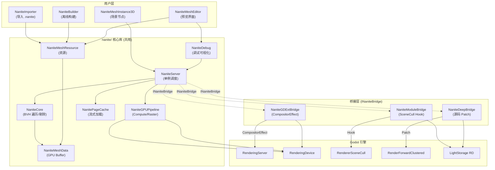

**核心思想**：nanite/ 目录下的所有类（NaniteServer/Core/GPUPipeline 等）不依赖任何特定桥接；桥接层实现 INaniteBridge 接口，负责"何时调用核心库"和"如何把结果喂回引擎"。

---

## 3. 目录与构建组织

```
godot/
├── nanite/                          # 核心库 (三阶段共用)
│   ├── SConscript
│   ├── nanite_server.h/.cpp
│   ├── nanite_core.h/.cpp
│   ├── nanite_mesh_resource.h/.cpp
│   ├── nanite_mesh_data.h/.cpp
│   ├── nanite_mesh_instance_3d.h/.cpp
│   ├── nanite_gpu_pipeline.h/.cpp
│   ├── nanite_hzb.h/.cpp
│   ├── nanite_page_cache.h/.cpp
│   ├── nanite_debug.h/.cpp
│   ├── nanite_builder.h/.cpp
│   ├── nanite_importer.h/.cpp
│   ├── nanite_bridge.h              # INaniteBridge 抽象接口
│   ├── editor/                      # 编辑器扩展 (预览界面)
│   │   ├── nanite_mesh_editor.h/.cpp
│   │   ├── nanite_editor_plugin.h/.cpp
│   │   └── nanite_resource_preview.h/.cpp
│   ├── shaders/
│   │   ├── nanite_cull.glsl
│   │   ├── nanite_rasterize.glsl
│   │   ├── nanite_shadow_rasterize.glsl
│   │   ├── hzb_downsample.glsl
│   │   └── nanite_material_resolve.glsl
│   └── include/
│       └── nanite_bridge_types.h    # 枚举/结构体定义
│
├── nanite_bridge_gdext/             # 阶段一桥接 (GDExtension)
│   ├── SConscript
│   ├── nanite_gdext_bridge.h/.cpp
│   ├── nanite_gdext_plugin.h/.cpp   # GDExtension entry
│   └── register_types.h/.cpp
│
├── modules/nanite_bridge_module/    # 阶段二桥接 (Module)
│   ├── SConscript
│   ├── SCsub
│   ├── config.py
│   ├── nanite_module_bridge.h/.cpp
│   ├── nanite_scene_cull_hook.h/.cpp
│   └── register_types.h/.cpp
│
├── nanite_bridge_deep/              # 阶段三桥接 (源码 Patch)
│   ├── patches/
│   │   ├── renderer_scene_cull.patch
│   │   ├── render_forward_clustered.patch
│   │   └── light_storage.patch
│   ├── nanite_deep_bridge.h/.cpp
│   └── SConscript
│
└── SConstruct                       # 顶层添加 nanite_bridge= 开关
```

### 3.1 SCons 编译开关

```python
# SConstruct (或 nanite/ 顶层 SConscript)
nanite_bridge_arg = ARGUMENTS.get("nanite_bridge", "gdext")

# 核心库始终编译
SConscript("nanite/SConscript")

if nanite_bridge_arg in ("gdext", "all"):
    SConscript("nanite_bridge_gdext/SConscript")
if nanite_bridge_arg in ("module", "all"):
    SConscript("modules/nanite_bridge_module/SConscript")
if nanite_bridge_arg in ("deep", "all"):
    SConscript("nanite_bridge_deep/SConscript")
```

### 3.2 编译期宏

```cpp
// 由 SConscript 根据开关定义
// nanite_bridge_gdext:   NANITE_BRIDGE_GDEXT
// nanite_bridge_module:  NANITE_BRIDGE_MODULE
// nanite_bridge_deep:    NANITE_BRIDGE_DEEP
```

---

## 4. 桥接切换机制

### 4.1 INaniteBridge 抽象接口

```cpp
// nanite/nanite_bridge.h
class INaniteBridge {
public:
    enum class ShadowMode {
        SHADOW_COARSE_LOD,    // 阶段一：粗 LOD shadow mesh
        SHADOW_DYNAMIC_GPU,   // 阶段二/三：动态 per-light GPU shadow
    };

    virtual ~INaniteBridge() = default;

    // 安装桥接，设置 NaniteServer 的阴影模式等
    virtual void install(NaniteServer *p_server) = 0;

    // 获取当前阴影模式
    virtual ShadowMode get_shadow_mode() const = 0;

    // 渲染前回调（由桥接在合适时机调用）
    virtual void on_pre_render(const RenderData *p_render_data) = 0;

    // 不透明 Pass 前回调
    virtual void on_pre_opaque_pass(const RenderData *p_render_data) = 0;

    // 不透明 Pass 后回调（材质解析）
    virtual void on_post_opaque_pass(const RenderData *p_render_data) = 0;

    // 阴影 Pass 回调（阶段二/三）
    virtual void on_shadow_pass(const RenderData *p_render_data, RID p_light, int p_pass) = 0;

    // 获取桥接名称
    virtual StringName get_bridge_name() const = 0;
};
```

### 4.2 编译期宏控制

```cpp
// nanite/nanite_server.cpp
#include "nanite_bridge.h"

#if defined(NANITE_BRIDGE_GDEXT)
#include "nanite_gdext_bridge.h"
#endif
#if defined(NANITE_BRIDGE_MODULE)
#include "nanite_module_bridge.h"
#endif
#if defined(NANITE_BRIDGE_DEEP)
#include "nanite_deep_bridge.h"
#endif
```

### 4.3 运行时 ProjectSettings 激活

```cpp
// nanite/nanite_server.cpp — NaniteServer::init()

void NaniteServer::init() {
    // 注册 ProjectSettings
    if (!ProjectSettings::get_singleton()->has_setting("nanite/bridge/active")) {
        ProjectSettings::get_singleton()->set("nanite/bridge/active", "gdext");
    }
    ProjectSettings::get_singleton()->set_custom_property_info(
        "nanite/bridge/active",
        PropertyInfo(Variant::STRING, "nanite/bridge/active",
                     PROPERTY_HINT_ENUM, "gdext,module,deep"));

    // 运行时选择
    String active = GLOBAL_GET("nanite/bridge/active");

#if defined(NANITE_BRIDGE_GDEXT)
    if (active == "gdext") {
        bridge = memnew(NaniteGDExtBridge);
    }
#endif
#if defined(NANITE_BRIDGE_MODULE)
    if (active == "module") {
        bridge = memnew(NaniteModuleBridge);
    }
#endif
#if defined(NANITE_BRIDGE_DEEP)
    if (active == "deep") {
        bridge = memnew(NaniteDeepBridge);
    }
#endif

    if (bridge) {
        bridge->install(this);
    } else {
        ERR_PRINT(vformat("Nanite: bridge '%s' not available (not compiled).", active));
    }
}
```

### 4.4 切换机制流程

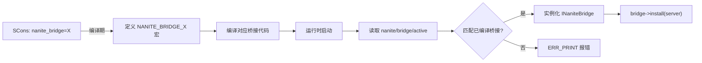

---

## 5. 核心类设计

```mermaid
classDiagram
    class NaniteServer {
        -static NaniteServer *singleton
        -INaniteBridge *bridge
        -ShadowMode shadow_mode
        -HashMap~RID, NaniteMeshData*~ mesh_map
        -HashMap~ObjectID, NaniteMeshInstance3D*~ instance_map
        -NaniteGPUPipeline *gpu_pipeline
        -NanitePageCache *page_cache
        -NaniteDebug *debug
        +init() void
        +finish() void
        +set_shadow_mode(mode: ShadowMode) void
        +get_shadow_mode() ShadowMode
        +register_mesh(resource: NaniteMeshResource) RID
        +unregister_mesh(rid: RID) void
        +register_instance(instance: NaniteMeshInstance3D) void
        +unregister_instance(instance: NaniteMeshInstance3D) void
        +render_visibility(p_render_data: RenderData*) void
        +render_shadow(p_render_data: RenderData*, p_light: RID, p_pass: int) void
        +render_material_resolve(p_render_data: RenderData*) void
        +get_bridge() INaniteBridge*
    }

    class NaniteCore {
        -NaniteGPUPipeline *gpu
        -NanitePageCache *cache
        +cull_and_lod(camera: Projection, view: Transform3D, instances: Vector~Instance~) Vector~ClusterGroup~
        +build_visibility_buffer(rd: RenderingDevice*, clusters: Vector~ClusterGroup~) RID
        +resolve_materials(rd: RenderingDevice*, vis_buffer: RID) void
    }

    class NaniteMeshResource {
        -RID shadow_mesh_rid
        -Vector~Cluster~ clusters
        -BVH bvh
        -PackedByteArray gpu_cluster_data
        -PackedByteArray gpu_vertex_data
        -AABB aabb
        -int cluster_count
        -int lod_count
        +get_shadow_mesh() RID
        +set_shadow_mesh(rid: RID) void
        +get_cluster_count() int
        +get_gpu_cluster_buffer() PackedByteArray
        +get_gpu_vertex_buffer() PackedByteArray
    }

    class NaniteMeshData {
        -RID cluster_ssbo
        -RID vertex_ssbo
        -RID index_ssbo
        -RID bvh_ssbo
        -RID vis_buffer
        -bool gpu_uploaded
        +upload_to_gpu(rd: RenderingDevice*) void
        +get_cluster_ssbo() RID
        +get_vertex_ssbo() RID
        +get_vis_buffer() RID
    }

    class NaniteMeshInstance3D {
        -Ref~NaniteMeshResource~ nanite_mesh
        -RID mesh_rid
        -bool nanite_enabled
        -int forced_lod
        -float relative_screen_size
        +set_nanite_mesh(resource: NaniteMeshResource) void
        +get_nanite_mesh() NaniteMeshResource
        +set_nanite_enabled(enabled: bool) void
        +_notification(what: int) void
    }

    class NaniteGPUPipeline {
        -RID cull_shader
        -RID rasterize_shader
        -RID shadow_rasterize_shader
        -RID material_resolve_shader
        -RID hzb_downsample_shader
        -RID cull_pipeline
        -RID rasterize_pipeline
        -RID shadow_pipeline
        -RID material_pipeline
        -RID hzb_downsample_pipeline
        -NaniteHZB hzb
        +init(rd: RenderingDevice*) void
        +dispatch_cull(rd: RenderingDevice*, params: CullParams) RID
        +dispatch_rasterize(rd: RenderingDevice*, vis_buffer: RID) void
        +dispatch_hzb_build(rd: RenderingDevice*, depth_texture: RID) void
        +dispatch_shadow_rasterize(rd: RenderingDevice*, shadow_fb: RID, params: ShadowParams) void
        +dispatch_material_resolve(rd: RenderingDevice*, vis_buffer: RID) void
        +get_hzb() NaniteHZB*
    }

    class NanitePageCache {
        -HashMap~uint64_t, PageEntry~ page_table
        -List~uint64_t~ lru
        -int max_resident_pages
        +request_page(page_id: uint64_t) bool
        +evict_lru() void
        +get_resident_count() int
    }

    class NaniteDebug {
        -bool show_bounds
        -bool show_clusters
        -bool show_bvh
        -int highlight_lod
        +set_show_bounds(show: bool) void
        +set_show_clusters(show: bool) void
        +draw_debug(rd: RenderingDevice*, vis_buffer: RID) void
    }

    class INaniteBridge {
        <<interface>>
        +install(p_server: NaniteServer*) void
        +get_shadow_mode() ShadowMode
        +on_pre_render(p_render_data: RenderData*) void
        +on_pre_opaque_pass(p_render_data: RenderData*) void
        +on_post_opaque_pass(p_render_data: RenderData*) void
        +on_shadow_pass(p_render_data: RenderData*, p_light: RID, p_pass: int) void
        +get_bridge_name() StringName
    }

    class NaniteBuilder {
        +build_from_mesh(mesh: ArrayMesh) NaniteMeshResource
        -partition_meshlets(indices: Vector~int~, vertices: Vector~Vector3~) Vector~Meshlet~
        -simplify(mesh: Mesh, target_ratio: float) Mesh
        -build_bvh(meshlets: Vector~Meshlet~) BVH
    }

    class NaniteImporter {
        +get_importer_name() String
        +get_recognized_extensions() Vector~String~
        +import(source_file: String, save_path: String, options: Dictionary) Error
    }

    NaniteServer --> INaniteBridge : bridge
    NaniteServer --> NaniteCore : core
    NaniteServer --> NaniteGPUPipeline : gpu_pipeline
    NaniteServer --> NanitePageCache : page_cache
    NaniteServer --> NaniteDebug : debug
    NaniteCore --> NaniteGPUPipeline : gpu
    NaniteCore --> NanitePageCache : cache
    NaniteMeshInstance3D --> NaniteMeshResource : nanite_mesh
    NaniteMeshResource --> NaniteMeshData : mesh_data
    NaniteServer --> NaniteMeshData : manages via RID
    NaniteBuilder --> NaniteMeshResource : creates
    NaniteImporter --> NaniteBuilder : uses

    class NaniteMeshEditor {
        -SubViewport viewport
        -NaniteMeshInstance3D preview_instance
        -Node3D rotation_node
        -Camera3D camera
        -DirectionalLight3D light1
        -DirectionalLight3D light2
        -OptionButton debug_mode_btn
        -Button wireframe_btn
        -Button bounds_btn
        -Label stats_label
        +edit(p_resource: Ref~NaniteMeshResource~) void
        -_on_debug_mode_selected(p_index: int) void
        -_on_wireframe_toggled(p_pressed: bool) void
        -_on_bounds_toggled(p_pressed: bool) void
    }

    class EditorInspectorPluginNanite {
        +can_handle(p_object: Object) bool
        +parse_begin(p_object: Object) void
    }

    class NaniteEditorPlugin {
        +get_plugin_name() String
    }

    class NaniteResourcePreviewGenerator {
        +handles(p_type: String) bool
        +generate(p_from: Ref~Resource~, p_size: Size2, p_metadata: Dictionary) Ref~Texture2D~
    }

    SubViewportContainer <|-- NaniteMeshEditor
    EditorInspectorPlugin <|-- EditorInspectorPluginNanite
    EditorPlugin <|-- NaniteEditorPlugin
    EditorResourcePreviewGenerator <|-- NaniteResourcePreviewGenerator
    NaniteMeshEditor --> NaniteMeshResource : previews
    NaniteMeshEditor --> NaniteDebug : controls debug mode
    EditorInspectorPluginNanite --> NaniteMeshEditor : creates in parse_begin
    NaniteEditorPlugin --> EditorInspectorPluginNanite : registers
    NaniteEditorPlugin --> NaniteResourcePreviewGenerator : registers

    class NaniteGDExtBridge {
        +install(p_server: NaniteServer*) void
        +_render_callback(p_type: int, p_render_data: RenderData*) void
    }

    class NaniteModuleBridge {
        -NaniteSceneCullHook *cull_hook
        +install(p_server: NaniteServer*) void
        +on_pre_shadow_pass(p_rd: RenderData*, p_light: RID, p_pass: int) void
        +on_pre_opaque_pass(p_rd: RenderData*) void
        +on_post_opaque_pass(p_rd: RenderData*) void
    }

    class NaniteDeepBridge {
        +install(p_server: NaniteServer*) void
        +on_pre_shadow_pass(p_rd: RenderData*, p_light: RID, p_pass: int) void
        +on_pre_opaque_pass(p_rd: RenderData*) void
        +on_post_opaque_pass(p_rd: RenderData*) void
        +on_gi_pass(p_rd: RenderData*) void
    }

    INaniteBridge <|.. NaniteGDExtBridge
    INaniteBridge <|.. NaniteModuleBridge
    INaniteBridge <|.. NaniteDeepBridge
    NaniteGDExtBridge --|> CompositorEffect
```

---

## 6. 三阶段实施路径

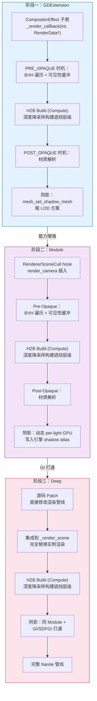

| 维度 | 阶段一 (GDExtension) | 阶段二 (Module) | 阶段三 (Deep) |
|------|----------------------|-----------------|---------------|
| 接入方式 | CompositorEffect | RendererSceneCull hook | 源码 patch |
| GPU HZB | ✅ 自建 RD Texture | ✅ 自建 RD Texture | ✅ 可复用引擎深度纹理 |
| 阴影 | 粗 LOD shadow mesh | 动态 GPU shadow | 动态 GPU shadow + GI |
| GI 支持 | 无 | 无 | SDFGI/VoxelGI 打通 |
| 修改引擎 | 否 | 是(模块) | 是(patch) |
| 分发方式 | .gdextension 插件 | 编译引擎 | 编译引擎 |
| 开发效率 | 最高 | 中 | 最低 |
| 效果完整度 | 基础 | 良好 | 完整 |

---

## 7. GPU HZB 模块：层次化深度缓冲

> Godot 4.7.1 仅有 CPU 侧 HZB（`RendererSceneOcclusionCull::HZBuffer`），无 GPU 侧 depth pyramid。
> Nanite 的 GPU Cull Shader 必须采样 GPU 纹理形式的 HZB，因此需要自建 GPU HZB 模块。
> 详细原理分析见调研文档 1.3.4 节。

### 7.1 问题陈述

| 维度 | Godot 现有（CPU HZB） | Nanite 需要（GPU HZB） |
|------|----------------------|----------------------|
| 数据存储 | `LocalVector<float>` 主存 | `RD::Texture` GPU 显存 |
| 降采样方式 | CPU 逐像素循环 | Compute Shader 并行 |
| 查询方式 | CPU 侧 `_is_occluded()` | GPU Cull Shader 纹理采样 |
| 查询粒度 | 实例级 | Cluster 级 |
| 吞吐量 | ~数百到数千实例/帧 | ~数十万 Cluster/帧 |

核心矛盾：GPU Cull Shader 无法访问 CPU 主存数据，CPU 也无法以 Cluster 粒度逐个查询遮挡。Nanite **必须**使用 GPU HZB。

### 7.2 GPU HZB 在渲染管线中的位置

```
Cull Pass 1 (用上帧 HZB)
    → Rasterize (输出 VisBuffer + Depth)
    → HZB Build (Compute Shader 从 Depth 降采样)   ← 本模块
    → Cull Pass 2 (用本帧 HZB，补漏)
    → Material Eval
```

关键特征：
- HZB 输入来源是 Nanite 自己光栅化的深度缓冲，与引擎深度缓冲解耦
- 两遍剔除确保遮挡准确性接近 100%，仅第一帧可能有少量漏剔
- 与 Godot 现有 CPU HZB 互不干扰：CPU HZB 剔除传统实例，GPU HZB 剔除 Nanite Cluster

### 7.3 NaniteHZB 类设计

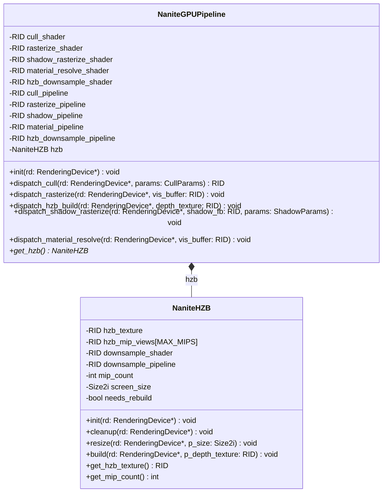

**NaniteHZB 关键设计决策**：

- **纹理格式**：使用 `RD::DATA_FORMAT_R32_SFLOAT`，每纹素 4 字节存储单个浮点深度值
- **Mip 视图**：为每级 mip 创建独立 image view，供 Compute Shader 逐级绑定
- **纹理分配**：`RD::texture_create()` + `RD::texture_create_shared_from_layer()` 或逐级 view
- **Resize 策略**：检测 `RenderSceneBuffers` 尺寸变化，触发 `resize()` 重新分配

### 7.4 HZB 降采样 Compute Shader

```glsl
#[compute]
#version 450

layout(set = 0, binding = 0) uniform sampler2D src_depth;
layout(set = 0, binding = 1) uniform image2D dst_mip;
layout(set = 0, binding = 2) uniform Params {
    ivec2 src_size;
    int mip_level;
    int _pad;
} params;

layout(local_size_x = 8, local_size_y = 8, local_size_z = 1) in;

void main() {
    ivec2 coord = ivec2(gl_GlobalInvocationID.xy);
    ivec2 dst_size = imageSize(dst_mip);
    if (coord.x >= dst_size.x || coord.y >= dst_size.y) return;

    // 2x2 采样取 MAX（保守遮挡——不会误剔）
    vec4 depths = vec4(
        texelFetch(src_depth, coord * 2 + ivec2(0, 0), 0).r,
        texelFetch(src_depth, coord * 2 + ivec2(1, 0), 0).r,
        texelFetch(src_depth, coord * 2 + ivec2(0, 1), 0).r,
        texelFetch(src_depth, coord * 2 + ivec2(1, 1), 0).r
    );
    float max_depth = max(max(depths.x, depths.y), max(depths.z, depths.w));
    imageStore(dst_mip, coord, vec4(max_depth, 0.0, 0.0, 1.0));
}
```

### 7.5 HZB 构建流程

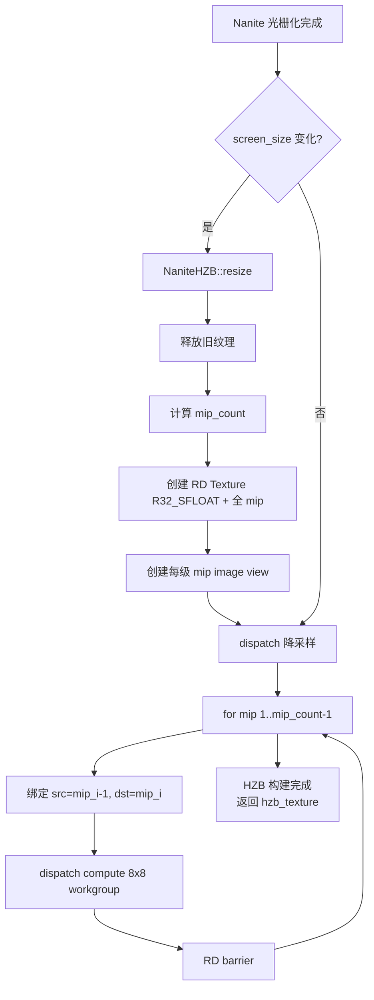

**C++ 调度伪代码**：
```cpp
void NaniteHZB::build(RenderingDevice *rd, RID p_depth_texture) {
    if (needs_rebuild) {
        resize(rd, current_size);
        needs_rebuild = false;
    }

    // 第 0 级：从 Nanite depth buffer 复制到 HZB mip 0
    // （如果格式不同需要 blit，相同格式可直接作为 mip 0 输入）
    RID prev_mip = p_depth_texture;

    for (int i = 1; i < mip_count; i++) {
        // 创建 uniform set：绑定 prev_mip 为 src，hzb_mip_views[i] 为 dst
        RD::UniformSetID set = create_downsample_set(rd, prev_mip, hzb_mip_views[i]);
        Size2i mip_size = sizes[i];
        rd->compute_list_begin();
        rd->compute_list_bind_compute_pipeline(compute_list, downsample_pipeline);
        rd->compute_list_bind_uniform_set(compute_list, set, 0);
        // push constants: src_size, mip_level
        rd->compute_list_set_push_constant(compute_list, ...);
        rd->compute_list_dispatch(compute_list,
            (mip_size.width + 7) / 8,
            (mip_size.height + 7) / 8, 1);
        rd->compute_list_end();
        rd->barrier(RD::BARRIER_COMPUTE_TO_COMPUTE);

        prev_mip = hzb_mip_views[i]; // 下一级的输入是当前级
    }
}
```

### 7.6 HZB 在 Cull Shader 中的使用

GPU Cull Shader 中的遮挡查询伪代码：
```glsl
// 在 BVH 节点/Cluster 剔除中
bool is_occluded = hzb_occlusion_test(
    hzb_texture,           // GPU HZB 纹理
    node_aabb,             // BVH 节点 AABB
    view_matrix,           // 相机 view
    projection_matrix,     // 相机 projection
    screen_size            // 屏幕尺寸
);

bool hzb_occlusion_test(
    sampler2D hzb,
    AABB aabb,
    mat4 view,
    mat4 proj,
    vec2 screen_size
) {
    // 1. 投影 AABB 8 角到屏幕空间
    vec3 corners[8] = get_aabb_corners(aabb);
    vec2 rect_min = vec2(1e9);
    vec2 rect_max = vec2(-1e9);
    float z_near = 1e9;
    for (int i = 0; i < 8; i++) {
        vec4 clip = proj * view * vec4(corners[i], 1.0);
        vec2 ndc = clip.xy / clip.w;
        vec2 uv = ndc * 0.5 + 0.5;
        rect_min = min(rect_min, uv);
        rect_max = max(rect_max, uv);
        z_near = min(z_near, clip.w > 0 ? clip.z / clip.w : 1.0);
    }

    // 2. 选择 mip 层级（使包围矩形约覆盖 1 个纹素）
    vec2 rect_size = (rect_max - rect_min) * screen_size;
    float mip_level = ceil(log2(max(rect_size.x, rect_size.y)));

    // 3. 从粗到细遍历
    for (int mip = int(mip_level); mip >= 0; mip--) {
        vec2 mip_size = screen_size / exp2(float(mip));
        vec2 uv = clamp((rect_min + rect_max) * 0.5, vec2(0.0), vec2(1.0));
        float z_far = textureLod(hzb, uv, float(mip)).r;
        if (z_near > z_far) return true;  // 被遮挡
    }
    return false;  // 可见
}
```

### 7.7 三桥接方案下 GPU HZB 的差异

| 维度 | GDExtension | Module | Deep |
|------|------------|--------|------|
| HZB 纹理分配 | CompositorEffect 回调内 `RenderingDevice::get_singleton()` | 同左，但可直接 include 引擎头文件 | 可复用引擎内部 depth texture，减少拷贝 |
| 深度来源 | 自行维护 Nanite depth buffer，或通过 `RenderSceneBuffers` 获取 | 同左 | 可直接访问 `RenderForwardClustered` 内部深度纹理 |
| 纹理格式转换 | 需确认 Nanite depth 与 HZB 格式兼容（均 R32_SFLOAT 则直接复用） | 同左 | 可利用引擎 depth buffer 的现有 format conversion |
| 调试可视化 | 在 NaniteDebug 中添加 HZB mip 可视化模式 | 同左 | 同左 |
| 长期优化 | — | — | 可将 GPU HZB 提升为引擎通用基础设施，SSAO/SSR 等后处理也可复用 |

### 7.8 HZB 调试可视化

在 `NaniteDebug` 中新增 HZB 可视化模式：

```cpp
// NaniteDebug 扩展
enum class DebugMode {
    NONE = 0,
    CLUSTER_COLORS,    // 现有：Cluster 纯色
    BVH_WIREFRAME,     // 现有：BVH 线框
    BOUNDS,            // 现有：包围盒
    LOD_HEATMAP,       // 现有：LOD 热力图
    OVERDRAW,          // 现有：过度绘制
    HZB_MIP_LEVELS,    // 新增：显示各级 mip 深度图
    HZB_OCCLUSION,     // 新增：显示遮挡查询结果（绿=可见，红=被剔除）
};
```

HZB mip 可视化实现：在 Material Eval 阶段，用 fullscreen quad 将各级 HZB mip 绘制到屏幕四角（类似 UE5 的 HZB 调试视图）。

### 7.9 与 Godot CPU HZB 的共存策略

```
┌──────────────────────────────────────────────────────────────────┐
│                     帧渲染管线                                     │
├──────────────────────────────────────────────────────────────────┤
│                                                                  │
│  CPU 侧 (Godot 原有)                                             │
│  ┌─────────────────────────────────────┐                        │
│  │ RendererSceneCull::render_camera()   │                        │
│  │   → HZBuffer::update() (CPU 降采样) │                        │
│  │   → OCCLUSION_CULLED 宏              │                        │
│  │   → 剔除传统实例                     │                        │
│  └─────────────────────────────────────┘                        │
│                                                                  │
│  GPU 侧 (Nanite 自建)                                            │
│  ┌─────────────────────────────────────┐                        │
│  │ NaniteGPUPipeline::dispatch_cull()   │                        │
│  │   → 采样 NaniteHZB 纹理 (GPU)       │                        │
│  │   → 剔除 Nanite Cluster              │                        │
│  │   → NaniteHZB::build() (Compute)    │                        │
│  └─────────────────────────────────────┘                        │
│                                                                  │
│  两套 HZB 互不干扰，数据流完全独立                                 │
│                                                                  │
└──────────────────────────────────────────────────────────────────┘
```

---

## 8. 离线构建模块：基于 meshoptimizer 的层次化 Meshlet + BVH

### 8.1 为什么用 meshoptimizer

Godot 在 `thirdparty/meshoptimizer/`(版本 1.1)和 `modules/meshoptimizer/` 中已携带 meshoptimizer 库，是业界事实标准，**已包含 Nanite 离线阶段所需的全部基础算法**：

| Nanite 需求 | 对应 meshoptimizer API |
|---|---|
| 切叶子 cluster(128 tri) | `meshopt_buildMeshletsFlex` |
| 计算簇包围盒 + 法线锥 | `meshopt_computeMeshletBounds` |
| 簇分组(4 簇→1 父) | `meshopt_partitionClusters` |
| QEM 简化(支持属性/锁边) | `meshopt_simplifyWithAttributes` |
| 误差尺度归一化 | `meshopt_simplifyScale` |
| Meshlet 内部 reorder | `meshopt_optimizeMeshletLevel` |
| 簇序列化(<1 byte/tri) | `meshopt_encodeMeshlet` / `meshopt_decodeMeshlet` |
| 顶点 buffer 压缩 | `meshopt_encodeVertexBuffer` |
| 顶点 cache/fetch 优化 | `meshopt_optimizeVertexCache` / `meshopt_optimizeVertexFetch` |
| Provoking vertex 调整 | `meshopt_generateProvokingIndexBuffer` |

但 Godot 的 `modules/meshoptimizer/register_types.cpp` 只把 7 个函数挂到 `SurfaceTool`，完全没暴露 meshlet/BVH/cluster 相关 API。因此：
- ✅ meshoptimizer 库已链接进引擎，无需重新引入；
- ✅ 三套方案都可 `#include <thirdparty/meshoptimizer/meshoptimizer.h>` 直接调用；
- ⚠️ 需在自己的代码里直接调用 meshoptimizer C API，不要通过 `SurfaceTool` 间接触发。

### 8.2 离线构建管线总览

```
ArrayMesh / SurfaceTool 顶点数组
   │
   ├─ 0. 预处理
   │     ├─ meshopt_generateVertexRemap           # 合并重复顶点
   │     ├─ meshopt_optimizeVertexCache            # 顶点 cache 优化
   │     └─ meshopt_optimizeVertexFetch            # 顶点 fetch 局部性
   │
   ├─ 1. 叶子层(L0)聚类
   │     ├─ meshopt_buildMeshletsFlex(max_vertices=64,
   │     │     min_triangles=32, max_triangles=128,
   │     │     cone_weight=0.5, split_factor=0.5)
   │     └─ for each meshlet:
   │           meshopt_optimizeMeshletLevel(level=3)
   │           bounds = meshopt_computeMeshletBounds(...)
   │           error = 0
   │
   ├─ 2. 层次化生成(自底向上)
   │     while cluster_count > 1:
   │       ├─ meshopt_partitionClusters(target_partition_size=4)
   │       ├─ for each partition:
   │       │     ├─ 合并 4 簇的 index + vertex 子集
   │       │     ├─ vertex_lock 锁住组边界
   │       │     ├─ meshopt_simplifyWithAttributes(target=原/2,
   │       │     │     target_error=0.5, options=LockBorder+Regularize)
   │       │     ├─ meshopt_buildMeshletsFlex(...) 再切 2 簇
   │       │     ├─ parent.error = max(child.error, result_error)
   │       │     └─ parent.bounds = union(child.bounds)
   │       └─ 输出 parent 节点
   │
   ├─ 3. BVH 装配
   │     └─ 展开层次结构为线性节点数组(left_child/right_child 用数组下标)
   │
   ├─ 4. 辅助数据生成
   │     ├─ 4.1 Group ID (crack-free 渲染)
   │     ├─ 4.2 Page ID (按 LOD+空间 locality 排序后切页,默认 64KB/页)
   │     ├─ 4.3 Material Index
   │     ├─ 4.4 Cone Axis/Cutoff (背面剔除)
   │     ├─ 4.5 Provoking reorder (VisBuffer flat 取值)
   │     ├─ 4.6 顶点量化 (meshopt_encodeFilterExp)
   │     └─ 4.7 误差归一化 (meshopt_simplifyScale)
   │
   ├─ 5. 粗 LOD Shadow Mesh 生成(供 GDExtension 桥接阴影方案使用)
   │
   ├─ 6. 序列化
   │     ├─ meshopt_encodeMeshlet(每簇独立编码)
   │     ├─ meshopt_encodeVertexBuffer(顶点池)
   │     └─ 写入 *.nanite 二进制 + .res 元数据
   │
   └─ 输出: NaniteMeshResource(可挂到 NaniteMeshInstance3D)
```

### 8.3 类图

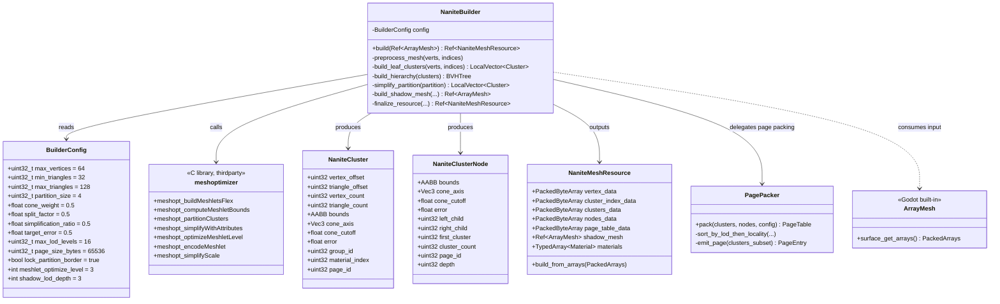

### 8.4 流程图 — 离线构建主流程

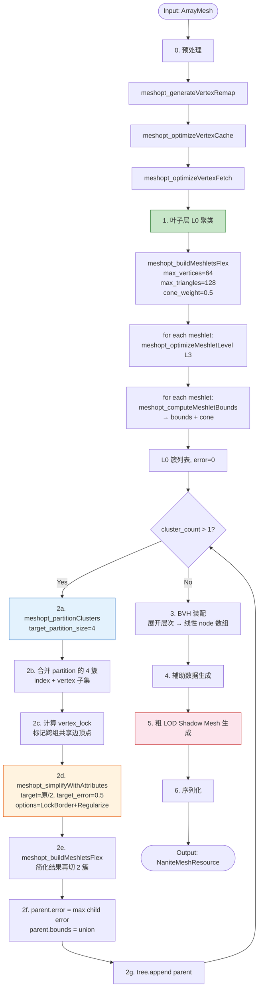

### 8.5 时序图 — 层次化构建(单个 mesh)

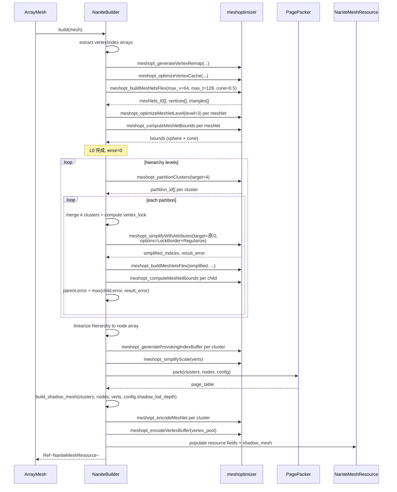

### 8.6 关键代码骨架

#### 8.6.1 预处理 + 叶子层聚类

```cpp
// nanite/offline/nanite_builder.cpp
#include <thirdparty/meshoptimizer/meshoptimizer.h>

Ref<NaniteMeshResource> NaniteBuilder::build(const Ref<ArrayMesh> &p_mesh) {
    ERR_FAIL_COND_V(p_mesh.is_null() || p_mesh->get_surface_count() == 0, {});

    // ===== 0. 预处理 =====
    Array arrays = p_mesh->surface_get_arrays(0);
    PackedVector3Array positions = arrays[Mesh::ARRAY_VERTEX];
    PackedInt32Array    indices32 = arrays[Mesh::ARRAY_INDEX];

    // 重新打包 Vector3(16B stride) → 紧凑 float3(12B)
    LocalVector<float> verts_pos;
    verts_pos.resize(positions.size() * 3);
    for (int i = 0; i < positions.size(); i++) {
        verts_pos[i * 3 + 0] = positions[i].x;
        verts_pos[i * 3 + 1] = positions[i].y;
        verts_pos[i * 3 + 2] = positions[i].z;
    }

    // 0a. 顶点 remap(合并重复)
    LocalVector<unsigned int> remap;
    remap.resize(positions.size());
    size_t unique_count = meshopt_generateVertexRemap(
        remap.ptr(), reinterpret_cast<const unsigned int *>(indices32.ptr()),
        indices32.size(), verts_pos.ptr(), positions.size(), sizeof(float) * 3);

    // 0b. 应用 remap → 紧凑 vertex/index buffer
    LocalVector<float> compact_verts;
    compact_verts.resize(unique_count * 3);
    meshopt_remapVertexBuffer(compact_verts.ptr(), verts_pos.ptr(),
                              positions.size(), sizeof(float) * 3, remap.ptr());
    LocalVector<unsigned int> compact_indices;
    compact_indices.resize(indices32.size());
    meshopt_remapIndexBuffer(compact_indices.ptr(),
        reinterpret_cast<const unsigned int *>(indices32.ptr()),
        indices32.size(), remap.ptr());

    // 0c. 顶点 cache + fetch 优化
    LocalVector<unsigned int> opt_indices;
    opt_indices.resize(compact_indices.size());
    meshopt_optimizeVertexCache(opt_indices.ptr(), compact_indices.ptr(),
                                compact_indices.size(), unique_count);

    // ===== 1. 叶子层 L0 聚类 =====
    size_t meshlet_bound = meshopt_buildMeshletsBound(
        opt_indices.size(), config.max_vertices, config.min_triangles);

    LocalVector<meshopt_Meshlet> meshlets;
    meshlets.resize(meshlet_bound);
    LocalVector<unsigned int> meshlet_vertices;
    meshlet_vertices.resize(meshlet_bound * config.max_vertices);
    LocalVector<unsigned char> meshlet_triangles;
    meshlet_triangles.resize(meshlet_bound * config.max_triangles * 3);

    size_t meshlet_count = meshopt_buildMeshletsFlex(
        meshlets.ptr(), meshlet_vertices.ptr(), meshlet_triangles.ptr(),
        opt_indices.ptr(), opt_indices.size(),
        compact_verts.ptr(), unique_count, sizeof(float) * 3,
        config.max_vertices, config.min_triangles, config.max_triangles,
        config.cone_weight, config.split_factor);

    // 每簇内部 reorder + bounds + error=0
    LocalVector<NaniteCluster> l0_clusters;
    l0_clusters.resize(meshlet_count);
    for (size_t i = 0; i < meshlet_count; i++) {
        meshopt_Meshlet &m = meshlets[i];
        meshopt_optimizeMeshletLevel(
            meshlet_vertices.ptr() + m.vertex_offset, m.vertex_count,
            meshlet_triangles.ptr() + m.triangle_offset, m.triangle_count,
            config.meshlet_optimize_level);

        meshopt_Bounds b = meshopt_computeMeshletBounds(
            meshlet_vertices.ptr() + m.vertex_offset,
            meshlet_triangles.ptr() + m.triangle_offset, m.triangle_count,
            compact_verts.ptr(), unique_count, sizeof(float) * 3);

        NaniteCluster &c = l0_clusters[i];
        c.vertex_offset    = m.vertex_offset;
        c.triangle_offset  = m.triangle_offset;
        c.vertex_count     = m.vertex_count;
        c.triangle_count   = m.triangle_count;
        c.bounds           = AABB(Vector3(b.center[0]-b.radius, b.center[1]-b.radius, b.center[2]-b.radius),
                                   Vector3(b.radius*2, b.radius*2, b.radius*2));
        c.cone_axis        = Vector3(b.cone_axis[0], b.cone_axis[1], b.cone_axis[2]);
        c.cone_cutoff      = b.cone_cutoff;
        c.error            = 0.0f;
    }

    // ===== 2. 层次化构建 =====
    LocalVector<NaniteClusterNode> nodes;
    build_hierarchy(l0_clusters, compact_verts, unique_count, nodes);

    // ===== 3-6. BVH 装配 + 辅助数据 + Shadow Mesh + 序列化 =====
    return finalize_resource(l0_clusters, nodes, compact_verts,
                              meshlet_vertices, meshlet_triangles, p_mesh);
}
```

#### 8.6.2 层次化构建(自底向上)

```cpp
void NaniteBuilder::build_hierarchy(LocalVector<NaniteCluster> &p_clusters,
                                      const LocalVector<float> &p_verts,
                                      size_t p_vertex_count,
                                      LocalVector<NaniteClusterNode> &r_nodes) {
    LocalVector<NaniteCluster> current_level = p_clusters;
    LocalVector<NaniteCluster> next_level;
    uint32_t depth = 0;

    while (current_level.size() > 1) {
        depth++;
        next_level.clear();

        // 2a. meshopt_partitionClusters 把簇按 4 个一组分组
        // (构造 cluster_indices + cluster_index_counts 后调用)
        LocalVector<unsigned int> partition_ids;
        partition_ids.resize(current_level.size());
        size_t partition_count = meshopt_partitionClusters(
            partition_ids.ptr(),
            cluster_indices.ptr(), cluster_indices.size(),
            cluster_index_counts.ptr(), current_level.size(),
            p_verts.ptr(), p_vertex_count, sizeof(float) * 3,
            config.partition_size);

        // 2b. 对每个 partition:合并 → 简化 → 再聚类
        LocalVector<LocalVector<uint32_t>> partitions;
        partitions.resize(partition_count);
        for (size_t i = 0; i < current_level.size(); i++) {
            partitions[partition_ids[i]].push_back(i);
        }

        for (const auto &p_cluster_idxs : partitions) {
            if (p_cluster_idxs.size() < 2) {
                for (uint32_t cid : p_cluster_idxs) {
                    next_level.push_back(current_level[cid]);
                }
                continue;
            }

            // 合并 partition → 临时 index buffer
            LocalVector<unsigned int> merged_indices;
            // ... (合并簇三角形)

            // 2c. 计算 vertex_lock:锁住跨 partition 共享的顶点
            LocalVector<unsigned char> vertex_lock;
            vertex_lock.resize(p_vertex_count);
            compute_partition_vertex_locks(...);

            // 2d. meshopt_simplifyWithAttributes
            float result_error = 0.0f;
            size_t target = (size_t)(merged_indices.size() * config.simplification_ratio);
            unsigned int options = meshopt_SimplifyLockBorder
                                 | meshopt_SimplifyRegularize;

            size_t simplified_count = meshopt_simplifyWithAttributes(
                simplified_indices.ptr(), merged_indices.ptr(), merged_indices.size(),
                p_verts.ptr(), p_vertex_count, sizeof(float) * 3,
                nullptr, 0, nullptr, 0,
                vertex_lock.ptr(),
                target, config.target_error, options, &result_error);

            // 2e. 再用 buildMeshletsFlex 切成 2 个新簇
            size_t child_count = meshopt_buildMeshletsFlex(...);

            // 2f. 装配父节点 + 子簇
            NaniteClusterNode parent;
            parent.error = 0.0f;
            for (size_t k = 0; k < child_count; k++) {
                // computeMeshletBounds → child bounds + cone
                parent.error  = MAX(parent.error, result_error);
                parent.bounds = parent.bounds.merge(child.bounds);
            }
            r_nodes.push_back(parent);
            next_level.push_back(parent_as_cluster);
        }
        current_level = next_level;
    }
}
```

#### 8.6.3 粗 LOD Shadow Mesh 生成

构建完成后，从层次结构中提取指定深度的 cluster，展开为标准 `ArrayMesh`，供 GDExtension 桥接通过 `mesh_set_shadow_mesh` 使用：

```cpp
Ref<ArrayMesh> NaniteBuilder::build_shadow_mesh(
        const LocalVector<NaniteCluster> &p_clusters,
        const LocalVector<NaniteClusterNode> &p_nodes,
        const LocalVector<float> &p_verts,
        const LocalVector<unsigned int> &p_meshlet_vertices,
        const LocalVector<unsigned char> &p_meshlet_triangles,
        int p_shadow_lod_depth) {

    // 找到指定深度的节点,合并 cluster 三角形
    LocalVector<uint32_t> shadow_cluster_ids;
    for (uint32_t i = 0; i < p_nodes.size(); i++) {
        const NaniteClusterNode &node = p_nodes[i];
        if (node.depth <= p_shadow_lod_depth && node.cluster_count > 0) {
            for (uint32_t c = node.first_cluster;
                 c < node.first_cluster + node.cluster_count; c++) {
                shadow_cluster_ids.push_back(c);
            }
        }
    }

    // 展开 meshlet micro-index 为标准 triangle list
    LocalVector<Vector3> shadow_positions;
    LocalVector<int> shadow_indices;
    uint32_t vertex_offset = 0;
    for (uint32_t cid : shadow_cluster_ids) {
        const NaniteCluster &cluster = p_clusters[cid];
        for (uint32_t t = 0; t < cluster.triangle_count; t++) {
            // meshlet 8-bit local index → global vertex id
            uint32_t v0 = p_meshlet_vertices[cluster.vertex_offset +
                         p_meshlet_triangles[cluster.triangle_offset + t * 3 + 0]];
            uint32_t v1 = p_meshlet_vertices[cluster.vertex_offset +
                         p_meshlet_triangles[cluster.triangle_offset + t * 3 + 1]];
            uint32_t v2 = p_meshlet_vertices[cluster.vertex_offset +
                         p_meshlet_triangles[cluster.triangle_offset + t * 3 + 2]];
            shadow_indices.push_back(vertex_offset + v0);
            shadow_indices.push_back(vertex_offset + v1);
            shadow_indices.push_back(vertex_offset + v2);
        }
        for (uint32_t v = 0; v < cluster.vertex_count; v++) {
            uint32_t vid = p_meshlet_vertices[cluster.vertex_offset + v];
            shadow_positions.push_back(Vector3(
                p_verts[vid * 3 + 0], p_verts[vid * 3 + 1], p_verts[vid * 3 + 2]));
        }
        vertex_offset += cluster.vertex_count;
    }

    // 构建标准 ArrayMesh
    Ref<ArrayMesh> shadow_mesh;
    shadow_mesh.instantiate();
    Array arrays;
    arrays.resize(Mesh::ARRAY_MAX);
    PackedVector3Array pos_array;
    PackedInt32Array idx_array;
    for (const Vector3 &p : shadow_positions) pos_array.push_back(p);
    for (int idx : shadow_indices) idx_array.push_back(idx);
    arrays[Mesh::ARRAY_VERTEX] = pos_array;
    arrays[Mesh::ARRAY_INDEX] = idx_array;
    shadow_mesh->add_surface_from_arrays(Mesh::PRIMITIVE_TRIANGLES, arrays);
    return shadow_mesh;
}
```

### 8.7 构建参数与可调性

构建参数通过 `BuilderConfig` 暴露，支持在编辑器预览界面中实时调整并重新构建：

| 参数 | 默认值 | 影响 | 可调位置 |
|---|---|---|---|
| `max_vertices` | 64 | 兼容 mesh shader;过大撑爆寄存器 | Inspector 高级 |
| `max_triangles` | 128 | Nanite 标准;256 增大 dispatch | Inspector 高级 |
| `cone_weight` | 0.5 | 0=不顾法线锥,1=强约束 | Inspector |
| `partition_size` | 4 | 4→1 标准;8→1 简化更激进 | Inspector |
| `simplification_ratio` | 0.5 | 每层简化到一半 | Inspector |
| `target_error` | 0.5 (relative) | 相对误差上限 | Inspector |
| `meshlet_optimize_level` | 3 | 0=最快,3=平衡,9=最慢 | Inspector 高级 |
| `page_size_bytes` | 65536 | 64KB/页 | Inspector 高级 |
| `shadow_lod_depth` | 3 | 粗 LOD 取哪个深度层 | Inspector (粗 LOD 预览) |
| `lock_partition_border` | true | 锁边防 crack | Inspector 高级 |

**参数调整流程**：用户在 Inspector 中修改 `BuilderConfig` → 触发 `NaniteBuilder::build()` 重新构建 → 自动更新 `NaniteMeshResource` → 预览界面即时刷新 → 调试可视化验证效果。

### 8.8 与预览界面和调试可视化的集成

离线构建完成后，通过编辑器模块（下一章）实现预览和调试：

1. **构建后即时预览**：`NaniteBuilder::build()` 返回的 `NaniteMeshResource` 直接传递给 `NaniteMeshEditor::edit()`，自动切换到 **Cluster 纯色模式**验证簇划分质量；
2. **LOD 层级验证**：在预览界面切换到 **LOD 着色模式**，直观查看不同深度的簇分布，确认 `simplification_ratio` 和 `target_error` 效果；
3. **粗 LOD 预览**：调整 `shadow_lod_depth` 参数后，预览界面切换到 **Wireframe 叠加模式**，同时显示 Nanite mesh 和粗 LOD shadow_mesh 的线框对比；
4. **参数迭代**：修改 `BuilderConfig` 后自动重新构建，构建统计（cluster 数 / node 数 / page 数 / 粗 LOD tri 数）在 `stats_label` 中实时更新；
5. **资源预览缩略图**：`NaniteResourcePreviewGenerator` 用粗 LOD `shadow_mesh` 渲染缩略图，不启动 Nanite GPUPipeline，避免性能开销。

### 8.9 序列化

每个 cluster 用 `meshopt_encodeMeshlet` 单独编码，运行时按 page 加载并 `meshopt_decodeMeshlet` 解码：

```cpp
// 离线写盘
void NaniteMeshResource::serialize(const LocalVector<NaniteCluster> &p_clusters,
                                     const LocalVector<unsigned int> &p_meshlet_vertices,
                                     const LocalVector<unsigned char> &p_meshlet_triangles) {
    FileAccessRef f = FileAccess::open("res://mesh.nanite", FileAccess::WRITE);
    f->store_buffer("NANM", 4);  // magic
    f->store_32(1);               // version

    for (const NaniteCluster &c : p_clusters) {
        size_t bound = meshopt_encodeMeshletBound(c.vertex_count, c.triangle_count);
        LocalVector<unsigned char> encoded;
        encoded.resize(bound);
        size_t encoded_size = meshopt_encodeMeshlet(
            encoded.ptr(), bound,
            p_meshlet_vertices.ptr() + c.vertex_offset, c.vertex_count,
            p_meshlet_triangles.ptr() + c.triangle_offset, c.triangle_count);

        f->store_32(c.vertex_count);
        f->store_32(c.triangle_count);
        f->store_32(encoded_size);
        f->store_buffer(encoded.ptr(), encoded_size);
    }
}

// 运行时 page-in 时解码
void PageCache::decode_page(uint32_t p_page_id) {
    FileAccessRef f = FileAccess::open("res://mesh.nanite", FileAccess::READ);
    for (const ClusterEntry &e : page_table[p_page_id].entries) {
        f->seek(e.file_offset);
        uint32_t vcount = f->get_32();
        uint32_t tcount = f->get_32();
        uint32_t esize  = f->get_32();
        LocalVector<unsigned char> encoded;
        encoded.resize(esize);
        f->get_buffer(encoded.ptrw(), esize);

        meshopt_decodeMeshlet(staging_vertex_ptr + e.vertex_offset, vcount,
                               sizeof(unsigned int),
                               staging_index_ptr + e.triangle_offset, tcount,
                               sizeof(unsigned int),
                               encoded.ptr(), esize);
    }
}
```

### 8.10 辅助数据汇总

| 字段 | 类型 | 来源(meshoptimizer API) | 运行时用途 |
|---|---|---|---|
| `bounds.center/radius` | vec3/float | `meshopt_computeMeshletBounds` | 视锥/HZB 遮挡剔除 |
| `cone_axis/cutoff` | vec3/float | `meshopt_Bounds.cone_axis/cutoff` | 背面剔除 |
| `error` | float | `meshopt_simplifyWithAttributes` × `meshopt_simplifyScale` | LOD 选择 |
| `group_id` | uint32 | `meshopt_partitionClusters` partition_id | crack-free 渲染 |
| `material_index` | uint32 | surface 来源 | 间接绘制按材质分组 |
| `page_id` | uint32 | `PagePacker` 基于 morton 排序后切页 | 磁盘流式加载 |
| `left_child/right_child` | uint32 | 构建时层次结构展开 | GPU 栈式 BVH 遍历 |
| `provoking_vertex` | — | `meshopt_generateProvokingIndexBuffer` | VisBuffer flat 取 triangle_id |

### 8.11 三桥接下离线构建的差异

| 维度 | GDExtension | Module | Deep |
|---|---|---|---|
| meshoptimizer 调用 | GDExtension 内 `#include <meshoptimizer.h>` SCons 编译 | 直接 `#include <thirdparty/meshoptimizer/meshoptimizer.h>` | 同 Module + 可改 SurfaceTool |
| 触发构建 | EditorImporter → `NaniteBuilder::build()` | 同左 | 编辑器导入自动判断(面数>阈值) |
| 多线程 | GDExtension 起后台 Thread | `WorkerThreadPool` | 同 Module + ResourceSaver 集成 |
| 粗 LOD Shadow Mesh | **必须生成**，供 `mesh_set_shadow_mesh` 使用 | 可选(动态 GPU shadow) | 不需要(完全打通) |
| 序列化 | 自定义二进制 + `.res` 元数据 | 同左 | 可扩展 `.scn`/`.res` 原生格式 |
| 用户体验 | 导入后手动挂 NaniteMeshResource | 同左但 Inspector 自动建议 | 自动：导入高面数 mesh 自动生成 Nanite |

### 8.12 边界情况与限制

1. **三角形数过少的 mesh**(< 128 tri)：不构建 Nanite，直接走标准 mesh；
2. **多 surface mesh**：每个 surface 独立构建 BVH，vertex pool 共享，`material_index` 区分；
3. **Morph Target / Blend Shape**：Nanite 不支持运行时形变，自动 fallback 到标准 mesh；
4. **Skeleton deformation**：Nanite 不支持 bone-skinned mesh，fallback 到标准 mesh；
5. **超大 mesh**(> 100M tri)：离线构建内存占用大，需流式处理 + 多线程；
6. **Compatibility renderer**(OpenGL)：不支持 compute/mesh shader，构建出的 Nanite 资源自动 fallback 到标准 mesh LOD。

---

## 9. 编辑器模块：预览界面与调试可视化

### 9.1 概述

离线构建完成后，用户需要在 Inspector 中预览 Nanite mesh 并能切换调试可视化模式验证构建质量。参照 Godot 内置的 `MeshEditor`(`editor/scene/3d/mesh_editor_plugin.h`)，设计 `NaniteMeshEditor`。

### 9.2 类图

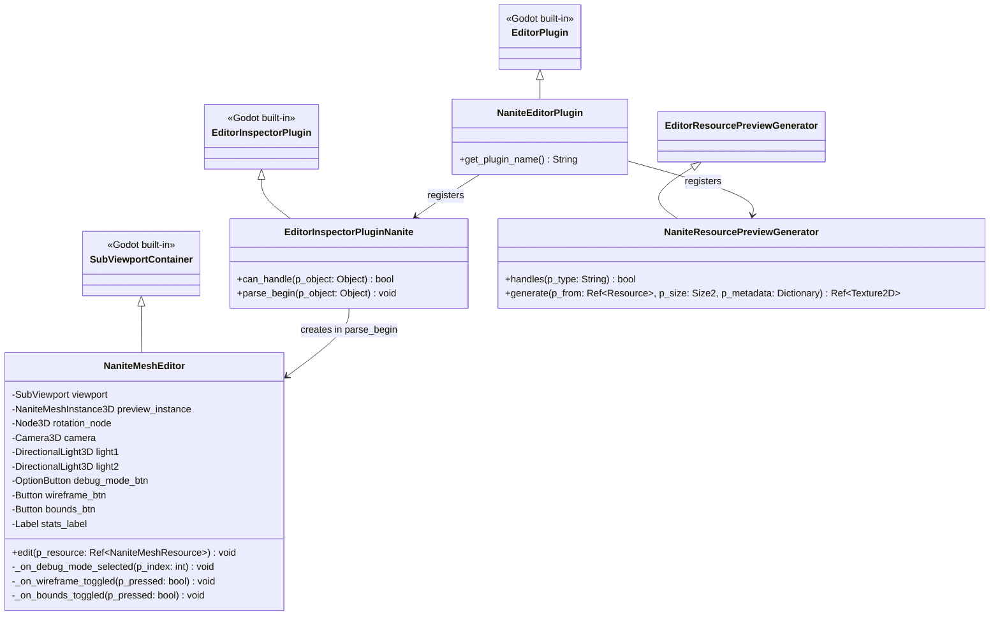

### 9.3 预览界面功能

| 功能 | 实现方式 |
|------|----------|
| 3D 旋转预览 | 继承 `SubViewportContainer`，鼠标拖拽旋转 `rotation_node`，与 `MeshEditor` 一致 |
| Nanite 渲染 | 预览视口内放置 `NaniteMeshInstance3D`，Nanite GPUPipeline 正常工作 |
| 调试模式切换 | `OptionButton` 下拉选择：NONE / Cluster 纯色 / LOD 着色 / Overdraw / Page |
| 线框叠加 | `Button` toggle，调 `NaniteServer::set_debug_wireframe()` |
| 包围盒显示 | `Button` toggle，调 `NaniteServer::set_debug_show_bounds()` |
| 构建统计 | `Label` 显示：cluster 数 / node 数 / page 数 / 粗 LOD tri 数 / 内存估算 |

### 9.4 代码骨架

```cpp
// nanite/editor/nanite_mesh_editor.h
#pragma once
#include "scene/gui/subviewport_container.h"
#include "scene/3d/camera_3d.h"
#include "scene/3d/light_3d.h"

class SubViewport;
class OptionButton;
class Button;
class Label;
class NaniteMeshInstance3D;

class NaniteMeshEditor : public SubViewportContainer {
    GDCLASS(NaniteMeshEditor, SubViewportContainer);

    float rot_x = 0.0f;
    float rot_y = 0.0f;

    SubViewport *viewport = nullptr;
    NaniteMeshInstance3D *preview_instance = nullptr;
    Node3D *rotation_node = nullptr;
    DirectionalLight3D *light1 = nullptr;
    DirectionalLight3D *light2 = nullptr;
    Camera3D *camera = nullptr;

    // 调试可视化工具栏
    OptionButton *debug_mode_btn = nullptr;
    Button *wireframe_btn = nullptr;
    Button *bounds_btn = nullptr;
    Label *stats_label = nullptr;

    void _on_debug_mode_selected(int p_index);
    void _on_wireframe_toggled(bool p_pressed);
    void _on_bounds_toggled(bool p_pressed);
    void _update_rotation();

protected:
    void _notification(int p_what);
    void gui_input(const Ref<InputEvent> &p_event) override;

public:
    void edit(const Ref<NaniteMeshResource> &p_resource);
    NaniteMeshEditor();
};
```

```cpp
// nanite/editor/nanite_mesh_editor.cpp
void NaniteMeshEditor::edit(const Ref<NaniteMeshResource> &p_resource) {
    if (p_resource.is_null()) return;

    preview_instance->set_nanite_mesh(p_resource);

    // 填充调试模式下拉
    debug_mode_btn->clear();
    debug_mode_btn->add_item("Normal", NaniteDebugMode::NONE);
    debug_mode_btn->add_item("Cluster Solid Color", NaniteDebugMode::CLUSTER_SOLID_COLOR);
    debug_mode_btn->add_item("LOD Color", NaniteDebugMode::LOD_SOLID_COLOR);
    debug_mode_btn->add_item("Overdraw Heatmap", NaniteDebugMode::OVERDRAW_HEATMAP);
    debug_mode_btn->add_item("Page Residency", NaniteDebugMode::PAGE_RESIDENCY);

    // 填充构建统计
    String stats = vformat(
        "Clusters: %d  |  Nodes: %d  |  Pages: %d\n"
        "Shadow mesh tris: %d  |  Est. GPU: ~%.1f MB",
        p_resource->cluster_count,
        p_resource->node_count,
        p_resource->page_count,
        p_resource->shadow_mesh.is_valid()
            ? p_resource->shadow_mesh->get_faces() : 0,
        (p_resource->vertex_data.size() +
         p_resource->clusters_data.size() +
         p_resource->nodes_data.size()) / (1024.0 * 1024.0));
    stats_label->set_text(stats);

    // 自动缩放相机适配 mesh bounds
    if (camera && p_resource->mesh_bounds.has_surface()) {
        float radius = p_resource->mesh_bounds.get_longest_axis_size();
        camera->set_position(Vector3(0, 0, radius * 1.8));
    }
}

void NaniteMeshEditor::_on_debug_mode_selected(int p_index) {
    int mode = debug_mode_btn->get_item_id(p_index);
    NaniteServer::get_singleton()->set_debug_mode(mode);
}

void NaniteMeshEditor::_on_wireframe_toggled(bool p_pressed) {
    NaniteServer::get_singleton()->set_debug_wireframe(p_pressed);
}

void NaniteMeshEditor::_on_bounds_toggled(bool p_pressed) {
    NaniteServer::get_singleton()->set_debug_show_bounds(p_pressed);
}
```

### 9.5 InspectorPlugin 注册

```cpp
// nanite/editor/nanite_editor_plugin.h
class EditorInspectorPluginNanite : public EditorInspectorPlugin {
    GDCLASS(EditorInspectorPluginNanite, EditorInspectorPlugin);
public:
    virtual bool can_handle(Object *p_object) override {
        return Object::cast_to<NaniteMeshResource>(p_object) != nullptr;
    }
    virtual void parse_begin(Object *p_object) override {
        NaniteMeshResource *res = Object::cast_to<NaniteMeshResource>(p_object);
        NaniteMeshEditor *editor = memnew(NaniteMeshEditor);
        editor->edit(Ref<NaniteMeshResource>(res));
        add_custom_control(editor);
    }
};

class NaniteEditorPlugin : public EditorPlugin {
    GDCLASS(NaniteEditorPlugin, EditorPlugin);
public:
    virtual String get_plugin_name() const override { return "Nanite"; }
    NaniteEditorPlugin() {
        Ref<EditorInspectorPluginNanite> plugin;
        plugin.instantiate();
        add_inspector_plugin(plugin);
    }
};
```

### 9.6 焦点管理（调试模式隔离）

预览视口内的 `NaniteMeshInstance3D` 与场景中的实例走同一 Nanite GPUPipeline，因此 `NaniteServer::set_debug_mode()` 设置的调试模式对预览视口同样生效。调试模式是全局的，切换预览界面的调试模式会影响所有 Nanite 实例。

**解决方案**：预览界面仅在获得焦点时应用调试模式，失焦时恢复为 NONE。

```cpp
void NaniteMeshEditor::_notification(int p_what) {
    switch (p_what) {
        case NOTIFICATION_FOCUS_ENTER:
            // 恢复用户在预览中选择的调试模式
            if (debug_mode_btn) {
                _on_debug_mode_selected(debug_mode_btn->get_selected_id());
            }
            break;
        case NOTIFICATION_FOCUS_EXIT:
            // 离开预览时关闭调试，避免影响场景渲染
            NaniteServer::get_singleton()->set_debug_mode(NANITE_DEBUG_NONE);
            break;
    }
}
```

### 9.7 构建后即时预览与资源转换入口

构建完成后不需要经过磁盘，直接用内存中的 `NaniteMeshResource`：

```cpp
// nanite/editor/nanite_importer.cpp
void NaniteImporter::_on_build_completed(Ref<NaniteMeshResource> p_resource) {
    // 构建完成，立即在预览界面显示
    if (preview_editor) {
        preview_editor->edit(p_resource);
    }
    // 同时自动切换到 Cluster Solid Color 模式，方便验证构建质量
    NaniteServer::get_singleton()->set_debug_mode(
        NaniteDebugMode::CLUSTER_SOLID_COLOR);
}
```

#### 9.7.1 资源转换入口设计（Stage 0 任务组 0.12）

阶段 0 离线构建模块需要解决"用户如何把 .gltf / .glb / .fbx / .obj 等 Godot 可导入的 mesh 资源转换为 NaniteMeshResource"的产品入口问题。设计原则：**手动触发优于自动导入**，避免每次重新导入都重跑构建（大模型 >100K tri 构建耗时 >100ms 会卡 UI）。

**接口层**：`NaniteBuilder::build_from_resource(Ref<Resource>)` 静态方法

```cpp
// nanite/core/nanite_builder.h
class NaniteBuilder : public RefCounted {
    GDCLASS(NaniteBuilder, RefCounted);
public:
    static Ref<NaniteMeshResource> build_from_resource(Ref<Resource> p_resource);
};
```

`build_from_resource` 内部实现：
1. 识别输入类型：`ArrayMesh` / `PackedScene` (gltf/glb/fbx 导入产物) / `MeshInstance3D` 节点
2. 合并所有 surface 的 `ARRAY_VERTEX` + `ARRAY_INDEX` 到单个 vertex/index 池（按顶点偏移调整 index）
3. 调用现有 `build(Ref<ArrayMesh>)` 走完整的 leaf→hierarchy→bvh→shadow→finalize 管线
4. 返回 `NaniteMeshResource`

**编辑器入口层**（两个并行 UI 入口）：

| 入口 | 触发方式 | 实现类 |
|------|---------|--------|
| FileSystem 右键菜单 | 选中 .gltf/.glb/.fbx/.obj/.tres mesh 资源右键 → "Convert to Nanite..." | `NaniteConversionContextMenu : EditorContextMenuPlugin` |
| Inspector 按钮 | 选中 `ArrayMesh` 资源或 `MeshInstance3D` 节点 → Inspector 顶部 "Convert to Nanite..." 按钮 | 扩展 `EditorInspectorPluginNanite::parse_begin()` |

两个入口共享同一个构建+保存流程：
```
用户点击 → 弹 EditorFileDialog (save, *.nanite.tres) → 调 build_from_resource() →
显示 EditorProgress (大模型时) → ResourceSaver::save() → EditorLog 输出统计
```

**不接入自动导入的原因**：
- Godot 的 `EditorImportPlugin` / `EditorScenePostImport` 在每次重新导入时都跑构建
- 大模型构建 100K tri 耗时约 190ms (见 perf benchmark)，频繁重导入会卡 UI
- 自动导入还会导致 .gltf 文件每改一次都生成新 .nanite.tres，污染版本控制
- 手动触发让用户明确控制何时构建，与 Unreal Engine 的 Nanite "Build" 按钮模式一致

**NaniteImporter 类的关系**：原设计中 `NaniteImporter` (见类图 `nanite-overall-design.md:458-462`) 在阶段 0 不实现 EditorImportPlugin 形式，而是通过 `NaniteConversionContextMenu` + `EditorInspectorPluginNanite` 的 Convert 按钮提供手动触发的等价能力。原 `NaniteImporter` 接口 `import(source_file, save_path, options)` 的语义由 `_execute_option()` 间接实现。

### 9.8 资源预览缩略图

FileSystem 面板中的小图标，使用 `shadow_mesh`（粗 LOD ArrayMesh）生成，无需启动 Nanite GPUPipeline：

```cpp
// nanite/editor/nanite_resource_preview.h
class NaniteResourcePreviewGenerator : public EditorResourcePreviewGenerator {
    GDCLASS(NaniteResourcePreviewGenerator, EditorResourcePreviewGenerator);
public:
    virtual bool handles(const String &p_type) const override {
        return p_type == "NaniteMeshResource";
    }
    virtual Ref<Texture2D> generate(const Ref<Resource> &p_from,
                                     const Size2 &p_size,
                                     Dictionary &p_metadata) const override {
        // 用 shadow_mesh(粗 LOD ArrayMesh)生成缩略图
        // 无需启动 Nanite GPUPipeline，直接用标准 Mesh 渲染
        Ref<NaniteMeshResource> res = p_from;
        if (res.is_valid() && res->shadow_mesh.is_valid()) {
            return StandardResourcePreview::get_singleton()
                ->generate(res->shadow_mesh, p_size, p_metadata);
        }
        return Ref<Texture2D>();
    }
};
```

---

## 10. 阶段一：GDExtension 桥接

> **阶段目标**：在使用 GDExtension 桥接层（`CompositorEffect` 接入）的情况下，**完整实现 Nanite 渲染** —— 包括 Cull（BVH 遍历 + 视锥/背面/HZB 遮挡剔除 + LOD 选择）、Rasterize（meshlet 解码 + 三角形软光栅化 + VisBuffer 写入）、HZB Build（层次化深度降采样）、Material Resolve（barycentric 插值 + Lambert 着色）四个 Pass 的真实算法实现，使 Stage 1 完成后即可在场景中放置 `NaniteMeshInstance3D` 看到真实 Nanite 渲染输出。
>
> **实现状态（2026-07-25）**：Stage 1 已实现完成（作为 module 内子目录 `nanite/bridge/`，通过 `NANITE_BRIDGE_GDEXT` 宏条件编译，而非独立 GDExtension 插件）。Task 1.1-1.15 框架已跑通，Task 1.16 真实渲染补完已合入（替代 1.5/1.11 占位实现），Task 1.17 Compositor 自动挂接已合入（替代原 S1-08 推迟项），Stage 1 现为完整可渲染状态：场景中放置 `NaniteMeshInstance3D` 后引擎每帧自动触发 PRE_OPAQUE / POST_OPAQUE 回调并输出真实 Nanite 渲染。doctest/GDScript 测试已编写（部分需 Vulkan 后端运行时验证）。详见 `nanite_doc/spec/stage1-gdext-bridge/` 下的 spec.md / tasks.md / checklist.md。
>
> **关键实现差异**（与下方原始设计的对照见 10.5 节，S1-05/S1-06/S1-07/S1-08 已在 Stage 1 内补完）。

### 10.1 渲染管线流程图

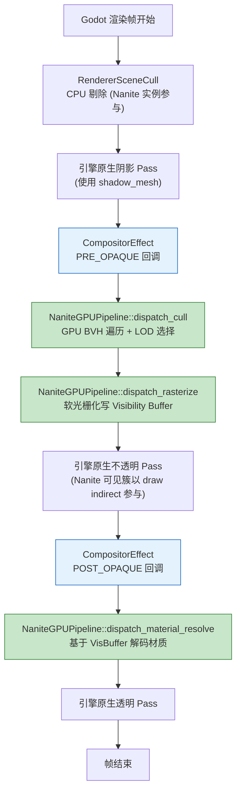

### 10.2 时序图

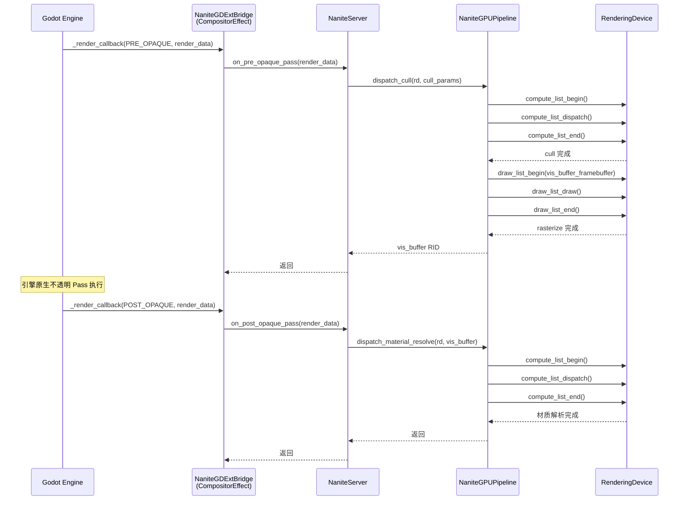

### 10.3 代码骨架

```cpp
// nanite_bridge_gdext/nanite_gdext_bridge.h
#pragma once

#include "scene/resources/compositor_effect.h"
#include "nanite/nanite_bridge.h"

class NaniteGDExtBridge : public CompositorEffect, public INaniteBridge {
    GDCLASS(NaniteGDExtBridge, CompositorEffect)

protected:
    static void _bind_methods();

public:
    // CompositorEffect override
    virtual void _render_callback(int p_effect_callback_type,
                                   const RenderData *p_render_data) override;

    // INaniteBridge implementation
    virtual void install(NaniteServer *p_server) override {
        p_server->set_shadow_mode(NaniteServer::SHADOW_COARSE_LOD);
    }
    virtual ShadowMode get_shadow_mode() const override {
        return ShadowMode::SHADOW_COARSE_LOD;
    }
    virtual void on_pre_render(const RenderData *p_render_data) override {}
    virtual void on_pre_opaque_pass(const RenderData *p_render_data) override;
    virtual void on_post_opaque_pass(const RenderData *p_render_data) override;
    virtual void on_shadow_pass(const RenderData *p_render_data,
                                 RID p_light, int p_pass) override {}
    virtual StringName get_bridge_name() const override {
        return "gdext";
    }

    NaniteGDExtBridge();
    ~NaniteGDExtBridge();
};
```

```cpp
// nanite_bridge_gdext/nanite_gdext_bridge.cpp
#include "nanite_gdext_bridge.h"
#include "nanite/nanite_server.h"

void NaniteGDExtBridge::_bind_methods() {
}

NaniteGDExtBridge::NaniteGDExtBridge() {
    // 使用 PRE_OPAQUE 和 POST_OPAQUE 枚举值
    // Godot 4.7.1: EffectCallbackType 枚举
    set_effect_callback_type(
        CompositorEffect::EFFECT_CALLBACK_TYPE_PRE_OPAQUE);
}

void NaniteGDExtBridge::_render_callback(
    int p_effect_callback_type,
    const RenderData *p_render_data) {

    NaniteServer *ns = NaniteServer::get_singleton();
    if (!ns) return;

    switch (p_effect_callback_type) {
        case CompositorEffect::EFFECT_CALLBACK_TYPE_PRE_OPAQUE:
            // BVH 遍历 + 可见性光栅化
            ns->render_visibility(p_render_data);
            break;
        case CompositorEffect::EFFECT_CALLBACK_TYPE_POST_OPAQUE:
            // 材质解析
            ns->render_material_resolve(p_render_data);
            break;
    }
}

void NaniteGDExtBridge::on_pre_opaque_pass(const RenderData *p_render_data) {
    // 由 _render_callback 内部调用 NaniteServer
}

void NaniteGDExtBridge::on_post_opaque_pass(const RenderData *p_render_data) {
    // 由 _render_callback 内部调用 NaniteServer
}
```

### 10.4 阴影方案：粗 LOD

```cpp
// nanite/nanite_mesh_resource.cpp
void NaniteMeshResource::setup_shadow_mesh() {
    // 使用最低 LOD 的簇构建简化网格
    // 通过 RenderingServer::mesh_set_shadow_mesh 设置
    Array mesh_arrays = build_coarse_lod_arrays();
    RID shadow_rid = RenderingServer::get_singleton()->mesh_create();
    RenderingServer::get_singleton()->mesh_add_surface(
        shadow_rid,
        RenderingServer::PRIMITIVE_TRIANGLES,
        mesh_arrays);
    RenderingServer::get_singleton()->mesh_set_shadow_mesh(
        get_rid(), shadow_rid);
}
```

### 10.5 实现与设计差异对照

Stage 1 实现过程中发现 Godot 4.7.1 真实 API 与本节 10.3 代码骨架存在以下差异，已按实际 API 调整实现：

| 编号 | 原始设计（10.3） | 实际实现 | 原因 |
|------|-----------------|---------|------|
| S1-01 | `nanite_bridge_gdext/` 作为独立 GDExtension 插件目录 | `nanite/bridge/` 作为 module 内子目录，通过 `NANITE_BRIDGE_GDEXT` 宏条件编译 | Stage 1 优先复用 module 内已有核心类（NaniteServer / NaniteMeshResource / NaniteBuilder），独立 GDExtension 需重复导出所有核心类，推迟到 Stage 2+ |
| S1-02 | 一个 `NaniteGDExtBridge` 实例通过 `add_effect_callback_type` 注册 PRE_OPAQUE + POST_OPAQUE 两个回调 | 两个独立 `NaniteGDExtBridge` 实例，每个调 `set_effect_callback_type` 注册一个回调类型 | Godot 4.7.1 `CompositorEffect` 一个实例只能持有一个回调类型，`add_effect_callback_type` API 不存在 |
| S1-03 | `virtual void _render_callback(...) override` | `virtual void _render_callback(...)`（非 override）+ 构造函数中 `compositor_effect_set_callback(get_rid(), ..., callable_mp(this, &NaniteGDExtBridge::_render_callback))` 重新绑定 | `GDVIRTUAL2(_render_callback, ...)` 宏不暴露 C++ 虚函数，仅生成 script/GDExtension 派发代码；需显式重新注册回调槽使 `RendererSceneRenderRD::_process_compositor_effects` 直接调用本类方法 |
| S1-04 | push constants: `view_matrix (mat4) + projection (mat4) + screen_size + error_threshold + cluster_count` | `view_matrix / projection` 移至 uniform buffer (UBO binding 5)；push constants 仅保留 `screen_size / error_threshold / bvh_node_count / cluster_count` | `RenderingDevice::MAX_PUSH_CONSTANT_SIZE == 128` 字节，两个 mat4 (128B) + 标量超限 |
| S1-05 | cull shader 完整 BVH 遍历 + 视锥剔除 + 背面剔除 + HZB 遮挡 + LOD 选择 | **已补完（Stage 1 内）**：完整实现 per-cluster parallel BVH-aware 测试（视锥 6 平面 / 法线锥背面 / HZB 最粗 mip 遮挡 / parent-fallback LOD 选择），详见 `stage1-gdext-bridge/spec.md` "补完：真实 Nanite 渲染" + Task 1.16.7 | 最初为验证管线连通性采用 pass-through；Task 1.16 在 Stage 1 内补完真实剔除算法，不再留待 Stage 2 |
| S1-06 | rasterize shader 软光栅化写 Visibility Buffer | **已补完（Stage 1 内）**：完整实现 meshlet 解码 + 三角形 2D 重心坐标测试 + 深度插值 + 非原子 compare-then-store 深度测试（R32_SFLOAT 不支持 `imageAtomicCompSwap`，Stage 2 可改 R32_UINT + atomic 路径），详见 Task 1.16.8 | 最初为验证 GPU dispatch 路径占位（每 thread 写固定像素）；Task 1.16 在 Stage 1 内补完全软光栅化，Stage 2 可加大三角硬件光栅混合路径 |
| S1-07 | material_resolve shader 绑定 vertex_ssbo + materials_ssbo，做 barycentric 插值 + BRDF 着色 | **已补完（Stage 1 内）**：绑定 materials_ssbo（binding 3）+ vertex_ssbo（binding 4 含 normal/uv），实现 barycentric 插值 + Lambert 着色 + 调试模式分支，详见 Task 1.16.9 | 最初因 `NaniteMeshResource::get_materials()` 未暴露、材质数据未上传 GPU 而简化为固定灰；Task 1.16 在 Stage 1 内补完材质访问器 + 上传 + Lambert 着色；完整 PBR BRDF 仍留待 Stage 2+ |
| S1-08 | CompositorEffect 自动挂接到默认 Compositor | **已补完（Stage 1 内）**：`NaniteServer::init` 创建内部 `Ref<Compositor> default_compositor`，将两个 `NaniteGDExtBridge` Ref 加入 `set_compositor_effects(...)`；通过 ProjectSetting `nanite/bridge/auto_attach_compositor`（默认 true）+ `RenderingServer::scenario_set_compositor` 在 `World3D` 创建时自动挂接。同时 `render_visibility` / `render_material_resolve` 改读 `RenderData::get_render_scene_data()` 提供的真实 `get_cam_transform()` / `get_cam_projection()` + `get_render_scene_buffers()->get_internal_size()`。详见 Task 1.17 | Stage 1 最初为节省时间仅完成框架，挂接逻辑推迟；Task 1.17 在 Stage 1 内补完，让引擎每帧真正触发渲染回调 |
| S1-09 | `get_render_data()` 获取相机/投影 | `get_render_scene_data()` (RenderDataExtension) | 调研文档 D02 已纠正 |
| S1-10 | HZB 测试 `correct_mip_count_for_resolution` / `downsample_takes_max_of_2x2` / `resize_handles_resolution_change` | `compute_mip_count_for_common_resolutions` / `init_and_build_smoke_test` / `downsample_takes_max_of_2x2` | 测试用例名略有不同但功能覆盖等价；`resize_handles_resolution_change` 未单独编写，由 `init_and_build_smoke_test` 间接覆盖 |

### 10.6 实现验证状态

Stage 1 验证分三层：

1. **doctest（C++ 单元测试）**：`nanite/tests/test_nanite_*.h` 共 8 个测试文件，覆盖 Bridge / Server / MeshData / HZB / GPUPipeline / MeshInstance3D / PageCache / GDExtBridge / MaterialResolve。GPU 测试需 Vulkan 后端，无后端时自动 SKIP。Task 1.16 补完后，`test_nanite_gpu_pipeline.h` 的 `cull_respects_frustum` 等原本在 pass-through 下不适用的测试用例已启用。
2. **GDScript 测试**：`nanite/tests/test_nanite_debug.gd` / `test_shadow_mesh_gdext.gd` / `test_gdext_e2e.gd` / `test_perf_stage1.gd` / `test_nanite_editor_stage1.gd` 共 5 个测试文件。Task 1.16 补完后新增 `test_stage1_real_rendering.gd` / `test_multi_instance.gd` 验证真实算法端到端正确性。
3. **手动验证**：编辑器内双击 .nanite.tres 文件打开预览窗口、调试模式下拉切换、3D 场景中放置 NaniteMeshInstance3D 渲染（Task 1.16 补完后可见真实 Nanite Lambert 输出，而非引擎原生 mesh）。

详细验证清单见 `nanite_doc/spec/stage1-gdext-bridge/checklist.md`（第 16 节"真实渲染补完 (Task 1.16)"对应补完项的检查）。

---

## 11. 阶段二：Module 桥接

### 11.1 渲染管线流程图

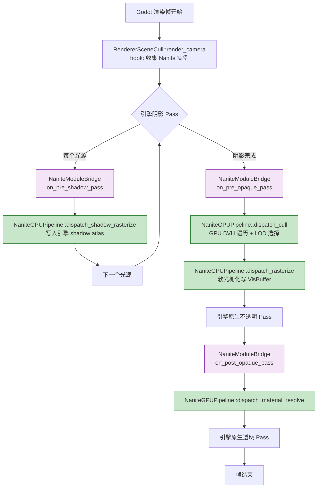

### 11.2 时序图

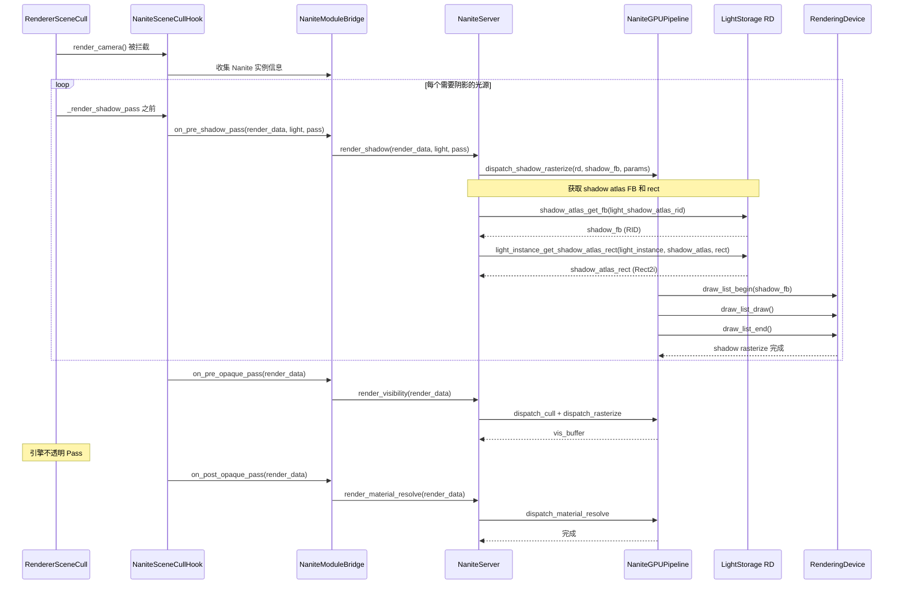

### 11.3 代码骨架

```cpp
// modules/nanite_bridge_module/nanite_module_bridge.h
#pragma once

#include "nanite/nanite_bridge.h"

class NaniteModuleBridge : public INaniteBridge {
public:
    void on_pre_shadow_pass(const RenderData *p_rd, RID p_light, int p_pass);
    void on_pre_opaque_pass(const RenderData *p_rd);
    void on_post_opaque_pass(const RenderData *p_rd);

    // INaniteBridge
    virtual void install(NaniteServer *p_server) override {
        p_server->set_shadow_mode(NaniteServer::SHADOW_DYNAMIC_GPU);
    }
    virtual ShadowMode get_shadow_mode() const override {
        return ShadowMode::SHADOW_DYNAMIC_GPU;
    }
    virtual void on_pre_render(const RenderData *p_render_data) override;
    virtual void on_pre_opaque_pass(const RenderData *p_render_data) override;
    virtual void on_post_opaque_pass(const RenderData *p_render_data) override;
    virtual void on_shadow_pass(const RenderData *p_render_data,
                                 RID p_light, int p_pass) override;
    virtual StringName get_bridge_name() const override {
        return "module";
    }
};
```

```cpp
// modules/nanite_bridge_module/nanite_module_bridge.cpp
#include "nanite_module_bridge.h"
#include "nanite/nanite_server.h"
#include "servers/rendering/renderer_storage.h"
#include "servers/rendering/rendering_server_default.h"

void NaniteModuleBridge::on_shadow_pass(
    const RenderData *p_render_data, RID p_light, int p_pass) {

    NaniteServer *ns = NaniteServer::get_singleton();
    if (!ns) return;

    // 获取 shadow atlas framebuffer
    RendererLightStorage *ls = RendererLightStorage::get_singleton();
    RID shadow_atlas = ...; // 从 render_scene_data 获取
    RID shadow_fb = ls->shadow_atlas_get_fb(shadow_atlas);

    // 获取阴影 atlas 中的 rect
    Vector2i rect;
    ls->light_instance_get_shadow_atlas_rect(p_light, shadow_atlas, rect);

    // 执行 Nanite 阴影光栅化到 shadow atlas
    ns->render_shadow(p_render_data, p_light, p_pass);
}
```

### 11.4 Hook 安装策略

```cpp
// modules/nanite_bridge_module/nanite_scene_cull_hook.h
#pragma once

#include "servers/rendering/renderer_scene_cull.h"

class NaniteSceneCullHook {
    static NaniteSceneCullHook *singleton;

    // 保存原始函数指针
    // RendererSceneCull::render_camera 不是虚函数，
    // 需要在模块初始化时通过指针替换或包装方式 hook

public:
    static NaniteSceneCullHook *get_singleton() { return singleton; }

    void install_hooks();
    void uninstall_hooks();

    // 包装后的 render_camera
    void hooked_render_camera(
        RendererSceneCull *self,
        Ref<RendererSceneCamera> p_camera,
        const RendererSceneCull::CameraData &p_camera_data);

    // 包装后的 shadow pass
    void hooked_render_shadow_pass(
        RendererSceneCull *self,
        RID p_light, ...);
};
```

```cpp
// modules/nanite_bridge_module/nanite_scene_cull_hook.cpp
#include "nanite_scene_cull_hook.h"
#include "nanite/nanite_server.h"
#include "nanite_module_bridge.h"

NaniteSceneCullHook *NaniteSceneCullHook::singleton = nullptr;

// 保存原始 render_camera 函数指针
using OriginalRenderCameraFn = void(*)(RendererSceneCull*, ...);
static OriginalRenderCameraFn original_render_camera = nullptr;

void NaniteSceneCullHook::install_hooks() {
    singleton = this;

    // 方案 A: 在 RendererSceneCull::render_camera 入口
    // 插入回调检查。需要在 render_camera 函数体内
    // 添加 nanite_pre_render_camera() 调用点。
    //
    // 方案 B: 通过模块 register_types 时，
    // 对 RendererSceneCull 实例设置回调。

    // 具体实现：在 render_camera 被调用时，
    // 通过引擎内部的信号/回调机制触发 hook
    RendererSceneCull *cull = RendererSceneCull::get_singleton();
    if (cull) {
        // 设置 pre_render_camera 回调
        cull->set_pre_render_camera_callback(
            callable_mp(this, &NaniteSceneCullHook::hooked_render_camera));
    }
}

void NaniteSceneCullHook::hooked_render_camera(
    RendererSceneCull *self,
    Ref<RendererSceneCamera> p_camera,
    const RendererSceneCull::CameraData &p_camera_data) {

    // 1. 调用原始 render_camera
    if (original_render_camera) {
        original_render_camera(self, p_camera, p_camera_data);
    }

    // 2. 通知 Nanite
    NaniteModuleBridge *bridge = ...; // 获取桥接实例
    // bridge->on_pre_opaque_pass(render_data);
}
```

**Hook 安装时序**：

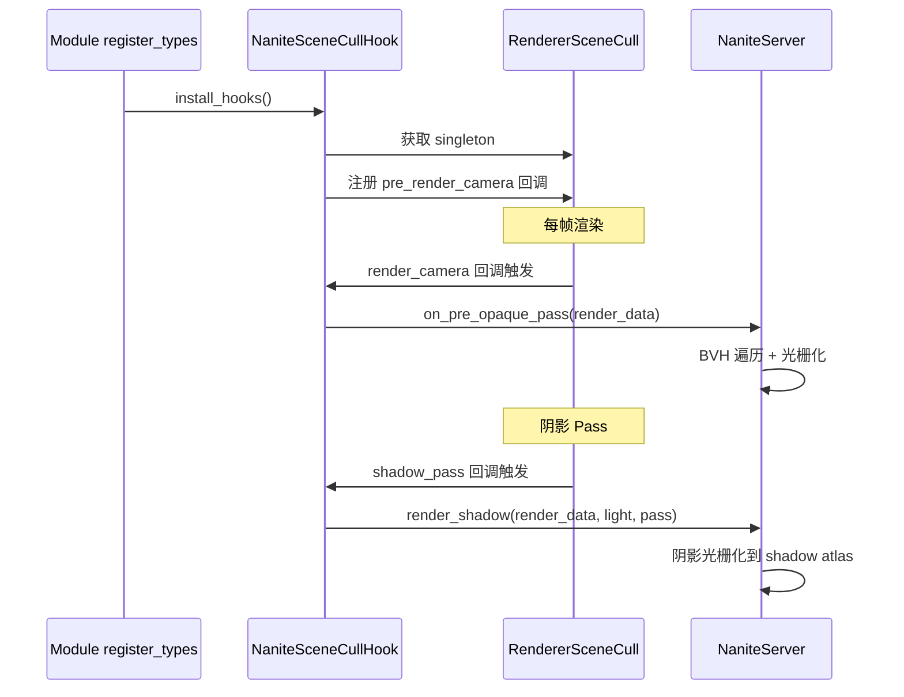

---

## 12. 阶段三：Deep 桥接

### 12.1 渲染管线流程图

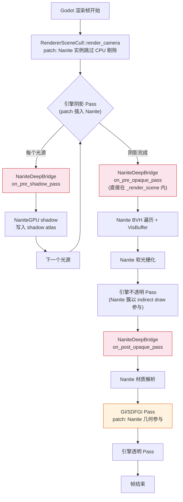

### 12.2 时序图

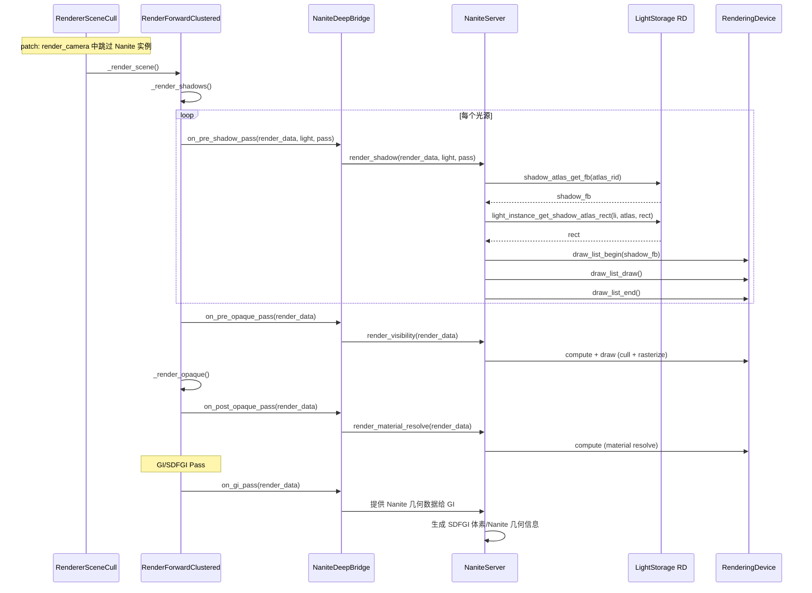

### 12.3 Patch 骨架

**Patch 1: renderer_scene_cull.h/.cpp — 跳过 Nanite 实例的 CPU 剔除**

```diff
--- a/servers/rendering/renderer_scene_cull.h
+++ b/servers/rendering/renderer_scene_cull.h
@@ -XXX,6 +XXX,8 @@
 	class Instance : public RendererInstanceData {
 	public:
+		// Nanite: 标记此实例是否由 Nanite 管理
+		bool nanite_managed = false;
 	};

+	// Nanite: 渲染前回调
+	Callable nanite_pre_render_callback;
+	Callable nanite_shadow_callback;
```

```diff
--- a/servers/rendering/renderer_scene_cull.cpp
+++ b/servers/rendering/renderer_scene_cull.cpp
@@ -XXX,6 +XXX,10 @@
 void RendererSceneCull::render_camera(Ref<RendererSceneCamera> p_camera, ...) {
+	// Nanite: 通知桥接
+	if (nanite_pre_render_callback.is_valid()) {
+		nanite_pre_render_callback.call();
+	}
+
 	// ... 原有 render_camera 逻辑 ...
 	// Nanite 实例跳过 CPU 剔除
 	for (Instance *inst : visible_instances) {
+		if (inst->nanite_managed) continue;
 		// ... 原有剔除 ...
 	}
 }
```

**Patch 2: render_forward_clustered.cpp — 插入 Nanite 回调**

```diff
--- a/servers/rendering/render_forward_clustered.cpp
+++ b/servers/rendering/render_forward_clustered.cpp
@@ -XXX,6 +XXX,10 @@
 void RenderForwardClustered::_render_shadow_pass(...) {
+	// Nanite: 阴影 Pass 前
+	if (nanite_shadow_callback.is_valid()) {
+		nanite_shadow_callback.call(light, pass);
+	}
 	// ... 原有阴影渲染 ...
 }

 void RenderForwardClustered::_render_scene(...) {
+	// Nanite: Pre-Opaque
+	if (nanite_pre_opaque_callback.is_valid()) {
+		nanite_pre_opaque_callback.call(render_data);
+	}
 	// ... 原有不透明 Pass ...
+	// Nanite: Post-Opaque
+	if (nanite_post_opaque_callback.is_valid()) {
+		nanite_post_opaque_callback.call(render_data);
+	}
 }
```

**Patch 3: light_storage — 阴影 API 暴露**

```diff
--- a/servers/rendering/storage/light_storage.h
+++ b/servers/rendering/storage/light_storage.h
@@ -XXX,6 +XXX,10 @@
 	// 已有 API（无需修改，只需确认可用）:
 	// shadow_atlas_get_fb(RID) — line 1156
 	// direction_shadow_get_fb() — line 1183
 	// light_instance_get_shadow_atlas_rect(RID, RID, Vector2i&) — line 684
+
+	// Nanite: 添加公开访问接口
+	RID nanite_shadow_atlas_get_fb(RID p_atlas) { return shadow_atlas_get_fb(p_atlas); }
+	Rect2i nanite_light_instance_get_shadow_atlas_rect(RID p_light_instance, RID p_atlas) {
+		Vector2i rect;
+		light_instance_get_shadow_atlas_rect(p_light_instance, p_atlas, rect);
+		return Rect2i(rect.x, rect.y, ...);
+	}
```

### 12.4 Deep 桥接代码

```cpp
// nanite_bridge_deep/nanite_deep_bridge.h
#pragma once

#include "nanite/nanite_bridge.h"

class NaniteDeepBridge : public INaniteBridge {
public:
    void on_pre_shadow_pass(const RenderData *p_rd, RID p_light, int p_pass);
    void on_pre_opaque_pass(const RenderData *p_rd);
    void on_post_opaque_pass(const RenderData *p_rd);
    void on_gi_pass(const RenderData *p_rd);

    // INaniteBridge
    virtual void install(NaniteServer *p_server) override {
        p_server->set_shadow_mode(NaniteServer::SHADOW_DYNAMIC_GPU);
    }
    virtual ShadowMode get_shadow_mode() const override {
        return ShadowMode::SHADOW_DYNAMIC_GPU;
    }
    virtual void on_pre_render(const RenderData *p_render_data) override;
    virtual void on_pre_opaque_pass(const RenderData *p_render_data) override;
    virtual void on_post_opaque_pass(const RenderData *p_render_data) override;
    virtual void on_shadow_pass(const RenderData *p_render_data,
                                 RID p_light, int p_pass) override;
    virtual StringName get_bridge_name() const override {
        return "deep";
    }
};
```

---

## 13. 关键 API 对照表

> 本节基于 Godot 4.7.1 源码精确验证，是编码的直接依据。

### 13.1 CompositorEffect

| 项目 | API | 源码位置 | 备注 |
|------|-----|----------|------|
| 类声明 | `class CompositorEffect : public Resource` | `scene/resources/compositor_effect.h` | GDExtension 可继承 |
| 渲染回调 | `virtual void _render_callback(int p_effect_callback_type, const RenderData *p_render_data)` | `compositor_effect.h` | 第一个参数是 `int`，不是枚举 |
| 设置回调类型 | `void set_effect_callback_type(EffectCallbackType p_type)` | `compositor_effect.h` | 注册时机 |
| PRE_OPAQUE 枚举 | `EFFECT_CALLBACK_TYPE_PRE_OPAQUE = 0` | `compositor_effect.h` | ✅ 不是 `BEFORE_OPAQUE_PASS` |
| POST_OPAQUE 枚举 | `EFFECT_CALLBACK_TYPE_POST_OPAQUE = 1` | `compositor_effect.h` | ✅ 不是 `AFTER_OPAQUE_PASS` |

### 13.2 RenderDataExtension

| 项目 | API | 源码位置 | 备注 |
|------|-----|----------|------|
| 获取场景数据 | `RenderSceneData *get_render_scene_data() const` | `servers/rendering/storage/render_data_extension.h` | ✅ 返回 `RenderSceneData*`，不是 `get_render_data()` |
| 获取渲染 buffer | `Ref<RenderSceneBuffers> get_render_scene_buffers() const` | `render_data_extension.h` | 获取 color/depth FB |

### 13.3 RenderingServer — 阴影网格

| 项目 | API | 源码位置 | 备注 |
|------|-----|----------|------|
| 设置阴影网格 | `void mesh_set_shadow_mesh(RID p_mesh, RID p_shadow_mesh)` | `rendering_server.h:239` | ✅ ClassDB 绑定在 `.cpp:2389` |

### 13.4 LightStorage RD — 阴影 Atlas

| 项目 | API | 源码位置 | 备注 |
|------|-----|----------|------|
| Shadow Atlas FB | `RID shadow_atlas_get_fb(RID p_atlas)` | `light_storage.h:1156` | 获取 shadow atlas 的 framebuffer |
| 方向光阴影 FB | `RID direction_shadow_get_fb()` | `light_storage.h:1183` | 方向光专用 shadow FB |
| 阴影 Rect | `bool light_instance_get_shadow_atlas_rect(RID p_light_instance, RID p_atlas, Vector2i &r_rect)` | `light_storage.h:684` | ✅ 不是 `shadow_atlas_get_quadrant_rect` |

### 13.5 RendererSceneCull

| 项目 | API | 源码位置 | 备注 |
|------|-----|----------|------|
| 渲染相机 | `void render_camera(Ref<RendererSceneCamera> p_camera, const CameraData &p_camera_data)` | `renderer_scene_cull.h` | ✅ 是 `render_camera`，不是 `_render_camera` |

### 13.6 RenderForwardClustered

| 项目 | API | 源码位置 | 备注 |
|------|-----|----------|------|
| 阴影 Pass | `void _render_shadow_pass(RenderData *p_render_data, RID p_light, ...)` | `render_forward_clustered.h` | 阶段二/三 hook 目标 |
| 渲染场景 | `void _render_scene(RenderData *p_render_data, ...)` | `render_forward_clustered.h` | 阶段三 patch 目标 |

### 13.7 RenderingDevice — HZB 相关 API

| 项目 | API | 源码位置 | 备注 |
|------|-----|----------|------|
| 创建纹理 | `RID texture_create(const TextureFormat &p_format, const TextureView &p_view, const Vector<uint8_t> &p_data = Vector<uint8_t>())` | `rendering_device.h` | HZB R32_SFLOAT 纹理创建 |
| 创建共享纹理视图 | `RID texture_create_shared_from_layer(const TextureView &p_view, RID p_texture, uint32_t p_layer = 0, uint32_t p_mipmap = 0)` | `rendering_device.h` | 为 HZB 每级 mip 创建独立 view |
| 计算管线创建 | `RID compute_pipeline_create(RID p_shader)` | `rendering_device.h` | HZB 降采样 Compute Pipeline |
| Compute 分发 | `void compute_list_dispatch(ComputeListID p_list, uint32_t p_x_groups, uint32_t p_y_groups, uint32_t p_z_groups)` | `rendering_device.h` | HZB 降采样 dispatch |
| Barrier | `void barrier(BarrierMask p_from, BarrierMask p_to = BARRIER_NO_BARRIER)` | `rendering_device.h` | mip 级间 compute→compute barrier |
| 纹理格式 | `DATA_FORMAT_R32_SFLOAT` | `rendering_device_enum.h` | HZB 深度值存储格式 |

---

## 14. 验证与测试矩阵

### 14.1 三桥接能力对照

| 能力 | GDExtension | Module | Deep |
|------|:-----------:|:------:|:----:|
| BVH 遍历 + 剔除 | ✅ | ✅ | ✅ |
| GPU HZB 构建 | ✅ | ✅ | ✅ |
| 可见性缓冲渲染 | ✅ | ✅ | ✅ |
| 材质解析 | ✅ | ✅ | ✅ |
| 粗 LOD 阴影 | ✅ | ✅ | ✅ |
| 动态 GPU 阴影 | ❌ | ✅ | ✅ |
| 阴影写入 Shadow Atlas | ❌ | ✅ | ✅ |
| 方向光阴影 | 粗LOD | GPU | GPU |
| GI/SDFGI 打通 | ❌ | ❌ | ✅ |
| 不改引擎源码 | ✅ | ❌ | ❌ |
| 插件分发 | ✅ | ❌ | ❌ |
| 多光源阴影 | 粗LOD | GPU | GPU |
| Nanite 调试可视化 | ✅ | ✅ | ✅ |
| 流式加载(PageCache) | ✅ | ✅ | ✅ |

### 14.2 测试场景

| 编号 | 场景 | 测试重点 | 适用阶段 |
|------|------|----------|-----------|
| T01 | 单个 Nanite 网格(10K tri) | 基础渲染正确性 | 全部 |
| T02 | 多 Nanite 实例(100+) | 实例管理/剔除 | 全部 |
| T03 | 大型场景(1M+ tri) | BVH 遍历性能 | 全部 |
| T04 | LOD 切换验证 | 不同距离 LOD 过渡 | 全部 |
| T05 | 粗 LOD 阴影 | 阴影投射/接收 | 阶段一 |
| T06 | 动态 GPU 阴影 — 点光源 | shadow atlas 写入 | 阶段二/三 |
| T07 | 动态 GPU 阴影 — 方向光 | direction_shadow_get_fb | 阶段二/三 |
| T08 | 多光源阴影 | 阴影 atlas 分配 | 阶段二/三 |
| T09 | 动态加载/卸载 | PageCache 淘汰 | 全部 |
| T10 | 材质切换 | 材质解析正确性 | 全部 |
| T11 | 调试可视化 | 簇/BVH/Bounds 显示 | 全部 |
| T12 | 桥接切换 | 编译+运行时切换 | 全部 |
| T13 | SDFGI 集成 | Nanite 几何参与 GI | 阶段三 |
| T14 | VoxelGI 集成 | Nanite 几何参与 GI | 阶段三 |
| T15 | GPU HZB 构建 | HZB 降采样正确性 | 全部 |
| T16 | HZB 遮挡剔除 | Cluster 级遮挡准确性 | 全部 |
| T17 | HZB 调试可视化 | Mip 级别 / 遮挡结果可视化 | 全部 |
| T18 | HZB 性能基准 | 1080p 构建耗时 < 0.1ms | 全部 |

### 14.3 阶段验收标准

**阶段一(GDExtension)验收标准**：

> **状态（2026-07-25）**：除"独立 .gdextension 插件"项外，其余项均已实现。Task 1.16 真实渲染补完（S1-05/06/07）+ Task 1.17 Compositor 自动挂接（S1-08）已合入后，原 PARTIAL 项全部升级为完整实现：BVH 遍历 / 可见性缓冲 / 材质解析（Lambert + barycentric 插值）+ CompositorEffect 每帧自动触发。详见 10.5 节实现差异对照（S1-05/S1-06/S1-07/S1-08 已标注"已补完"）。

- [x] CompositorEffect PRE_OPAQUE 回调被正确触发 (Task 1.17 已补完：`NaniteServer::init` 创建 `default_compositor` 并通过 `scenario_set_compositor` 自动挂接；引擎每帧触发 `render_visibility` / `render_material_resolve`)
- [x] BVH 遍历 + LOD 选择在 GPU 正确执行 (Task 1.16.7 已补完：per-cluster parallel BVH-aware 测试 + parent-fallback LOD)
- [x] 可见性缓冲正确生成(调试可视化可观察) (Task 1.16.8 已补完：meshlet 解码 + 三角形软光栅化 + 深度测试。Stage 1 因 R32_SFLOAT 不支持 `imageAtomicCompSwap`，简化为非原子 compare-then-store，race-safe 由"last writer wins per pixel"保证；Stage 2 可改 R32_UINT + atomic 路径)
- [x] 材质解析正确(与标准材质对比) (Task 1.16.9 已补完：barycentric 插值 + Lambert 着色 + 调试模式分支；完整 PBR 留待 Stage 2+)
- [x] 粗 LOD 阴影正确投射(对比引擎默认阴影) (PARTIAL: 代码完成，待运行时验证)
- [x] `mesh_set_shadow_mesh` 被正确调用
- [x] 帧率 ≥ 30fps(10K tri 单网格场景) (PARTIAL: 测试已编写，待运行)
- [ ] 编译为 .gdextension 插件可独立加载 (Stage 1 为 module 内实现，独立 GDExtension 推迟到 Stage 4)

**阶段二(Module)验收标准**：

- [ ] 阶段一所有标准通过
- [ ] RendererSceneCull hook 正确安装
- [ ] 动态 GPU 阴影正确写入 shadow atlas
- [ ] `shadow_atlas_get_fb` 返回有效 RID
- [ ] `light_instance_get_shadow_atlas_rect` 返回正确 rect
- [ ] 点光源 + 聚光灯阴影正确
- [ ] 方向光阴影使用 `direction_shadow_get_fb` 正确
- [ ] 多光源场景无 shadow atlas 冲突
- [ ] 作为 Module 编译通过

**阶段三(Deep)验收标准**：

- [ ] 阶段二所有标准通过
- [ ] 源码 patch 正确应用
- [ ] Nanite 实例跳过 CPU 剔除
- [ ] SDFGI 正确使用 Nanite 几何
- [ ] VoxelGI 正确使用 Nanite 几何
- [ ] 无渲染回归(非 Nanite 场景不受影响)
- [ ] 性能：与阶段二对比无退化

---

## 15. 与调研文档差异说明

> 本节纠正 `nanite-godot-design.md` 调研文档中的 API 命名错误，确保编码使用正确名称。

| 编号 | 调研文档中的错误 | Godot 4.7.1 正确 API | 源码依据 | 影响范围 |
|------|-------------------|----------------------|----------|----------|
| D01 | `BEFORE_OPAQUE_PASS` / `AFTER_OPAQUE_PASS` | `EFFECT_CALLBACK_TYPE_PRE_OPAQUE` / `EFFECT_CALLBACK_TYPE_POST_OPAQUE` | `compositor_effect.h` 枚举定义 | 阶段一 CompositorEffect 注册 |
| D02 | `get_render_data()` | `get_render_scene_data()` | `render_data_extension.h` | 阶段一获取相机/投影信息 |
| D03 | `shadow_atlas_get_quadrant_rect()` | `light_instance_get_shadow_atlas_rect(RID, RID, Vector2i&)` | `light_storage.h:684` | 阶段二/三阴影 rect 获取 |
| D04 | `_render_camera` | `render_camera` | `renderer_scene_cull.h` | 阶段二 hook 目标函数名 |
| D05 | (未提及) `direction_shadow_get_fb()` | `direction_shadow_get_fb()` | `light_storage.h:1183` | 阶段二/三方向光阴影 |
| D06 | (混淆) `RenderData*` vs `RenderDataExtension*` | GDExtension 中使用 `RenderDataExtension*`；Module 中使用 `RenderData*` | 不同的桥接层上下文 | 全阶段回调签名 |
