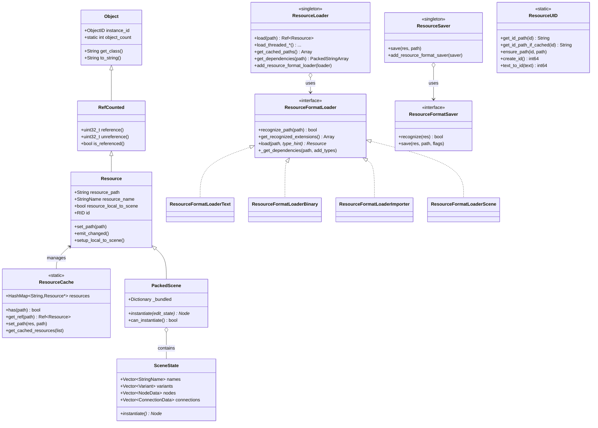
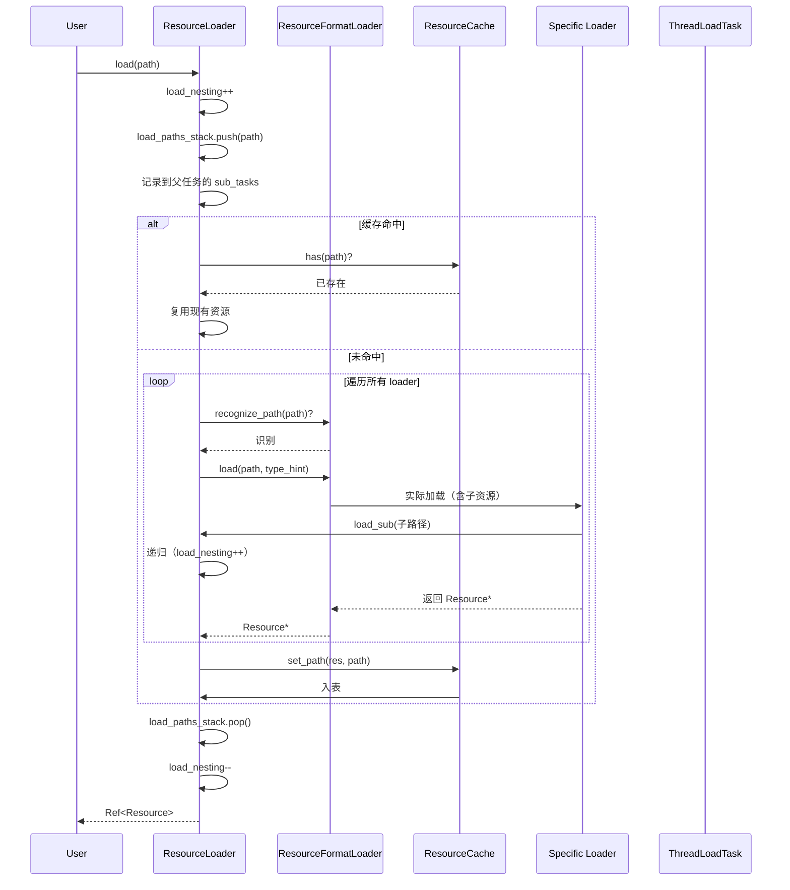
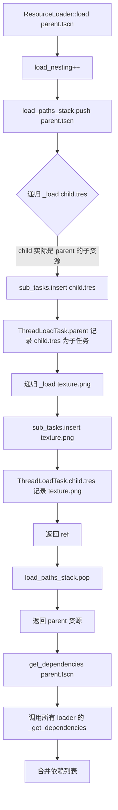
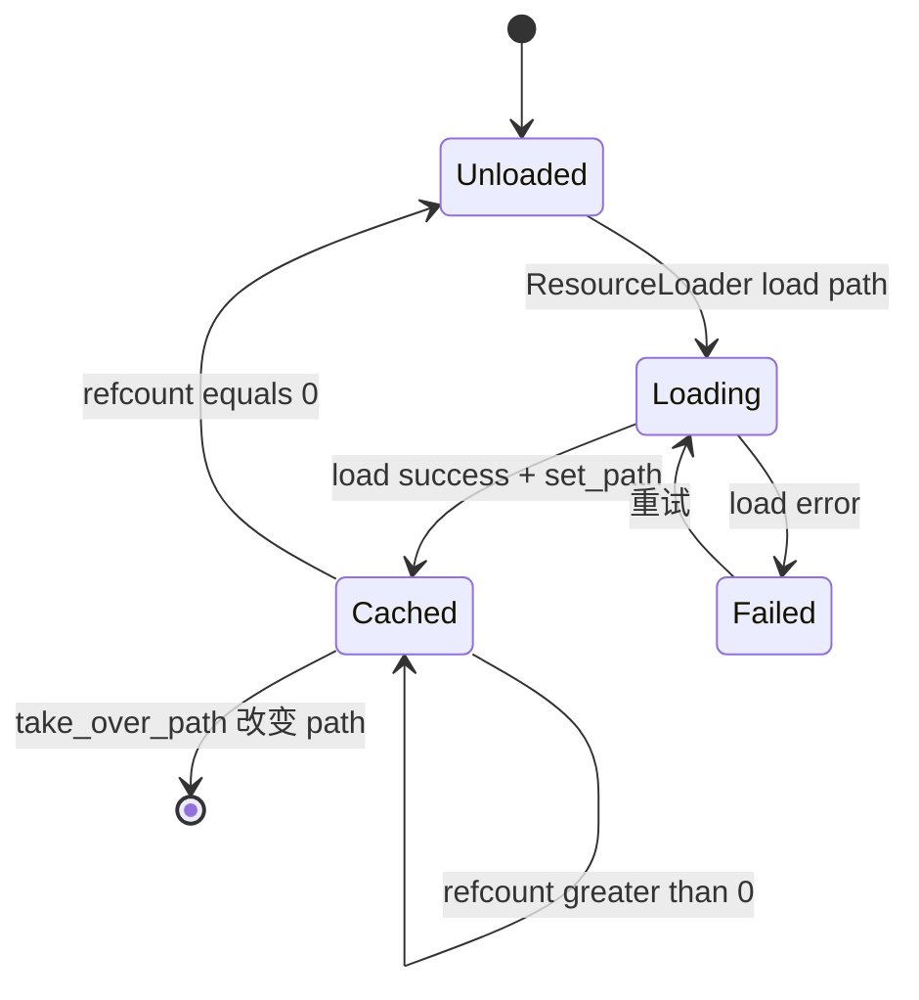
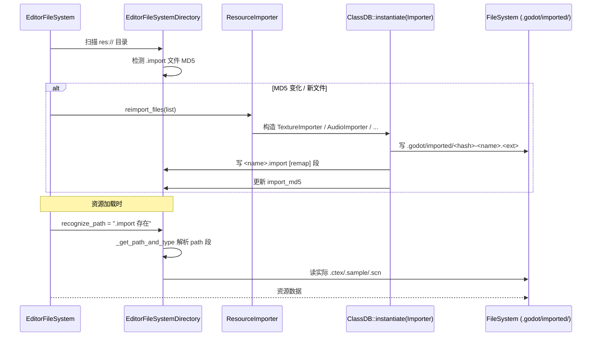
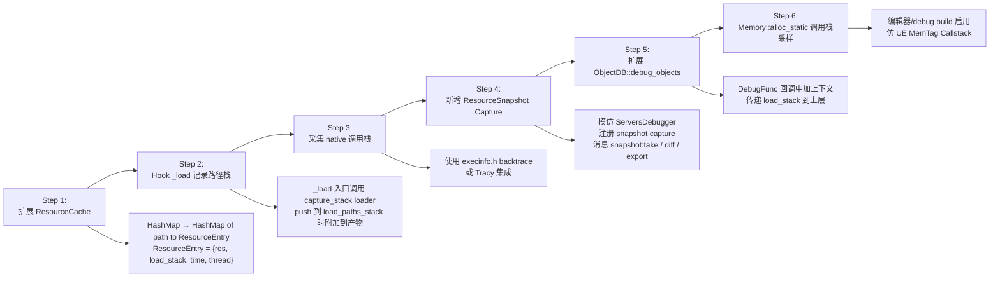

# Godot Engine 资源加载模块深度分析

## 1. 概述

Godot 的资源加载模块位于 `core/io/` 与 `scene/resources/`，围绕 **ResourceLoader 单例 + ResourceFormatLoader 插件 + ResourceCache 静态表** 三件套构成。它不依赖任何外部文件系统（PCK 直接挂载到 VFS），并通过 `EngineDebugger`/`ServersDebugger` 协议向编辑器暴露 GPU 资源使用情况。

本文涵盖：
1. 核心类与结构体
2. 资源组织（路径、UID、内置、PCK）
3. 加载/卸载流程与依赖管理
4. PIE 与包体运行的差异
5. 与 Unreal Engine 流式加载对比
6. 调试优化工具
7. 资源快照能力

## 2. 核心类与结构体

### 2.1 核心类层次

```
Object (core/object/)
└── RefCounted (core/object/)
    └── Resource (core/io/resource.h)
        ├── Texture (servers/rendering_server)
        │   └── Texture2D, Texture3D, Mesh...
        ├── AudioStream (scene/resources/)
        ├── PackedScene (scene/resources/packed_scene.h)
        ├── Script (core/object/script_language.h)
        ├── AnimationLibrary / StyleBox / Theme ...
        └── ...
```

### 2.2 核心类图



### 2.3 关键结构体

#### `ThreadLoadTask` (resource_loader.h)

```cpp
struct ThreadLoadTask {
    Thread thread;                          // 加载线程
    String path;                            // 资源原始路径
    String local_path;                      // 经重映射后的本地路径
    String type_hint;                       // 期望类型
    Ref<Resource> res;                      // 加载完成的资源
    Error error;                            // 加载错误码
    bool use_sub_threads;                   // 是否启用子线程
    bool user_progress;                     // 是否上报进度
    HashSet<String> sub_tasks;              // ★ 依赖的子路径集合
    float progress;                         // 子任务平均进度
    SafeFlags status;                       // 加载状态
};
```

#### `PathAndType` (resource_importer.h)

```cpp
struct PathAndType {
    String path;        // 实际加载路径（指向 .godot/imported/...）
    String type;        // 加载后的资源类
    String importer;    // 使用的导入器名
    String group_file;  // 资源所属组
    String metadata;    // 额外元数据
    int64_t uid = -1;   // UID
    bool valid = false; // 路径是否合法
};
```

#### `SceneState` (packed_scene.h)

```cpp
class SceneState : public RefCounted {
    Vector<StringName> names;            // 字符串池
    Vector<Variant> variants;            // 值池
    Vector<NodePath> node_paths;         // 跨场景边界 NodePath
    Vector<PackedInt32Array> id_paths;   // 唯一 ID 路径备份
    Vector<EditableInstances> editable_instances;
    mutable PackedInt32Array ids;        // 节点 unique_id
    Vector<NodeData> nodes;              // 节点列表
    Vector<ConnectionData> connections;  // 信号连接
    int base_scene_idx = -1;             // 继承自哪个父场景

    struct NodeData {
        int parent, owner, type, name, instance, index;
        Vector<Property> properties;
        Vector<int> groups;
    };
};
```

### 2.4 关键线程局部变量

```cpp
// resource_loader.h:213-217
static thread_local int     load_nesting;
static thread_local Vector<String> load_paths_stack;        // ★ 加载路径栈（"伪调用栈"）
static thread_local HashMap<int, HashMap<String, Ref<Resource>>> res_ref_overrides;
static thread_local ThreadLoadTask *curr_load_task;          // 当前线程任务
```

`load_paths_stack` 是 Godot 唯一"资源加载调用栈"的近似——记录递归加载时的路径链，配合 `ThreadLoadTask::sub_tasks` 构成依赖图。

## 3. 资源组织方式

### 3.1 路径系统

| 路径形式 | 含义 | 示例 |
|---------|------|------|
| `res://` | 项目根目录 | `res://scenes/level.tscn` |
| `user://` | 用户数据目录 | `user://savegame.dat` |
| `::/subres` | 内联子资源（`::` 前缀） | `res://scene.tscn::Script_xxx` |
| `local://` | 本地副本（local-to-scene 复制产生） | `local://Material_yyy` |
| `uid://` | 通过 UID 解析路径 | `uid://b3hv1ru8c6xs7` |

### 3.2 UID 系统

```cpp
// core/io/resource_uid.h
class ResourceUID {
    static String get_id_path(int64_t p_id, ...) const;
    static int64_t create_id();              // 生成 64 位唯一 ID
    static int64_t text_to_id(const String &p_text);
    static int64_t path_to_id(const String &p_path);
    static void ensure_path(int64_t p_id, const String &p_path);
};
```

UID → 路径映射存储在 `res://.godot/uid_cache.bin`（由编辑器生成）。这是 Godot 4.0+ 的特性，**解决资源移动/重命名后引用断链问题**（与 UE 的 FObjectGuid 类似）。

### 3.3 资源序列化格式

| 扩展名 | 格式 | 用途 |
|--------|------|------|
| `.tres` | 文本 | 人可读的 Resource 序列化 |
| `.res` | 二进制 | Resource 紧凑二进制 |
| `.tscn` | 文本 | PackedScene（节点树） |
| `.scn` | 二进制 | PackedScene 紧凑二进制 |
| `.import` | INI | 侧车元数据 |
| `.godot/imported/<hash>-<name>.<ext>` | 二进制/压缩 | 实际导入产物 |

### 3.4 `.import` 侧车文件示例

```ini
[remap]
importer="texture"
type="CompressedTexture2D"
uid="uid://b3hv1ru8c6xs7"
path="res://.godot/imported/icon.svg-77a55da3c9eb2a0c4d3a3a3a3a3a3a3.ctex"
path.s3tc="res://.godot/imported/icon.svg-77a55d....s3tc.ctex"
path.etc2="res://.godot/imported/icon.svg-77a55d....etc2.ctex"
metadata={ "has_editor_variant": false, "vram_texture": false }
valid=true

[deps]
files=["res://icon.svg"]

[params]
compress/mode=0
compress/high_quality=false
compress/lossy_quality=0.7
```

`.godot/imported/` 命名规则：
```
<imported_files_path>/<basename>-<md5_text_of_full_path>.<save_extension>
```

`path.<feature>` 是**平台后端变体**（如 S3TC/ETC2/BPTC 等不同 GPU 压缩格式），由 `OS::has_feature(feature)` 选择。

### 3.5 PCK 包体格式

```
PCK 文件头（V3 格式，32 字节）：
  0-3   : magic "GDPC" (0x43504447)
  4-7   : format_version (=3)
  8-11  : godot_version_major
  12-15 : godot_version_minor
  16-19 : godot_version_patch
  20-23 : pack_flags (ENCRYPTED | REL_FILEBASE | SPARSE_BUNDLE)
  24-31 : file_base_offset (u64)
  32-39 : dir_offset (u64)         [V3 only]
  40-103: 16 × u32 reserved

文件目录条目（变长）：
  u32   path_len
  u8[]  path (UTF-8, 4 字节对齐)
  u64   ofs (相对 file_base)
  u64   size
  u8[16] md5
  u32   flags (ENCRYPTED | REMOVAL | DELTA)
```

PCK 可独立文件、嵌入到可执行文件末尾、或作为自包含 PE/Mach-O 段。`PackedData::try_open_path` 按以下顺序搜索：
1. 独立 PCK
2. `OS::get_embedded_pck_offset()` 处（嵌入式）
3. 文件末尾回溯（旧版自包含可执行）
4. 系统目录

加密：目录用 32 字节 `script_encryption_key` AES-256 解密；单文件用 `FileAccessEncrypted` 透明解密。

## 4. 加载与卸载流程

### 4.1 ResourceLoader::_load 流程



### 4.2 依赖追踪流程



**依赖数据流向**：
- **加载时**（增量）：`_load` 自动维护 `ThreadLoadTask::sub_tasks`（运行态依赖图）
- **加载后**（静态）：`get_dependencies(path)` 调用 `ResourceFormatLoader::_get_dependencies(path, add_types, deps)`，每个 loader 自己实现子依赖收集
- **进度计算**：`current_progress = mean(sub_tasks_progress)`（递归平均）

### 4.3 异步加载（`load_threaded_*`）

```cpp
// 1. 注册任务
Error load_threaded_request(const String &p_path, const String &p_type_hint = "", bool p_use_sub_threads = false, CacheMode p_cache_mode = CACHE_MODE_REUSE);
ThreadLoadStatus load_threaded_get_status(const String &p_path, float *p_progress = nullptr);
Ref<Resource> load_threaded_get(const String &p_path);
void load_threaded_cancel(const String &p_path);
```

内部：
- 启动 `Thread thread` 后台执行
- 主线程通过 `load_threaded_get_status` 轮询 `task.status` 与 `task.progress`
- 完成时 `task.res` 被填充

### 4.4 卸载与引用计数

```cpp
// Resource 继承自 RefCounted
class Resource : public RefCounted {
    void emit_changed();           // 通知观察者
    void setup_local_to_scene();   // 资源每实例化一次调用一次
};

// 用户持有时
Ref<Resource> res = ResourceLoader::load("...");  // 引用计数 = 1
res.unref();                                       // 引用计数 = 0 → 析构
```

卸载条件：
1. **所有 `Ref<Resource>` 句柄被释放**（引用计数归零）
2. 析构时从 `ResourceCache::resources` 中移除（前提是有 path）
3. **缓存**：`ResourceLoader` 有 `CACHE_MODE_IGNORE` / `CACHE_MODE_IGNORE_DEEP` 选项，可绕过缓存

**注意**：`ResourceCache::resources` 是 path → Resource* 的哈希表，但 `Resource` 析构时才会从表中移除——如果有循环引用（如 Resource A 引用 Resource B，B 引用 A），永远不会自动卸载。

### 4.5 资源生命周期



## 5. PIE 与包体运行差异

### 5.1 对比表

| 维度 | PIE / 编辑器 | 包体运行 |
|------|-------------|----------|
| **资源来源** | 原始 `res://` 文件系统 | PCK 嵌入 / 独立 PCK / 系统目录 |
| **导入状态** | `.import` 旁路存在；编辑中可能触发重导入 | `.import` 仅作为路径提示；产物已嵌入 PCK |
| **重导入** | 编辑器实时触发 `EditorFileSystem::reimport_files` | 不支持（运行时无导入器） |
| **资源写入** | 可写（`ResourceSaver::save`） | 多数只读（`user://` 除外） |
| **路径解析** | `res://` 直接走 `FileAccess` | `res://` 走 `PackedData::try_open_path` |
| **GPU 资源** | 编辑器 variant + 运行时 variant 两套 | 仅运行时 variant |
| **资源 UID 缓存** | `res://.godot/uid_cache.bin` | 不存在，由 `script_encryption_key` + PCK 路径直接访问 |
| **加密** | 极少使用 | 商业发布通常 `PACK_DIR_ENCRYPTED` + `script_encryption_key` |
| **加载器集合** | 含 `ResourceFormatLoaderImporter` | 不含（已被 PCK 替代） |

### 5.2 编辑器导入流程



### 5.3 PIE 启动 vs 包体启动

```
PIE 启动（main.cpp）：
  Main::setup_boot_logo
  → ProjectSettings::setup
  → load_project_settings
  → add_main_loop(ProjectNode)  // 或 SceneTree
  → OS::run 主循环

包体启动：
  Main::setup_boot_logo
  → ProjectSettings::setup
  → 检测 self-contained PCK
  → PackedData::add_pack(embedded)
  → PackedData::add_pack(user://)  // 可选
  → load_project_settings (从 PCK 读 project.godot)
  → add_main_loop(SceneTree)
  → OS::run 主循环
```

**关键差异**：
- PIE 不需要 PCK
- 包体先要解析嵌入 PCK 的偏移（`OS::get_embedded_pck_offset`）
- PIE 多走 `ResourceFormatLoaderImporter` 这一层（由 `register_core_types` 决定是否注册）

## 6. 与 Unreal Engine 流式加载对比

### 6.1 UE 的流式加载体系

| UE 特性 | Godot 对应 | 差异 |
|---------|-----------|------|
| **Async Loading (FStreamableManager)** | `ResourceLoader::load_threaded_request` | Godot 仅 path 级别异步；UE 支持 ObjectHandle 异步 |
| **Asset Manager (UAssetManager)** | 无（Godot 用 ProjectSettings 手动管理） | UE 提供 PrimaryAssetLabel 分类与优先级 |
| **Soft References (FSoftObjectPath)** | 弱化（`load_threaded_request` 不持有） | UE 支持软引用自动跟随 |
| **Streaming Levels (World Partition)** | 无等价物 | UE 1.5+ 推出 WP；Godot 无内置流式场景 |
| **Asset Registry (FAssetRegistry)** | `EditorFileSystem`（仅编辑器） | UE 在包内也运行 AssetRegistry |
| **Cooking / Chunking (AssetManager)** | PCK 单文件或 sparse bundle | UE 支持多 IOPT / pak 文件、OnDemand chunk |
| **IO Dispatcher (FBatchAsync)** | 单线程 `load_threaded_*` | UE 有独立 IO 调度线程池 |
| **Memory Limit + Eviction (StreamableManager::Tick)** | 无 | UE 自动按预算淘汰 |

### 6.2 Godot 的"流式"现状

**Godot 没有 UE 级别的流式资源加载系统**。等价物仅限于：

```gdscript
# 异步加载（closest to streaming）
var err = ResourceLoader.load_threaded_request("res://big_level.tscn")
# ... 等待
var res = ResourceLoader.load_threaded_get("res://big_level.tscn")
if res:
    var scene = res.instantiate()
    add_child(scene)

# 缓存控制
ResourceLoader.load("res://...", "", ResourceLoader.CACHE_MODE_IGNORE)
```

**Godot 实现流式的常见模式**：
1. **场景分块**：手动分场景，触发区域切换
2. **延迟实例化**：用 `InstancePlaceholder`（`PackedScene` 标志位）推迟加载
3. **手动异步队列**：基于 `load_threaded_*` 的轮询

```cpp
// PackedScene 标志位
FLAG_INSTANCE_IS_PLACEHOLDER = (1 << 30)
```

```gdscript
# 用 InstancePlaceholder 占位
var ps = load("res://big_level.tscn") as PackedScene
ps.set_placeholders_enabled(true)
var inst = ps.instantiate()  # 子节点变为 InstancePlaceholder
# 玩家走近时再真实加载
inst.replace_by_placeholder_with_path("Player/Path/To/Subnode", "res://real_sub.tscn")
```

### 6.3 缺失的流式能力清单

| 缺失能力 | 影响 |
|---------|------|
| **内存预算 + 自动淘汰** | 大场景需手动管理卸载 |
| **优先级队列** | 不存在先加载近距离资源的能力 |
| **ObjectPath 软引用** | 必须存 path 字符串 |
| **资产分类（PrimaryAsset）** | 无内置类型化分类 |
| **按需分块**（按视距加载） | 需手写距离检测 + 实例化 |
| **依赖图预构建** | 启动时无 `GetAllAssets` 索引 |

## 7. 调试与优化工具

### 7.1 性能监视器

`Performance` 单例（`main/performance.h`）暴露 30+ 监视器：

```gdscript
Performance.get_monitor(Performance.OBJECT_RESOURCE_COUNT)  # 当前缓存资源数
Performance.get_monitor(Performance.OBJECT_NODE_COUNT)       # 节点数
Performance.get_monitor(Performance.MEMORY_STATIC)           # 静态分配
Performance.get_monitor(Performance.MEMORY_STATIC_MAX)       # 峰值
Performance.get_monitor(Performance.RENDER_VIDEO_MEM_USED)  # GPU 显存
Performance.get_monitor(Performance.RENDER_TEXTURE_MEM_USED) # 纹理显存
Performance.get_monitor(Performance.RENDER_BUFFER_MEM_USED)  # 缓冲显存
```

编辑器侧：
- `editor/debugger/editor_profiler.cpp` — 实时曲线 + CSV 导出
- `editor/debugger/editor_performance_profiler.cpp` — 远程 Profiler 面板
- `editor/debugger/script_editor_debugger.cpp` — Memory Tab 显示各 Server 内存柱状图

### 7.2 内存核算

```cpp
// core/os/memory.h
class Memory {
    static uint64_t get_mem_usage();       // 当前分配字节
    static uint64_t get_mem_max_usage();   // 历史峰值
    static void *alloc_static(...);        // 通用分配
    static void track_init();              // 启动初始化
    static void track_done();              // 退出检查泄漏
};
```

**对象计数**（`core/object/object.cpp`）：

```cpp
static int object_count = 0;
static int resource_count = 0;
static int node_count = 0;
static int orphan_node_count = 0;  // 未在 SceneTree 中的节点
```

### 7.3 资源缓存内省

```gdscript
# 列出所有已加载资源
var cached = ResourceLoader.get_cached_paths()
for path in cached:
    var res = ResourceLoader.load(path)  # 命中缓存
    print("%s: %s (%d bytes est.)" % [path, res.get_class(), res.get_size() if res.has_method("get_size") else 0])

# 依赖树
var deps = ResourceLoader.get_dependencies("res://my_scene.tscn")
print("依赖: ", deps)
```

`ResourceCache` 内部结构：

```cpp
class ResourceCache {
    static HashMap<String, Resource *> resources;  // path → Resource*
    static bool has(const String &p_path);
    static Ref<Resource> get_ref(const String &p_path);
    static void get_cached_resources(List<Ref<Resource>> *p_resources);
    static int get_cached_resource_count();
};
```

### 7.4 资源加载钩子

**Godot 没有 `RESOURCE_LOAD_HOOK` 宏**。间接钩子：
- `ResourceLoader::set_path_cache(path, res)` — 加载前手动注入缓存
- `ResourceLoader::set_path_remap(path, remap_to)` — 路径重定向
- `Resource::_set_path` — 资源入缓存时触发 `emit_changed()`
- 远程：`EngineDebugger::register_message_capture("my_capture", ...)` 可挂自定义消息

### 7.5 依赖循环检测

**Godot 在加载期检测 `recursive_loading`**：
```cpp
if (loading_map.has(p_path)) {
    ERR_FAIL_V_MSG(ERR_INVALID_DATA, "Recursive_loading: " + p_path);
}
```

但**不检测**依赖图静态循环（UE 的 `IAssetRegistry::IsLoadingAssets` 警告）。`EditorFileSystem` 用拓扑排序处理，不主动检测环。

### 7.6 编辑器辅助

| 工具 | 位置 | 作用 |
|------|------|------|
| **DependencyEditor** | `editor/file_system/dependency_editor.cpp` | 显示"Dependencies / Used by"树 |
| **OrphanResourcesDialog** | 同上 | 列出未被引用的 .tres/.res |
| **ImportDock** | `editor/docks/import_dock.cpp` | 单条资源的导入面板 |
| **EditorFileSystem** | `editor/file_system/editor_file_system.cpp` | 项目文件树 + 扫描调度 |

### 7.7 内存泄漏检测

`Main::cleanup()` 退出时执行：
1. `Memory::get_mem_usage()` / `get_mem_max_usage()` 打印
2. `Object::get_object_count()` 差值检查
3. `StaticCAlloc` 静态注册表残余 → `WARN_PRINT("Leaked instance: %s")`
4. 循环 `Object::to_string()` 列表

```cpp
// 示例输出
ObjectDB::get_object_count() = 3
Memory::get_mem_usage() = 524288
WARN: Leaked instance: Resource at: 0x7f8b8c001230
WARN: Leaked instance: RefCounted at: 0x7f8b8c001280
```

**命令行选项**：
- `--validate-unicode-data`
- `--doctest`
- `--enable-tracy`（可选 Tracy 集成，细粒度分配追踪）

### 7.8 ServersDebugger（GPU 资源追踪）

`servers/debugger/servers_debugger.cpp` — 离"资源快照"最近的现有能力：

```cpp
struct ResourceInfo {
    String path;        // 资源路径
    String format;      // 描述（如 1920x1080 RGBA8）
    String type;        // 类型（Texture2D / Mesh）
    RID id;             // 渲染器 RID
    int vram;           // VRAM 占用
};
```

**触发**：编辑器发 `"servers:memory_usage"` 消息
**数据源**：`RenderingServer::texture_debug_usage()` / `mesh_debug_usage()`
**限制**：
- 只覆盖 GPU 资源（纹理、网格）
- **不含 CPU 资源**（脚本、声音、动画、Theme 等）
- 不含 refcount、加载时间、调用栈

## 8. 资源快照能力（关键缺失）

### 8.1 Godot 现状

| 能力 | 是否支持 | 来源 |
|------|---------|------|
| 列举所有已加载 Resource | ✅ | `ResourceCache::get_cached_resources()` |
| 资源数 | ✅ | `Performance::OBJECT_RESOURCE_COUNT` |
| 资源路径 | ✅ | `Resource::get_path()` |
| 资源类名 | ✅ | `Resource::get_class()` |
| 渲染资源 VRAM 详情 | ✅ | `ServersDebugger::_send_resource_usage()`（仅 GPU） |
| 加载时路径栈 | ✅（私有） | `ResourceLoader::load_paths_stack` |
| 加载依赖图 | ✅（私有） | `ThreadLoadTask::sub_tasks` |
| **持久化"资源被谁加载"** | ❌ | — |
| **加载时的 C++ 调用栈** | ❌ | — |
| **加载时刻/耗时** | ❌ | — |
| **CPU 侧资源大小统计** | ❌ | — |
| **内存分配调用栈** | ❌ | — |
| **堆 dump + diff** | ❌ | — |
| **引用关系图（谁 ref 我）** | ❌ | — |
| **泄漏检测** | ❌（仅退出时粗粒度） | `Main::cleanup` 静态注册表 |
| **统一"全资源快照"** | ❌ | — |

### 8.2 与 UE Unreal Insights 对比

| UE Insights 能力 | Godot 等价 | 差距 |
|-----------------|-----------|------|
| **Memory Tags** | 无 | 严重缺失 |
| **memtag callstack capture** | 无 | 严重缺失 |
| **持续时间轴 + 事件** | 简陋的 `Performance` 计数器 | 远弱 |
| **LLM 标签 / Asset 大小** | `Resource::get_class()` | 远弱 |
| **引用树 (Reference Viewer)** | `DependencyEditor` | 远弱 |
| **Unreal Insights 捕获** | `EngineDebugger` 协议 | 协议类似，能力远弱 |
| **Live Memory Querying** | `ResourceCache::get_cached_resources()` | 实时但无 callstack |
| **Filter / Search** | 极少 | 不支持 |

### 8.3 资源快照实现方案（社区扩展思路）

如要在 Godot 中实现"截取当帧所有内存资源 + 来源 + 调用栈"，推荐扩展点：



#### 方案 1：扩展 `ResourceCache`

```cpp
// core/io/resource.h
class ResourceCache {
    struct ResourceEntry {
        Ref<Resource> res;
        Vector<String> load_path_stack;   // 加载时的路径栈
        uint64_t load_timestamp;          // 加载时间
        ThreadID load_thread;             // 加载线程
        Vector<String> native_backtrace;  // C++ 调用栈（可选）
    };
    static HashMap<String, ResourceEntry> resources;
};
```

#### 方案 2：Hook `_load`

```cpp
// core/io/resource_loader.cpp _load 入口
Ref<Resource> ResourceLoader::_load(...) {
    load_nesting++;
    if (EngineDebugger::is_active() && CACHE_MODE_KEEP_TRACK) {
        Vector<String> stack;
        // 1. 收集 GDScript 调用栈
        Ref<ScriptBacktrace> bt;
        if (ScriptServer::get_language_count() > 0) {
            bt.instantiate(ScriptServer::get_language(0), false);
            for (int i = 0; i < bt->get_frame_count(); i++) {
                stack.push_back(vformat("%s:%d in %s",
                    bt->get_frame_file(i), bt->get_frame_line(i), bt->get_frame_function(i)));
            }
        }
        // 2. 收集 native 调用栈（Linux 用 backtrace）
        if (Engine::get_singleton()->is_editor_hint() || DEBUG_ENABLED) {
            stack.push_back(capture_native_backtrace());  // <execinfo.h>
        }
        pending_load_stacks[path] = stack;
    }
    load_paths_stack.push_back(original_path);
    // ... 实际加载
    Ref<Resource> res = /* ... */;
    if (res.is_valid() && has_cached_stack(path)) {
        res->_set_load_metadata(get_cached_stack(path));  // 记录到 Resource
    }
    load_paths_stack.pop_back();
    return res;
}
```

#### 方案 3：新增 `ResourceSnapshot` Capture

```cpp
// servers/debugger/resource_snapshot.cpp
class ResourceSnapshotCapture {
    Dictionary take_snapshot();
    Dictionary diff_snapshots(Dictionary a, Dictionary b);
    String export_csv(Dictionary snapshot);
};

// 注册
EngineDebugger::register_message_capture("snapshot", create_callable_mp(this, &ResourceSnapshotCapture::parse));
```

```gdscript
# GDScript 调用
EngineDebugger.send_message("snapshot:take", {"name": "frame_1234", "include_cpu": true, "include_gpu": true})
```

#### 方案 4：可视化编辑器插件

在编辑器侧构建面板：
- **All Resources Tab**：按 path 列出，列：path, class, refcount, type_hint, size, vram, load_stack
- **By Origin Tab**：按 load_stack 的根路径分组
- **Diff Tab**：对比两个快照
- **Memory Map**：用太阳图（sunburst）展示类分布

### 8.4 关键源码定位

| 类别 | 实际路径 |
|------|----------|
| 性能监视器 | `main/performance.h` / `main/performance.cpp` |
| 引擎 Profiler 基类 | `core/debugger/engine_profiler.h` |
| 脚本调试器 | `core/debugger/script_debugger.h` |
| 内存核算 | `core/os/memory.h` / `core/os/memory.cpp` |
| 对象计数 | `core/object/object.cpp`（`object_count` / `resource_count`） |
| 资源缓存 | `core/io/resource.cpp`（`ResourceCache`） |
| 资源加载 | `core/io/resource_loader.cpp`（`get_cached_*`, `get_dependencies`） |
| 加载路径栈 | `core/io/resource_loader.h`（`load_paths_stack`） |
| 编辑器 Profiler | `editor/debugger/editor_profiler.cpp` |
| 远端 Script 调试 | `editor/debugger/script_editor_debugger.cpp` |
| 远端 Server 调试 | `servers/debugger/servers_debugger.cpp` |
| 依赖/孤儿浏览器 | `editor/file_system/dependency_editor.cpp` |
| 导入面板 | `editor/docks/import_dock.cpp` |
| 引擎调试协议 | `core/debugger/engine_debugger.h` / `remote_debugger.cpp` |
| Tracy 集成（可选） | `core/profiling/profiling.h` |

## 9. 总结

### 9.1 Godot 资源加载的强项

1. **极简设计**：5 个核心类（Resource / ResourceLoader / ResourceSaver / ResourceUID / PackedScene）+ 1 个接口（ResourceFormatLoader）
2. **统一 RID 系统**：跨平台一致的引用
3. **PCK 内嵌部署**：与可执行文件无缝集成，支持加密
4. **path 池与 variant 池**：`PackedScene` 的字符串池/值池设计节省大量存储
5. **local-to-scene 资源**：每实例副本自动管理
6. **EngineDebugger 协议**：可扩展的远程调试

### 9.2 主要弱点

1. **无流式资源加载**：无 `FStreamableManager` 等价物
2. **无对象句柄异步加载**：必须用 path
3. **无内存预算与自动淘汰**：必须手写
4. **无引用图与软引用**：缺乏 UE 的 `TSoftObjectPtr`
5. **无全资源快照**：debug 体验远弱于 UE Insights
6. **无 per-resource 内存统计**：只能从 `Memory::get_mem_usage()` 拿全局数字
7. **无 callstack 捕获**：找不到"谁加载了它"
8. **资源依赖循环**：仅检测递归，不检测静态环

### 9.3 关键洞见

- Godot 的**线程局部 `load_paths_stack`** 是引擎内最接近"加载调用栈"的数据，但仅在加载过程中存在，加载完成后销毁
- **`ThreadLoadTask::sub_tasks`** 是实时依赖图，但也不持久化
- **`ResourceCache::resources`** 是 path → Resource* 的平表，无引用图
- **`ServersDebugger`** 已展示"GPU 资源快照"的可行模式（path + VRAM + format + type），但仅限 GPU

如需在 Godot 中实现完整资源快照能力，需要：
1. 扩展 `ResourceCache` 持久化加载元数据
2. Hook `_load` 采集 native 调用栈（仅 debug build）
3. 新增 `ResourceSnapshot` Capture 仿 `ServersDebugger` 协议
4. 编辑器侧开发快照 UI（资源列表 + 引用图 + Diff）
