# Godot Engine 引擎循环与线程模型深度分析

## 1. 概述

Godot 引擎采用**主线程串行 + 服务器可选多线程**的架构。核心帧循环在主线程上串行执行，但物理服务器和渲染服务器可配置为独立线程运行，通过 `CommandQueueMT` 命令队列与主线程同步。动画、脚本、输入均在主线程上执行。

## 2. 检索过程

1. `main/main.cpp:4835-5058` → `Main::iteration()` 完整帧循环实现
2. `core/os/main_loop.h` → `MainLoop` 抽象接口（5 个虚方法）
3. `scene/main/scene_tree.h:85-350` → `SceneTree` 继承 `MainLoop`，ProcessGroup 多线程处理
4. `scene/main/scene_tree.cpp:628-1300` → `physics_process()`/`process()`/`_process_group()`/`_process_groups_thread()`
5. `servers/physics_3d/physics_server_3d_wrap_mt.h` → `PhysicsServer3DWrapMT`，`create_thread` 标志
6. `servers/physics_3d/physics_server_3d_wrap_mt.cpp` → 线程创建、`_thread_loop()`、`sync()`/`step()`
7. `servers/rendering/rendering_server_default.h:77-82` → `CommandQueueMT`、`create_thread`、`server_thread`
8. `servers/rendering/rendering_server_default.cpp:269-467` → `init()`/`sync()`/`draw()` 多线程逻辑
9. `servers/server_wrap_mt_common.h` → `FUNC*` 宏，命令队列 push/flush/sync 模式
10. `core/object/worker_thread_pool.h` → `WorkerThreadPool` 线程池
11. `core/templates/command_queue_mt.h` → `CommandQueueMT` 命令队列实现

## 3. 核心类层次

### 3.1 MainLoop 接口与 SceneTree

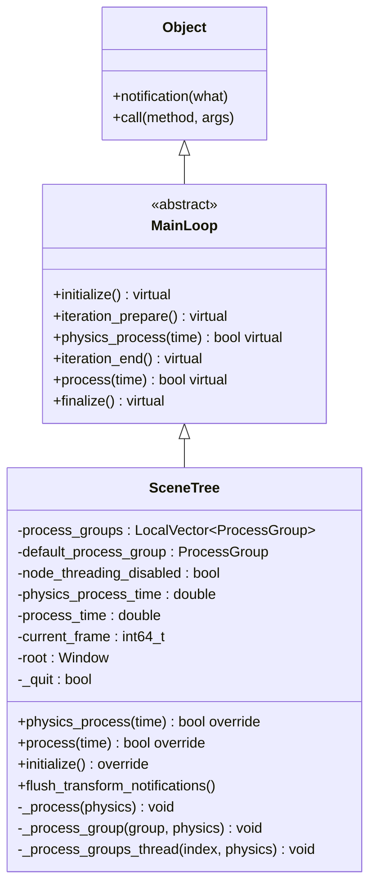

### 3.2 ServerWrapMT 线程包装体系

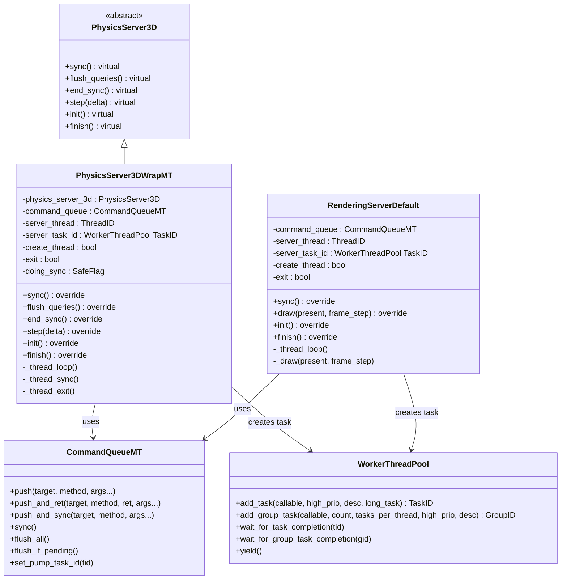

### 3.3 ProcessGroup 多线程处理

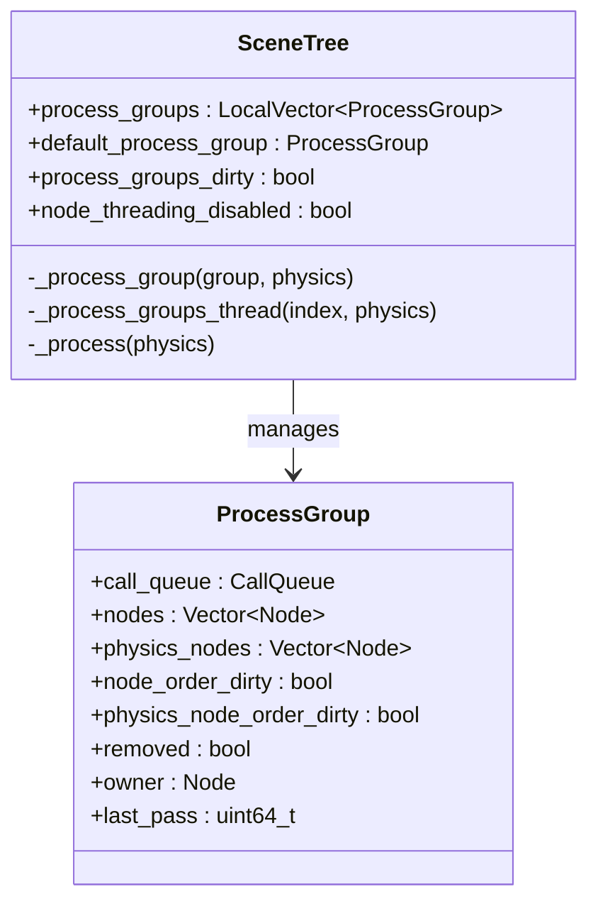

## 4. 完整帧循环详解

### 4.1 Main::iteration() 流程

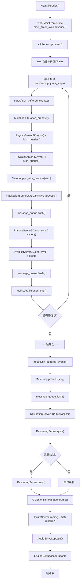

### 4.2 帧时序图

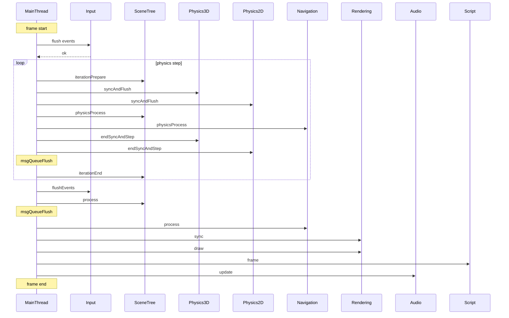

## 5. 多线程模型详解

### 5.1 线程架构总览

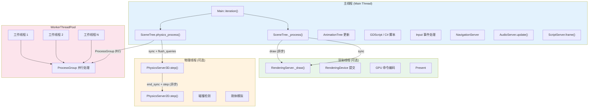

### 5.2 CommandQueueMT 同步机制

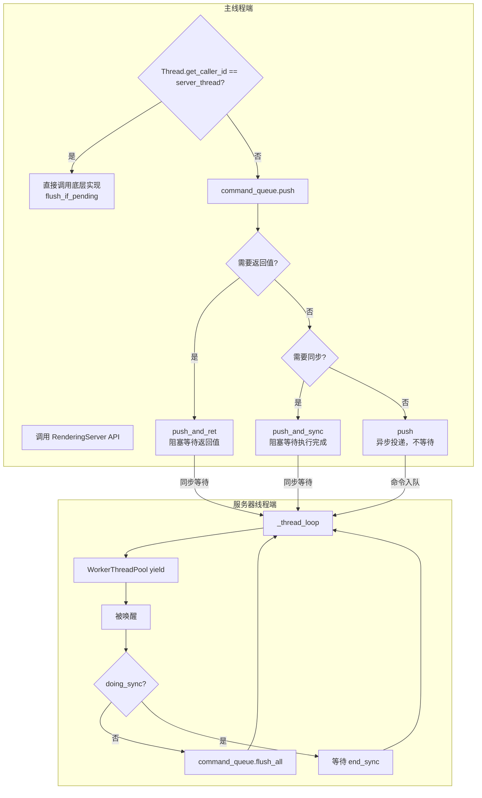

### 5.3 物理服务器线程模型

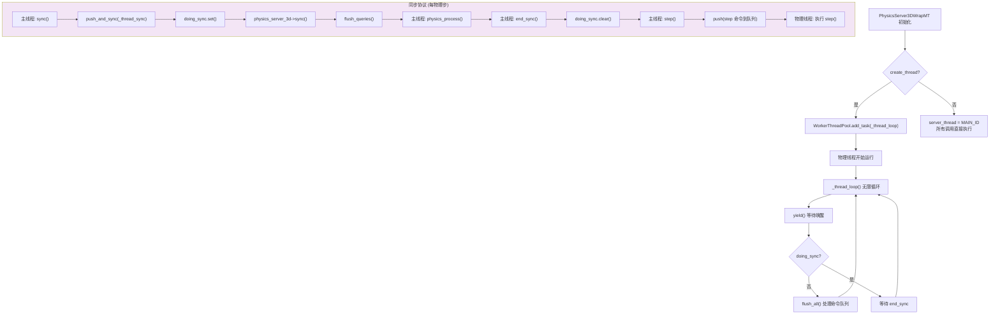

### 5.4 渲染服务器线程模型

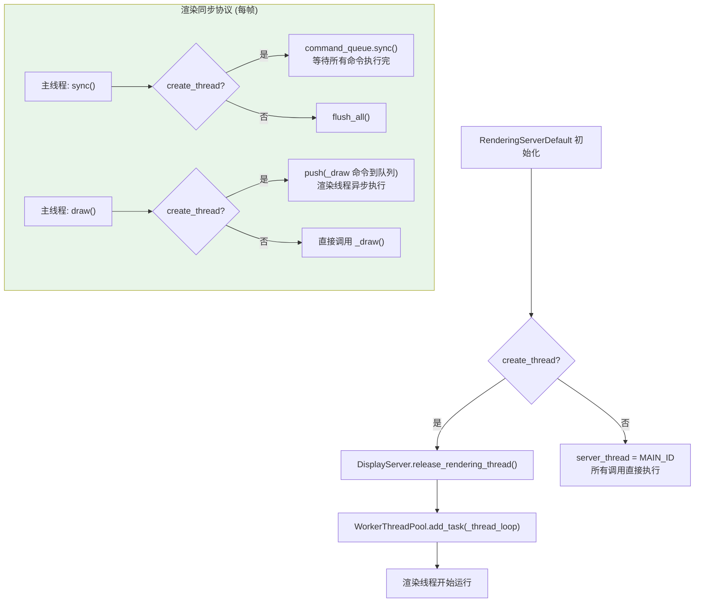

### 5.5 如何开启渲染和物理线程

#### 5.5.1 渲染线程配置

**项目设置**：`rendering/driver/threads/thread_model`

| 值 | 枚举 | 行为 |
|----|------|------|
| 1 (Safe) | `OS::RENDER_THREAD_SAFE` | 渲染在主线程执行（默认值） |
| 2 (Separate) | `OS::RENDER_SEPARATE_THREAD` | 渲染在独立线程执行 |

**命令行参数**：`--render-thread safe` 或 `--render-thread separate`

**决策流程**（`main/main.cpp:2721-2732`）：

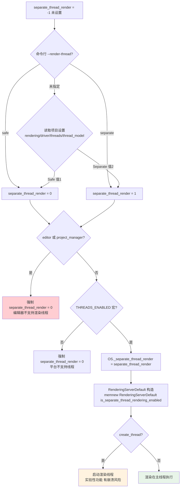

**关键源码**：

```cpp
// main/main.cpp:2721-2732
if (separate_thread_render == -1) {
    separate_thread_render = (int)GLOBAL_DEF("rendering/driver/threads/thread_model",
        OS::RENDER_THREAD_SAFE) == OS::RENDER_SEPARATE_THREAD;
}
if (editor || project_manager) {
    separate_thread_render = 0;  // 编辑器强制主线程渲染
}
#if !defined(THREADS_ENABLED)
    separate_thread_render = 0;  // 不支持线程的平台强制关闭
#endif
OS::get_singleton()->_separate_thread_render = separate_thread_render;

// main/main.cpp:3414-3418
if (OS::get_singleton()->_separate_thread_render) {
    WARN_PRINT("The separate rendering thread feature is experimental...");
}

// main/main.cpp:3462
rendering_server = memnew(RenderingServerDefault(
    OS::get_singleton()->is_separate_thread_rendering_enabled()));
```

#### 5.5.2 物理线程配置

**项目设置**：
- `physics/3d/run_on_separate_thread` — 3D 物理是否在独立线程（默认 `false`）
- `physics/2d/run_on_separate_thread` — 2D 物理是否在独立线程（默认 `false`）

**决策流程**（以 GodotPhysics3D 为例，`modules/godot_physics_3d/register_types.cpp:39-46`）：

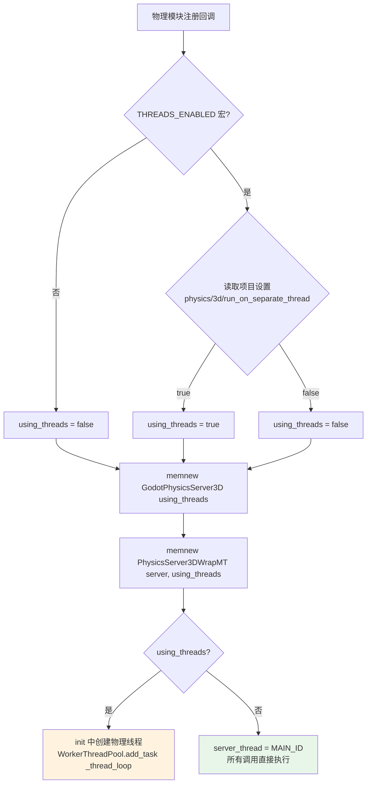

**关键源码**：

```cpp
// modules/godot_physics_3d/register_types.cpp:39-46
#if defined(THREADS_ENABLED)
    bool using_threads = GLOBAL_GET("physics/3d/run_on_separate_thread");
#else
    bool using_threads = false;
#endif
    PhysicsServer3D *physics_server_3d = memnew(GodotPhysicsServer3D(using_threads));
    return memnew(PhysicsServer3DWrapMT(physics_server_3d, using_threads));

// modules/jolt_physics/register_types.cpp:41-48 (Jolt 物理后端同理)
#if defined(THREADS_ENABLED)
    bool run_on_separate_thread = GLOBAL_GET("physics/3d/run_on_separate_thread");
#else
    bool run_on_separate_thread = false;
#endif
    JoltPhysicsServer3D *physics_server = memnew(JoltPhysicsServer3D(run_on_separate_thread));
    return memnew(PhysicsServer3DWrapMT(physics_server, run_on_separate_thread));
```

#### 5.5.3 开启方式总结

| 线程 | 项目设置 | 默认值 | 命令行 | 限制 |
|------|---------|--------|--------|------|
| **渲染线程** | `rendering/driver/threads/thread_model` = Separate | Safe 主线程 | `--render-thread separate` | 编辑器模式下强制关闭；实验性 |
| **3D 物理线程** | `physics/3d/run_on_separate_thread` = true | false 主线程 | 无 | 需 THREADS_ENABLED 宏 |
| **2D 物理线程** | `physics/2d/run_on_separate_thread` = true | false 主线程 | 无 | 需 THREADS_ENABLED 宏 |

**在 project.godot 中配置**：

```ini
# 开启渲染线程（实验性）
[rendering]
driver/threads/thread_model = 2  ; 1=Safe, 2=Separate

# 开启物理线程
[physics]
3d/run_on_separate_thread = true
2d/run_on_separate_thread = true
```

**注意**：
- 渲染线程目前标记为**实验性功能**，Godot 会在启动时打印警告
- 编辑器和项目管理器**无法使用渲染线程**（会崩溃）
- 不支持线程的平台（如某些 Web 目标）所有线程选项被强制关闭
- 物理线程默认关闭，需手动开启，但比渲染线程更稳定

## 5.6 渲染对象多线程方案：RID 句柄模式 vs UE SceneProxy 模式

### 5.6.1 UE 的 Component/SceneProxy 双对象模式

UE 采用**双对象**架构，游戏线程和渲染线程各持有独立对象：

```
游戏线程                           渲染线程
┌──────────────────────┐          ┌──────────────────────┐
│ UPrimitiveComponent  │          │ FPrimitiveSceneProxy │
│ ├── Transform        │  ──────> │ ├── Transform        │
│ ├── Materials[]      │  ENQUEUE │ ├── Materials[]      │
│ ├── Bounds           │  RENDER  │ ├── Bounds           │
│ ├── Visibility       │  COMMAND │ ├── Visibility       │
│ └── MarkDirty()      │          │ └── GetMeshBatch()   │
└──────────────────────┘          └──────────────────────┘
         │                                  │
         v                                  v
    UWorld (游戏线程)                  FScene (渲染线程)
```

**UE 模式特点**：
- 两个独立对象，严格线程归属：Component 仅游戏线程访问，SceneProxy 仅渲染线程访问
- 通过 `ENQUEUE_RENDER_COMMAND` 异步传递更新
- Component 有 `DoRenderUpdate()` 收集脏标记，批量同步到 SceneProxy
- SceneProxy 在渲染线程独立完成裁剪、排序、绘制
- 无共享可变状态，线程安全由架构保证

### 5.6.2 Godot 的 RID 句柄模式

Godot 采用**单对象 + RID 句柄**架构，没有渲染线程的独立代理对象：

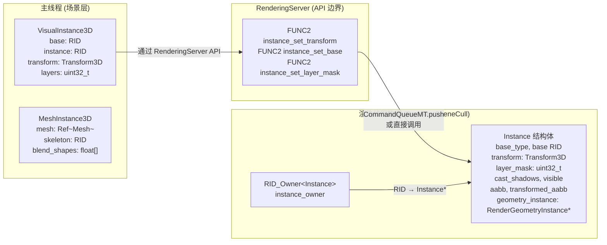

**关键源码**：

```cpp
// scene/3d/visual_instance_3d.h:40-41
// 场景节点仅持有 RID 句柄，不持有渲染数据
RID base;      // 指向 mesh/light/etc 资源
RID instance;  // 指向 RenderingServer 中的 Instance

// servers/rendering/renderer_scene_cull.h:401-440
// 渲染线程的 Instance 结构体，包含所有渲染所需数据
struct Instance {
    RS::InstanceType base_type;
    RID base;
    Transform3D transform;
    uint32_t layer_mask;
    bool visible;
    AABB aabb;
    AABB transformed_aabb;
    RenderGeometryInstance *geometry_instance;  // 实际的几何渲染数据
    // ... 更多渲染专用字段
};

// servers/rendering/renderer_scene_cull.h:1013
// RID → Instance* 的映射，渲染线程独占
mutable RID_Owner<Instance, true> instance_owner;
```

### 5.6.3 两种模式对比

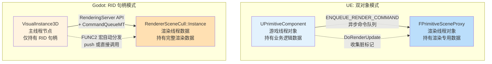

| 维度 | UE 双对象模式 | Godot RID 句柄模式 |
|------|-------------|-------------------|
| **对象数量** | 2 个（Component + SceneProxy） | 1 个场景节点 + 1 个渲染 Instance |
| **线程归属** | 严格分离：Component 游戏线程，SceneProxy 渲染线程 | 场景节点主线程，Instance 通过 RID_Owner 渲染线程访问 |
| **数据复制** | Component 数据显式拷贝到 SceneProxy | 通过 CommandQueueMT 传参，渲染线程独立持有 |
| **同步方式** | ENQUEUE_RENDER_COMMAND（命令 lambda） | FUNC 宏 + CommandQueueMT.push（方法 + 参数） |
| **脏标记** | DoRenderUpdate + 脏位收集，批量同步 | 无脏标记系统，每次 set 调用立即推送到渲染线程 |
| **创建流程** | Component::CreateSceneProxy() 在渲染线程构造 | FUNCRIDSPLIT: allocate 在当前线程，initialize 推到渲染线程 |
| **数据所有权** | Component 和 SceneProxy 各自独立持有数据 | 渲染数据完全属于渲染线程，主线程仅持 RID |
| **线程安全** | 架构级保证，无共享可变状态 | FUNC 宏 + CommandQueueMT 保证，RID 本身线程安全 |

### 5.6.4 Godot 的 FUNC 宏分发机制

Godot 通过 `server_wrap_mt_common.h` 中的宏自动决定调用路径：

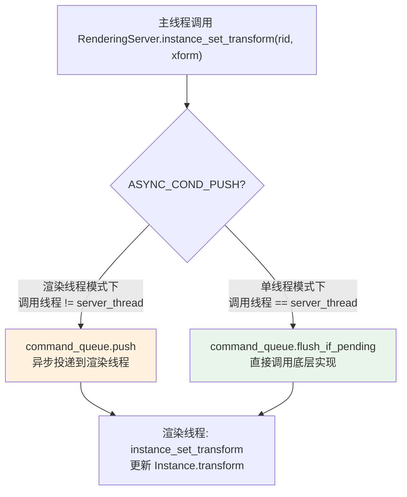

**关键源码**：

```cpp
// servers/server_wrap_mt_common.h:190-199
#define FUNC1(m_type, m_arg1)
    virtual void m_type(m_arg1 p1) override {
        WRITE_ACTION
        if (ASYNC_COND_PUSH) {
            // 渲染线程模式: 异步推送到命令队列
            command_queue.push(server_name, &ServerName::m_type, p1);
        } else {
            // 单线程模式: 先 flush 待处理命令，再直接调用
            command_queue.flush_if_pending();
            server_name->m_type(p1);
        }
    }

// servers/rendering/rendering_server_default.h:899-903
// 这些方法全部由 FUNC 宏生成，自动处理线程分发
FUNC2(instance_set_base, RID, RID)
FUNC2(instance_set_scenario, RID, RID)
FUNC2(instance_set_layer_mask, RID, uint32_t)
FUNC2(instance_set_transform, RID, const Transform3D &)
```

### 5.6.5 对象生命周期对比

**UE 创建流程**：

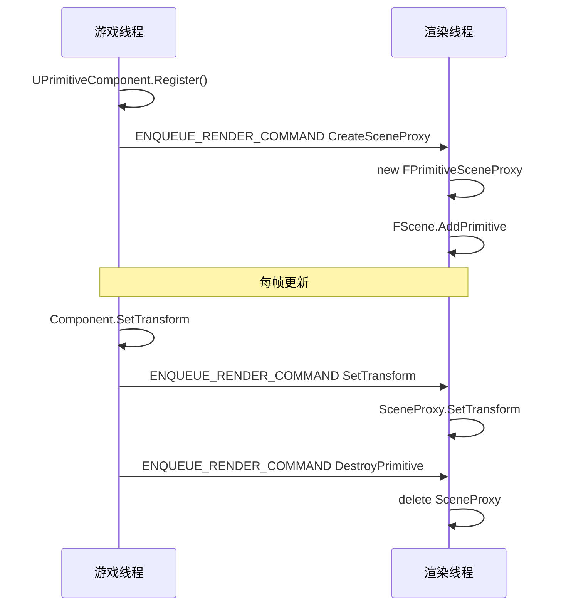

**Godot 创建流程**：

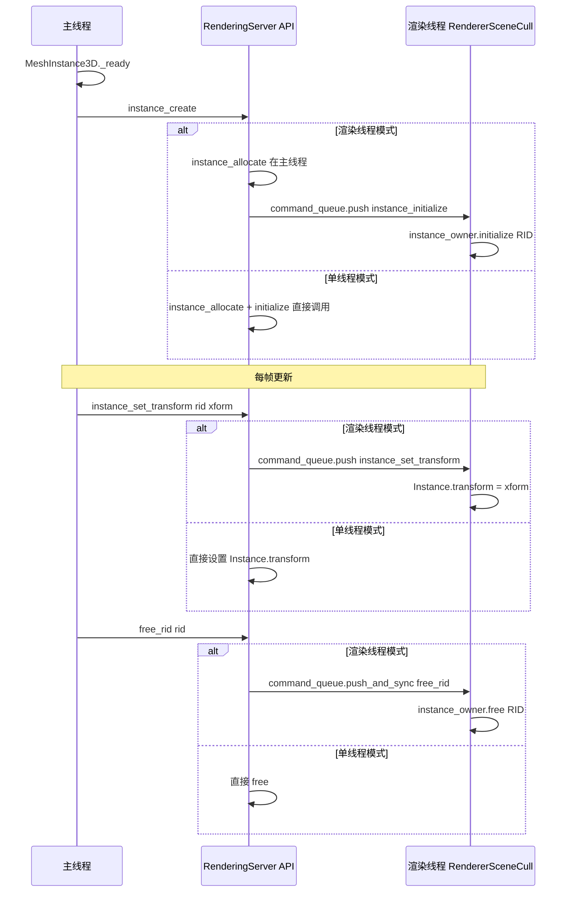

### 5.6.6 Godot 模式的优缺点

**优点**：

1. **API 简洁**：主线程只需通过 RenderingServer API 操作 RID，无需关心线程细节
2. **单一代码路径**：FUNC 宏自动处理单线程/多线程分发，一套代码两种模式
3. **数据所有权清晰**：渲染数据完全在渲染线程，主线程仅持 RID 句柄
4. **RID 轻量**：RID 仅 16 字节（2 个 uint32），主线程持有成本极低

**缺点**：

1. **无脏标记系统**：每次 set 调用都推送到渲染线程，无法批量合并更新
   - UE 的 DoRenderUpdate 可以收集脏标记，一帧只同步一次
   - Godot 每次调用都生成一条命令，高频更新（如每帧 Transform）产生大量命令
2. **无 SceneProxy 抽象**：渲染线程没有独立的"代理对象"概念
   - UE 的 SceneProxy 可以缓存渲染专用数据（如 LOD 信息、材质排序缓存）
   - Godot 的 Instance 直接存储原始数据，渲染时再计算
3. **同步粒度粗**：push_and_sync 阻塞等待渲染线程处理完当前命令
   - UE 的 ENQUEUE_RENDER_COMMAND 是纯异步的
   - Godot 某些操作（如创建返回 RID）必须同步等待
4. **调试困难**：RID 是不透明句柄，无法直接查看渲染线程中的对象状态
   - UE 可以在渲染线程断点查看 SceneProxy
   - Godot 需要 RID_Owner 查找，且渲染线程数据对主线程不可见

### 5.6.7 方案总结

```
┌────────────────────────────────────────────────────────────────────┐
│              Godot 渲染对象多线程方案总结                           │
│                                                                    │
│  Godot 没有采用 UE 的 Component/SceneProxy 双对象模式              │
│  而是采用 RID 句柄模式：                                           │
│                                                                    │
│  ┌──────────────────┐     CommandQueueMT     ┌──────────────────┐ │
│  │ VisualInstance3D  │ ────────────────────> │ RendererSceneCull│ │
│  │ (主线程节点)      │     FUNC 宏自动分发    │ ::Instance       │ │
│  │ 持有: RID 句柄    │                       │ (渲染线程数据)    │ │
│  │                   │                       │ 持有: 全部渲染数据│ │
│  └──────────────────┘                       └──────────────────┘ │
│                                                                    │
│  核心差异：                                                        │
│  ├── UE: 两个独立对象，显式同步，脏标记批处理                      │
│  └── Godot: RID 句柄 + FUNC 宏，命令队列逐条投递，无脏标记        │
│                                                                    │
│  Godot 模式更简洁但效率略低：                                      │
│  ├── 优点: API 统一、代码路径单一、数据所有权清晰                  │
│  └── 缺点: 无脏标记、高频更新产生大量命令、同步等待可能卡顿        │
└────────────────────────────────────────────────────────────────────┘
```

### 5.6.8 push vs push_and_sync 的存在原因与高频更新优化

#### 5.6.8.1 为什么 Godot 同时提供 push 和 push_and_sync

CommandQueueMT 共提供三种投递语义（`core/templates/command_queue_mt.h`），对应不同的同步需求：

| 方法 | 模板参数 NeedsSync | 行为 | 适用场景 |
|------|-------------------|------|----------|
| `push` | `false` | 投递到队列立即返回，渲染线程异步消费 | 纯 set 操作（transform/可见性/layer_mask 等），无后续依赖 |
| `push_and_sync` | `true` | 投递后阻塞等待 `sync_cond_var` 唤醒 | 需要确认执行完成的副作用操作 |
| `push_and_ret` | `true` | 投递后阻塞等待，且写回返回值 | 状态查询（`texture_2d_get`、`get_rendering_info` 等） |

**为什么需要 push_and_sync（阻塞语义）**：

```cpp
// core/templates/command_queue_mt.h:138-148
template <typename T, bool NeedsSync, typename... Args>
_FORCE_INLINE_ void _push_internal(Args &&...args) {
    MutexLock mlock(mutex);
    create_command<T>(std::forward<Args>(args)...);

    if (pump_task_id != WorkerThreadPool::INVALID_TASK_ID) {
        WorkerThreadPool::get_singleton()->notify_yield_over(pump_task_id);
    }

    if constexpr (NeedsSync) {
        sync_tail++;
        _wait_for_sync(mlock);   // ← 阻塞等待
    }
}
```

**典型 push_and_sync 使用场景**（`servers/rendering/rendering_server_default.h` 中 FUNC0S/FUNCnS 系列）：

1. **RID 创建的"分配-初始化"分离（`FUNCRIDSPLIT`）**：
   ```cpp
   // servers/server_wrap_mt_common.h:56-65
   #define FUNCRIDSPLIT(m_type)                                                        \
       virtual RID m_type##_create() override {                                        \
           RID ret = server_name->m_type##_allocate();                                 \
           if (ASYNC_COND_PUSH) {                                                      \
               command_queue.push(server_name, &ServerName::m_type##_initialize, ret); \
           } else {                                                                    \
               server_name->m_type##_initialize(ret);                                  \
           }                                                                           \
           return ret;                                                                 \
       }
   ```
   分配阶段（`_allocate`）在主线程立即执行并返回 RID，初始化（`_initialize`）则推到渲染线程。`push_and_sync` 在 RID 必须先于使用就绪时使用（如 free_rid 前需要确保没有未完成的引用）。

2. **资源释放前的同步（`free_rid` 语义）**：
   ```cpp
   // RID 释放前必须确保：① 渲染线程没有正在引用该 RID ② 之前的命令都已处理
   // 这就是 push_and_sync 的典型用途
   ```

3. **需要确认副作用完成的关键操作**：
   - 渲染线程启动/关闭（`thread_loop` 初始化）
   - 资源 GPU 上传完成的确认
   - 场景切换前确保旧场景清理完毕

**为什么 push 也会导致"阻塞主线程"问题**：

虽然 `push` 本身不阻塞，但**整个 CommandQueueMT 体系存在两种隐式同步点**：

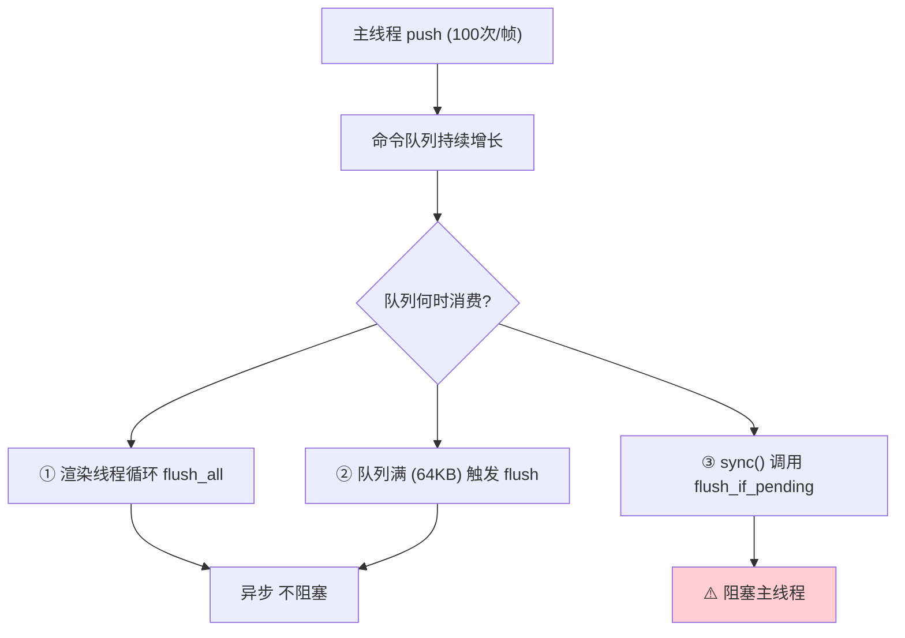

**问题点详解**：

```cpp
// servers/server_wrap_mt_common.h:91-97
#define FUNC0(m_type)                                             \
    virtual void m_type() override {                              \
        WRITE_ACTION                                              \
        if (ASYNC_COND_PUSH) {                                    \
            command_queue.push(server_name, &ServerName::m_type); \
        } else {                                                  \
            command_queue.flush_if_pending();   // ← 阻塞点 1   \
            server_name->m_type();                                \
        }                                                         \
    }
```

1. **`flush_if_pending()` 隐式阻塞**（FUNC 宏 else 分支）：当 push 时 `pending==true` 但又被识别为"调用线程==server_thread"时（`ASYNC_COND_PUSH` 为 false），主线程会直接 flush 队列并执行命令，造成主线程等待。
2. **队列满导致 flush 阻塞**：CommandQueueMT 默认容量 64KB（`DEFAULT_COMMAND_MEM_SIZE_KB = 64`），高频调用（如每帧 1000+ transform 更新）可能撑爆队列。
3. **`_prevent_sync_wraparound` 隐性开销**：`sync_head/sync_tail` 接近 UINT32_MAX 时会触发 wraparound 检查。

**push_and_sync 的阻塞特征**（最坏情况）：

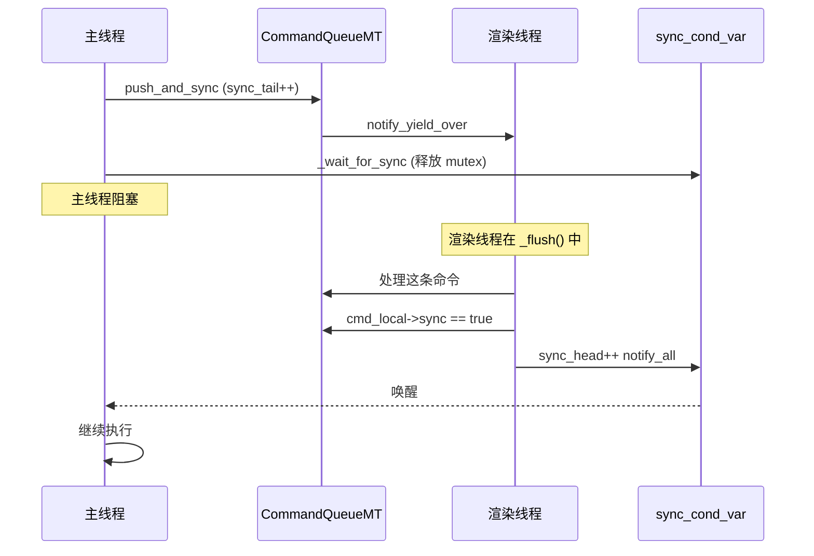

**总结：阻塞问题的根因**：

| 阻塞源 | 触发条件 | 阻塞程度 |
|--------|---------|---------|
| `push_and_sync` 主动阻塞 | 业务代码使用 FUNC0S 系列 | 等待渲染线程处理完当前命令 |
| `push_and_ret` 主动阻塞 | 查询操作 | 等返回值 |
| `flush_if_pending` 隐式阻塞 | `Thread::get_caller_id() == server_thread`（主线程被识别为 server_thread） | 取决于队列大小 |
| `RenderingServer.sync()` | `Main::iteration()` 每帧调用 | 等待渲染线程完成上一帧 draw |
| 队列满重分配 | 高频 push 撑爆 64KB | 内存分配 + 命令拷贝 |
| `sync_head/tail` wraparound | 大量 push_and_sync 累积 | 罕见但可能 |

#### 5.6.8.2 集中化 CommandQueueMT 提交以避免高频更新问题

**问题场景**：在密集更新（如 1000+ 个 MeshInstance3D 每帧设置 transform）时，逐次 push 会产生大量命令。

```cpp
// 当前模式（FUNC2 展开）
for (int i = 0; i < 1000; i++) {
    RS::get_singleton()->instance_set_transform(instance_rid[i], xform[i]);
    // → 1000 次 command_queue.push
    // → 1000 次 MutexLock 上锁
    // → 1000 次 command_mem.resize
    // → 渲染线程要处理 1000 次 cmd
}
```

**集中化方案 1：批处理 API（Godot 实际做法 — Multimesh / MultiMeshInstance）**：

Godot 已经在高性能场景通过 `MultiMesh` 实现了"一次提交批量更新"：

```cpp
// core/multimesh.h 的 API
class MultiMesh {
    void set_buffer(const Vector<float> &p_buffer);  // 一次性设置所有实例的 transform
    void set_instance_transform(int p_instance, const Transform3D &p_transform);
    // ...
};

// 主线程侧：
Vector<float> buffer;
for (int i = 0; i < 1000; i++) {
    // 写入本地 buffer（仅主线程操作，无命令队列）
    buffer.write[12 * i + 0] = xform[i].basis.rows[0][0];
    // ...
}
multimesh->set_buffer(buffer);
// → 仅 1 次 push(set_buffer)，但内部携带 1000 个 transform 数据
```

**MultiMesh 的批处理实现**（`servers/rendering/renderer_scene_cull.h` 中 instance 数据）：

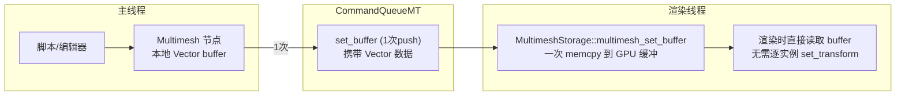

**集中化方案 2：脏标记批处理（可借鉴 UE 的 DoRenderUpdate 思想）**：

可以扩展 `VisualInstance3D` 增加批量同步 API：

```cpp
// 假设的脏标记批处理模式（Godot 当前未提供，但可作为优化方向）
class VisualInstance3DBatcher {
    HashMap<RID, DirtyData> pending_updates;

    void mark_transform_dirty(RID p_rid, const Transform3D &p_xform) {
        pending_updates[p_rid].transform = p_xform;
    }

    void mark_visible_dirty(RID p_rid, bool p_visible) {
        pending_updates[p_rid].visible = p_visible;
    }

    void flush() {
        // 一次性提交所有脏数据
        RS::get_singleton()->batch_instance_updates(pending_updates);
        pending_updates.clear();
    }
};

// 用法：
auto *batcher = VisualInstance3DBatcher::get_singleton();
for (int i = 0; i < 1000; i++) {
    batcher->mark_transform_dirty(instance_rid[i], xform[i]);
}
batcher->flush();  // 仅 1 次 CommandQueueMT 调用
```

**集中化方案 3：Frame-coherent Update（Godot 已经在用的隐式方案）**：

观察 `VisualInstance3D::_notification`：

```cpp
// scene/3d/visual_instance_3d.cpp:90-96
case NOTIFICATION_TRANSFORM_CHANGED: {
    if (_is_vi_visible() && !(is_inside_tree() && get_tree()->is_physics_interpolation_enabled()) && !_is_using_identity_transform()) {
        RenderingServer::get_singleton()->instance_set_transform(instance, get_global_transform());
    }
} break;
```

**Godot 已经采用的优化**：
- `physics_interpolation_enabled` 开启时，主线程**不立即推送** transform 到渲染线程
- 取而代之，主线程缓存 `_cached_global_transform_interpolated`（`fti_update_servers_xform`）
- 直到主线程空闲时（如 frame end）才推送渲染线程
- 这本质上是"延迟批处理"策略

**集中化的真实限制与权衡**：

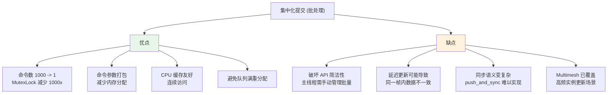

**结论**：

1. **当前 Godot 设计倾向于"细粒度简单 API"**：每帧 1000+ set_transform 仍是 1000 次 push
2. **高频实例更新场景已有专用路径**：`MultiMesh`、`GPUParticles3D` 走批处理
3. **可以但难以推广**：通用脏标记 + batch API 需要修改 FUNC 宏和整个 RenderingServer 协议
4. **工程权衡**：Godot 选择"简洁 API + 专用批处理"而非"通用批处理 API + 复杂协议"

#### 5.6.8.3 渲染专用数据能否缓存到 Instance 中

**当前 Instance 的数据结构**（`servers/rendering/renderer_scene_cull.h:401-490`）已经做了部分预计算：

```cpp
struct Instance {
    RS::InstanceType base_type;
    RID base;
    Transform3D transform;             // 缓存：直接存储主线程传入的 transform
    bool teleported = false;
    float lod_bias;
    bool ignore_occlusion_culling;
    bool ignore_all_culling;
    Vector<RID> materials;
    RS::ShadowCastingSetting cast_shadows;
    uint32_t layer_mask;
    bool mirror : 1;
    bool receive_shadows : 1;
    bool visible : 1;
    bool baked_light : 1;
    bool dynamic_gi : 1;
    bool redraw_if_visible : 1;

    AABB aabb;
    AABB transformed_aabb;             // 缓存：已计算好的世界空间 AABB
    AABB prev_transformed_aabb;        // 缓存：上一帧的 transformed_aabb（用于 motion vector）

    RID self;
    float sorting_offset = 0.0;
    bool use_aabb_center = true;

    uint64_t last_frame_pass;
    uint64_t version;
    // ...
};
```

`RenderGeometryInstanceBase`（`servers/rendering/renderer_geometry_instance.h:79-156`）已经有更多预计算字段：

```cpp
class RenderGeometryInstanceBase : public RenderGeometryInstance {
public:
    uint32_t base_flags = 0;       // 缓存：基础标志位
    uint32_t flags_cache = 0;      // 缓存：渲染时使用的标志
    float depth = 0;               // 缓存：渲染时计算的深度
    RID mesh_instance;
    Transform3D transform;         // 缓存：transform 副本
    bool mirror = false;
    AABB transformed_aabb;         // 缓存：变换后 AABB
    bool non_uniform_scale = false;// 缓存：是否非均匀缩放（影响法线计算）
    float lod_model_scale = 1.0;   // 缓存：LOD 缩放
    float lod_bias = 0.0;          // 缓存：LOD 偏差
    float sorting_offset = 0.0;
    bool use_aabb_center = true;
    uint32_t layer_mask = 1;
    // fade_near/fade_far 等也都已缓存
    int32_t shader_uniforms_offset = -1;
    // ...
};
```

**Godot 已经缓存的渲染专用数据**（`RenderGeometryInstanceBase`）：

| 字段 | 计算时机 | 用途 |
|------|---------|------|
| `non_uniform_scale` | `set_transform` 时 | 决定法线是否需要特殊处理 |
| `lod_model_scale` | `set_transform` 时 | LOD 选择阈值 |
| `transformed_aabb` | `set_transform` 时 | 视锥剔除、阴影投射 |
| `prev_transformed_aabb` | 上一帧 | Motion Vector |
| `depth` | 渲染时（write to depth buffer 时）| 深度排序 |
| `base_flags` / `flags_cache` | `set_transform` 和材质变更时 | 着色器变体选择 |
| `sorting_offset` / `use_aabb_center` | `set_pivot_data` 时 | 透明物体排序 |

**哪些渲染专用数据可以进一步缓存到 Instance 中**？

**A. 可以缓存但尚未缓存的项**：

```cpp
// 1. 着色器排序键（material_key）— 渲染时计算
struct Instance {
    uint64_t material_sort_key = 0;  // 可缓存：materials/skeleton 变更时重算
};

// 2. 视锥剔除结果（cull_result）— 上一帧剔除结果可复用作 early-cull 提示
struct Instance {
    uint8_t last_cull_result = 0;    // IN/OUT/PARTIAL
    AABB last_cull_frustum;          // 上一帧视锥
};

// 3. 阴影 LOD 决策（shadow_lod_level）— 阴影 pass 选择
struct Instance {
    int8_t shadow_lod_override = -1; // -1=auto, 0..3=lod level
};

// 4. 屏幕空间覆盖率（screen_coverage）— 用于 LOD 选择和遮挡剔除
struct Instance {
    float last_screen_coverage = 0;  // 上一帧像素覆盖率
};

// 5. 光源配对缓存（light_pair_cache）— 当前帧的光源 RID 列表
struct Instance {
    Vector<RID> cached_light_pairs;  // 上一帧配对结果，下一帧增量更新
};
```

**B. 不能轻易缓存的项**：

| 数据 | 原因 |
|------|------|
| **每帧光源配对结果** | 受 camera、light culling mask 动态影响 |
| **屏幕空间坐标** | 每帧视口/camera 改变 |
| **每像素着色结果** | 渲染产物，本身就不属于"Instance 级别" |
| **LOD 选择** | 受 camera 距离、screen_coverage 实时影响（但可缓存 last frame） |
| **遮挡剔除结果** | 场景动态变化，缓存可能失效 |
| **裁剪后顶点** | GPU 端数据，CPU 缓存收益小 |

**C. 与 UE SceneProxy 缓存的对比**：

| 缓存项 | UE FPrimitiveSceneProxy | Godot Instance/GeometryInstance |
|--------|------------------------|--------------------------------|
| transform 副本 | ✓ | ✓ |
| transformed_aabb | ✓ | ✓ |
| 上一帧 transform（motion）| ✓ | ✓ (prev_transformed_aabb) |
| 标志位缓存 | ✓ | ✓ (base_flags/flags_cache) |
| LOD scale | ✓ | ✓ (lod_model_scale) |
| 排序键 | ✓ | ✗ (每次渲染重算) |
| 光源配对缓存 | ✓ | ✗ (每帧重新 pair_light_instance) |
| 屏幕覆盖率 | ✓ | ✗ |
| 静态光照/反射快照 | ✓ | △ (lightmap_sh 已存) |
| 阴影 LOD 决策 | ✓ | ✗ |

**为什么 Godot 选择"轻缓存"策略**：

```mermaid
flowchart LR
    A["缓存更多数据"] --> B["好处"]
    A --> C["代价"]

    B --> B1["减少渲染时计算<br>提高帧率"]
    B --> B2["SceneProxy 模式<br>可以预排序"]

    C --> C1["Instance 体积膨胀<br>100万实例 = 100MB+ 内存"]
    C --> C2["缓存维护成本<br>数据失效逻辑复杂"]
    C --> C3["同步点增加<br>设置 transform 时<br>可能要更新缓存"]
    C --> C4["RID_Owner 增长<br>Instance 生命周期管理复杂"]
    C --> C5["RID 是只读句柄<br>外部无法直接修改缓存"]

    style B fill:#e8f5e9
    style C fill:#fff3e0
```

**具体原因**：

1. **RID 句柄模式的数据所有权限制**：
   - Instance 由 `RID_Owner<Instance>` 管理，外部访问必须通过 RID 查找
   - 缓存数据增多意味着每次 set_transform 都要计算更多派生字段（`non_uniform_scale`、`lod_model_scale` 等已经这样做）
   - 缓存失效逻辑分散在每个 set_* 方法中

2. **Godot 的批量优化已通过 MultiMesh 实现**：
   - 单实例场景下，缓存收益小（100 实例不值得）
   - 大规模场景通过 MultiMesh 处理，10000 个实例共享 1 个 Mesh，缓存只对"渲染 Mesh 自身"做
   - 实质上 MultiMesh 的 Mesh 部分充当了"轻量 SceneProxy"

3. **渲染线程已足够快**：
   - 每帧的 AABB 更新、视锥剔除、深度排序在 GPU 端很便宜
   - 现代 GPU 的 tile-based 渲染和早-Z 优化减少了 CPU 端排序收益
   - Godot 优先保证简单性而非极限性能

4. **缓存会导致 RID 句柄与主线程数据脱钩**：
   - UE 的 SceneProxy 在渲染线程，缓存可以独立维护
   - Godot 的 Instance 在 RID_Owner 中，主线程访问需要 lock 或 find
   - 在 Instance 上缓存大量数据会让"主线程 set 立即可见"这个特性消失

**结论**：

- **当前设计已经做了适度的渲染专用数据缓存**（`non_uniform_scale`、`transformed_aabb` 等）
- **可以进一步缓存**（material_sort_key、screen_coverage、light_pair_cache 等）但需要权衡：
  - 收益：减少渲染时计算 1-5%
  - 代价：Instance 体积膨胀、缓存失效逻辑复杂、RID 句柄访问变慢
- **MultiMesh 路径上已经做得好**：1000+ 实例的 batch update 不需要逐 Instance 缓存
- **不推荐简单照搬 UE SceneProxy 模式**：
  - Godot 的 RID 句柄模式有自身的简洁性优势
  - 缓存应该按"对热路径贡献大"的项逐项添加
  - 保持 RID_Owner 内存占用可控

**实际优化建议**：

```cpp
// 推荐：在 Instance 中增加轻量级缓存（仅必要项）
struct Instance {
    // ... 已有字段 ...

    // 1. 排序键（仅 8 字节，热路径用）
    uint64_t material_sort_key = 0;

    // 2. 上一帧剔除结果（仅 1 字节，遮挡剔除优化）
    uint8_t last_cull_result = 0;

    // 3. 静态/动态分类（仅 1 位，决定是否参与 lightmap 计算）
    bool is_static : 1;
};
```

不建议：

```cpp
// 反例：缓存每帧都变的数据（如光源配对）会引入复杂的状态机
struct Instance {
    Vector<RID> cached_light_pairs;  // ← ❌ 维护成本高、收益有限
    float last_screen_coverage;     // ← ❌ 数据变化频繁
};
```

## 6. 各子系统线程归属

### 6.1 详细线程归属表

| 子系统 | 默认线程 | 可否独立线程 | 同步机制 |
|--------|---------|-------------|---------|
| **脚本 (_process)** | 主线程 | 否 | N/A |
| **脚本 (_physics_process)** | 主线程 | 否 | N/A |
| **输入 (Input)** | 主线程 | 否 | N/A |
| **动画 (AnimationTree)** | 主线程 | 否 | N/A |
| **物理 (PhysicsServer3D)** | 可选独立线程 | 是 | sync/end_sync/step 命令队列 |
| **物理 (PhysicsServer2D)** | 可选独立线程 | 是 | sync/end_sync/step 命令队列 |
| **渲染 (RenderingServer)** | 可选独立线程 | 是 | sync/draw 命令队列 |
| **导航 (NavigationServer)** | 主线程 | 否 | N/A |
| **音频 (AudioServer)** | 主线程调用 | 内部有音频线程 | 音频驱动内部线程 |
| **XR (XRServer)** | 主线程 | 否 | N/A |
| **MessageQueue** | 主线程 flush | 否 | flush() 在帧边界执行 |
| **ProcessGroup** | WorkerThreadPool | 可选并行 | add_group_task 并行分发 |

### 6.2 线程交互时序

```mermaid
sequenceDiagram
    participant MT as 主线程
    participant PT as 物理线程
    participant RT as 渲染线程
    participant WT as WorkerThreadPool

    Note over MT,WT: === 物理步 ===

    MT->>PT: sync() - 阻塞等待物理线程完成上一帧
    MT->>PT: flush_queries() - 刷新碰撞回调
    MT->>MT: SceneTree.physics_process() - 脚本处理
    MT->>PT: end_sync() - 释放物理线程
    MT->>PT: step(delta) - 投递物理步进命令（异步）

    Note over PT: 物理线程开始 step() 模拟
    Note over MT: 主线程不等待，继续下一物理步

    Note over MT,WT: === 帧处理 ===

    MT->>MT: SceneTree.process() - 脚本处理
    MT->>RT: sync() - 阻塞等待渲染线程完成上一帧 draw
    MT->>RT: draw() - 投递绘制命令（异步）

    Note over RT: 渲染线程开始 _draw() 渲染

    MT->>WT: ProcessGroup 并行分发（可选）
    WT-->>MT: 等待所有 group 完成

    MT->>MT: AudioServer.update()
    Note over MT: 帧结束，下一帧 sync() 会等待渲染完成
```

## 7. SceneTree 的 ProcessGroup 多线程

### 7.1 ProcessGroup 并行处理流程

```mermaid
flowchart TD
    A["SceneTree._process(physics)"] --> B{process_groups_dirty?}
    B -->|是| C["重建 process_groups 列表"]
    B -->|否| D["遍历 process_groups"]

    C --> D
    D --> E{group 有 owner 且<br>node_threading_disabled = false?}
    E -->|否| F["_process_group(group, physics)<br>主线程直接处理"]
    E -->|是| G["加入 local_process_group_cache"]

    G --> H{cache 大小 > 阈值?}
    H -->|否| F
    H -->|是| I["WorkerThreadPool.add_template_group_task<br>并行处理所有 group"]

    I --> J["每个工作线程:<br>_process_groups_thread(index, physics)"]
    J --> K["Node.current_process_thread_group = group.owner"]
    K --> L["_process_group(group, physics)"]
    L --> M["遍历 group.nodes<br>调用 node._process() 或 _physics_process()"]
    M --> N["Node.current_process_thread_group = null"]

    I --> O["wait_for_group_task_completion()"]
    O --> P["所有 group 处理完成"]
```

### 7.2 ProcessGroup 线程安全

```
ProcessGroup 并行处理的前提条件:
1. Node 设置了 process_thread_group 属性 (owner != null)
2. node_threading_disabled == false (全局开关)
3. 同一 ProcessGroup 内的节点在同一个工作线程执行
4. 跨 ProcessGroup 的节点在不同工作线程执行
5. default_process_group 始终在主线程执行
6. call_queue 用于跨 ProcessGroup 的延迟调用

限制:
- 同一 ProcessGroup 内仍是串行执行
- 不同 ProcessGroup 之间可并行
- GUI/Control 节点通常在 default_process_group（主线程）
- call_deferred() 通过 CallQueue 跨线程安全通信
```

## 8. 物理时间步进机制

### 8.1 MainTimerSync

```mermaid
flowchart TD
    A["MainTimerSync.advance(physics_step, ticks_per_sec)"] --> B["计算 elapsed = 当前时间 - 上帧时间"]
    B --> C["elapsed *= time_scale"]
    C --> D["计算 physics_steps = floor(elapsed / physics_step)"]
    D --> E["限制 physics_steps <= max_physics_steps_per_frame"]
    E --> F["计算 interpolation_fraction<br>= 余数 / physics_step"]
    F --> G["返回 MainFrameTime<br>{physics_steps, process_step, interpolation_fraction}"]

    style F fill:#fff3e0
```

### 8.2 固定时间步 vs 变量时间步

```
物理步 (固定时间步):
  ├── physics_step = 1.0 / physics_ticks_per_second (默认 60 Hz)
  ├── 每帧可能执行 0-8 次物理步
  ├── 用于: PhysicsServer.step(), SceneTree._physics_process()
  └── delta 值恒定 = physics_step

帧步 (变量时间步):
  ├── process_step = 帧间隔时间
  ├── 每帧执行 1 次
  ├── 用于: SceneTree._process(), AnimationTree 更新, RenderingServer.draw()
  └── delta 值可变 = 实际帧时间
```

## 9. MessageQueue 跨线程通信

### 9.1 MessageQueue 工作机制

```mermaid
flowchart TD
    A["任意线程: call_deferred()"] --> B["MessageQueue.push_call(object, method, args)"]
    B --> C["消息入队 (线程安全)"]

    D["主线程: message_queue.flush()"] --> E["在帧边界执行"]
    E --> F["遍历队列中所有消息"]
    F --> G["调用 object.method(args)"]
    G --> H["处理删除队列"]
    H --> I["队列清空"]

    style E fill:#e8f5e9
```

### 9.2 三种跨线程通信机制对比

| 机制 | 用途 | 线程安全 | 阻塞 | 使用场景 |
|------|------|---------|------|---------|
| **CommandQueueMT** | Server API 调用 | 是 | push_and_ret/ push_and_sync 阻塞，push 不阻塞 | 物理/渲染服务器线程通信 |
| **MessageQueue** | 通用延迟调用 | 是 | 否 | call_deferred(), 帧边界执行 |
| **CallQueue (ProcessGroup)** | 跨 ProcessGroup 通信 | 是 | 否 | ProcessGroup 内 call_deferred |

## 10. 与 UE 的线程模型对比

### 10.1 架构对比

```mermaid
flowchart LR
    subgraph Godot["Godot 线程模型"]
        G1["主线程<br>脚本+动画+输入+导航"]
        G2["物理线程 (可选)<br>PhysicsServer3D/2D.step()"]
        G3["渲染线程 (可选)<br>RenderingServer._draw()"]
        G4["WorkerThreadPool<br>ProcessGroup 并行"]

        G1 -->|"sync/end_sync/step"| G2
        G1 -->|"sync/draw"| G3
        G1 -->|"group_task"| G4
    end

    subgraph UE["UE 线程模型"]
        U1["GameThread<br>脚本+动画+逻辑"]
        U2["渲染线程 (RHI)<br>始终独立"]
        U3["物理线程 (PhysX)<br>始终独立"]
        U4["任务图 (TaskGraph)<br>并行任务系统"]
        U5["音频线程"]
        U6["动画线程 (可选)"]

        U1 -->|"EnqueueRenderCommand"| U2
        U1 -->|"物理同步"| U3
        U1 -->|"任务分发"| U4
    end

    style Godot fill:#e3f2fd
    style UE fill:#fff3e0
```

### 10.2 详细对比

| 维度 | Godot | UE |
|------|-------|-----|
| **渲染线程** | 可选（桌面默认开启） | 始终独立运行 |
| **物理线程** | 可选（桌面默认开启） | 始终独立运行（PhysX） |
| **动画线程** | 无（主线程串行） | 可选（动画评估可卸载） |
| **脚本线程** | 无（主线程串行） | 无（GameThread 串行） |
| **并行框架** | WorkerThreadPool + ProcessGroup | TaskGraph + ParallelFor |
| **同步方式** | CommandQueueMT push/sync | EnqueueRenderCommand + FRenderCommandFence |
| **帧同步粒度** | 粗粒度（sync/draw 两步） | 细粒度（Fence + 逐资源同步） |
| **跨线程通信** | CommandQueueMT + MessageQueue | TQueue + EnqueueRenderCommand |
| **音频** | AudioServer 内部线程 | 独立音频线程 |
| **网络** | 主线程 | 主线程 + 可选 IO 线程 |
| **资源加载** | 主线程 + WorkerThreadPool | 异步加载线程池 |

## 11. Godot 线程模型的关键限制

### 11.1 动画在主线程

```
问题:
  AnimationTree 在 SceneTree._process() 中更新
  → 复杂骨骼动画占用主线程时间
  → 无法与渲染/物理并行

UE 对比:
  动画评估可在工作线程执行（通过 TaskGraph）
  动画驱动的 Root Motion 通过 FAnimTickFunction 调度

影响:
  角色密集场景（如 100+ 带 AnimationTree 的角色）
  动画更新成为主线程瓶颈
```

### 11.2 脚本无并行

```
问题:
  GDScript / C# _process() 和 _physics_process() 均在主线程
  ProcessGroup 并行仅限不同 group 之间
  同一 group 内的节点仍串行执行

UE 对比:
  UE 的 GameThread 也是串行执行脚本
  但 UE 有更完善的多线程任务系统
  可在 C++ 中创建异步任务

影响:
  脚本密集型游戏（如策略游戏、大量 AI）
  主线程成为瓶颈
```

### 11.3 渲染同步粒度粗

```
问题:
  RenderingServer.sync() 等待整个上一帧渲染完成
  没有逐资源/逐 Pass 的细粒度同步
  主线程在 sync() 处阻塞等待

UE 对比:
  UE 使用 FRenderCommandFence 细粒度同步
  可以逐资源检查是否可安全修改
  渲染线程始终运行，不等主线程

影响:
  主线程在 sync() 处可能卡顿
  特别是 GPU 密集场景
```

### 11.4 缺失的功能

| 功能 | 说明 | 严重度 |
|------|------|--------|
| **动画并行评估** | AnimationTree 无法在工作线程执行 | 🟡 中等 |
| **细粒度渲染同步** | 无 Fence/信号量机制，sync 粒度粗 | 🟡 中等 |
| **异步资源流式加载** | 无后台线程资源流式加载 | 🟡 中等 |
| **任务图系统** | 无依赖关系的任务调度图 | 🔴 严重 |
| **帧间流水线** | 无多帧流水线（主线程和渲染线程无法真正重叠） | 🟡 中等 |

## 12. 关键源码索引

| 类别 | 路径 |
|------|------|
| 主循环入口 | `main/main.cpp` (Main::iteration, L4835-L5060) |
| MainLoop 接口 | `core/os/main_loop.h` |
| SceneTree | `scene/main/scene_tree.h` / `scene_tree.cpp` |
| ProcessGroup | `scene/main/scene_tree.h` (L96-L105) |
| PhysicsServer3DWrapMT | `servers/physics_3d/physics_server_3d_wrap_mt.h` / `.cpp` |
| PhysicsServer2DWrapMT | `servers/physics_2d/physics_server_2d_wrap_mt.h` / `.cpp` |
| RenderingServerDefault | `servers/rendering/rendering_server_default.h` / `.cpp` |
| CommandQueueMT | `core/templates/command_queue_mt.h` / `.cpp` |
| ServerWrapMT 宏 | `servers/server_wrap_mt_common.h` |
| WorkerThreadPool | `core/object/worker_thread_pool.h` / `.cpp` |
| MessageQueue | `core/object/message_queue.h` / `.cpp` |
| MainTimerSync | `core/os/main_timer_sync.h` / `.cpp` |
