# Godot Engine Forward 渲染深度分析

## 1. 概述

Godot 提供两种基于 Forward 思想的渲染器实现：
- **ForwardClustered**（`Forward+` 桌面平台）— 使用 Compute Shader 将光源分配到 3D 网格簇中
- **ForwardMobile**（移动平台）— 简化的单 Pass Forward，每个像素最多采样 N 个光源

两者都继承自 `RendererSceneRenderRD`，并复用了绝大部分基础设施（Shadow、GI、SSAO、SSR、TAA、SSIL、FSR2、Decal、ReflectionProbe 等）。

## 2. 检索过程

1. `servers/rendering/renderer_rd/renderer_scene_render_rd.h` → `RendererSceneRenderRD` 抽象基类
2. `servers/rendering/renderer_rd/forward_clustered/render_forward_clustered.h` → `RenderForwardClustered` 类
3. `servers/rendering/renderer_rd/forward_clustered/scene_shader_forward_clustered.h` → 10 种 Shader 版本
4. `servers/rendering/renderer_rd/forward_mobile/render_forward_mobile.h` → `RenderForwardMobile` 类
5. `servers/rendering/renderer_rd/storage_rd/light_storage.h` → `Light`/`LightInstance`/`ShadowTransform` 结构
6. `servers/rendering/renderer_rd/render_list.h` → `RenderList` 排序与分类
7. `servers/rendering/renderer_rd/cluster_builder_rd.h` → Cluster 构建器
8. `servers/rendering/renderer_rd/shadow_renderer.h` / `shadow_atlas.h` → 阴影图集
9. `servers/rendering/renderer_rd/render_pipeline.h` → 渲染管线
10. `servers/rendering/renderer_rd/render_geometry_instance.h` → 几何实例

## 3. 核心类层次

### 3.1 渲染器继承体系

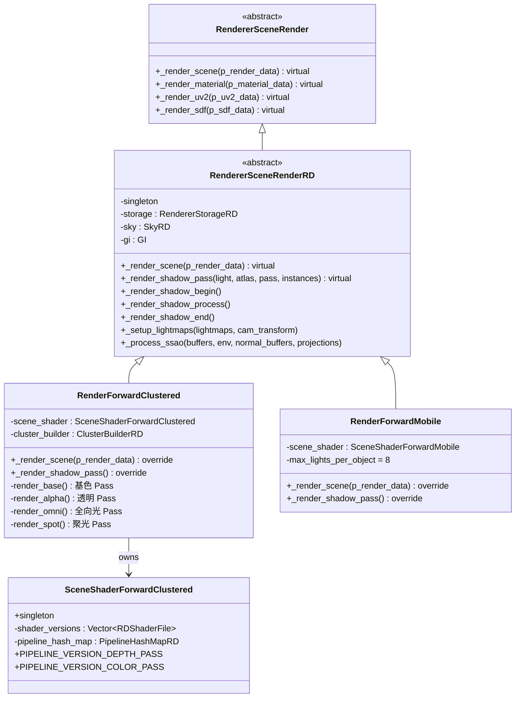
```mermaid
classDiagram
    class RendererSceneRender {
        <<abstract>>
        +_render_scene(p_render_data) virtual
        +_render_material(p_material_data) virtual
        +_render_uv2(p_uv2_data) virtual
        +_render_sdf(p_sdf_data) virtual
    }

    class RendererSceneRenderRD {
        <<abstract>>
        -singleton
        -storage : RendererStorageRD
        -sky : SkyRD
        -gi : GI
        +_render_scene(p_render_data) virtual
        +_render_shadow_pass(light, atlas, pass, instances) virtual
        +_render_shadow_begin()
        +_render_shadow_process()
        +_render_shadow_end()
        +_setup_lightmaps(lightmaps, cam_transform)
        +_process_ssao(buffers, env, normal_buffers, projections)
    }

    class RenderForwardClustered {
        +_render_scene(p_render_data) override
        +_render_shadow_pass() override
        -scene_shader : SceneShaderForwardClustered
        -cluster_builder : ClusterBuilderRD
        -render_base() 基色 Pass
        -render_alpha() 透明 Pass
        -render_omni() 全向光 Pass
        -render_spot() 聚光 Pass
    }

    class RenderForwardMobile {
        +_render_scene(p_render_data) override
        +_render_shadow_pass() override
        -scene_shader : SceneShaderForwardMobile
        -max_lights_per_object = 8
    }

    class SceneShaderForwardClustered {
        +singleton
        -shader_versions : Vector~RDShaderFile~
        -pipeline_hash_map : PipelineHashMapRD
        +PIPELINE_VERSION_DEPTH_PASS
        +PIPELINE_VERSION_COLOR_PASS
    }

    RendererSceneRender <|-- RendererSceneRenderRD
    RendererSceneRenderRD <|-- RenderForwardClustered
    RendererSceneRenderRD <|-- RenderForwardMobile
    RenderForwardClustered --> SceneShaderForwardClustered : owns
```

### 3.2 Shader 版本体系


```mermaid
classDiagram
    class ShaderGroup {
        <<enumeration>>
        SHADER_GROUP_BASE
        SHADER_GROUP_ADVANCED
        SHADER_GROUP_MULTIVIEW
        SHADER_GROUP_ADVANCED_MULTIVIEW
    }

    class ShaderVersion {
        <<constants>>
        SHADER_VERSION_DEPTH_PASS = 0
        SHADER_VERSION_DEPTH_PASS_DP = 1
        SHADER_VERSION_DEPTH_PASS_WITH_NORMAL_AND_ROUGHNESS = 2
        SHADER_VERSION_DEPTH_PASS_WITH_NORMAL_AND_ROUGHNESS_AND_VOXEL_GI = 3
        SHADER_VERSION_DEPTH_PASS_MULTIVIEW = 4
        SHADER_VERSION_DEPTH_PASS_WITH_NORMAL_AND_ROUGHNESS_MULTIVIEW = 5
        SHADER_VERSION_DEPTH_PASS_WITH_NORMAL_AND_ROUGHNESS_AND_VOXEL_GI_MULTIVIEW = 6
        SHADER_VERSION_DEPTH_PASS_WITH_MATERIAL = 7
        SHADER_VERSION_DEPTH_PASS_WITH_SDF = 8
        SHADER_VERSION_COLOR_PASS = 9
    }

    class ShaderColorPassFlags {
        <<bitfield>>
        FLAG_UBERSHADER = 1
        FLAG_SEPARATE_SPECULAR = 2
        FLAG_LIGHTMAP = 4
        FLAG_MULTIVIEW = 8
        FLAG_MOTION_VECTORS = 16
    }

    class PipelineVersion {
        <<enumeration>>
        PIPELINE_VERSION_DEPTH_PASS
        PIPELINE_VERSION_DEPTH_PASS_DP
        PIPELINE_VERSION_DEPTH_PASS_WITH_NORMAL_AND_ROUGHNESS
        PIPELINE_VERSION_DEPTH_PASS_WITH_NORMAL_AND_ROUGHNESS_AND_VOXEL_GI
        PIPELINE_VERSION_DEPTH_PASS_WITH_MATERIAL
        PIPELINE_VERSION_DEPTH_PASS_WITH_SDF
        PIPELINE_VERSION_DEPTH_PASS_MULTIVIEW
        PIPELINE_VERSION_DEPTH_PASS_WITH_NORMAL_AND_ROUGHNESS_MULTIVIEW
        PIPELINE_VERSION_DEPTH_PASS_WITH_NORMAL_AND_ROUGHNESS_AND_VOXEL_GI_MULTIVIEW
        PIPELINE_VERSION_COLOR_PASS
        PIPELINE_VERSION_MAX = 10
    }

    class PipelineColorPassFlags {
        <<bitfield>>
        FLAG_TRANSPARENT = 1
        FLAG_SEPARATE_SPECULAR = 2
        FLAG_LIGHTMAP = 4
        FLAG_MULTIVIEW = 8
        FLAG_MOTION_VECTORS = 16
        FLAG_COMBINATIONS = 32
    }

    SceneShaderForwardClustered --> ShaderGroup
    SceneShaderForwardClustered --> ShaderVersion
    SceneShaderForwardClustered --> ShaderColorPassFlags
    SceneShaderForwardClustered --> PipelineVersion
    SceneShaderForwardClustered --> PipelineColorPassFlags
```

### 3.3 灯光数据结构

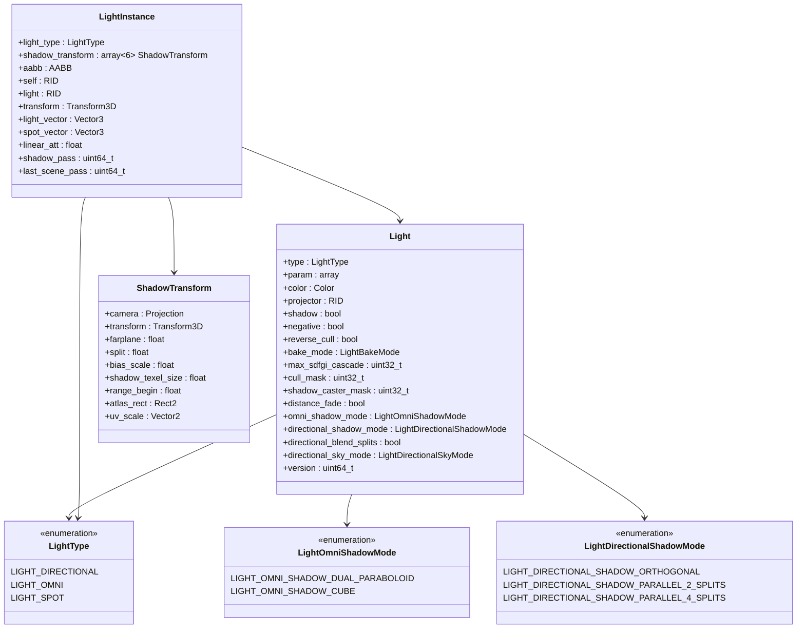
```mermaid
classDiagram
    class Light {
        +type : LightType
        +param : array
        +color : Color
        +projector : RID
        +shadow : bool
        +negative : bool
        +reverse_cull : bool
        +bake_mode : LightBakeMode
        +max_sdfgi_cascade : uint32_t
        +cull_mask : uint32_t
        +shadow_caster_mask : uint32_t
        +distance_fade : bool
        +omni_shadow_mode : LightOmniShadowMode
        +directional_shadow_mode : LightDirectionalShadowMode
        +directional_blend_splits : bool
        +directional_sky_mode : LightDirectionalSkyMode
        +version : uint64_t
    }

    class LightInstance {
        +light_type : LightType
        +shadow_transform : array~6~ ShadowTransform
        +aabb : AABB
        +self : RID
        +light : RID
        +transform : Transform3D
        +light_vector : Vector3
        +spot_vector : Vector3
        +linear_att : float
        +shadow_pass : uint64_t
        +last_scene_pass : uint64_t
    }

    class ShadowTransform {
        +camera : Projection
        +transform : Transform3D
        +farplane : float
        +split : float
        +bias_scale : float
        +shadow_texel_size : float
        +range_begin : float
        +atlas_rect : Rect2
        +uv_scale : Vector2
    }

    class LightType {
        <<enumeration>>
        LIGHT_DIRECTIONAL
        LIGHT_OMNI
        LIGHT_SPOT
    }

    class LightOmniShadowMode {
        <<enumeration>>
        LIGHT_OMNI_SHADOW_DUAL_PARABOLOID
        LIGHT_OMNI_SHADOW_CUBE
    }

    class LightDirectionalShadowMode {
        <<enumeration>>
        LIGHT_DIRECTIONAL_SHADOW_ORTHOGONAL
        LIGHT_DIRECTIONAL_SHADOW_PARALLEL_2_SPLITS
        LIGHT_DIRECTIONAL_SHADOW_PARALLEL_4_SPLITS
    }

    Light --> LightType
    Light --> LightOmniShadowMode
    Light --> LightDirectionalShadowMode
    LightInstance --> Light
    LightInstance --> ShadowTransform
    LightInstance --> LightType
```

## 4. Forward 渲染总体流程

### 4.1 帧时序图

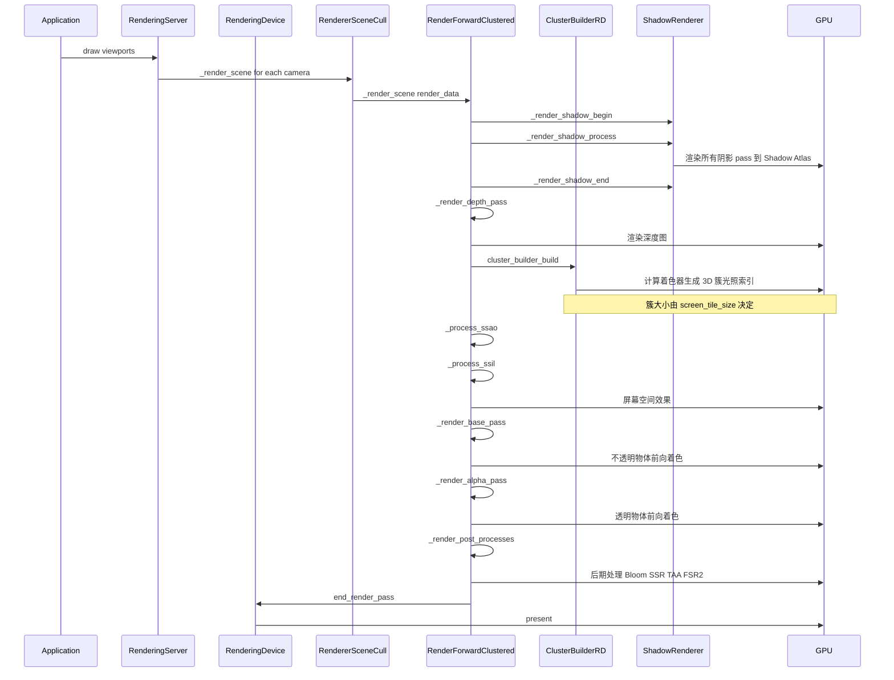
```mermaid
sequenceDiagram
    participant App as Application
    participant RS as RenderingServer
    participant RD as RenderingDevice
    participant SC as RendererSceneCull
    participant Fwd as RenderForwardClustered
    participant CB as ClusterBuilderRD
    participant SR as ShadowRenderer
    participant GPU

    App->>RS: draw viewports
    RS->>SC: _render_scene for each camera
    SC->>Fwd: _render_scene render_data

    Fwd->>SR: _render_shadow_begin
    Fwd->>SR: _render_shadow_process
    SR->>GPU: 渲染所有阴影 pass 到 Shadow Atlas
    Fwd->>SR: _render_shadow_end

    Fwd->>Fwd: _render_depth_pass
    Fwd->>GPU: 渲染深度图

    Fwd->>CB: cluster_builder_build
    CB->>GPU: 计算着色器生成 3D 簇光照索引
    Note over CB,GPU: 簇大小由 screen_tile_size 决定

    Fwd->>Fwd: _process_ssao
    Fwd->>Fwd: _process_ssil
    Fwd->>GPU: 屏幕空间效果

    Fwd->>Fwd: _render_base_pass
    Fwd->>GPU: 不透明物体前向着色

    Fwd->>Fwd: _render_alpha_pass
    Fwd->>GPU: 透明物体前向着色

    Fwd->>Fwd: _render_post_processes
    Fwd->>GPU: 后期处理 Bloom SSR TAA FSR2

    Fwd->>RD: end_render_pass
    RD->>GPU: present
```

### 4.2 Forward 渲染主流程

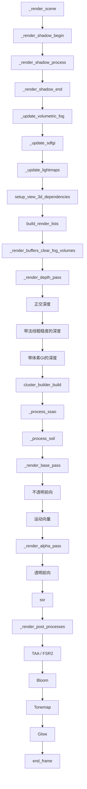
```mermaid
flowchart TD
    A["_render_scene"] --> B["_render_shadow_begin"]
    B --> C["_render_shadow_process"]
    C --> D["_render_shadow_end"]

    D --> E["_update_volumetric_fog"]
    E --> F["_update_sdfgi"]
    F --> G["_update_lightmaps"]

    G --> H["setup_view_3d_dependencies"]
    H --> I["build_render_lists"]
    I --> J["_render_buffers_clear_fog_volumes"]

    J --> K["_render_depth_pass"]
    K --> K1["正交深度"]
    K1 --> K2["带法线粗糙度的深度"]
    K2 --> K3["带体素GI的深度"]

    K3 --> L["cluster_builder_build"]
    L --> L1["_process_ssao"]
    L1 --> L2["_process_ssil"]

    L2 --> M["_render_base_pass"]
    M --> M1["不透明前向"]
    M1 --> M2["运动向量"]

    M2 --> N["_render_alpha_pass"]
    N --> N1["透明前向"]
    N1 --> N2["ssr"]

    N2 --> O["_render_post_processes"]
    O --> P["TAA / FSR2"]
    P --> Q["Bloom"]
    Q --> R["Tonemap"]
    R --> S["Glow"]

    S --> T["end_frame"]
```

## 5. Forward+ Clustered（桌面）

### 5.1 Clustered Shading 原理

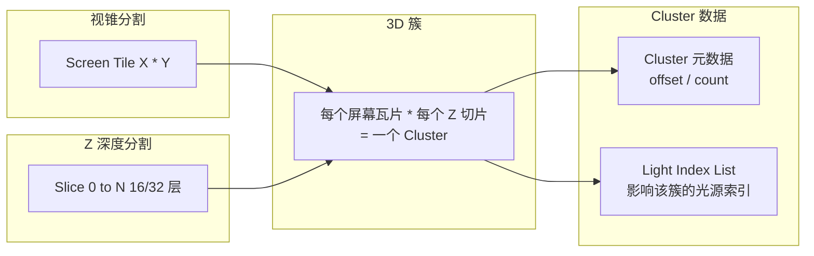
```mermaid
flowchart LR
    subgraph View["视锥分割"]
        A["Screen Tile X * Y"]
    end

    subgraph Z["Z 深度分割"]
        B["Slice 0 to N 16/32 层"]
    end

    subgraph Cluster["3D 簇"]
        C["每个屏幕瓦片 * 每个 Z 切片<br>= 一个 Cluster"]
    end

    subgraph ClusterData["Cluster 数据"]
        D["Cluster 元数据<br>offset / count"]
        E["Light Index List<br>影响该簇的光源索引"]
    end

    A --> C
    B --> C
    C --> D
    C --> E
```

**关键概念**：
- **屏幕分块** (`SCREEN_TILE_SIZE = 16x16`) — 将视口分成若干屏幕瓦片
- **Z 深度分片** (`CLUSTER_Slices = 16` 或 `32`) — 按深度方向分片
- **3D 簇 (Cluster)** — 屏幕瓦片 × Z 切片构成的空间格子
- **Compute Shader** — 遍历所有光源，对每个簇做光照分配

### 5.2 Cluster Builder 流程

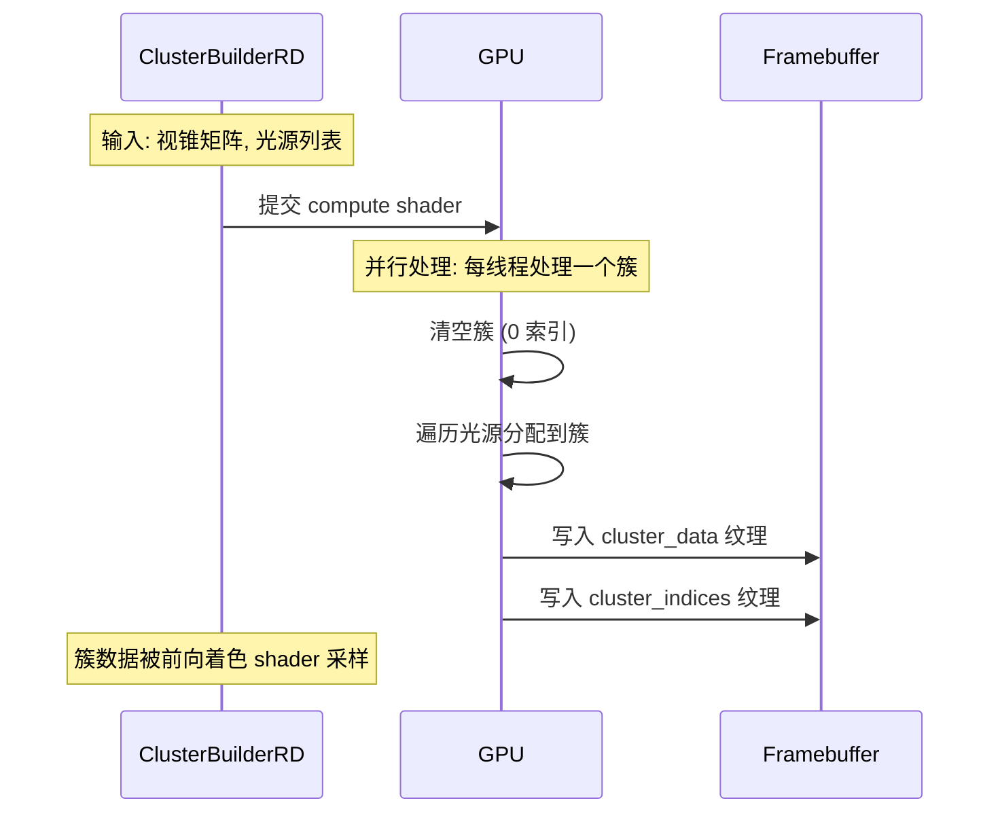
```mermaid
sequenceDiagram
    participant CB as ClusterBuilderRD
    participant GPU
    participant FB as Framebuffer

    Note over CB: 输入: 视锥矩阵, 光源列表
    CB->>GPU: 提交 compute shader
    Note over GPU: 并行处理: 每线程处理一个簇
    GPU->>GPU: 清空簇 (0 索引)
    GPU->>GPU: 遍历光源分配到簇
    GPU->>FB: 写入 cluster_data 纹理
    GPU->>FB: 写入 cluster_indices 纹理

    Note over CB: 簇数据被前向着色 shader 采样
```

### 5.3 Forward+ 与传统 Forward 对比

```
传统 Forward:
  每像素光照循环 = 遍历所有光源
  性能 = O(pixels * lights) 极度昂贵

Forward+ Clustered:
  步骤 1 (CPU + Compute): O(light) * O(cluster) 分配光源到簇
  步骤 2 (Vertex): 获取像素所在簇的索引
  步骤 3 (Fragment): 采样簇的 LightIndexList, 只遍历簇内光源
  性能 = O(pixels * lights_per_cluster) 数量级大幅降低
```

### 5.4 Forward+ 着色器 Pass 细节

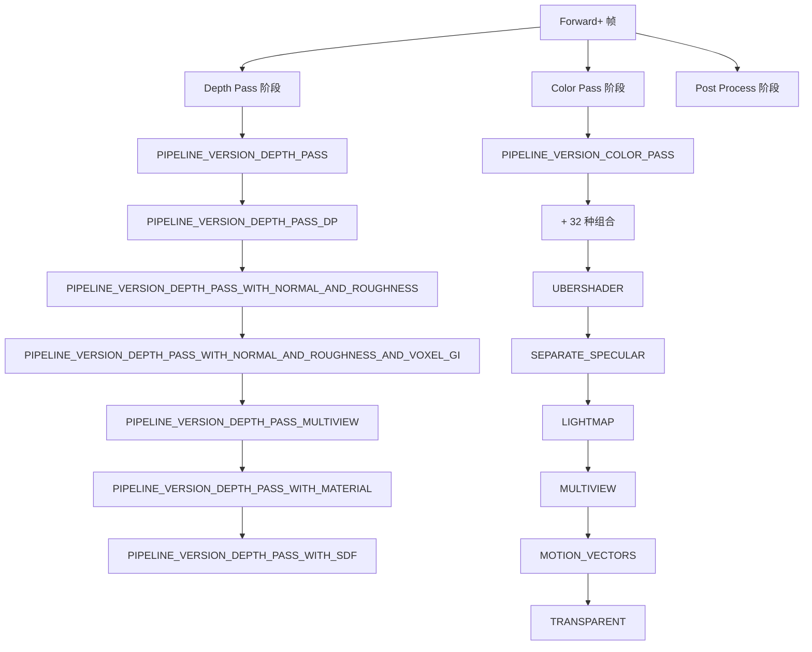
```mermaid
flowchart TD
    A["Forward+ 帧"] --> B["Depth Pass 阶段"]
    A --> C["Color Pass 阶段"]
    A --> D["Post Process 阶段"]

    B --> B1["PIPELINE_VERSION_DEPTH_PASS"]
    B1 --> B2["PIPELINE_VERSION_DEPTH_PASS_DP"]
    B2 --> B3["PIPELINE_VERSION_DEPTH_PASS_WITH_NORMAL_AND_ROUGHNESS"]
    B3 --> B4["PIPELINE_VERSION_DEPTH_PASS_WITH_NORMAL_AND_ROUGHNESS_AND_VOXEL_GI"]
    B4 --> B5["PIPELINE_VERSION_DEPTH_PASS_MULTIVIEW"]
    B5 --> B6["PIPELINE_VERSION_DEPTH_PASS_WITH_MATERIAL"]
    B6 --> B7["PIPELINE_VERSION_DEPTH_PASS_WITH_SDF"]

    C --> C1["PIPELINE_VERSION_COLOR_PASS"]
    C1 --> C2["+ 32 种组合"]
    C2 --> C3["UBERSHADER"]
    C3 --> C4["SEPARATE_SPECULAR"]
    C4 --> C5["LIGHTMAP"]
    C5 --> C6["MULTIVIEW"]
    C6 --> C7["MOTION_VECTORS"]
    C7 --> C8["TRANSPARENT"]
```

## 6. ForwardMobile（移动）

### 6.1 与 Forward+ 的核心差异

| 维度 | ForwardClustered | ForwardMobile |
|------|-----------------|---------------|
| **光源处理** | Compute Shader 分簇分配 | 顶点光源列表，着色器循环遍历 |
| **每像素光源上限** | 几乎无限 | 8 个（max_lights_per_object） |
| **着色模式** | 完整 PBR + 多种效果 | 简化 PBR + 关键效果 |
| **多视图** | 完整支持 | 简化支持 |
| **SSAO/SSR** | 完整 | 可选，简化版本 |
| **TAA/FSR2** | 完整 | FSR2 优先 |
| **Vulkan/Metal** | 完整支持 | 优化路径 |
| **着色器变体数** | 10 颜色 + 32 组合 | 较少的变体 |

### 6.2 移动版简化策略

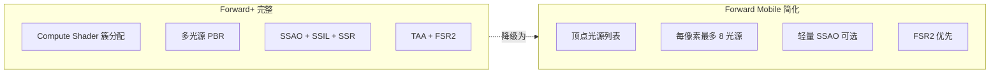
```mermaid
flowchart LR
    subgraph ForwardPlus["Forward+ 完整"]
        A1["Compute Shader 簇分配"]
        A2["多光源 PBR"]
        A3["SSAO + SSIL + SSR"]
        A4["TAA + FSR2"]
    end

    subgraph Mobile["Forward Mobile 简化"]
        B1["顶点光源列表"]
        B2["每像素最多 8 光源"]
        B3["轻量 SSAO 可选"]
        B4["FSR2 优先"]
    end

    ForwardPlus -.->|降级为| Mobile
```

## 7. 阴影系统

### 7.1 阴影渲染器架构

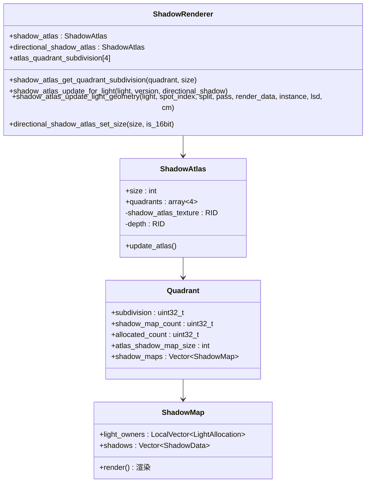
```mermaid
classDiagram
    class ShadowRenderer {
        +shadow_atlas : ShadowAtlas
        +directional_shadow_atlas : ShadowAtlas
        +atlas_quadrant_subdivision[4]
        +shadow_atlas_get_quadrant_subdivision(quadrant, size)
        +shadow_atlas_update_for_light(light, version, directional_shadow)
        +shadow_atlas_update_light_geometry(light, spot_index, split, pass, render_data, instance, lsd, cm)
        +directional_shadow_atlas_set_size(size, is_16bit)
    }

    class ShadowAtlas {
        +size : int
        +quadrants : array~4~
        -shadow_atlas_texture : RID
        -depth : RID
        +update_atlas()
    }

    class Quadrant {
        +subdivision : uint32_t
        +shadow_map_count : uint32_t
        +allocated_count : uint32_t
        +atlas_shadow_map_size : int
        +shadow_maps : Vector~ShadowMap~
    }

    class ShadowMap {
        +light_owners : LocalVector~LightAllocation~
        +shadows : Vector~ShadowData~
        +render() 渲染
    }

    ShadowRenderer --> ShadowAtlas
    ShadowAtlas --> Quadrant
    Quadrant --> ShadowMap
```

### 7.2 阴影 Pass 类型

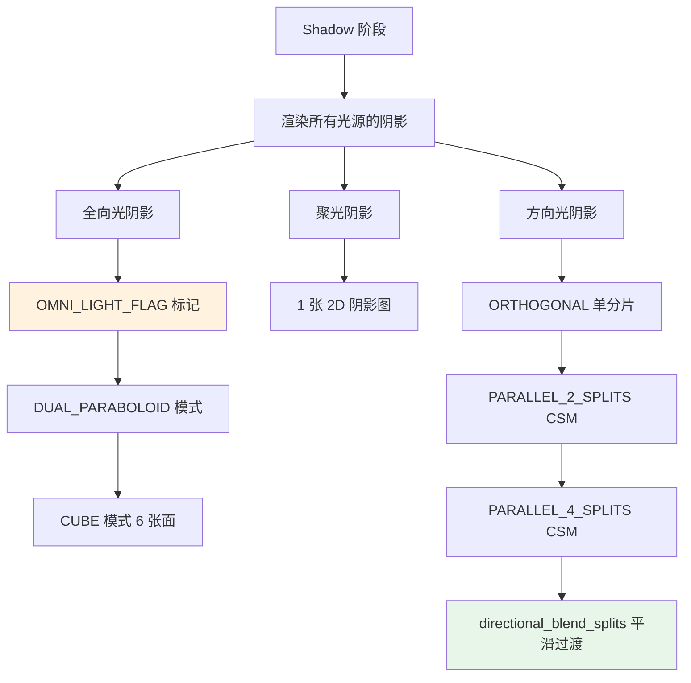
```mermaid
flowchart TD
    A["Shadow 阶段"] --> B["渲染所有光源的阴影"]
    B --> C["全向光阴影"]
    C --> C1["OMNI_LIGHT_FLAG 标记"]
    C1 --> C2["DUAL_PARABOLOID 模式"]
    C2 --> C3["CUBE 模式 6 张面"]

    B --> D["聚光阴影"]
    D --> D1["1 张 2D 阴影图"]

    B --> E["方向光阴影"]
    E --> E1["ORTHOGONAL 单分片"]
    E1 --> E2["PARALLEL_2_SPLITS CSM"]
    E2 --> E3["PARALLEL_4_SPLITS CSM"]
    E3 --> E4["directional_blend_splits 平滑过渡"]

    style C1 fill:#fff3e0
    style E4 fill:#e8f5e9
```

### 7.3 阴影 Pass 流程

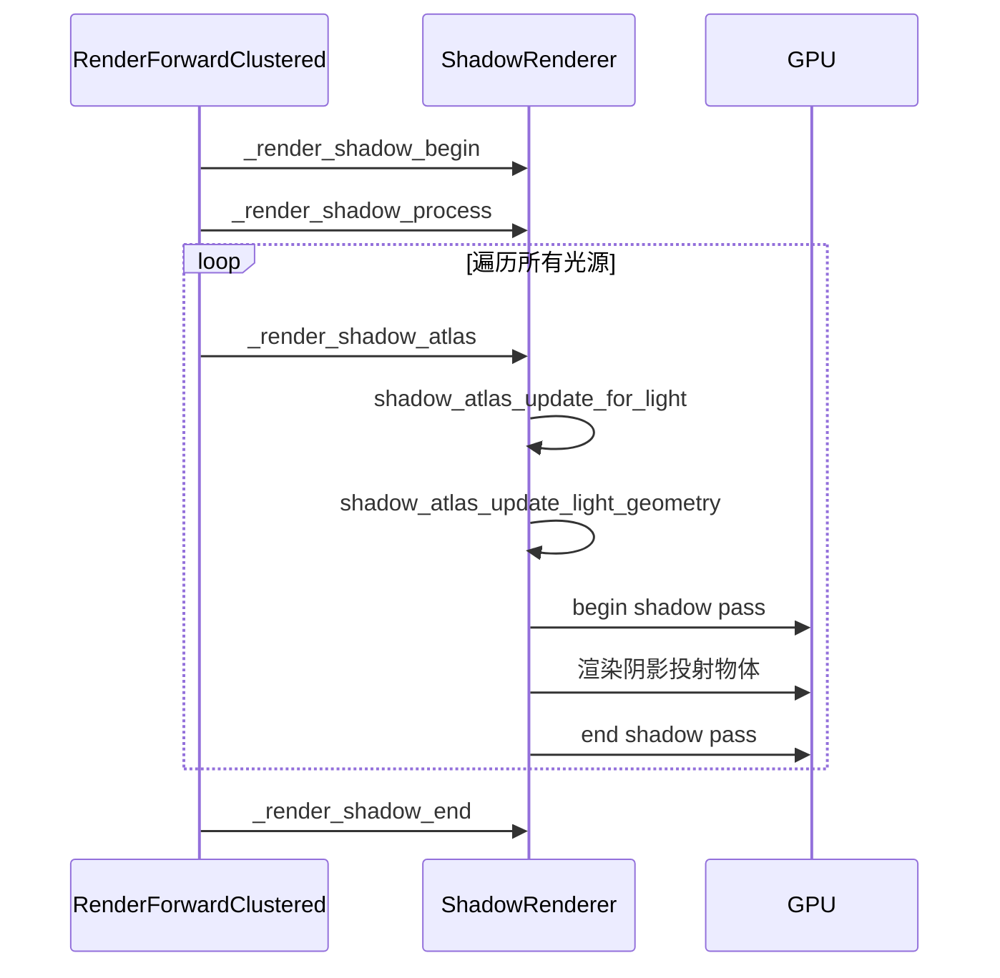
```mermaid
sequenceDiagram
    participant Fwd as RenderForwardClustered
    participant SR as ShadowRenderer
    participant GPU

    Fwd->>SR: _render_shadow_begin
    Fwd->>SR: _render_shadow_process

    loop 遍历所有光源
        Fwd->>SR: _render_shadow_atlas
        SR->>SR: shadow_atlas_update_for_light
        SR->>SR: shadow_atlas_update_light_geometry
        SR->>GPU: begin shadow pass
        SR->>GPU: 渲染阴影投射物体
        SR->>GPU: end shadow pass
    end

    Fwd->>SR: _render_shadow_end
```

## 8. 全局光照（GI）

### 8.1 三种 GI 方案

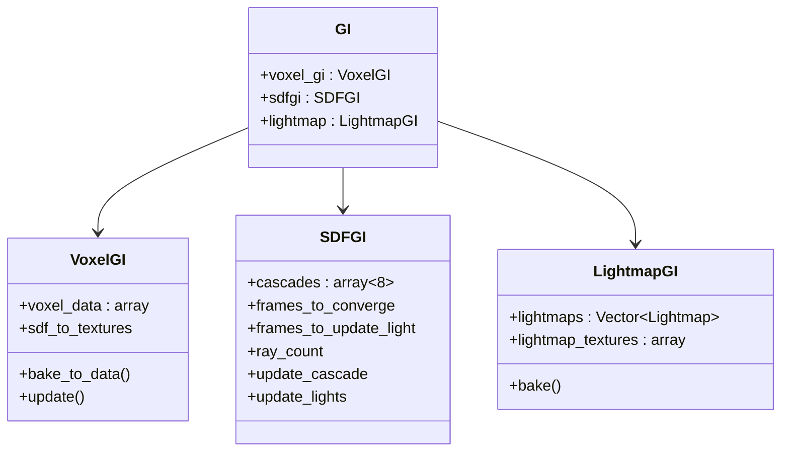
```mermaid
classDiagram
    class GI {
        +voxel_gi : VoxelGI
        +sdfgi : SDFGI
        +lightmap : LightmapGI
    }

    class VoxelGI {
        +voxel_data : array
        +bake_to_data()
        +update()
        +sdf_to_textures
    }

    class SDFGI {
        +cascades : array~8~
        +frames_to_converge
        +frames_to_update_light
        +ray_count
        +update_cascade
        +update_lights
    }

    class LightmapGI {
        +lightmaps : Vector~Lightmap~
        +lightmap_textures : array
        +bake()
    }

    GI --> VoxelGI
    GI --> SDFGI
    GI --> LightmapGI
```

### 8.2 SDFGI 工作原理

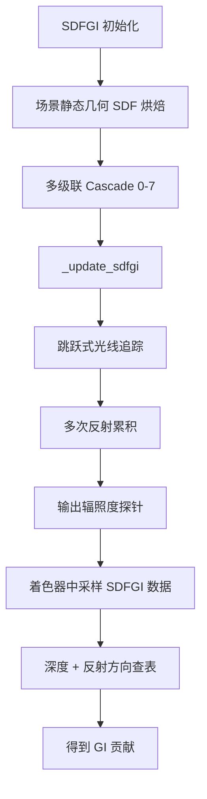
```mermaid
flowchart TD
    A["SDFGI 初始化"] --> B["场景静态几何 SDF 烘焙"]
    B --> C["多级联 Cascade 0-7"]

    C --> D["_update_sdfgi"]
    D --> D1["跳跃式光线追踪"]
    D1 --> D2["多次反射累积"]
    D2 --> D3["输出辐照度探针"]

    D3 --> E["着色器中采样 SDFGI 数据"]
    E --> F["深度 + 反射方向查表"]
    F --> G["得到 GI 贡献"]
```

## 9. 屏幕空间效果

### 9.1 屏幕空间效果链

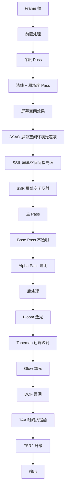
```mermaid
flowchart TD
    A["Frame 帧"] --> B["前置处理"]
    B --> B1["深度 Pass"]
    B1 --> B2["法线 + 粗糙度 Pass"]

    B2 --> C["屏幕空间效果"]
    C --> C1["SSAO 屏幕空间环境光遮蔽"]
    C1 --> C2["SSIL 屏幕空间间接光照"]
    C2 --> C3["SSR 屏幕空间反射"]

    C3 --> D["主 Pass"]
    D --> D1["Base Pass 不透明"]
    D1 --> D2["Alpha Pass 透明"]

    D2 --> E["后处理"]
    E --> E1["Bloom 泛光"]
    E1 --> E2["Tonemap 色调映射"]
    E2 --> E3["Glow 辉光"]
    E3 --> E4["DOF 景深"]
    E4 --> E5["TAA 时间抗锯齿"]
    E5 --> E6["FSR2 升级"]

    E6 --> F["输出"]
```

## 10. 渲染列表（RenderList）

### 10.1 RenderList 分类

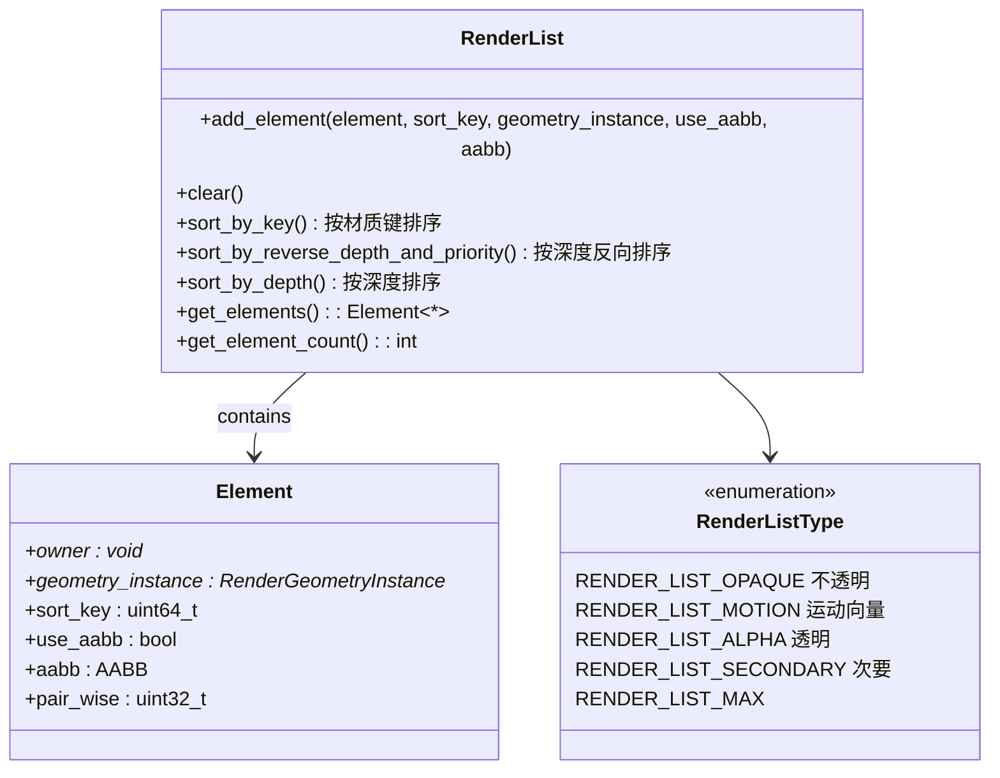
```mermaid
classDiagram
    class RenderList {
        +add_element(element, sort_key, geometry_instance, use_aabb, aabb)
        +clear()
        +sort_by_key() 按材质键排序
        +sort_by_reverse_depth_and_priority() 按深度反向排序
        +sort_by_depth() 按深度排序
        +get_elements() : Element~*~
        +get_element_count() : int
    }

    class Element {
        +owner : void*
        +geometry_instance : RenderGeometryInstance*
        +sort_key : uint64_t
        +use_aabb : bool
        +aabb : AABB
        +pair_wise : uint32_t
    }

    class RenderListType {
        <<enumeration>>
        RENDER_LIST_OPAQUE 不透明
        RENDER_LIST_MOTION 运动向量
        RENDER_LIST_ALPHA 透明
        RENDER_LIST_SECONDARY 次要
        RENDER_LIST_MAX
    }

    RenderList --> Element : contains
    RenderList --> RenderListType
```

### 10.2 排序策略

```
不透明列表 (RENDER_LIST_OPAQUE):
  - sort_by_key() 按材质键排序
  - 目的: 减少状态切换 (State Churn)
  - 同一材质批次渲染

运动向量列表 (RENDER_LIST_MOTION):
  - sort_by_key() 同样按材质键排序
  - 仅包含启用 motion_vector 的物体

透明列表 (RENDER_LIST_ALPHA):
  - sort_by_reverse_depth_and_priority()
  - 按深度从远到近排序
  - 确保正确 alpha 混合

次要列表 (RENDER_LIST_SECONDARY):
  - 用于阴影、其他效果
```

## 11. 关键时序：完整 Forward+ 帧

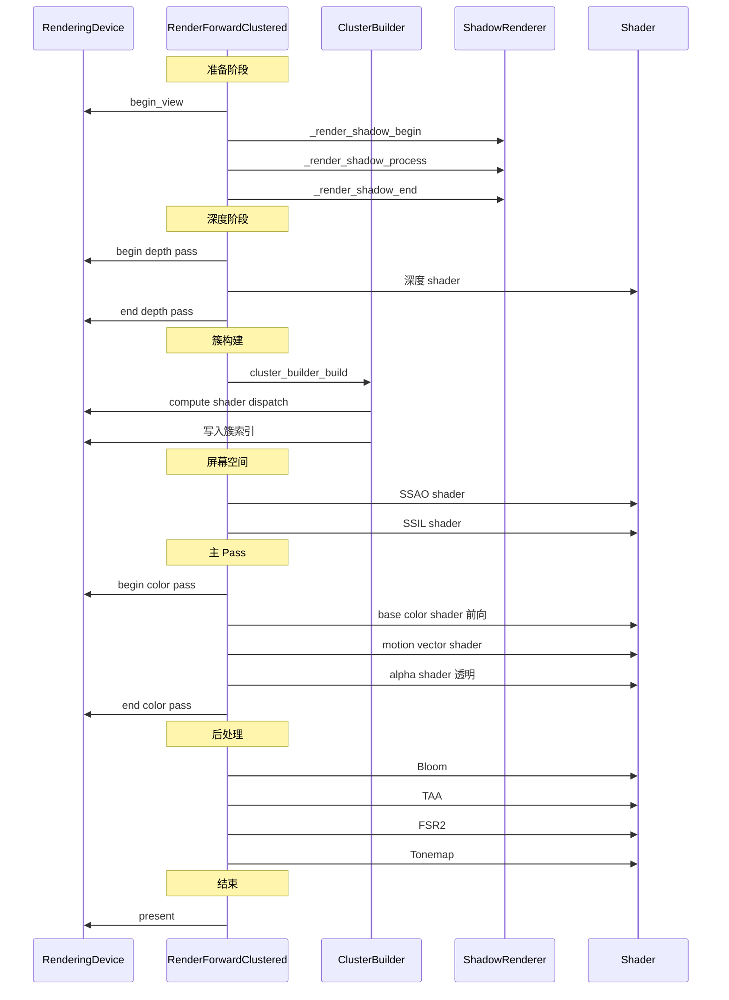
```mermaid
sequenceDiagram
    participant RD as RenderingDevice
    participant Fwd as RenderForwardClustered
    participant CB as ClusterBuilder
    participant SR as ShadowRenderer
    participant SH as Shader

    Note over Fwd: 准备阶段
    Fwd->>RD: begin_view
    Fwd->>SR: _render_shadow_begin
    Fwd->>SR: _render_shadow_process
    Fwd->>SR: _render_shadow_end

    Note over Fwd: 深度阶段
    Fwd->>RD: begin depth pass
    Fwd->>SH: 深度 shader
    Fwd->>RD: end depth pass

    Note over Fwd: 簇构建
    Fwd->>CB: cluster_builder_build
    CB->>RD: compute shader dispatch
    CB->>RD: 写入簇索引

    Note over Fwd: 屏幕空间
    Fwd->>SH: SSAO shader
    Fwd->>SH: SSIL shader

    Note over Fwd: 主 Pass
    Fwd->>RD: begin color pass
    Fwd->>SH: base color shader 前向
    Fwd->>SH: motion vector shader
    Fwd->>SH: alpha shader 透明
    Fwd->>RD: end color pass

    Note over Fwd: 后处理
    Fwd->>SH: Bloom
    Fwd->>SH: TAA
    Fwd->>SH: FSR2
    Fwd->>SH: Tonemap

    Note over Fwd: 结束
    Fwd->>RD: present
```

## 12. 与 UE 渲染架构对比

### 12.1 架构对比

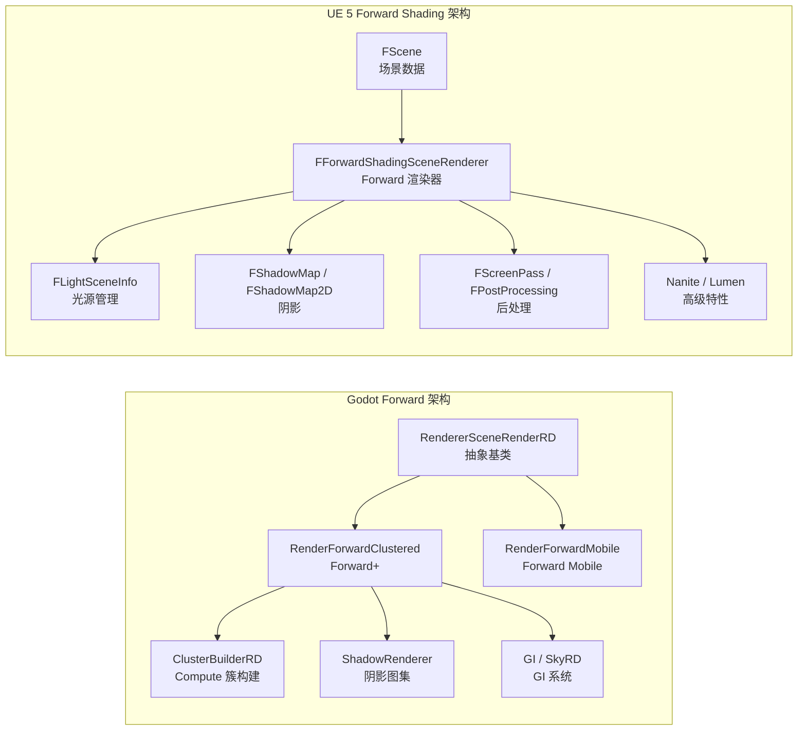
```mermaid
flowchart LR
    subgraph Godot["Godot Forward 架构"]
        G1["RendererSceneRenderRD<br>抽象基类"]
        G2["RenderForwardClustered<br>Forward+"]
        G3["RenderForwardMobile<br>Forward Mobile"]
        G4["ClusterBuilderRD<br>Compute 簇构建"]
        G5["ShadowRenderer<br>阴影图集"]
        G6["GI / SkyRD<br>GI 系统"]
        G1 --> G2
        G1 --> G3
        G2 --> G4
        G2 --> G5
        G2 --> G6
    end

    subgraph UE["UE 5 Forward Shading 架构"]
        U1["FScene<br>场景数据"]
        U2["FForwardShadingSceneRenderer<br>Forward 渲染器"]
        U3["FLightSceneInfo<br>光源管理"]
        U4["FShadowMap / FShadowMap2D<br>阴影"]
        U5["FScreenPass / FPostProcessing<br>后处理"]
        U6["Nanite / Lumen<br>高级特性"]
        U1 --> U2
        U2 --> U3
        U2 --> U4
        U2 --> U5
        U2 --> U6
    end
```

### 12.2 功能对比

| 维度 | Godot Forward+ | UE 5 Forward Shading |
|------|---------------|---------------------|
| **光源上限** | 几乎无限（簇分配） | 几乎无限（CSM 切分 + Tile 光照） |
| **着色模型** | 完整 PBR + 基础卡通 | 完整 PBR + 各向异性 + 眼睛 + 头发 |
| **簇构建** | Compute Shader 3D 簇 | 2D 屏幕 Tile + Z 索引 |
| **阴影** | Shadow Atlas + CSM | Shadow Map 2D/立方/Cube |
| **GI** | SDFGI + VoxelGI + LightmapGI | Lumen (动态) + 烘焙 |
| **反射** | SSR + ReflectionProbe | SSR + Lumen + RT 反射 |
| **AO** | SSAO + SSIL | SSAO + DFAO |
| **抗锯齿** | TAA + FSR2 | TSR / TAA / DLSS |
| **虚拟几何** | 无（基础 LOD） | Nanite |
| **多视图** | 完整支持 | 完整支持 |
| **着色器编译** | 运行时编译 + 预编译 | DDC 缓存 + 预编译 |

## 13. 关键源码索引

| 类别 | 路径 |
|------|------|
| RendererSceneRenderRD 基类 | `servers/rendering/renderer_rd/renderer_scene_render_rd.h` |
| Forward+ 渲染实现 | `servers/rendering/renderer_rd/forward_clustered/render_forward_clustered.h` |
| Forward+ Shader 体系 | `servers/rendering/renderer_rd/forward_clustered/scene_shader_forward_clustered.h` |
| Forward Mobile 渲染实现 | `servers/rendering/renderer_rd/forward_mobile/render_forward_mobile.h` |
| 灯光存储 | `servers/rendering/renderer_rd/storage_rd/light_storage.h` |
| 渲染列表 | `servers/rendering/renderer_rd/render_list.h` |
| 簇构建器 | `servers/rendering/renderer_rd/cluster_builder_rd.h` |
| 阴影渲染器 | `servers/rendering/renderer_rd/shadow_renderer.h` |
| 阴影图集 | `servers/rendering/renderer_rd/shadow_atlas.h` |
| 渲染管线 | `servers/rendering/renderer_rd/render_pipeline.h` |
| 几何实例 | `servers/rendering/renderer_rd/render_geometry_instance.h` |
| 屏幕空间效果 | `servers/rendering/renderer_rd/effects/ss_effects.h` |
| 后期处理 | `servers/rendering/renderer_rd/effects/post_processing.h` |
