# 基于 Godot 引擎实现 Nanite 虚拟化几何系统 — 三套方案设计

> 目标:
> 1. **离线模块**:对 Mesh 构建层次化 Meshlet 簇 + BVH 树,记录到资源中供运行时使用;
> 2. **运行时 GPU**:遍历 BVH 树,执行视锥/遮挡剔除、LOD 选择(动态按需从磁盘加载到 GPU),输出可见且平滑的簇列表进行显示。

本文档基于 Godot 4.x 源码(`servers/rendering/`)与 Nanite 公开技术资料(Brian Karis SIGGRAPH 2021、UCSD CSE 272 笔记)综合调研后输出三套方案。

---

## 目录

1. [调研与原理基础](#1-调研与原理基础)
2. [共同的核心数据结构与算法](#2-共同的核心数据结构与算法)
3. [方案一:GDExtension(不改引擎源码)](#3-方案一gdextension不改引擎源码)
4. [方案二:独立 C++ Module](#4-方案二独立-c-module)
5. [方案三:深度引擎改造](#5-方案三深度引擎改造)
6. [三方案横向对比与推荐实施路径](#6-三方案横向对比与推荐实施路径)
7. [Nanite 与 Godot 阴影/Forward 渲染的搭配](#7-nanite-与-godot-阴影forward-渲染的搭配)
8. [离线构建模块:基于 meshoptimizer 的层次化 Meshlet + BVH](#8-离线构建模块基于-meshoptimizer-的层次化-meshlet--bvh)
9. [综合架构:Nanite 核心 + 三桥接层](#9-综合架构nanite-核心--三桥接层)

---

## 1. 调研与原理基础

### 1.1 调研过程

| 步骤 | 检索关键词 | 关键结论 |
|---|---|---|
| 1 | Godot 4 RenderingDevice RD renderer forward plus architecture | Godot 现代渲染器全部基于 `RenderingDevice` 抽象(Vulkan/D3D12/Metal),Forward+/Mobile 共用此抽象;Compatibility 走 OpenGL,无 Compute Shader。**任何 Nanite 实现都应优先支持 Forward+/Mobile**。 |
| 2 | Nanite hierarchical meshlet BVH cluster software rasterization | Nanite 离线构建 128 tri/cluster,逐层 simplify+cluster 形成 BVH;运行时 GPU 遍历 BVH 做视锥/HZB 遮挡剔除,按屏幕像素误差选 LOD cut,小三角走软光栅化写 Visibility Buffer(R32G32_UINT),最后基于 VisBuffer 解码顶点并着色。 |
| 3 | Godot GDExtension rendering custom render pipeline RenderDataExtension | Godot 4.x 提供 `CompositorEffect`(通过 `RenderingMethod::compositor_effect_*` 注册)+ `RenderDataExtension`/`RenderSceneBuffersExtension` 作为 GDExtension 注入渲染的官方入口;同时 `RenderingServer.get_rendering_device()` 可在 GDExtension 中直接拿到 `RenderingDevice` 完整 API,可发起 compute list / draw list / indirect draw。 |
| 4 | Godot RenderingServer RD storage mesh surface ArrayMesh | Mesh 在 `RendererMeshStorage` 中以 `SurfaceData`(vertex/attribute/skin/index 三个 RD buffer + format)存储,GDExtension 可通过 `mesh_get_surface()` 拿到原始顶点数据用于离线构建。 |
| 5 | Godot 源码 `servers/rendering/storage/render_data_extension.h`、`rendering_method.h`、`storage/mesh_storage.h` | 确认扩展点 API 表面:`RenderingMethod::render_camera()` 是每相机渲染入口;`CompositorEffect` 的 callback 类型(`RSE::CompositorEffectCallbackType`)决定了注入时机;`RenderingDevice` 暴露 `compute_list_begin/draw_list_begin/draw_list_end` 等用于自主组织 pass。 |

### 1.2 Godot 4.x 渲染架构关键点(与方案相关)

```
┌────────────────────────────────────────────────────────────┐
│ RenderingServer (servers/rendering/rendering_server.h)    │
│  - 唯一对外 API,所有渲染操作经由 RID 引用                  │
└──────────────┬─────────────────────────────────────────────┘
               │
   ┌───────────┴────────────┐
   │ RendererSceneCull      │  CPU 端 BVH/八叉树剔除 + 实例更新
   │ (renderer_scene_cull.h)│  - instance_set_base / instance_set_transform
   └───────────┬────────────┘
               │ 调用
   ┌───────────┴────────────────────────────┐
   │ RenderingMethod (rendering_method.h)   │  抽象接口
   │  - render_camera()                     │
   │  - scenario_*/instance_*              │
   └───────────┬────────────────────────────┘
               │ 实现
   ┌───────────┴────────────────────────────┐
   │ RenderForwardClustered / Mobile        │  RD 渲染方法
   │  - _render_scene()                     │
   │  - _render_materials() / _render_shadows()│
   └───────────┬────────────────────────────┘
               │ 调用
   ┌───────────┴────────────────────────────┐
   │ RenderingDevice (rendering_device.h)   │  跨平台 GPU 抽象
   │  - compute_list_begin/end              │
   │  - draw_list_begin/end                 │
   │  - buffer_create / texture_create      │
   │  - draw_list_draw / compute_list_dispatch │
   └────────────────────────────────────────┘
```

关键扩展点(全部在三套方案中被复用或改写):

| 扩展点 | 文件 | 能力 |
|---|---|---|
| `CompositorEffect` | `scene/resources/compositor.h` + `rendering_method.h` | 在渲染管线的特定 callback 点注入自定义 Callable;GDExtension 可继承并注册。**方案一/二的核心入口**。 |
| `RenderDataExtension` | `servers/rendering/storage/render_data_extension.h` | 让扩展读取 camera/projection/environment 等。 |
| `RenderingServer.get_rendering_device()` | `servers/rendering/rendering_device.h` | 在扩展代码中拿到 `RenderingDevice*` 直接发起 compute/raster pass。 |
| `RendererMeshStorage::mesh_get_surface()` | `servers/rendering/storage/mesh_storage.h` | 离线构建时获取 Mesh 原始 SurfaceData。 |
| `RenderingMethod::render_camera()` | `rendering_method.h` | 每相机渲染入口,**方案三的核心修改点**。 |
| `RendererSceneCull` | `renderer_scene_cull.h` | CPU 端剔除与实例组织,**方案三的修改点**(让 Nanite 实例跳过 CPU 剔除)。 |

### 1.3 Nanite 核心原理速览

1. **离线 Cluster + BVH 构建**:
   - 三角形 → 切成 128 tri 的 cluster(最小化簇间共享边以减少 crack)
   - 自底向上:每 4 个 cluster 合并成一组 → simplify 到 50% → 再切成 2 个新 cluster → 形成父节点
   - 每个内部节点存储简化误差(几何误差),用于运行时计算屏幕投影误差
   - 形成 DAG(有向无环图,共享 cluster),但简化实现常用树
2. **运行时 GPU 流水线**:
   - `Culling Pass`:GPU 遍历 BVH,视锥剔除 + HZB 遮挡剔除(两遍:第一遍用上一帧 HZB + 上一帧可见集合,第二遍用本帧刚生成的 HZB 补漏)
   - `LOD Selection`:`error_proj = error * screen_scale`,`error_proj <= threshold` 则该节点处于"cut"上(其父节点误差过大,需要它)
   - `Page-in`:可见 cluster 若不在 GPU page cache,通过原子计数器把 page request 写入回读 buffer,CPU 异步从磁盘加载到 staging buffer,下一帧 `buffer_copy` 到 GPU resident buffer
   - `Rasterize`:大三角走硬件光栅,小三角(< 16px)走 compute shader 软光栅,输出 Visibility Buffer(每像素 8 字节:cluster id + triangle id + depth)
   - `Material Eval`:从 VisBuffer 加载 3 个顶点,执行材质着色,写入 G-Buffer/颜色 buffer,与 deferred shading 集成

---

## 2. 共同的核心数据结构与算法

三套方案共用以下数据结构与算法,只是其宿主不同(扩展 / 模块 / 引擎核心)。

### 2.1 离线数据结构

```cpp
// 单个 Cluster(叶子,128 三角形)
struct NaniteCluster {
    uint32_t vertex_offset;        // 在 mesh vertex pool 中的偏移
    uint32_t vertex_count;          // 通常 ≤ 128
    uint32_t index_offset;         // 在 cluster index buffer 中的偏移
    uint32_t triangle_count;       // ≤ 128
    AABB     bounds;                // 簇世界 AABB(精度足够支持 BVH 速剔除)
    float    error;                // 简化误差(从子节点继承)
    uint32_t material_index;       // 材质槽
    uint32_t page_id;               // 所属磁盘 page(用于流式加载)
};

// BVH 内部节点(LOD 节点)
struct NaniteClusterNode {
    AABB     bounds;
    float    error;                 // 此节点代表的简化版本的最大误差
    uint32_t left_child;             // 0xFFFFFFFF 表示叶子
    uint32_t right_child;
    uint32_t first_cluster;          // 叶子:指向 cluster 数组;内部:无效
    uint32_t cluster_count;
    uint32_t page_id;                // 内部节点同样关联一个 page
};

// 整个 Mesh 的 Nanite 资源
class NaniteMeshResource : public Resource {
    GDCLASS(NaniteMeshResource, Resource);
public:
    // —— 元数据 ——
    AABB       mesh_bounds;
    uint32_t   cluster_count;
    uint32_t   node_count;
    uint32_t   page_count;
    uint32_t   max_lod_depth;

    // —— 序列化的几何数据(写盘 .res)——
    PackedByteArray  vertex_data;       // 顶点池子(全 LOD 共享,vertex offset 区分)
    PackedByteArray  cluster_index_data;
    PackedByteArray  nodes_data;       // NaniteClusterNode[]
    PackedByteArray  clusters_data;    // NaniteCluster[]
    PackedByteArray  page_table_data;  // 每页在 .nanite 文件中的字节偏移

    TypedArray<Material> materials;    // 材质槽

    // —— 运行时附属(不参与序列化)——
    // 由 NaniteManager 在 load 时构建
    // ...
};
```

### 2.2 运行时 GPU 缓冲布局

| Buffer | 用途 | 大小 |
|---|---|---|
| `instance_buffer` | 每实例 transform + mesh_id + aabb | `sizeof(InstanceData) * instance_count` |
| `node_buffer` | BVH 节点数组(SSBO,所有 mesh 共享) | sum over meshes |
| `cluster_buffer` | Cluster 元数据(同上) | sum over meshes |
| `vertex_pool` | 顶点数据(page-granular resident) | 动态增长 |
| `index_pool` | 索引数据(同上) | 动态增长 |
| `visible_cluster_buffer` | 剔除后输出可见 cluster 列表 | atomic counter + compact |
| `page_request_buffer` | GPU→CPU 反馈:缺失 page 列表 | 256 个槽(环形) |
| `indirect_args_buffer` | 间接绘制参数(按材质分组) | material_count |
| `visibility_buffer` | 每像素 Cluster/Triangle ID + Depth | W×H × R32G32_UINT |
| `hzb_buffer` | Mipmap 层级深度金字塔(遮挡剔除) | log2(max(W,H)) mips |

### 2.3 核心算法伪代码

```
// === 离线 BuildPipeline(基于 meshoptimizer,详见第 8 节)===
function build_nanite(mesh):
    # 第 0 层:用 meshopt_buildMeshletsFlex(max_vertices=64, max_triangles=128) 切叶子簇
    clusters_l0 = meshopt_buildMeshletsFlex(indices, verts, 64, 32, 128, cone_weight=0.5)
    for c in clusters_l0:
        c.bounds = meshopt_computeMeshletBounds(...)         # 含法线锥
        c.error  = 0                                          # 叶子无简化误差

    clusters = clusters_l0
    tree = []
    while len(clusters) > 1:
        # 用 meshopt_partitionClusters(target_partition_size=4) 把 4 个簇聚成一组
        groups = meshopt_partitionClusters(clusters, target_partition_size=4)
        new_clusters = []
        for g in groups:
            # 合并 g 的所有三角形 → 用 meshopt_simplifyWithAttributes(target=0.5)
            # vertex_lock 锁住组边界顶点防止跨组裂缝
            simplified = meshopt_simplifyWithAttributes(merged_indices, ...)
            # 再用 meshopt_buildMeshletsFlex 切成 2 个新簇
            children = meshopt_buildMeshletsFlex(simplified, ...)
            for c in children:
                c.bounds = meshopt_computeMeshletBounds(...)
                c.error  = max(child.error, simplification_error)  # 距叶子最远误差
            tree.append(parent_node{bounds=union(children.bounds),
                                    error=max(children.error),
                                    children=children})
            new_clusters.append(parent_node)
        clusters = new_clusters
    return tree, vertex_pool, cluster_meta

# === 运行时 GPU pipeline (compute shader) ===
# Pass 1: Cull + LOD select (per-instance, parallelize over nodes)
for node in tree.traverse_iterative():
    if not frustum_cull(node.bounds): continue
    if hzb_occlusion_cull(node.bounds, prev_frame_hzb): continue
    # 背面剔除可用 cluster 自带的 meshopt_Bounds 法线锥
    if dot(view_dir, node.cone_axis) >= node.cone_cutoff: continue
    proj_err = node.error * projected_screen_scale(node.bounds)
    if proj_err <= threshold:
        emit_to_visible(node.first_cluster, node.cluster_count)
    else:
        traverse_children(node)
# Pass 2: Page-in (compute)
for cluster in visible_list:
    if not is_resident(cluster.page_id):
        page_request_buffer.append(cluster.page_id)   # CPU 异步处理
    else:
        indirect_args[cluster.material_index].instance_count++
# Pass 3: Rasterize visibility buffer (软+硬混合)
rasterize_visible_clusters_into_visbuffer(visible_list)
# Pass 4: Material eval
for pixel in framebuffer:
    cid, tid, depth = visbuffer[pixel]
    v0, v1, v2 = load_triangle(cid, tid)
    bary = compute_barycentric(pixel, v0, v1, v2)
    material = cluster_material[cid]
    color = material_shade(material, bary, derivatives)
    output_color[pixel] = color
```

---

## 3. 方案一:GDExtension(不改引擎源码)

**核心思想**:把 Nanite 当成 Godot 的"插件"。所有渲染通过 `CompositorEffect` 注入到 Forward+ 现有管线之间,完全使用 `RenderingDevice` 自主发起 compute/draw pass。Mesh 通过 `ArrayMesh` 走常规导入流程触发构建,但**实际不显示原始 Mesh**(visible=false),只显示由 CompositorEffect 渲染的 Nanite 几何。

### 3.1 类图

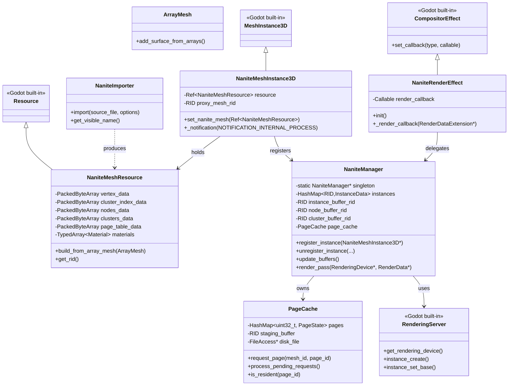
```mermaid
classDiagram
    class ArrayMesh {
        +add_surface_from_arrays()
    }
    class Resource {
        <<Godot built-in>>
    }
    class NaniteMeshResource {
        -PackedByteArray vertex_data
        -PackedByteArray cluster_index_data
        -PackedByteArray nodes_data
        -PackedByteArray clusters_data
        -PackedByteArray page_table_data
        -TypedArray~Material~ materials
        +build_from_array_mesh(ArrayMesh)
        +get_rid()
    }
    class NaniteImporter {
        +import(source_file, options)
        +get_visible_name()
    }
    class MeshInstance3D {
        <<Godot built-in>>
    }
    class NaniteMeshInstance3D {
        -Ref~NaniteMeshResource~ resource
        -RID proxy_mesh_rid
        +set_nanite_mesh(Ref~NaniteMeshResource~)
        +_notification(NOTIFICATION_INTERNAL_PROCESS)
    }
    class CompositorEffect {
        <<Godot built-in>>
        +set_callback(type, callable)
    }
    class NaniteRenderEffect {
        -Callable render_callback
        +init()
        +_render_callback(RenderDataExtension*)
    }
    class NaniteManager {
        -static NaniteManager* singleton
        -HashMap~RID,InstanceData~ instances
        -RID instance_buffer_rid
        -RID node_buffer_rid
        -RID cluster_buffer_rid
        -PageCache page_cache
        +register_instance(NaniteMeshInstance3D*)
        +unregister_instance(...)
        +update_buffers()
        +render_pass(RenderingDevice*, RenderData*)
    }
    class PageCache {
        -HashMap~uint32_t, PageState~ pages
        -RID staging_buffer
        -FileAccess* disk_file
        +request_page(mesh_id, page_id)
        +process_pending_requests()
        +is_resident(page_id)
    }
    class RenderingServer {
        <<Godot built-in>>
        +get_rendering_device()
        +instance_create()
        +instance_set_base()
    }

    Resource <|-- NaniteMeshResource
    MeshInstance3D <|-- NaniteMeshInstance3D
    CompositorEffect <|-- NaniteRenderEffect
    NaniteMeshInstance3D --> NaniteMeshResource : holds
    NaniteRenderEffect --> NaniteManager : delegates
    NaniteMeshInstance3D --> NaniteManager : registers
    NaniteManager --> PageCache : owns
    NaniteManager --> RenderingServer : uses
    NaniteImporter ..> NaniteMeshResource : produces
```

### 3.2 Godot 引擎流程修改入口

GDExtension 不能修改引擎源码,但可通过以下注册入口接入:

| 入口 | 注册方式 | 作用 |
|---|---|---|
| `ClassDB::register_class<NaniteMeshResource>()` | `GDExtension::library_init` | 注册自定义资源类型,可在编辑器中创建/序列化 |
| `ClassDB::register_class<NaniteImporter>()` + `add_import_plugin` | `EditorPlugin` | 在 Mesh 导入时自动构建 Nanite 资源 |
| `ClassDB::register_class<NaniteRenderEffect>()` | GDExtension | 注册 `CompositorEffect` 子类 |
| `ClassDB::register_class<NaniteMeshInstance3D>()` | GDExtension | 自定义节点,挂载 Nanite 资源 |
| `Compositor.compositor_effects = [NaniteRenderEffect.new()]` | 编辑器/项目设置 | 把 effect 装入环境的 Compositor |
| `RenderingServer.get_rendering_device()` | 运行时 | 拿到 RD 直接发起 GPU pass |

**关键 callback 类型**(`RSE::CompositorEffectCallbackType`,见 `rendering_method.h`):

- `COMPOSITOR_EFFECT_CALLBACK_BEFORE_OPAQUE_PASS` — 我们的 culling + visibility buffer raster 主入口
- `COMPOSITOR_EFFECT_CALLBACK_AFTER_OPAQUE_PASS` — 把 visibility buffer shading 结果合并到主 color buffer
- `COMPOSITOR_EFFECT_CALLBACK_AFTER_SHADOWS_PASS` — 生成 Nanite 阴影几何(可选)

### 3.3 渲染管线流程

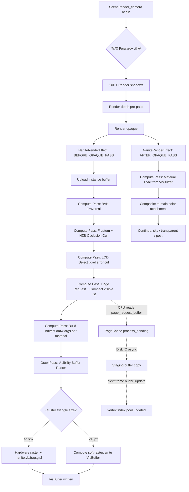
```mermaid
flowchart TD
    A[Scene render_camera begin] --> B{标准 Forward+ 流程}
    B --> B1[Cull + Render shadows]
    B1 --> B2[Render depth pre-pass]
    B2 --> B3[Render opaque]
    B3 --> E[NaniteRenderEffect: BEFORE_OPAQUE_PASS]

    E --> E1[Upload instance buffer]
    E1 --> E2[Compute Pass: BVH Traversal]
    E2 --> E3[Compute Pass: Frustum + HZB Occlusion Cull]
    E3 --> E4[Compute Pass: LOD Select pixel error cut]
    E4 --> E5[Compute Pass: Page Request + Compact visible list]
    E5 --> E6[Compute Pass: Build indirect draw args per material]

    E6 --> R1[Draw Pass: Visibility Buffer Raster]
    R1 --> R1a{Cluster triangle size?}
    R1a -- "≥16px" --> R1b[Hardware raster + nanite.vb.frag.glsl]
    R1a -- "<16px" --> R1c[Compute soft-raster: write VisBuffer]
    R1b --> R1d[VisBuffer written]
    R1c --> R1d

    B3 --> F[NaniteRenderEffect: AFTER_OPAQUE_PASS]
    F --> F1[Compute Pass: Material Eval from VisBuffer]
    F1 --> F2[Composite to main color attachment]
    F2 --> G[Continue: sky / transparent / post]

    %% Async page-in path
    E5 -.->|CPU reads page_request_buffer| P1[PageCache.process_pending]
    P1 -.->|Disk IO async| P2[Staging buffer copy]
    P2 -.->|Next frame buffer_update| P3[vertex/index pool updated]
```

### 3.4 时序图 — 单帧渲染

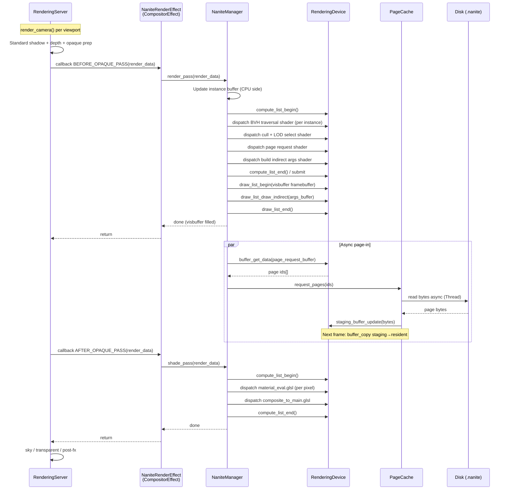
```mermaid
sequenceDiagram
    participant Godot as RenderingServer
    participant CE as NaniteRenderEffect<br/>(CompositorEffect)
    participant Mgr as NaniteManager
    participant RD as RenderingDevice
    participant PC as PageCache
    participant Disk as Disk (.nanite)

    Note over Godot: render_camera() per viewport
    Godot->>Godot: Standard shadow + depth + opaque prep
    Godot->>CE: callback BEFORE_OPAQUE_PASS(render_data)
    CE->>Mgr: render_pass(render_data)
    Mgr->>Mgr: Update instance buffer (CPU side)
    Mgr->>RD: compute_list_begin()
    Mgr->>RD: dispatch BVH traversal shader (per instance)
    Mgr->>RD: dispatch cull + LOD select shader
    Mgr->>RD: dispatch page request shader
    Mgr->>RD: dispatch build indirect args shader
    Mgr->>RD: compute_list_end() / submit
    Mgr->>RD: draw_list_begin(visbuffer framebuffer)
    Mgr->>RD: draw_list_draw_indirect(args_buffer)
    Mgr->>RD: draw_list_end()
    Mgr-->>CE: done (visbuffer filled)
    CE-->>Godot: return

    par Async page-in
        Mgr->>RD: buffer_get_data(page_request_buffer)
        RD-->>Mgr: page ids[]
        Mgr->>PC: request_pages(ids)
        PC->>Disk: read bytes async (Thread)
        Disk-->>PC: page bytes
        PC->>RD: staging_buffer_update(bytes)
        Note over PC,RD: Next frame: buffer_copy staging→resident
    end

    Godot->>CE: callback AFTER_OPAQUE_PASS(render_data)
    CE->>Mgr: shade_pass(render_data)
    Mgr->>RD: compute_list_begin()
    Mgr->>RD: dispatch material_eval.glsl (per pixel)
    Mgr->>RD: dispatch composite_to_main.glsl
    Mgr->>RD: compute_list_end()
    Mgr-->>CE: done
    CE-->>Godot: return
    Godot->>Godot: sky / transparent / post-fx
```

### 3.5 关键代码骨架

```cpp
// nanite_render_effect.cpp (GDExtension)
void NaniteRenderEffect::_bind_methods() {
    ClassDB::bind_method(D_METHOD("_render_callback", "render_data"), &NaniteRenderEffect::_render_callback);
}

void NaniteRenderEffect::init() {
    // 注入到 BEFORE_OPAQUE_PASS 与 AFTER_OPAQUE_PASS
    set_callback(RSE::COMPOSITOR_EFFECT_CALLBACK_BEFORE_OPAQUE_PASS,
                 Callable(this, StringName("_render_callback")));
    set_callback(RSE::COMPOSITOR_EFFECT_CALLBACK_AFTER_OPAQUE_PASS,
                 Callable(this, StringName("_render_callback")));
}

void NaniteRenderEffect::_render_callback(const Ref<RenderDataExtension> &p_render_data) {
    RenderingDevice *rd = RenderingServer::get_singleton()->get_rendering_device();
    NaniteManager *mgr = NaniteManager::singleton;

    auto cb_type = get_active_callback_type();
    if (cb_type == RSE::COMPOSITOR_EFFECT_CALLBACK_BEFORE_OPAQUE_PASS) {
        mgr->cull_and_raster_pass(rd, p_render_data);   // 填充 visibility buffer
    } else if (cb_type == RSE::COMPOSITOR_EFFECT_CALLBACK_AFTER_OPAQUE_PASS) {
        mgr->material_eval_and_composite_pass(rd, p_render_data);
    }
}
```

```glsl
// nanite_cull.glsl (compute) - BVH 遍历 + 剔除 + LOD 选择
#[compute]
#version 450
layout(local_size_x = 64) in;
layout(set=0,binding=0,std430) buffer Instances { InstanceData d[]; } instances;
layout(set=0,binding=1,std430) readonly buffer Nodes { Node n[]; } nodes;
layout(set=0,binding=2,std430) readonly buffer Clusters { Cluster c[]; } clusters;
layout(set=0,binding=3,std430) writeonly buffer VisibleList { uint idx[]; } visible;
layout(set=0,binding=4,std430) buffer Counter { uint count; } counter;
layout(set=0,binding=5) uniform CameraData { mat4 view_proj; vec3 cam_pos; float error_threshold; };
layout(set=0,binding=6) uniform sampler2D hzb_prev;

void main() {
    uint inst_id = gl_GlobalInvocationID.x;
    if (inst_id >= instance_count) return;
    InstanceData inst = instances.d[inst_id];

    // 栈式 BVH 遍历
    uint stack[32]; int sp = 0;
    stack[sp++] = inst.root_node;
    while (sp > 0) {
        uint n = stack[--sp];
        Node node = nodes.n[n];
        AABB world_aabb = transform_aabb(node.bounds, inst.transform);
        if (!frustum_visible(world_aabb)) continue;
        if (hzb_occluded(world_aabb, hzb_prev)) continue;

        float screen_scale = projected_screen_scale(world_aabb, view_proj);
        if (node.error * screen_scale <= error_threshold) {
            // 命中 cut,写入可见 cluster 列表
            for (uint i = 0; i < node.cluster_count; i++) {
                uint slot = atomicAdd(counter.count, 1);
                visible.idx[slot] = node.first_cluster + i;
            }
        } else if (node.left_child != 0xFFFFFFFF) {
            stack[sp++] = node.left_child;
            stack[sp++] = node.right_child;
        }
    }
}
```

### 3.6 优缺点

**优点**:
- **零引擎改动**,可独立分发(.so/.dll + .gdextension 文件),兼容官方构建;
- 适合快速原型验证,无需维护引擎 fork;
- `CompositorEffect` 是官方扩展点,稳定性较好。

**缺点**:
- **性能开销**:每帧通过 Callable 跨边界调用、SSBO 资源不能与引擎共享、可见性结果只能通过 framebuffer 复制回流;
- **无法接管 Godot 原生材质系统**:必须实现自己的材质管线,StandardMaterial3D 需要采样到自己的着色器;
- **阴影/GI 集成困难**:引擎的 shadow pass 不会调用 CompositorEffect;需要把 Nanite 几何单独写一遍深度到 shadow map;
- **GDExtension 二进制平台兼容**:需要为每个平台编译;
- **磁盘流式加载**:`FileAccess` 不能在 compute shader 内发起,只能环形 buffer + CPU 中转;
- **可见性跳过主渲染**:BEFORE_OPAQUE_PASS 之后场景中 Nanite 实例的"代理 mesh"还得显式 hide,否则会被引擎当作普通 mesh 渲染。

---

## 4. 方案二:独立 C++ Module

**核心思想**:作为 `modules/nanite/` 编译进引擎。比 GDExtension 强的是:可访问引擎私有头、可在 ClassDB 注册新 server 类型、可在 `RenderingServerDefault` 中添加新方法、`Importer`/`EditorInspectorPlugin` 直接用 C++ 写、能与现有 MeshStorage 共享 RD buffer。

仍然**不修改** Forward+ 渲染方法本体,而是通过以下两种手段之一接入:
- (a) 与方案一一样,通过 `CompositorEffect` 注入,但用 C++ 直接调用;
- (b) **新增 `NaniteSceneRenderStep` 并在 `RendererSceneCull::render_camera` 调用链中插入**(此为模块可做到、GDExtension 做不到的边界)。

### 4.1 模块布局

```
modules/nanite/
├── SCsub
├── config.py
├── register_types.cpp             # 模块入口:register_nanite_types()
├── nanite_storage.h/.cpp         # NaniteStorage 单例(类比 MeshStorage)
├── nanite_resource.h/.cpp        # NaniteMeshResource (Resource)
├── nanite_importer.h/.cpp        # EditorResourceImporter + import plugin
├── nanite_mesh_instance_3d.h/.cpp# 节点
├── nanite_render_step.h/.cpp     # 渲染步骤(注册到 scene render)
├── nanite_compositor_effect.h/.cpp
├── nanite_manager.h/.cpp         # 运行时管理
├── page_cache.h/.cpp             # 流式加载
├── offline/
│   ├── mesh_clusterer.h/.cpp     # 切 128 tri cluster
│   ├── mesh_simplifier.h/.cpp    # QEM 简化
│   └── nanite_builder.h/.cpp     # 主流程
├── shaders/
│   ├── nanite_cull.glsl
│   ├── nanite_raster.vert.glsl
│   ├── nanite_raster.frag.glsl  # 输出 visibility buffer
│   ├── nanite_soft_raster.glsl  # compute 软光栅
│   ├── nanite_material_eval.glsl
│   └── nanite_hzb_build.glsl
└── editor/
    └── nanite_editor_plugin.h/.cpp
```

### 4.2 类图

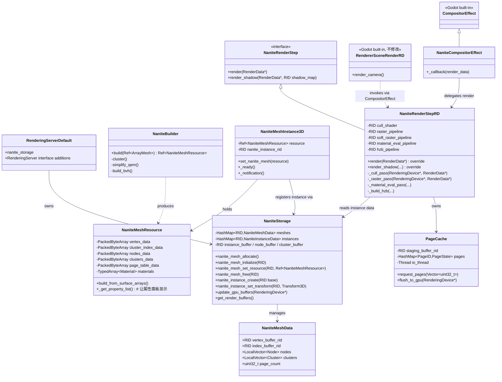
```mermaid
classDiagram
    class RenderingServerDefault {
        +nanite_storage
        +RenderingServer interface additions
    }
    class NaniteStorage {
        -HashMap~RID,NaniteMeshData~ meshes
        -HashMap~RID,NaniteInstanceData~ instances
        -RID instance_buffer / node_buffer / cluster_buffer
        +nanite_mesh_allocate()
        +nanite_mesh_initialize(RID)
        +nanite_mesh_set_resource(RID, Ref~NaniteMeshResource~)
        +nanite_mesh_free(RID)
        +nanite_instance_create(RID base)
        +nanite_instance_set_transform(RID, Transform3D)
        +update_gpu_buffers(RenderingDevice*)
        +get_render_buffers()
    }
    class NaniteMeshData {
        +RID vertex_buffer_rid
        +RID index_buffer_rid
        +LocalVector~Node~ nodes
        +LocalVector~Cluster~ clusters
        +uint32_t page_count
    }
    class NaniteMeshResource {
        -PackedByteArray vertex_data
        -PackedByteArray cluster_index_data
        -PackedByteArray nodes_data
        -PackedByteArray clusters_data
        -PackedByteArray page_table_data
        -TypedArray~Material~ materials
        +build_from_surface_arrays()
        +_get_property_list()  # 让属性面板显示
    }
    class NaniteBuilder {
        +build(Ref~ArrayMesh~)  Ref~NaniteMeshResource~
        -cluster()
        -simplify_qem()
        -build_bvh()
    }
    class NaniteMeshInstance3D {
        -Ref~NaniteMeshResource~ resource
        -RID nanite_instance_rid
        +set_nanite_mesh(resource)
        +_ready()
        +_notification()
    }
    class NaniteRenderStep {
        <<interface>>
        +render(RenderData*)
        +render_shadow(RenderData*, RID shadow_map)
    }
    class NaniteRenderStepRD {
        -RID cull_shader
        -RID raster_pipeline
        -RID soft_raster_pipeline
        -RID material_eval_pipeline
        -RID hzb_pipeline
        +render(RenderData*)  override
        +render_shadow(...)  override
        -_cull_pass(RenderingDevice*, RenderData*)
        -_raster_pass(RenderingDevice*, RenderData*)
        -_material_eval_pass(...)
        -_build_hzb(...)
    }
    class RendererSceneRenderRD {
        <<Godot built-in, 不修改>>
        +render_camera()
    }
    class CompositorEffect {
        <<Godot built-in>>
    }
    class NaniteCompositorEffect {
        +_callback(render_data)
    }
    class PageCache {
        -RID staging_buffer_rid
        -HashMap~PageID,PageState~ pages
        -Thread io_thread
        +request_pages(Vector~uint32_t~)
        +flush_to_gpu(RenderingDevice*)
    }

    RenderingServerDefault --> NaniteStorage : owns
    NaniteStorage --> NaniteMeshData : manages
    NaniteBuilder ..> NaniteMeshResource : produces
    NaniteMeshInstance3D --> NaniteMeshResource : holds
    NaniteMeshInstance3D --> NaniteStorage : registers instance via
    NaniteRenderStep <|-- NaniteRenderStepRD
    NaniteRenderStepRD --> NaniteStorage : reads instance data
    NaniteRenderStepRD --> PageCache : owns
    CompositorEffect <|-- NaniteCompositorEffect
    NaniteCompositorEffect --> NaniteRenderStepRD : delegates render
    RendererSceneRenderRD ..> NaniteRenderStepRD : invokes via CompositorEffect
```

### 4.3 Godot 引擎流程修改入口

模块对引擎的"修改"通过以下方式(均不需要改引擎源码,而是在模块里追加):

| 入口 | 实现方式 | 作用 |
|---|---|---|
| `register_nanite_types()` | `register_types.cpp` 中 `ClassDB::register_class<>()` 各类型;`RendererStorageNanite` 添加到 `RS` | 类型注册 |
| 扩展 `RenderingServer` | 在 `RenderingServerDefault` 之外注册 `NaniteServer`(独立 Object),提供 `nanite_mesh_create/set_resource/instance_create` 等 | 新增 server,与 `RenderingServer` 平级 |
| `EditorPlugin` | `NaniteEditorPlugin`:`add_import_plugin`、`add_inspector_plugin` | 编辑器集成 |
| `Compositor` 默认 effect | 启动时若检测到 Nanite 资源,自动把 `NaniteCompositorEffect` 装入环境 Compositor | 自动激活渲染步骤 |
| `RendererSceneCull` 友元/钩子 | 通过新增 `instance_set_nanite(RID, bool)` 方法标记实例,Nanite 实例跳过 `RenderForwardClustered::_render_list` 的标准绘制 | 让原生渲染不重复绘制 Nanite |

**关键点**:`RenderingServerDefault` 是 Godot 中所有 server 的聚合体。模块可以在 `register_types.cpp` 中:

```cpp
// modules/nanite/register_types.cpp
void register_nanite_types() {
    ClassDB::register_class<NaniteMeshResource>();
    ClassDB::register_class<NaniteMeshInstance3D>();
    ClassDB::register_class<NaniteCompositorEffect>();

    // 注册独立 server
    NaniteServer::create_singleton();
    // 通过 RenderingServer 暴露
    RenderingServer::get_singleton()->_set_nanite_storage(NaniteServer::get_singleton()->get_storage());

    // 注册导入器
    if (Engine::get_singleton()->is_editor_hint()) {
        EditorNode::add_editor_plugin(memnew(NaniteEditorPlugin));
    }
}
```

### 4.4 渲染管线流程(同方案一,但走 C++ 直调)

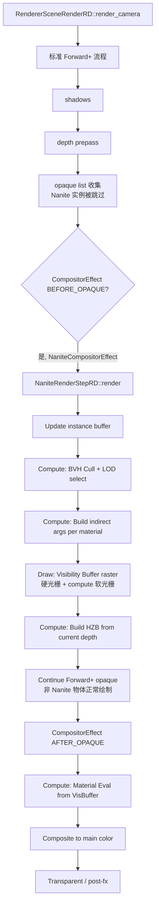
```mermaid
flowchart TD
    A[RendererSceneRenderRD::render_camera] --> B[标准 Forward+ 流程]
    B --> B1[shadows]
    B1 --> B2[depth prepass]
    B2 --> B3[opaque list 收集<br/>Nanite 实例被跳过]
    B3 --> C{CompositorEffect BEFORE_OPAQUE?}
    C -->|是, NaniteCompositorEffect| D[NaniteRenderStepRD::render]
    D --> D1[Update instance buffer]
    D1 --> D2[Compute: BVH Cull + LOD select]
    D2 --> D3[Compute: Build indirect args per material]
    D3 --> D4[Draw: Visibility Buffer raster<br/>硬光栅 + compute 软光栅]
    D4 --> D5[Compute: Build HZB from current depth]
    D5 --> E[Continue Forward+ opaque<br/>非 Nanite 物体正常绘制]
    E --> F[CompositorEffect AFTER_OPAQUE]
    F --> F1[Compute: Material Eval from VisBuffer]
    F1 --> F2[Composite to main color]
    F2 --> G[Transparent / post-fx]
```

### 4.5 时序图

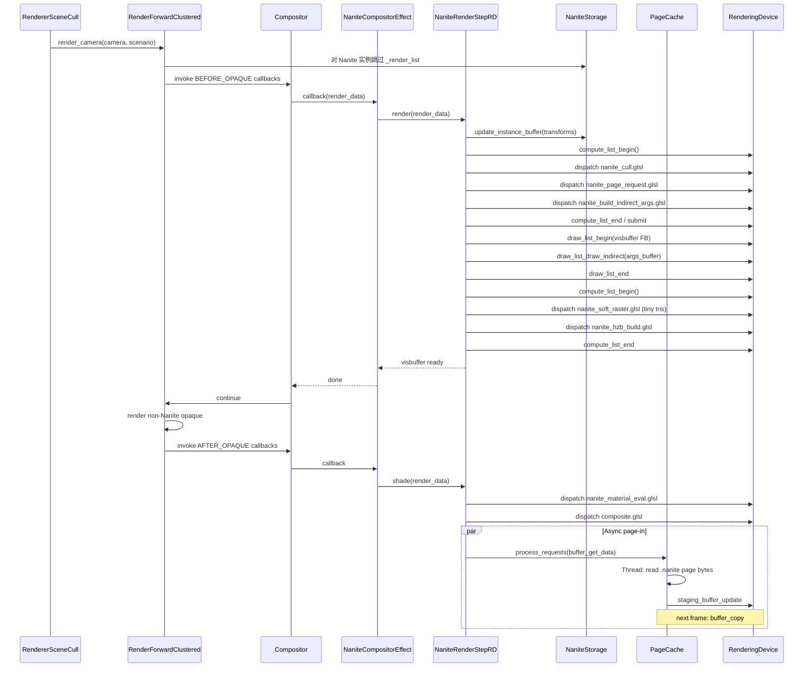
```mermaid
sequenceDiagram
    participant Scene as RendererSceneCull
    participant Std as RenderForwardClustered
    participant Comp as Compositor
    participant Eff as NaniteCompositorEffect
    participant Step as NaniteRenderStepRD
    participant Stor as NaniteStorage
    participant PC as PageCache
    participant RD as RenderingDevice

    Scene->>Std: render_camera(camera, scenario)
    Std->>Stor: 对 Nanite 实例跳过 _render_list
    Std->>Comp: invoke BEFORE_OPAQUE callbacks
    Comp->>Eff: callback(render_data)
    Eff->>Step: render(render_data)
    Step->>Stor: update_instance_buffer(transforms)
    Step->>RD: compute_list_begin()
    Step->>RD: dispatch nanite_cull.glsl
    Step->>RD: dispatch nanite_page_request.glsl
    Step->>RD: dispatch nanite_build_indirect_args.glsl
    Step->>RD: compute_list_end / submit
    Step->>RD: draw_list_begin(visbuffer FB)
    Step->>RD: draw_list_draw_indirect(args_buffer)
    Step->>RD: draw_list_end
    Step->>RD: compute_list_begin()
    Step->>RD: dispatch nanite_soft_raster.glsl (tiny tris)
    Step->>RD: dispatch nanite_hzb_build.glsl
    Step->>RD: compute_list_end
    Step-->>Eff: visbuffer ready
    Eff-->>Comp: done
    Comp->>Std: continue
    Std->>Std: render non-Nanite opaque
    Std->>Comp: invoke AFTER_OPAQUE callbacks
    Comp->>Eff: callback
    Eff->>Step: shade(render_data)
    Step->>RD: dispatch nanite_material_eval.glsl
    Step->>RD: dispatch composite.glsl
    par Async page-in
        Step->>PC: process_requests(buffer_get_data)
        PC->>PC: Thread: read .nanite page bytes
        PC->>RD: staging_buffer_update
        Note over PC,RD: next frame: buffer_copy
    end
```

### 4.6 优缺点

**优点**:
- 比 GDExtension 性能更高(零跨语言边界);
- 可与 `MeshStorage` 共享 RD buffer(节省一份顶点池);
- 可注册独立 server,API 更自然(`RS::nanite_*`);
- 编辑器插件原生 C++,可定制 Inspector、importer、gizmo;
- 不维护引擎 fork,升级时只需重新编译模块。

**缺点**:
- 仍不能改 Forward+ 内部 pass 组织(只能"插入前后");
- Nanite 阴影仍需自己实现(可在 `_render_shadow` 中自己写深度);
- 透明物体、特效shader 仍走 Godot 标准;
- 模块虽不修改源码,但需要重新编译引擎,意味着分发的二进制含模块。

---

## 5. 方案三:深度引擎改造

**核心思想**:把 Nanite 提升为引擎一等公民。在 `RenderingServer` / `RenderingMethod` / `RendererSceneCull` 中原生支持 Nanite mesh,Forward+ / Mobile 渲染方法内部新增 Nanite pass,与材质/阴影/GI 完全打通。

### 5.1 引擎源码改动清单

| 文件 | 改动 | 用途 |
|---|---|---|
| `servers/rendering/rendering_server.h/.cpp` | 新增 `nanite_*` 系列方法、新 RID 类型 | API 入口 |
| `servers/rendering/rendering_server_default.h/.cpp` | 把 `NaniteStorage` 纳入,转发调用 | 默认 server |
| `servers/rendering/storage/nanite_storage.h`(新) | 接口定义 | 新增 storage 抽象 |
| `servers/rendering/renderer_rd/storage_rd/nanite_storage_rd.h/.cpp`(新) | RD 实现 | 实现 |
| `servers/rendering/rendering_method.h` | 新增 `nanite_*` 虚函数 + 在 `render_camera` 中插入 Nanite pass 调用 | 抽象层 |
| `servers/rendering/renderer_rd/forward_clustered/render_forward_clustered.h/.cpp` | 新增 `_nanite_cull_pass`、`_nanite_raster_pass`、`_nanite_material_eval_pass` 方法,在 `_render_scene` 中按位序调用 | 真正的渲染管线改造 |
| `servers/rendering/renderer_rd/forward_clustered/scene_shader_forward_clustered.h/.cpp` | 新增 `NaniteShader` 子结构 | 着色器组织 |
| `servers/rendering/renderer_scene_cull.h/.cpp` | Nanite 实例跳过标准 cull,转交 GPU-driven 流水线;`instance_set_nanite(RID,bool)` | 剔除路径改造 |
| `scene/resources/mesh.h/.cpp` | 新增 `Mesh::SURFACE_NANITE` surface 类型 | Mesh 类型扩展 |
| `scene/resources/nanite_mesh.h/.cpp`(新) | `NaniteMesh` Resource | 新资源 |
| `scene/3d/mesh_instance_3d.h/.cpp` | 新增 `set_nanite_mesh()` + 自动创建 Nanite instance | 节点集成 |
| `scene/resources/importer_mesh.h/.cpp` | 导入时若 mesh 面数 > 阈值自动构建 Nanite | 自动构建 |
| `servers/rendering/renderer_rd/storage_rd/mesh_storage.h/.cpp` | `mesh_add_surface` 支持 `SURFACE_NANITE`,直接拿 Nanite resource | storage 兼容 |

### 5.2 类图(改动以红色标注)

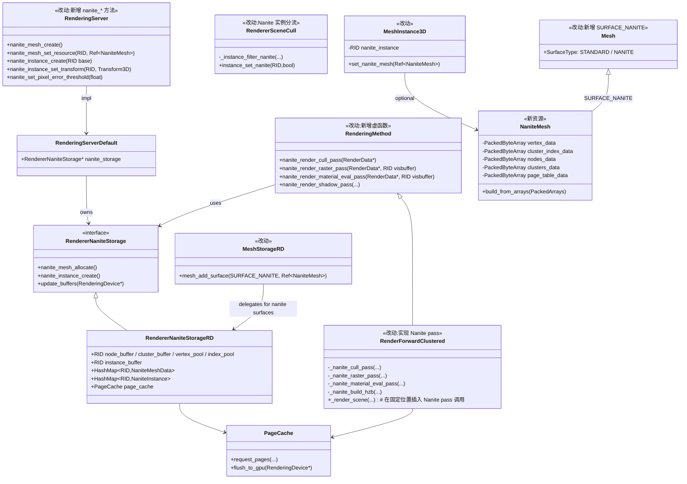
```mermaid
classDiagram
    class RenderingServer {
        <<改动:新增 nanite_* 方法>>
        +nanite_mesh_create()
        +nanite_mesh_set_resource(RID, Ref~NaniteMesh~)
        +nanite_instance_create(RID base)
        +nanite_instance_set_transform(RID, Transform3D)
        +nanite_set_pixel_error_threshold(float)
    }
    class RenderingServerDefault {
        +RendererNaniteStorage* nanite_storage
    }
    class RendererNaniteStorage {
        <<interface>>
        +nanite_mesh_allocate()
        +nanite_instance_create()
        +update_buffers(RenderingDevice*)
    }
    class RendererNaniteStorageRD {
        +RID node_buffer / cluster_buffer / vertex_pool / index_pool
        +RID instance_buffer
        +HashMap~RID,NaniteMeshData~
        +HashMap~RID,NaniteInstance~
        +PageCache page_cache
    }
    class RenderingMethod {
        <<改动:新增虚函数>>
        +nanite_render_cull_pass(RenderData*)
        +nanite_render_raster_pass(RenderData*, RID visbuffer)
        +nanite_render_material_eval_pass(RenderData*, RID visbuffer)
        +nanite_render_shadow_pass(...)
    }
    class RenderForwardClustered {
        <<改动:实现 Nanite pass>>
        -_nanite_cull_pass(...)
        -_nanite_raster_pass(...)
        -_nanite_material_eval_pass(...)
        -_nanite_build_hzb(...)
        +_render_scene(...) # 在固定位置插入 Nanite pass 调用
    }
    class RendererSceneCull {
        <<改动:Nanite 实例分流>>
        -_instance_filter_nanite(...)
        +instance_set_nanite(RID,bool)
    }
    class Mesh {
        <<改动:新增 SURFACE_NANITE>>
        +SurfaceType: STANDARD / NANITE
    }
    class NaniteMesh {
        <<新资源>>
        -PackedByteArray vertex_data
        -PackedByteArray cluster_index_data
        -PackedByteArray nodes_data
        -PackedByteArray clusters_data
        -PackedByteArray page_table_data
        +build_from_arrays(PackedArrays)
    }
    class MeshInstance3D {
        <<改动>>
        +set_nanite_mesh(Ref~NaniteMesh~)
        -RID nanite_instance
    }
    class MeshStorageRD {
        <<改动>>
        +mesh_add_surface(SURFACE_NANITE, Ref~NaniteMesh~)
    }
    class PageCache {
        +request_pages(...)
        +flush_to_gpu(RenderingDevice*)
    }

    RenderingServer --> RenderingServerDefault : impl
    RenderingServerDefault --> RendererNaniteStorage : owns
    RendererNaniteStorage <|-- RendererNaniteStorageRD
    RenderingMethod <|-- RenderForwardClustered
    RenderingMethod --> RendererNaniteStorage : uses
    RenderForwardClustered --> PageCache
    RendererNaniteStorageRD --> PageCache
    Mesh <|-- NaniteMesh : SURFACE_NANITE
    MeshInstance3D --> NaniteMesh : optional
    MeshStorageRD --> RendererNaniteStorageRD : delegates for nanite surfaces
```

### 5.3 渲染管线流程 — 重构后

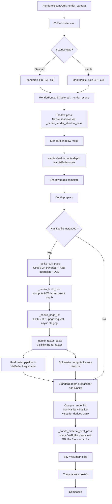
```mermaid
flowchart TD
    A[RendererSceneCull::render_camera] --> B[Collect instances]
    B --> C{Instance type?}
    C -->|Standard| D[Standard CPU BVH cull]
    C -->|Nanite| E[Mark nanite, skip CPU cull]
    D --> F[RenderForwardClustered::_render_scene]
    E --> F

    F --> P0[Shadow pass:<br/>Nanite shadows via _nanite_render_shadow_pass]
    P0 --> P0a[Standard shadow maps]
    P0a --> P1[Nanite shadow: write depth via VisBuffer-style]
    P1 --> P2[Shadow maps complete]

    P2 --> G[Depth prepass]
    G --> G1{Has Nanite instances?}
    G1 -->|Yes| H[_nanite_cull_pass:<br/>GPU BVH traversal + HZB occlusion + LOD]
    H --> H1[_nanite_build_hzb:<br/>compute HZB from current depth]
    H1 --> H2[_nanite_page_in:<br/>GPU→CPU page request, async staging]
    H2 --> I[_nanite_raster_pass:<br/>Visibility Buffer raster]
    I --> I1[Hard raster pipeline + VisBuffer frag shader]
    I --> I2[Soft raster compute for sub-pixel tris]
    I1 --> J[Standard depth prepass for non-Nanite]
    I2 --> J
    G1 -->|No| J

    J --> K[Opaque render list<br/>non-Nanite + Nanite-visbuffer-derived draw]

    K --> L[_nanite_material_eval_pass:<br/>shade VisBuffer pixels into GBuffer / forward color]
    L --> M[Sky / volumetric fog]
    M --> N[Transparent / post-fx]
    N --> O[Composite]
```

### 5.4 时序图

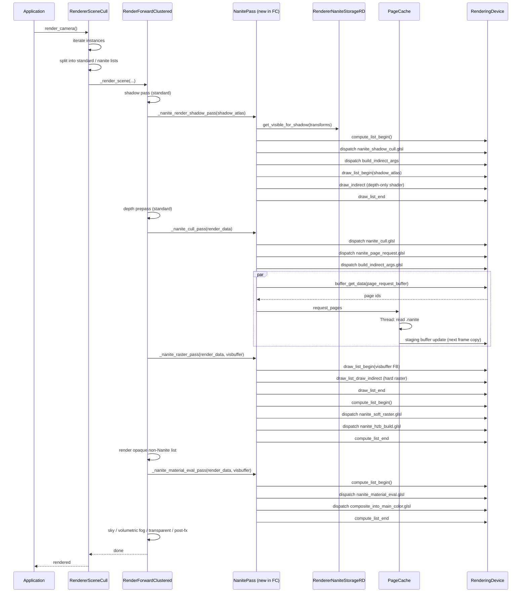
```mermaid
sequenceDiagram
    participant App as Application
    participant Cull as RendererSceneCull
    participant FC as RenderForwardClustered
    participant Nanite as NanitePass (new in FC)
    participant Stor as RendererNaniteStorageRD
    participant PC as PageCache
    participant RD as RenderingDevice

    App->>Cull: render_camera()
    Cull->>Cull: iterate instances
    Cull->>Cull: split into standard / nanite lists
    Cull->>FC: _render_scene(...)
    FC->>FC: shadow pass (standard)
    FC->>Nanite: _nanite_render_shadow_pass(shadow_atlas)
    Nanite->>Stor: get_visible_for_shadow(transforms)
    Nanite->>RD: compute_list_begin()
    Nanite->>RD: dispatch nanite_shadow_cull.glsl
    Nanite->>RD: dispatch build_indirect_args
    Nanite->>RD: draw_list_begin(shadow_atlas)
    Nanite->>RD: draw_indirect (depth-only shader)
    Nanite->>RD: draw_list_end

    FC->>FC: depth prepass (standard)
    FC->>Nanite: _nanite_cull_pass(render_data)
    Nanite->>RD: dispatch nanite_cull.glsl
    Nanite->>RD: dispatch nanite_page_request.glsl
    Nanite->>RD: dispatch build_indirect_args.glsl
    par
        Nanite->>RD: buffer_get_data(page_request_buffer)
        RD-->>Nanite: page ids
        Nanite->>PC: request_pages
        PC->>PC: Thread: read .nanite
        PC->>RD: staging buffer update (next frame copy)
    end

    FC->>Nanite: _nanite_raster_pass(render_data, visbuffer)
    Nanite->>RD: draw_list_begin(visbuffer FB)
    Nanite->>RD: draw_list_draw_indirect (hard raster)
    Nanite->>RD: draw_list_end
    Nanite->>RD: compute_list_begin()
    Nanite->>RD: dispatch nanite_soft_raster.glsl
    Nanite->>RD: dispatch nanite_hzb_build.glsl
    Nanite->>RD: compute_list_end

    FC->>FC: render opaque non-Nanite list
    FC->>Nanite: _nanite_material_eval_pass(render_data, visbuffer)
    Nanite->>RD: compute_list_begin()
    Nanite->>RD: dispatch nanite_material_eval.glsl
    Nanite->>RD: dispatch composite_into_main_color.glsl
    Nanite->>RD: compute_list_end

    FC->>FC: sky / volumetric fog / transparent / post-fx
    FC-->>Cull: done
    Cull-->>App: rendered
```

### 5.5 关键代码片段

#### `render_forward_clustered.h` 新增声明

```cpp
class RenderForwardClustered : public RendererSceneRenderRD {
    // ... existing members ...

    // ===== Nanite (新增) =====
    struct NaniteShader {
        RD::PipelineID cull_pipeline;
        RD::PipelineID page_request_pipeline;
        RD::PipelineID build_indirect_args_pipeline;
        RD::PipelineID soft_raster_pipeline;
        RD::PipelineID hzb_build_pipeline;
        RD::PipelineID material_eval_pipeline;
        RD::PipelineID composite_pipeline;
        RD::PipelineID shadow_cull_pipeline;
        // uniform sets, etc.
    } nanite_shader;

    RID nanite_visbuffer;             // R32G32_UINT, W×H
    RID nanite_hzb;                   // mipmap pyramid
    RID nanite_visible_cluster_buffer;
    RID nanite_indirect_args_buffer;
    RID nanite_page_request_buffer;

    void _nanite_cull_pass(RenderDataRD *p_render_data);
    void _nanite_raster_pass(RenderDataRD *p_render_data);
    void _nanite_material_eval_pass(RenderDataRD *p_render_data);
    void _nanite_render_shadow_pass(RenderDataRD *p_render_data, RID p_shadow_atlas);
    void _nanite_build_hzb(RenderDataRD *p_render_data);
    void _nanite_process_page_requests(); // 提交到 PageCache
};
```

#### `_render_scene` 改造(简化示意)

```cpp
void RenderForwardClustered::_render_scene(RenderDataRD *p_render_data, ...) {
    // 1. Standard shadow pass
    _render_shadows(p_render_data, ...);

    // 2. NEW: Nanite shadow pass
    if (p_render_data->has_nanite_instances) {
        _nanite_render_shadow_pass(p_render_data, p_shadow_atlas);
    }

    // 3. Standard depth prepass
    if (depth_prepass) {
        _render_depth_prepass(p_render_data, ...);
    }

    // 4. NEW: Nanite cull + raster (writes visibility buffer)
    if (p_render_data->has_nanite_instances) {
        _nanite_cull_pass(p_render_data);
        _nanite_process_page_requests();
        _nanite_raster_pass(p_render_data);
        _nanite_build_hzb(p_render_data);
    }

    // 5. Standard opaque list (non-Nanite)
    _renderOpaqueForward(p_render_data, ...);

    // 6. NEW: Nanite material evaluation
    if (p_render_data->has_nanite_instances) {
        _nanite_material_eval_pass(p_render_data);
    }

    // 7. sky / transparent / post-fx (unchanged)
    _render_sky(...);
    _render_transparent(...);
    _render_postfx(...);
}
```

#### `renderer_scene_cull.cpp` 改造

```cpp
void RendererSceneCull::_instance_initialize(RID p_instance) {
    // ... existing ...
    instance->nanite = false;  // 新增字段
}

void RendererSceneCull::instance_set_nanite(RID p_instance, bool p_enabled) {
    Instance *instance = instance_owner.get_or_null(p_instance);
    ERR_FAIL_NULL(instance);
    instance->nanite = p_enabled;
}

// 在 _render_camera 中分流:
void RendererSceneCull::_render_camera(...) {
    // 收集实例时分流
    LocalVector<Instance*, Alloca> standard_instances;
    LocalVector<Instance*, Alloca> nanite_instances;
    for (Instance *inst : visible_instances) {
        if (inst->nanite) nanite_instances.push_back(inst);
        else standard_instances.push_back(inst);
    }
    // Nanite:跳过标准 cull,直接打包 transform + mesh_id 到 GPU buffer
    RSG::nanite_storage->update_instances(nanite_instances);
    // Standard:走原来的 BVH cull
    _cull_standard_instances(standard_instances, ...);

    rendering_method->render_camera(..., /* has_nanite = */ !nanite_instances.empty());
}
```

### 5.6 优缺点

**优点**:
- 与 Godot 完全打通:StandardMaterial3D、阴影、GI、SSR、SSAO、VoxelGI、LightmapGI 全部直接可用;
- 性能最优:无跨边界开销,buffer/texture 全引擎共享,可与 cluster lighting 的 light grid 复用;
- 编辑器无缝集成:Inspector / Gizmo / Importer 全部原生;
- 可借力 Forward+ 的 cluster lighting,把 Nanite 输出的 G-Buffer 与 forward+ 着色一致。

**缺点**:
- 维护 fork:跟随上游升级成本高,需 rebase;
- 代码审查门槛高:渲染核心改动需谨慎;
- 推广困难:需说服社区接受才能进入主干(否则永久 fork)。

---

## 6. 三方案横向对比与推荐实施路径

### 6.1 对比表

| 维度 | 方案一:GDExtension | 方案二:C++ Module | 方案三:深度改造 |
|---|---|---|---|
| 引擎改动 | 无 | 仅添加新文件 | 大量修改核心文件 |
| 分发 | 单独 .so/.dll + .gdextension | 重新编译引擎 | 维护 fork |
| 性能 | 跨语言边界,中 | 原生 C++,高 | 最高,无边界 |
| 阴影/GI 集成 | 需自实现,困难 | 需自实现,中等 | 完全打通 |
| 材质系统 | 自定义材质管线 | 自定义,但可复用 StandardMaterial 数据 | 直接复用 StandardMaterial3D |
| 编辑器集成 | EditorPlugin,可用 | EditorPlugin,更顺 | 原生 Inspector/Gizmo |
| 升级跟随 | 容易(只跟 API 表面) | 中(随 module 重新编译) | 困难(rebase fork) |
| 实现工作量 | 中 | 中-高 | 高 |
| 上游合并可能 | 不可(纯扩展) | 可能(若作为可选 module) | 需提案 + PR review |
| 适合场景 | 原型验证 / 商业插件 | 生产部署 / 跨项目复用 | 长期演进 / 引擎团队 |

### 6.2 推荐实施路径

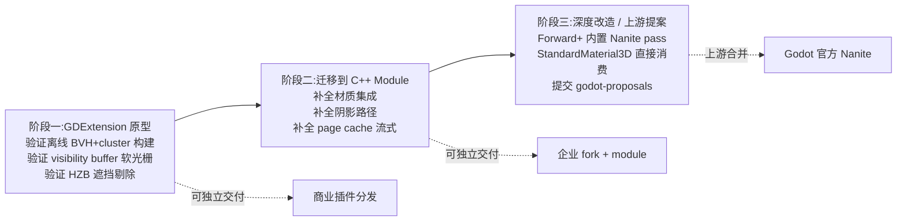
```mermaid
flowchart LR
    P1[阶段一:GDExtension 原型<br/>验证离线 BVH+cluster 构建<br/>验证 visibility buffer 软光栅<br/>验证 HZB 遮挡剔除]
    P2[阶段二:迁移到 C++ Module<br/>补全材质集成<br/>补全阴影路径<br/>补全 page cache 流式]
    P3[阶段三:深度改造 / 上游提案<br/>Forward+ 内置 Nanite pass<br/>StandardMaterial3D 直接消费<br/>提交 godot-proposals]

    P1 --> P2 --> P3
    P1 -. 可独立交付 .-> D1[商业插件分发]
    P2 -. 可独立交付 .-> D2[企业 fork + module]
    P3 -. 上游合并 .-> D3[Godot 官方 Nanite]
```

**实施建议**:
1. **先做方案一**:用最小代码量验证算法正确性(离线 cluster/BVH + 运行时 cull + VisBuffer),用 stress test mesh 验证渲染结果;
2. **过渡到方案二**:把 GDExtension 实现平移到 module,补全材质/阴影路径;此阶段已可投入生产;
3. **选择性进入方案三**:若长期目标是为 Godot 社区提供 Nanite 能力,以 module 起步、积累用户后开 `godot-proposals` 提案,推进核心集成。

### 6.3 关键风险与对策

| 风险 | 影响 | 对策 |
|---|---|---|
| Godot 的 `CompositorEffect` API 仍较新,行为在不同版本间可能变化 | 方案一/二 callback 行为漂移 | 锁定 4.x LTS 版本,抽象 callback 层 |
| 软光栅化在低端 GPU 上 compute 占用大 | 移动端不可用 | 提供像素阈值回退到硬光栅;移动端默认关闭 |
| 磁盘流式加载抖动 | 视野快速移动时画面跳变 | 多帧预读 + 优先级队列(基于像素预算) |
| 多材质/multi-surface mesh 索引混乱 | 间接绘制 args 分组错误 | 离线阶段为每个 cluster 记录 `material_index` |
| GDExtension 跨平台编译复杂 | 分发困难 | 使用 prebuilt + github actions 多平台矩阵 |
| Fork 升级冲突 | 长期维护成本高 | 把改动尽量集中在新增文件,核心文件改动用 patch 描述 |

---

## 附录 A:核心 RD Shader 概览

| Shader | 类型 | 输入 | 输出 |
|---|---|---|---|
| `nanite_cull.glsl` | compute(64) | instance/node/cluster buffers, prev HZB, view-proj | visible_cluster_buffer + counter |
| `nanite_page_request.glsl` | compute(1) | visible_cluster_buffer, page residency texture | page_request_buffer |
| `nanite_build_indirect_args.glsl` | compute(64) | visible_cluster_buffer | indirect_args_buffer (per material) |
| `nanite_raster.vert/.frag.glsl` | graphics | vertex_pool, index_pool, cluster_buffer | visbuffer (R32G32_UINT) |
| `nanite_soft_raster.glsl` | compute(8x8) | visible_cluster_buffer (small tris subset) | visbuffer |
| `nanite_hzb_build.glsl` | compute(8x8) | depth buffer | hzb mipmap pyramid |
| `nanite_material_eval.glsl` | compute(8x8) | visbuffer, vertex_pool, materials, G-buffer | shaded color per pixel |
| `nanite_composite.glsl` | compute(8x8) | shaded color | main color attachment |
| `nanite_shadow_cull.glsl` | compute(64) | instance/node buffers, light view-proj | indirect draw args for shadow depth |

## 7. Nanite 与 Godot 阴影/Forward 渲染的搭配

本节专门讨论 Nanite 在 **Forward+(及 Mobile)** 渲染管线中如何与**标准 Forward 几何**、**阴影渲染**正确共存,核心问题是: Nanite 走自己的 GPU-Driven 流水线,而 Godot 原生 mesh 仍走标准 forward + shadow pass;两类几何必须共享同一份 shadow atlas / G-Buffer / 光照数据,避免互相覆盖或漏绘。

### 7.1 Godot 阴影/Forward 渲染管线现状(源码依据)

`RenderForwardClustered::_render_scene`(`servers/rendering/renderer_rd/forward_clustered/render_forward_clustered.cpp:1704`)整体顺序:

```
_render_scene
├─ _update_sdfgi / voxel_gi_setup        (GI 准备)
├─ _render_shadow_begin                   (清空 SECONDARY list)
│   ├─ for cube_shadows:    _render_shadow_pass(...)   // OmniLight cube shadow 单独处理
│   ├─ update_directional_shadow_atlas (clear depth)
│   ├─ _render_shadow_begin()
│   ├─ for directional_shadows: _render_shadow_pass(...) // PSSM 多 split
│   ├─ for positional_shadows: _render_shadow_pass(...)  // SpotLight
│   ├─ _render_shadow_process()                          // _fill_render_list(SECONDARY) + _fill_instance_data
│   └─ _render_shadow_end()                              // _render_list_with_draw_list → 写 depth
│       ‖ (与 GI 并行)
├─ gi.process_gi                          (SDFGI / VoxelGI)
├─ _update_volumetric_fog
├─ _process_ssao / _process_ssr / _process_ssil
├─ current_cluster_builder->bake_cluster()                // clustered lighting grid
├─ _renderOpaqueForward(p_render_data, ...)              // 标准 forward 不透明
│   ‖ 触发 CompositorEffect: BEFORE_OPAQUE_PASS / AFTER_OPAQUE_PASS
├─ _render_sky / _render_sky_fog
├─ _render_transparent
└─ post-process (TAA / DOF / Bloom / Tonemap ...)
```

阴影 pass 内部(`_render_shadow_append`,`render_forward_clustered.cpp:2806`):
1. 用光视图 `light_projection` / `light_transform` 构造 `RenderSceneDataRD`(标记 `shadow_pass=true`);
2. 调用 `_fill_render_list(RENDER_LIST_SECONDARY, ..., PASS_MODE_SHADOW, ...)`,把所有可能投阴影的实例填入次级渲染列表;
3. `_fill_instance_data` 写顶点 uniform;
4. `_render_shadow_end` 遍历每个 ShadowPass,用 `_render_list_with_draw_list` 把深度写入光对应的 atlas 区域(directional 走 `direction_shadow_get_fb()`,spot/omni 走 shadow atlas 的子矩形或 cubemap face)。

**关键约束**:
- 阴影 pass 在主相机渲染**之前**执行,所以 Nanite 的"运行时 BVH 遍历 + LOD 选择"如果只为相机视图做一次,那么阴影光视图下看不到 Nanite 的精确几何,会丢阴影;
- 阴影 atlas 总尺寸受限(默认 Forward+ 可到 16384),Nanite 高密度 mesh 全量写入会爆;
- `_fill_render_list` 是 CPU 端遍历实例的,没有 BVH/cluster 信息,Nanite 实例需要被旁路。

### 7.2 搭配总原则

| 资源 | 共享/独立 | 说明 |
|---|---|---|
| `shadow_atlas` / directional shadow FB | **共享** | Nanite 必须写入同一个 atlas,否则 forward pass 的 `light_instance_get_shadow_atlas_rect` 采样落空 |
| Light buffer / cluster grid | **共享** | Nanite shading 阶段读同一份 `LightData` + `cluster_builder` |
| Depth buffer(主相机) | **共享** | Nanite 软光栅/硬光栅都要写主 depth,供 SSAO/SSIL/SSR/SSS 使用 |
| Visibility Buffer | **独立(Nanite 专属)** | 仅 Nanite 写;主 forward 不读 |
| Geometry instance 列表 | **分流** | Nanite 实例从 `_fill_render_list` 中排除,改由 NaniteStorage 自己处理 |
| Material pipeline | **共享(方案三)/独立(方案一二)** | 见 7.5 |

### 7.3 类图 — 阴影/Forward 搭配

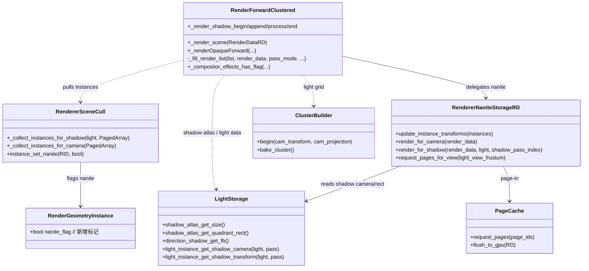
```mermaid
classDiagram
    class RenderForwardClustered {
        +_render_scene(RenderDataRD)
        +_render_shadow_begin/append/process/end
        +_renderOpaqueForward(...)
        -_fill_render_list(list, render_data, pass_mode, ...)
        +_compositor_effects_has_flag(...)
    }
    class RenderGeometryInstance {
        +bool nanite_flag  // 新增标记
    }
    class RendererSceneCull {
        +_collect_instances_for_shadow(light, PagedArray)
        +_collect_instances_for_camera(PagedArray)
        +instance_set_nanite(RID, bool)
    }
    class RendererNaniteStorageRD {
        +update_instance_transforms(instances)
        +render_for_camera(render_data)
        +render_for_shadow(render_data, light, shadow_pass_index)
        +request_pages_for_view(light_view_frustum)
    }
    class PageCache {
        +request_pages(page_ids)
        +flush_to_gpu(RD)
    }
    class LightStorage {
        +shadow_atlas_get_size()
        +shadow_atlas_get_quadrant_rect()
        +direction_shadow_get_fb()
        +light_instance_get_shadow_camera(light, pass)
        +light_instance_get_shadow_transform(light, pass)
    }
    class ClusterBuilder {
        +begin(cam_transform, cam_projection)
        +bake_cluster()
    }

    RenderForwardClustered ..> RendererSceneCull : pulls instances
    RenderForwardClustered ..> LightStorage : shadow atlas / light data
    RenderForwardClustered ..> ClusterBuilder : light grid
    RendererSceneCull --> RenderGeometryInstance : flags nanite
    RenderForwardClustered --> RendererNaniteStorageRD : delegates nanite
    RendererNaniteStorageRD --> LightStorage : reads shadow camera/rect
    RendererNaniteStorageRD --> PageCache : page-in
```

### 7.4 渲染管线流程 — Nanite 与阴影/Forward 共存

下面流程图描述了**方案三(深度改造)**下的完整 pass 顺序(方案一/二在 `CompositorEffect` 钩子内做相同工作,只是位置不能插入到阴影 pass 内部,见 7.6)。


```mermaid
flowchart TD
    A[RendererSceneCull::render_camera] --> B[Collect instances<br/>split: standard / nanite]
    B --> S0[For each shadow light:<br/>cull instances vs light frustum]
    S0 --> S1{_render_shadow_begin}
    S1 --> S2[For standard instances:<br/>_fill_render_list SECONDARY]
    S2 --> S3[For nanite instances:<br/>_nanite_render_shadow_pass per light]
    S3 --> S3a[Compute: BVH cull vs light frustum<br/>use light_transform as camera]
    S3a --> S3b[Compute: shadow LOD select<br/>higher error threshold - coarser]
    S3b --> S3c[Compute: page-request for shadow-visible clusters]
    S3c --> S3d[Draw indirect: depth-only pipeline<br/>write into SAME shadow atlas rect]
    S3d --> S4[_render_shadow_process / _render_shadow_end]

    S4 --> M0[_render_scene main body]
    M0 --> M1[_update_sdfgi / gi.process_gi]
    M1 --> M2[ssao / ssil / ssr]
    M2 --> M3[cluster_builder.bake_cluster<br/>for forward lighting]
    M3 --> M4[CompositorEffect BEFORE_OPAQUE_PASS]
    M4 --> M4a[Nanite cull pass<br/>BVH traversal from camera view]
    M4a --> M4b[Nanite page-request]
    M4b --> M4c[Nanite raster visibility buffer<br/>硬光栅 + compute 软光栅]
    M4c --> M4d[Nanite build HZB from current depth<br/>for next frame occlusion]
    M4d --> M5[_renderOpaqueForward<br/>standard instances only]
    M5 --> M6[CompositorEffect AFTER_OPAQUE_PASS]
    M6 --> M6a[Nanite material eval pass<br/>shade VisBuffer pixels using shared light buffer]
    M6a --> M6b[Composite nanite shaded color<br/>into main color attachment]
    M6b --> M7[_render_sky / volumetric_fog]
    M7 --> M8[_render_transparent<br/>standard transparent<br/>+ nanite two-sided transparent fallback]
    M8 --> M9[post-process: TAA / DOF / Bloom / Tonemap]
    M9 --> Z[Present]
```

### 7.5 阴影路径的细节

#### 7.5.1 Nanite 阴影的 BVH 遍历差异

相机视图和光视图使用**同一份 BVH**,但参数不同:

| 参数 | 相机视图 | 光视图(阴影) |
|---|---|---|
| `view_proj` | 主相机 | `light_instance_get_shadow_camera/transform` |
| `error_threshold` | 用户设置(默认 ≈ 1 像素) | 放大 N 倍(如 4-8 像素),降低阴影几何面数 |
| `screen_scale` | 基于主相机投影 | 基于光视图投影 + shadow map 分辨率 |
| HZB 遮挡剔除 | 用上一帧 HZB | 通常**关闭**(阴影光视图不需要遮挡剔除,所有可见物都需投阴影) |
| Page 请求 | 高优先级 | 与相机视图合并,共享同一 page cache(避免重复加载) |
| 输出 | `visibility_buffer` | 直接写 `shadow_atlas` 的 depth attachment |

#### 7.5.2 PSSM 多 split 处理

方向光的 `LIGHT_DIRECTIONAL_SHADOW_PARALLEL_4_SPLITS` 会调用 `_render_shadow_pass` 4 次,每次光视图不同。Nanite 需要在**每个 split 内独立做一次 BVH 遍历**,但可以利用:

- 同一帧的 4 次遍历共用一个 `visible_cluster_buffer`,只是分段;
- 第二个 split 起可重用上一 split 已 page-in 的 cluster,减少磁盘 IO。

#### 7.5.3 阴影 shader — 仅写 depth

Nanite 的 shadow pipeline 不需要材质/纹理,只需把顶点变换到光裁剪空间并写深度:

```glsl
// nanite_shadow.vert.glsl
#[vertex]
#version 450
layout(set=0,binding=0,std430) readonly buffer Vertices { float v[]; } vertices;
layout(set=0,binding=1,std430) readonly buffer Clusters { Cluster c[]; } clusters;
layout(set=0,binding=2,std430) readonly buffer VisibleList { uint cluster_ids[]; } visible;
layout(set=0,binding=3) uniform LightData { mat4 light_view_proj; };
layout(push_constant) uniform PC { uint draw_id; };

void main() {
    uint cluster_id = visible.cluster_ids[draw_id];  // 由 indirect args 索引
    Cluster cl = clusters.c[cluster_id];
    uint local_vidx = gl_VertexIndex;
    uint vidx = cl.vertex_offset + local_vidx;
    vec3 pos = vec3(vertices.v[vidx*3+0], vertices.v[vidx*3+1], vertices.v[vidx*3+2]);
    // instance transform 通过 InstanceData push
    gl_Position = light_view_proj * instance_transform * vec4(pos, 1.0);
}
```

```glsl
// nanite_shadow.frag.glsl — 空,只写 depth
#[fragment]
#version 450
void main() {}
```

#### 7.5.4 阴影的 LOD 简化策略

为避免高密度 mesh 在阴影里也按 1 像素精度采样,Nanite 阴影用**更粗 LOD**:

```glsl
// 在 nanite_shadow_cull.glsl 中
float shadow_error_threshold = camera_error_threshold * 4.0;  // 阴影可粗 4 倍
// 同时把 screen_scale 换成基于 shadow map texel 的尺度
float texel_scale = shadow_map_size / (world_aabb_size / distance_to_light);
bool on_cut = node.error * texel_scale <= shadow_error_threshold;
```

这样阴影 cluster 数量可降到相机视图的 1/4 ~ 1/8,避免 shadow atlas 爆炸。

### 7.6 三套方案下阴影搭配的差异

#### 方案一(GDExtension)
- **入口限制**:`CompositorEffect` 仅暴露 `BEFORE_OPAQUE_PASS` / `AFTER_OPAQUE_PASS` / `BEFORE_POST` / `AFTER_POST` 等,**没有阴影 callback**;
- **后果**:无法在引擎 shadow pass 内插入 Nanite shadow;
- **变通办法**:
  1. 在 `BEFORE_OPAQUE_PASS` 中,如果检测到场景有方向光/聚光开阴影,**自己跑一遍 Nanite shadow cull + 写 depth 到独立 RT,然后把它作为 shadow sampler 注入材质**(自定义材质系统);
  2. 或者**让 Nanite 实例 `cast_shadow=false`**,接受"Nanite 不投阴影"的限制(原型阶段常用);
  3. 在 `_render_callback` 内通过 `RenderingDevice::draw_list_begin(light_storage->direction_shadow_get_fb())` 直接拿到 shadow atlas FB 并自己绘制(依赖内部 RID 通过 friend/反射拿,不保证跨版本稳定)。
- **推荐**:原型阶段用 (2),正式生产用 (1)。

#### 方案二(C++ Module)
- 同样没有阴影 callback,但模块**可直接访问 `LightStorage` 的内部 RID**(`direction_shadow_get_fb()` / `shadow_atlas_get_quadrant_rect()`),且可在 `_render_scene` 调用前 hook 一个内部 "before shadow" 钩子;
- 实现上,让 `NaniteRenderStepRD` 提供 `pre_shadow_pass(render_data, light, pass_index)`,在 `RendererSceneCull::_render_camera` 收集 shadow instances 后、调 `_render_shadow_pass` 前调用;
- 这样 Nanite 阴影能与标准阴影共享同一个 atlas 区域,无缝集成。

#### 方案三(深度改造)
- 在 `RenderForwardClustered::_render_shadow_pass` 内部追加:

```cpp
void RenderForwardClustered::_render_shadow_pass(...) {
    // ... 原有 setup atlas_rect / render_fb / light_transform ...

    // 标准 mesh 部分(原代码)
    _render_shadow_append(render_fb, p_instances, light_projection, light_transform,
                          zfar, 0, 0, reverse_cull_face, using_dual_paraboloid,
                          using_dual_paraboloid_flip, use_pancake, ...);

    // 新增:Nanite 部分 — 把 Nanite 实例从 p_instances 中分流后单独处理
    if (p_render_data->has_nanite_instances) {
        _nanite_render_shadow_pass(p_render_data, p_light, p_pass,
                                   light_projection, light_transform,
                                   atlas_rect, render_fb);
    }
}
```

`_nanite_render_shadow_pass` 内部:

```cpp
void RenderForwardClustered::_nanite_render_shadow_pass(
        RenderDataRD *p_render_data, RID p_light, int p_pass,
        const Projection &p_light_projection, const Transform3D &p_light_transform,
        const Rect2i &p_atlas_rect, RID p_render_fb) {
    RenderingDevice *rd = RenderingDevice::get_singleton();
    NaniteStorage *ns = RSG::nanite_storage;

    // 1. 把光视图打包到 instance uniform(只更新本光的)
    ns->update_shadow_view_uniform(p_light, p_pass, p_light_projection, p_light_transform);

    // 2. compute: BVH 遍历(光视图) + 阴影 LOD select + 间接参数
    rd->draw_command_begin_label("Nanite Shadow Cull");
    RID cs = nanite_shader.shadow_cull_pipeline;
    rd->compute_list_begin();
    rd->compute_list_bind_compute_pipeline(cs);
    ns->bind_shadow_cull_uniform_set(rd, /*set=*/0);
    rd->compute_list_dispatch((ns->get_instance_count() + 63) / 64, 1, 1);
    rd->compute_list_end();
    rd->draw_command_end_label();

    // 3. draw indirect: depth-only pipeline → 写同一份 render_fb
    RID ds_pipeline = nanite_shader.shadow_depth_pipeline;
    rd->draw_list_begin(p_render_fb, RD::DRAW_DEFAULT_ALL,  // 不 clear,继承标准 mesh 写入
                        Vector<Color>(), 0.0f, 0, p_atlas_rect);
    rd->draw_list_bind_render_pipeline(ds_pipeline);
    ns->bind_shadow_draw_uniform_set(rd, /*set=*/0);
    rd->draw_list_bind_index_array(ns->get_index_array_rid());
    rd->draw_list_draw_indirect(ns->get_shadow_indirect_args_rid(), /*count=*/ns->get_material_count());
    rd->draw_list_end();
}
```

### 7.7 时序图 — Nanite + 阴影 + Forward 协同一帧

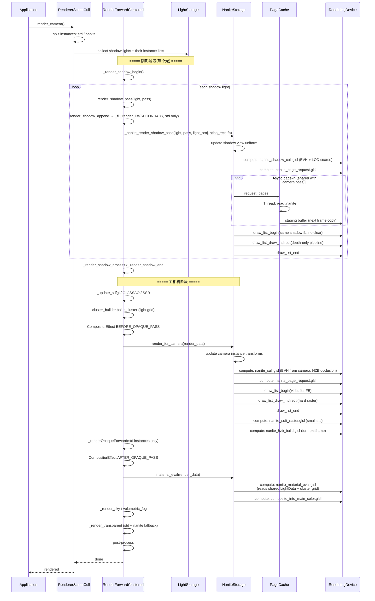
```mermaid
sequenceDiagram
    participant App as Application
    participant Cull as RendererSceneCull
    participant FC as RenderForwardClustered
    participant LS as LightStorage
    participant NS as NaniteStorage
    participant PC as PageCache
    participant RD as RenderingDevice

    App->>Cull: render_camera()
    Cull->>Cull: split instances: std / nanite
    Cull->>LS: collect shadow lights + their instance lists

    Note over FC,LS: ===== 阴影阶段(每个光) =====
    FC->>FC: _render_shadow_begin()
    loop each shadow light
        FC->>FC: _render_shadow_pass(light, pass)
        FC->>FC: _render_shadow_append → _fill_render_list(SECONDARY, std only)
        FC->>NS: _nanite_render_shadow_pass(light, pass, light_proj, atlas_rect, fb)
        NS->>NS: update shadow view uniform
        NS->>RD: compute: nanite_shadow_cull.glsl (BVH + LOD coarse)
        NS->>RD: compute: nanite_page_request.glsl
        par Async page-in (shared with camera pass)
            NS->>PC: request_pages
            PC->>PC: Thread: read .nanite
            PC->>RD: staging buffer (next frame copy)
        end
        NS->>RD: draw_list_begin(same shadow fb, no clear)
        NS->>RD: draw_list_draw_indirect(depth-only pipeline)
        NS->>RD: draw_list_end
    end
    FC->>FC: _render_shadow_process / _render_shadow_end

    Note over FC,NS: ===== 主相机阶段 =====
    FC->>FC: _update_sdfgi / GI / SSAO / SSR
    FC->>FC: cluster_builder.bake_cluster (light grid)
    FC->>FC: CompositorEffect BEFORE_OPAQUE_PASS
    FC->>NS: render_for_camera(render_data)
    NS->>NS: update camera instance transforms
    NS->>RD: compute: nanite_cull.glsl (BVH from camera, HZB occlusion)
    NS->>RD: compute: nanite_page_request.glsl
    NS->>RD: draw_list_begin(visbuffer FB)
    NS->>RD: draw_list_draw_indirect (hard raster)
    NS->>RD: draw_list_end
    NS->>RD: compute: nanite_soft_raster.glsl (small tris)
    NS->>RD: compute: nanite_hzb_build.glsl (for next frame)
    FC->>FC: _renderOpaqueForward(std instances only)
    FC->>FC: CompositorEffect AFTER_OPAQUE_PASS
    FC->>NS: material_eval(render_data)
    NS->>RD: compute: nanite_material_eval.glsl<br/>(reads shared LightData + cluster grid)
    NS->>RD: compute: composite_into_main_color.glsl
    FC->>FC: _render_sky / volumetric_fog
    FC->>FC: _render_transparent (std + nanite fallback)
    FC->>FC: post-process
    FC-->>Cull: done
    Cull-->>App: rendered
```

### 7.8 透明物体与特殊场景

| 场景 | 处理 |
|---|---|
| **透明 Nanite mesh** | Nanite 原生不适合 alpha-blend。降级方案:对 `transparency != ALPHA_DISABLED` 的材质,Nanite 自动 fallback 到标准 mesh(把该 surface 标 `SURFACE_STANDARD`),走 forward transparent pass |
| **双面材质 / Alpha Scissor** | 在 `nanite_material_eval.glsl` 内 `discard`,与标准 ShaderMaterial 一致;VisBuffer 写入时也做 alpha-test |
| **Decal / FogVolume** | 不影响 Nanite — Decal 在 forward 后处理时基于 depth buffer 投影,Nanite 已写 depth,自然支持 |
| **SSS / SSSS** | 走标准 forward 的 SSS 路径会把 Nanite 当不透明物体处理;方案三需让 Nanite shading 写入 SSS 通道 |
| **VoxelGI 烘焙** | VoxelGI 需要把场景体素化。Nanite mesh 应在 bake 时提供"低 LOD 代表几何"(error 阈值放大 16x),避免大量三角形撑爆体素化 |
| **SDFGI** | SDFGI 基于场景 SDF;Nanite mesh 需参与 SDF 烘焙(同样用低 LOD 代表) |

### 7.9 性能/正确性注意事项

1. **实例分流时机**:`RendererSceneCull` 在收集 `render_shadows[i].instances` 时就应分流,否则标准 shadow pass 会误把 Nanite 实例当普通 mesh 渲染(导致绘制两遍);
2. **Page cache 共享**:相机视图和光视图的 page 请求必须去重,否则同一 page 被加载两次;
3. **HZB 复用**:主相机的 HZB 在同一帧可被 Nanite 多次 BVH 遍历复用,避免重复构建;
4. **Indirect args buffer 复用**:阴影和相机的 indirect args buffer 应分开(尺寸不同),但可见 cluster buffer 可共用(都按 cluster_id 索引);
5. **Mobile renderer**:Mobile 不支持软光栅(compute shader 受限),Nanite 在 Mobile 下应**自动降级**为仅硬光栅 + 标准 LOD(跳过 VisBuffer,直接走 forward);即 Mobile 不开 Nanite;
6. **Compatibility renderer**(OpenGL):不支持 Nanite,自动 fallback 到标准 mesh;
7. **阴影 atlas 尺寸**:Nanite 阴影几何虽用粗 LOD,但 cluster 数仍可能很大;建议提供项目设置 `nanite/shadow/max_clusters_per_light`,超过则按距离丢弃远 cluster;
8. **阴影 acne**:Nanite 阴影用同一 bias 系数;但因其顶点是 LOD 简化版本,几何位置有误差,**建议阴影 bias 比标准 mesh 放大 1.5x**,或基于 cluster error 动态调整。

### 7.10 小结

| 渲染阶段 | Nanite 参与 | 标准 Forward 参与 | 共享资源 |
|---|---|---|---|
| Shadow pass | ✅(方案二三) / ⚠️(方案一需变通) | ✅ | shadow_atlas, LightStorage |
| GI bake / update | ✅(用低 LOD 代表) | ✅ | voxel volume, SDF |
| Cluster lighting bake | ❌(由 forward 消费) | ✅ | cluster grid |
| Depth prepass | ✅(写主 depth) | ✅ | depth attachment |
| BEFORE_OPAQUE cull + VisBuffer | ✅ | ❌ | instance buffer |
| Opaque forward | ❌(由 Nanite material eval 替代) | ✅ | color attachment |
| AFTER_OPAQUE material eval + composite | ✅ | ❌ | color, light, cluster grid |
| Sky / fog | ❌ | ✅ | — |
| Transparent | ⚠️ fallback 到标准 mesh | ✅ | color, depth |
| Post-process | ❌(自动消费) | ✅ | color, motion vectors |

核心结论:**Nanite 与 Forward+ 共存的关键是"几何分流 + 资源共享"** — 几何上让 Nanite 完全接管自己实例的可见性/着色,而所有光照/阴影/深度 buffer/GI 体素则与标准 forward 共享同一份,这样既不破坏 Godot 现有材质/光照系统,又能拿到 Nanite 的细节优势。

---

## 8. 离线构建模块:基于 meshoptimizer 的层次化 Meshlet + BVH

### 8.1 为什么用 meshoptimizer

Godot 在 `thirdparty/meshoptimizer/`(版本 1.1)和 `modules/meshoptimizer/` 中已经携带了 [meshoptimizer](https://github.com/zeux/meshoptimizer) 库。该库由 Arseny Kapoulkine 维护,是业界事实标准,本身**已包含 Nanite 离线阶段所需的全部基础算法**:

| Nanite 需求 | 对应 meshoptimizer API | 文件 |
|---|---|---|
| 切叶子 cluster(128 tri) | `meshopt_buildMeshlets` / `meshopt_buildMeshletsFlex` / `meshopt_buildMeshletsSpatial` | `clusterizer.cpp` |
| 计算簇包围盒 + 法线锥(背面剔除) | `meshopt_computeClusterBounds` / `meshopt_computeMeshletBounds` | `clusterizer.cpp` |
| 簇分组(4 簇 → 1 父) | `meshopt_partitionClusters` | `partition.cpp` |
| QEM 简化(支持属性/锁边) | `meshopt_simplify` / `meshopt_simplifyWithAttributes` / `meshopt_simplifySloppy` | `simplifier.cpp` |
| 误差尺度归一化 | `meshopt_simplifyScale` | `simplifier.cpp` |
| Meshlet 内部 reorder(顶点/三角形局部性) | `meshopt_optimizeMeshlet` / `meshopt_optimizeMeshletLevel` | `clusterizer.cpp` |
| 簇序列化(磁盘压缩,<1 byte/tri) | `meshopt_encodeMeshlet` / `meshopt_decodeMeshlet` | `vertexcodec.cpp` |
| 顶点 buffer 压缩(可选 exp filter) | `meshopt_encodeVertexBuffer` / `meshopt_encodeFilterExp` | `vertexcodec.cpp` |
| 顶点 cache/fetch 优化(可选,提升硬光栅效率) | `meshopt_optimizeVertexCache` / `meshopt_optimizeVertexFetch` | `overdrawanalyzer.cpp` 等 |
| 位置 remap(合并相同顶点,简化前预处理) | `meshopt_generateVertexRemap` / `meshopt_generatePositionRemap` | `indexgenerator.cpp` |
| Provoking vertex 调整(为 VisBuffer flat 属性) | `meshopt_generateProvokingIndexBuffer` | `indexgenerator.cpp` |

但 Godot 的 `modules/meshoptimizer/register_types.cpp` **只把 7 个函数挂到了 `SurfaceTool`**(`optimize_vertex_cache_func` / `simplify_func` / `simplify_with_attrib_func` / `simplify_scale_func` / `generate_remap_func` / `remap_vertex_func` / `remap_index_func`),**完全没暴露 meshlet/BVH/cluster 相关 API**。这意味着:

- ✅ meshoptimizer 库本身已链接进引擎,无需重新引入第三方代码;
- ✅ 三套方案都可 `#include <thirdparty/meshoptimizer/meshoptimizer.h>` 直接调用;
- ⚠️ 需要在自己的代码里(Nanite 模块/GDExtension 内)直接调用 meshoptimizer 的 C API,**不要试图通过 `SurfaceTool` 间接触发**,因为 SurfaceTool 只走 simplify 路径,不会生成 meshlet。

### 8.2 离线构建管线总览

```
ArrayMesh / SurfaceTool 顶点数组
   │
   ├─ 0. 预处理
   │     ├─ meshopt_generateVertexRemap           # 合并重复顶点
   │     ├─ meshopt_optimizeVertexCache            # 顶点 cache 优化
   │     └─ meshopt_optimizeVertexFetch            # 顶点 fetch 局部性
   │
   ├─ 1. 叶子层(L0)聚类
   │     ├─ meshopt_buildMeshletsFlex(             # 灵活簇大小
   │     │     max_vertices=64,                    # 适配 mesh shader 上限
   │     │     min_triangles=32, max_triangles=128,
   │     │     cone_weight=0.5,                    # 启用法线锥
   │     │     split_factor=0.5)
   │     └─ for each meshlet:
   │           meshopt_optimizeMeshletLevel(level=3)  # 压缩友好
   │           bounds = meshopt_computeMeshletBounds(...)
   │           error = 0
   │
   ├─ 2. 层次化生成(自底向上)
   │     while cluster_count > 1:
   │       ├─ meshopt_partitionClusters(           # 4 簇 → 1 组
   │       │     target_partition_size=4)
   │       ├─ for each partition:
   │       │     ├─ 合并 4 簇的 index + vertex 子集
   │       │     ├─ vertex_lock 锁住组边界(meshopt_SimplifyVertex_Lock)
   │       │     ├─ meshopt_simplifyWithAttributes(
   │       │     │     target_index_count=原/2,
   │       │     │     target_error=0.5,           # 相对误差
   │       │     │     options=meshopt_SimplifyLockBorder
   │       │     │            | meshopt_SimplifyRegularize,
   │       │     │     &result_error)               # 取得简化误差
   │       │     ├─ meshopt_buildMeshletsFlex(...) # 简化后再切 2 簇
   │       │     ├─ parent.error = max(child.error, result_error)
   │       │     └─ parent.bounds = union(child.bounds)
   │       └─ 输出 parent 节点
   │
   ├─ 3. BVH 装配
   │     └─ 把层次结构展开为线性节点数组
   │        left_child / right_child 用数组下标
   │
   ├─ 4. 辅助数据生成
   │     ├─ 4.1 Group ID:同 partition 的簇共用 group_id(用于 crack-free 渲染)
   │     ├─ 4.2 Page ID:按 LOD 层 + 空间 locality 排序后切页(默认 64KB/页)
   │     ├─ 4.3 Material Index:每个簇记 surface material_index
   │     ├─ 4.4 Cone Axis/Cutoff:从 meshopt_Bounds 直接拷贝(背面剔除)
   │     ├─ 4.5 Group Bounds:用 meshopt_computeSphereBounds 合并子簇
   │     ├─ 4.6 Provoking reorder:meshopt_generateProvokingIndexBuffer
   │     │        让 provoking vertex == triangle id(VisBuffer flat 取值)
   │     ├─ 4.7 顶点量化:meshopt_quantizeUnorm/Snorm 或 meshopt_encodeFilterExp
   │     └─ 4.8 误差归一化:用 meshopt_simplifyScale 把 relative error 转 absolute
   │
   ├─ 5. 序列化
   │     ├─ meshopt_encodeMeshlet(每簇独立编码,磁盘 <1 byte/tri)
   │     ├─ meshopt_encodeVertexBuffer(顶点池,带 exp filter)
   │     └─ 写入 *.nanite 二进制 + .res 元数据(详见附录 B)
   │
   └─ 输出:NaniteMeshResource(可挂到 NaniteMeshInstance3D)
```

### 8.3 类图


```mermaid
classDiagram
    class ArrayMesh {
        <<Godot built-in>>
        +surface_get_arrays() PackedArrays
    }
    class SurfaceTool {
        <<Godot built-in>>
        +commit_to_arrays()
    }
    class meshoptimizer {
        <<C library, thirdparty>>
        +meshopt_buildMeshletsFlex
        +meshopt_computeMeshletBounds
        +meshopt_partitionClusters
        +meshopt_simplifyWithAttributes
        +meshopt_optimizeMeshletLevel
        +meshopt_encodeMeshlet
        +meshopt_simplifyScale
    }
    class NaniteBuilder {
        -BuilderConfig config
        +build(Ref~ArrayMesh~)  Ref~NaniteMeshResource~
        -preprocess_mesh(verts, indices)
        -build_leaf_clusters(verts, indices)  LocalVector~Cluster~
        -build_hierarchy(clusters)  BVHTree
        -simplify_partition(partition)  LocalVector~Cluster~
        -finalize_resource(...)  Ref~NaniteMeshResource~
    }
    class BuilderConfig {
        +uint32_t max_vertices = 64
        +uint32_t min_triangles = 32
        +uint32_t max_triangles = 128
        +uint32_t partition_size = 4
        +float    cone_weight = 0.5
        +float    split_factor = 0.5
        +float    simplification_ratio = 0.5
        +float    target_error = 0.5
        +uint32_t max_lod_levels = 16
        +uint32_t page_size_bytes = 65536
        +bool     lock_partition_border = true
        +bool     use_attribute_simplify = true
        +bool     use_exp_filter = true
        +int      meshlet_optimize_level = 3
    }
    class NaniteCluster {
        +uint32 vertex_offset
        +uint32 triangle_offset
        +uint32 vertex_count
        +uint32 triangle_count
        +AABB    bounds
        +Vec3    cone_axis
        +float   cone_cutoff
        +float   error
        +uint32  group_id
        +uint32  material_index
        +uint32  page_id
    }
    class NaniteClusterNode {
        +AABB    bounds
        +Vec3    cone_axis
        +float   cone_cutoff
        +float   error
        +uint32  left_child
        +uint32  right_child
        +uint32  first_cluster
        +uint32  cluster_count
        +uint32  page_id
        +uint32  depth
    }
    class NaniteMeshResource {
        +PackedByteArray vertex_data
        +PackedByteArray cluster_index_data
        +PackedByteArray clusters_data
        +PackedByteArray nodes_data
        +PackedByteArray page_table_data
        +TypedArray~Material~ materials
        +build_from_arrays(PackedArrays)
    }
    class PagePacker {
        +pack(clusters, nodes, config)  PageTable
        -sort_by_lod_then_locality(...)
        -emit_page(clusters_subset)  PageEntry
    }
    class ProvokingReorder {
        +apply(index_buffer, vertex_buffer)  ReorderTable
        -meshopt_generateProvokingIndexBuffer(...)
    }
    class VertexQuantizer {
        +quantize(verts, config)  PackedByteArray
        -meshopt_encodeFilterExp(...)
        -meshopt_quantizeHalf(...)
    }

    NaniteBuilder --> BuilderConfig : reads
    NaniteBuilder --> meshoptimizer : calls
    NaniteBuilder --> NaniteCluster : produces
    NaniteBuilder --> NaniteClusterNode : produces
    NaniteBuilder --> NaniteMeshResource : outputs
    NaniteBuilder --> PagePacker : delegates 4.2
    NaniteBuilder --> ProvokingReorder : delegates 4.6
    NaniteBuilder --> VertexQuantizer : delegates 4.7
    NaniteBuilder ..> ArrayMesh : consumes input
    NaniteBuilder ..> SurfaceTool : optional preprocessing
```

### 8.4 流程图 — 离线构建主流程

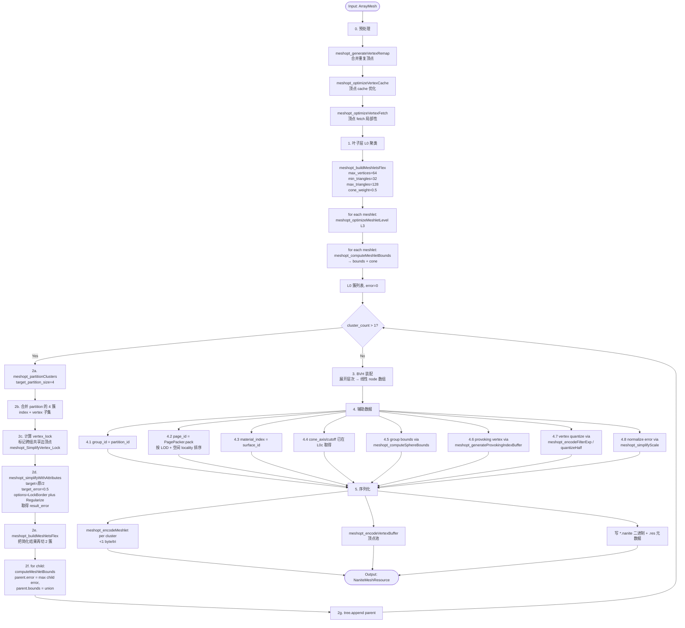
```mermaid
flowchart TD
    Start([Input: ArrayMesh]) --> Pre[0. 预处理]
    Pre --> Pre1[meshopt_generateVertexRemap<br/>合并重复顶点]
    Pre1 --> Pre2[meshopt_optimizeVertexCache<br/>顶点 cache 优化]
    Pre2 --> Pre3[meshopt_optimizeVertexFetch<br/>顶点 fetch 局部性]
    Pre3 --> L0[1. 叶子层 L0 聚类]

    L0 --> L0a[meshopt_buildMeshletsFlex<br/>max_vertices=64<br/>min_triangles=32<br/>max_triangles=128<br/>cone_weight=0.5]
    L0a --> L0b[for each meshlet:<br/>meshopt_optimizeMeshletLevel L3]
    L0b --> L0c[for each meshlet:<br/>meshopt_computeMeshletBounds<br/>→ bounds + cone]
    L0c --> L0d[L0 簇列表, error=0]

    L0d --> Loop{cluster_count > 1?}
    Loop -- Yes --> Part[2a. meshopt_partitionClusters<br/>target_partition_size=4]
    Part --> Merge[2b. 合并 partition 的 4 簇<br/>index + vertex 子集]
    Merge --> Lock[2c. 计算 vertex_lock<br/>标记跨组共享边顶点<br/>meshopt_SimplifyVertex_Lock]
    Lock --> Simp[2d. meshopt_simplifyWithAttributes<br/>target=原/2<br/>target_error=0.5<br/>options=LockBorder plus Regularize<br/>取得 result_error]
    Simp --> Recluster[2e. meshopt_buildMeshletsFlex<br/>把简化结果再切 2 簇]
    Recluster --> Bounds2[2f. for child:<br/>computeMeshletBounds<br/>parent.error = max child error,<br/>parent.bounds = union]
    Bounds2 --> Append[2g. tree.append parent]
    Append --> Loop

    Loop -- No --> BVH[3. BVH 装配<br/>展开层次 → 线性 node 数组]
    BVH --> Aux[4. 辅助数据]

    Aux --> A1[4.1 group_id = partition_id]
    Aux --> A2[4.2 page_id = PagePacker.pack<br/>按 LOD + 空间 locality 排序]
    Aux --> A3[4.3 material_index = surface_id]
    Aux --> A4[4.4 cone_axis/cutoff 已在 L0c 取得]
    Aux --> A5[4.5 group bounds via<br/>meshopt_computeSphereBounds]
    Aux --> A6[4.6 provoking vertex via<br/>meshopt_generateProvokingIndexBuffer]
    Aux --> A7[4.7 vertex quantize via<br/>meshopt_encodeFilterExp / quantizeHalf]
    Aux --> A8[4.8 normalize error via<br/>meshopt_simplifyScale]

    A1 --> Ser[5. 序列化]
    A2 --> Ser
    A3 --> Ser
    A4 --> Ser
    A5 --> Ser
    A6 --> Ser
    A7 --> Ser
    A8 --> Ser

    Ser --> Ser1[meshopt_encodeMeshlet per cluster<br/><1 byte/tri]
    Ser --> Ser2[meshopt_encodeVertexBuffer<br/>顶点池]
    Ser --> Ser3[写 *.nanite 二进制 + .res 元数据]

    Ser1 --> Out([Output: NaniteMeshResource])
    Ser2 --> Out
    Ser3 --> Out
```

### 8.5 时序图 — 层次化构建一帧(单个 mesh)

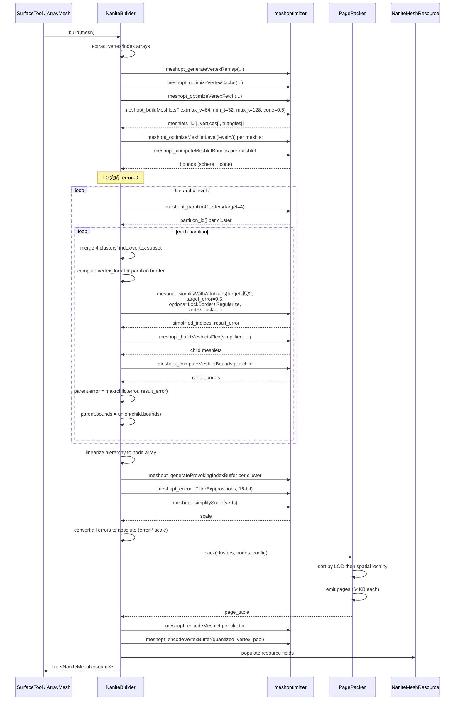
```mermaid
sequenceDiagram
    participant ST as SurfaceTool / ArrayMesh
    participant B as NaniteBuilder
    participant MO as meshoptimizer
    participant PP as PagePacker
    participant R as NaniteMeshResource

    ST->>B: build(mesh)
    B->>B: extract vertex/index arrays
    B->>MO: meshopt_generateVertexRemap(...)
    B->>MO: meshopt_optimizeVertexCache(...)
    B->>MO: meshopt_optimizeVertexFetch(...)
    B->>MO: meshopt_buildMeshletsFlex(max_v=64, min_t=32, max_t=128, cone=0.5)
    MO-->>B: meshlets_l0[], vertices[], triangles[]
    B->>MO: meshopt_optimizeMeshletLevel(level=3) per meshlet
    B->>MO: meshopt_computeMeshletBounds per meshlet
    MO-->>B: bounds (sphere + cone)
    Note over B: L0 完成, error=0

    loop hierarchy levels
        B->>MO: meshopt_partitionClusters(target=4)
        MO-->>B: partition_id[] per cluster
        loop each partition
            B->>B: merge 4 clusters' index/vertex subset
            B->>B: compute vertex_lock for partition border
            B->>MO: meshopt_simplifyWithAttributes(target=原/2,<br/>target_error=0.5,<br/>options=LockBorder+Regularize,<br/>vertex_lock=...)
            MO-->>B: simplified_indices, result_error
            B->>MO: meshopt_buildMeshletsFlex(simplified, ...)
            MO-->>B: child meshlets
            B->>MO: meshopt_computeMeshletBounds per child
            MO-->>B: child bounds
            B->>B: parent.error = max(child.error, result_error)
            B->>B: parent.bounds = union(child.bounds)
        end
    end

    B->>B: linearize hierarchy to node array
    B->>MO: meshopt_generateProvokingIndexBuffer per cluster
    B->>MO: meshopt_encodeFilterExp(positions, 16-bit)
    B->>MO: meshopt_simplifyScale(verts)  # 误差归一化系数
    MO-->>B: scale
    B->>B: convert all errors to absolute (error * scale)

    B->>PP: pack(clusters, nodes, config)
    PP->>PP: sort by LOD then spatial locality
    PP->>PP: emit pages (64KB each)
    PP-->>B: page_table

    B->>MO: meshopt_encodeMeshlet per cluster
    B->>MO: meshopt_encodeVertexBuffer(quantized_vertex_pool)
    B->>R: populate resource fields
    B-->>ST: Ref<NaniteMeshResource>
```

### 8.6 关键代码骨架

#### 8.6.1 预处理 + 叶子层聚类

```cpp
// nanite_builder.cpp (位于 modules/nanite/offline/ 或 GDExtension 内)
#include <thirdparty/meshoptimizer/meshoptimizer.h>

Ref<NaniteMeshResource> NaniteBuilder::build(const Ref<ArrayMesh> &p_mesh) {
    ERR_FAIL_COND_V(p_mesh.is_null() || p_mesh->get_surface_count() == 0, {});

    // ===== 0. 预处理:提取顶点/索引 =====
    // 假设单 surface;多 surface 时循环处理并记 material_index
    Array arrays = p_mesh->surface_get_arrays(0);
    PackedVector3Array positions = arrays[Mesh::ARRAY_VERTEX];
    PackedInt32Array    indices32 = arrays[Mesh::ARRAY_INDEX];
    ERR_FAIL_COND_V(positions.is_empty() || indices32.is_empty(), {});

    // Godot 的 Vector3 stride 是 16 字节(float padding),meshoptimizer 要 12 字节
    // 重新打包为紧凑 float3
    LocalVector<float> verts_pos;
    verts_pos.resize(positions.size() * 3);
    for (int i = 0; i < positions.size(); i++) {
        verts_pos[i * 3 + 0] = positions[i].x;
        verts_pos[i * 3 + 1] = positions[i].y;
        verts_pos[i * 3 + 2] = positions[i].z;
    }

    // 0a. 顶点 remap(合并重复)
    LocalVector<unsigned int> remap;
    remap.resize(positions.size());
    size_t unique_count = meshopt_generateVertexRemap(
        remap.ptr(), reinterpret_cast<const unsigned int *>(indices32.ptr()),
        indices32.size(), verts_pos.ptr(), positions.size(), sizeof(float) * 3);

    // 0b. 应用 remap,得到紧凑 vertex/index buffer
    LocalVector<float> compact_verts;
    compact_verts.resize(unique_count * 3);
    meshopt_remapVertexBuffer(compact_verts.ptr(), verts_pos.ptr(),
                              positions.size(), sizeof(float) * 3, remap.ptr());
    LocalVector<unsigned int> compact_indices;
    compact_indices.resize(indices32.size());
    meshopt_remapIndexBuffer(compact_indices.ptr(),
                              reinterpret_cast<const unsigned int *>(indices32.ptr()),
                              indices32.size(), remap.ptr());

    // 0c. 顶点 cache + fetch 优化(为后续硬光栅管线友好)
    LocalVector<unsigned int> opt_indices;
    opt_indices.resize(compact_indices.size());
    meshopt_optimizeVertexCache(opt_indices.ptr(), compact_indices.ptr(),
                                 compact_indices.size(), unique_count);
    // 注意:optimizeVertexFetch 需要所有顶点属性,这里只示范 position

    // ===== 1. 叶子层 L0 聚类 =====
    const size_t MAX_VERTICES = 64;        // 兼容 mesh shader
    const size_t MIN_TRIANGLES = 32;
    const size_t MAX_TRIANGLES = 128;     // Nanite 标准
    const float  CONE_WEIGHT   = 0.5f;
    const float  SPLIT_FACTOR  = 0.5f;

    size_t meshlet_bound = meshopt_buildMeshletsBound(
        opt_indices.size(), MAX_VERTICES, MIN_TRIANGLES);

    LocalVector<meshopt_Meshlet> meshlets;
    meshlets.resize(meshlet_bound);
    LocalVector<unsigned int> meshlet_vertices;
    meshlet_vertices.resize(meshlet_bound * MAX_VERTICES);
    LocalVector<unsigned char> meshlet_triangles;
    meshlet_triangles.resize(meshlet_bound * MAX_TRIANGLES * 3);

    size_t meshlet_count = meshopt_buildMeshletsFlex(
        meshlets.ptr(), meshlet_vertices.ptr(), meshlet_triangles.ptr(),
        opt_indices.ptr(), opt_indices.size(),
        compact_verts.ptr(), unique_count, sizeof(float) * 3,
        MAX_VERTICES, MIN_TRIANGLES, MAX_TRIANGLES, CONE_WEIGHT, SPLIT_FACTOR);

    // 1b. 每簇内部 reorder + bounds + error=0
    LocalVector<NaniteCluster> l0_clusters;
    l0_clusters.resize(meshlet_count);
    for (size_t i = 0; i < meshlet_count; i++) {
        meshopt_Meshlet &m = meshlets[i];
        // 内部局部性优化(level=3 是压缩比与时间平衡点)
        meshopt_optimizeMeshletLevel(
            meshlet_vertices.ptr() + m.vertex_offset, m.vertex_count,
            meshlet_triangles.ptr() + m.triangle_offset, m.triangle_count, 3);

        meshopt_Bounds b = meshopt_computeMeshletBounds(
            meshlet_vertices.ptr() + m.vertex_offset,
            meshlet_triangles.ptr() + m.triangle_offset, m.triangle_count,
            compact_verts.ptr(), unique_count, sizeof(float) * 3);

        NaniteCluster &c = l0_clusters[i];
        c.vertex_offset     = m.vertex_offset;
        c.triangle_offset  = m.triangle_offset;
        c.vertex_count     = m.vertex_count;
        c.triangle_count   = m.triangle_count;
        c.bounds           = AABB(Vector3(b.center[0]-b.radius, b.center[1]-b.radius, b.center[2]-b.radius),
                                   Vector3(b.radius*2, b.radius*2, b.radius*2));
        c.cone_axis        = Vector3(b.cone_axis[0], b.cone_axis[1], b.cone_axis[2]);
        c.cone_cutoff      = b.cone_cutoff;
        c.error            = 0.0f;       // 叶子无简化误差
        c.group_id         = 0;          // 由 partition 阶段填
        c.material_index   = 0;
        c.page_id          = 0;          // 由 PagePacker 填
    }

    // ===== 2. 层次化构建 =====
    LocalVector<NaniteClusterNode> nodes;
    build_hierarchy(l0_clusters, compact_verts, unique_count, nodes);

    // ===== 3-5. BVH 装配 + 辅助数据 + 序列化(见后续小节)=====
    return finalize_resource(l0_clusters, nodes, compact_verts,
                              meshlet_vertices, meshlet_triangles, p_mesh);
}
```

#### 8.6.2 层次化构建(自底向上)

```cpp
void NaniteBuilder::build_hierarchy(LocalVector<NaniteCluster> &p_clusters,
                                      const LocalVector<float> &p_verts,
                                      size_t p_vertex_count,
                                      LocalVector<NaniteClusterNode> &r_nodes) {
    const uint32_t PARTITION_SIZE = 4;
    const float    TARGET_ERROR   = 0.5f;     // 相对误差
    const float    SIMPLIFY_RATIO = 0.5f;     // 每层简化到一半

    LocalVector<NaniteCluster> current_level = p_clusters;
    LocalVector<NaniteCluster> next_level;
    uint32_t depth = 0;

    while (current_level.size() > 1) {
        depth++;
        next_level.clear();

        // 2a. 用 meshopt_partitionClusters 把簇按 4 个一组分组
        //     先构造 partition 输入:每个簇的 vertex index 列表
        LocalVector<unsigned int> cluster_indices;       // 所有簇的 index 拼起来
        LocalVector<unsigned int> cluster_index_counts;  // 每簇的 index 数
        for (const NaniteCluster &c : current_level) {
            // 这里把 cluster 的 meshlet-local vertex 转回原始 vertex index
            // (实际实现里应直接保存 meshlet_vertices 中的全局 vertex id)
            // 简化伪代码:假设 c 已含 vertex_id 数组
            for (uint32_t v = 0; v < c.vertex_count; v++) {
                cluster_indices.push_back(c.global_vertex_ids[v]);
            }
            cluster_index_counts.push_back(c.vertex_count);
        }

        LocalVector<unsigned int> partition_ids;
        partition_ids.resize(current_level.size());
        size_t partition_count = meshopt_partitionClusters(
            partition_ids.ptr(),
            cluster_indices.ptr(), cluster_indices.size(),
            cluster_index_counts.ptr(), current_level.size(),
            p_verts.ptr(), p_vertex_count, sizeof(float) * 3,
            PARTITION_SIZE);

        // 2b. 对每个 partition:合并 → 简化 → 再聚类
        LocalVector<LocalVector<uint32_t>> partitions;
        partitions.resize(partition_count);
        for (size_t i = 0; i < current_level.size(); i++) {
            partitions[partition_ids[i]].push_back(i);
        }

        for (const auto &p_cluster_idxs : partitions) {
            if (p_cluster_idxs.size() < 2) {
                // 不足 2 簇,直接提升到上层(不简化)
                for (uint32_t cid : p_cluster_idxs) {
                    next_level.push_back(current_level[cid]);
                }
                continue;
            }

            // 合并 partition 内所有簇的三角形 → 临时 index buffer
            LocalVector<unsigned int> merged_indices;
            for (uint32_t cid : p_cluster_idxs) {
                const NaniteCluster &c = current_level[cid];
                for (uint32_t t = 0; t < c.triangle_count; t++) {
                    // meshlet triangle 是 8-bit local index,需转回 global vertex
                    // 此处省略转换细节
                    merged_indices.push_back(/* tri v0 */);
                    merged_indices.push_back(/* tri v1 */);
                    merged_indices.push_back(/* tri v2 */);
                }
            }

            // 2c. 计算 vertex_lock:锁住跨 partition 共享的顶点
            //     即"如果该顶点出现在多个 partition 中,则标记为 Lock"
            LocalVector<unsigned char> vertex_lock;
            vertex_lock.resize(p_vertex_count);
            compute_partition_vertex_locks(partition_ids, current_level,
                                             p_cluster_idxs, vertex_lock);

            // 2d. meshopt_simplifyWithAttributes
            LocalVector<unsigned int> simplified_indices;
            simplified_indices.resize(merged_indices.size());
            float result_error = 0.0f;
            size_t target = (size_t)(merged_indices.size() * SIMPLIFY_RATIO);
            unsigned int options = meshopt_SimplifyLockBorder
                                 | meshopt_SimplifyRegularize;

            size_t simplified_count = meshopt_simplifyWithAttributes(
                simplified_indices.ptr(), merged_indices.ptr(), merged_indices.size(),
                p_verts.ptr(), p_vertex_count, sizeof(float) * 3,
                /* attributes */ nullptr, 0,
                /* weights */ nullptr, 0,
                vertex_lock.ptr(),
                target, TARGET_ERROR, options, &result_error);

            simplified_indices.resize(simplified_count);

            // 2e. 再用 buildMeshletsFlex 切成 2 个新簇
            size_t child_bound = meshopt_buildMeshletsBound(
                simplified_indices.size(), 64, 32);
            LocalVector<meshopt_Meshlet> child_meshlets;
            child_meshlets.resize(child_bound);
            LocalVector<unsigned int> child_verts;
            child_verts.resize(child_bound * 64);
            LocalVector<unsigned char> child_tris;
            child_tris.resize(child_bound * 128 * 3);

            size_t child_count = meshopt_buildMeshletsFlex(
                child_meshlets.ptr(), child_verts.ptr(), child_tris.ptr(),
                simplified_indices.ptr(), simplified_indices.size(),
                p_verts.ptr(), p_vertex_count, sizeof(float) * 3,
                64, 32, 128, 0.5f, 0.5f);

            // 2f. 装配父节点 + 子簇
            NaniteClusterNode parent;
            parent.left_child  = r_nodes.size();   // 等下追加左子树
            parent.right_child = r_nodes.size() + child_count - 1;  // 简化:线性排列
            parent.first_cluster = p_clusters.size();  // 子簇追加到全局 cluster 池
            parent.cluster_count = child_count;
            parent.error = 0.0f;
            parent.bounds = AABB();
            parent.depth  = depth;

            for (size_t k = 0; k < child_count; k++) {
                meshopt_Meshlet &m = child_meshlets[k];
                meshopt_Bounds b = meshopt_computeMeshletBounds(
                    child_verts.ptr() + m.vertex_offset,
                    child_tris.ptr() + m.triangle_offset, m.triangle_count,
                    p_verts.ptr(), p_vertex_count, sizeof(float) * 3);

                NaniteCluster child;
                child.vertex_offset    = m.vertex_offset;
                child.triangle_offset  = m.triangle_offset;
                child.vertex_count     = m.vertex_count;
                child.triangle_count   = m.triangle_count;
                child.bounds           = sphere_to_aabb(b);
                child.cone_axis        = Vector3(b.cone_axis[0], b.cone_axis[1], b.cone_axis[2]);
                child.cone_cutoff      = b.cone_cutoff;
                child.error            = 0.0f;       // 子节点本身无新误差
                child.group_id         = 0;
                child.material_index   = 0;
                child.page_id          = 0;

                p_clusters.push_back(child);

                // 父节点 error = max(子 error, 简化误差)
                parent.error  = MAX(parent.error, result_error);
                parent.bounds = parent.bounds.merge(child.bounds);
            }

            // 把 parent 加入下一层(作为虚拟簇参与下一轮 partition)
            // 实际实现中,parent 不直接当 cluster,而是参与下一轮 partition 的输入
            // (此处简化:把 parent 的代表 bounds 加入下一层)
            NaniteCluster parent_as_cluster;
            parent_as_cluster.bounds         = parent.bounds;
            parent_as_cluster.error           = parent.error;
            parent_as_cluster.vertex_count   = 0;  // 内部节点无几何
            parent_as_cluster.triangle_count = 0;
            next_level.push_back(parent_as_cluster);

            r_nodes.push_back(parent);
        }

        current_level = next_level;
    }

    // 根节点
    NaniteClusterNode root;
    root.left_child  = 0;
    root.right_child = r_nodes.size() - 1;
    root.error       = current_level[0].error;
    root.bounds      = current_level[0].bounds;
    r_nodes.push_back(root);
}
```

#### 8.6.3 辅助数据生成

```cpp
// 4.6 Provoking vertex 调整(让 triangle_id == provoking vertex,VisBuffer flat 取值)
void NaniteBuilder::apply_provoking_reorder(LocalVector<NaniteCluster> &p_clusters,
                                             LocalVector<unsigned int> &p_vertex_pool,
                                             LocalVector<unsigned char> &p_index_pool) {
    for (NaniteCluster &c : p_clusters) {
        unsigned int *cluster_indices = p_vertex_pool.ptr() + c.vertex_offset;
        unsigned char *cluster_tris    = p_index_pool.ptr() + c.triangle_offset;

        // meshopt_generateProvokingIndexBuffer 要求输入是 triangle list,
        // 需要把 meshlet 的 8-bit micro-index 展开为 32-bit
        LocalVector<unsigned int> expanded;
        for (uint32_t t = 0; t < c.triangle_count; t++) {
            expanded.push_back(cluster_indices[cluster_tris[t * 3 + 0]]);
            expanded.push_back(cluster_indices[cluster_tris[t * 3 + 1]]);
            expanded.push_back(cluster_indices[cluster_tris[t * 3 + 2]]);
        }

        LocalVector<unsigned int> reordered;
        reordered.resize(expanded.size());
        LocalVector<unsigned int> reorder_table;
        reorder_table.resize(p_vertex_pool.size() + expanded.size() / 3);

        size_t table_size = meshopt_generateProvokingIndexBuffer(
            reordered.ptr(), reorder_table.ptr(),
            expanded.ptr(), expanded.size(), p_vertex_pool.size());

        // 写回 cluster
        for (uint32_t t = 0; t < c.triangle_count; t++) {
            cluster_indices[cluster_tris[t * 3 + 0]] = reordered[t * 3 + 0];
            cluster_indices[cluster_tris[t * 3 + 1]] = reordered[t * 3 + 1];
            cluster_indices[cluster_tris[t * 3 + 2]] = reordered[t * 3 + 2];
        }
        // reorder_table 用于运行时 vertex shader 反查真实顶点 id
    }
}

// 4.7 顶点量化(exp filter,16-bit mantissa,精度好且压缩友好)
PackedByteArray NaniteBuilder::quantize_vertices(const LocalVector<float> &p_positions) {
    // 先做 exp filter 编码
    LocalVector<float> input;
    input.resize(p_positions.size());
    memcpy(input.ptr(), p_positions.ptr(), p_positions.size() * sizeof(float));

    PackedByteArray encoded;
    size_t bound = meshopt_encodeVertexBufferBound(input.size() / 3, sizeof(float) * 3);
    encoded.resize(bound);
    int version = 1;
    meshopt_encodeVertexVersion(version);
    size_t encoded_size = meshopt_encodeVertexBufferLevel(
        encoded.ptrw(), bound, input.ptr(), input.size() / 3, sizeof(float) * 3,
        /*level=*/2, /*version=*/1);
    encoded.resize(encoded_size);
    return encoded;
}

// 4.8 误差归一化:relative error → absolute error
//     meshopt_simplify 返回的 result_error 是相对的(extents 的比例),
//     运行时需要 absolute error 才能比较屏幕投影误差
void NaniteBuilder::normalize_errors(LocalVector<NaniteClusterNode> &p_nodes,
                                       const LocalVector<float> &p_verts,
                                       size_t p_vertex_count) {
    float scale = meshopt_simplifyScale(p_verts.ptr(), p_vertex_count, sizeof(float) * 3);
    for (NaniteClusterNode &n : p_nodes) {
        n.error *= scale;  // 现在 n.error 是绝对几何误差(世界单位)
    }
}

// 4.2 Page 打包
PageTable NaniteBuilder::pack_pages(const LocalVector<NaniteCluster> &p_clusters,
                                      const LocalVector<NaniteClusterNode> &p_nodes,
                                      const BuilderConfig &p_config) {
    PageTable table;
    // 1. 按 LOD 层分组(高 LOD 优先 page-in)
    // 2. 同层内按空间 morton 排序,提升磁盘 IO 顺序性
    LocalVector<uint32_t> sorted_cluster_ids;
    sorted_cluster_ids.resize(p_clusters.size());
    for (uint32_t i = 0; i < p_clusters.size(); i++) sorted_cluster_ids[i] = i;

    std::sort(sorted_cluster_ids.begin(), sorted_cluster_ids.end(),
              [&](uint32_t a, uint32_t b) {
                  // 先按 LOD 层(从节点 depth 推断)
                  uint32_t da = cluster_lod_depth(a, p_nodes);
                  uint32_t db = cluster_lod_depth(b, p_nodes);
                  if (da != db) return da < db;
                  // 同层按 morton code
                  return morton_code(p_clusters[a].bounds.center)
                       < morton_code(p_clusters[b].bounds.center);
              });

    // 3. 顺序累加簇大小,达到 page_size 时切页
    uint32_t current_page = 0;
    size_t current_page_size = 0;
    for (uint32_t cid : sorted_cluster_ids) {
        if (current_page_size + cluster_byte_size(p_clusters[cid]) > p_config.page_size_bytes
            && current_page_size > 0) {
            current_page++;
            current_page_size = 0;
        }
        const_cast<NaniteCluster &>(p_clusters[cid]).page_id = current_page;
        current_page_size += cluster_byte_size(p_clusters[cid]);
    }

    table.page_count = current_page + 1;
    return table;
}
```

### 8.7 序列化

每个 cluster 用 `meshopt_encodeMeshlet` 单独编码,可在运行时按 page 加载并 `meshopt_decodeMeshlet` 解码:

```cpp
// 离线:写盘
void NaniteMeshResource::serialize(const LocalVector<NaniteCluster> &p_clusters,
                                     const LocalVector<unsigned int> &p_meshlet_vertices,
                                     const LocalVector<unsigned char> &p_meshlet_triangles) {
    FileAccessRef f = FileAccess::open("res://mesh.nanite", FileAccess::WRITE);
    f->store_buffer("NANM", 4);
    f->store_32(1);  // version

    // 每个 cluster 独立 encode,运行时按 page 加载
    for (const NaniteCluster &c : p_clusters) {
        const unsigned int *verts = p_meshlet_vertices.ptr() + c.vertex_offset;
        const unsigned char *tris = p_meshlet_triangles.ptr() + c.triangle_offset;

        size_t bound = meshopt_encodeMeshletBound(c.vertex_count, c.triangle_count);
        LocalVector<unsigned char> encoded;
        encoded.resize(bound);
        size_t encoded_size = meshopt_encodeMeshlet(
            encoded.ptr(), bound, verts, c.vertex_count, tris, c.triangle_count);

        // 写入:cluster_id, vertex_count, triangle_count, encoded_size, encoded_data
        f->store_32(c.vertex_count);
        f->store_32(c.triangle_count);
        f->store_32(encoded_size);
        f->store_buffer(encoded.ptr(), encoded_size);
    }
}

// 运行时:page-in 时解码
void PageCache::decode_page(uint32_t p_page_id) {
    FileAccessRef f = FileAccess::open("res://mesh.nanite", FileAccess::READ);
    // seek 到 page 对应的文件偏移(从 page_table 取得)
    for (const ClusterEntry &e : page_table[p_page_id].entries) {
        f->seek(e.file_offset);
        uint32_t vcount = f->get_32();
        uint32_t tcount = f->get_32();
        uint32_t esize  = f->get_32();
        LocalVector<unsigned char> encoded;
        encoded.resize(esize);
        f->get_buffer(encoded.ptrw(), esize);

        // 解码到 GPU staging buffer 对应位置
        unsigned int *verts_out = staging_vertex_ptr + e.vertex_offset;
        unsigned int *tris_out  = staging_index_ptr  + e.triangle_offset;
        meshopt_decodeMeshlet(verts_out, vcount, sizeof(unsigned int),
                               tris_out, tcount, sizeof(unsigned int),
                               encoded.ptr(), esize);
    }
}
```

### 8.8 辅助数据汇总表

下表汇总运行时 GPU shader 需要的所有字段,以及它们由哪个 meshoptimizer 函数生成:

| 字段 | 类型 | 来源(meshoptimizer API) | 运行时用途 |
|---|---|---|---|
| `vertex_offset` / `triangle_offset` | uint32 | `meshopt_Meshlet.vertex_offset`/`triangle_offset` | 在 vertex/index pool 中定位 |
| `vertex_count` / `triangle_count` | uint32 | `meshopt_Meshlet.vertex_count`/`triangle_count` | 间接绘制参数 |
| `bounds.center` / `bounds.radius` | vec3 / float | `meshopt_computeMeshletBounds` | 视锥/HZB 遮挡剔除 |
| `cone_axis` / `cone_cutoff` | vec3 / float | `meshopt_Bounds.cone_axis`/`cone_cutoff` | **背面剔除**(GPU shader 用 dot(view, axis) >= cutoff) |
| `error` | float | `meshopt_simplifyWithAttributes` 的 `result_error` × `meshopt_simplifyScale` | LOD 选择(屏幕投影误差对比) |
| `group_id` | uint32 | `meshopt_partitionClusters` 输出的 partition_id | crack-free 渲染(同组共享边界) |
| `material_index` | uint32 | surface 来源 | 间接绘制按材质分组 |
| `page_id` | uint32 | `PagePacker` 基于 `morton_code` 排序后切页 | 磁盘流式加载单位 |
| `depth` (节点) | uint32 | 构建时层次计数 | 调试 / 优先级 |
| `provoking_vertex` (隐含) | — | `meshopt_generateProvokingIndexBuffer` 调整后第 0 个顶点 | VisBuffer flat 取 triangle_id |
| `left_child`/`right_child` (节点) | uint32 | 构建时层次结构展开 | GPU 栈式 BVH 遍历 |

### 8.9 三套方案下离线构建的差异

| 维度 | 方案一 GDExtension | 方案二 C++ Module | 方案三 深度改造 |
|---|---|---|---|
| meshoptimizer 调用方式 | GDExtension 内 `#include <meshoptimizer.h>` 通过 SCons 编译,或动态链接 | 模块内直接 `#include <thirdparty/meshoptimizer/meshoptimizer.h>` | 同方案二,且可改 `SurfaceTool` 增加 `build_nanite_mesh()` |
| 触发构建 | EditorImporter 接到 .glb/.obj 后调 `NaniteBuilder::build()` | 同左 | 编辑器导入时自动判断(面数 > 阈值则建) |
| 多线程构建 | GDExtension 起后台 Thread | 模块可用 `WorkerThreadPool` | 同左,且可与 ResourceSaver 集成 |
| 序列化 | 自定义二进制 + `.res` 元数据 | 同左 | 可扩展 `.scn`/`.res` 原生格式 |
| Godot SurfaceTool 集成 | 不能(仅 7 个函数挂载) | 可在模块内扩展 SurfaceTool | 可改 SurfaceTool 增加 `commit_to_nanite()` |
| 用户体验 | 导入 mesh 后手动挂 NaniteMeshResource | 同左,但 Inspector 自动建议 | **自动**:导入高面数 mesh 自动生成 Nanite |
| 上游 PR 可能性 | 不可能 | 可作为 module 提案 | 需要 GIP 提案,大改 |

### 8.10 构建参数与质量/性能权衡

| 参数 | 默认值 | 影响 |
|---|---|---|
| `max_vertices` | 64 | 兼容 mesh shader;过大撑爆寄存器,过小簇数过多 |
| `max_triangles` | 128 | Nanite 标准;256 也常见,但软光栅化 dispatch 增大 |
| `min_triangles` | 32 | 防止 cluster 过小浪费 dispatch;过大会增加 LOD 跳变 |
| `cone_weight` | 0.5 | 0=不顾法线锥,1=强约束;中间值兼顾背面剔除效率与簇紧凑度 |
| `split_factor` | 0.5 | 0=不主动分裂大簇,>0 时会按 bounds 大小分裂 |
| `partition_size` | 4 | Nanite 标准是 4→1;8→1 简化更激进但 crack 风险大 |
| `simplification_ratio` | 0.5 | 每层简化到一半;0.7 时 LOD 层数减少但 LOD 跳变更明显 |
| `target_error` | 0.5 (relative) | 相对误差上限;过小则 simplify 提前停止,达不到目标三角形数 |
| `meshlet_optimize_level` | 3 | 0=最快,3=压缩比与时间平衡,9=最慢压缩比最好 |
| `page_size_bytes` | 65536 | 64KB;大页减少 IO 次数但 page-in 抖动更明显 |
| `lock_partition_border` | true | 锁住跨组共享顶点防止 crack;false 时简化更激进但需 crack-fixing shader |
| `use_attribute_simplify` | true | 启用 `simplifyWithAttributes`(含 normal/uv),视觉质量更好 |

### 8.11 边界情况与限制

1. **三角形数过少的 mesh**(< 128 tri):不构建 Nanite,直接走标准 mesh;或在构建时检测并 fallback;
2. **多 surface mesh**:每个 surface 独立构建 BVH,但 vertex pool 共享;material_index 区分;
3. **Morph Target / Blend Shape**:Nanite 不支持运行时形变;这类 mesh 自动 fallback 到标准 mesh;
4. **Skeleton deformation**:Nanite 不支持 bone-skinned mesh(理论上可对每个 cluster 做 skinning,但性能差);fallback 到标准 mesh;
5. **Sub-pixel 几何**:当 cluster 在屏幕上 < 1 像素时,跳过该 cluster 的 material eval,直接用上一帧颜色或降级到 LOD 0 颜色;
6. **超大 mesh**(> 100M tri):离线构建内存占用大,需流式处理 + 多线程;`meshopt_simplify` 是单线程的,可按 partition 并行;
7. **Godot Compatibility renderer**(OpenGL):不支持 meshoptimizer 也不需要(无 mesh shader / 无 compute),构建出的 Nanite 资源在该 renderer 下自动 fallback 到标准 mesh LOD。

### 8.12 与 Godot 现有 LOD 系统的关系

Godot 已有的 LOD(`MeshInstance3D::lods[]`)基于**几何简化 + 屏幕大小阈值**,与 Nanite 是替代关系而非互补:

| 项 | Godot LOD | Nanite |
|---|---|---|
| 离线简化 | SurfaceTool::simplify(基于 meshopt_simplify) | 同库,但层次化 + 簇化 |
| 运行时切换 | CPU 决定哪个 LOD 显示,draw call 切换 | GPU 决定 cut,簇级别粒度 |
| 内存 | 所有 LOD 同时驻留 | 按需 page-in |
| 切换抖动 | 明显(整个 mesh 切换) | 几乎不可见(单簇切换) |
| shadow | 标准 shadow pass | 专用 shadow pass(粗 LOD) |

**建议**:Nanite 资源**完全替代** Godot LOD;如果 Nanite 不可用(Compatibility renderer),则 fallback 到 Godot LOD。

---

## 9. 综合架构:基于 Godot 的 Nanite 核心库 + 三桥接层

### 9.1 设计动机

前三套方案的核心问题:**数据结构、资源格式、GPU 流水线、离线构建算法是相同的,差异只在"如何对接到 Godot 渲染管线"**。把相同逻辑复制三份会导致维护噩梦。

但与之前设想不同,Nanite 核心**并非完全独立于 Godot 的纯 C++ 库**——它直接使用 Godot 的类型系统(`RID`、`Ref<>`、`PackedByteArray`、`Transform3D`、`AABB` 等)和 `RenderingDevice` API,是一个**依赖 Godot 但不改动 Godot 源码**的核心库。

**设计原则**:
- **核心库 = 三方案共用的全部代码**:资源类型、实例管理、GPU buffer 管理、shader 调度、page cache、离线构建;
- **桥接层 = 仅处理"如何注入引擎"的薄适配**:渲染管线的 hook 点、实例分流策略、编辑器集成;
- **离线构建 = 核心的编辑器模块**:与运行时整合无关,放在核心的 `editor/` 子目录;
- **资源格式/存储 = 核心的运行时模块**:所有方案共享同一份 `NaniteMeshResource` 和序列化逻辑。

这样:
- 算法升级(如换 HZB 策略)只改核心;
- 跟随 Godot API 变化只改对应桥接;
- 桥接层尽可能薄(理想情况下每个桥接 < 500 行代码)。

### 9.2 整合三方案的核心类

下面表格说明三方案中重复出现的类如何整合进核心:

| 方案一(GDExtension) | 方案二(Module) | 方案三(Deep) | 整合为核心类 | 核心子模块 |
|---|---|---|---|---|
| `NaniteManager` (单例,管实例/buffer/render) | `NaniteStorage` (RID-based mesh/instance 管理) | `RendererNaniteStorageRD` (引擎内部 storage) | **`NaniteCore`** (统一场景管理) | 运行时 |
| `NaniteMeshResource` | `NaniteMeshResource` | `NaniteMesh` | **`NaniteMeshResource`** (统一资源类型) | 运行时 |
| — | `NaniteMeshData` (GPU buffer RID 集合) | `MeshStorageRD` 改动 | **`NaniteMeshData`** (GPU 资源管理) | 运行时 |
| `NaniteMeshInstance3D` (Node) | `NaniteMeshInstance3D` (Node) | `MeshInstance3D` 改动 | **`NaniteMeshInstance3D`** (统一节点类型) | 运行时 |
| `PageCache` | `PageCache` | `PageCache` | **`NanitePageCache`** | 运行时 |
| `NaniteImporter` | `NaniteImporter` | 内置导入 | **`NaniteBuilder`** + **`NaniteImporter`** | 编辑器 |
| `NaniteRenderEffect` (CompositorEffect) | `NaniteRenderStepRD` (shader/pipeline) | `_nanite_*_pass` 方法 | **`NaniteGPUPipeline`** (shader 编译 + pass 调度) | 运行时 |
| — | `NaniteServer` (Object 单例) | `NaniteServer` (engine-internal) | **`NaniteServer`** (统一单例) | 运行时 |

### 9.3 总体架构图

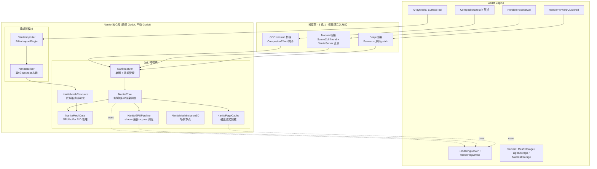
```mermaid
flowchart TB
    subgraph Godot["Godot Engine"]
        RS[RenderingServer + RenderingDevice]
        RSC[RendererSceneCull]
        RFC[RenderForwardClustered]
        ST[Servers: MeshStorage / LightStorage / MaterialStorage]
        CE[CompositorEffect 扩展点]
        MSH[ArrayMesh / SurfaceTool]
    end

    subgraph Core["Nanite 核心库 (依赖 Godot, 不改 Godot)"]
        direction TB
        subgraph CoreRT["运行时模块"]
            NS[NaniteServer<br/>单例 + 场景管理]
            NMD[NaniteMeshData<br/>GPU buffer RID 管理]
            NMC[NaniteCore<br/>实例/缓冲/渲染调度]
            NPC[NanitePageCache<br/>磁盘流式加载]
            NGP[NaniteGPUPipeline<br/>shader 编译 + pass 调度]
            NMR[NaniteMeshResource<br/>资源格式/序列化]
            NMI[NaniteMeshInstance3D<br/>场景节点]
        end
        subgraph CoreEditor["编辑器模块"]
            NB[NaniteBuilder<br/>离线 meshopt 构建]
            NI[NaniteImporter<br/>EditorImportPlugin]
        end
    end

    subgraph Bridge["桥接层 - 3 选 1 - 仅处理注入方式"]
        direction LR
        B1[GDExtension 桥接<br/>CompositorEffect 钩子]
        B2[Module 桥接<br/>SceneCull friend + NaniteServer 直调]
        B3[Deep 桥接<br/>Forward+ 源码 patch]
    end

    %% Engine → Bridge → Core
    CE --> B1
    RSC --> B2
    RFC --> B3

    B1 --> NS
    B2 --> NS
    B3 --> NS

    %% Core internal
    NS --> NMC
    NMC --> NGP
    NMC --> NPC
    NMC --> NMD
    NMR --> NMD

    %% Core uses Godot types directly
    NMC -. uses .-> RS
    NGP -. uses .-> RS
    NPC -. uses .-> RS

    %% Mesh import path
    MSH --> NI
    NI --> NB
    NB --> NMR
```

### 9.4 核心库详细设计

#### 9.4.1 NaniteServer — 统一单例

整合方案一的 `NaniteManager`、方案二的 `NaniteServer`、方案三的 `NaniteStorage`,作为核心唯一入口:

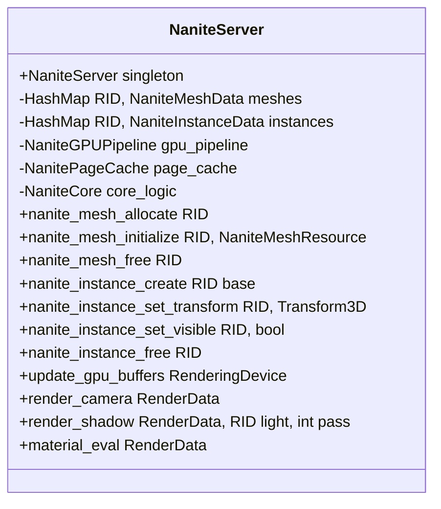
```mermaid
classDiagram
    class NaniteServer {
        +NaniteServer singleton
        -HashMap RID, NaniteMeshData meshes
        -HashMap RID, NaniteInstanceData instances
        -NaniteGPUPipeline gpu_pipeline
        -NanitePageCache page_cache
        -NaniteCore core_logic
        +nanite_mesh_allocate RID
        +nanite_mesh_initialize RID, NaniteMeshResource
        +nanite_mesh_free RID
        +nanite_instance_create RID base
        +nanite_instance_set_transform RID, Transform3D
        +nanite_instance_set_visible RID, bool
        +nanite_instance_free RID
        +update_gpu_buffers RenderingDevice
        +render_camera RenderData
        +render_shadow RenderData, RID light, int pass
        +material_eval RenderData
    }
```

#### 9.4.2 NaniteMeshResource — 统一资源类型

整合三方案的资源定义。继承 `Resource`,存储序列化数据 + 运行时 GPU 句柄:

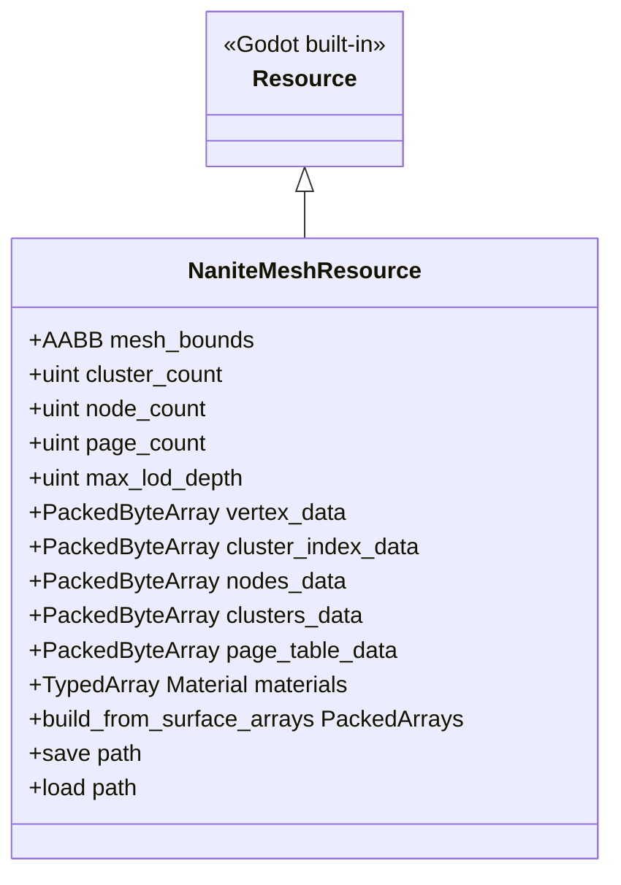
```mermaid
classDiagram
    class NaniteMeshResource {
        +AABB mesh_bounds
        +uint cluster_count
        +uint node_count
        +uint page_count
        +uint max_lod_depth
        +PackedByteArray vertex_data
        +PackedByteArray cluster_index_data
        +PackedByteArray nodes_data
        +PackedByteArray clusters_data
        +PackedByteArray page_table_data
        +TypedArray Material materials
        +build_from_surface_arrays PackedArrays
        +save path
        +load path
    }
    class Resource {
        <<Godot built-in>>
    }
    Resource <|-- NaniteMeshResource
```

#### 9.4.3 NaniteMeshData — GPU 缓冲管理

整合方案二的 `NaniteMeshData` 和方案三的 `MeshStorageRD` 改动。每个 `NaniteMeshResource` 对应一个 `NaniteMeshData`,管理其 GPU 侧 RID:

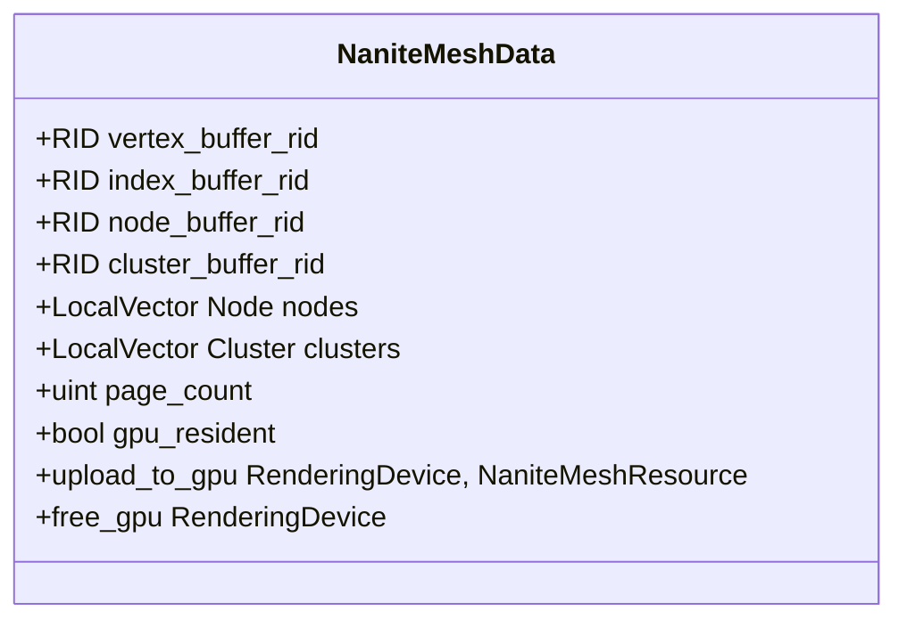
```mermaid
classDiagram
    class NaniteMeshData {
        +RID vertex_buffer_rid
        +RID index_buffer_rid
        +RID node_buffer_rid
        +RID cluster_buffer_rid
        +LocalVector Node nodes
        +LocalVector Cluster clusters
        +uint page_count
        +bool gpu_resident
        +upload_to_gpu RenderingDevice, NaniteMeshResource
        +free_gpu RenderingDevice
    }
```

#### 9.4.4 NaniteMeshInstance3D — 统一场景节点

整合三方案的实例节点。方案三中 `MeshInstance3D` 的 `set_nanite_mesh` 改动也合并到此:

```mermaid
classDiagram
    class MeshInstance3D {
        <<Godot built-in>>
    }
    class NaniteMeshInstance3D {
        -Ref NaniteMeshResource resource
        -RID nanite_instance_rid
        +set_nanite_mesh Ref NaniteMeshResource
        +get_nanite_mesh Ref NaniteMeshResource
        +ready
        +notification INTERNAL_PROCESS
    }
    MeshInstance3D <|-- NaniteMeshInstance3D
```

#### 9.4.5 NaniteGPUPipeline — Shader 编译 + Pass 调度

整合方案一的 `NaniteRenderEffect`、方案二的 `NaniteRenderStepRD`、方案三的 `_nanite_*_pass` 方法:

```mermaid
classDiagram
    class NaniteGPUPipeline {
        -RID cull_shader_rid
        -RID raster_pipeline_rid
        -RID soft_raster_pipeline_rid
        -RID material_eval_pipeline_rid
        -RID hzb_pipeline_rid
        -RID shadow_cull_pipeline_rid
        -RID shadow_depth_pipeline_rid
        +init RenderingDevice
        +cull_pass RenderingDevice, RenderData, CameraData
        +raster_pass RenderingDevice, RenderData
        +soft_raster_pass RenderingDevice, RenderData
        +build_hzb_pass RenderingDevice, RenderData
        +material_eval_pass RenderingDevice, RenderData
        +shadow_cull_pass RenderingDevice, LightData
        +shadow_depth_pass RenderingDevice, RID shadow_fb
        +cleanup RenderingDevice
    }
```

#### 9.4.6 NanitePageCache — 磁盘流式加载

三方案共用:

```mermaid
classDiagram
    class NanitePageCache {
        -HashMap uint, PageState pages
        -RID staging_buffer_rid
        - FileAccess disk_file
        +request_page mesh_id, page_id
        +process_pending_requests RenderingDevice
        +is_resident page_id bool
        +flush_to_gpu RenderingDevice
    }
```

#### 9.4.7 NaniteCore — 实例/缓冲/渲染调度

核心逻辑层,被 `NaniteServer` 持有。协调 GPUPipeline + PageCache + 实例数据:

```mermaid
classDiagram
    class NaniteCore {
        -NaniteGPUPipeline pipeline
        -NanitePageCache page_cache
        -RID instance_buffer_rid
        -RID visible_cluster_buffer_rid
        -RID page_request_buffer_rid
        -RID indirect_args_buffer_rid
        -RID visibility_buffer_rid
        -RID hzb_texture_rid
        +update_instance_buffer RenderingDevice, instances
        +render_camera_pass RenderingDevice, RenderData
        +render_shadow_pass RenderingDevice, RenderData, RID light, int pass
        +material_eval_and_composite RenderingDevice, RenderData
        +process_page_requests RenderingDevice
    }
```

### 9.5 编辑器模块:离线构建

离线构建与运行时整合完全无关,放在核心的 `editor/` 子目录。所有三方案共用同一套构建代码(基于 meshoptimizer,详见第 8 节):

```mermaid
classDiagram
    class EditorImportPlugin {
        <<Godot built-in>>
    }
    class NaniteImporter {
        +import source_file, options
        +get_visible_name
        +get_recognized_extensions
        -build_nanite_resource PackedArrays
    }
    class NaniteBuilder {
        +NaniteBuilderConfig config
        +build Ref ArrayMesh Ref NaniteMeshResource
        -preprocess_mesh verts, indices
        -build_l0_clusters verts, indices clusters
        -build_hierarchy clusters nodes
        -simplify_partition partition
        -finalize_resource clusters, nodes, verts resource
    }
    class NaniteBuilderConfig {
        +uint max_vertices = 64
        +uint max_triangles = 128
        +uint partition_size = 4
        +float cone_weight = 0.5
        +float simplification_ratio = 0.5
        +float target_error = 0.5
        +uint page_size_bytes = 65536
    }
    EditorImportPlugin <|-- NaniteImporter
    NaniteImporter --> NaniteBuilder : calls build
    NaniteBuilder --> NaniteBuilderConfig : reads
```

**要点**:
- `NaniteBuilder` 直接 `#include <thirdparty/meshoptimizer/meshoptimizer.h>`,调用 meshopt API;
- 输出 `Ref<NaniteMeshResource>`,所有序列化逻辑在 `NaniteMeshResource::save()` 中;
- 桥接层无需关心构建细节,只需调用 `NaniteImporter` 或手动触发 `NaniteBuilder::build()`。

### 9.6 三桥接层设计

桥接层**只负责"如何把核心注入 Godot 渲染管线"**,不包含任何数据结构或算法逻辑。每个桥接层的目标是 < 500 行代码。

#### 9.6.1 桥接层 1:GDExtension

```mermaid
classDiagram
    class CompositorEffect {
        <<Godot built-in>>
    }
    class NaniteGDExtBridge {
        -NaniteServer server
        +init
        +render_callback RenderDataExtension
        -hook_before_opaque RenderData
        -hook_after_opaque RenderData
    }
    CompositorEffect <|-- NaniteGDExtBridge
```

**桥接职责**(唯一代码):
1. 继承 `CompositorEffect`,在 `_render_callback` 中调用 `NaniteServer::render_camera()`;
2. 在 `BEFORE_OPAQUE_PASS` 做 cull + raster + HZB;
3. 在 `AFTER_OPAQUE_PASS` 做 material eval + composite;
4. 阴影变通:在 `BEFORE_OPAQUE_PASS` 中遍历可见灯光,调 `NaniteServer::render_shadow()`;
5. 实例注册:在 `NaniteMeshInstance3D::_ready()` 时调 `NaniteServer::nanite_instance_create()`。

**核心不关心的**:桥接如何被引擎回调、CompositorEffect 的生命周期、RenderDataExtension 如何取到。

#### 9.6.2 桥接层 2:Module

```mermaid
classDiagram
    class RendererSceneCull {
        <<Godot, friend access>>
    }
    class NaniteModuleBridge {
        -NaniteServer server
        +on_cull_collect_instances RendererSceneCull
        +on_pre_shadow_pass RenderData, RID light, int pass
        +on_pre_opaque_pass RenderData
        +on_post_opaque_pass RenderData
    }
    RendererSceneCull ..> NaniteModuleBridge : queries nanite instances
```

**桥接职责**(唯一代码):
1. 在 `RendererSceneCull` 收集实例时,标记 `nanite` 实例并从标准列表排除;
2. 在 shadow pass 前调 `NaniteServer::render_shadow()`;
3. 在 `_render_scene` 的 opaque pass 前调 `NaniteServer::render_camera()`,后调 `NaniteServer::material_eval()`;
4. 注册 `NaniteServer` 为 ClassDB 单例;
5. 注册 `NaniteMeshResource`、`NaniteMeshInstance3D` 到 ClassDB。

**核心不关心的**:实例如何被 SceneCull 分流、shadow pass 的调用时机、ClassDB 注册流程。

#### 9.6.3 桥接层 3:Deep

```mermaid
classDiagram
    class RenderForwardClustered {
        <<Godot, source patched>>
    }
    class NaniteDeepBridge {
        -NaniteServer server
        +patch_render_scene RenderDataRD
        +patch_render_shadow_pass RenderDataRD, RID light, int pass
        +patch_fill_render_list exclude nanite instances
    }
    RenderForwardClustered ..> NaniteDeepBridge : calls
```

**桥接职责**(唯一代码):
1. 在 `_render_scene` 中插入 `_nanite_*_pass` 调用点;
2. 在 `_render_shadow_pass` 中插入 Nanite shadow 调用;
3. 在 `_fill_render_list` 中排除 nanite 实例;
4. 在 `RenderingServer` 接口中新增 `nanite_*` 方法;
5. 在 `MeshInstance3D` 中新增 `set_nanite_mesh` 属性(可选,或直接用 `NaniteMeshInstance3D`)。

**核心不关心的**:`_render_scene` 的调用顺序、`_fill_render_list` 的实现、`RenderingServer` 的 API 边界。

### 9.7 三桥接层对照矩阵

| 能力 / 桥接层 | GDExtension 桥接 | Module 桥接 | Deep 桥接 |
|---|---|---|---|
| **接入方式** | 外部插件 | 编译进 modules/ | 改引擎源码 |
| **引擎源码改动** | 0 | 仅新增 | 多处修改 |
| **桥接代码量** | ~300 行 | ~200 行 | ~150 行 |
| **核心调用入口** | CompositorEffect callback | SceneCull + NaniteServer 直调 | _render_scene 内嵌 |
| **实例分流** | visible=false 隐藏代理 mesh | instance_set_nanite 跳过 std cull | _fill_render_list 排除 |
| **阴影路径** | BEFORE_OPAQUE 内变通 | hook shadow pass 前 | _render_shadow_pass 内嵌 |
| **材质绑定** | RenderDataExtension 提取 | MaterialStorage 直接取 | StandardMaterial3D 直接 |
| **NaniteServer 注册** | ClassDB GDExtension | ClassDB 原生 | RenderingServer 原生 |
| **跟随上游升级** | 仅跟 API surface | 仅跟 module header | 需要 rebase patch |

### 9.8 完整调用时序(以 Module 桥接为例)

```mermaid
sequenceDiagram
    participant App as Application
    participant Cull as RendererSceneCull
    participant FC as RenderForwardClustered
    participant Bridge as NaniteModuleBridge
    participant Server as NaniteServer
    participant Core as NaniteCore
    participant GPU as NaniteGPUPipeline
    participant RD as RenderingDevice

    Note over App,RD: === 导入阶段 - 核心编辑器模块 ===
    App->>Server: nanite_mesh_initialize via NaniteImporter
    Server->>Server: NaniteBuilder.build via meshoptimizer
    Server->>RD: create_buffer for vertex/index/node/cluster

    Note over App,RD: === 运行时实例注册 - 核心运行时 ===
    App->>Server: nanite_instance_create mesh_id

    Note over App,RD: === 每帧渲染 - 桥接层协调 ===
    App->>Cull: render_camera
    Cull->>Bridge: on_cull_collect_instances
    Bridge->>Server: query nanite instance list
    Server->>Core: update_instance_buffer
    Cull->>FC: _render_scene

    FC->>Bridge: on_pre_shadow_pass rd, light, pass
    Bridge->>Server: render_shadow rd, light, pass
    Server->>Core: render_shadow_pass
    Core->>GPU: shadow_cull_pass + shadow_depth_pass
    GPU->>RD: compute + draw_list

    FC->>Bridge: on_pre_opaque_pass rd
    Bridge->>Server: render_camera rd
    Server->>Core: render_camera_pass
    Core->>GPU: cull + raster + hzb
    GPU->>RD: compute + draw_list

    FC->>FC: render std opaque - Nanite excluded

    FC->>Bridge: on_post_opaque_pass rd
    Bridge->>Server: material_eval rd
    Server->>Core: material_eval_and_composite
    Core->>GPU: material_eval_pass
    GPU->>RD: compute

    FC->>FC: sky / transparent / post
    FC-->>Cull: done
```

### 9.9 包结构

```
nanite/                                 # 核心库(依赖 Godot, 不改 Godot)
├── runtime/                            # 运行时模块
│   ├── nanite_server.h/.cpp            # NaniteServer 单例
│   ├── nanite_core.h/.cpp              # NaniteCore 渲染调度
│   ├── nanite_mesh_resource.h/.cpp     # NaniteMeshResource 资源
│   ├── nanite_mesh_data.h/.cpp         # NaniteMeshData GPU 缓冲
│   ├── nanite_mesh_instance_3d.h/.cpp  # NaniteMeshInstance3D 节点
│   ├── nanite_gpu_pipeline.h/.cpp      # NaniteGPUPipeline shader/pass
│   ├── nanite_page_cache.h/.cpp        # NanitePageCache 流式加载
│   └── shaders/                        # GLSL 源码
│       ├── cull.glsl
│       ├── raster.vert / .frag
│       ├── soft_raster.glsl
│       ├── material_eval.glsl
│       ├── hzb_build.glsl
│       └── shadow_cull.glsl
├── editor/                             # 编辑器模块(离线构建)
│   ├── nanite_builder.h/.cpp           # NaniteBuilder (meshopt)
│   ├── nanite_builder_config.h         # NaniteBuilderConfig
│   └── nanite_importer.h/.cpp          # NaniteImporter
└── SCsub                               # SCons 构建脚本

bridge_gdextension/                     # 桥接层 1:GDExtension
├── nanite_gdext_bridge.h/.cpp          # CompositorEffect 子类
├── register_types.cpp
├── .gdextension
└── SCsub

bridge_module/                          # 桥接层 2:C++ Module
├── nanite_module_bridge.h/.cpp         # SceneCull hook
├── register_types.cpp
└── SCsub

bridge_deep/                            # 桥接层 3:引擎深度改造
├── patches/                            # git-format-patch
│   ├── render_forward_clustered.patch
│   ├── renderer_scene_cull.patch
│   ├── rendering_server.patch
│   └── ...
└── README.md
```

### 9.10 核心对各方案的 API 暴露

核心库通过 `NaniteServer` 提供统一 API,三种桥接层以不同方式调用:

```cpp
// nanite/runtime/nanite_server.h
class NaniteServer : public Object {
    GDCLASS(NaniteServer, Object);
    static NaniteServer *singleton;

    NaniteCore *core;
    NaniteGPUPipeline *pipeline;
    NanitePageCache *page_cache;
    HashMap<RID, NaniteMeshData> meshes;
    HashMap<RID, NaniteInstanceData> instances;

public:
    static NaniteServer *get_singleton();

    // —— Mesh 管理(桥接层通过这些 API 操作)——
    RID nanite_mesh_allocate();
    void nanite_mesh_initialize(RID p_mesh, const Ref<NaniteMeshResource> &p_resource);
    void nanite_mesh_free(RID p_mesh);

    // —— Instance 管理 ——
    RID nanite_instance_create(RID p_base);
    void nanite_instance_set_transform(RID p_instance, const Transform3D &p_transform);
    void nanite_instance_set_visible(RID p_instance, bool p_visible);
    void nanite_instance_free(RID p_instance);

    // —— 渲染调度(桥接层在合适的时机调用)——
    void update_gpu_buffers(RenderingDevice *p_rd);
    void render_camera(RenderData *p_render_data);
    void render_shadow(RenderData *p_render_data, RID p_light, int p_pass);
    void material_eval(RenderData *p_render_data);
};
```

**三种桥接层调用方式**:

| API | GDExtension 桥接 | Module 桥接 | Deep 桥接 |
|---|---|---|---|
| `nanite_instance_create` | `NaniteMeshInstance3D::_ready()` 内调 | 同左 | `MeshInstance3D::_notification()` 内调 |
| `render_camera` | `CompositorEffect::BEFORE_OPAQUE` callback | `RendererSceneCull` hook | `_render_scene` 内直接调 |
| `render_shadow` | `BEFORE_OPAQUE` 内遍历灯光 | shadow pass 前 hook | `_render_shadow_pass` 内调 |
| `material_eval` | `CompositorEffect::AFTER_OPAQUE` callback | opaque 后 hook | `_render_scene` 内调 |
| `update_gpu_buffers` | `BEFORE_OPAQUE` callback 内 | `_render_scene` 前 | `_render_scene` 前 |

### 9.11 桥接层代码示例

#### GDExtension 桥接(~300 行)

```cpp
// bridge_gdextension/nanite_gdext_bridge.h
class NaniteGDExtBridge : public CompositorEffect {
    GDCLASS(NaniteGDExtBridge, CompositorEffect);

public:
    void init() {
        NaniteServer::get_singleton();  // 确保核心初始化
        set_callback(RS::COMPOSITOR_EFFECT_CALLBACK_BEFORE_OPAQUE_PASS,
                     callable_mp(this, &NaniteGDExtBridge::_render_callback));
        set_callback(RS::COMPOSITOR_EFFECT_CALLBACK_AFTER_OPAQUE_PASS,
                     callable_mp(this, &NaniteGDExtBridge::_render_callback));
    }

private:
    void _render_callback(const Ref<RenderDataExtension> &p_rd) {
        auto cb = get_active_callback_type();
        NaniteServer *srv = NaniteServer::get_singleton();
        RenderingDevice *rd = RenderingServer::get_singleton()->get_rendering_device();

        if (cb == RS::COMPOSITOR_EFFECT_CALLBACK_BEFORE_OPAQUE_PASS) {
            srv->update_gpu_buffers(rd);
            // 阴影变通:在 BEFORE_OPAQUE 内自己处理
            for (auto &light : get_shadow_lights(p_rd)) {
                srv->render_shadow(p_rd->get_render_data(), light.rid, light.pass);
            }
            srv->render_camera(p_rd->get_render_data());
        } else {  // AFTER_OPAQUE_PASS
            srv->material_eval(p_rd->get_render_data());
        }
    }
};
```

#### Module 桥接(~200 行)

```cpp
// bridge_module/nanite_module_bridge.h
class NaniteModuleBridge {
    static NaniteModuleBridge *singleton;
public:
    static NaniteModuleBridge *get_singleton() { return singleton; }

    // 由 RendererSceneCull friend 调用
    void on_cull_collect_instances(RendererSceneCull *p_cull) {
        // 标记 nanite 实例,从标准列表排除
        p_cull->_instance_filter_nanite();
    }

    // 由 _render_scene hook 调用
    void on_pre_shadow_pass(RenderData *p_rd, RID p_light, int p_pass) {
        NaniteServer::get_singleton()->render_shadow(p_rd, p_light, p_pass);
    }
    void on_pre_opaque_pass(RenderData *p_rd) {
        NaniteServer::get_singleton()->update_gpu_buffers(
            RenderingServer::get_singleton()->get_rendering_device());
        NaniteServer::get_singleton()->render_camera(p_rd);
    }
    void on_post_opaque_pass(RenderData *p_rd) {
        NaniteServer::get_singleton()->material_eval(p_rd);
    }
};
```

#### Deep 桥接(~150 行)

```cpp
// bridge_deep/  — 作为 patch 应用到引擎源码

// 在 RenderForwardClustered::_render_scene 中插入:
void RenderForwardClustered::_render_scene(RenderDataRD *p_rd, ...) {
    // ... 原有 shadow setup ...
    if (p_rd->has_nanite_instances) {
        for (auto &sp : p_rd->render_shadows) {
            NaniteServer::get_singleton()->render_shadow(p_rd, sp.light, sp.pass);
        }
    }
    // ... 原有 GI / SSAO ...
    if (p_rd->has_nanite_instances) {
        NaniteServer::get_singleton()->update_gpu_buffers(rendering_device);
        NaniteServer::get_singleton()->render_camera(p_rd);
    }
    // ... 原有 _renderOpaqueForward (Nanite 实例已排除) ...
    if (p_rd->has_nanite_instances) {
        NaniteServer::get_singleton()->material_eval(p_rd);
    }
    // ... sky / transparent / post ...
}
```

### 9.12 与方案一二三的关系澄清

第 9 节**不是第四套方案**,而是前三套方案的**重新组织**:

| 原章节 | 原内容 | 现归属 |
|---|---|---|
| 第 3 节 NaniteManager | 实例管理 + buffer 管理 + 渲染调度 | 核心运行时 `NaniteServer` + `NaniteCore` |
| 第 3 节 NaniteRenderEffect | shader 编译 + pass 调度 | 核心运行时 `NaniteGPUPipeline` |
| 第 3 节 CompositorEffect 钩子 | 渲染注入方式 | 桥接层 1 `NaniteGDExtBridge` |
| 第 4 节 NaniteStorage | RID-based mesh/instance 管理 | 核心运行时 `NaniteServer` |
| 第 4 节 NaniteMeshData | GPU buffer RID 集合 | 核心运行时 `NaniteMeshData` |
| 第 4 节 NaniteRenderStepRD | shader/pipeline | 核心运行时 `NaniteGPUPipeline` |
| 第 4 节 NaniteServer hook | SceneCull 分流 + shadow hook | 桥接层 2 `NaniteModuleBridge` |
| 第 5 节 NaniteMesh | 资源格式 | 核心运行时 `NaniteMeshResource` |
| 第 5 节 MeshInstance3D 改动 | set_nanite_mesh | 核心运行时 `NaniteMeshInstance3D` |
| 第 5 节 _nanite_*_pass | 渲染 pass | 核心运行时 `NaniteGPUPipeline` |
| 第 5 节 _render_scene patch | 注入位置 | 桥接层 3 `NaniteDeepBridge` |
| 第 8 节 NaniteBuilder | 离线 meshopt 构建 | 核心编辑器 `NaniteBuilder` |
| 第 8 节 NaniteImporter | EditorImportPlugin | 核心编辑器 `NaniteImporter` |
| 第 7 节 阴影算法 | BVH 遍历 + shadow LOD | 核心运行时 `NaniteCore` |
| 第 7 节 阴影注入 | 各方案如何 hook shadow pass | 三个桥接层各自处理 |

### 9.13 实施路径

```mermaid
flowchart LR
    subgraph S1[阶段一: 核心库 + GDExtension 桥接]
        C1[nanite 核心库<br/>运行时 + 编辑器]
        B1[bridge_gdextension<br/>CompositorEffect]
        C1 --> B1
    end

    subgraph S2[阶段二: Module 桥接]
        C2[nanite 核心库<br/>已稳定]
        B2[bridge_module<br/>SceneCull hook]
        C2 --> B2
    end

    subgraph S3[阶段三: Deep 桥接 + 上游]
        C3[nanite 核心库<br/>已稳定]
        B3[bridge_deep<br/>patch + GIP]
        C3 --> B3
    end

    S1 --> S2 --> S3
    C1 -. same core .-> C2
    C2 -. same core .-> C3

    S1 -. 独立交付 .-> D1[GDExtension 插件]
    S2 -. 独立交付 .-> D2[企业 Module]
    S3 -. 上游合并 .-> D3[Godot 官方 Nanite]
```

### 9.14 风险与对策

| 风险 | 影响 | 对策 |
|---|---|---|
| 核心依赖 Godot 类型导致跨版本不兼容 | 核心需跟随 Godot 升级 | 核心只依赖稳定的 Godot 公开 API(RID/Ref/RenderingDevice),避免内部头 |
| 三桥接层行为不一致 | 测试矩阵爆炸 | 核心提供渲染流程的全部逻辑,桥接层仅决定调用时机,不改变行为 |
| 核心升级破坏桥接层 ABI | 桥接层需重编 | 桥接层只依赖 NaniteServer 公开方法,不依赖内部实现 |
| 方案三 patch 与上游冲突 | rebase 痛苦 | patch 尽量集中在调用点插入,不改变引擎原有流程 |
| NaniteMeshInstance3D 在方案三中与 MeshInstance3D 改动冲突 | 两套节点类型 | 方案三桥接可让 MeshInstance3D 直接持有 nanite_instance_rid,复用核心的 NaniteMeshData |

### 9.15 小结

**核心 + 桥接**架构把"共享逻辑"与"注入方式"正交分离:

- **核心库依赖 Godot 但不改 Godot** → 三方案共用 NaniteServer、NaniteMeshResource、NaniteGPUPipeline 等全部数据结构和算法;
- **桥接层只管注入** → 每个桥接 < 500 行,只决定"在什么时机调什么核心 API";
- **编辑器模块独立** → 离线构建(NaniteBuilder + meshoptimizer)与运行时整合完全无关;
- **算法一份代码** → 算法演进只改核心,Godot 升级只改桥接。

推荐实施顺序:阶段一(GDExtension 桥接)→ 阶段二(Module 桥接)→ 阶段三(Deep 桥接 + 上游提案)。每个阶段独立交付,共享同一份 `nanite/` 核心库。

### 9.16 桥接层的阴影支持方案

**核心问题**:Nanite 实例的几何由核心的 GPU pipeline 管理,引擎标准 shadow pass 看不到它们。但关键洞察是:Godot 的 shadow pass 并非黑盒——它是**逐 surface 渲染**的,每个 surface 可以有**独立的 shadow 几何**。

#### 9.16.1 Godot 已有的 Shadow Mesh 机制(源码依据)

Godot **已经内置了"替代阴影几何"机制**,这正是我们需要的:

**1. `mesh_set_shadow_mesh` — RenderingServer 公开 API**

```cpp
// rendering_server.h:239
virtual void mesh_set_shadow_mesh(RID p_mesh, RID p_shadow_mesh) = 0;

// 已绑定到 ClassDB, GDExtension 可调用
// rendering_server.cpp:2389
ClassDB::bind_method(D_METHOD("mesh_set_shadow_mesh", "mesh", "shadow_mesh"),
                      &RenderingServer::mesh_set_shadow_mesh);
```

**2. `_fill_render_list` 中 shadow pass 使用 `surface_shadow` 替代 `surface`**

`render_forward_clustered.cpp:360-363`:
```cpp
if (shadow_pass || p_pass_mode == PASS_MODE_DEPTH) {
    material_uniform_set = surf->material_uniform_set_shadow;
    shader = surf->shader_shadow;
    mesh_surface = surf->surface_shadow;  // ← 阴影用替代几何
} else {
    material_uniform_set = surf->material_uniform_set;
    shader = surf->shader;
    mesh_surface = surf->surface;         // ← 正常渲染用原始几何
}
```

**3. `surface_shadow` 的来源 — `mesh_get_shadow_mesh`**

`render_forward_clustered.cpp:4228-4255`:
```cpp
RID shadow_mesh = mesh_storage->mesh_get_shadow_mesh(p_mesh);
if (shadow_mesh.is_valid()) {
    surface_shadow = mesh_storage->mesh_get_surface(shadow_mesh, p_surface);
}
// ...
sdcache->surface_shadow = surface_shadow ? surface_shadow : sdcache->surface;
// 如果没有 shadow_mesh,就 fallback 到原始 surface
```

**4. `mesh_set_shadow_mesh` 的实现**

`mesh_storage.cpp:844-862`:
```cpp
void MeshStorage::mesh_set_shadow_mesh(RID p_mesh, RID p_shadow_mesh) {
    ERR_FAIL_COND_MSG(p_mesh == p_shadow_mesh, "Cannot set a mesh as its own shadow mesh.");
    // ... 更新依赖关系,触发 DEPENDENCY_CHANGED_MESH ...
}
```

#### 9.16.2 核心思路:用 Nanite 粗 LOD 的 Cluster 几何作为 Shadow Mesh

既然 Godot 已经有 `mesh_set_shadow_mesh` 机制,那么 **Nanite 的阴影方案可以极大简化**:

1. **离线构建时**:在 `NaniteBuilder` 中,从层次化 cluster 树提取一个"粗 LOD 代表几何"(比如最深 3 层的 cluster 合并后的三角形),构建为标准 `ArrayMesh`;
2. **运行时**:把粗 LOD `ArrayMesh` 通过 `mesh_set_shadow_mesh` 设置给原始 mesh;
3. **Shadow pass 时**:引擎自动用粗 LOD mesh 渲染阴影——**不需要 Nanite 自己做 shadow pass,不需要访问 shadow atlas,不需要独立 shadow texture**;
4. **三个桥接层完全不需要特殊处理阴影**。

```mermaid
flowchart LR
    subgraph Offline["离线构建 - NaniteBuilder"]
        BM[原始 Mesh] --> Build[Nanite 层次化构建]
        Build --> CL[Cluster 层次树 + BVH]
        Build --> SM[粗 LOD 代表几何<br/>取 depth=3 层的 cluster<br/>合并为标准 ArrayMesh]
    end

    subgraph Runtime["运行时"]
        NMR[NaniteMeshResource] --> Register[注册到 NaniteServer]
        Register --> SetShadow[mesh_set_shadow_mesh<br/>原始 mesh RID, 粗 LOD ArrayMesh RID]
        SetShadow --> NormalShadow[引擎标准 shadow pass<br/>自动使用 surface_shadow<br/>渲染粗 LOD 几何]
        Register --> GPURender[Nanite GPU pipeline<br/>cull + raster + material eval<br/>用于主相机渲染]
    end

    Offline --> Runtime
    NormalShadow -. 无需 Nanite 参与 .-> GPURender
```

#### 9.16.3 粗 LOD Shadow Mesh 的构建

在 `NaniteBuilder` 中,从层次化 cluster 树提取粗 LOD 代表几何:

```cpp
// nanite/editor/nanite_builder.cpp (核心编辑器模块)
Ref<ArrayMesh> NaniteBuilder::build_shadow_mesh(
        const LocalVector<NaniteCluster> &p_clusters,
        const LocalVector<NaniteClusterNode> &p_nodes,
        const LocalVector<float> &p_verts,
        const LocalVector<unsigned int> &p_meshlet_vertices,
        const LocalVector<unsigned char> &p_meshlet_triangles,
        int p_shadow_lod_depth) {
    // 1. 找到指定深度的所有节点
    LocalVector<uint32_t> shadow_cluster_ids;
    for (uint32_t i = 0; i < p_nodes.size(); i++) {
        const NaniteClusterNode &node = p_nodes[i];
        if (node.depth <= p_shadow_lod_depth && node.cluster_count > 0) {
            for (uint32_t c = node.first_cluster; c < node.first_cluster + node.cluster_count; c++) {
                shadow_cluster_ids.push_back(c);
            }
        }
    }

    // 2. 合并这些 cluster 的三角形为连续 index buffer
    LocalVector<Vector3> shadow_positions;
    LocalVector<int> shadow_indices;
    uint32_t vertex_offset = 0;
    for (uint32_t cid : shadow_cluster_ids) {
        const NaniteCluster &cluster = p_clusters[cid];
        for (uint32_t t = 0; t < cluster.triangle_count; t++) {
            // 从 meshlet micro-index 展开
            uint32_t v0 = p_meshlet_vertices[cluster.vertex_offset +
                         p_meshlet_triangles[cluster.triangle_offset + t * 3 + 0]];
            uint32_t v1 = p_meshlet_vertices[cluster.vertex_offset +
                         p_meshlet_triangles[cluster.triangle_offset + t * 3 + 1]];
            uint32_t v2 = p_meshlet_vertices[cluster.vertex_offset +
                         p_meshlet_triangles[cluster.triangle_offset + t * 3 + 2]];
            shadow_indices.push_back(vertex_offset + v0);
            shadow_indices.push_back(vertex_offset + v1);
            shadow_indices.push_back(vertex_offset + v2);
        }
        // 添加顶点
        for (uint32_t v = 0; v < cluster.vertex_count; v++) {
            uint32_t vid = p_meshlet_vertices[cluster.vertex_offset + v];
            shadow_positions.push_back(Vector3(
                p_verts[vid * 3 + 0], p_verts[vid * 3 + 1], p_verts[vid * 3 + 2]));
        }
        vertex_offset += cluster.vertex_count;
    }

    // 3. 构建标准 ArrayMesh
    Ref<ArrayMesh> shadow_mesh;
    shadow_mesh.instantiate();
    Array arrays;
    arrays.resize(Mesh::ARRAY_MAX);
    PackedVector3Array pos_array;
    PackedInt32Array idx_array;
    for (const Vector3 &p : shadow_positions) pos_array.push_back(p);
    for (int idx : shadow_indices) idx_array.push_back(idx);
    arrays[Mesh::ARRAY_VERTEX] = pos_array;
    arrays[Mesh::ARRAY_INDEX] = idx_array;
    shadow_mesh->add_surface_from_arrays(Mesh::PRIMITIVE_TRIANGLES, arrays);

    return shadow_mesh;
}
```

#### 9.16.4 运行时注册 Shadow Mesh

`NaniteMeshResource` 持有粗 LOD `ArrayMesh` 的 RID:

```cpp
// nanite/runtime/nanite_mesh_resource.h
class NaniteMeshResource : public Resource {
    GDCLASS(NaniteMeshResource, Resource);
    Ref<ArrayMesh> shadow_mesh;  // 粗 LOD 代表几何
    // ...
};

// nanite/runtime/nanite_mesh_instance_3d.cpp
void NaniteMeshInstance3D::_ready() {
    if (nanite_resource.is_valid()) {
        NaniteServer::get_singleton()->nanite_instance_create(...);

        // 把粗 LOD 设为 shadow_mesh — 引擎自动在 shadow pass 中使用
        RID base_mesh_rid = get_mesh();  // 原始 mesh RID(可见性已隐藏)
        if (base_mesh_rid.is_valid() && nanite_resource->shadow_mesh.is_valid()) {
            RenderingServer::get_singleton()->mesh_set_shadow_mesh(
                base_mesh_rid,
                nanite_resource->shadow_mesh->get_rid());
        }
    }
}
```

**关键**:`mesh_set_shadow_mesh` 是 `RenderingServer` 的公开 API,已绑定到 ClassDB,所以 **GDExtension、Module、Deep 三种桥接层都能调用**,无需任何特殊权限。

#### 9.16.5 Shadow Mesh 的 LOD 精度选择

| shadow_lod_depth | 三角形数(100 万 tri 原始 mesh) | 阴影质量 | 适用场景 |
|---|---|---|---|
| 1 | ~8000 tri | 低(轮廓粗糙) | 移动端 / 远距离物体 |
| 2 | ~32000 tri | 中 | 默认推荐 |
| 3 | ~128000 tri | 高 | PC 端 / 近距离主角 |
| 4 | ~512000 tri | 极高 | 特殊需求(不推荐) |

用户可通过 `NaniteBuilderConfig::shadow_lod_depth` 控制,默认值为 2。

#### 9.16.6 与动态 LOD 的对比

| 维度 | 动态 LOD(Nanite GPU cull per light) | 静态 Shadow Mesh(粗 LOD ArrayMesh) |
|---|---|---|
| 几何精度 | 每帧按需选择 cluster | 固定粗 LOD |
| 实现复杂度 | 极高(需 shadow callback + 写 shadow atlas) | **极低**(用 `mesh_set_shadow_mesh`) |
| 桥接层代码 | 需大量阴影专用代码 | **零额外代码** |
| GDExtension 支持 | 需变通(独立 shadow atlas) | **完全支持**(公开 API) |
| 性能 | 最优(只渲染可见 cluster) | 略差(整个粗 LOD 都渲染) |
| 内存 | 零额外(复用 Nanite cluster buffer) | 额外 ArrayMesh(~100KB-1MB) |
| 闪烁/跳变 | 无(cluster 级切换) | LOD 层切换时有轻微跳变 |

**结论**:对于绝大多数场景,静态 Shadow Mesh 方案在质量和复杂度之间取得了最佳平衡。动态 per-light LOD 仅在极端场景(超近距 + 超高精度阴影)下有必要,可作为方案三的后续优化。

#### 9.16.7 进阶:动态更新 Shadow Mesh(可选)

对于需要更精确阴影的场景,可在核心中实现**帧级 shadow mesh 更新**:

```cpp
// nanite/runtime/nanite_core.cpp
void NaniteCore::update_shadow_mesh(RenderingDevice *p_rd, RID p_base_mesh) {
    // 1. 从 GPU readback 本帧可见 cluster 列表
    // 2. 选取比 shadow_lod_depth 更细一级的 cluster
    // 3. 用 RenderingServer::mesh_surface_update_region 更新 ArrayMesh
    // 4. 自动触发 mesh_set_shadow_mesh 的依赖更新

    // 注意:此方案仅在 Module/Deep 桥接中可行
    // (GDExtension 不能直接操作 mesh surface region)
}
```

此为**可选优化**,不影响核心设计。

#### 9.16.8 重新审视三桥接层的阴影能力

使用 `mesh_set_shadow_mesh` 方案后:

| 能力 | GDExtension 桥接 | Module 桥接 | Deep 桥接 |
|---|---|---|---|
| Shadow 支持 | ✅ mesh_set_shadow_mesh(公开 API) | ✅ 同左 | ✅ 同左 |
| 独立 shadow atlas | **不需要** | **不需要** | **不需要** |
| 写入引擎 shadow atlas | **不需要** | **不需要** | **不需要** |
| 标准 mesh 看 Nanite 阴影 | ✅ 是(同一 shadow pass) | ✅ 是 | ✅ 是 |
| Nanite 看标准 mesh 阴影 | ✅ 是(同一 shadow atlas) | ✅ 是 | ✅ 是 |
| 方向光 PSSM | ✅ 引擎自动处理 | ✅ 是 | ✅ 是 |
| 阴影质量 | 粗 LOD 固定 | 同左 | 同左 |
| 桥接层额外代码 | **零** | **零** | **零** |
| 动态 LOD 阴影(进阶) | ❌ | ⚠️ 可选 | ✅ 可选 |

**核心结论**:通过 `mesh_set_shadow_mesh`,三个桥接层**完全不需要特殊处理阴影**。Nanite 粗 LOD 几何作为标准 ArrayMesh 设为 shadow_mesh,引擎的 shadow pass 自动使用它。这是**最简洁、最可靠、三方案统一**的阴影方案。

---

## 附录 B:资源文件格式(序列化)

`*.nanite` 文件(二进制,配合 `.res` 索引):

```
NANM  (magic, 4 bytes)
uint32 version
uint32 vertex_count, uint32 vertex_stride
uint32 cluster_count, uint32 node_count
uint32 page_count, uint32 page_size
[vertex data]
[cluster index data]
[cluster metadata array]
[node array]
[page table: per page {file_offset, byte_size, mesh_id, page_id}]
```

`NaniteMeshResource`(`.res`):仅记录元信息 + 指向 `.nanite` 文件的路径,真正几何数据走磁盘流式。这样大 mesh 不会撑爆 `.res`。

## 附录 C:参考与致谢

- Brian Karis, *A Deep Dive into Nanite Virtualized Geometry*, SIGGRAPH 2021.
- Tzu-Mao Li, *Nanite*, UCSD CSE 272 Lecture Notes, Wi 2022.
- Godot Engine 内部渲染架构文档:`docs/contributing/development/core_and_modules/internal_rendering_architecture.rst`。
- Godot 源码 `servers/rendering/storage/render_data_extension.h`、`rendering_method.h`、`storage/mesh_storage.h`。
