# Nanite 虚拟化几何总体设计文档

> 基于 Godot 4.7.1 | 一份核心代码 · 三种桥接可切换

---

## 目录

1. [文档定位与目标](#1-文档定位与目标)
2. [总体架构](#2-总体架构)
3. [目录与构建组织](#3-目录与构建组织)
4. [桥接切换机制](#4-桥接切换机制)
5. [核心类设计](#5-核心类设计)
6. [三阶段实施路径](#6-三阶段实施路径)
7. [阶段一：GDExtension 桥接](#7-阶段一gdextension-桥接)
8. [阶段二：Module 桥接](#8-阶段二module-桥接)
9. [阶段三：Deep 桥接](#9-阶段三deep-桥接)
10. [关键 API 对照表](#10-关键-api-对照表)
11. [验证与测试矩阵](#11-验证与测试矩阵)
12. [与调研文档差异说明](#12-与调研文档差异说明)
13. [附录：实施检查清单](#附录实施检查清单)

---

## 1. 文档定位与目标

### 1.1 文档定位

本文档是 Nanite 虚拟化几何系统的**总体设计文档**，在调研文档 `nanite-godot-design.md` 的基础上：

- 统一三套方案为**一份核心代码 + 三种可切换桥接**的架构
- 基于 Godot 4.7.1 **真实 API** 给出精确的编码依据
- 提供 Mermaid 类图、流程图、时序图，可直接指导实现

### 1.2 目标

| 目标 | 说明 |
|------|------|
| 架构统一 | nanite/ 核心库三阶段共用，通过 INaniteBridge 抽象接口暴露渲染入口 |
| 编译期选择 | SCons 开关 `nanite_bridge=gdext\|module\|deep\|all` 决定编译哪些桥接 |
| 运行时激活 | ProjectSettings `nanite/bridge/active` 在已编译的桥接中激活一个 |
| 阶段递进 | GDExtension → Module → Deep，能力逐级增强，核心代码无需重写 |
| API 精确 | 所有 API 均基于 Godot 4.7.1 源码验证，纠正调研文档中的命名错误 |

### 1.3 术语

| 术语 | 含义 |
|------|------|
| 桥接(Bridge) | 连接 nanite/ 核心库与 Godot 渲染管线的适配层 |
| 阶段一(GDExt) | 以 CompositorEffect 子类接入渲染管线 |
| 阶段二(Module) | 以 RendererSceneCull hook 接入渲染管线 |
| 阶段三(Deep) | 以源码 patch 直接修改引擎渲染管线 |
| 粗 LOD | 使用 `mesh_set_shadow_mesh` 设置的低精度阴影网格 |
| 动态 GPU Shadow | Nanite 在 GPU 上为每个光源渲染阴影，写入引擎 shadow atlas |

---

## 2. 总体架构

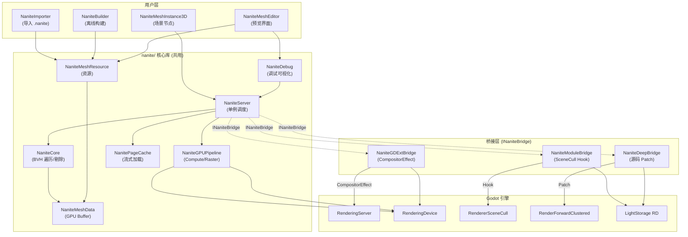

**核心思想**：nanite/ 目录下的所有类（NaniteServer/Core/GPUPipeline 等）不依赖任何特定桥接；桥接层实现 INaniteBridge 接口，负责"何时调用核心库"和"如何把结果喂回引擎"。

---

## 3. 目录与构建组织

```
godot/
├── nanite/                          # 核心库 (三阶段共用)
│   ├── SConscript
│   ├── nanite_server.h/.cpp
│   ├── nanite_core.h/.cpp
│   ├── nanite_mesh_resource.h/.cpp
│   ├── nanite_mesh_data.h/.cpp
│   ├── nanite_mesh_instance_3d.h/.cpp
│   ├── nanite_gpu_pipeline.h/.cpp
│   ├── nanite_page_cache.h/.cpp
│   ├── nanite_debug.h/.cpp
│   ├── nanite_builder.h/.cpp
│   ├── nanite_importer.h/.cpp
│   ├── nanite_bridge.h              # INaniteBridge 抽象接口
│   ├── editor/                      # 编辑器扩展 (预览界面)
│   │   ├── nanite_mesh_editor.h/.cpp
│   │   ├── nanite_editor_plugin.h/.cpp
│   │   └── nanite_resource_preview.h/.cpp
│   ├── shaders/
│   │   ├── nanite_cull.glsl
│   │   ├── nanite_rasterize.glsl
│   │   ├── nanite_shadow_rasterize.glsl
│   │   └── nanite_material_resolve.glsl
│   └── include/
│       └── nanite_bridge_types.h    # 枚举/结构体定义
│
├── nanite_bridge_gdext/             # 阶段一桥接 (GDExtension)
│   ├── SConscript
│   ├── nanite_gdext_bridge.h/.cpp
│   ├── nanite_gdext_plugin.h/.cpp   # GDExtension entry
│   └── register_types.h/.cpp
│
├── modules/nanite_bridge_module/    # 阶段二桥接 (Module)
│   ├── SConscript
│   ├── SCsub
│   ├── config.py
│   ├── nanite_module_bridge.h/.cpp
│   ├── nanite_scene_cull_hook.h/.cpp
│   └── register_types.h/.cpp
│
├── nanite_bridge_deep/              # 阶段三桥接 (源码 Patch)
│   ├── patches/
│   │   ├── renderer_scene_cull.patch
│   │   ├── render_forward_clustered.patch
│   │   └── light_storage.patch
│   ├── nanite_deep_bridge.h/.cpp
│   └── SConscript
│
└── SConstruct                       # 顶层添加 nanite_bridge= 开关
```

### 3.1 SCons 编译开关

```python
# SConstruct (或 nanite/ 顶层 SConscript)
nanite_bridge_arg = ARGUMENTS.get("nanite_bridge", "gdext")

# 核心库始终编译
SConscript("nanite/SConscript")

if nanite_bridge_arg in ("gdext", "all"):
    SConscript("nanite_bridge_gdext/SConscript")
if nanite_bridge_arg in ("module", "all"):
    SConscript("modules/nanite_bridge_module/SConscript")
if nanite_bridge_arg in ("deep", "all"):
    SConscript("nanite_bridge_deep/SConscript")
```

### 3.2 编译期宏

```cpp
// 由 SConscript 根据开关定义
// nanite_bridge_gdext:   NANITE_BRIDGE_GDEXT
// nanite_bridge_module:  NANITE_BRIDGE_MODULE
// nanite_bridge_deep:    NANITE_BRIDGE_DEEP
```

---

## 4. 桥接切换机制

### 4.1 INaniteBridge 抽象接口

```cpp
// nanite/nanite_bridge.h
class INaniteBridge {
public:
    enum class ShadowMode {
        SHADOW_COARSE_LOD,    // 阶段一：粗 LOD shadow mesh
        SHADOW_DYNAMIC_GPU,   // 阶段二/三：动态 per-light GPU shadow
    };

    virtual ~INaniteBridge() = default;

    // 安装桥接，设置 NaniteServer 的阴影模式等
    virtual void install(NaniteServer *p_server) = 0;

    // 获取当前阴影模式
    virtual ShadowMode get_shadow_mode() const = 0;

    // 渲染前回调（由桥接在合适时机调用）
    virtual void on_pre_render(const RenderData *p_render_data) = 0;

    // 不透明 Pass 前回调
    virtual void on_pre_opaque_pass(const RenderData *p_render_data) = 0;

    // 不透明 Pass 后回调（材质解析）
    virtual void on_post_opaque_pass(const RenderData *p_render_data) = 0;

    // 阴影 Pass 回调（阶段二/三）
    virtual void on_shadow_pass(const RenderData *p_render_data, RID p_light, int p_pass) = 0;

    // 获取桥接名称
    virtual StringName get_bridge_name() const = 0;
};
```

### 4.2 编译期宏控制

```cpp
// nanite/nanite_server.cpp
#include "nanite_bridge.h"

#if defined(NANITE_BRIDGE_GDEXT)
#include "nanite_gdext_bridge.h"
#endif
#if defined(NANITE_BRIDGE_MODULE)
#include "nanite_module_bridge.h"
#endif
#if defined(NANITE_BRIDGE_DEEP)
#include "nanite_deep_bridge.h"
#endif
```

### 4.3 运行时 ProjectSettings 激活

```cpp
// nanite/nanite_server.cpp — NaniteServer::init()

void NaniteServer::init() {
    // 注册 ProjectSettings
    if (!ProjectSettings::get_singleton()->has_setting("nanite/bridge/active")) {
        ProjectSettings::get_singleton()->set("nanite/bridge/active", "gdext");
    }
    ProjectSettings::get_singleton()->set_custom_property_info(
        "nanite/bridge/active",
        PropertyInfo(Variant::STRING, "nanite/bridge/active",
                     PROPERTY_HINT_ENUM, "gdext,module,deep"));

    // 运行时选择
    String active = GLOBAL_GET("nanite/bridge/active");

#if defined(NANITE_BRIDGE_GDEXT)
    if (active == "gdext") {
        bridge = memnew(NaniteGDExtBridge);
    }
#endif
#if defined(NANITE_BRIDGE_MODULE)
    if (active == "module") {
        bridge = memnew(NaniteModuleBridge);
    }
#endif
#if defined(NANITE_BRIDGE_DEEP)
    if (active == "deep") {
        bridge = memnew(NaniteDeepBridge);
    }
#endif

    if (bridge) {
        bridge->install(this);
    } else {
        ERR_PRINT(vformat("Nanite: bridge '%s' not available (not compiled).", active));
    }
}
```

### 4.4 切换机制流程

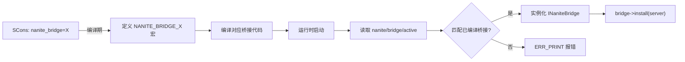

---

## 5. 核心类设计

```mermaid
classDiagram
    class NaniteServer {
        -static NaniteServer *singleton
        -INaniteBridge *bridge
        -ShadowMode shadow_mode
        -HashMap~RID, NaniteMeshData*~ mesh_map
        -HashMap~ObjectID, NaniteMeshInstance3D*~ instance_map
        -NaniteGPUPipeline *gpu_pipeline
        -NanitePageCache *page_cache
        -NaniteDebug *debug
        +init() void
        +finish() void
        +set_shadow_mode(mode: ShadowMode) void
        +get_shadow_mode() ShadowMode
        +register_mesh(resource: NaniteMeshResource) RID
        +unregister_mesh(rid: RID) void
        +register_instance(instance: NaniteMeshInstance3D) void
        +unregister_instance(instance: NaniteMeshInstance3D) void
        +render_visibility(p_render_data: RenderData*) void
        +render_shadow(p_render_data: RenderData*, p_light: RID, p_pass: int) void
        +render_material_resolve(p_render_data: RenderData*) void
        +get_bridge() INaniteBridge*
    }

    class NaniteCore {
        -NaniteGPUPipeline *gpu
        -NanitePageCache *cache
        +cull_and_lod(camera: Projection, view: Transform3D, instances: Vector~Instance~) Vector~ClusterGroup~
        +build_visibility_buffer(rd: RenderingDevice*, clusters: Vector~ClusterGroup~) RID
        +resolve_materials(rd: RenderingDevice*, vis_buffer: RID) void
    }

    class NaniteMeshResource {
        -RID shadow_mesh_rid
        -Vector~Cluster~ clusters
        -BVH bvh
        -PackedByteArray gpu_cluster_data
        -PackedByteArray gpu_vertex_data
        -AABB aabb
        -int cluster_count
        -int lod_count
        +get_shadow_mesh() RID
        +set_shadow_mesh(rid: RID) void
        +get_cluster_count() int
        +get_gpu_cluster_buffer() PackedByteArray
        +get_gpu_vertex_buffer() PackedByteArray
    }

    class NaniteMeshData {
        -RID cluster_ssbo
        -RID vertex_ssbo
        -RID index_ssbo
        -RID bvh_ssbo
        -RID vis_buffer
        -bool gpu_uploaded
        +upload_to_gpu(rd: RenderingDevice*) void
        +get_cluster_ssbo() RID
        +get_vertex_ssbo() RID
        +get_vis_buffer() RID
    }

    class NaniteMeshInstance3D {
        -Ref~NaniteMeshResource~ nanite_mesh
        -RID mesh_rid
        -bool nanite_enabled
        -int forced_lod
        -float relative_screen_size
        +set_nanite_mesh(resource: NaniteMeshResource) void
        +get_nanite_mesh() NaniteMeshResource
        +set_nanite_enabled(enabled: bool) void
        +_notification(what: int) void
    }

    class NaniteGPUPipeline {
        -RID cull_shader
        -RID rasterize_shader
        -RID shadow_rasterize_shader
        -RID material_resolve_shader
        -RID cull_pipeline
        -RID rasterize_pipeline
        -RID shadow_pipeline
        -RID material_pipeline
        +init(rd: RenderingDevice*) void
        +dispatch_cull(rd: RenderingDevice*, params: CullParams) RID
        +dispatch_rasterize(rd: RenderingDevice*, vis_buffer: RID) void
        +dispatch_shadow_rasterize(rd: RenderingDevice*, shadow_fb: RID, params: ShadowParams) void
        +dispatch_material_resolve(rd: RenderingDevice*, vis_buffer: RID) void
    }

    class NanitePageCache {
        -HashMap~uint64_t, PageEntry~ page_table
        -List~uint64_t~ lru
        -int max_resident_pages
        +request_page(page_id: uint64_t) bool
        +evict_lru() void
        +get_resident_count() int
    }

    class NaniteDebug {
        -bool show_bounds
        -bool show_clusters
        -bool show_bvh
        -int highlight_lod
        +set_show_bounds(show: bool) void
        +set_show_clusters(show: bool) void
        +draw_debug(rd: RenderingDevice*, vis_buffer: RID) void
    }

    class INaniteBridge {
        <<interface>>
        +install(p_server: NaniteServer*) void
        +get_shadow_mode() ShadowMode
        +on_pre_render(p_render_data: RenderData*) void
        +on_pre_opaque_pass(p_render_data: RenderData*) void
        +on_post_opaque_pass(p_render_data: RenderData*) void
        +on_shadow_pass(p_render_data: RenderData*, p_light: RID, p_pass: int) void
        +get_bridge_name() StringName
    }

    class NaniteBuilder {
        +build_from_mesh(mesh: ArrayMesh) NaniteMeshResource
        -partition_meshlets(indices: Vector~int~, vertices: Vector~Vector3~) Vector~Meshlet~
        -simplify(mesh: Mesh, target_ratio: float) Mesh
        -build_bvh(meshlets: Vector~Meshlet~) BVH
    }

    class NaniteImporter {
        +get_importer_name() String
        +get_recognized_extensions() Vector~String~
        +import(source_file: String, save_path: String, options: Dictionary) Error
    }

    NaniteServer --> INaniteBridge : bridge
    NaniteServer --> NaniteCore : core
    NaniteServer --> NaniteGPUPipeline : gpu_pipeline
    NaniteServer --> NanitePageCache : page_cache
    NaniteServer --> NaniteDebug : debug
    NaniteCore --> NaniteGPUPipeline : gpu
    NaniteCore --> NanitePageCache : cache
    NaniteMeshInstance3D --> NaniteMeshResource : nanite_mesh
    NaniteMeshResource --> NaniteMeshData : mesh_data
    NaniteServer --> NaniteMeshData : manages via RID
    NaniteBuilder --> NaniteMeshResource : creates
    NaniteImporter --> NaniteBuilder : uses

    class NaniteMeshEditor {
        -SubViewport viewport
        -NaniteMeshInstance3D preview_instance
        -Node3D rotation_node
        -Camera3D camera
        -DirectionalLight3D light1
        -DirectionalLight3D light2
        -OptionButton debug_mode_btn
        -Button wireframe_btn
        -Button bounds_btn
        -Label stats_label
        +edit(p_resource: Ref~NaniteMeshResource~) void
        -_on_debug_mode_selected(p_index: int) void
        -_on_wireframe_toggled(p_pressed: bool) void
        -_on_bounds_toggled(p_pressed: bool) void
    }

    class EditorInspectorPluginNanite {
        +can_handle(p_object: Object) bool
        +parse_begin(p_object: Object) void
    }

    class NaniteEditorPlugin {
        +get_plugin_name() String
    }

    class NaniteResourcePreviewGenerator {
        +handles(p_type: String) bool
        +generate(p_from: Ref~Resource~, p_size: Size2, p_metadata: Dictionary) Ref~Texture2D~
    }

    SubViewportContainer <|-- NaniteMeshEditor
    EditorInspectorPlugin <|-- EditorInspectorPluginNanite
    EditorPlugin <|-- NaniteEditorPlugin
    EditorResourcePreviewGenerator <|-- NaniteResourcePreviewGenerator
    NaniteMeshEditor --> NaniteMeshResource : previews
    NaniteMeshEditor --> NaniteDebug : controls debug mode
    EditorInspectorPluginNanite --> NaniteMeshEditor : creates in parse_begin
    NaniteEditorPlugin --> EditorInspectorPluginNanite : registers
    NaniteEditorPlugin --> NaniteResourcePreviewGenerator : registers

    class NaniteGDExtBridge {
        +install(p_server: NaniteServer*) void
        +_render_callback(p_type: int, p_render_data: RenderData*) void
    }

    class NaniteModuleBridge {
        -NaniteSceneCullHook *cull_hook
        +install(p_server: NaniteServer*) void
        +on_pre_shadow_pass(p_rd: RenderData*, p_light: RID, p_pass: int) void
        +on_pre_opaque_pass(p_rd: RenderData*) void
        +on_post_opaque_pass(p_rd: RenderData*) void
    }

    class NaniteDeepBridge {
        +install(p_server: NaniteServer*) void
        +on_pre_shadow_pass(p_rd: RenderData*, p_light: RID, p_pass: int) void
        +on_pre_opaque_pass(p_rd: RenderData*) void
        +on_post_opaque_pass(p_rd: RenderData*) void
        +on_gi_pass(p_rd: RenderData*) void
    }

    INaniteBridge <|.. NaniteGDExtBridge
    INaniteBridge <|.. NaniteModuleBridge
    INaniteBridge <|.. NaniteDeepBridge
    NaniteGDExtBridge --|> CompositorEffect
```

---

## 6. 三阶段实施路径

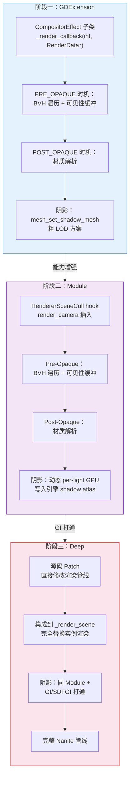

| 维度 | 阶段一 (GDExtension) | 阶段二 (Module) | 阶段三 (Deep) |
|------|----------------------|-----------------|---------------|
| 接入方式 | CompositorEffect | RendererSceneCull hook | 源码 patch |
| 阴影 | 粗 LOD shadow mesh | 动态 GPU shadow | 动态 GPU shadow + GI |
| GI 支持 | 无 | 无 | SDFGI/VoxelGI 打通 |
| 修改引擎 | 否 | 是(模块) | 是(patch) |
| 分发方式 | .gdextension 插件 | 编译引擎 | 编译引擎 |
| 开发效率 | 最高 | 中 | 最低 |
| 效果完整度 | 基础 | 良好 | 完整 |

---

## 7. 编辑器模块：预览界面与调试可视化

### 7.1 概述

离线构建完成后，用户需要在 Inspector 中预览 Nanite mesh 并能切换调试可视化模式验证构建质量。参照 Godot 内置的 `MeshEditor`(`editor/scene/3d/mesh_editor_plugin.h`)，设计 `NaniteMeshEditor`。

### 7.2 类图

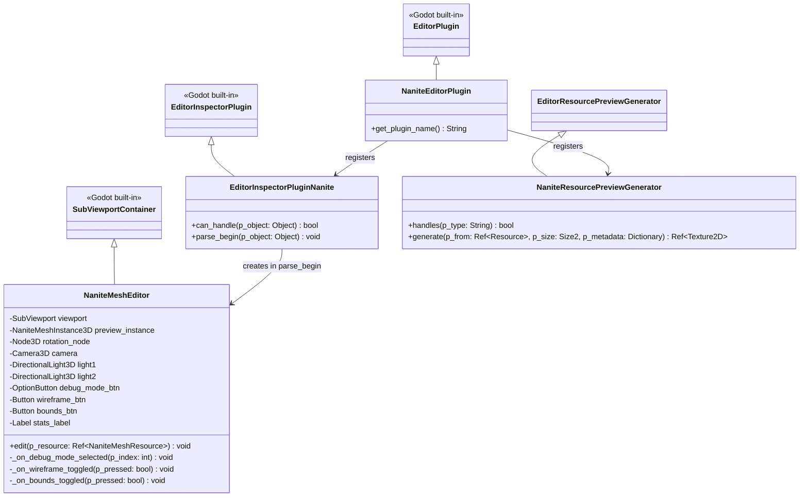

### 7.3 预览界面功能

| 功能 | 实现方式 |
|------|----------|
| 3D 旋转预览 | 继承 `SubViewportContainer`，鼠标拖拽旋转 `rotation_node`，与 `MeshEditor` 一致 |
| Nanite 渲染 | 预览视口内放置 `NaniteMeshInstance3D`，Nanite GPUPipeline 正常工作 |
| 调试模式切换 | `OptionButton` 下拉选择：NONE / Cluster 纯色 / LOD 着色 / Overdraw / Page |
| 线框叠加 | `Button` toggle，调 `NaniteServer::set_debug_wireframe()` |
| 包围盒显示 | `Button` toggle，调 `NaniteServer::set_debug_show_bounds()` |
| 构建统计 | `Label` 显示：cluster 数 / node 数 / page 数 / 粗 LOD tri 数 / 内存估算 |

### 7.4 代码骨架

```cpp
// nanite/editor/nanite_mesh_editor.h
#pragma once
#include "scene/gui/subviewport_container.h"
#include "scene/3d/camera_3d.h"
#include "scene/3d/light_3d.h"

class SubViewport;
class OptionButton;
class Button;
class Label;
class NaniteMeshInstance3D;

class NaniteMeshEditor : public SubViewportContainer {
    GDCLASS(NaniteMeshEditor, SubViewportContainer);

    float rot_x = 0.0f;
    float rot_y = 0.0f;

    SubViewport *viewport = nullptr;
    NaniteMeshInstance3D *preview_instance = nullptr;
    Node3D *rotation_node = nullptr;
    DirectionalLight3D *light1 = nullptr;
    DirectionalLight3D *light2 = nullptr;
    Camera3D *camera = nullptr;

    // 调试可视化工具栏
    OptionButton *debug_mode_btn = nullptr;
    Button *wireframe_btn = nullptr;
    Button *bounds_btn = nullptr;
    Label *stats_label = nullptr;

    void _on_debug_mode_selected(int p_index);
    void _on_wireframe_toggled(bool p_pressed);
    void _on_bounds_toggled(bool p_pressed);
    void _update_rotation();

protected:
    void _notification(int p_what);
    void gui_input(const Ref<InputEvent> &p_event) override;

public:
    void edit(const Ref<NaniteMeshResource> &p_resource);
    NaniteMeshEditor();
};
```

```cpp
// nanite/editor/nanite_mesh_editor.cpp
void NaniteMeshEditor::edit(const Ref<NaniteMeshResource> &p_resource) {
    if (p_resource.is_null()) return;

    preview_instance->set_nanite_mesh(p_resource);

    // 填充调试模式下拉
    debug_mode_btn->clear();
    debug_mode_btn->add_item("Normal", NaniteDebugMode::NONE);
    debug_mode_btn->add_item("Cluster Solid Color", NaniteDebugMode::CLUSTER_SOLID_COLOR);
    debug_mode_btn->add_item("LOD Color", NaniteDebugMode::LOD_SOLID_COLOR);
    debug_mode_btn->add_item("Overdraw Heatmap", NaniteDebugMode::OVERDRAW_HEATMAP);
    debug_mode_btn->add_item("Page Residency", NaniteDebugMode::PAGE_RESIDENCY);

    // 填充构建统计
    String stats = vformat(
        "Clusters: %d  |  Nodes: %d  |  Pages: %d\n"
        "Shadow mesh tris: %d  |  Est. GPU: ~%.1f MB",
        p_resource->cluster_count,
        p_resource->node_count,
        p_resource->page_count,
        p_resource->shadow_mesh.is_valid()
            ? p_resource->shadow_mesh->get_faces() : 0,
        (p_resource->vertex_data.size() +
         p_resource->clusters_data.size() +
         p_resource->nodes_data.size()) / (1024.0 * 1024.0));
    stats_label->set_text(stats);

    // 自动缩放相机适配 mesh bounds
    if (camera && p_resource->mesh_bounds.has_surface()) {
        float radius = p_resource->mesh_bounds.get_longest_axis_size();
        camera->set_position(Vector3(0, 0, radius * 1.8));
    }
}

void NaniteMeshEditor::_on_debug_mode_selected(int p_index) {
    int mode = debug_mode_btn->get_item_id(p_index);
    NaniteServer::get_singleton()->set_debug_mode(mode);
}

void NaniteMeshEditor::_on_wireframe_toggled(bool p_pressed) {
    NaniteServer::get_singleton()->set_debug_wireframe(p_pressed);
}

void NaniteMeshEditor::_on_bounds_toggled(bool p_pressed) {
    NaniteServer::get_singleton()->set_debug_show_bounds(p_pressed);
}
```

### 7.5 InspectorPlugin 注册

```cpp
// nanite/editor/nanite_editor_plugin.h
class EditorInspectorPluginNanite : public EditorInspectorPlugin {
    GDCLASS(EditorInspectorPluginNanite, EditorInspectorPlugin);
public:
    virtual bool can_handle(Object *p_object) override {
        return Object::cast_to<NaniteMeshResource>(p_object) != nullptr;
    }
    virtual void parse_begin(Object *p_object) override {
        NaniteMeshResource *res = Object::cast_to<NaniteMeshResource>(p_object);
        NaniteMeshEditor *editor = memnew(NaniteMeshEditor);
        editor->edit(Ref<NaniteMeshResource>(res));
        add_custom_control(editor);
    }
};

class NaniteEditorPlugin : public EditorPlugin {
    GDCLASS(NaniteEditorPlugin, EditorPlugin);
public:
    virtual String get_plugin_name() const override { return "Nanite"; }
    NaniteEditorPlugin() {
        Ref<EditorInspectorPluginNanite> plugin;
        plugin.instantiate();
        add_inspector_plugin(plugin);
    }
};
```

### 7.6 焦点管理（调试模式隔离）

预览视口内的 `NaniteMeshInstance3D` 与场景中的实例走同一 Nanite GPUPipeline，因此 `NaniteServer::set_debug_mode()` 设置的调试模式对预览视口同样生效。调试模式是全局的，切换预览界面的调试模式会影响所有 Nanite 实例。

**解决方案**：预览界面仅在获得焦点时应用调试模式，失焦时恢复为 NONE。

```cpp
void NaniteMeshEditor::_notification(int p_what) {
    switch (p_what) {
        case NOTIFICATION_FOCUS_ENTER:
            // 恢复用户在预览中选择的调试模式
            if (debug_mode_btn) {
                _on_debug_mode_selected(debug_mode_btn->get_selected_id());
            }
            break;
        case NOTIFICATION_FOCUS_EXIT:
            // 离开预览时关闭调试，避免影响场景渲染
            NaniteServer::get_singleton()->set_debug_mode(NANITE_DEBUG_NONE);
            break;
    }
}
```

### 7.7 构建后即时预览

构建完成后不需要经过磁盘，直接用内存中的 `NaniteMeshResource`：

```cpp
// nanite/editor/nanite_importer.cpp
void NaniteImporter::_on_build_completed(Ref<NaniteMeshResource> p_resource) {
    // 构建完成，立即在预览界面显示
    if (preview_editor) {
        preview_editor->edit(p_resource);
    }
    // 同时自动切换到 Cluster Solid Color 模式，方便验证构建质量
    NaniteServer::get_singleton()->set_debug_mode(
        NaniteDebugMode::CLUSTER_SOLID_COLOR);
}
```

### 7.8 资源预览缩略图

FileSystem 面板中的小图标，使用 `shadow_mesh`（粗 LOD ArrayMesh）生成，无需启动 Nanite GPUPipeline：

```cpp
// nanite/editor/nanite_resource_preview.h
class NaniteResourcePreviewGenerator : public EditorResourcePreviewGenerator {
    GDCLASS(NaniteResourcePreviewGenerator, EditorResourcePreviewGenerator);
public:
    virtual bool handles(const String &p_type) const override {
        return p_type == "NaniteMeshResource";
    }
    virtual Ref<Texture2D> generate(const Ref<Resource> &p_from,
                                     const Size2 &p_size,
                                     Dictionary &p_metadata) const override {
        // 用 shadow_mesh(粗 LOD ArrayMesh)生成缩略图
        // 无需启动 Nanite GPUPipeline，直接用标准 Mesh 渲染
        Ref<NaniteMeshResource> res = p_from;
        if (res.is_valid() && res->shadow_mesh.is_valid()) {
            return StandardResourcePreview::get_singleton()
                ->generate(res->shadow_mesh, p_size, p_metadata);
        }
        return Ref<Texture2D>();
    }
};
```

---

## 8. 阶段一：GDExtension 桥接

### 8.1 渲染管线流程图

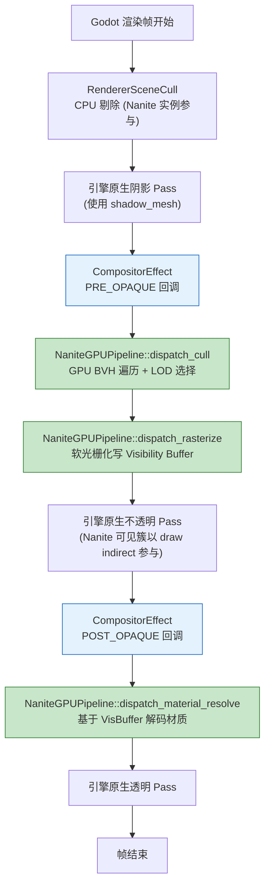

### 8.2 时序图

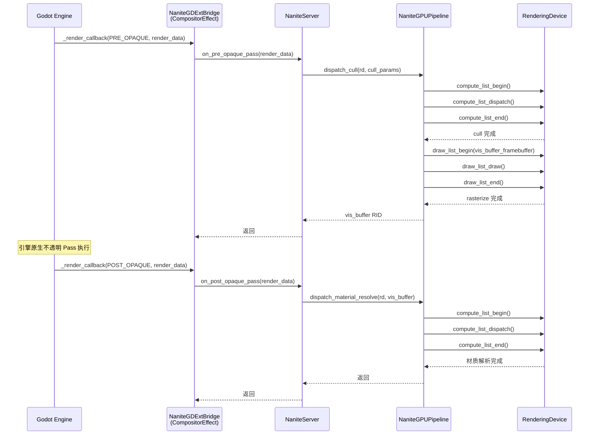

### 8.3 代码骨架

```cpp
// nanite_bridge_gdext/nanite_gdext_bridge.h
#pragma once

#include "scene/resources/compositor_effect.h"
#include "nanite/nanite_bridge.h"

class NaniteGDExtBridge : public CompositorEffect, public INaniteBridge {
    GDCLASS(NaniteGDExtBridge, CompositorEffect)

protected:
    static void _bind_methods();

public:
    // CompositorEffect override
    virtual void _render_callback(int p_effect_callback_type,
                                   const RenderData *p_render_data) override;

    // INaniteBridge implementation
    virtual void install(NaniteServer *p_server) override {
        p_server->set_shadow_mode(NaniteServer::SHADOW_COARSE_LOD);
    }
    virtual ShadowMode get_shadow_mode() const override {
        return ShadowMode::SHADOW_COARSE_LOD;
    }
    virtual void on_pre_render(const RenderData *p_render_data) override {}
    virtual void on_pre_opaque_pass(const RenderData *p_render_data) override;
    virtual void on_post_opaque_pass(const RenderData *p_render_data) override;
    virtual void on_shadow_pass(const RenderData *p_render_data,
                                 RID p_light, int p_pass) override {}
    virtual StringName get_bridge_name() const override {
        return "gdext";
    }

    NaniteGDExtBridge();
    ~NaniteGDExtBridge();
};
```

```cpp
// nanite_bridge_gdext/nanite_gdext_bridge.cpp
#include "nanite_gdext_bridge.h"
#include "nanite/nanite_server.h"

void NaniteGDExtBridge::_bind_methods() {
}

NaniteGDExtBridge::NaniteGDExtBridge() {
    // 使用 PRE_OPAQUE 和 POST_OPAQUE 枚举值
    // Godot 4.7.1: EffectCallbackType 枚举
    set_effect_callback_type(
        CompositorEffect::EFFECT_CALLBACK_TYPE_PRE_OPAQUE);
}

void NaniteGDExtBridge::_render_callback(
    int p_effect_callback_type,
    const RenderData *p_render_data) {

    NaniteServer *ns = NaniteServer::get_singleton();
    if (!ns) return;

    switch (p_effect_callback_type) {
        case CompositorEffect::EFFECT_CALLBACK_TYPE_PRE_OPAQUE:
            // BVH 遍历 + 可见性光栅化
            ns->render_visibility(p_render_data);
            break;
        case CompositorEffect::EFFECT_CALLBACK_TYPE_POST_OPAQUE:
            // 材质解析
            ns->render_material_resolve(p_render_data);
            break;
    }
}

void NaniteGDExtBridge::on_pre_opaque_pass(const RenderData *p_render_data) {
    // 由 _render_callback 内部调用 NaniteServer
}

void NaniteGDExtBridge::on_post_opaque_pass(const RenderData *p_render_data) {
    // 由 _render_callback 内部调用 NaniteServer
}
```

### 8.4 阴影方案：粗 LOD

```cpp
// nanite/nanite_mesh_resource.cpp
void NaniteMeshResource::setup_shadow_mesh() {
    // 使用最低 LOD 的簇构建简化网格
    // 通过 RenderingServer::mesh_set_shadow_mesh 设置
    Array mesh_arrays = build_coarse_lod_arrays();
    RID shadow_rid = RenderingServer::get_singleton()->mesh_create();
    RenderingServer::get_singleton()->mesh_add_surface(
        shadow_rid,
        RenderingServer::PRIMITIVE_TRIANGLES,
        mesh_arrays);
    RenderingServer::get_singleton()->mesh_set_shadow_mesh(
        get_rid(), shadow_rid);
}
```

---

## 9. 阶段二：Module 桥接

### 9.1 渲染管线流程图

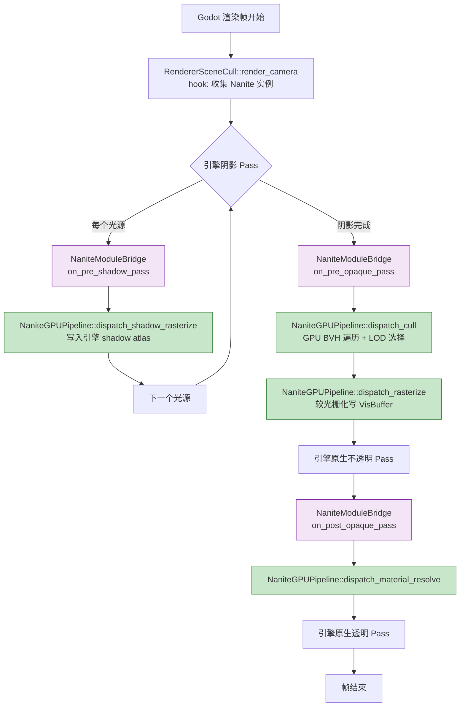

### 9.2 时序图

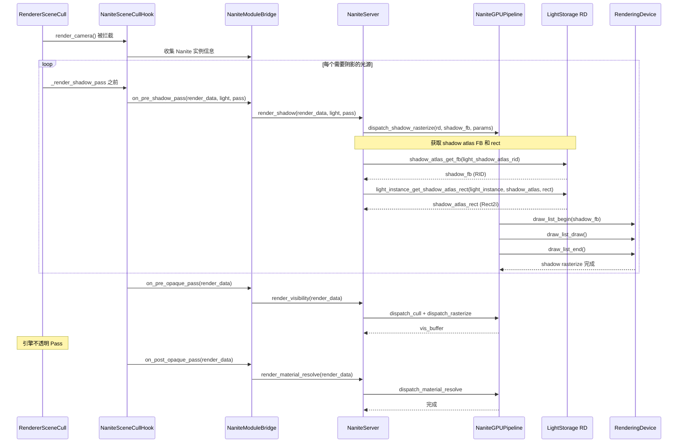

### 8.3 代码骨架

```cpp
// modules/nanite_bridge_module/nanite_module_bridge.h
#pragma once

#include "nanite/nanite_bridge.h"

class NaniteModuleBridge : public INaniteBridge {
public:
    void on_pre_shadow_pass(const RenderData *p_rd, RID p_light, int p_pass);
    void on_pre_opaque_pass(const RenderData *p_rd);
    void on_post_opaque_pass(const RenderData *p_rd);

    // INaniteBridge
    virtual void install(NaniteServer *p_server) override {
        p_server->set_shadow_mode(NaniteServer::SHADOW_DYNAMIC_GPU);
    }
    virtual ShadowMode get_shadow_mode() const override {
        return ShadowMode::SHADOW_DYNAMIC_GPU;
    }
    virtual void on_pre_render(const RenderData *p_render_data) override;
    virtual void on_pre_opaque_pass(const RenderData *p_render_data) override;
    virtual void on_post_opaque_pass(const RenderData *p_render_data) override;
    virtual void on_shadow_pass(const RenderData *p_render_data,
                                 RID p_light, int p_pass) override;
    virtual StringName get_bridge_name() const override {
        return "module";
    }
};
```

```cpp
// modules/nanite_bridge_module/nanite_module_bridge.cpp
#include "nanite_module_bridge.h"
#include "nanite/nanite_server.h"
#include "servers/rendering/renderer_storage.h"
#include "servers/rendering/rendering_server_default.h"

void NaniteModuleBridge::on_shadow_pass(
    const RenderData *p_render_data, RID p_light, int p_pass) {

    NaniteServer *ns = NaniteServer::get_singleton();
    if (!ns) return;

    // 获取 shadow atlas framebuffer
    RendererLightStorage *ls = RendererLightStorage::get_singleton();
    RID shadow_atlas = ...; // 从 render_scene_data 获取
    RID shadow_fb = ls->shadow_atlas_get_fb(shadow_atlas);

    // 获取阴影 atlas 中的 rect
    Vector2i rect;
    ls->light_instance_get_shadow_atlas_rect(p_light, shadow_atlas, rect);

    // 执行 Nanite 阴影光栅化到 shadow atlas
    ns->render_shadow(p_render_data, p_light, p_pass);
}
```

### 8.4 Hook 安装策略

```cpp
// modules/nanite_bridge_module/nanite_scene_cull_hook.h
#pragma once

#include "servers/rendering/renderer_scene_cull.h"

class NaniteSceneCullHook {
    static NaniteSceneCullHook *singleton;

    // 保存原始函数指针
    // RendererSceneCull::render_camera 不是虚函数，
    // 需要在模块初始化时通过指针替换或包装方式 hook

public:
    static NaniteSceneCullHook *get_singleton() { return singleton; }

    void install_hooks();
    void uninstall_hooks();

    // 包装后的 render_camera
    void hooked_render_camera(
        RendererSceneCull *self,
        Ref<RendererSceneCamera> p_camera,
        const RendererSceneCull::CameraData &p_camera_data);

    // 包装后的 shadow pass
    void hooked_render_shadow_pass(
        RendererSceneCull *self,
        RID p_light, ...);
};
```

```cpp
// modules/nanite_bridge_module/nanite_scene_cull_hook.cpp
#include "nanite_scene_cull_hook.h"
#include "nanite/nanite_server.h"
#include "nanite_module_bridge.h"

NaniteSceneCullHook *NaniteSceneCullHook::singleton = nullptr;

// 保存原始 render_camera 函数指针
using OriginalRenderCameraFn = void(*)(RendererSceneCull*, ...);
static OriginalRenderCameraFn original_render_camera = nullptr;

void NaniteSceneCullHook::install_hooks() {
    singleton = this;

    // 方案 A: 在 RendererSceneCull::render_camera 入口
    // 插入回调检查。需要在 render_camera 函数体内
    // 添加 nanite_pre_render_camera() 调用点。
    //
    // 方案 B: 通过模块 register_types 时，
    // 对 RendererSceneCull 实例设置回调。

    // 具体实现：在 render_camera 被调用时，
    // 通过引擎内部的信号/回调机制触发 hook
    RendererSceneCull *cull = RendererSceneCull::get_singleton();
    if (cull) {
        // 设置 pre_render_camera 回调
        cull->set_pre_render_camera_callback(
            callable_mp(this, &NaniteSceneCullHook::hooked_render_camera));
    }
}

void NaniteSceneCullHook::hooked_render_camera(
    RendererSceneCull *self,
    Ref<RendererSceneCamera> p_camera,
    const RendererSceneCull::CameraData &p_camera_data) {

    // 1. 调用原始 render_camera
    if (original_render_camera) {
        original_render_camera(self, p_camera, p_camera_data);
    }

    // 2. 通知 Nanite
    NaniteModuleBridge *bridge = ...; // 获取桥接实例
    // bridge->on_pre_opaque_pass(render_data);
}
```

**Hook 安装时序**：

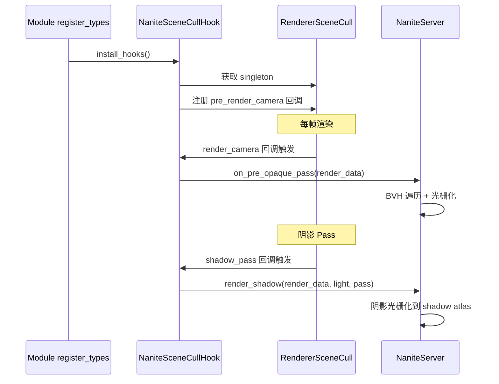

---

## 9. 阶段三：Deep 桥接

### 9.1 渲染管线流程图

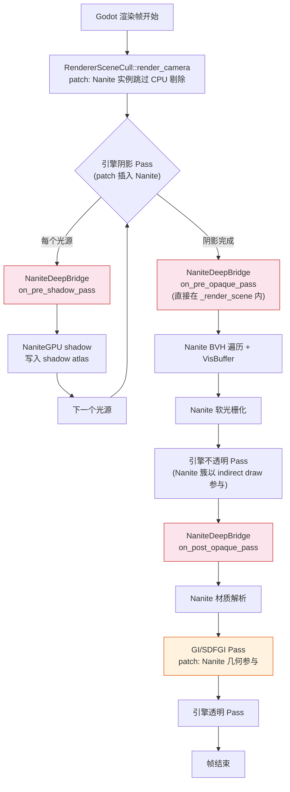

### 9.2 时序图

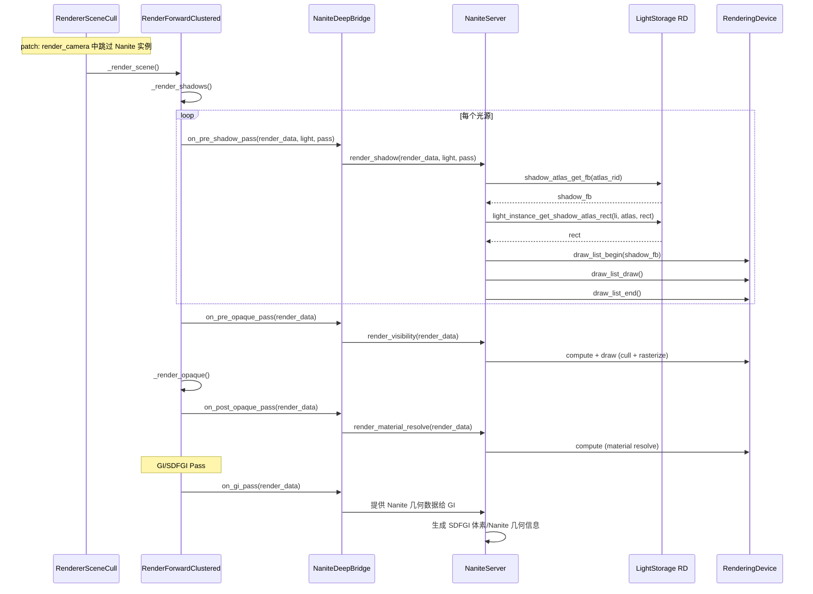

### 9.3 Patch 骨架

**Patch 1: renderer_scene_cull.h/.cpp — 跳过 Nanite 实例的 CPU 剔除**

```diff
--- a/servers/rendering/renderer_scene_cull.h
+++ b/servers/rendering/renderer_scene_cull.h
@@ -XXX,6 +XXX,8 @@
 	class Instance : public RendererInstanceData {
 	public:
+		// Nanite: 标记此实例是否由 Nanite 管理
+		bool nanite_managed = false;
 	};

+	// Nanite: 渲染前回调
+	Callable nanite_pre_render_callback;
+	Callable nanite_shadow_callback;
```

```diff
--- a/servers/rendering/renderer_scene_cull.cpp
+++ b/servers/rendering/renderer_scene_cull.cpp
@@ -XXX,6 +XXX,10 @@
 void RendererSceneCull::render_camera(Ref<RendererSceneCamera> p_camera, ...) {
+	// Nanite: 通知桥接
+	if (nanite_pre_render_callback.is_valid()) {
+		nanite_pre_render_callback.call();
+	}
+
 	// ... 原有 render_camera 逻辑 ...
 	// Nanite 实例跳过 CPU 剔除
 	for (Instance *inst : visible_instances) {
+		if (inst->nanite_managed) continue;
 		// ... 原有剔除 ...
 	}
 }
```

**Patch 2: render_forward_clustered.cpp — 插入 Nanite 回调**

```diff
--- a/servers/rendering/render_forward_clustered.cpp
+++ b/servers/rendering/render_forward_clustered.cpp
@@ -XXX,6 +XXX,10 @@
 void RenderForwardClustered::_render_shadow_pass(...) {
+	// Nanite: 阴影 Pass 前
+	if (nanite_shadow_callback.is_valid()) {
+		nanite_shadow_callback.call(light, pass);
+	}
 	// ... 原有阴影渲染 ...
 }

 void RenderForwardClustered::_render_scene(...) {
+	// Nanite: Pre-Opaque
+	if (nanite_pre_opaque_callback.is_valid()) {
+		nanite_pre_opaque_callback.call(render_data);
+	}
 	// ... 原有不透明 Pass ...
+	// Nanite: Post-Opaque
+	if (nanite_post_opaque_callback.is_valid()) {
+		nanite_post_opaque_callback.call(render_data);
+	}
 }
```

**Patch 3: light_storage — 阴影 API 暴露**

```diff
--- a/servers/rendering/storage/light_storage.h
+++ b/servers/rendering/storage/light_storage.h
@@ -XXX,6 +XXX,10 @@
 	// 已有 API（无需修改，只需确认可用）:
 	// shadow_atlas_get_fb(RID) — line 1156
 	// direction_shadow_get_fb() — line 1183
 	// light_instance_get_shadow_atlas_rect(RID, RID, Vector2i&) — line 684
+
+	// Nanite: 添加公开访问接口
+	RID nanite_shadow_atlas_get_fb(RID p_atlas) { return shadow_atlas_get_fb(p_atlas); }
+	Rect2i nanite_light_instance_get_shadow_atlas_rect(RID p_light_instance, RID p_atlas) {
+		Vector2i rect;
+		light_instance_get_shadow_atlas_rect(p_light_instance, p_atlas, rect);
+		return Rect2i(rect.x, rect.y, ...);
+	}
```

### 9.4 Deep 桥接代码

```cpp
// nanite_bridge_deep/nanite_deep_bridge.h
#pragma once

#include "nanite/nanite_bridge.h"

class NaniteDeepBridge : public INaniteBridge {
public:
    void on_pre_shadow_pass(const RenderData *p_rd, RID p_light, int p_pass);
    void on_pre_opaque_pass(const RenderData *p_rd);
    void on_post_opaque_pass(const RenderData *p_rd);
    void on_gi_pass(const RenderData *p_rd);

    // INaniteBridge
    virtual void install(NaniteServer *p_server) override {
        p_server->set_shadow_mode(NaniteServer::SHADOW_DYNAMIC_GPU);
    }
    virtual ShadowMode get_shadow_mode() const override {
        return ShadowMode::SHADOW_DYNAMIC_GPU;
    }
    virtual void on_pre_render(const RenderData *p_render_data) override;
    virtual void on_pre_opaque_pass(const RenderData *p_render_data) override;
    virtual void on_post_opaque_pass(const RenderData *p_render_data) override;
    virtual void on_shadow_pass(const RenderData *p_render_data,
                                 RID p_light, int p_pass) override;
    virtual StringName get_bridge_name() const override {
        return "deep";
    }
};
```

---

## 10. 关键 API 对照表

> 本节基于 Godot 4.7.1 源码精确验证，是编码的直接依据。

### 10.1 CompositorEffect

| 项目 | API | 源码位置 | 备注 |
|------|-----|----------|------|
| 类声明 | `class CompositorEffect : public Resource` | `scene/resources/compositor_effect.h` | GDExtension 可继承 |
| 渲染回调 | `virtual void _render_callback(int p_effect_callback_type, const RenderData *p_render_data)` | `compositor_effect.h` | 第一个参数是 `int`，不是枚举 |
| 设置回调类型 | `void set_effect_callback_type(EffectCallbackType p_type)` | `compositor_effect.h` | 注册时机 |
| PRE_OPAQUE 枚举 | `EFFECT_CALLBACK_TYPE_PRE_OPAQUE = 0` | `compositor_effect.h` | ✅ 不是 `BEFORE_OPAQUE_PASS` |
| POST_OPAQUE 枚举 | `EFFECT_CALLBACK_TYPE_POST_OPAQUE = 1` | `compositor_effect.h` | ✅ 不是 `AFTER_OPAQUE_PASS` |

### 10.2 RenderDataExtension

| 项目 | API | 源码位置 | 备注 |
|------|-----|----------|------|
| 获取场景数据 | `RenderSceneData *get_render_scene_data() const` | `servers/rendering/storage/render_data_extension.h` | ✅ 返回 `RenderSceneData*`，不是 `get_render_data()` |
| 获取渲染 buffer | `Ref<RenderSceneBuffers> get_render_scene_buffers() const` | `render_data_extension.h` | 获取 color/depth FB |

### 10.3 RenderingServer — 阴影网格

| 项目 | API | 源码位置 | 备注 |
|------|-----|----------|------|
| 设置阴影网格 | `void mesh_set_shadow_mesh(RID p_mesh, RID p_shadow_mesh)` | `rendering_server.h:239` | ✅ ClassDB 绑定在 `.cpp:2389` |

### 10.4 LightStorage RD — 阴影 Atlas

| 项目 | API | 源码位置 | 备注 |
|------|-----|----------|------|
| Shadow Atlas FB | `RID shadow_atlas_get_fb(RID p_atlas)` | `light_storage.h:1156` | 获取 shadow atlas 的 framebuffer |
| 方向光阴影 FB | `RID direction_shadow_get_fb()` | `light_storage.h:1183` | 方向光专用 shadow FB |
| 阴影 Rect | `bool light_instance_get_shadow_atlas_rect(RID p_light_instance, RID p_atlas, Vector2i &r_rect)` | `light_storage.h:684` | ✅ 不是 `shadow_atlas_get_quadrant_rect` |

### 10.5 RendererSceneCull

| 项目 | API | 源码位置 | 备注 |
|------|-----|----------|------|
| 渲染相机 | `void render_camera(Ref<RendererSceneCamera> p_camera, const CameraData &p_camera_data)` | `renderer_scene_cull.h` | ✅ 是 `render_camera`，不是 `_render_camera` |

### 10.6 RenderForwardClustered

| 项目 | API | 源码位置 | 备注 |
|------|-----|----------|------|
| 阴影 Pass | `void _render_shadow_pass(RenderData *p_render_data, RID p_light, ...)` | `render_forward_clustered.h` | 阶段二/三 hook 目标 |
| 渲染场景 | `void _render_scene(RenderData *p_render_data, ...)` | `render_forward_clustered.h` | 阶段三 patch 目标 |

---

## 11. 验证与测试矩阵

### 11.1 三桥接能力对照

| 能力 | GDExtension | Module | Deep |
|------|:-----------:|:------:|:----:|
| BVH 遍历 + 剔除 | ✅ | ✅ | ✅ |
| 可见性缓冲渲染 | ✅ | ✅ | ✅ |
| 材质解析 | ✅ | ✅ | ✅ |
| 粗 LOD 阴影 | ✅ | ✅ | ✅ |
| 动态 GPU 阴影 | ❌ | ✅ | ✅ |
| 阴影写入 Shadow Atlas | ❌ | ✅ | ✅ |
| 方向光阴影 | 粗LOD | GPU | GPU |
| GI/SDFGI 打通 | ❌ | ❌ | ✅ |
| 不改引擎源码 | ✅ | ❌ | ❌ |
| 插件分发 | ✅ | ❌ | ❌ |
| 多光源阴影 | 粗LOD | GPU | GPU |
| Nanite 调试可视化 | ✅ | ✅ | ✅ |
| 流式加载(PageCache) | ✅ | ✅ | ✅ |

### 11.2 测试场景

| 编号 | 场景 | 测试重点 | 适用阶段 |
|------|------|----------|-----------|
| T01 | 单个 Nanite 网格(10K tri) | 基础渲染正确性 | 全部 |
| T02 | 多 Nanite 实例(100+) | 实例管理/剔除 | 全部 |
| T03 | 大型场景(1M+ tri) | BVH 遍历性能 | 全部 |
| T04 | LOD 切换验证 | 不同距离 LOD 过渡 | 全部 |
| T05 | 粗 LOD 阴影 | 阴影投射/接收 | 阶段一 |
| T06 | 动态 GPU 阴影 — 点光源 | shadow atlas 写入 | 阶段二/三 |
| T07 | 动态 GPU 阴影 — 方向光 | direction_shadow_get_fb | 阶段二/三 |
| T08 | 多光源阴影 | 阴影 atlas 分配 | 阶段二/三 |
| T09 | 动态加载/卸载 | PageCache 淘汰 | 全部 |
| T10 | 材质切换 | 材质解析正确性 | 全部 |
| T11 | 调试可视化 | 簇/BVH/Bounds 显示 | 全部 |
| T12 | 桥接切换 | 编译+运行时切换 | 全部 |
| T13 | SDFGI 集成 | Nanite 几何参与 GI | 阶段三 |
| T14 | VoxelGI 集成 | Nanite 几何参与 GI | 阶段三 |

### 11.3 阶段验收标准

**阶段一(GDExtension)验收标准**：

- [ ] CompositorEffect PRE_OPAQUE 回调被正确触发
- [ ] BVH 遍历 + LOD 选择在 GPU 正确执行
- [ ] 可见性缓冲正确生成(调试可视化可观察)
- [ ] 材质解析正确(与标准材质对比)
- [ ] 粗 LOD 阴影正确投射(对比引擎默认阴影)
- [ ] `mesh_set_shadow_mesh` 被正确调用
- [ ] 帧率 ≥ 30fps(10K tri 单网格场景)
- [ ] 编译为 .gdextension 插件可独立加载

**阶段二(Module)验收标准**：

- [ ] 阶段一所有标准通过
- [ ] RendererSceneCull hook 正确安装
- [ ] 动态 GPU 阴影正确写入 shadow atlas
- [ ] `shadow_atlas_get_fb` 返回有效 RID
- [ ] `light_instance_get_shadow_atlas_rect` 返回正确 rect
- [ ] 点光源 + 聚光灯阴影正确
- [ ] 方向光阴影使用 `direction_shadow_get_fb` 正确
- [ ] 多光源场景无 shadow atlas 冲突
- [ ] 作为 Module 编译通过

**阶段三(Deep)验收标准**：

- [ ] 阶段二所有标准通过
- [ ] 源码 patch 正确应用
- [ ] Nanite 实例跳过 CPU 剔除
- [ ] SDFGI 正确使用 Nanite 几何
- [ ] VoxelGI 正确使用 Nanite 几何
- [ ] 无渲染回归(非 Nanite 场景不受影响)
- [ ] 性能：与阶段二对比无退化

---

## 12. 与调研文档差异说明

> 本节纠正 `nanite-godot-design.md` 调研文档中的 API 命名错误，确保编码使用正确名称。

| 编号 | 调研文档中的错误 | Godot 4.7.1 正确 API | 源码依据 | 影响范围 |
|------|-------------------|----------------------|----------|----------|
| D01 | `BEFORE_OPAQUE_PASS` / `AFTER_OPAQUE_PASS` | `EFFECT_CALLBACK_TYPE_PRE_OPAQUE` / `EFFECT_CALLBACK_TYPE_POST_OPAQUE` | `compositor_effect.h` 枚举定义 | 阶段一 CompositorEffect 注册 |
| D02 | `get_render_data()` | `get_render_scene_data()` | `render_data_extension.h` | 阶段一获取相机/投影信息 |
| D03 | `shadow_atlas_get_quadrant_rect()` | `light_instance_get_shadow_atlas_rect(RID, RID, Vector2i&)` | `light_storage.h:684` | 阶段二/三阴影 rect 获取 |
| D04 | `_render_camera` | `render_camera` | `renderer_scene_cull.h` | 阶段二 hook 目标函数名 |
| D05 | (未提及) `direction_shadow_get_fb()` | `direction_shadow_get_fb()` | `light_storage.h:1183` | 阶段二/三方向光阴影 |
| D06 | (混淆) `RenderData*` vs `RenderDataExtension*` | GDExtension 中使用 `RenderDataExtension*`；Module 中使用 `RenderData*` | 不同的桥接层上下文 | 全阶段回调签名 |

---

## 附录：实施检查清单

### A.1 阶段一检查清单

- [ ] `nanite/` 核心库目录结构与 SConscript 创建
- [ ] `INaniteBridge` 抽象接口定义
- [ ] `NaniteServer` 单例实现（含 bridge 切换逻辑）
- [ ] `NaniteCore` BVH 遍历/剔除实现
- [ ] `NaniteMeshResource` 资源类实现
- [ ] `NaniteMeshData` GPU Buffer 管理实现
- [ ] `NaniteMeshInstance3D` 场景节点实现
- [ ] `NaniteGPUPipeline` Compute/Raster shader 加载
- [ ] `NanitePageCache` 流式加载实现
- [ ] `NaniteDebug` 调试可视化实现
- [ ] `NaniteGDExtBridge` CompositorEffect 子类实现
- [ ] CompositorEffect 回调类型使用 `EFFECT_CALLBACK_TYPE_PRE_OPAQUE` / `EFFECT_CALLBACK_TYPE_POST_OPAQUE`
- [ ] `RenderDataExtension::get_render_scene_data()` 正确使用
- [ ] `mesh_set_shadow_mesh(RID, RID)` 粗 LOD 阴影实现
- [ ] ProjectSettings `nanite/bridge/active` 注册
- [ ] SCons `nanite_bridge=gdext` 开关测试
- [ ] .gdextension 插件加载测试
- [ ] 阶段一验收测试全部通过

### A.2 阶段二检查清单

- [ ] `modules/nanite_bridge_module/` 目录创建
- [ ] `NaniteModuleBridge` 实现
- [ ] `NaniteSceneCullHook` 实现
- [ ] `render_camera` hook 安装（确认函数名不是 `_render_camera`）
- [ ] `shadow_atlas_get_fb(RID)` 正确调用
- [ ] `light_instance_get_shadow_atlas_rect(RID, RID, Vector2i&)` 正确调用
- [ ] `direction_shadow_get_fb()` 方向光阴影实现
- [ ] Nanite GPU shadow 写入引擎 shadow atlas 验证
- [ ] Module SConscript + config.py 配置
- [ ] SCons `nanite_bridge=module` 开关测试
- [ ] 阶段二验收测试全部通过

### A.3 阶段三检查清单

- [ ] `nanite_bridge_deep/patches/` 补丁文件创建
- [ ] `renderer_scene_cull.patch` — Nanite 实例跳过 CPU 剔除
- [ ] `render_forward_clustered.patch` — 插入 Nanite 回调
- [ ] `light_storage.patch` — 暴露阴影 API
- [ ] `NaniteDeepBridge` 实现
- [ ] SDFGI 集成：Nanite 几何参与体素化
- [ ] VoxelGI 集成：Nanite 几何参与 GI 计算
- [ ] Patch 应用与编译验证
- [ ] 非_nanite_场景无回归测试
- [ ] SCons `nanite_bridge=deep` 开关测试
- [ ] 阶段三验收测试全部通过

### A.4 通用检查清单

- [ ] 所有 Mermaid 图语法正确渲染
- [ ] API 名称与 Godot 4.7.1 源码一致
- [ ] 编译期宏 `NANITE_BRIDGE_GDEXT/MODULE/DEEP` 正确定义
- [ ] 运行时桥接切换无崩溃
- [ ] 三种桥接的核心渲染结果一致（排除阴影差异）
- [ ] `nanite/` 核心库无桥接特定代码
