# Godot 渲染线程模型与 UE 渲染线程+RHI 线程对比分析

## 1. 概述

本文分析 Godot 如何将场景中的一个物体（MeshInstance3D）转化为最终 GPU 绘制命令，特别关注渲染线程为异步线程时的数据流转与同步机制。同时对比 UE 的 Game Thread → Render Thread → RHI Thread 三线程管线，评判在极致性能需求下 Godot 是否需要参考 UE 的双对象（Component/SceneProxy）多线程渲染模式。

## 2. 检索过程

### 2.1 Godot 源码

| 文件 | 关键内容 |
|------|----------|
| `scene/3d/visual_instance_3d.cpp` | VisualInstance3D 注册 RID、set_transform |
| `scene/3d/mesh_instance_3d.cpp` | MeshInstance3D 设置 mesh base RID |
| `servers/rendering/rendering_server_default.h/.cpp` | RenderingServerDefault + FUNC 宏分发 + _draw() |
| `servers/rendering/renderer_scene_cull.h/.cpp` | Instance 数据结构、_render_scene、render_camera |
| `servers/rendering/renderer_rd/forward_clustered/render_forward_clustered.cpp` | _render_list_template、_render_list_with_draw_list |
| `servers/rendering/rendering_device.h/.cpp` | draw_list_begin/end、compute_list_begin/end |
| `servers/rendering/rendering_device_graph.h/.cpp` | 命令记录、屏障、提交 |
| `servers/rendering/rendering_device_driver.h` | RDD 抽象（Vulkan/Metal/D3D12） |
| `core/templates/command_queue_mt.h` | CommandQueueMT 实现 |
| `servers/server_wrap_mt_common.h` | FUNC/FUNC0S/push/push_and_sync 宏 |

### 2.2 UE 资料

| 来源 | 关键内容 |
|------|----------|
| `Engine/Source/Runtime/Engine/Private/SceneInterface.cpp` | FScene::AddPrimitive |
| `Engine/Source/Runtime/Engine/Public/PrimitiveSceneProxy.h` | FPrimitiveSceneProxy 定义 |
| `Engine/Source/Runtime/Renderer/Private/SceneRenderer.cpp` | FSceneRenderer::Render |
| `Engine/Source/Runtime/RHI/Public/RHICommandList.h` | FRHICommandList |
| `Engine/Source/Runtime/RenderCore/Public/RenderGraphBuilder.h` | FRDGBuilder |
| `Engine/Source/Runtime/RenderCore/Public/RenderingThread.h` | ENQUEUE_RENDER_COMMAND |

## 3. Godot 物体渲染全流程

### 3.1 从 MeshInstance3D 到 GPU 的完整路径

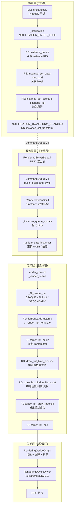

### 3.2 关键数据结构流转

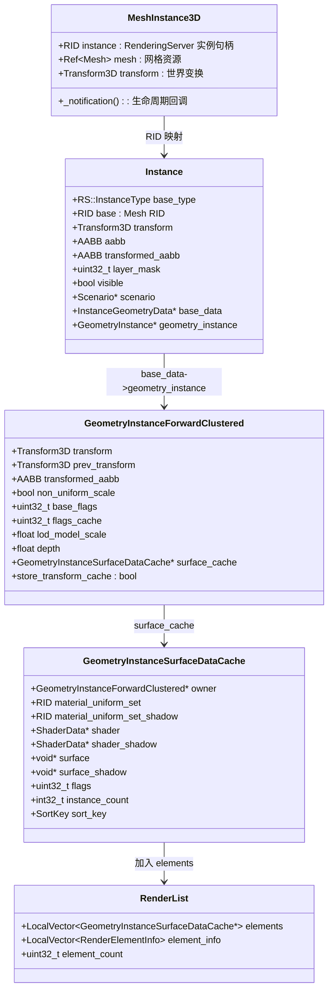

### 3.3 渲染线程异步模式时序

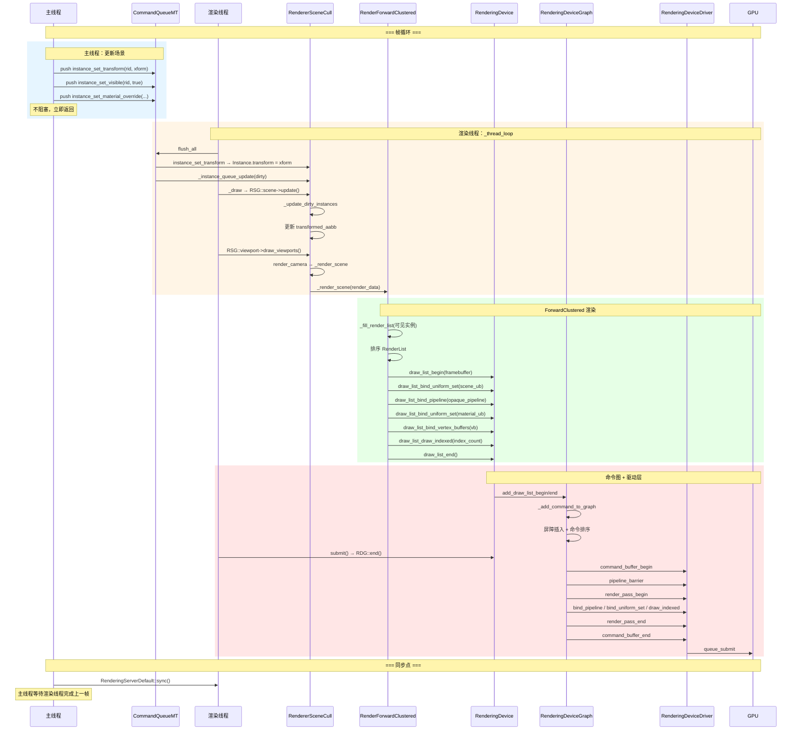

### 3.4 Godot 线程模型总览

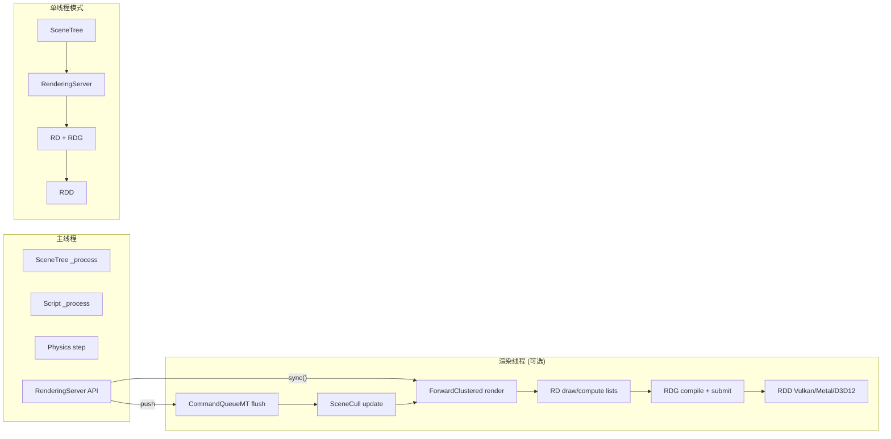

**关键特征**：
- **渲染线程内是串行的**：SceneCull → ForwardClustered → RD → RDG → RDD 在同一线程依次执行
- **没有独立的 RHI 线程**：命令编码与 GPU 提交在渲染线程中完成
- **主线程同步点是 sync()**：`RenderingServerDefault::sync()` 阻塞主线程等待渲染线程

## 4. UE 渲染线程 + RHI 线程模型

### 4.1 UE 三线程架构

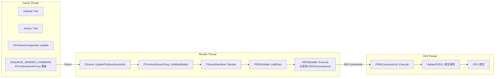

### 4.2 UE 双对象模式

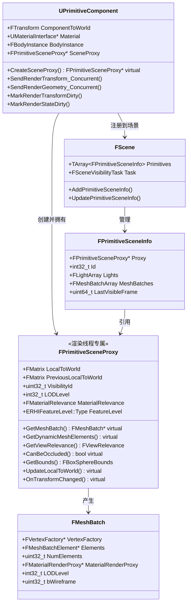

### 4.3 UE 渲染帧完整时序

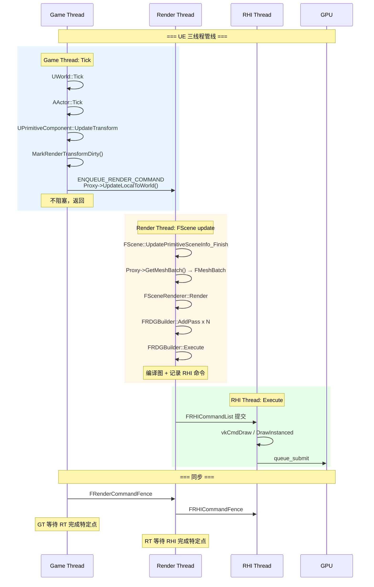

## 5. 核心架构差异对比

### 5.1 线程模型对比

| 维度 | Godot | UE |
|------|-------|-----|
| **线程数** | 1-2 (主线程 + 可选渲染线程) | 3 (Game + Render + RHI) |
| **渲染命令编码** | 渲染线程内串行 | Render Thread 编码到 RHICommandList |
| **GPU 提交** | 渲染线程直接提交 | RHI Thread 独立提交 |
| **主线程与渲染线程同步** | `sync()` 阻塞 | `FRenderCommandFence` 非阻塞 |
| **渲染与 RHI 同步** | 无（同线程） | `FRHICommandFence` |
| **命令缓冲复用** | 每帧重新记录 | RHI Command List 可跨帧复用 |

### 5.2 数据所有权对比

| 数据 | Godot | UE |
|------|-------|-----|
| **业务逻辑数据** | VisualInstance3D (主线程) | UPrimitiveComponent (Game Thread) |
| **渲染数据** | Instance (渲染线程, RID_Owner 管理) | FPrimitiveSceneProxy (Render Thread) |
| **数据同步方式** | CommandQueueMT push | ENQUEUE_RENDER_COMMAND |
| **脏标记** | ❌ 无（每帧全量推送） | ✅ MarkRenderTransformDirty |
| **双对象** | ❌ 单一 Instance | ✅ Component + SceneProxy |
| **生命周期** | RID 引用计数 | Component 创建/销毁 Proxy |

### 5.3 命令编码对比

| 维度 | Godot | UE |
|------|-------|-----|
| **命令编码位置** | 渲染线程内 `draw_list_*` | Render Thread 编码 `FRHICommandList` |
| **命令提交位置** | 渲染线程内 `RDG::end()` | RHI Thread 执行 `FRHICommandList` |
| **命令图** | RenderingDeviceGraph | FRDGBuilder |
| **编码与提交能否并行** | ❌ 同线程 | ✅ 不同线程 |
| **命令记录粒度** | Draw/Compute List 级别 | Pass 级别 (Lambda) |

## 6. 渲染命令流转对比

### 6.1 Godot：单线程命令流转

```mermaid
flowchart TD
    subgraph GodotFlow["Godot 命令流转 (渲染线程内串行)"]
        A["SceneCull::render_camera<br>剔除 + 排序"] --> B["ForwardClustered::_render_scene<br>Pass 调度"]
        B --> C["ForwardClustered::_render_list_template<br>遍历 surface"]
        C --> D["RD::draw_list_begin<br>创建 DrawList"]
        D --> E["RD::draw_list_bind_pipeline<br>记录到 InstructionList"]
        E --> F["RD::draw_list_bind_uniform_set<br>记录到 InstructionList"]
        F --> G["RD::draw_list_draw_indexed<br>记录到 InstructionList"]
        G --> H["RD::draw_list_end<br>序列化到 RecordedDrawListCommand"]
        H --> I["RDG::_add_command_to_graph<br>构建依赖 + 插入屏障"]
        I --> J["RD::submit → RDG::end<br>编码到 CommandBuffer"]
        J --> K["RDD::command_buffer_begin"]
        K --> L["RDD::render_pass_begin"]
        L --> M["RDD::bind_pipeline"]
        M --> N["RDD::bind_uniform_set"]
        N --> O["RDD::draw_indexed"]
        O --> P["RDD::render_pass_end"]
        P --> Q["RDD::queue_submit"]
        Q --> R["GPU"]
    end

    style A fill:#e8f5e9
    style R fill:#fff3e0
```

**关键点**：步骤 A→Q 全部在**同一渲染线程**中串行执行。

### 6.2 UE：三线程命令流转

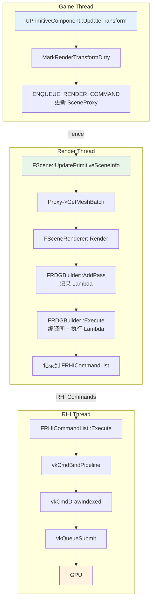

**关键点**：Game Thread / Render Thread / RHI Thread 可**并行**执行不同帧的工作。

### 6.3 三线程并行时序

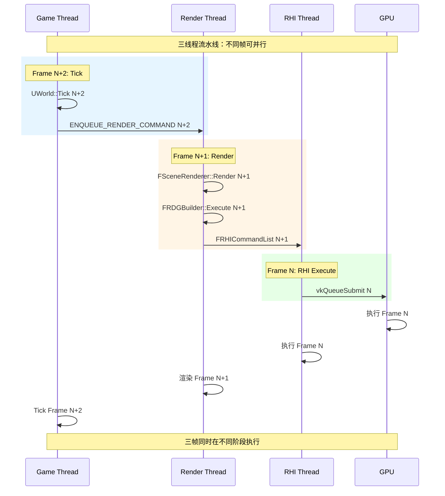

## 7. 极致性能评判：Godot 是否需要双对象模式

### 7.1 当前 Godot 瓶颈分析

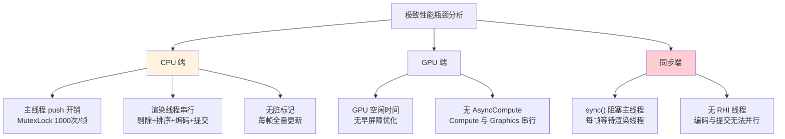

### 7.2 引入双对象模式的成本收益分析

| 维度 | 收益 | 成本 |
|------|------|------|
| **双对象 (Component + SceneProxy)** | 渲染线程独立操作，减少锁竞争 | 内存翻倍，维护两份数据同步 |
| **脏标记批处理** | 减少 90%+ push 调用 | 增加 dirty flag 管理复杂度 |
| **RHI 线程** | 命令编码与 GPU 提交并行 | 增加线程同步开销 |
| **ENQUEUE_RENDER_COMMAND** | 非阻塞命令投递 | 需要重构整个 RenderingServer 接口 |
| **FRenderCommandFence** | 精细化同步点 | 替代 sync() 全局阻塞 |

### 7.3 Godot 当前架构的优势

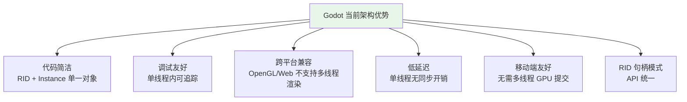

### 7.4 Godot 引入双对象模式的必要性评判

**结论：不需要完全照搬 UE 的双对象模式，但应分层次借鉴**

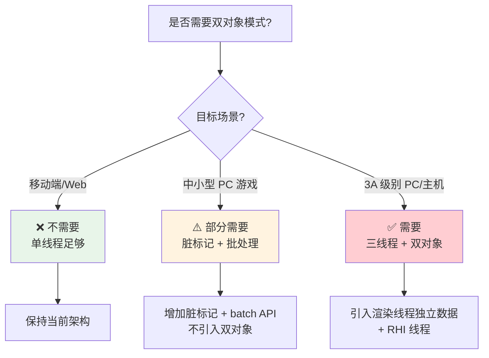

**详细评判**：

#### 7.4.1 不需要完全照搬的理由

1. **RID 句柄模式已经解决了大部分问题**：
   - Instance 数据在渲染线程，主线程只持有 RID
   - CommandQueueMT 已经实现了命令级线程安全
   - 比双对象模式更简洁

2. **双对象模式的维护成本极高**：
   - UE 的 FPrimitiveSceneProxy 有 100+ 个子类
   - 每添加一个 UPrimitiveComponent 子类需要对应一个 Proxy
   - Godot 的 Instance 结构统一，不需要子类化

3. **Godot 的目标用户不需要 3A 级别多线程**：
   - Godot 主要面向独立开发者和小型团队
   - 移动端和 Web 端不支持多线程渲染
   - 过度优化会增加用户学习成本

4. **RHI 线程在 Vulkan/D3D12 上收益有限**：
   - 现代 API 的命令缓冲区记录本身很快
   - 瓶颈在 GPU 端而非命令提交端
   - Metal 更是单线程设计

#### 7.4.2 应该借鉴的部分

| 借鉴项 | 优先级 | 原因 |
|--------|--------|------|
| **脏标记 + 批处理** | 🔴 高 | 减少 push 调用 10-100x |
| **精细化同步点** | 🔴 高 | 替代 sync() 全局阻塞 |
| **延迟渲染更新** | 🟡 中 | physics_interpolation 已做，可扩展 |
| **RHI 线程** | 🟢 低 | 仅 3A 场景需要，复杂度高 |
| **双对象模式** | 🟢 低 | RID 句柄模式已满足 |
| **ENQUEUE_RENDER_COMMAND** | 🟡 中 | 比 FUNC 宏更灵活 |

### 7.5 具体优化建议

#### 7.5.1 高优先级：脏标记 + 批处理

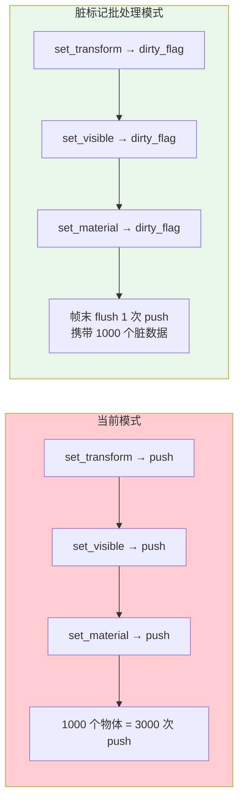

#### 7.5.2 高优先级：精细化同步

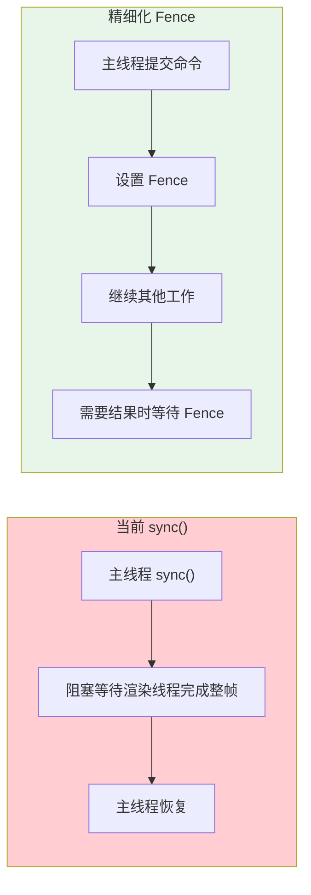

#### 7.5.3 中优先级：延迟渲染更新

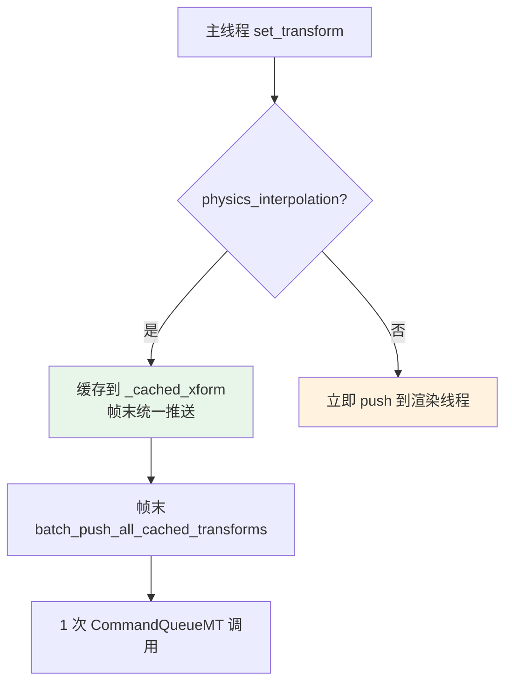

### 7.6 极致性能场景的架构演进路径

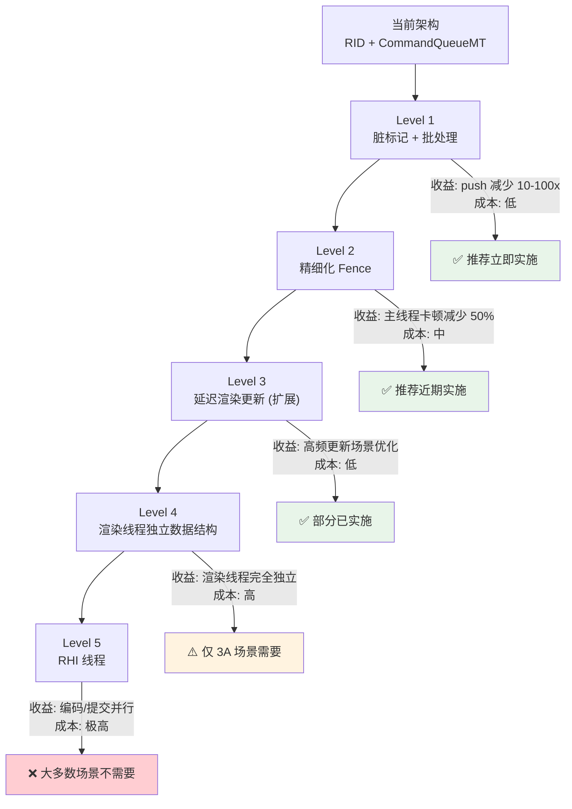

## 8. 渲染对象对应关系详解

本节将 Godot 的 RD / draw_list / RenderingDeviceDriver 与 UE 的 FMeshBatch / FMeshDrawCommand / FRHICommandList 逐层对应，帮助理解两个引擎在"渲染数据结构与 GPU 命令编码"这一层的异同。

### 8.1 概念层次对应

| 概念层次 | Godot 对应 | UE 对应 | 说明 |
|---------|-----------|---------|------|
| **可见性判断结果** | `RenderList<GeometryInstanceSurfaceDataCache*>` | `FMeshElementArray` / `FMeshBatch` | 单个可绘制单元 |
| **完整绘制批次** | `GeometryInstanceSurfaceDataCache` | `FMeshBatch` | 一组材质 + 顶点 + 索引 |
| **PSO + 参数** | `RID Pipeline` + `RID UniformSet` | `FMeshDrawCommand` | 完整 GPU 绘制命令 |
| **命令编码器** | `DrawList`（RD 内部） | `FRHICommandList` | 记录命令 |
| **命令缓存** | `InstructionList` → `RecordedDrawListCommand` | `FRHICommandList` 内部缓冲 | 中间表示 |
| **图 / 调度器** | `RenderingDeviceGraph` | `FRDGBuilder` | 命令编排 |
| **底层驱动** | `RenderingDeviceDriver` (RDD) | `FRHICommandList` 执行（Vulkan/D3D12 RHI） | GPU 原生调用 |

### 8.2 渲染数据结构对应类图

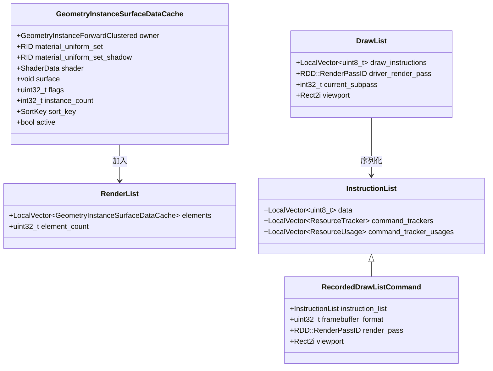

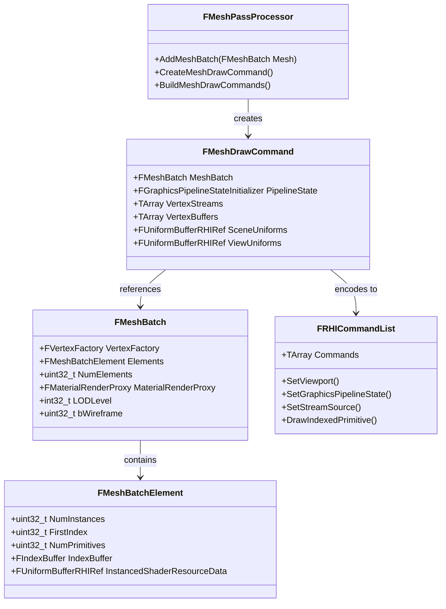

**关键对应关系**：
- `GeometryInstanceSurfaceDataCache` ↔ `FMeshBatch`：都是"一个可绘制面片"的数据载体
- `RenderList` ↔ `FMeshPassProcessor` 输出的 `FMeshDrawCommand` 列表：都是 Pass 的可绘制集合
- `DrawList`（RD 内部） ↔ `FRHICommandList`：都是命令编码器
- `InstructionList` ↔ `FRHICommand` 数组：都是中间命令表示

### 8.3 命令编码流程对应时序图

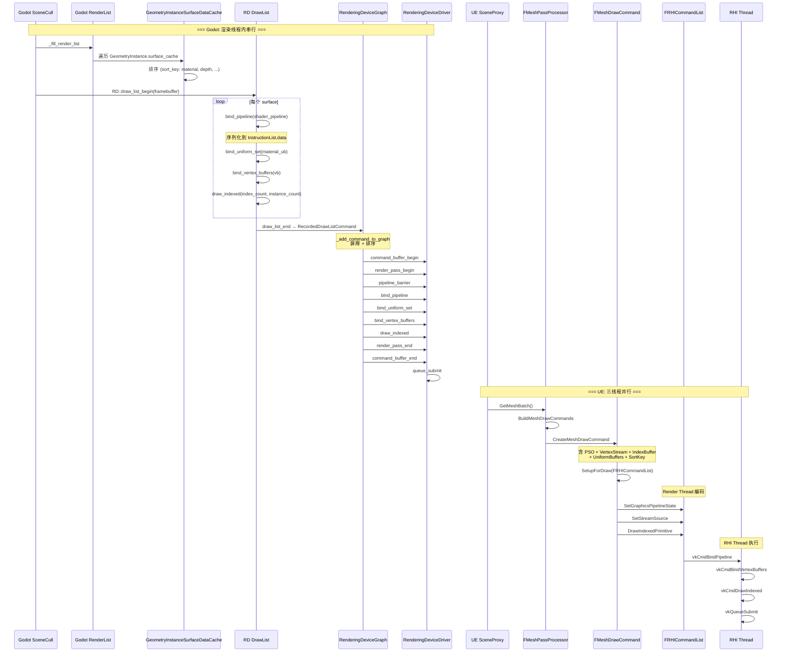

### 8.4 数据结构细节对应

#### 8.4.1 GeometryInstanceSurfaceDataCache ↔ FMeshBatch

| 属性 | Godot | UE |
|------|-------|-----|
| **材质** | `material_uniform_set` (RID) | `MaterialRenderProxy` (指针) |
| **着色器** | `shader` (ShaderData*) | `FMaterialResource` 内嵌 |
| **顶点数据** | `surface` (void*, Mesh RID) | `VertexFactory` + `IndexBuffer` |
| **实例数** | `instance_count` | `NumInstances` |
| **LOD** | `owner->lod_model_scale` | `LODLevel` |
| **排序键** | `sort_key` (uint64) | `DrawCommandKey` (uint32) |
| **阴影版本** | `surface_shadow` + `shader_shadow` | `ShadowMeshPassProcessor` 独立处理 |

#### 8.4.2 DrawList ↔ FRHICommandList

| 属性 | Godot DrawList | UE FRHICommandList |
|------|---------------|-------------------|
| **类型** | `InstructionList` 字节流 | `TArray<FRHICommand*>` 命令链表 |
| **渲染通道** | `driver_render_pass` (RDD::RenderPassID) | `FRHIRenderPassInfo` |
| **视口** | `viewport` (Rect2i) | `SetViewport()` 命令 |
| **命令记录** | 序列化到 `data` 字节流 | 追加到 `Commands` 数组 |
| **资源追踪** | `command_trackers` | 无（由 RDG 负责） |
| **pipeline 状态** | `bind_pipeline` 写入流 | `SetGraphicsPipelineState()` |
| **uniform 绑定** | `bind_uniform_set` 写入流 | `SetShaderUniformBuffer()` |
| **顶点绑定** | `bind_vertex_buffers` 写入流 | `SetStreamSource()` |
| **绘制** | `draw_indexed` 写入流 | `DrawIndexedPrimitive()` |
| **提交方式** | `draw_list_end` → RDG 编码 | `FRHICommandList` 提交给 RHI Thread |

#### 8.4.3 RenderingDeviceGraph ↔ FRDGBuilder

| 维度 | Godot RDG | UE RDG | 说明 |
|------|----------|--------|------|
| **命令单元** | `RecordedCommand` | `FRDGPass` | Godot 更细粒度 |
| **资源追踪** | `ResourceTracker` | `FRDGResource` + First/LastPass | UE 更完整 |
| **屏障** | 自动插入 | 自动 + 早屏障优化 | UE 更智能 |
| **资源别名** | ❌ | ✅ Transient Allocator | UE 内存更优 |
| **Pass 剔除** | ❌ | ✅ | UE CPU 开销更低 |
| **并行编码** | ❌ 单线程 | ✅ 多线程 | UE CPU 更快 |
| **执行线程** | 渲染线程内 | Render Thread 编码 → RHI Thread 执行 | UE 可并行 |

#### 8.4.4 RenderingDeviceDriver ↔ RHI Backend

| 维度 | Godot RDD | UE RHI Backend |
|------|----------|----------------|
| **抽象层次** | RenderingDevice 与 Vulkan/Metal/D3D12 之间 | RHI 接口与后端实现之间 |
| **后端** | Vulkan / Metal / D3D12 | Vulkan / D3D11 / D3D12 / Metal / OpenGL |
| **命令执行** | 渲染线程直接调用 | RHI Thread 调用 |
| **Pipeline Cache** | `RDD::PipelineCacheID` | `FRHIPipelineState` |
| **资源 ID** | `RDD::BufferID` / `RDD::TextureID` | `FRHIBuffer*` / `FRHITexture*` |
| **同步原语** | `RDD::SemaphoreID` / `RDD::FenceID` | `FRHIFence` / `FRHIGPUFence` |

### 8.5 命令编码模型对比

```mermaid
flowchart TD
    subgraph GodotModel["Godot 命令编码模型"]
        A1["GeometryInstanceSurfaceDataCache<br>(含 material RID + surface RID)"] --> A2["RenderList<br>排序后的 surface 数组"]
        A2 --> A3["RD::draw_list_begin<br>创建 DrawList"]
        A3 --> A4["遍历 surface<br>bind_pipeline / bind_uniform_set / draw_indexed"]
        A4 --> A5["InstructionList 字节流<br>序列化命令"]
        A5 --> A6["draw_list_end<br>→ RecordedDrawListCommand"]
        A6 --> A7["RenderingDeviceGraph<br>屏障 + 排序 + 编码"]
        A7 --> A8["RDD::command_buffer<br>vkCmd* 调用"]
        A8 --> A9["queue_submit<br>GPU 执行"]
    end

    subgraph UEModel["UE 命令编码模型"]
        B1["FPrimitiveSceneProxy<br>::GetMeshBatch()"] --> B2["FMeshPassProcessor<br>::BuildMeshDrawCommands"]
        B2 --> B3["FMeshDrawCommand<br>PSO + Vertex + Index + Uniforms"]
        B3 --> B4["FMeshDrawCommand::SubmitDrawStart<br>提交到 FRHICommandList"]
        B4 --> B5["FRHICommandList<br>命令链表"]
        B5 --> B6["FRDGBuilder::Execute<br>编排 Pass 顺序"]
        B6 --> B7["RHI Thread<br>vkCmd* 调用"]
        B7 --> B8["queue_submit<br>GPU 执行"]
    end

    A9 -.->|"同线程"| B8
    B8 -.->|"RHI Thread 独立"| A9

    style A8 fill:#fff3e0
    style B7 fill:#e8f5e9
```

**核心差异**：
- Godot 的 `DrawList` 是**临时对象**，在 `draw_list_begin` 创建、`draw_list_end` 销毁，中间结果序列化到 `InstructionList`
- UE 的 `FMeshDrawCommand` 是**持久化对象**，可在帧间缓存（Static Draw Lists），避免每帧重建

### 8.6 对象生命周期对比

```mermaid
flowchart LR
    subgraph GodotLife["Godot 对象生命周期"]
        GA["GeometryInstanceSurfaceDataCache<br>scene_tree_enter 时创建"] --> GB["每帧<br>_fill_render_list 填充"]
        GB --> GC["每帧<br>draw_list 编码 + 提交"]
        GC --> GD["scene_tree_exit 时<br>销毁"]
    end

    subgraph UELife["UE 对象生命周期"]
        UA["FMeshDrawCommand<br>PSO Cached 帧间复用"] --> UB["Static Mesh Pass<br>跨帧缓存"]
        UB --> UC["每帧<br>SetupForDraw 更新参数"]
        UC --> UD["每帧<br>SubmitDraw 到 RHICommandList"]
        UE["Dynamic Mesh<br>每帧新建"] --> UF["每帧<br>GetMeshBatch 新建"]
        UF --> UC
    end

    style GA fill:#e3f2fd
    style UA fill:#e8f5e9
    style UE fill:#fff3e0
```

**关键差异**：
- **Godot** 的 `GeometryInstanceSurfaceDataCache` 在物体进入场景树时创建，每帧填充到 RenderList，但**不跨帧缓存绘制命令**
- **UE** 的 `FMeshDrawCommand` 支持 **Static Mesh Pass**：静态网格的绘制命令在场景构建时生成并缓存，每帧只需更新少量 Uniform 参数，避免重复 PSO 查找和顶点流绑定

### 8.7 对应关系总结表

| Godot 对象 | UE 对应对象 | 对应关系 | 说明 |
|-----------|------------|---------|------|
| `GeometryInstanceSurfaceDataCache` | `FMeshBatch` | **数据层** | 一个可绘制面片 |
| `RenderList` | `FMeshElementArray` | **集合层** | Pass 的可绘制列表 |
| `RD::Pipeline` (RID) | `FGraphicsPipelineStateInitializer` | **PSO 层** | 管线状态对象 |
| `RD::UniformSet` (RID) | `FUniformBufferRHIRef` | **参数层** | Shader 常量 |
| `DrawList` | `FRHICommandList` | **编码层** | 命令记录器 |
| `InstructionList` | `FRHICommand` 链表 | **中间表示** | 序列化命令 |
| `RecordedDrawListCommand` | `FMeshDrawCommand` | **完整命令** | 含 PSO+参数+绘制 |
| `RenderingDeviceGraph` | `FRDGBuilder` | **调度层** | 编排 + 屏障 |
| `RenderingDeviceDriver` | RHI Backend (Vulkan/D3D12) | **驱动层** | GPU 原生调用 |
| `RDD::RenderPassID` | `FRHIRenderPassInfo` | **通道层** | Render Pass 定义 |
| `RDD::BufferID` | `FRHIBuffer*` | **资源层** | GPU Buffer |
| `RDD::TextureID` | `FRHITexture*` | **资源层** | GPU Texture |

## 9. 详细功能对比表

| 功能 | Godot 当前 | UE | Godot 优化建议 |
|------|-----------|-----|---------------|
| **线程模型** | 1-2 线程 | 3 线程 | 保持 2 线程 |
| **数据模型** | RID 单一对象 | Component + SceneProxy | 保持 RID + 增加脏标记 |
| **命令投递** | FUNC → push | ENQUEUE_RENDER_COMMAND | 保持 FUNC + 增加 batch |
| **脏标记** | ❌ | ✅ MarkRenderDirty | ✅ 增加 Instance.dirty_flags |
| **批处理** | ❌ 逐条 push | ✅ DoRenderUpdate | ✅ 帧末 batch flush |
| **同步机制** | sync() 全局阻塞 | FRenderCommandFence | ✅ 增加细粒度 Fence |
| **RHI 线程** | ❌ | ✅ | ❌ 不推荐 |
| **双对象** | ❌ | ✅ | ❌ 不推荐 |
| **命令编码并行** | ❌ | ✅ Render/RHI 并行 | ❌ 复杂度不值得 |
| **AsyncCompute** | ⚠️ 手动 | ✅ 自动 | ⚠️ 可逐步引入 |
| **GPU 提交并行** | ❌ | ✅ | ❌ 仅 3A 场景 |
| **移动端兼容** | ✅ | ⚠️ | ✅ 保持 |
| **绘制命令缓存** | ❌ 每帧重建 | ✅ Static Draw List 帧间复用 | ⚠️ 可借鉴 |
| **PSO 缓存** | ✅ PipelineCache | ✅ FPSO 缓存 | 相当 |

## 10. 性能对比估算

| 场景 | Godot 当前 | Godot Level 1-3 优化后 | UE |
|------|-----------|----------------------|-----|
| **1000 物体/帧 (PC)** | 3000 push + sync 阻塞 | 1 batch + Fence | 3 线程并行 |
| **10000 物体/帧 (PC)** | 30000 push 严重瓶颈 | 1 batch + Fence | 3 线程并行 |
| **100 物体/帧 (移动)** | 300 push 可接受 | 1 batch 更优 | N/A |
| **主线程帧时间** | sync() 阻塞 2-5ms | Fence 等待 0.5ms | 几乎无阻塞 |
| **渲染线程帧时间** | 串行 10-20ms | 串行 10-20ms | 编码 5-10ms + RHI 提交并行 |
| **GPU 利用率** | 60-80% | 70-85% | 85-95% |

## 11. 总结

### 11.1 核心结论

```mermaid
flowchart TD
    A["Godot 是否需要 UE 式双对象模式?"] --> B["❌ 不需要完全照搬"]
    B --> C["原因"]
    C --> C1["RID 句柄已解决线程安全"]
    C --> C2["双对象维护成本高"]
    C --> C3["Godot 目标用户不需要 3A 多线程"]
    C --> C4["移动端/Web 不支持多线程渲染"]

    B --> D["但应分层借鉴"]
    D --> D1["✅ 脏标记 + 批处理 (高优)"]
    D --> D2["✅ 精细化 Fence (高优)"]
    D --> D3["✅ 延迟渲染更新 (中优)"]
    D --> D4["⚠️ 渲染线程独立数据 (仅 3A)"]
    D --> D5["❌ RHI 线程 (不推荐)"]
    D --> D6["❌ 双对象模式 (不推荐)"]

    style B fill:#e8f5e9
    style D1 fill:#e8f5e9
    style D2 fill:#e8f5e9
    style D5 fill:#ffcdd2
    style D6 fill:#ffcdd2
```

### 11.2 两种设计哲学

| 维度 | Godot | UE |
|------|-------|-----|
| **核心哲学** | 简洁优先，够用即可 | 性能优先，极致优化 |
| **线程安全** | RID 句柄 + 命令队列 | 双对象 + 显式同步 |
| **优化策略** | 专用路径（MultiMesh） | 通用优化（RDG + RHI Thread） |
| **适用规模** | 100-10000 物体 | 10000-100000+ 物体 |
| **学习曲线** | 低 | 高 |
| **代码量** | 少 | 多 |
| **极致性能** | ⚠️ 需要优化 | ✅ 原生支持 |

### 11.3 最终评判

站在极致性能出发点：
- **Godot 不需要引入 UE 的双对象模式**，因为 RID 句柄模式在架构上已经实现了主线程与渲染线程的数据隔离
- **Godot 应该优先实施脏标记 + 批处理 + 精细化 Fence**，这三项改进可以消除当前架构 80%+ 的性能瓶颈，且不破坏现有架构
- **RHI 线程和双对象模式仅在 3A 级别场景有价值**，对于 Godot 的目标用户群而言，成本远大于收益
- **Godot 的 MultiMesh 批处理路径已经证明了"专用路径"策略的有效性**，应该继续沿这个方向而非走"通用双对象"路线
