# Godot Engine 渲染资源封装与 RenderingDeviceGraph 编排机制深度分析

## 1. 概述

Godot 渲染系统的资源管理采用 **RID 句柄 + 内部结构体 + 驱动层 ID** 三层封装，而 RenderingDeviceGraph（RDG）则作为**命令图（Command Graph）**系统，负责记录、排序、插入屏障、提交 GPU 命令的完整编排。

本文从源码层面深入分析：
1. 渲染管线资源（纹理、缓冲区、UAV、UniformSet、管线等）的封装机制
2. RenderingDeviceGraph 如何编排这些资源的生命周期与同步
3. 通过类图和时序图说明整体架构

---

## 2. 渲染资源封装体系

### 2.1 三层资源封装模型

```
┌─────────────────────────────────────────────────────┐
│  第1层: RID (不透明句柄)                              │
│  - 外部可见的资源标识                                 │
│  - 通过 RID_Owner<T> 管理映射                        │
├─────────────────────────────────────────────────────┤
│  第2层: 内部结构体 (Texture, Buffer, UniformSet...)  │
│  - 包含元数据 + 驱动层 ID + 资源追踪器               │
│  - 验证信息、格式信息、状态标记                       │
├─────────────────────────────────────────────────────┤
│  第3层: RDD (RenderingDeviceDriver) ID               │
│  - 平台特定的 GPU 资源标识                           │
│  - RDD::TextureID, RDD::BufferID, RDD::PipelineID   │
│  - 对应 Vulkan/Metal/D3D12 的原生对象                │
└─────────────────────────────────────────────────────┘
```

### 2.2 资源类图

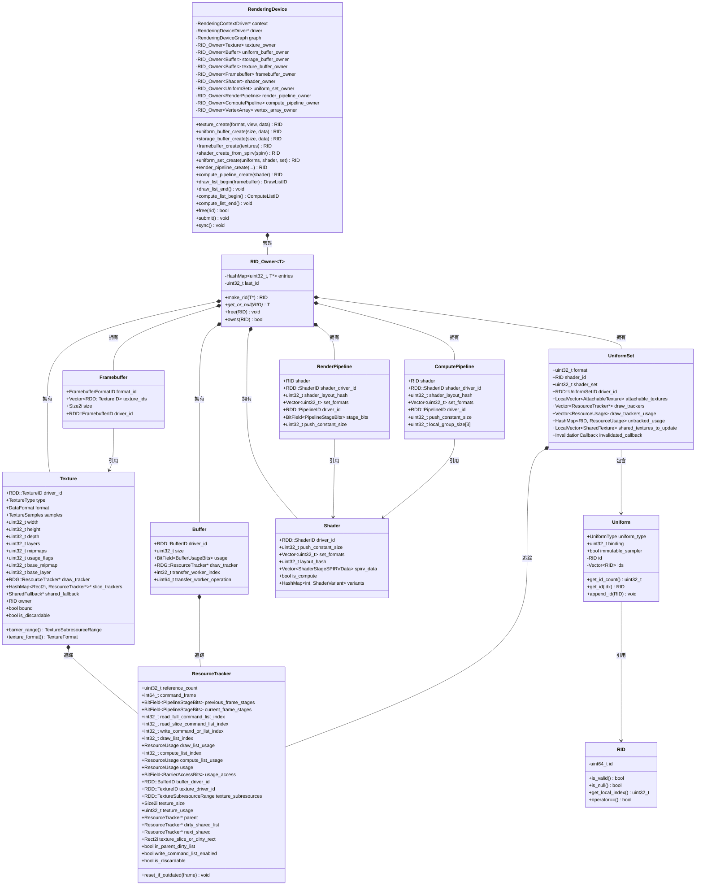

### 2.3 各资源类型详解

#### 2.3.1 Texture（纹理/UAV）

Texture 是最复杂的资源类型，封装了 GPU 图像内存：

```cpp
struct Texture {
    RDD::TextureID driver_id;          // 第3层: 驱动层 GPU 纹理 ID

    // 元数据
    TextureType type;                   // 2D/3D/Cube/Array
    DataFormat format;                  // RGBA8/RGBA16F/R32F...
    TextureSamples samples;             // MSAA 采样数
    uint32_t width, height, depth;
    uint32_t layers, mipmaps;
    uint32_t usage_flags;               // 采样/存储/颜色附件/深度附件...

    // 切片支持（渲染到 mipmap/layer）
    TextureSliceType slice_type;
    uint32_t base_mipmap, base_layer;
    RID owner;                          // 共享纹理时指向原始纹理

    // 资源追踪（关键！用于 RDG 同步）
    RDG::ResourceTracker *draw_tracker;
    HashMap<Rect2i, RDG::ResourceTracker*> *slice_trackers;

    // 共享回退机制（跨格式共享）
    SharedFallback *shared_fallback;

    // 状态标记
    bool bound;                         // 是否绑定到帧缓冲
    bool is_discardable;                // 可丢弃（无需加载前帧内容）
    bool pending_clear;                 // 待清除
};
```

**纹理作为 UAV（Storage Image）**：当 `usage_flags` 包含 `TEXTURE_USAGE_STORAGE_BIT` 时，纹理可作为 UAV 使用，着色器可读写。此时 `ResourceTracker` 会记录 `RESOURCE_USAGE_STORAGE_IMAGE_READ_WRITE`。

**纹理切片**：通过 `texture_create_shared_from_slice()` 创建子纹理，共享同一个 `driver_id` 但拥有独立的 `slice_trackers`，用于渲染到特定 mipmap/layer。

#### 2.3.2 Buffer（缓冲区）

三种缓冲区类型共享同一个 `Buffer` 结构：

```cpp
struct Buffer {
    RDD::BufferID driver_id;            // 驱动层缓冲区 ID
    uint32_t size;                      // 字节大小
    BitField<RDD::BufferUsageBits> usage; // 用途标志
    RDG::ResourceTracker *draw_tracker; // 资源追踪器
};
```

| 缓冲区类型 | RID_Owner | 用途 | 典型 Usage |
|-----------|-----------|------|-----------|
| Uniform Buffer | `uniform_buffer_owner` | 着色器常量 | UNIFORM_BUFFER_BIT |
| Storage Buffer (SSBO/UAV) | `storage_buffer_owner` | 着色器可读写 | STORAGE_BUFFER_BIT |
| Texture Buffer | `texture_buffer_owner` | 纹理缓冲区 | TEXTURE_BUFFER_BIT |

**Storage Buffer 作为 UAV**：当创建时设置 `STORAGE_BUFFER_USAGE`，着色器可通过 `RESOURCE_USAGE_STORAGE_BUFFER_READ_WRITE` 读写。

#### 2.3.3 UniformSet（描述符集）

UniformSet 是资源绑定的核心，将纹理/缓冲区绑定到着色器：

```cpp
struct UniformSet {
    uint32_t format;                    // 格式哈希
    RID shader_id;                      // 关联的着色器
    uint32_t shader_set;                // 着色器中的 set 索引
    RDD::UniformSetID driver_id;        // 驱动层描述符集 ID

    // 资源追踪（用于 RDG 自动同步）
    Vector<RDG::ResourceTracker*> draw_trackers;
    Vector<RDG::ResourceUsage> draw_trackers_usage;
    HashMap<RID, RDG::ResourceUsage> untracked_usage;

    // 可附加纹理（帧缓冲附件纹理）
    LocalVector<AttachableTexture> attachable_textures;

    // 共享纹理更新
    LocalVector<SharedTexture> shared_textures_to_update;
};
```

**Uniform 绑定类型**：

| UniformType | 绑定资源 | GPU 对应 |
|-------------|---------|----------|
| UNIFORM_TYPE_SAMPLER | 采样器 | Sampler |
| UNIFORM_TYPE_SAMPLER_WITH_TEXTURE | 采样器+纹理 | Combined Image Sampler |
| UNIFORM_TYPE_TEXTURE | 纹理 | Sampled Image |
| UNIFORM_TYPE_IMAGE | 纹理(UAV) | Storage Image |
| UNIFORM_TYPE_TEXTURE_BUFFER | 纹理缓冲区 | Uniform Texel Buffer |
| UNIFORM_TYPE_SAMPLER_WITH_TEXTURE_BUFFER | 采样器+纹理缓冲区 | Combined + Texel |
| UNIFORM_TYPE_IMAGE_BUFFER | 缓冲区(UAV) | Storage Texel Buffer |
| UNIFORM_TYPE_UNIFORM_BUFFER | Uniform 缓冲区 | Uniform Buffer |
| UNIFORM_TYPE_STORAGE_BUFFER | SSBO(UAV) | Storage Buffer |
| UNIFORM_TYPE_INPUT_ATTACHMENT | 输入附件 | Subpass Input |

#### 2.3.4 Pipeline（渲染/计算管线）

```cpp
struct RenderPipeline {
    RID shader;                         // 关联着色器 RID
    RDD::ShaderID shader_driver_id;     // 着色器驱动 ID
    uint32_t shader_layout_hash;        // 着色器布局哈希
    Vector<uint32_t> set_formats;       // 各 set 的格式
    RDD::PipelineID driver_id;          // 驱动层管线 ID
    BitField<RDD::PipelineStageBits> stage_bits; // 管线阶段
    uint32_t push_constant_size;
};

struct ComputePipeline {
    RID shader;
    RDD::ShaderID shader_driver_id;
    uint32_t shader_layout_hash;
    Vector<uint32_t> set_formats;
    RDD::PipelineID driver_id;
    uint32_t push_constant_size;
    uint32_t local_group_size[3];       // 工作组大小
};
```

### 2.4 资源创建流程（以纹理为例）

```
RenderingDevice::texture_create(format, view, data)
    │
    ├── 1. 验证参数（格式支持、尺寸合法性）
    │
    ├── 2. 创建 Texture 结构体
    │   ├── 填充元数据（type, format, size, usage...）
    │   ├── 创建 ResourceTracker
    │   │   └── RDG::resource_tracker_create()
    │   │       ├── 设置 texture_driver_id
    │   │       ├── 设置 texture_subresources
    │   │       └── 设置 texture_usage
    │   └── 创建 SharedFallback（如需跨格式共享）
    │
    ├── 3. 调用驱动层创建 GPU 纹理
    │   └── driver->texture_create(format, view) → RDD::TextureID
    │
    ├── 4. 注册到 RID_Owner
    │   └── texture_owner.make_rid(texture) → RID
    │
    ├── 5. 如有初始数据，通过 Staging Buffer 上传
    │   └── _texture_initialize(rid, layer, data)
    │
    └── 6. 返回 RID
```

---

## 3. RenderingDeviceGraph 架构

### 3.1 RDG 核心职责

RenderingDeviceGraph 是一个**延迟执行**的命令图系统：

1. **命令记录**：将 draw/compute/copy 等命令记录为结构化数据
2. **资源追踪**：通过 ResourceTracker 追踪每个资源的使用情况
3. **依赖分析**：构建命令间的依赖关系图
4. **屏障插入**：自动插入内存屏障/纹理屏障确保数据一致性
5. **命令排序**：可重排命令以提高 GPU 并行度
6. **命令提交**：将排序后的命令编码到 GPU 命令缓冲区

### 3.2 RDG 类图

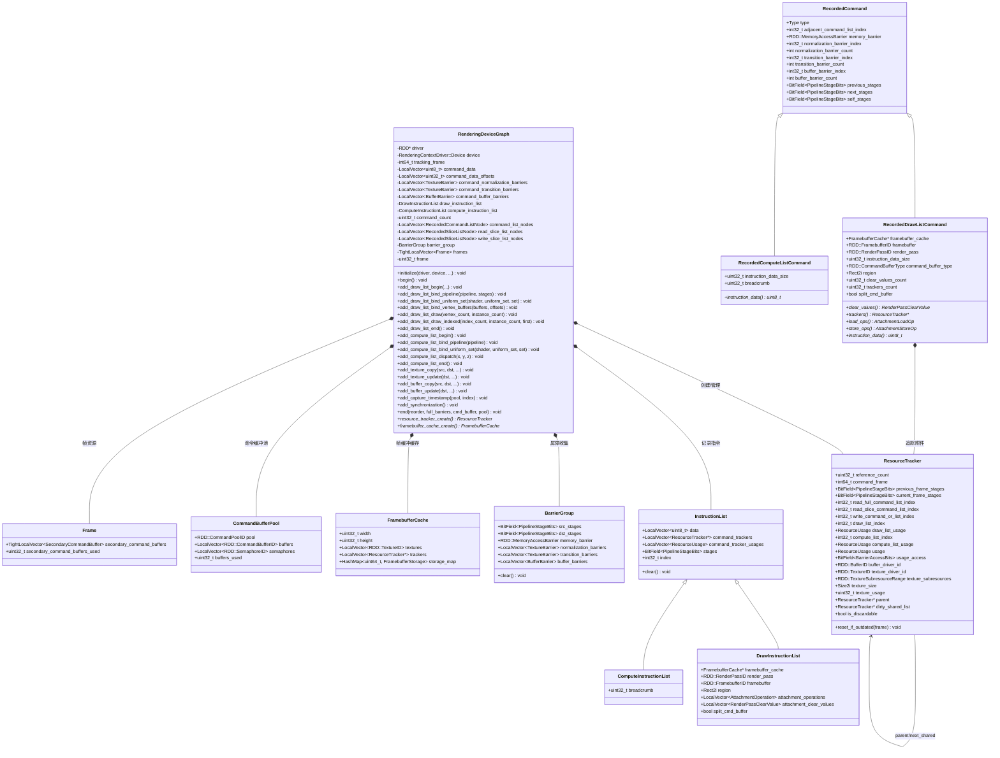

### 3.3 命令类型体系

```mermaid
classDiagram
    class RecordedCommand {
        <<abstract>>
        +Type type
        +int32_t adjacent_command_list_index
        +MemoryAccessBarrier memory_barrier
        +int32_t normalization_barrier_index/count
        +int32_t transition_barrier_index/count
        +int32_t buffer_barrier_index/count
        +PipelineStageBits previous/next/self_stages
    }

    class RecordedBufferClearCommand {
        +RDD::BufferID buffer
        +uint32_t offset
        +uint32_t size
    }

    class RecordedBufferCopyCommand {
        +RDD::BufferID source
        +RDD::BufferID destination
        +BufferCopyRegion region
    }

    class RecordedBufferUpdateCommand {
        +RDD::BufferID destination
        +uint32_t buffer_copies_count
        +buffer_copies() RecordedBufferCopy*
    }

    class RecordedDrawListCommand {
        +FramebufferCache* framebuffer_cache
        +RDD::FramebufferID framebuffer
        +RDD::RenderPassID render_pass
        +uint32_t instruction_data_size
        +CommandBufferType command_buffer_type
        +Rect2i region
        +uint32_t clear_values_count
        +uint32_t trackers_count
        +bool split_cmd_buffer
        +clear_values() RenderPassClearValue*
        +trackers() ResourceTracker**
        +load_ops() AttachmentLoadOp*
        +store_ops() AttachmentStoreOp*
        +instruction_data() uint8_t*
    }

    class RecordedComputeListCommand {
        +uint32_t instruction_data_size
        +uint32_t breadcrumb
        +instruction_data() uint8_t*
    }

    class RecordedTextureCopyCommand {
        +RDD::TextureID from_texture
        +RDD::TextureID to_texture
        +uint32_t texture_copy_regions_count
        +texture_copy_regions() TextureCopyRegion*
    }

    class RecordedTextureUpdateCommand {
        +RDD::TextureID to_texture
        +uint32_t buffer_to_texture_copies_count
        +buffer_to_texture_copies() RecordedBufferToTextureCopy*
    }

    class RecordedTextureResolveCommand {
        +RDD::TextureID from_texture
        +RDD::TextureID to_texture
        +uint32_t src_layer/mipmap
        +uint32_t dst_layer/mipmap
    }

    class RecordedCaptureTimestampCommand {
        +RDD::QueryPoolID pool
        +uint32_t index
    }

    RecordedCommand <|-- RecordedBufferClearCommand
    RecordedCommand <|-- RecordedBufferCopyCommand
    RecordedCommand <|-- RecordedBufferUpdateCommand
    RecordedCommand <|-- RecordedDrawListCommand
    RecordedCommand <|-- RecordedComputeListCommand
    RecordedCommand <|-- RecordedTextureCopyCommand
    RecordedCommand <|-- RecordedTextureUpdateCommand
    RecordedCommand <|-- RecordedTextureResolveCommand
    RecordedCommand <|-- RecordedCaptureTimestampCommand
```

### 3.4 Draw/Compute 指令类型

```mermaid
classDiagram
    class DrawListInstruction {
        <<abstract>>
        +Type type
    }

    class DLBindPipeline {
        +RDD::PipelineID pipeline
    }

    class DLBindUniformSets {
        +RDD::ShaderID shader
        +uint32_t first_set_index
        +uint32_t set_count
        +uint32_t dynamic_offsets_mask
        +uniform_set_ids() RDD::UniformSetID*
    }

    class DLBindVertexBuffers {
        +uint32_t vertex_buffers_count
        +uint64_t dynamic_offsets_mask
        +vertex_buffers() RDD::BufferID*
        +vertex_buffer_offsets() uint64_t*
    }

    class DLBindIndexBuffer {
        +RDD::BufferID buffer
        +IndexBufferFormat format
        +uint32_t offset
    }

    class DLDraw {
        +uint32_t vertex_count
        +uint32_t instance_count
    }

    class DLDrawIndexed {
        +uint32_t index_count
        +uint32_t instance_count
        +uint32_t first_index
    }

    class DLDrawIndirect {
        +RDD::BufferID buffer
        +uint32_t offset
        +uint32_t draw_count
        +uint32_t stride
    }

    class DLSetPushConstant {
        +uint32_t size
        +RDD::ShaderID shader
        +data() uint8_t*
    }

    class DLSetScissor {
        +Rect2i rect
    }

    class DLSetViewport {
        +Rect2i rect
    }

    DrawListInstruction <|-- DLBindPipeline
    DrawListInstruction <|-- DLBindUniformSets
    DrawListInstruction <|-- DLBindVertexBuffers
    DrawListInstruction <|-- DLBindIndexBuffer
    DrawListInstruction <|-- DLDraw
    DrawListInstruction <|-- DLDrawIndexed
    DrawListInstruction <|-- DLDrawIndirect
    DrawListInstruction <|-- DLSetPushConstant
    DrawListInstruction <|-- DLSetScissor
    DrawListInstruction <|-- DLSetViewport

    class ComputeListInstruction {
        <<abstract>>
        +Type type
    }

    class CLBindPipeline {
        +RDD::PipelineID pipeline
    }

    class CLBindUniformSets {
        +RDD::ShaderID shader
        +uint32_t first_set_index
        +uint32_t set_count
        +uniform_set_ids() RDD::UniformSetID*
    }

    class CLDispatch {
        +uint32_t x_groups
        +uint32_t y_groups
        +uint32_t z_groups
    }

    class CLDispatchIndirect {
        +RDD::BufferID buffer
        +uint32_t offset
    }

    class CLSetPushConstant {
        +uint32_t size
        +RDD::ShaderID shader
        +data() uint8_t*
    }

    ComputeListInstruction <|-- CLBindPipeline
    ComputeListInstruction <|-- CLBindUniformSets
    ComputeListInstruction <|-- CLDispatch
    ComputeListInstruction <|-- CLDispatchIndirect
    ComputeListInstruction <|-- CLSetPushConstant
```

---

## 4. RenderingDeviceGraph 编排流程

### 4.1 整体时序图

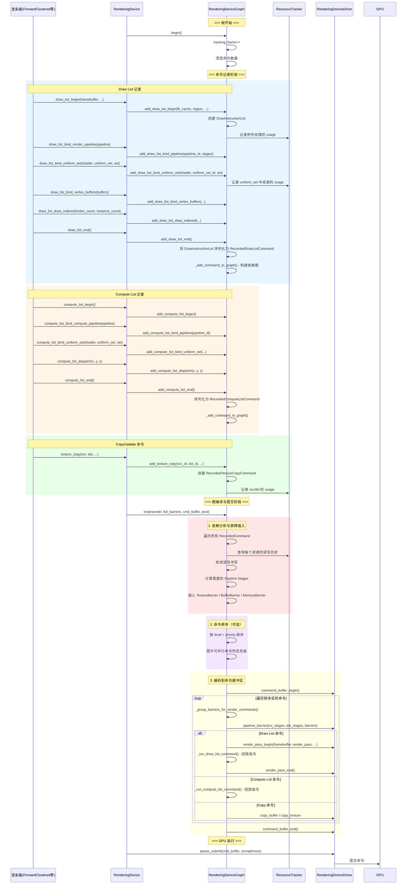

### 4.2 资源追踪与屏障插入详解

#### 4.2.1 ResourceUsage 枚举

```cpp
enum ResourceUsage {
    RESOURCE_USAGE_NONE,
    RESOURCE_USAGE_COPY_FROM,                    // 拷贝源
    RESOURCE_USAGE_COPY_TO,                      // 拷贝目标
    RESOURCE_USAGE_RESOLVE_FROM,                 // 解析源
    RESOURCE_USAGE_RESOLVE_TO,                   // 解析目标
    RESOURCE_USAGE_UNIFORM_BUFFER_READ,          // UBO 读取
    RESOURCE_USAGE_INDIRECT_BUFFER_READ,         // 间接缓冲区读取
    RESOURCE_USAGE_TEXTURE_BUFFER_READ,          // 纹理缓冲区读取
    RESOURCE_USAGE_TEXTURE_BUFFER_READ_WRITE,    // 纹理缓冲区读写(UAV)
    RESOURCE_USAGE_STORAGE_BUFFER_READ,          // SSBO 读取
    RESOURCE_USAGE_STORAGE_BUFFER_READ_WRITE,    // SSBO 读写(UAV)
    RESOURCE_USAGE_VERTEX_BUFFER_READ,           // 顶点缓冲区读取
    RESOURCE_USAGE_INDEX_BUFFER_READ,            // 索引缓冲区读取
    RESOURCE_USAGE_TEXTURE_SAMPLE,               // 纹理采样
    RESOURCE_USAGE_STORAGE_IMAGE_READ,           // Storage Image 读取
    RESOURCE_USAGE_STORAGE_IMAGE_READ_WRITE,     // Storage Image 读写(UAV)
    RESOURCE_USAGE_ATTACHMENT_COLOR_READ_WRITE,  // 颜色附件
    RESOURCE_USAGE_ATTACHMENT_DEPTH_STENCIL_READ_WRITE, // 深度附件
    RESOURCE_USAGE_ATTACHMENT_FRAGMENT_SHADING_RATE_READ, // VRS
    RESOURCE_USAGE_GENERAL,                      // 通用
};
```

#### 4.2.2 依赖检测与屏障插入流程

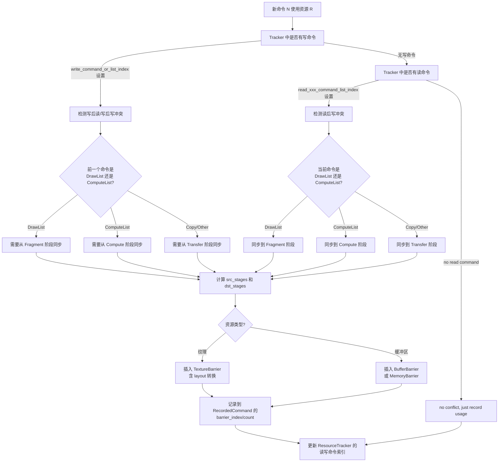

#### 4.2.3 纹理 Layout 转换

ResourceUsage 到 Vulkan ImageLayout 的映射：

```
RESOURCE_USAGE_COPY_FROM           → TRANSFER_SRC_OPTIMAL
RESOURCE_USAGE_COPY_TO             → TRANSFER_DST_OPTIMAL
RESOURCE_USAGE_TEXTURE_SAMPLE      → SHADER_READ_ONLY_OPTIMAL
RESOURCE_USAGE_STORAGE_IMAGE_READ  → GENERAL
RESOURCE_USAGE_STORAGE_IMAGE_READ_WRITE → GENERAL
RESOURCE_USAGE_ATTACHMENT_COLOR_READ_WRITE → COLOR_ATTACHMENT_OPTIMAL
RESOURCE_USAGE_ATTACHMENT_DEPTH_STENCIL_READ_WRITE → DEPTH_STENCIL_ATTACHMENT_OPTIMAL
```

### 4.3 命令图构建详解

#### 4.3.1 _add_command_to_graph 流程

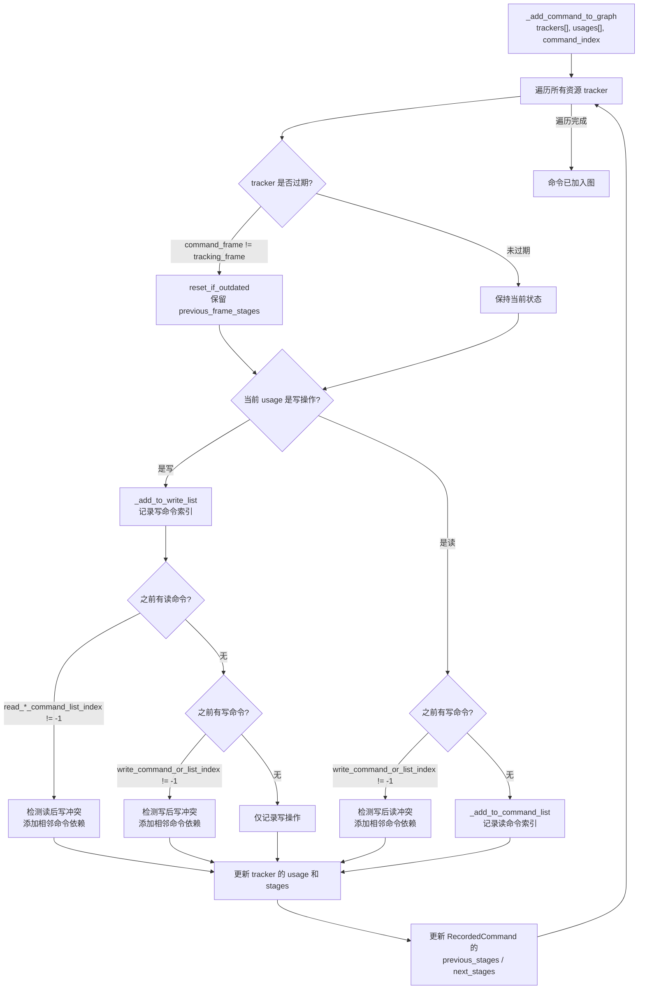

#### 4.3.2 命令排序

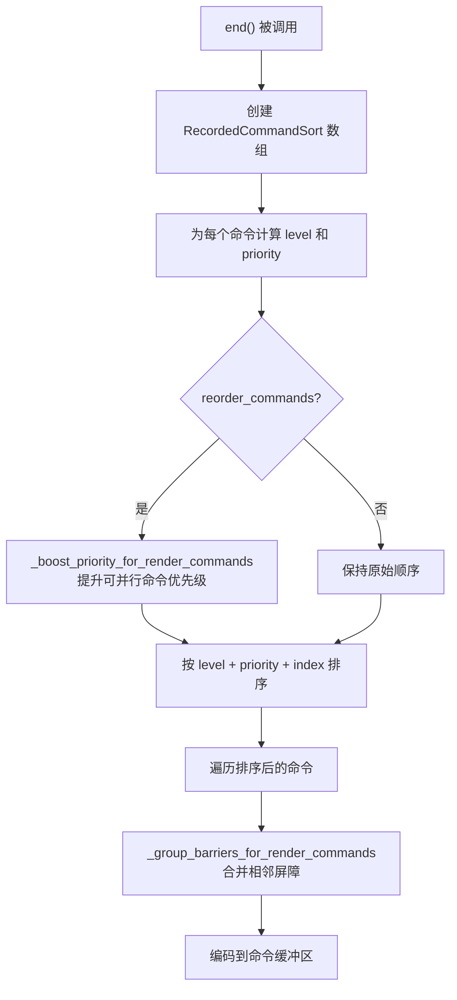

### 4.4 Draw List 完整执行时序

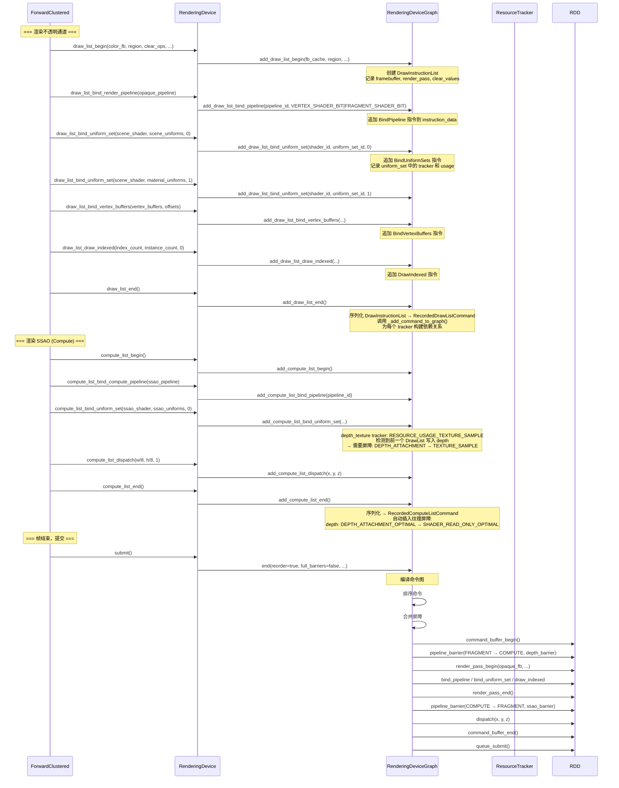

---

## 5. 资源在渲染管线中的流转

### 5.1 纹理状态转换示例

以深度纹理为例，展示一帧中的完整状态转换：

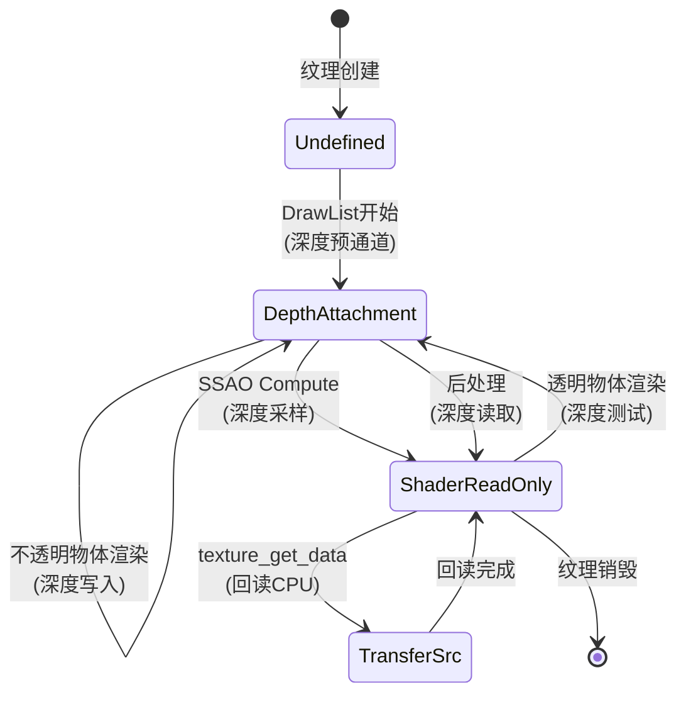

### 5.2 Storage Buffer (UAV) 状态转换示例

以 Cluster 数据缓冲区为例：

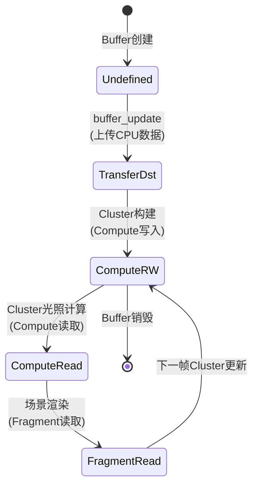

### 5.3 UniformSet 资源追踪传播

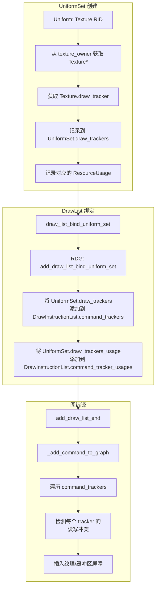

---

## 6. 帧缓冲缓存与 RenderPass 管理

### 6.1 FramebufferCache

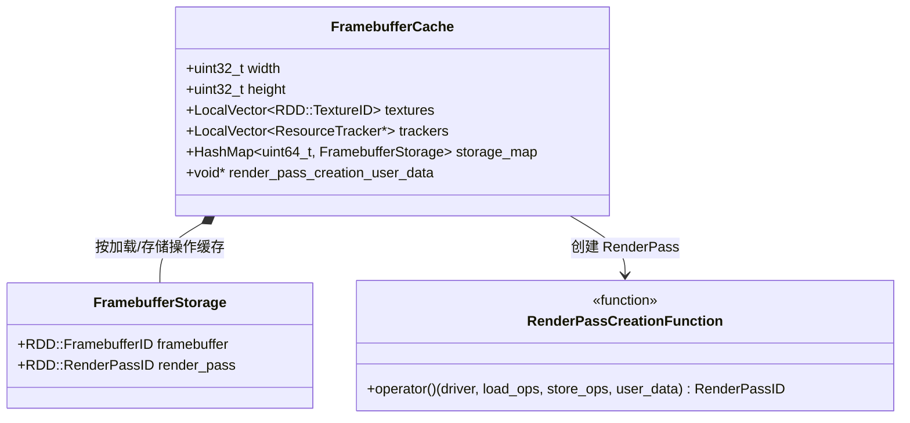

**缓存机制**：同一组纹理附件，不同的加载/存储操作组合会产生不同的 RenderPass 和 Framebuffer。`storage_map` 以 `load_ops + store_ops` 的哈希为键缓存这些组合。

### 6.2 附件操作与加载/存储优化

```cpp
enum AttachmentOperation {
    ATTACHMENT_OPERATION_DEFAULT,  // 可丢弃时忽略，否则加载
    ATTACHMENT_OPERATION_CLEAR,    // 清除为指定值
    ATTACHMENT_OPERATION_IGNORE,   // 忽略之前内容
};
```

当 `ResourceTracker.is_discardable == true` 且操作为 `DEFAULT` 时，自动优化为 `LOAD_OP_DONT_CARE`，避免不必要的 GPU 加载。

---

## 7. 多帧资源管理

### 7.1 帧循环

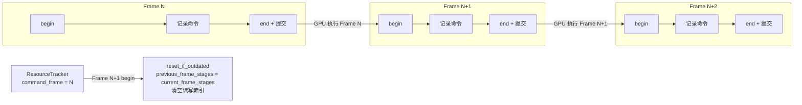

### 7.2 Staging Buffer 管理

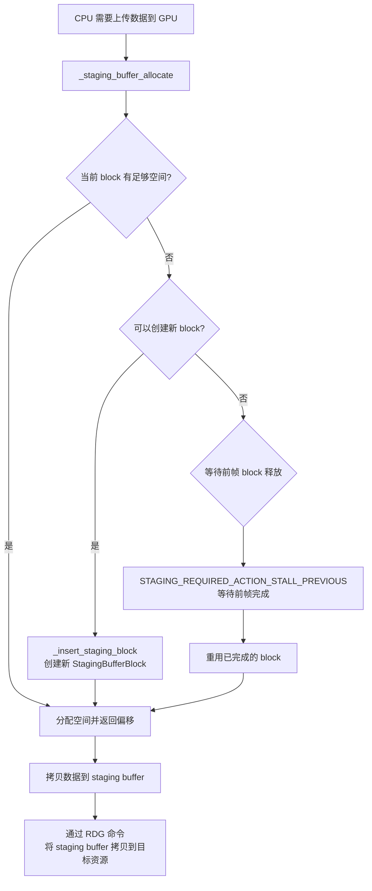

---

## 8. 完整渲染帧资源编排流程

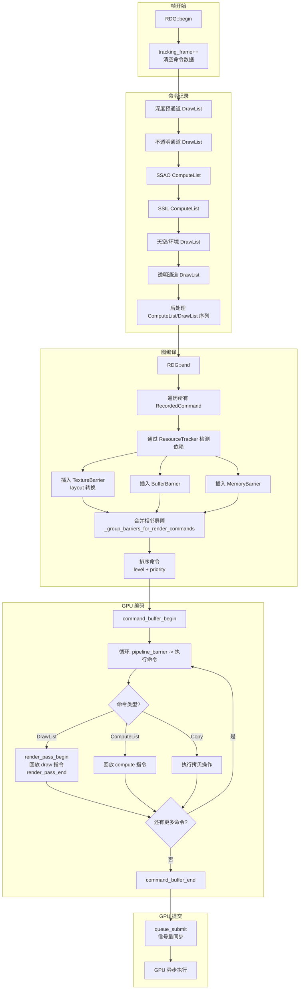

---

## 9. 设计模式总结

| 模式 | 应用位置 | 说明 |
|------|----------|------|
| **句柄模式** | RID → 内部结构体 | 不透明句柄隐藏实现细节 |
| **命令模式** | RecordedCommand 系列 | 延迟执行，支持排序和重放 |
| **命令图** | RenderingDeviceGraph | 记录-编译-提交三阶段 |
| **观察者/追踪** | ResourceTracker | 自动检测资源依赖和冲突 |
| **享元模式** | FramebufferCache / PipelineCacheRD | 避免重复创建 GPU 对象 |
| **策略模式** | _usage_to_image_layout | 根据使用方式选择 GPU 状态 |
| **模板方法** | 指令序列化 | 变长数据内联到 command_data |
| **对象池** | CommandBufferPool / StagingBufferBlock | 复用 GPU 命令缓冲区和上传缓冲区 |
| **双缓冲/三缓冲** | Frame 数组 | 多帧并行，CPU/GPU 交替执行 |

---

## 10. 关键源码索引

| 文件 | 关键内容 |
|------|----------|
| `rendering_device.h` | Texture/Buffer/Shader/UniformSet/Pipeline 结构体定义 |
| `rendering_device.cpp` | 资源创建/销毁/draw_list/compute_list 实现 |
| `rendering_device_graph.h` | RDG 完整结构：命令、追踪器、屏障、缓存 |
| `rendering_device_graph.cpp` | 图构建、依赖分析、屏障插入、命令编码 |
| `rendering_device_driver.h` | RDD 抽象接口（Vulkan/Metal/D3D12） |
| `rendering_device_commons.h` | 公共枚举和常量定义 |
| `core/templates/rid.h` | RID 不透明句柄定义 |
| `core/templates/rid_owner.h` | RID_Owner 资源管理模板 |

---

## 11. Godot RenderingDeviceGraph 与 UE Render Dependency Graph 对比

### 11.1 检索过程

**Godot RenderingDeviceGraph 源码**：
- `servers/rendering/rendering_device_graph.h/.cpp` → 完整 RDG 实现
- `servers/rendering/rendering_device_commons.h` → ResourceUsage 等枚举
- `servers/rendering/rendering_device_driver.h` → RDD 抽象接口

**UE RDG 资料**：
- `Engine/Source/Runtime/RenderCore/Public/RenderGraphBuilder.h` → FRDGBuilder
- `Engine/Source/Runtime/RenderCore/Public/RenderGraphResources.h` → FRDGResource
- `Engine/Source/Runtime/RenderCore/Public/RenderGraphUtils.h` → RDG 工具
- `Engine/Source/Runtime/RenderCore/Public/RenderGraphBlackboard.h` → FRDGBlackboard

### 11.2 核心设计目标对比

| 设计目标 | Godot RenderingDeviceGraph | UE Render Dependency Graph |
|---------|---------------------------|------------------------------|
| **核心职责** | 命令记录+屏障插入+命令排序 | 命令记录+资源生命周期+屏障+剔除+别名 |
| **抽象层次** | 位于 RD (RenderingDevice) 与 RDD (Driver) 之间 | 位于 RHI 与上层渲染器之间 |
| **设计哲学** | 轻量级命令图，仅解决 GPU 同步问题 | 完整的渲染图，含资源别名、Pass 剔除、并行化 |
| **驱动 API** | RDD (RenderingDeviceDriver) 抽象 | RHI (Render Hardware Interface) 抽象 |
| **目标后端** | Vulkan / Metal / D3D12 | D3D11/12 / Vulkan / Metal / OpenGL |

### 11.3 架构层次对比

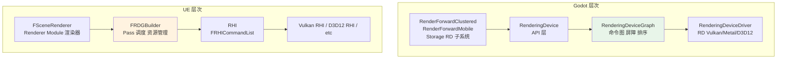

**关键差异**：
- Godot 的 RDG **只负责命令图**，不负责 RID 资源生命周期（RID 由 RID_Owner 管理）
- UE 的 RDG **统一管理 Pass 和 Resource** 的生命周期

### 11.4 核心类层次对比

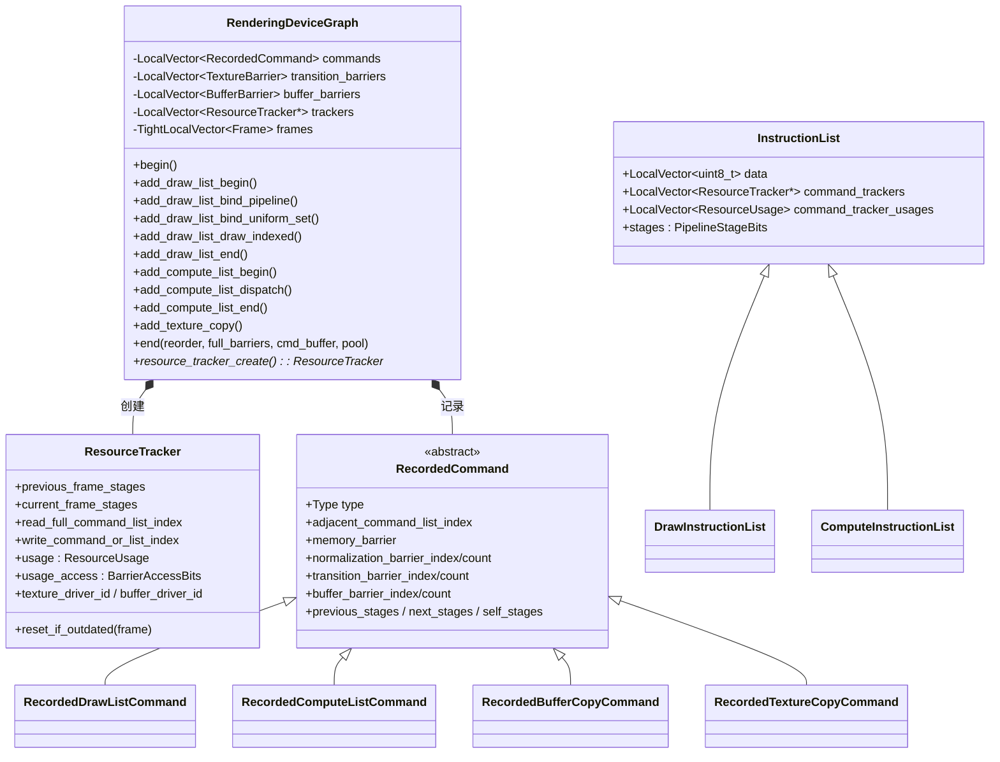

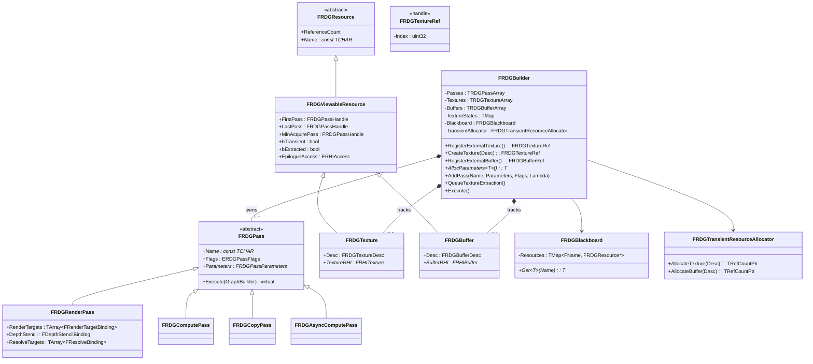

### 11.5 资源管理哲学对比

| 维度 | Godot RDG | UE RDG |
|------|----------|--------|
| **资源标识** | RID (uint64_t 不透明句柄) | FRDGTextureRef / FRDGBufferRef (句柄索引) |
| **资源生命周期** | RID_Owner 引用计数 + 显式 free() | 图驱动 (FirstPass/LastPass) + Transient Allocator |
| **资源创建** | 显式调用 RD::texture_create | RegisterExternalTexture / CreateTexture |
| **资源别名** | ❌ 无（每纹理独占内存） | ✅ 自动（transient allocator 池化） |
| **跨帧资源** | Frame[3] 循环（Staging Buffer 重用） | ResourcePool 跨帧池化 |
| **Pass 间数据传递** | Storage 全局访问 | FRDGBlackboard 强类型共享 |

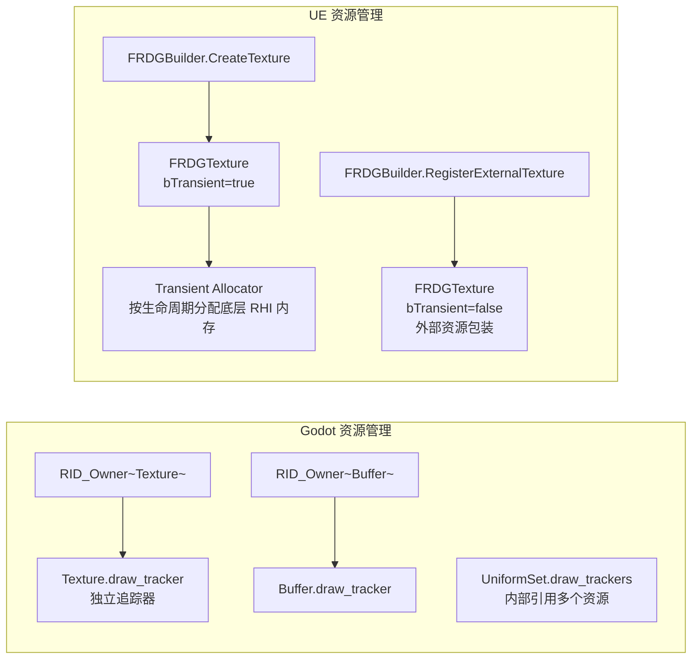

### 11.6 Pass 表达对比

| 维度 | Godot RDG | UE RDG |
|------|----------|--------|
| **Pass 抽象** | RecordedCommand + DrawList/ComputeList 内部指令流 | FRDGPass (Raster/Compute/Copy/AsyncCompute) |
| **Pass 参数** | 通过 InstructionList 内嵌的 `data` 字节流 | 强类型 `FRDGPassParameters` (反射元数据) |
| **Pass 标志** | 命令 type 决定 (DRAW/COMPUTE/COPY) | ERDGPassFlags 位掩码 (Raster/Compute/NeverCull/Copy 等) |
| **Pass 顺序** | `adjacent_command_list_index` 链表 | 拓扑排序自动 |
| **Pass 优先级** | `_boost_priority_for_render_commands` | `EPassPriority` 枚举 |
| **指令记录** | CPU 字节流 `LocalVector<uint8_t>` | Lambda 闭包 + `FRHICommandList` |
| **Pass 剔除** | ❌ 无 | ✅ `NeverCull` 标志控制 |

**代码对比**：

```cpp
// === Godot RDG 风格 ===
auto *draw_list = RD->draw_list_begin(framebuffer, initial_color, initial_depth, clear);
RD->draw_list_bind_render_pipeline(draw_list, opaque_pipeline);
RD->draw_list_bind_uniform_set(draw_list, shader, scene_uniforms, 0);
RD->draw_list_bind_uniform_set(draw_list, shader, material_uniforms, 1);
RD->draw_list_bind_vertex_buffers(draw_list, vertex_buffers, offsets);
RD->draw_list_draw_indexed(draw_list, index_count, instance_count, 0);
RD->draw_list_end();
```

```cpp
// === UE RDG 风格 ===
FRDGBuilder GraphBuilder(RHICmdList);

FRDGTextureRef SceneColor = GraphBuilder.RegisterExternalTexture(SceneColorRT);

auto *PassParameters = GraphBuilder.AllocParameters<FOpaquePassParameters>();
PassParameters->RenderTargets[0] = FRenderTargetBinding(SceneColor, ERenderTargetLoadAction::EClear);
PassParameters->View = View;
PassParameters->SceneUniforms = SceneUniforms;

GraphBuilder.AddPass(
    RDG_EVENT_NAME("Opaque"),
    PassParameters,
    ERDGPassFlags::Raster,
    [View, PixelShader](FRHICommandList& RHICmdList) {
        RHICmdList.SetViewport(View.ViewRect);
        RHICmdList.DrawIndexedPrimitive(...);
    });

GraphBuilder.Execute();
```

**关键差异**：
- **Godot**：调用即记录，调用结束命令就记录完成
- **UE**：调用 AddPass 仅记录 lambda，Execute 时才真正执行

### 11.7 屏障管理对比

| 屏障类型 | Godot RDG | UE RDG |
|---------|----------|--------|
| **屏障插入** | 编译时自动（`_add_command_to_graph`） | 编译时自动（`Compile` 阶段） |
| **早屏障优化** | ❌ 无（按命令顺序插入） | ✅ 移到最早可能位置 |
| **Split Barrier** | ⚠️ 隐式（相邻命令的 next_stages） | ✅ 显式（`EResourceStateAccess::Split`） |
| **Buffer Barrier** | ✅ `USE_BUFFER_BARRIERS = 1`（注释说明偶有性能损耗） | ✅ 自动 |
| **Texture Layout 转换** | ✅ ResourceUsage → ImageLayout 映射 | ✅ ERHIAccess 状态机（更丰富） |
| **Memory Barrier** | ✅ `RDD::MemoryAccessBarrier` | ✅ 全局 / 分级 Memory Barrier |
| **Vulkan Subpass** | ✅ `TYPE_NEXT_SUBPASS` | ✅ 完整 subpass 支持 |

```mermaid
classDiagram
    class TextureBarrier {
        +RDD::TextureID texture
        +RDG::TextureSubresourceRange range
        +int32_t src_usage_access
        +int32_t dst_usage_access
    }
    class BufferBarrier {
        +RDD::BufferID buffer
        +int32_t src_usage_access
        +int32_t dst_usage_access
        +uint32_t offset
        +uint32_t size
    }
    class MemoryAccessBarrier {
        +RDD::PipelineStageBits src_stages
        +RDD::PipelineStageBits dst_stages
    }
    class BarrierAccessBits {
        <<enum>>
        NONE
        BARRIER_READ
        BARRIER_WRITE
        BARRIER_READ_WRITE
    }
    TextureBarrier --> BarrierAccessBits
```

```mermaid
classDiagram
    class FRHITransitionInfo {
        +EResourceStateAccess AccessBefore
        +EResourceStateAccess AccessAfter
        +EResourceTransitionFlags Flags
    }
    class ERHIAccess {
        <<enum>>
        Unknown
        CPURead
        Present
        IndirectArgs
        VertexOrIndexBuffer
        SRVMask
        UAVMask
        CopySrc
        CopyDest
        DSVRead
        DSVWrite
        RTVRead
        RTVWrite
    }
    class EResourceTransitionFlags {
        <<enum>>
        None
        Split
        MaintainCompression
        Fence
    }
    FRHITransitionInfo --> ERHIAccess
    FRHITransitionInfo --> EResourceTransitionFlags
```

### 11.8 命令执行模型对比

```mermaid
sequenceDiagram
    participant App as 渲染线程
    participant GRDG as Godot RDG
    participant URDG as UE RDG
    participant Driver as RDD/RHI
    participant GPU

    Note over App,GPU: === Godot RenderingDeviceGraph ===

    App->>GRDG: add_draw_list_begin x N
    App->>GRDG: add_draw_list_end x N
    Note over GRDG: 内部构建 RecordedCommand
    App->>GRDG: end(reorder=true, ...)
    GRDG->>GRDG: 遍历命令构建依赖
    GRDG->>GRDG: _add_command_to_graph
    GRDG->>GRDG: 计算屏障
    GRDG->>GRDG: 排序命令
    GRDG->>Driver: command_buffer_begin
    loop 排序后命令
        GRDG->>Driver: pipeline_barrier
        GRDG->>Driver: render_pass_begin / bind / draw
        GRDG->>Driver: render_pass_end
    end
    GRDG->>Driver: command_buffer_end
    App->>Driver: queue_submit

    Note over App,GPU: === UE Render Dependency Graph ===

    App->>URDG: AddPass x N
    Note over URDG: 仅记录 Lambda
    App->>URDG: Execute
    URDG->>URDG: 拓扑排序
    URDG->>URDG: 资源生命周期分析
    URDG->>URDG: 屏障插入
    URDG->>URDG: Pass 剔除
    URDG->>URDG: 资源别名
    URDG->>URDG: 并行命令记录
    loop 每个 Pass
        URDG->>URDG: 执行 Lambda
        URDG->>Driver: 记录 RHI 命令
    end
    URDG->>Driver: 提交所有命令
```

### 11.9 关键功能差异

| 功能 | Godot RDG | UE RDG | 评价 |
|------|----------|--------|------|
| **命令记录** | ✅ `add_*` API | ✅ `AddPass` API | 相当 |
| **自动屏障** | ✅ 编译时 | ✅ 编译时 | 相当 |
| **命令排序** | ✅ `reorder` 标志 | ✅ 拓扑排序 | UE 更智能 |
| **早屏障** | ❌ 顺序插入 | ✅ 早屏障优化 | UE 优势 |
| **Pass 剔除** | ❌ 无 | ✅ 编译器级 | UE 优势 |
| **资源别名** | ❌ 无 | ✅ Transient Allocator | UE 优势 |
| **并行命令记录** | ❌ 单线程记录 | ✅ 多线程 | UE 优势 |
| **异步 Compute** | ⚠️ 无专用 Pass 类型 | ✅ FRDGAsyncComputePass | UE 优势 |
| **资源生命周期** | ⚠️ 跨帧通过 Frame[3] 池 | ✅ 图驱动 | UE 优势 |
| **指令回放** | ✅ instruction_data 流 | ✅ Lambda 闭包 | 相当 |
| **多帧 Fence** | ✅ Frame 循环 | ✅ RHI Fence | 相当 |
| **强类型参数** | ❌ 字节流 | ✅ FRDGPassParameters | UE 优势 |
| **可视化工具** | ✅ Godot Insights (RDG 部分) | ✅ RDG Insights | 相当 |
| **学习曲线** | ✅ 简单 | ❌ 陡峭 | Godot 优势 |
| **代码量** | ✅ 约 4000 行 | ❌ 约 30000+ 行 | Godot 优势 |
| **运行时开销** | ✅ 极小 | ⚠️ 图编译每帧 | Godot 优势 |

### 11.10 资源使用模型对比

```mermaid
flowchart TD
    subgraph Godot_Flow["Godot 资源使用"]
        A1["RID 分配"] --> A2["RID_Owner 管理"]
        A2 --> A3["Texture.draw_tracker 创建"]
        A3 --> A4["记录命令到 RDG"]
        A4 --> A5["RDG 检测依赖"]
        A5 --> A6["插入屏障"]
        A6 --> A7["编码命令到 RHI"]
        A7 --> A8["显式 free RID"]
    end

    subgraph UE_Flow["UE 资源使用"]
        B1["FRDGTextureRef 创建"] --> B2["RDG 记录创建"]
        B2 --> B3["FirstPass/LastPass 计算"]
        B3 --> B4["Transient Allocator 分配底层 RHI"]
        B4 --> B5["AddPass 引用"]
        B5 --> B6["Execute 时自动屏障"]
        B6 --> B7["Execute 后自动 release（transient）"]
        B7 --> B8{"extracted?"}
        B8 -->|是| B9["外部持有，下帧 free"]
        B8 -->|否| B10["自动 free"]
    end
```

**关键差异**：
- **Godot**：RID 由用户显式管理生命周期
- **UE**：transient 资源由图自动管理，外部资源需要 `QueueTextureExtraction` 显式提取

### 11.11 Pass 剔除与别名能力对比

```mermaid
classDiagram
    class RenderingDeviceGraph {
        +commands : LocalVector~RecordedCommand~
        +trackers : LocalVector~ResourceTracker*~
        +begin()
        +end(reorder, ...)
        无 pass 剔除
        无资源别名
        无 transient allocator
    }
    note for RenderingDeviceGraph "无 pass 剔除 / 无资源别名 / 无 transient allocator"
```

```mermaid
classDiagram
    class FRDGBuilder {
        +Passes : TRDGPassArray
        +Textures : TRDGTextureArray
        +Buffers : TRDGBufferArray
        +TransientAllocator : FRDGTransientResourceAllocator
        +Blackboard : FRDGBlackboard
        +Compile() internal
        +Execute()
        支持 Pass 剔除
        支持资源别名
        支持 transient allocator
    }

    class FRDGTransientResourceAllocator {
        -Pool : TRefCountPtr~FRDGPooledBuffer~
        -TexturePool : TMap
        -BufferPool : TMap
        +AllocateTexture(Desc) : TRefCountPtr
        +AllocateBuffer(Desc) : TRefCountPtr
        +Release()
    }

    FRDGBuilder *-- FRDGTransientResourceAllocator
```

### 11.12 异步计算对比

| 异步计算能力 | Godot RDG | UE RDG |
|------------|----------|--------|
| **专用 Pass 类型** | ❌ 无 | ✅ `FRDGAsyncComputePass` |
| **自动并行调度** | ❌ 无 | ✅ Pass 调度到合适队列 |
| **自动 Fence** | ❌ 无 | ✅ 自动插入 async fence |
| **手动管理** | ⚠️ 需用户用 `add_synchronization()` | ✅ 完全自动 |

**Godot 临时方案**：
```cpp
// Godot 需手动添加同步点
RDG->add_synchronization();  // 全局内存屏障
```

**UE 自动化**：
```cpp
// UE 自动调度
FRDGBuilder::AddPass(... ERDGPassFlags::AsyncCompute ...);
// RDG 自动判断并行机会，插入 fence
```

### 11.13 性能优化对比

| 优化 | Godot RDG | UE RDG | 提升 |
|------|----------|--------|------|
| **资源别名（内存）** | ❌ 无 | ✅ 30-50% 内存节省 | UE 优势 |
| **Pass 剔除（CPU）** | ❌ 无 | ✅ 减少 5-15% Pass | UE 优势 |
| **早屏障（GPU）** | ❌ 顺序插入 | ✅ 提前到最早位置 | UE 优势（10-30% 提升） |
| **并行命令记录（CPU）** | ❌ 单线程 | ✅ 多线程 | UE 优势（CPU 密集场景） |
| **异步 Compute（GPU）** | ❌ 手动 | ✅ 自动 | UE 优势 |
| **图编译开销** | ✅ 极小（仅屏障） | ⚠️ 0.5-2 ms/帧 | Godot 优势 |
| **代码路径长度** | ✅ 短（~4000 行） | ❌ 长（~30000 行） | Godot 优势 |
| **内存占用** | ✅ 极小（仅命令流） | ⚠️ 大（Pass 数组 + Tracker） | Godot 优势 |

### 11.14 设计哲学对比

```mermaid
flowchart TD
    Root["设计哲学"]
    Root --> G["Godot RDG"]
    Root --> U["UE RDG"]

    G --> G1["轻量级"]
    G --> G2["专注命令图"]
    G --> G3["屏障自动插入"]
    G --> G4["命令排序可选"]
    G --> G5["RID 资源由用户管理"]
    G --> G6["与 RDD 紧耦合"]
    G --> G7["学习曲线低"]
    G --> G8["代码量少"]

    U --> U1["重量级"]
    U --> U2["完整渲染图"]
    U --> U3["全自动优化"]
    U --> U4["Pass 剔除/别名"]
    U --> U5["资源生命周期自动"]
    U --> U6["与 RHI 紧耦合"]
    U --> U7["学习曲线陡"]
    U --> U8["代码量大"]

    style Root fill:#fff9c4
    style G fill:#e3f2fd
    style U fill:#fff3e0
```

### 11.15 Godot RDG 借鉴 UE RDG 的可能方向

虽然 Godot RDG 设计简洁，但仍可渐进借鉴 UE RDG 的部分思想：

1. **资源生命周期驱动**：
   - 当前 Godot RDG 不管理资源生命周期，RID 由用户持有
   - 可以扩展为"图驱动生命周期"，临时纹理用完后自动释放
   - 减少内存占用

2. **Pass 剔除**：
   - 当前每帧所有命令都执行
   - 可以借鉴 UE 的 `NeverCull` 标志 + 自动剔除
   - 减少 CPU 渲染线程开销

3. **早屏障优化**：
   - 当前屏障按命令顺序插入
   - 可以分析命令间真实依赖，将屏障提前到最早可能位置
   - 减少 GPU 空闲时间

4. **资源别名**：
   - 当前每纹理独占内存
   - 可以加 Transient Allocator 池化
   - 节省 30-50% 内存

5. **异步 Compute 支持**：
   - 当前无专用 Pass 类型
   - 可以加 AsyncCompute Pass，让 RDG 自动调度
   - 提升 GPU 利用率

6. **强类型 Pass 参数**：
   - 当前指令用字节流
   - 可以用反射元数据生成强类型参数
   - 减少参数错误

### 11.16 UE RDG 借鉴 Godot RDG 的可能方向

UE RDG 已经很完善，但可以借鉴 Godot RDG 的简洁性：

1. **降低代码量**：
   - 当前 FRDGBuilder 约 30000+ 行
   - 可以拆分核心 API 与高级特性
   - 简化学习曲线

2. **简化资源所有权**：
   - 当前 transient + extracted 资源管理复杂
   - 可以提供更简单的 API
   - 减少用户认知负担

3. **降低图编译开销**：
   - 当前 0.5-2 ms 图编译对移动端敏感
   - 可以提供"轻量模式"，禁用别名/剔除
   - 适配低端硬件

### 11.17 总结

| 维度 | Godot RDG | UE RDG | 备注 |
|------|----------|--------|------|
| **核心职责** | 命令图 + 屏障 | 命令图 + 资源管理 + 屏障 + 别名 | UE 更全面 |
| **抽象层次** | RD 与 RDD 之间 | RHI 与上层渲染器之间 | 相当 |
| **资源管理** | 外部（用户管理 RID） | 内部（图驱动） | 哲学差异 |
| **性能优化** | 命令排序 | 命令排序 + 剔除 + 别名 + 并行 | UE 优势 |
| **现代 RHI 利用** | ✅ Split Barrier | ✅ 更完整（Timeline Semaphore） | UE 优势 |
| **学习曲线** | ✅ 简单 | ❌ 陡峭 | Godot 优势 |
| **代码量** | ✅ 4000 行 | ❌ 30000+ 行 | Godot 优势 |
| **运行时开销** | ✅ 极小 | ⚠️ 图编译 | Godot 优势 |
| **目标用户** | 中小项目 / 教学 | 3A 项目 / 大型团队 | 定位差异 |

**最终结论**：
- **Godot RDG** 是"轻量级命令图"，专注解决 GPU 同步问题
- **UE RDG** 是"重量级渲染图"，提供完整的渲染资源编排
- 两种设计反映了**两引擎不同的目标用户和设计哲学**：
  - Godot 追求简洁和可移植性
  - UE 追求性能极限和功能完整性
