# Godot 引擎场景剔除系统分析

## 1. 概述

本文分析 Godot 引擎的场景剔除（Scene Culling）系统，包括视锥剔除、遮挡剔除、HZB（Hierarchical Z-Buffer）的实现原理，并澄清几个常见误解：

- **Godot 不使用八叉树**，而是使用 `DynamicBVH`（基于 Bullet Dbvh 的动态包围体层次结构）
- **Godot 没有 GPU 端的 HZB Compute Shader**用于遮挡剔除，HZB 完全在 CPU 端构建
- **Godot 不使用传统软件光栅化**生成深度图，而是使用 **Intel Embree 光线追踪**填充 HZB 的第 0 级 mip
- HZB 的 mipmap 生成是简单的 CPU 双层 for 循环取 MAX 操作

## 2. 检索过程

### 2.1 检索路径

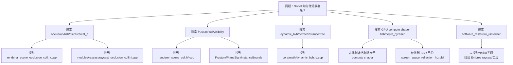
```mermaid
flowchart TD
    A["问题：Godot 如何做场景剔除？"] --> B["搜索 occlusion/hzb/hierarchical_z"]
    B --> C["找到 renderer_scene_occlusion_cull.h/.cpp"]
    B --> D["找到 modules/raycast/raycast_occlusion_cull.h/.cpp"]
    A --> E["搜索 frustum/cull/visibility"]
    E --> F["找到 renderer_scene_cull.h/.cpp"]
    E --> G["找到 Frustum/PlaneSign/InstanceBounds"]
    A --> H["搜索 dynamic_bvh/octree/InstanceTree"]
    H --> I["找到 core/math/dynamic_bvh.h/.cpp"]
    A --> J["搜索 GPU compute shader hzb/depth_pyramid"]
    J --> K["未找到遮挡剔除专用 compute shader"]
    J --> L["仅找到 SSR 用的 screen_space_reflection_hiz.glsl"]
    A --> M["搜索 software_raster/sw_rasterizer"]
    M --> N["未找到传统软光栅<br>找到 Embree raycast 实现"]
```

### 2.2 关键源码文件

| 文件 | 作用 |
|------|------|
| [renderer_scene_cull.h](file:///workspace/servers/rendering/renderer_scene_cull.h) | 主剔除类声明，Instance/Frustum/InstanceBounds/Cull/CullData |
| [renderer_scene_cull.cpp](file:///workspace/servers/rendering/renderer_scene_cull.cpp) | 主剔除实现：`_scene_cull`、`_render_scene`、`render_camera`、`_visibility_cull` |
| [renderer_scene_occlusion_cull.h](file:///workspace/servers/rendering/renderer_scene_occlusion_cull.h) | `HZBuffer` 抽象基类，`_is_occluded` 算法 |
| [renderer_scene_occlusion_cull.cpp](file:///workspace/servers/rendering/renderer_scene_occlusion_cull.cpp) | `HZBuffer::resize`、`update_mips`（CPU mipmap） |
| [raycast_occlusion_cull.h](file:///workspace/modules/raycast/raycast_occlusion_cull.h) | `RaycastOcclusionCull` 与 `RaycastHZBuffer`（Embree 光追） |
| [raycast_occlusion_cull.cpp](file:///workspace/modules/raycast/raycast_occlusion_cull.cpp) | Embree 集成、`buffer_update`、`_generate_camera_rays`、`sort_rays` |
| [dynamic_bvh.h](file:///workspace/core/math/dynamic_bvh.h) | DynamicBVH（基于 Bullet Dbvh）空间索引 |
| [rendering_light_culler.h](file:///workspace/servers/rendering/rendering_light_culler.h) | 光源视锥剔除辅助 |

## 3. 场景剔除整体架构

### 3.1 剔除系统类图

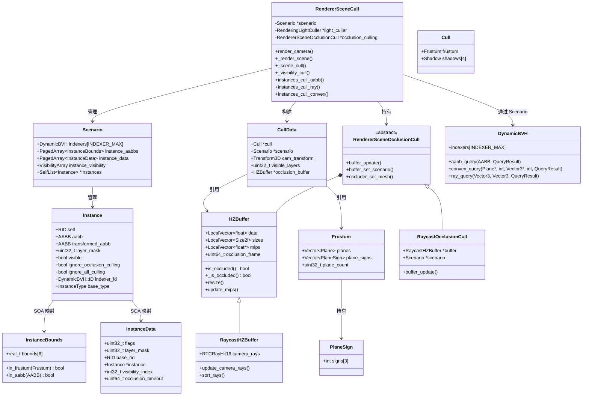
```mermaid
classDiagram
    class RendererSceneCull {
        -Scenario *scenario
        -RenderingLightCuller *light_culler
        -RendererSceneOcclusionCull *occlusion_culling
        +render_camera()
        +_render_scene()
        +_scene_cull()
        +_visibility_cull()
        +instances_cull_aabb()
        +instances_cull_ray()
        +instances_cull_convex()
    }

    class Scenario {
        +DynamicBVH indexers[INDEXER_MAX]
        +PagedArray~InstanceBounds~ instance_aabbs
        +PagedArray~InstanceData~ instance_data
        +VisibilityArray instance_visibility
        +SelfList~Instance~ *instances
    }

    class Instance {
        +RID self
        +AABB aabb
        +AABB transformed_aabb
        +uint32_t layer_mask
        +bool visible
        +bool ignore_occlusion_culling
        +bool ignore_all_culling
        +DynamicBVH::ID indexer_id
        +InstanceType base_type
    }

    class InstanceBounds {
        +real_t bounds[6]
        +in_frustum(Frustum) bool
        +in_aabb(AABB) bool
    }

    class InstanceData {
        +uint32_t flags
        +uint32_t layer_mask
        +RID base_rid
        +Instance *instance
        +int32_t visibility_index
        +uint64_t occlusion_timeout
    }

    class Frustum {
        +Vector~Plane~ planes
        +Vector~PlaneSign~ plane_signs
        +uint32_t plane_count
    }

    class PlaneSign {
        +int signs[3]
    }

    class Cull {
        +Frustum frustum
        +Shadow shadows[4]
    }

    class CullData {
        +Cull *cull
        +Scenario *scenario
        +Transform3D cam_transform
        +uint32_t visible_layers
        +HZBuffer *occlusion_buffer
    }

    class RendererSceneOcclusionCull {
        <<abstract>>
        +buffer_update()
        +buffer_set_scenario()
        +occluder_set_mesh()
    }

    class HZBuffer {
        +LocalVector~float~ data
        +LocalVector~Size2i~ sizes
        +LocalVector~float*~ mips
        +uint64_t occlusion_frame
        +is_occluded() bool
        +_is_occluded() bool
        +resize()
        +update_mips()
    }

    class RaycastOcclusionCull {
        +buffer_update()
        +RaycastHZBuffer *buffer
        +Scenario *scenario
    }

    class RaycastHZBuffer {
        +RTCRayHit16 camera_rays
        +update_camera_rays()
        +sort_rays()
    }

    class DynamicBVH {
        +indexers[INDEXER_MAX]
        +aabb_query(AABB, QueryResult)
        +convex_query(Plane*, int, Vector3*, int, QueryResult)
        +ray_query(Vector3, Vector3, QueryResult)
    }

    RendererSceneCull --> Scenario : 管理
    RendererSceneCull --> RendererSceneOcclusionCull : 持有
    RendererSceneCull --> DynamicBVH : 通过 Scenario
    RendererSceneCull --> CullData : 构建
    Scenario --> Instance : 管理
    Instance --> InstanceBounds : SOA 映射
    Instance --> InstanceData : SOA 映射
    CullData --> Frustum : 引用
    CullData --> HZBuffer : 引用
    Frustum --> PlaneSign : 持有
    RendererSceneOcclusionCull <|-- RaycastOcclusionCull
    RendererSceneOcclusionCull *-- HZBuffer
    HZBuffer <|-- RaycastHZBuffer
```

### 3.2 SOA 布局优化

Godot 将 Instance 数据拆分为三个并行数组（SOA = Structure of Arrays），提高缓存命中率：

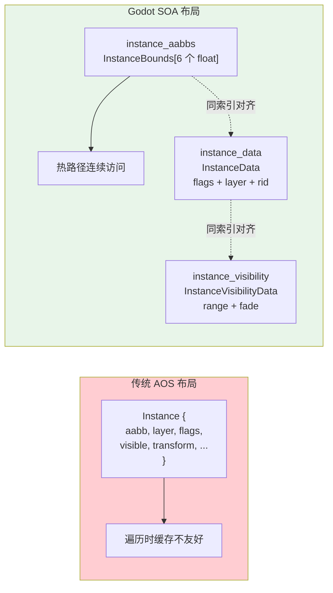
```mermaid
flowchart LR
    subgraph Traditional["传统 AOS 布局"]
        A1["Instance {<br>aabb, layer, flags,<br>visible, transform, ...<br>}"] --> A2["遍历时缓存不友好"]
    end

    subgraph GodotSOA["Godot SOA 布局"]
        B1["instance_aabbs<br>InstanceBounds[6 个 float]"] --> B2["热路径连续访问"]
        B3["instance_data<br>InstanceData<br>flags + layer + rid"]
        B4["instance_visibility<br>InstanceVisibilityData<br>range + fade"]
        B1 -.->|"同索引对齐"| B3
        B3 -.->|"同索引对齐"| B4
    end

    style Traditional fill:#ffcdd2
    style GodotSOA fill:#e8f5e9
```

## 4. 空间索引：DynamicBVH

### 4.1 为什么不用八叉树

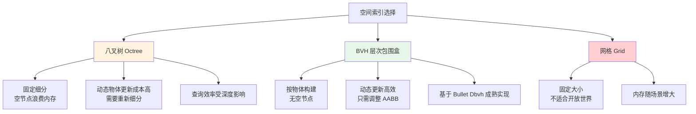
```mermaid
flowchart TD
    A["空间索引选择"] --> B["八叉树 Octree"]
    A --> C["BVH 层次包围盒"]
    A --> D["网格 Grid"]

    B --> B1["固定细分<br>空节点浪费内存"]
    B --> B2["动态物体更新成本高<br>需要重新细分"]
    B --> B3["查询效率受深度影响"]

    C --> C1["按物体构建<br>无空节点"]
    C --> C2["动态更新高效<br>只需调整 AABB"]
    C --> C3["基于 Bullet Dbvh 成熟实现"]

    D --> D1["固定大小<br>不适合开放世界"]
    D --> D2["内存随场景增大"]

    style C fill:#e8f5e9
    style B fill:#fff3e0
    style D fill:#ffcdd2
```

### 4.2 DynamicBVH 查询能力

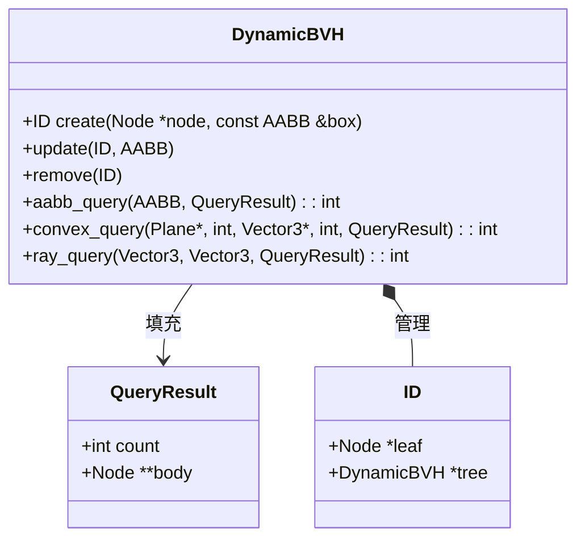
```mermaid
classDiagram
    class DynamicBVH {
        +ID create(Node *node, const AABB &box)
        +update(ID, AABB)
        +remove(ID)
        +aabb_query(AABB, QueryResult) : int
        +convex_query(Plane*, int, Vector3*, int, QueryResult) : int
        +ray_query(Vector3, Vector3, QueryResult) : int
    }

    class QueryResult {
        +int count
        +Node **body
    }

    class ID {
        +Node *leaf
        +DynamicBVH *tree
    }

    DynamicBVH --> QueryResult : 填充
    DynamicBVH *-- ID : 管理
```

**三种查询方式**：
- `aabb_query`：用于 `instances_cull_aabb` 公共 API
- `convex_query`：用于视锥剔除（视锥是凸多面体）
- `ray_query`：用于射线剔除 `instances_cull_ray`

## 5. 视锥剔除（Frustum Culling）

### 5.1 核心原理：PlaneSign 优化

传统 AABB-Frustum 测试需要遍历 8 个角点对每个平面测试，复杂度 O(8 × plane_count)。Godot 使用 **PlaneSign 预计算**优化：

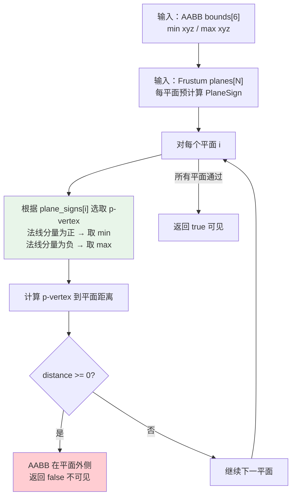
```mermaid
flowchart TD
    A["输入：AABB bounds[6]<br>min xyz / max xyz"] --> B["输入：Frustum planes[N]<br>每平面预计算 PlaneSign"]
    B --> C["对每个平面 i"]
    C --> D["根据 plane_signs[i] 选取 p-vertex<br>法线分量为正 → 取 min<br>法线分量为负 → 取 max"]
    D --> E["计算 p-vertex 到平面距离"]
    E --> F{"distance >= 0?"}
    F -->|"是"| G["AABB 在平面外侧<br>返回 false 不可见"]
    F -->|"否"| H["继续下一平面"]
    H --> C
    C -->|"所有平面通过"| I["返回 true 可见"]

    style D fill:#e8f5e9
    style G fill:#ffcdd2
```

### 5.2 PlaneSign 实现

```cpp
// renderer_scene_cull.h:134-155
struct PlaneSign {
    int signs[3];
    PlaneSign(const Plane &p_plane) {
        // 法线分量正负决定 p-vertex 选取
        signs[0] = p_plane.normal.x > 0 ? 0 : 3;  // 0→min.x, 3→max.x
        signs[1] = p_plane.normal.y > 0 ? 1 : 4;  // 1→min.y, 4→max.y
        signs[2] = p_plane.normal.z > 0 ? 2 : 5;  // 2→min.z, 5→max.z
    }
};
```

**原理**：对于凸多面体（视锥），AABB 与之相交的充要条件是 AABB 在所有平面的内侧。对每个平面，只需测试 AABB 上离平面最远的那个角点（p-vertex）。p-vertex 由平面法线方向决定：法线为正的轴取 min，法线为负的轴取 max。

### 5.3 in_frustum 实现

```cpp
// renderer_scene_cull.h:210-226
_ALWAYS_INLINE_ bool in_frustum(const Frustum &p_frustum) const {
    // 注释明确：这不是完整 SAT 测试，可能假阳性但不会假阴性
    for (uint32_t i = 0; i < p_frustum.plane_count; i++) {
        Vector3 min(
            bounds[p_frustum.plane_signs_ptr[i].signs[0]],  // p-vertex x
            bounds[p_frustum.plane_signs_ptr[i].signs[1]],  // p-vertex y
            bounds[p_frustum.plane_signs_ptr[i].signs[2]]); // p-vertex z

        if (p_frustum.planes_ptr[i].distance_to(min) >= 0.0) {
            return false;  // AABB 完全在该平面外侧
        }
    }
    return true;
}
```

**复杂度**：O(plane_count)，通常 6 个平面，只需 6 次距离计算。比 8 角点 × 6 平面 = 48 次快 8 倍。

### 5.4 视锥构建流程

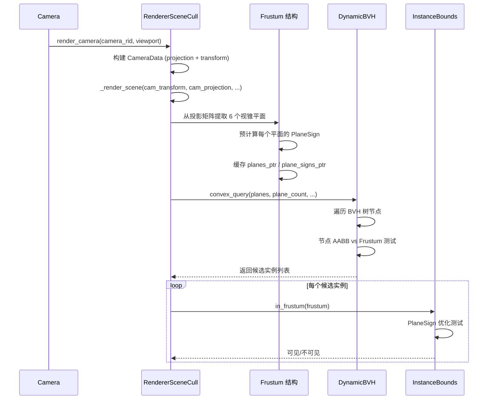
```mermaid
sequenceDiagram
    participant Cam as Camera
    participant RCull as RendererSceneCull
    participant Frustum as Frustum 结构
    participant BVH as DynamicBVH
    participant Instance as InstanceBounds

    Cam->>RCull: render_camera(camera_rid, viewport)
    RCull->>RCull: 构建 CameraData (projection + transform)
    RCull->>RCull: _render_scene(cam_transform, cam_projection, ...)

    RCull->>Frustum: 从投影矩阵提取 6 个视锥平面
    Frustum->>Frustum: 预计算每个平面的 PlaneSign
    Frustum->>Frustum: 缓存 planes_ptr / plane_signs_ptr

    RCull->>BVH: convex_query(planes, plane_count, ...)
    BVH->>BVH: 遍历 BVH 树节点
    BVH->>BVH: 节点 AABB vs Frustum 测试
    BVH-->>RCull: 返回候选实例列表

    loop 每个候选实例
        RCull->>Instance: in_frustum(frustum)
        Instance->>Instance: PlaneSign 优化测试
        Instance-->>RCull: 可见/不可见
    end
```

## 6. 遮挡剔除与 HZB

### 6.1 整体架构

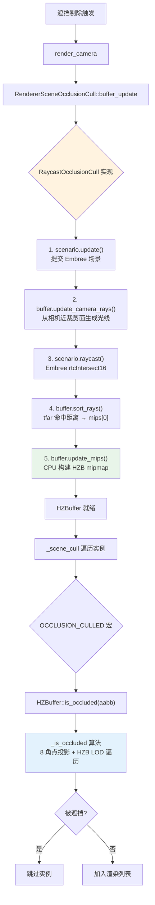
```mermaid
flowchart TD
    A["遮挡剔除触发"] --> B["render_camera"]
    B --> C["RendererSceneOcclusionCull::buffer_update"]
    C --> D{"RaycastOcclusionCull 实现"}

    D --> E["1. scenario.update()<br>提交 Embree 场景"]
    E --> F["2. buffer.update_camera_rays()<br>从相机近裁剪面生成光线"]
    F --> G["3. scenario.raycast()<br>Embree rtcIntersect16"]
    G --> H["4. buffer.sort_rays()<br>tfar 命中距离 → mips[0]"]
    H --> I["5. buffer.update_mips()<br>CPU 构建 HZB mipmap"]

    I --> J["HZBuffer 就绪"]

    J --> K["_scene_cull 遍历实例"]
    K --> L{"OCCLUSION_CULLED 宏"}
    L --> M["HZBuffer::is_occluded(aabb)"]
    M --> N["_is_occluded 算法<br>8 角点投影 + HZB LOD 遍历"]
    N --> O{"被遮挡?"}
    O -->|"是"| P["跳过实例"]
    O -->|"否"| Q["加入渲染列表"]

    style D fill:#fff3e0
    style I fill:#e8f5e9
    style N fill:#e3f2fd
```

### 6.2 HZB 数据结构

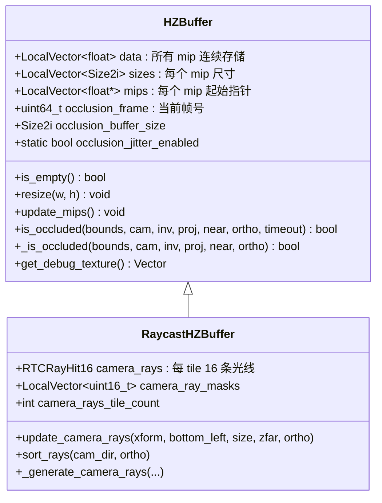
```mermaid
classDiagram
    class HZBuffer {
        +LocalVector~float~ data : 所有 mip 连续存储
        +LocalVector~Size2i~ sizes : 每个 mip 尺寸
        +LocalVector~float*~ mips : 每个 mip 起始指针
        +uint64_t occlusion_frame : 当前帧号
        +Size2i occlusion_buffer_size
        +static bool occlusion_jitter_enabled

        +is_empty() bool
        +resize(w, h) void
        +update_mips() void
        +is_occluded(bounds, cam, inv, proj, near, ortho, timeout) bool
        +_is_occluded(bounds, cam, inv, proj, near, ortho) bool
        +get_debug_texture() Vector
    }

    class RaycastHZBuffer {
        +RTCRayHit16 camera_rays : 每 tile 16 条光线
        +LocalVector~uint16_t~ camera_ray_masks
        +int camera_rays_tile_count
        +update_camera_rays(xform, bottom_left, size, zfar, ortho)
        +sort_rays(cam_dir, ortho)
        +_generate_camera_rays(...)
    }

    HZBuffer <|-- RaycastHZBuffer
```

### 6.3 HZB 内存布局

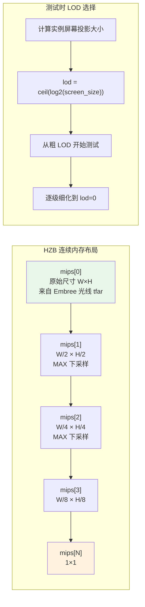
```mermaid
flowchart LR
    subgraph HZBLayout["HZB 连续内存布局"]
        M0["mips[0]<br>原始尺寸 W×H<br>来自 Embree 光线 tfar"]
        M1["mips[1]<br>W/2 × H/2<br>MAX 下采样"]
        M2["mips[2]<br>W/4 × H/4<br>MAX 下采样"]
        M3["mips[3]<br>W/8 × H/8"]
        MN["mips[N]<br>1×1"]

        M0 --> M1 --> M2 --> M3 --> MN
    end

    subgraph Sampling["测试时 LOD 选择"]
        S1["计算实例屏幕投影大小"]
        S2["lod = ceil(log2(screen_size))"]
        S3["从粗 LOD 开始测试"]
        S4["逐级细化到 lod=0"]
        S1 --> S2 --> S3 --> S4
    end

    style M0 fill:#e8f5e9
    style MN fill:#fff3e0
```

### 6.4 HZB Mipmap 生成（CPU 端）

**这是 Godot 与 UE 的关键差异**：Godot 的 HZB mipmap 完全在 CPU 端用双层 for 循环生成，没有 GPU compute shader。

```cpp
// renderer_scene_occlusion_cull.cpp:115-161
void HZBuffer::update_mips() {
    for (uint32_t mip = 1; mip < mips.size(); mip++) {
        int prev_w = sizes[mip - 1].x;
        int prev_h = sizes[mip - 1].y;
        int w = sizes[mip].x;
        int h = sizes[mip].y;

        for (int y = 0; y < h; y++) {
            for (int x = 0; x < w; x++) {
                int prev_x = x * 2;
                int prev_y = y * 2;

                // 取 4 个邻居的最大深度值
                float max_depth = mips[mip - 1][prev_y * prev_w + prev_x];

                #define CHECK_OFFSET(dx, dy) \
                    if (prev_x + dx < prev_w && prev_y + dy < prev_h) { \
                        max_depth = MAX(max_depth, \
                            mips[mip - 1][(prev_y + dy) * prev_w + (prev_x + dx)]); \
                    }

                CHECK_OFFSET(1, 0);  // 右
                CHECK_OFFSET(0, 1);  // 下
                CHECK_OFFSET(1, 1);  // 右下
                #undef CHECK_OFFSET

                mips[mip][y * w + x] = max_depth;
            }
        }
    }
}
```

**为什么取 MAX 而不是 MIN**：
- HZB 存储的是**遮挡体的最远深度**（保守策略）
- 测试时：若实例最近点深度 > HZB 存储深度 → 实例在遮挡体后方 → 被遮挡
- 取 MAX 保证不会错误剔除（假阴性），只会有假阳性（多画了一些被遮挡的物体）

### 6.5 深度来源：Embree 光线追踪

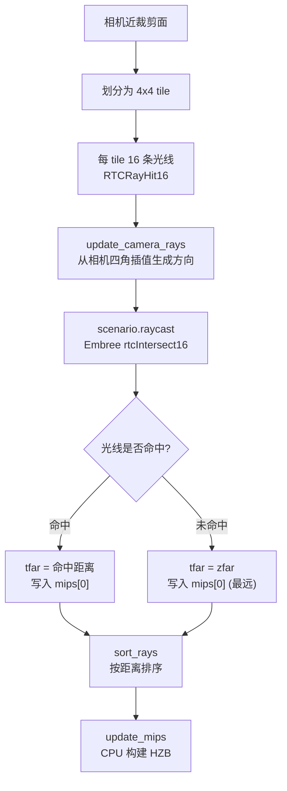
```mermaid
flowchart TD
    A["相机近裁剪面"] --> B["划分为 4x4 tile"]
    B --> C["每 tile 16 条光线<br>RTCRayHit16"]
    C --> D["update_camera_rays<br>从相机四角插值生成方向"]
    D --> E["scenario.raycast<br>Embree rtcIntersect16"]
    E --> F{"光线是否命中?"}
    F -->|"命中"| G["tfar = 命中距离<br>写入 mips[0]"]
    F -->|"未命中"| H["tfar = zfar<br>写入 mips[0] (最远)"]
    G --> I["sort_rays<br>按距离排序"]
    H --> I
    I --> J["update_mips<br>CPU 构建 HZB"]
```

**关键代码**：
```cpp
// raycast_occlusion_cull.cpp:161-182
void RaycastHZBuffer::sort_rays(const Vector3 &p_camera_dir, bool p_orthogonal) {
    float *mip0 = mips[0].ptrw();
    for (int i = 0; i < camera_rays_tile_count; i++) {
        for (int j = 0; j < 16; j++) {
            if (!(camera_ray_masks[i] & (1 << j))) continue;

            const RTCRayHit16 *rayhit = &camera_rays[i];
            float distance = rayhit->tfar[j];  // Embree 命中距离
            // ... 转换为视空间深度
            mip0[...] = distance;
        }
    }
}
```

### 6.6 _is_occluded 遮挡测试算法

这是 HZB 查询的核心算法，位于 `renderer_scene_occlusion_cull.h:56-155`：

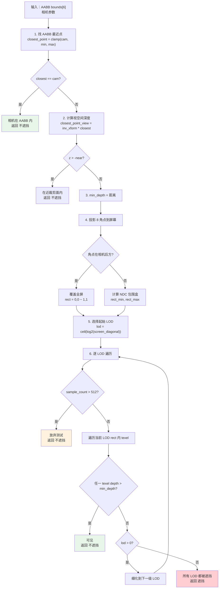
```mermaid
flowchart TD
    A["输入：AABB bounds[6]<br>相机参数"] --> B["1. 找 AABB 最近点<br>closest_point = clamp(cam, min, max)"]
    B --> C{"closest == cam?"}
    C -->|"是"| D["相机在 AABB 内<br>返回 不遮挡"]
    C -->|"否"| E["2. 计算视空间深度<br>closest_point_view = inv_xform * closest"]
    E --> F{"z > -near?"}
    F -->|"是"| G["在近裁剪面内<br>返回 不遮挡"]
    F -->|"否"| H["3. min_depth = 距离"]

    H --> I["4. 投影 8 角点到屏幕"]
    I --> J{"角点在相机后方?"}
    J -->|"是"| K["覆盖全屏<br>rect = 0,0 ~ 1,1"]
    J -->|"否"| L["计算 NDC 包围盒<br>rect_min, rect_max"]

    K --> M["5. 选择起始 LOD<br>lod = ceil(log2(screen_diagonal))"]
    L --> M

    M --> N["6. 逐 LOD 遍历"]
    N --> O{"sample_count > 512?"}
    O -->|"是"| P["放弃测试<br>返回 不遮挡"]
    O -->|"否"| Q["遍历当前 LOD rect 内 texel"]
    Q --> R{"任一 texel depth > min_depth?"}
    R -->|"是"| S["可见<br>返回 不遮挡"]
    R -->|"否"| T{"lod > 0?"}
    T -->|"是"| U["细化到下一级 LOD"]
    U --> N
    T -->|"否"| V["所有 LOD 都被遮挡<br>返回 遮挡"]

    style D fill:#e8f5e9
    style S fill:#e8f5e9
    style V fill:#ffcdd2
    style P fill:#fff3e0
```

**算法关键点**：
1. **8 角点投影**：将 AABB 8 个角点投影到屏幕，计算屏幕空间包围盒
2. **LOD 选择**：根据实例在屏幕的大小选择起始 LOD，大物体从粗 LOD 开始（快速判定），小物体从细 LOD 开始
3. **采样预算**：限制 512 次采样，防止超大面积物体导致过多查询
4. **逐级细化**：从粗到细，若粗 LOD 发现某 texel 深度 > min_depth 则直接判定可见

### 6.7 遮挡超时防抖动

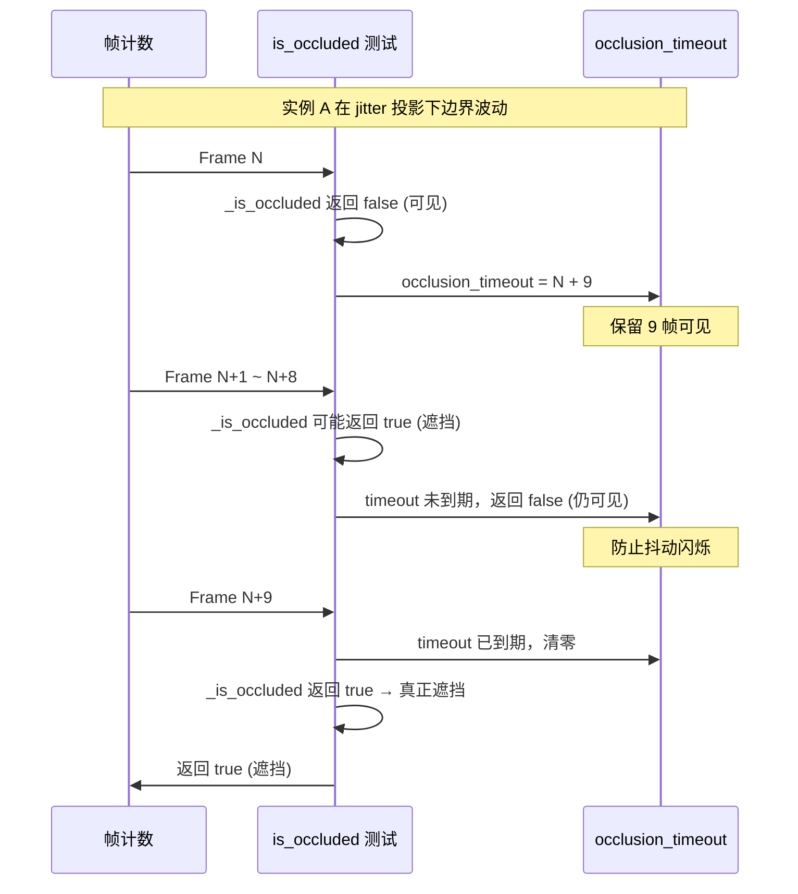
```mermaid
sequenceDiagram
    participant Frame as 帧计数
    participant Test as is_occluded 测试
    participant Timeout as occlusion_timeout

    Note over Frame,Timeout: 实例 A 在 jitter 投影下边界波动

    Frame->>Test: Frame N
    Test->>Test: _is_occluded 返回 false (可见)
    Test->>Timeout: occlusion_timeout = N + 9
    Note over Timeout: 保留 9 帧可见

    Frame->>Test: Frame N+1 ~ N+8
    Test->>Test: _is_occluded 可能返回 true (遮挡)
    Test->>Timeout: timeout 未到期，返回 false (仍可见)
    Note over Timeout: 防止抖动闪烁

    Frame->>Test: Frame N+9
    Test->>Timeout: timeout 已到期，清零
    Test->>Test: _is_occluded 返回 true → 真正遮挡
    Test->>Frame: 返回 true (遮挡)
```

## 7. 软光栅与软件可见性

### 7.1 Godot 不使用传统软光栅

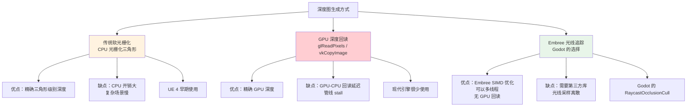
```mermaid
flowchart TD
    A["深度图生成方式"] --> B["传统软光栅化<br>CPU 光栅化三角形"]
    A --> C["GPU 深度回读<br>glReadPixels / vkCopyImage"]
    A --> D["Embree 光线追踪<br>Godot 的选择"]

    B --> B1["优点：精确三角形级别深度"]
    B --> B2["缺点：CPU 开销大<br>复杂场景慢"]
    B --> B3["UE 4 早期使用"]

    C --> C1["优点：精确 GPU 深度"]
    C --> C2["缺点：GPU-CPU 回读延迟<br>管线 stall"]
    C --> C3["现代引擎很少使用"]

    D --> D1["优点：Embree SIMD 优化<br>可以多线程<br>无 GPU 回读"]
    D --> D2["缺点：需要第三方库<br>光线采样离散"]
    D --> D3["Godot 的 RaycastOcclusionCull"]

    style D fill:#e8f5e9
    style B fill:#fff3e0
    style C fill:#ffcdd2
```

### 7.2 Embree 光线生成

```cpp
// raycast_occlusion_cull.cpp:115-159
void RaycastHZBuffer::_generate_camera_rays(
    const Transform3D &p_transform,
    const Vector3 &p_near_bottom_left,
    const Vector2 &p_viewport_size,
    real_t p_zfar,
    bool p_orthogonal) {

    // 每个像素对应一条光线，按 4x4 tile 组织 (RTCRayHit16)
    Vector3 bottom_left = p_near_bottom_left;
    Vector3 right = p_transform.basis.get_column(Vector3::AXIS_X);
    Vector3 up = p_transform.basis.get_column(Vector3::AXIS_Y);
    Vector3 forward = -p_transform.basis.get_column(Vector3::AXIS_Z);

    for (int tile = 0; tile < tile_count; tile++) {
        for (int i = 0; i < 16; i++) {
            // 计算像素在近裁剪面的位置
            Vector2 pixel_pos = ...;
            Vector3 ray_origin = bottom_left + right * pixel_pos.x + up * pixel_pos.y;

            if (p_orthogonal) {
                // 正交相机：所有光线方向相同
                ray.dir = forward;
            } else {
                // 透视相机：从相机出发
                ray.origin = camera_pos;
                ray.dir = (ray_origin - camera_pos).normalized();
            }
            ray.tfar = p_zfar;  // 最大距离
        }
    }
}
```

### 7.3 Embree 场景双缓冲

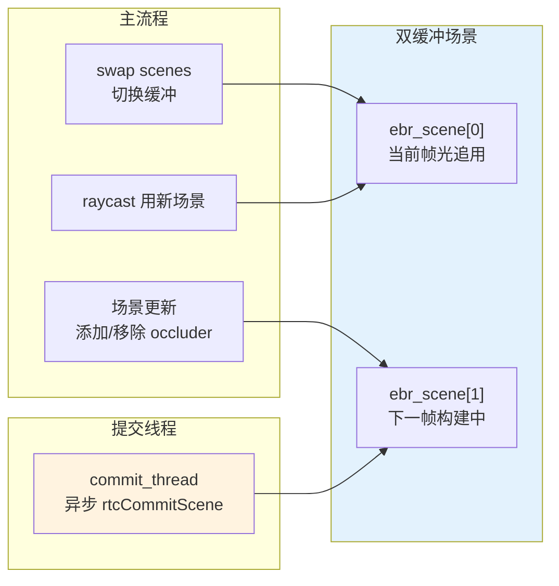
```mermaid
flowchart LR
    subgraph DoubleBuffer["双缓冲场景"]
        E1["ebr_scene[0]<br>当前帧光追用"]
        E2["ebr_scene[1]<br>下一帧构建中"]
    end

    subgraph CommitThread["提交线程"]
        CT1["commit_thread<br>异步 rtcCommitScene"]
    end

    subgraph MainFlow["主流程"]
        M1["场景更新<br>添加/移除 occluder"]
        M2["swap scenes<br>切换缓冲"]
        M3["raycast 用新场景"]
    end

    M1 --> E2
    CT1 --> E2
    M2 --> E1
    M3 --> E1

    style DoubleBuffer fill:#e3f2fd
    style CT1 fill:#fff3e0
```

## 8. 可见性范围剔除（Visibility Range Culling）

独立于 BVH 和遮挡剔除，基于距离的剔除：

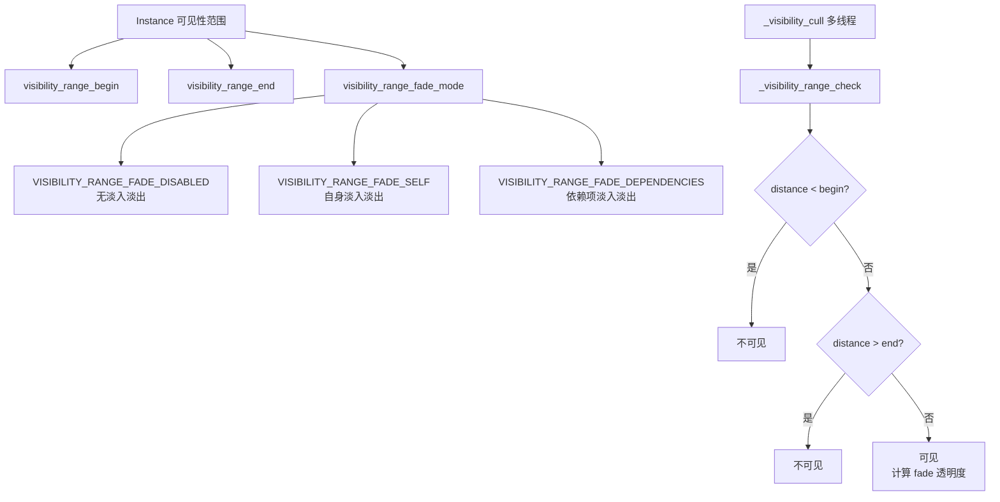
```mermaid
flowchart TD
    A["Instance 可见性范围"] --> B["visibility_range_begin"]
    A --> C["visibility_range_end"]
    A --> D["visibility_range_fade_mode"]

    D --> E["VISIBILITY_RANGE_FADE_DISABLED<br>无淡入淡出"]
    D --> F["VISIBILITY_RANGE_FADE_SELF<br>自身淡入淡出"]
    D --> G["VISIBILITY_RANGE_FADE_DEPENDENCIES<br>依赖项淡入淡出"]

    H["_visibility_cull 多线程"] --> I["_visibility_range_check"]
    I --> J{"distance < begin?"}
    J -->|"是"| K["不可见"]
    J -->|"否"| L{"distance > end?"}
    L -->|"是"| M["不可见"]
    L -->|"否"| N["可见<br>计算 fade 透明度"]
```

## 9. 完整剔除流程时序图

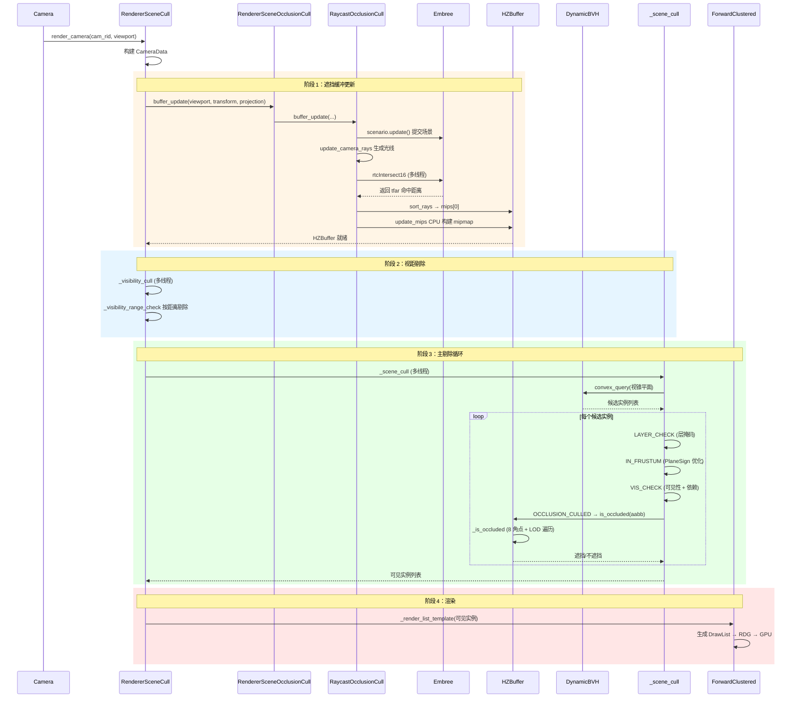
```mermaid
sequenceDiagram
    participant Cam as Camera
    participant RCull as RendererSceneCull
    participant Occ as RendererSceneOcclusionCull
    participant Raycast as RaycastOcclusionCull
    participant Embree as Embree
    participant HZB as HZBuffer
    participant BVH as DynamicBVH
    participant SceneCull as _scene_cull
    participant Render as ForwardClustered

    Cam->>RCull: render_camera(cam_rid, viewport)
    RCull->>RCull: 构建 CameraData

    rect rgb(255, 245, 230)
        Note over RCull,HZB: 阶段 1：遮挡缓冲更新
        RCull->>Occ: buffer_update(viewport, transform, projection)
        Occ->>Raycast: buffer_update(...)
        Raycast->>Embree: scenario.update() 提交场景
        Raycast->>Raycast: update_camera_rays 生成光线
        Raycast->>Embree: rtcIntersect16 (多线程)
        Embree-->>Raycast: 返回 tfar 命中距离
        Raycast->>HZB: sort_rays → mips[0]
        Raycast->>HZB: update_mips CPU 构建 mipmap
        HZB-->>RCull: HZBuffer 就绪
    end

    rect rgb(230, 245, 255)
        Note over RCull,SceneCull: 阶段 2：视距剔除
        RCull->>RCull: _visibility_cull (多线程)
        RCull->>RCull: _visibility_range_check 按距离剔除
    end

    rect rgb(230, 255, 230)
        Note over RCull,Render: 阶段 3：主剔除循环
        RCull->>SceneCull: _scene_cull (多线程)
        SceneCull->>BVH: convex_query(视锥平面)
        BVH-->>SceneCull: 候选实例列表

        loop 每个候选实例
            SceneCull->>SceneCull: LAYER_CHECK (层掩码)
            SceneCull->>SceneCull: IN_FRUSTUM (PlaneSign 优化)
            SceneCull->>SceneCull: VIS_CHECK (可见性 + 依赖)
            SceneCull->>HZB: OCCLUSION_CULLED → is_occluded(aabb)
            HZB->>HZB: _is_occluded (8 角点 + LOD 遍历)
            HZB-->>SceneCull: 遮挡/不遮挡
        end

        SceneCull-->>RCull: 可见实例列表
    end

    rect rgb(255, 230, 230)
        Note over RCull,Render: 阶段 4：渲染
        RCull->>Render: _render_list_template(可见实例)
        Render->>Render: 生成 DrawList → RDG → GPU
    end
```

## 10. 宏定义剔除条件

```cpp
// renderer_scene_cull.cpp:2844-2853
#define HIDDEN_BY_VISIBILITY_CHECKS  (...)
#define LAYER_CHECK                  (cull_data.visible_layers & idata.layer_mask)
#define IN_FRUSTUM(f)                (cull_data.scenario->instance_aabbs[i].in_frustum(f))
#define VIS_RANGE_CHECK              (...)
#define VIS_PARENT_CHECK             (_visibility_parent_check(cull_data, idata))
#define VIS_CHECK                    (...)
#define OCCLUSION_CULLED             (cull_data.occlusion_buffer != nullptr && \
                                     !(idata.flags & FLAG_IGNORE_OCCLUSION_CULLING) && \
                                     cull_data.occlusion_buffer->is_occluded(...))

// 最终判定
if ((LAYER_CHECK && IN_FRUSTUM(cull_data.cull->frustum) && VIS_CHECK && !OCCLUSION_CULLED)
    || (idata.flags & FLAG_IGNORE_ALL_CULLING)) {
    // 实例可见，加入渲染列表
}
```

## 11. 剔除条件优先级

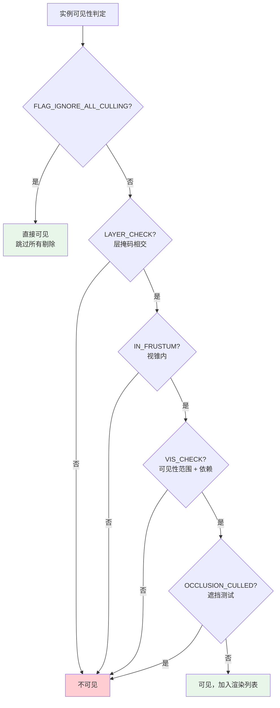
```mermaid
flowchart TD
    A["实例可见性判定"] --> B{"FLAG_IGNORE_ALL_CULLING?"}
    B -->|"是"| C["直接可见<br>跳过所有剔除"]
    B -->|"否"| D{"LAYER_CHECK?<br>层掩码相交"}
    D -->|"否"| E["不可见"]
    D -->|"是"| F{"IN_FRUSTUM?<br>视锥内"}
    F -->|"否"| E
    F -->|"是"| G{"VIS_CHECK?<br>可见性范围 + 依赖"}
    G -->|"否"| E
    G -->|"是"| H{"OCCLUSION_CULLED?<br>遮挡测试"}
    H -->|"是"| E
    H -->|"否"| I["可见，加入渲染列表"]

    style C fill:#e8f5e9
    style I fill:#e8f5e9
    style E fill:#ffcdd2
```

## 12. 多线程剔除

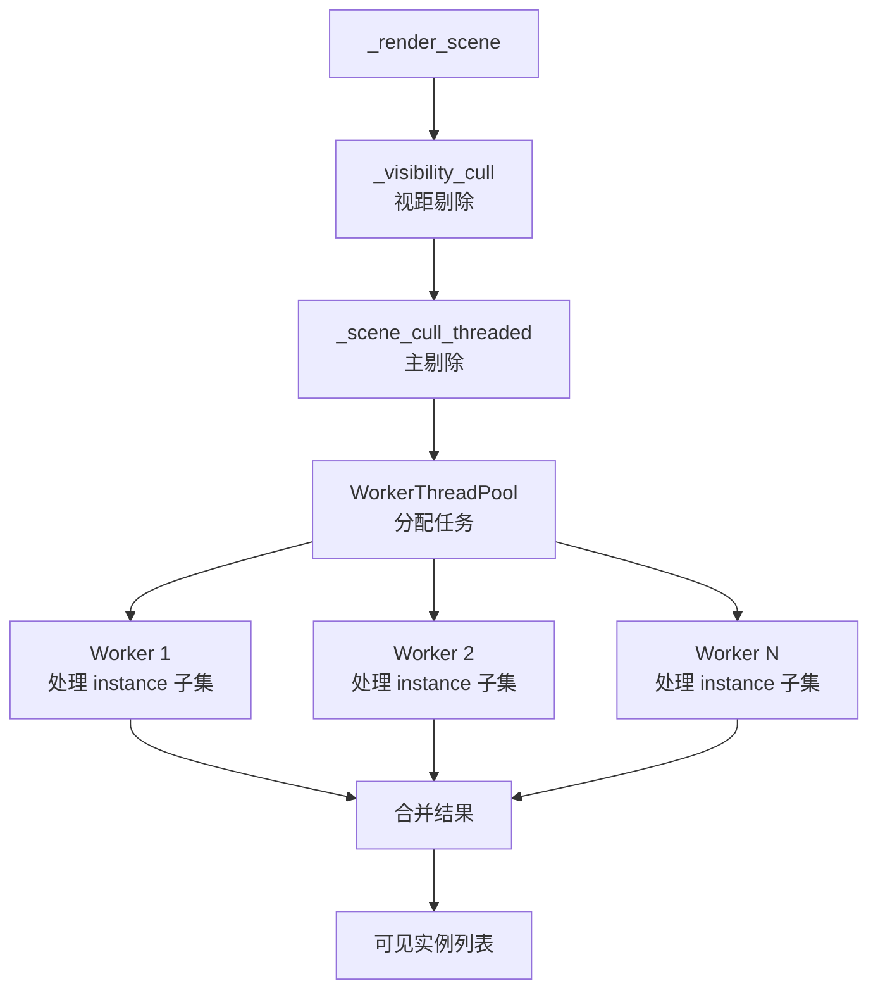
```mermaid
flowchart TD
    A["_render_scene"] --> B["_visibility_cull<br>视距剔除"]
    B --> C["_scene_cull_threaded<br>主剔除"]

    C --> D["WorkerThreadPool<br>分配任务"]
    D --> E["Worker 1<br>处理 instance 子集"]
    D --> F["Worker 2<br>处理 instance 子集"]
    D --> G["Worker N<br>处理 instance 子集"]

    E --> H["合并结果"]
    F --> H
    G --> H

    H --> I["可见实例列表"]
```

## 13. 与 UE 剔除系统对比

### 13.1 架构对比

| 维度 | Godot | UE |
|------|-------|-----|
| **空间索引** | DynamicBVH (Bullet Dbvh) | BVH (FBoundingVolumeHierarchy) |
| **视锥剔除** | PlaneSign p-vertex 优化 | 类似 p-vertex 优化 |
| **遮挡剔除** | Embree 光线追踪 + CPU HZB | GPU 软光栅化 + GPU HZB (HZB compute shader) |
| **HZB 生成** | CPU 双层 for 循环 MAX 下采样 | GPU Compute Shader mipmap |
| **深度来源** | Embree rtcIntersect16 | GPU 深度图回读或软光栅 |
| **HZB 测试** | CPU LOD 遍历 512 采样预算 | GPU compute shader 批量测试 |
| **延迟** | 1-2 帧（Embree 异步 + 双缓冲） | 1 帧（GPU 管线） |
| **CPU 开销** | 高（Embree + CPU mipmap） | 低（GPU 处理） |
| **GPU 开销** | 无（不占用 GPU） | 中等（compute shader） |
| **精度** | 光线采样离散 | 像素级精确 |
| **依赖** | Intel Embree4 | 无外部依赖 |

### 13.2 HZB 生成方式对比

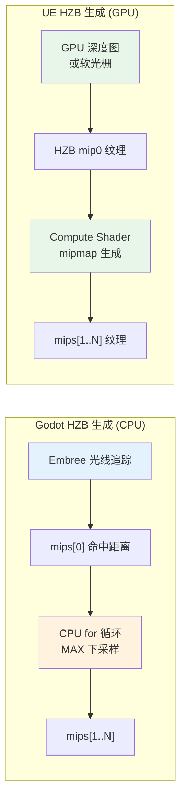
```mermaid
flowchart LR
    subgraph GodotHZB["Godot HZB 生成 (CPU)"]
        GA["Embree 光线追踪"] --> GB["mips[0] 命中距离"]
        GB --> GC["CPU for 循环<br>MAX 下采样"]
        GC --> GD["mips[1..N]"]
    end

    subgraph UEHZB["UE HZB 生成 (GPU)"]
        UA["GPU 深度图<br>或软光栅"] --> UB["HZB mip0 纹理"]
        UB --> UC["Compute Shader<br>mipmap 生成"]
        UC --> UD["mips[1..N] 纹理"]
    end

    style GA fill:#e3f2fd
    style GC fill:#fff3e0
    style UA fill:#e8f5e9
    style UC fill:#e8f5e9
```

### 13.3 遮挡测试对比

| 维度 | Godot | UE |
|------|-------|-----|
| **测试位置** | CPU 端 | GPU compute shader |
| **测试方式** | 8 角点投影 + LOD 遍历 | AABB 投影 + HZB 采样 |
| **采样预算** | 512 次 | 无限制（GPU） |
| **批量测试** | ❌ 逐实例串行 | ✅ 批量 compute dispatch |
| **结果可用性** | 立即可用 | 需 GPU→CPU 回读 |

## 14. 优缺点分析

### 14.1 Godot 方案优点

```mermaid
flowchart TD
    A["Godot 剔除方案优点"] --> B1["无 GPU 占用<br>遮挡剔除不竞争 GPU 资源"]
    A --> B2["无 GPU-CPU 回读延迟<br>避免管线 stall"]
    A --> B3["跨平台一致<br>不依赖 GPU compute 能力"]
    A --> B4["结果立即可用<br>无需等待 GPU 完成"]
    A --> B5["Embree 高度优化<br>SIMD + 多线程"]

    style A fill:#e8f5e9
```

### 14.2 Godot 方案缺点

```mermaid
flowchart TD
    A["Godot 剔除方案缺点"] --> B1["CPU 开销大<br>Embree 光追 + CPU mipmap"]
    A --> B2["精度有限<br>光线采样离散，非像素级"]
    A --> B3["依赖 Embree<br>第三方库，平台兼容性"]
    A --> B4["无 GPU 加速<br>未利用 compute shader"]
    A --> B5["HZB mipmap 简单<br>无 SIMD 优化的双层循环"]
    A --> B6["遮挡测试串行<br>逐实例 CPU 测试，无批量"]

    style A fill:#ffcdd2
```

### 14.3 适用场景

| 场景 | Godot 方案 | UE 方案 |
|------|-----------|---------|
| **移动端** | ✅ 无 GPU 占用，但 Embree 不可用 | ✅ GPU compute 可用 |
| **Web** | ❌ Embree 不支持 WebAssembly | ⚠️ GPU compute 受限 |
| **PC 中小规模** | ✅ CPU 足够快 | ✅ GPU 更高效 |
| **PC 大规模** | ⚠️ CPU 可能瓶颈 | ✅ GPU 批量测试 |
| **主机** | ✅ 可用 | ✅ 最佳 |

## 15. 可能的改进方向

### 15.1 GPU HZB Compute Shader

```mermaid
flowchart TD
    A["改进：GPU HZB"] --> B["1. GPU 深度图生成"]
    A --> C["2. Compute Shader mipmap"]
    A --> D["3. GPU 批量遮挡测试"]

    B --> B1["使用现有深度缓冲<br>或软光栅化 occluder"]
    C --> C1["dispatch compute<br>每级 mip 一次"]
    D --> D1["实例 AABB 批量提交<br>compute shader 测试"]
    D --> D2["结果回读 CPU<br>或保留在 GPU"]

    style A fill:#e8f5e9
```

### 15.2 混合方案

```mermaid
flowchart TD
    A["混合遮挡剔除"] --> B{"平台支持?"}
    B -->|"GPU compute 可用"| C["GPU HZB 路径<br>深度回读 + compute mipmap"]
    B -->|"不可用"| D["Embree 路径<br>光线追踪 + CPU mipmap"]

    C --> E["PC / 主机"]
    D --> F["移动端 fallback"]

    style C fill:#e8f5e9
    style D fill:#fff3e0
```

## 16. 关键源码索引

| 类/方法 | 文件 | 行号 | 说明 |
|--------|------|------|------|
| `RendererSceneCull` | renderer_scene_cull.h | - | 主剔除类 |
| `Instance` | renderer_scene_cull.h | 401-616 | 实例数据结构 |
| `InstanceBounds` | renderer_scene_cull.h | 194-298 | SOA AABB + in_frustum |
| `InstanceData::Flags` | renderer_scene_cull.h | 258-278 | 剔除标志位 |
| `Frustum` | renderer_scene_cull.h | 157-192 | 视锥结构 |
| `PlaneSign` | renderer_scene_cull.h | 134-155 | p-vertex 预计算 |
| `Cull` / `CullData` | renderer_scene_cull.h | 1085-1147 | 剔除上下文 |
| `Scenario` | renderer_scene_cull.h | 326-360 | 场景 + BVH |
| `render_camera` | renderer_scene_cull.cpp | 2592 | 摄像机渲染入口 |
| `_render_scene` | renderer_scene_cull.cpp | 3192 | 场景渲染调度 |
| `_scene_cull` | renderer_scene_cull.cpp | 2816 | 核心剔除循环 |
| `_visibility_cull` | renderer_scene_cull.cpp | 2719 | 视距剔除 |
| `LAYER_CHECK` 等宏 | renderer_scene_cull.cpp | 2844-2853 | 剔除条件宏 |
| `HZBuffer` | renderer_scene_occlusion_cull.h | 42-203 | HZB 数据结构 |
| `HZBuffer::_is_occluded` | renderer_scene_occlusion_cull.h | 56-155 | 遮挡测试算法 |
| `HZBuffer::is_occluded` | renderer_scene_occlusion_cull.h | 172-197 | 带超时的包装 |
| `HZBuffer::resize` | renderer_scene_occlusion_cull.cpp | 55-113 | HZB 内存分配 |
| `HZBuffer::update_mips` | renderer_scene_occlusion_cull.cpp | 115-161 | CPU mipmap (MAX) |
| `RaycastOcclusionCull` | raycast_occlusion_cull.h | - | Embree 实现 |
| `RaycastHZBuffer` | raycast_occlusion_cull.h | 44-77 | 光追 HZB |
| `buffer_update` | raycast_occlusion_cull.cpp | 594-618 | 遮挡缓冲更新入口 |
| `_generate_camera_rays` | raycast_occlusion_cull.cpp | 115-159 | 光线生成 |
| `sort_rays` | raycast_occlusion_cull.cpp | 161-182 | tfar → mips[0] |
| `DynamicBVH` | dynamic_bvh.h | - | 空间索引（Bullet Dbvh） |

## 17. 总结

### 17.1 核心发现

| 问题 | 答案 |
|------|------|
| **有视锥剔除吗？** | ✅ 有，PlaneSign p-vertex 优化，O(plane_count) 复杂度 |
| **有遮挡剔除吗？** | ✅ 有，基于 HZB |
| **有软光栅吗？** | ❌ 没有传统软光栅，使用 Embree 光线追踪替代 |
| **有 HZB 吗？** | ✅ 有，但 CPU 端构建（非 GPU compute shader） |
| **HZB 深度来源** | Embree rtcIntersect16 光线命中距离 |
| **HZB mipmap 方式** | CPU 双层 for 循环取 MAX |
| **遮挡测试方式** | CPU 8 角点投影 + LOD 遍历 + 512 采样预算 |
| **空间索引** | DynamicBVH（基于 Bullet Dbvh），非八叉树 |

### 17.2 设计哲学

```mermaid
flowchart TD
    A["Godot 剔除设计哲学"] --> B1["CPU 优先<br>不依赖 GPU compute"]
    A --> B2["第三方库依赖<br>Embree 高性能光追"]
    A --> B3["保守策略<br>假阳性不假阴性"]
    A --> B4["防抖动<br>9 帧超时保护"]
    A --> B5["SOA 布局<br>缓存友好"]
    A --> B6["多线程<br>WorkerThreadPool 并行剔除"]

    style A fill:#e3f2fd
```

### 17.3 与用户预期的差异

| 用户预期 | 实际情况 |
|---------|---------|
| 八叉树 | DynamicBVH（Bullet Dbvh） |
| GPU HZB compute shader | CPU 双层 for 循环 |
| 软光栅化 | Embree 光线追踪 |
| GPU 深度回读 | Embree 光线命中距离 |
| GPU 批量遮挡测试 | CPU 逐实例 LOD 遍历 |

**最终结论**：Godot 的场景剔除系统采用了**CPU 优先 + Embree 光追**的独特方案，避免了 GPU-CPU 回读延迟，但代价是较高的 CPU 开销。对于需要极致性能的场景，可以考虑引入 GPU HZB compute shader 作为可选路径，但需要处理 GPU-CPU 同步和移动端兼容性问题。
