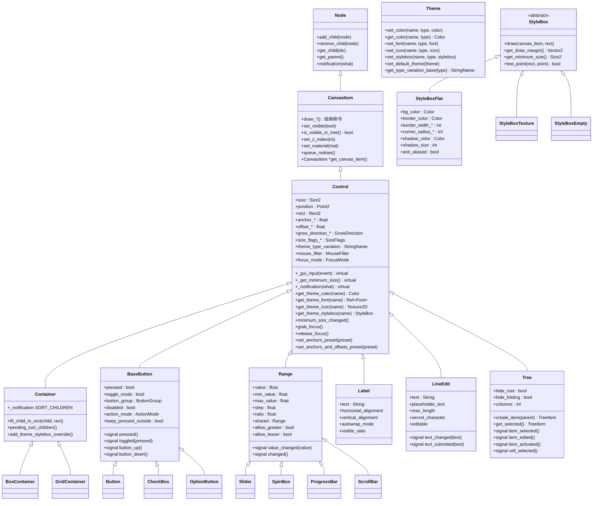
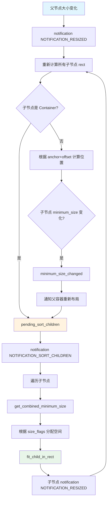
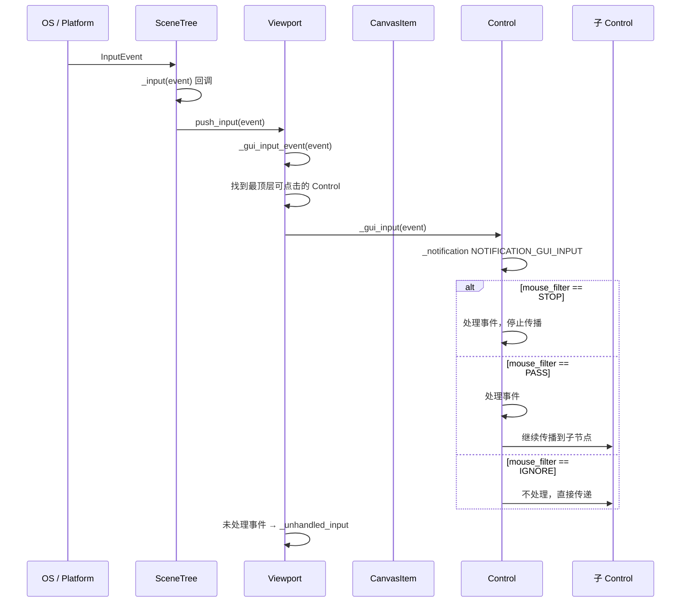
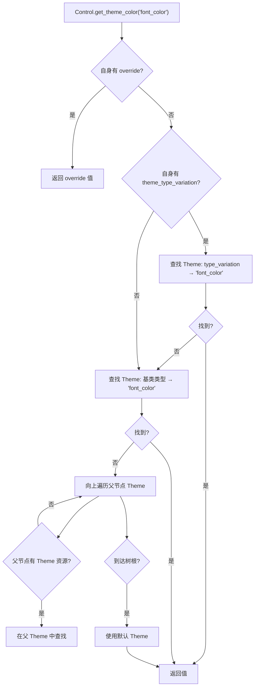
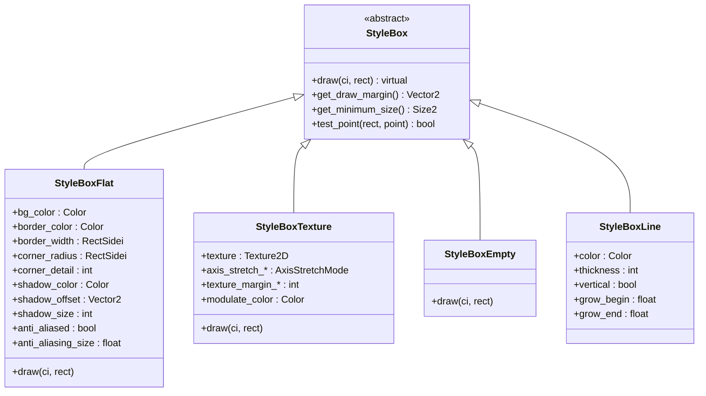
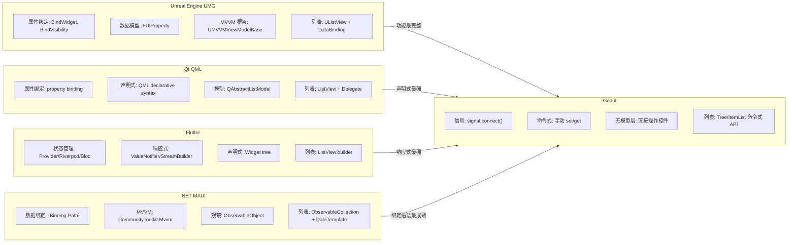

# Godot Engine UI 模块深度分析

## 1. 概述

Godot 的 UI 系统位于 `scene/gui/`，以 `Control` 为核心基类，通过 `CanvasItem` 继承链接入 2D 渲染系统。它采用**信号驱动 + 命令式 API** 的设计，与 UE UMG（属性绑定 + 声明式）或 Qt QML（声明式绑定）有本质区别。

本文涵盖：
1. 核心类层次与协作机制
2. 布局系统
3. 输入事件传播
4. 主题/样式系统
5. MVVM 支持度分析与缺失功能

## 2. 核心类层次

### 2.1 继承体系

```
Object
└── RefCounted
    └── Resource
        ├── Theme (主题资源)
        ├── StyleBox (样式框基类)
        │   ├── StyleBoxFlat (纯色+边框+圆角)
        │   ├── StyleBoxTexture (纹理样式)
        │   ├── StyleBoxEmpty (空样式)
        │   └── StyleBoxLine (线条样式)
        ├── Font (字体基类)
        │   ├── SystemFont
        │   ├── DynamicFont
        │   └── BitmapFont
        └── Shader

Object
└── Node
    └── CanvasItem (2D 渲染基类)
        ├── Node2D (2D 变换)
        │   └── ...
        └── Control (UI 控件基类)
            ├── Label
            ├── RichTextLabel
            ├── BaseButton
            │   ├── Button
            │   ├── CheckBox
            │   ├── CheckButton
            │   ├── LinkButton
            │   ├── MenuButton
            │   ├── OptionButton
            │   └── TextureButton
            ├── Range
            │   ├── ScrollBar
            │   ├── Slider
            │   ├── SpinBox
            │   ├── ProgressBar
            │   └── TextureProgressBar
            ├── LineEdit
            ├── TextEdit
            │   └── CodeEdit
            ├── ItemList
            ├── Tree
            ├── Container (容器基类)
            │   ├── BoxContainer
            │   │   ├── HBoxContainer
            │   │   └── VBoxContainer
            │   ├── GridContainer
            │   ├── MarginContainer
            │   ├── PanelContainer
            │   ├── CenterContainer
            │   ├── ScrollContainer
            │   ├── SplitContainer
            │   │   ├── HSplitContainer
            │   │   └── VSplitContainer
            │   ├── TabContainer
            │   ├── FlowContainer
            │   │   ├── HFlowContainer
            │   │   └── VFlowContainer
            │   ├── SubViewportContainer
            │   └── AspectRatioContainer
            ├── Popup
            │   └── PopupMenu
            ├── ColorPicker
            ├── FileDialog
            ├── GraphEdit
            │   └── GraphNode
            ├── Tabs
            ├── Separator
            ├── TextureRect
            ├── NinePatchRect
            ├── VideoStreamPlayer
            └── Window
                └── AcceptDialog
```

### 2.2 核心类图



### 2.3 Control 核心结构体与枚举

```cpp
// 布局锚点
enum Anchor {
    ANCHOR_BEGIN = 0,    // 基于父节点起始边
    ANCHOR_END = 1,      // 基于父节点终止边
};

// 增长方向
enum GrowDirection {
    GROW_DIRECTION_BEGIN,  // 向起始方向增长
    GROW_DIRECTION_END,    // 向终止方向增长
    GROW_DIRECTION_BOTH,   // 双向增长
};

// 尺寸标志
enum SizeFlags {
    SIZE_FILL = 1,        // 填充可用空间
    SIZE_EXPAND = 2,      // 扩展到剩余空间
    SIZE_EXPAND_FILL = 3, // 扩展 + 填充
    SIZE_SHRINK_BEGIN = 0,
    SIZE_SHRINK_CENTER = 4,
    SIZE_SHRINK_END = 8,
};

// 鼠标过滤
enum MouseFilter {
    MOUSE_FILTER_STOP,    // 拦截事件，不传递
    MOUSE_FILTER_PASS,    // 接收事件，继续传递
    MOUSE_FILTER_IGNORE,  // 忽略事件
};

// 焦点模式
enum FocusMode {
    FOCUS_NONE,           // 不可聚焦
    FOCUS_CLICK,          // 点击聚焦
    FOCUS_ALL,            // 点击+Tab均可聚焦
};
```

## 3. 布局系统

### 3.1 布局模型

Godot 使用**锚点+偏移**布局模型（类似 CSS absolute positioning + anchor）：

```
┌─────────────────────────────────────┐ Parent
│                                     │
│  offset_left   offset_top           │
│  ┌──────────────────────┐           │
│  │                      │           │
│  │      Control         │           │
│  │                      │           │
│  └──────────────────────┘           │
│        offset_right  offset_bottom  │
│                                     │
└─────────────────────────────────────┘

anchor_left / anchor_right : [0.0, 1.0] 相对父节点宽度的比例
anchor_top / anchor_bottom : [0.0, 1.0] 相对父节点高度的比例
offset_left/right/top/bottom : 锚点确定后的像素偏移
```

**关键属性关系**：

```
实际位置 = parent_size * anchor + offset

// 全拉伸（铺满父节点）:
anchor_left = 0, anchor_right = 1, anchor_top = 0, anchor_bottom = 1
offset_* = 0

// 居中固定大小:
anchor_left = anchor_right = 0.5
offset_left = -width/2, offset_right = width/2
```

### 3.2 布局计算流程



### 3.3 Container 布局算法

**BoxContainer**（HBox/VBox）：

```
1. 收集所有子节点的 minimum_size
2. 计算可用空间 = 自身大小 - 间距总和
3. 分配：
   a. 先给 SIZE_SHRINK 子节点分配 minimum_size
   b. 剩余空间按比例分配给 SIZE_EXPAND 子节点
   c. SIZE_FILL 子节点在分配区域内对齐（shrink_center/shrink_end）
4. fit_child_in_rect(child, allocated_rect)
```

**GridContainer**：

```
1. 按行列分组子节点
2. 每列最大 minimum_width = max(子节点.minimum_size.width)
3. 每行最大 minimum_height = max(子节点.minimum_size.height)
4. 按列均匀分配水平空间
5. 按行均匀分配垂直空间
```

## 4. 输入事件传播

### 4.1 事件传播链



### 4.2 焦点链

```
Tab 键切换焦点顺序:
  FocusMode::FOCUS_ALL 的控件按 scene tree 顺序排列
  find_next_valid_focus() / find_prev_valid_focus()

焦点传播:
  InputEventKey → Viewport::_gui_input_event
  → 当前焦点控件 _gui_input(key_event)
  → 如果未消费，传递给父控件
```

## 5. 主题与样式系统

### 5.1 主题查找级联



### 5.2 StyleBox 层次



## 6. 控件详细分类

### 6.1 按功能分类

| 类别 | 控件 | 说明 |
|------|------|------|
| **基础显示** | Label, RichTextLabel, TextureRect, NinePatchRect, VideoStreamPlayer | 静态内容展示 |
| **按钮** | Button, CheckBox, CheckButton, LinkButton, MenuButton, OptionButton, TextureButton | 用户点击交互 |
| **文本输入** | LineEdit, TextEdit, CodeEdit | 文本编辑 |
| **范围/数值** | Range, Slider, SpinBox, ProgressBar, ScrollBar, TextureProgressBar | 数值选择/展示 |
| **列表/树** | ItemList, Tree | 结构化数据展示 |
| **容器** | HBoxContainer, VBoxContainer, GridContainer, MarginContainer, PanelContainer, CenterContainer, ScrollContainer, SplitContainer, TabContainer, FlowContainer, SubViewportContainer, AspectRatioContainer | 布局管理 |
| **弹出** | Popup, PopupMenu, AcceptDialog | 临时浮层 |
| **复合** | FileDialog, ColorPicker, GraphEdit/GraphNode | 高级组合控件 |
| **窗口** | Window, WindowDialog | 独立窗口 |

### 6.2 信号与回调模式

Godot UI 采用**信号驱动**模式，而非数据绑定：

```gdscript
# 典型的"手动绑定"模式
func _ready():
    $Button.pressed.connect(_on_button_pressed)
    $LineEdit.text_changed.connect(_on_text_changed)
    $Slider.value_changed.connect(_on_slider_changed)

func _on_button_pressed():
    $Label.text = "Button was pressed!"

func _on_text_changed(new_text: String):
    $Label.text = new_text

func _on_slider_changed(value: float):
    $ProgressBar.value = value
```

**对比 MVVM 模式**（伪代码）：

```gdscript
# 理想中的 MVVM 模式（Godot 不支持）
@bind label.text to view_model.display_text
@bind progress_bar.value to view_model.progress
@bind line_edit.text to view_model.input_text  # 双向绑定
```

## 7. MVVM 支持度分析

### 7.1 MVVM 核心概念

```
┌──────────────┐     ┌──────────────┐     ┌──────────────┐
│    Model     │────→│  ViewModel   │────→│    View      │
│  (数据层)    │←────│  (逻辑层)    │←────│  (展示层)    │
│              │     │              │     │              │
│ - 数据实体   │     │ - 可观察属性 │     │ - 控件绑定   │
│ - 业务逻辑   │     │ - 命令       │     │ - 样式       │
│ - 持久化     │     │ - 数据转换   │     │ - 用户交互   │
└──────────────┘     └──────────────┘     └──────────────┘
                     ↑ 核心：            ↑ 核心：
                     Observable Property  Data Binding
                     INotifyPropertyChanged
                     Command Pattern
```

### 7.2 Godot 现有能力 vs MVVM 需求

| MVVM 需求 | Godot 现有能力 | 差距 |
|-----------|---------------|------|
| **可观察属性** | `Object::set()` + `emit_signal("changed")` | 无自动属性变化通知 |
| **数据绑定** | `signal.connect()` 手动连接 | 无声明式绑定语法 |
| **双向绑定** | 手动写两个 connect | 无自动双向同步 |
| **命令模式** | `Callable` 可模拟 | 无标准 ICommand 等价物 |
| **数据模板** | 无 | Tree/ItemList 用命令式 API 填充 |
| **值转换器** | 无 | 无 IValueConverter 等价物 |
| **验证** | 手动 | 无内置验证框架 |
| **导航** | `SceneTree.change_scene()` | 无路由框架 |
| **依赖注入** | `Engine.register_singleton()` | 无 DI 容器 |
| **响应式集合** | 无 | 无 ObservableCollection |
| **Computed Property** | 手动 `_get()` | 无自动依赖追踪 |
| **生命周期** | `_ready()` / `_notification()` | 无 View 生命周期钩子 |

### 7.3 与其他框架对比



### 7.4 详细缺失功能清单

#### 7.4.1 属性绑定系统（严重缺失）

```gdscript
# 需求：声明式属性绑定
# 期望：
Label.text := view_model.player_name
ProgressBar.value := view_model.health_ratio
TextureRect.visible := view_model.has_icon

# 当前 Godot 实现：
func _ready():
    view_model.player_name_changed.connect(func(v): $Label.text = v)
    view_model.health_ratio_changed.connect(func(v): $ProgressBar.value = v)
    view_model.has_icon_changed.connect(func(v): $TextureRect.visible = v)
```

**缺失**：
- 无 `:=` 绑定运算符
- 无 `Binding` 类
- 无 `BindingExpression` / `BindingPath` 解析器
- 无绑定生命周期管理（自动断开）

#### 7.4.2 可观察属性（严重缺失）

```gdscript
# 需求：属性变化时自动通知
# 期望：
@observable
var health: float = 100.0  # setter 自动 emit health_changed

# 当前 Godot 实现：
var health: float = 100.0:
    set(v):
        if health != v:
            health = v
            emit_signal("health_changed", v)
signal health_changed(value: float)
```

**缺失**：
- 无 `@observable` / `@notify_property_changed` 装饰器
- 无自动 `property_changed` 信号生成
- 无 `INotifyPropertyChanged` 接口
- 无依赖追踪（computed property 自动重算）

#### 7.4.3 数据模板（严重缺失）

```gdscript
# 需求：列表项模板化
# 期望（QML 风格）：
ListView {
    model: player_list
    delegate: PlayerCard {
        name_label.text := model.name
        health_bar.value := model.health
    }
}

# 当前 Godot 实现：
func update_player_list(players: Array):
    $ItemList.clear()
    for p in players:
        $ItemList.add_item(p.name)  # 仅字符串，无法自定义项模板
```

**缺失**：
- 无 `DataTemplate` / `ItemTemplate`
- 无 `DataTemplateSelector`
- 无列表控件的虚拟化 + 数据绑定
- ItemList 只支持简单文本/图标，不支持自定义控件模板
- Tree 需要手动 create_item / set_text / set_metadata

#### 7.4.4 值转换器（中等缺失）

```gdscript
# 需求：绑定时转换数据类型
# 期望：
ProgressBar.value := view_model.health  # float → float，不需要转换
Label.text := String(view_model.health)  # 需要 float → String 转换
ColorRect.color := health_to_color(view_model.health)  # 需要 float → Color 转换

# 当前 Godot：
# 手动在信号回调中转换
func _on_health_changed(v: float):
    $Label.text = str(v)
    $ColorRect.color = Color.RED if v < 30 else Color.GREEN
```

**缺失**：
- 无 `IValueConverter` / `TypeConverter`
- 无内联表达式绑定
- 无条件绑定（visible_if / enable_if）

#### 7.4.5 命令模式（中等缺失）

```gdscript
# 需求：按钮动作与 UI 解耦
# 期望（WPF/ICommand 风格）：
Button.command := view_model.attack_command
Button.enabled := view_model.attack_command.can_execute

# 当前 Godot：
func _ready():
    $AttackButton.pressed.connect(_on_attack)

func _on_attack():
    if can_attack():
        player.attack()
        $AttackButton.disabled = not can_attack()
```

**缺失**：
- 无 `ICommand` / `Command` 类
- 无 `can_execute` 自动更新
- 无 `CommandManager`

#### 7.4.6 响应式集合（严重缺失）

```gdscript
# 需求：列表数据变化自动更新 UI
# 期望：
var inventory: ObservableArray  # 自动通知 add/remove/clear
$InventoryList.items := inventory  # 自动同步

# 当前 Godot：
func _on_item_added(item):
    $ItemList.add_item(item.name)
func _on_item_removed(idx):
    $ItemList.remove_item(idx)
func _on_inventory_cleared():
    $ItemList.clear()
```

**缺失**：
- 无 `ObservableCollection` / `ObservableArray`
- 无 `INotifyCollectionChanged`
- 无列表控件的数据源绑定

#### 7.4.7 双向绑定（中等缺失）

```gdscript
# 需求：UI 变化自动写回 ViewModel
# 期望：
LineEdit.text <<>> view_model.player_name  # 双向绑定

# 当前 Godot：
func _ready():
    view_model.name_changed.connect(func(v): $LineEdit.text = v)
    $LineEdit.text_changed.connect(func(v): view_model.name = v)
    # 还需防止循环更新！
```

**缺失**：
- 无双向绑定语法
- 无循环更新防护
- 无绑定优先级（View→ViewModel vs ViewModel→View）

#### 7.4.8 导航/路由（中等缺失）

```gdscript
# 需求：声明式导航
# 期望：
Navigator.push("res://scenes/inventory.tscn", { category = "weapons" })
Navigator.pop()

# 当前 Godot：
get_tree().change_scene_to_file("res://scenes/inventory.tscn")
# 无参数传递机制
# 无导航栈
# 无转场动画
```

**缺失**：
- 无 `NavigationStack` / `Router`
- 无导航参数传递
- 无转场动画框架
- 无深层链接

#### 7.4.9 验证框架（轻微缺失）

```gdscript
# 需求：声明式输入验证
# 期望：
LineEdit.validators = [RequiredValidator.new(), MinLengthValidator.new(3)]
LineEdit.error_label = $ErrorLabel

# 当前 Godot：
func _on_text_changed(text: String):
    if text.is_empty():
        $ErrorLabel.text = "Field is required"
    elif text.length() < 3:
        $ErrorLabel.text = "Minimum 3 characters"
    else:
        $ErrorLabel.text = ""
```

**缺失**：
- 无 `Validator` 基类
- 无验证规则声明
- 无错误提示模板
- 无表单级验证

### 7.5 缺失功能严重度总览

| 功能 | 严重度 | 实现难度 | 影响范围 |
|------|--------|---------|---------|
| **可观察属性** | 🔴 严重 | 中 | 所有 MVVM 场景的基础 |
| **属性绑定** | 🔴 严重 | 高 | UI 与数据解耦的核心 |
| **响应式集合** | 🔴 严重 | 高 | 列表/表格场景必需 |
| **数据模板** | 🔴 严重 | 高 | 列表/树自定义展示 |
| **双向绑定** | 🟡 中等 | 中 | 表单场景 |
| **值转换器** | 🟡 中等 | 低 | 类型转换 |
| **命令模式** | 🟡 中等 | 低 | 按钮动作解耦 |
| **导航/路由** | 🟡 中等 | 中 | 多页面应用 |
| **验证框架** | 🟢 轻微 | 低 | 表单验证 |
| **依赖注入** | 🟢 轻微 | 低 | ViewModel 管理 |
| **Computed Property** | 🟡 中等 | 中 | 派生属性 |

## 8. Godot 现有"近似 MVVM"模式

### 8.1 信号 + Callable 模式

```gdscript
# 这是当前 Godot 最接近 MVVM 的模式
class_name PlayerViewModel
extends RefCounted

signal health_changed(new_value: float)
signal name_changed(new_value: String)
signal died

var _health: float = 100.0
var _player_name: String = ""

func set_health(v: float) -> void:
    if _health != v:
        _health = v
        health_changed.emit(v)
        if _health <= 0:
            died.emit()

func get_health() -> float:
    return _health

func set_player_name(v: String) -> void:
    if _player_name != v:
        _player_name = v
        name_changed.emit(v)

func get_player_name() -> String:
    return _player_name
```

```gdscript
# View 层手动绑定
extends Control

@onready var health_bar: ProgressBar = $HealthBar
@onready var name_label: Label = $NameLabel
@onready var attack_btn: Button = $AttackButton

var view_model: PlayerViewModel

func _ready():
    view_model = PlayerViewModel.new()
    view_model.health_changed.connect(_on_health_changed)
    view_model.name_changed.connect(_on_name_changed)
    view_model.died.connect(_on_died)
    attack_btn.pressed.connect(_on_attack_pressed)

func _on_health_changed(v: float) -> void:
    health_bar.value = v

func _on_name_changed(v: String) -> void:
    name_label.text = v

func _on_died() -> void:
    attack_btn.disabled = true

func _on_attack_pressed() -> void:
    view_model.set_health(view_model.get_health() - 10)
```

### 8.2 存在的问题

1. **样板代码多**：每个属性需定义 signal + setter + getter + connect 回调
2. **循环更新风险**：双向绑定需手动防护 `if _health != v`
3. **生命周期管理**：需手动 disconnect，否则内存泄漏
4. **无编译期检查**：信号名拼写错误运行时才报错
5. **无列表绑定**：Tree/ItemList 必须命令式填充

## 9. 社区 MVVM 方案

### 9.1 已有方案

| 方案 | 语言 | 核心思路 | 状态 |
|------|------|---------|------|
| **Godot MVVM** (GitHub) | GDScript | 提供 ObservableProperty + Binding 工具类 | 实验性 |
| **Godot Rx** | GDScript | 响应式扩展（Rx 模式） | 小众 |
| **C# ReactiveUI** | C# | .NET 生态的 Rx 框架适配 | 可用 |
| **C# CommunityToolkit.Mvvm** | C# | Microsoft MVVM Toolkit | 可用 |
| **Godot Data Binding** (Asset Library) | GDScript | 基于节点的属性绑定插件 | 简单 |

### 9.2 C# MVVM 可行性

Godot 的 C# 模块可以利用 .NET 生态：

```csharp
// 使用 CommunityToolkit.Mvvm
using CommunityToolkit.Mvvm.ComponentModel;
using CommunityToolkit.Mvvm.Input;

public partial class PlayerViewModel : ObservableObject
{
    [ObservableProperty]
    private float health = 100.0f;

    [ObservableProperty]
    private string playerName = "";

    [RelayCommand]
    private void Attack() => Health -= 10;

    partial void OnHealthChanged(float value)
    {
        if (value <= 0) Died?.Invoke(this, EventArgs.Empty);
    }

    public event EventHandler? Died;
}
```

```csharp
// View 层
public partial class PlayerView : Control
{
    private readonly PlayerViewModel _vm = new();

    public override void _Ready()
    {
        _vm.PropertyChanged += (s, e) =>
        {
            switch (e.PropertyName)
            {
                case nameof(_vm.Health):
                    GetNode<ProgressBar>("HealthBar").Value = _vm.Health;
                    break;
                case nameof(_vm.PlayerName):
                    GetNode<Label>("NameLabel").Text = _vm.PlayerName;
                    break;
            }
        };

        GetNode<Button>("AttackButton").Pressed += _vm.AttackCommand.Execute;
    }
}
```

**限制**：
- C# 的 INotifyPropertyChanged 可用，但 Godot 编辑器不支持 C# 属性绑定
- 仍需手动写 View 层的 PropertyChanged → Control 属性映射
- 无声明式 XAML 等价物

## 10. 关键源码索引

| 类别 | 路径 |
|------|------|
| Control 基类 | `scene/gui/control.h` / `control.cpp` |
| Container 基类 | `scene/gui/container.h` / `container.cpp` |
| BoxContainer | `scene/gui/box_container.h` |
| BaseButton | `scene/gui/base_button.h` |
| Range/Slider | `scene/gui/range.h` / `slider.h` |
| LineEdit | `scene/gui/line_edit.h` |
| TextEdit | `scene/gui/text_edit.h` |
| Tree | `scene/gui/tree.h` |
| ItemList | `scene/gui/item_list.h` |
| Theme | `scene/resources/theme.h` |
| StyleBox | `scene/resources/style_box.h` / `style_box_flat.h` |
| 信号系统 | `core/object/object.h` (SignalData, Connection) |
| 属性系统 | `core/object/object.h` (_set/_get, get_property_list) |
| CanvasItem | `scene/2d/canvas_item.h` |
| Viewport GUI | `scene/main/viewport.h` |
| 输入分发 | `scene/main/scene_tree.cpp` |

## 11. 总结

### 11.1 Godot UI 的强项

1. **丰富的控件集**：30+ 内置控件覆盖常见需求
2. **灵活的布局系统**：锚点+偏移模型比 CSS Grid 更直观
3. **主题系统**：全局一致的样式管理 + 继承级联
4. **信号系统**：松耦合的事件通信机制
5. **主题变体**：同一控件多种视觉风格
6. **StyleBox**：纯数据驱动的外观定义
7. **节点树**：天然的组合模式，控件即节点

### 11.2 Godot UI 的弱点

1. **无声明式数据绑定**：所有 UI 更新都是命令式
2. **无可观察属性**：属性变化需手动 emit_signal
3. **无数据模板**：列表/树必须命令式填充
4. **无响应式集合**：无 ObservableCollection 等价物
5. **无值转换器**：类型转换需手动处理
6. **无双向绑定**：需写两个 connect + 循环防护
7. **无命令模式**：按钮行为与 UI 未解耦
8. **无导航框架**：多页面应用缺少路由支持
9. **列表控件功能弱**：ItemList 仅支持简单文本/图标

### 11.3 MVVM 成熟度评级

```
Godot MVVM 成熟度：★☆☆☆☆ (1/5)

对比：
- UE UMG MVVM：    ★★★★☆ (4/5)
- Qt QML：         ★★★★★ (5/5)
- Flutter：        ★★★★☆ (4/5)
- .NET MAUI：      ★★★★★ (5/5)
- SwiftUI：        ★★★★☆ (4/5)
- Godot (GDScript)：★☆☆☆☆ (1/5)
- Godot (C#)：     ★★★☆☆ (3/5) ← 借助 .NET 生态
```

### 11.4 改进建议优先级

| 优先级 | 功能 | 理由 |
|--------|------|------|
| **P0** | 可观察属性 (`@observable`) | MVVM 的基础，没有它一切无从谈起 |
| **P0** | 属性绑定 (`Bind.property()`) | UI-数据解耦的核心机制 |
| **P0** | 响应式集合 (`ObservableArray`) | 列表场景是游戏 UI 最常见需求 |
| **P1** | 数据模板 (`DataTemplate`) | 让列表支持自定义控件项 |
| **P1** | 双向绑定 (`Bind.two_way()`) | 表单场景必备 |
| **P1** | 值转换器 (`IValueConverter`) | 类型安全绑定 |
| **P2** | 命令模式 (`ICommand`) | 按钮行为解耦 |
| **P2** | Computed Property | 派生属性自动更新 |
| **P2** | 导航/路由 | 多页面应用 |
| **P3** | 验证框架 | 表单验证 |
| **P3** | 依赖注入 | ViewModel 生命周期管理 |
